# 2024年最强Kali渗透教程／网络安全／kali破解／web安全／渗透测试／黑客教程 ／代码审计／DDoS攻击／漏洞挖掘／CTF - P20：14.linux网络配置 - 网络安全系统教学合集 - BV1Pe411C7Zb

好的，同学们这节课给大家讲解就是对应的神动S7的一个网络配置，还有微模虚拟机的一个网络配置啊。其实在对于微模虚拟机来说的话，它是分为三种网络模式。一个是NTNATT的话它是。在我们本地。

然后生成1个虚拟网段。那这个网段的话就会做1个NET的一个地址转换，然后可以去进行一个出网的一个操作。那这就相当于在我们本地的一个网段里面再生成了一个子网端。通过这个子网端把通过NATT协议。

把子网端的1个IP转为我们在物理机上面用到的这个网段的IP地址，然后去访问到公网地址。然后调节模式。这个桥节模式就相当于是在我们的一个内网，也就是局域网里面生成了一台机器，就是我们的虚拟机。

它就等于是在我们的一个内网环境里面出现一台新的机器来共。我们本地的1个DHCP服务器去进行一个获取IP地址，也就相当于在我们本地多出了一台机器来和我们一起分配1个IP地址。这是桥件模式的一个作用。

而仅主机模式和NAT模式是比较相似的，就是在我们本地生成一个虚拟网段，但是它没有NAT的一个功能，它就是无法去进行一个地址转换。那他没有办法去进行地址转换的话，就会导致它无法出网。

它就只能在它的一个网段里面，它虚拟出来的这一个网段里面去进行一个互相的访问，并不能去进行一个出网的一个操作。好，下面给大家去进行一个演示啊。

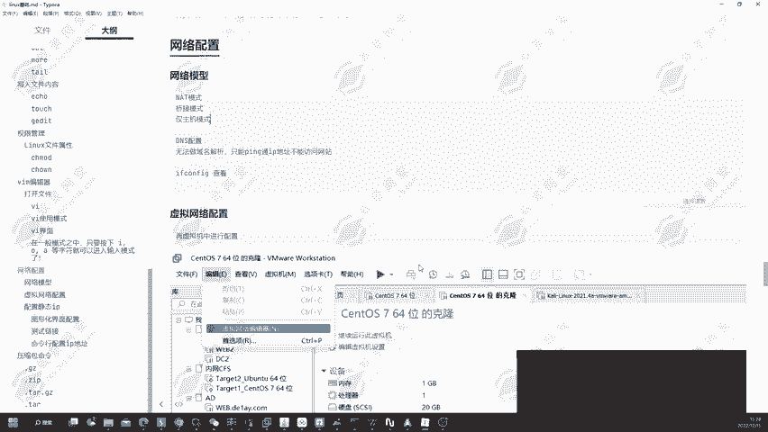

给大家去进行一个详细的讲解，让大家更好的理解。

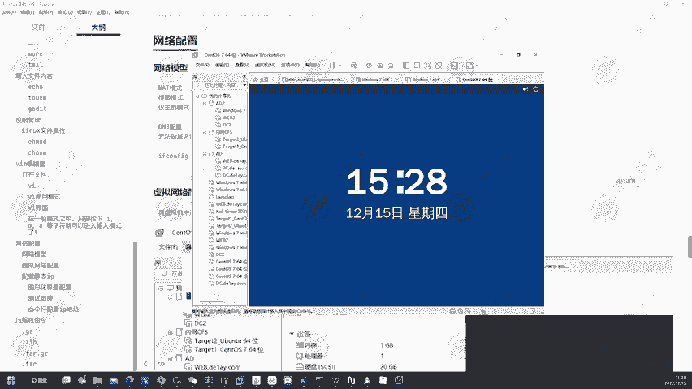

好，我们首先打开这一台机器，然后输入密码12346。然后在这里我们可以看到。现在它是使用的一个叫做调接模式。我们说呢首先来看一下它的一个。网卡模式。可以看到他现在哦他现在使用是NATT模式啊。

我刚才没有去进行个检查，他使用的是NATT模式。那NT尾式模式的话，我们来看一下它的个地址是多少。

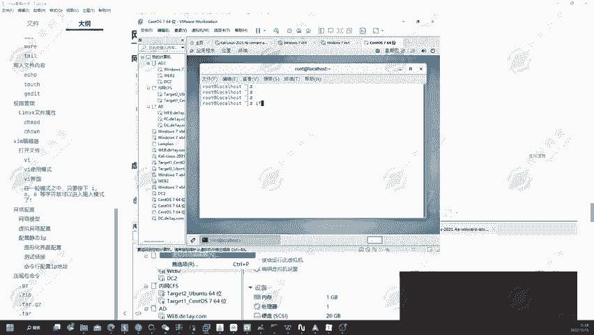

好，可以看到它没有IP地址，因为我们没有去进行一个连接。那我们现在来连接一下网络。好的，重新查看一下IP地址。可以看到它是192。168。234。5。那我们来看一下我们本地的一个地址。嗯。

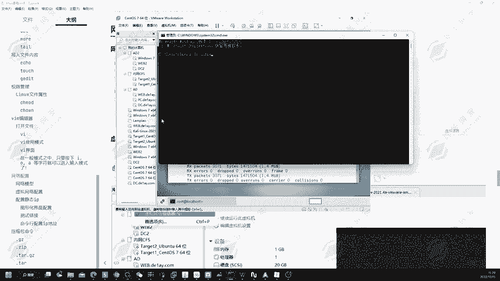

我们本地的地址是83。150，那和它不是一个网端之内的那为什么它能够出网呢？那这里啊就是要涉及到一个协议，叫做NAT协议。那学过网络的一个同学应该是能够明白的，他能为我们去作为一个地址转换。

把他这个192。168。234。5转换为192。168。83。150，然后去访问到互联网。然后我们可以看到啊，我这里其实是有一个vivo8的一个网卡，它的一个地址是192。168。234。1。

可它是处于一个网段以内的那为什么会有这张网卡呢？其实啊。在我们使用到NET模式的时候，它默认用的就是viM8的一个网卡。所以说啊在这一点。它就属于Vvo8的一个网段。

我们可以看到在这里我们可以点击编辑虚拟网络编辑器。嗯。好，打开了虚拟网络编辑器，我们可以看到NET模式，它默认的其实使用的是vivo8的一个网卡，可以看到名称vivo8的一个网卡。

所以说啊它和我们的vivo8的一个网卡，它是属于同一网段之内的，这就是第1个NET模式。然后我们可以看到第二个桥接模式。🤧哼。好，给它更改为调接模式。好，更改为抢镜模式之后，我们要在这里。

重新的去进行一个连接。🤧。好，连接完成之后，在这里我们重新要点击一下连接。现在我们再来看一下。好，他的地址没有改变，这是为什么呢？因为我在这里啊设置了一个静态IP。

那现在我们把静态IP给它去进行一个取消。好，改成DHCP自动获取。那我们现在再来看一下，再重新的去断开，然后再连接关闭，然后再连接。好，现在我们再来看一下它的个IP地址是不是会去进行一个改变。

可以看到它就变成了1求2。168。83。138了。为什么呢？这里啊就和刚才我们所讲到的。乔杰博士，它其实就是在我这一个网段里面虚拟出来了一台真正的一个主机。然后这个主机他肯定要去访问互联网。

他肯定要申请1个IP地址。然后他申请了IP地址啊，其实就是我们这一个网段的IP地址，也就是在这里可以看到。和我的这一个以太网适配器的一个网卡是处于同一网端的那这一个就叫做桥接模式。

这两个模式都是能够出网的那我们再来看到第三个模式。仅主机模式。然，给它改成仅主机模式。

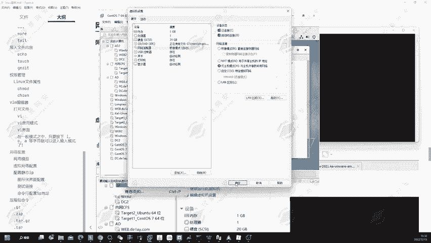

好，然后在这里我们重新的连接一下。好，连接完成之后，在这里我们点击连接。现在我们再来看一下，通过if卡 fake查看一下我们的个IP地址，可以看到它又变成了192。168。80。128的。

为什么会变成80。128呢？其实仅主机模式默认用的一个网卡，就是为mo咪一的一个网卡。那这个VV一的一个网卡，它的IP地址是192。168。80。1。所以说啊。他就从这一台地址。

这一个网段里面获取到了1个IP地址，192。168。80。128。然后和我的vivoE网卡是处在同一网段，那它能够出网吗？它不能够出网的。可以看到它是不能够出网的这就是金主机模式。

和我们的微voE网卡是处在同一网段。桥节模式和我们的以太网网卡处在同一网站，然后那1个NAT模式的话和我们的1个微默8网卡处在同一网段。然后调节模式和NATT模式是能够出网的。

金主模式的主金主机模式是不能够出网的。然后在什么场景下用什么的一个模式呢？这里就告诉大家。在我们的一个普通的一个局域网以内，在普通的一个局域网就是连接到路由器的。只要你的一个公司。

或者说你家里它的一个人员不是很多。我们知道就是1个IPV4地址。它是1个192。168，它是1个C类地址。那C类地址它是有I55个地址可以供我们去进254个地址可以供我们去进行一个使用的。

然后这么多的一个地址啊，可以供我们去进行个使用。其实啊。只要没有200多位同志同时同事或者说你的一个成员，然后再连接到同一台路由器的话，其实我们就可以使用到桥接模式。因为桥接模式。

它会占用到你本地局域网以内的1个IP地址。所以说啊只要人员不是很多的一个情况下，我们可以用到桥接模式。那如果说是在学校里面，然后校园网需要认证的话，推荐大家用到NAT模式。

因为桥接模式它是在你的一个网段里面生成一台机器。那如果说你需要去进行一个网络认证，也就是用自己的学号和自己的一个密码去进行认证的话，那桥件模式，你还是需要重新的认证一次。

在你的具体机里面要重新的认证一次。因为它是一台新的机器。所以说啊这个时候的话，我们的一个账号只能登录到一台设备。那这个时候我们使用桥件模式，很明显是上不了网的。所以说只能用到NATT模式。

NATT模式的话，它是和我们的一个主机用到的同1个IP地址出网的。所以说它并不需要去进行一个认证，它直接就可以去通过你这一台你这1IP地址去访问到互联网。在校园网需要认证的情况下。

推荐大家使用到NT模式。然后这一个微模一的一个网卡，也就是金主机模式，应该什么时候去进行使用呢？就是在我们要制作一个不出网环境的时候，我们就可以使用到微模一网卡去进行一个搭建。

这就三个网络模式的一个使用。🤧。

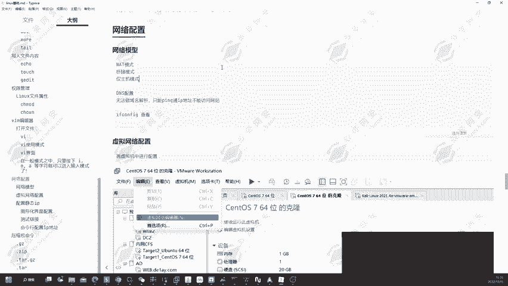

好，然后我们来看到。怎么去配置这一个虚拟网络呢？可以看到我们可以点击虚拟网络编辑器，然后在这里面选择不同的一个那调接模式的话，它是会让我们去选择调接到的一个网卡。

那这个网卡其实我们可以自己的去进行一个指定。那假设现在我们是连接的一个网线，我们要选择是哪一张网卡呢？

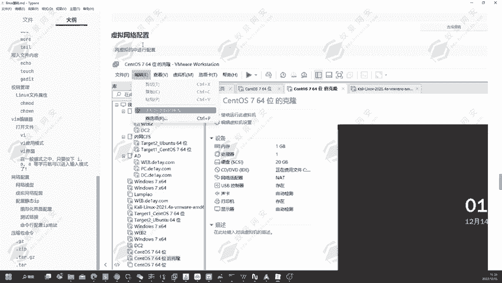

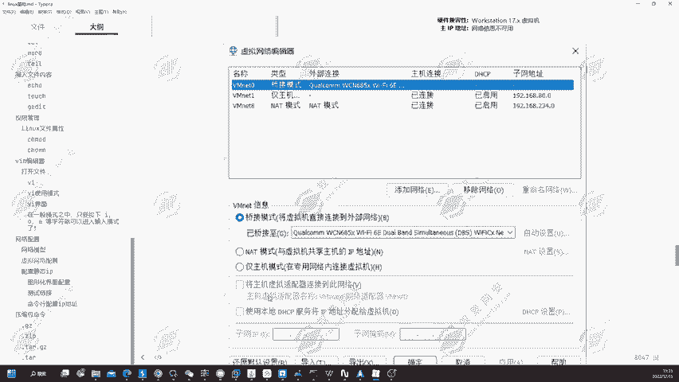

好，稍微等待一下，有点慢。好，出来了。我们就要在这里选择连接的USB接口的一个有线网网卡，有线网的一个接口啊。好，放不大。那我们就来看一下，在这里调节模式下可以看到选择连接到的外部网络。

那我现在连接的是有线，那就选择这个USB3。2，也就是我们的一个有线接口。那如果说我连接的是wifi呢，那我们就选择wifi的一个无线接口。那这里的话我选择第一个可以看到就选择这个接口就可以了。

当我们没有网络的时候，我们就可以考虑一下这一个问题，然后在这里去进行一个更换。好的，我们在这里应用保存。好，这就是对应的一个网络连接的一个设置啊。然后在我们的一个虚拟机里面。

其实我们可以去配置对应的一些IP地址。那我们可以配置IP地址的话，可以考虑到两种模式，一个是静态，一个是动态。那动态的话，在我们的一个虚拟网络编辑器里面可以去进行一个配置。可以看到我们选择不同的模式。

进主机模式可以看到它这里设置的一个子网IP是192。168。80。0。然后子网源码是这一个，然后我们要去进行一个设置，就是对我们的个虚拟机分配的1个IP去进行设置的话，我们可以在这里点击DHCP设置。

然后现在我这里是128到254。那现在我想给这一个虚拟机弄1个233的一个网一个网络。那我在这里就选择232选择2321233的1个IB地址啊，在这里起始地址232结束地址234。好的。

然后点击确定再点击应用。好，现在我们这也是仅主机模式，我们再重新的去进行一个连接。我们来看一下现在我的IP地址是多少。好的，我们现在再来看一下我的1个IP地址是多少。啊，他还没有获取到啊。🤧。断开连接。

重新的连接一下。好，然后我们在这也重新的去查看一下IP地址。可以看到它就会变成232了。啊，因为起始地址是S3I啊，所以说它直接变成了S3I了。我们把起始地址改成233的话，它就会变成233。

这就是我们能够通过DSCP的一个方式配置它的一个准确的IP地址。那我们现在改回来。通过DSCP的一个方式，那你的如果说是桥接的话。先应用一下。如果说你的是桥接的话，可以看到。

桥接不是由我们去进行一个分配IP的，所以说啊它没有DHCP的一个设置。那因为AT的话，我们刚才已经说过了。仅主机模式和AAT模式是比较相似的。所以说啊在这里同样的可以设置1个IP地址。

这就是我们通过到微末去设置我们的一个虚拟机的一个准确IP地址的一个方式。那同样的我们还可以在自己的一个虚拟机里面去进行一个设置。虚拟机里面也有，因为我们是图形化的一个界面。

所以说它也可以直接的在这里面去进行一个设置。好，我们在这里可以看到点击设置。IPV4去进行一个手动配置。192。168。80。231字源码255。255。0网关192。168。80。2。好的。

那我们就去继行一个应用。应用完成之后，我们重新的去关闭，然后再连接一下。现在我们来看一下我们的1个IP地址。可以看到它就变成了I31了。从这里我们就可以去进行一个设置自己的一个静态IP地址。

那现在我是仅主机模式，无法访问互联网。那现在我可以给它改一下，我要改成。我给他改成NT模式。好，改成NT模式之后，我们在这里点击连接，然后重新的去启动一下我们的一个网卡。因为我们刚才已经设置了静态IP。

但是我们的1个NAT的话，它的个静态IP啊是处于在234网段，所以说啊肯定是无法联网的那这个时候的话我们就要去进行一个设置。我们手动的去对对它的1个IP地址去进行一个更改，改成什么呢？改成234。点3。

然后网关改成234。2。然后应用。应用完成之后，我们现在在这里进行一个关闭重启。嗯，关闭重新连接。好的，再看一下我们的个IP地址。他现在就是234。3的，然后我们在这里也可以去骗一下百度。

可以看到百度也能够正常访问，那这就是配置静态IP的一个方式哎。这是通过图形化界面配置静态IP的一个方式。然后我们也可以通过到命令的一个方式去进行一个配置。也就是在命令行里面去进行一个配置。我们记住。

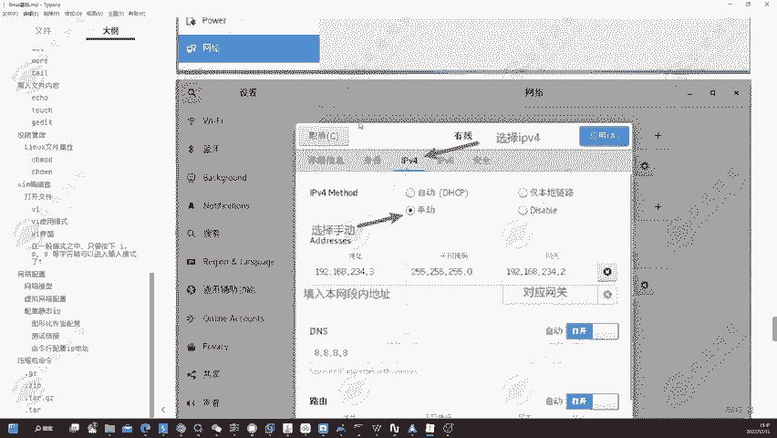

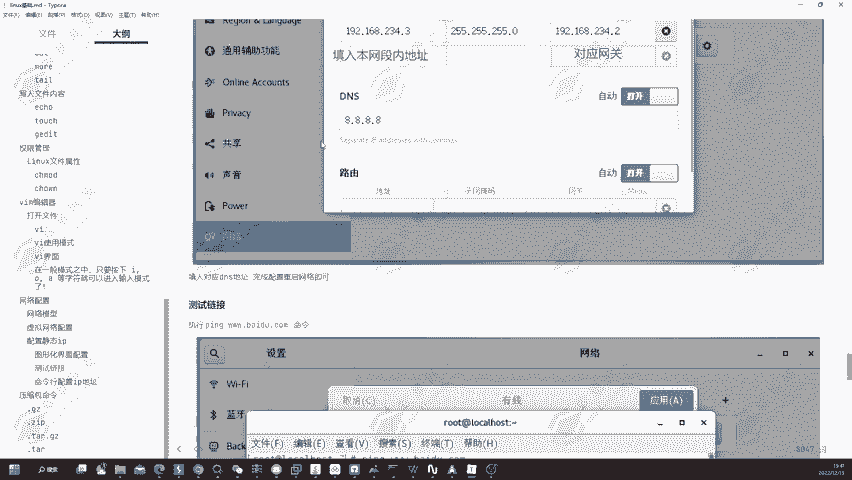

DNS地址是我们必须要去进行一个配置的。如果说没有配置DNS地址的话，它会出现无法解析目标服务器的一个问题。如果说DNS配置啊，我们没有去进行设置啊，它会出现无法解析服务器的一个问题啊。

这里的话我们要注意DNS我们配置为8。8。8。8，或者说114。114。114都是可以的。

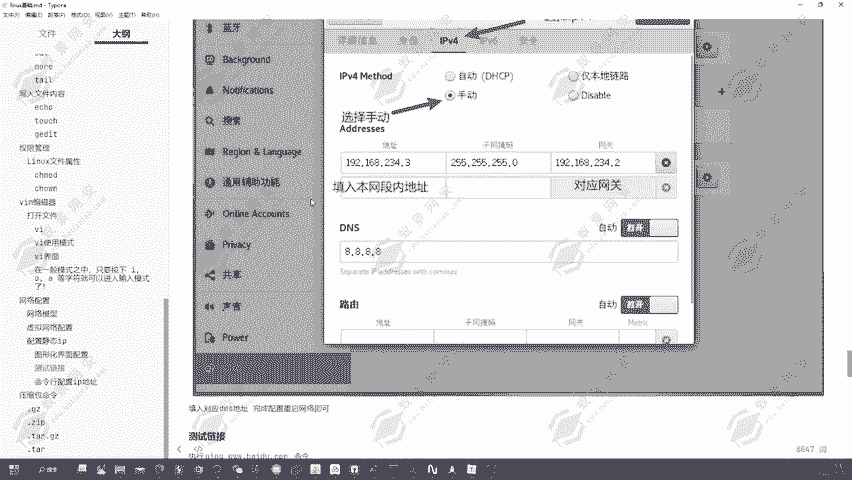

然后可以通过命令行的一个方式去配置到对应的IP地址。在这里我们可以修改一下这个复制一下这条命令，然后去进行个修改。

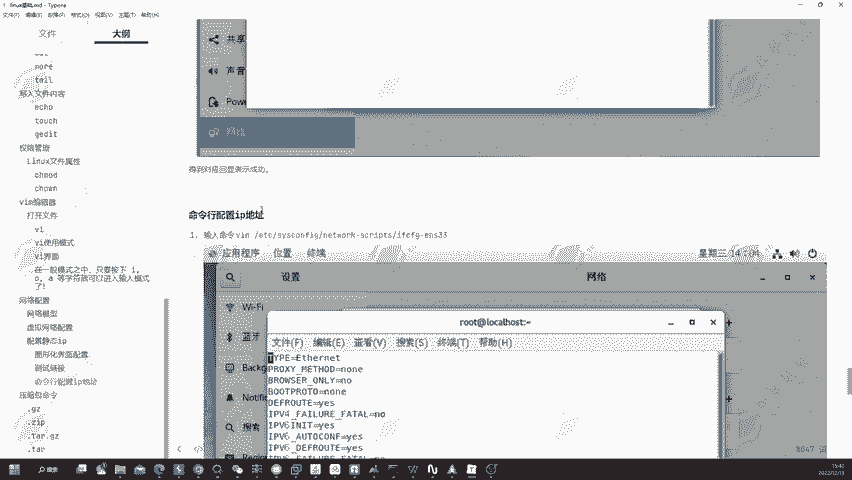

好，复制一下这条命令，然后再列上来。好的，没复制成功。那没有关系，我们在这里自动的手动去进行修改。ETC。at work啊，不对，是SYS。SYS可fi。嗯，然后let work。杠10块。好。

然后在这里我们修改一下衣幅C。EM33好，我们修改一下这个网卡的一个配置。那在这里我们可以看到，其实我们在。图形化界面配置的这一个静态IP之后，它这里的一个配置文件也会相应的去进行一个更改。

那现在我们给它改成自动。好，改成自动之后，我们再重新的退出一下，再去进进入。可以看到它刚才所有的一个设置就全部已经取消掉了。那我们要去进行设置的话，可以看到。它这里默认是一个D视CP。

那我们可以在这里可以看到更改为这个内容就可以了。我们把它更改为这个内容就可以了。可以看到DSCP改成STATIC改成静态。然后再把这里去进行一个填充，填入到对应的一个值。在这里我们就输入到。IPAD。

等于192。168。234。4。然后我们要去输入一个letworklet MAKE。MASK也就是钻研吧，255点255。255。0。然后这里我们要设置一个网关，网关的话GA。T1WAY。等于192。

168。点234。2，那这样我们就已经设置成功了，把DHCP改成静态，然后设置3个。第1个IPDD第二个let MAASK，然后再设置一个网关。然后如果说大家想要再设置一条的话，其实这一个可以设置。

也可以不设置，设置避免报错吧。然后我们也可以设置上去，等于24，其实就是子瓦掩码的一个位数，然后保存。好，保存退出，现在我们再来去重新的。关闭，然后再连接一下。好，再通过依付卡费告去进行查看。🤧嗯。

好的，这里的一个有线设置啊，它应用到了有线设置了。所以说。失败了，但是没有关系啊，我们重新的可以看到它这里还是一个自动啊。我们重新来去进行一个设置。因为我们不能够通过刚才那种方式去进行一个确认。

MASK。等于255。255。255。0。然后再给它配置一下PREFIX等于24。然后再设置一下网关GATE。WAY。等于19A。168点。234。2。好，保存退出。

然后在这里我们要运行一条命令叫做ssister，然后IESTRTlet work。点SER。好，回车可以看到它的网络连接会自动的去进行一个改变。那现在我们再点击连接。再查看一下自己IP地址。嗯。😊。

看样子只能重启去解决这个问题啊，我想着是不重启，然后能够解决的。其实在这里的话，它是需要重启才能够解决。那我们就必须重启一下，才能够去应用到我们的一个设站。

好的，我们再重新修改一下，然后重启吧，可以看到。嗯，他这里不重启的话，是无法应用的那我们现在保存一下，然后再重启。重启一下我们的计算机，然后等待它的一个配置完完成。🤧等待还有一个重启。嗯。😊，好的。

稍微等待一下。呃，这台计算机重启有点慢有点慢。

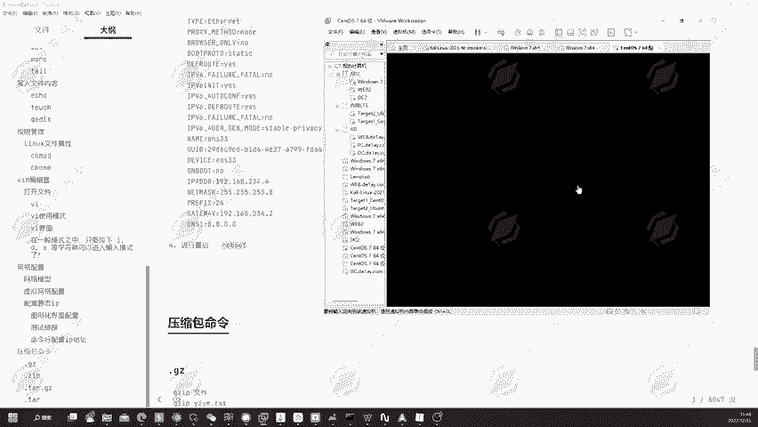

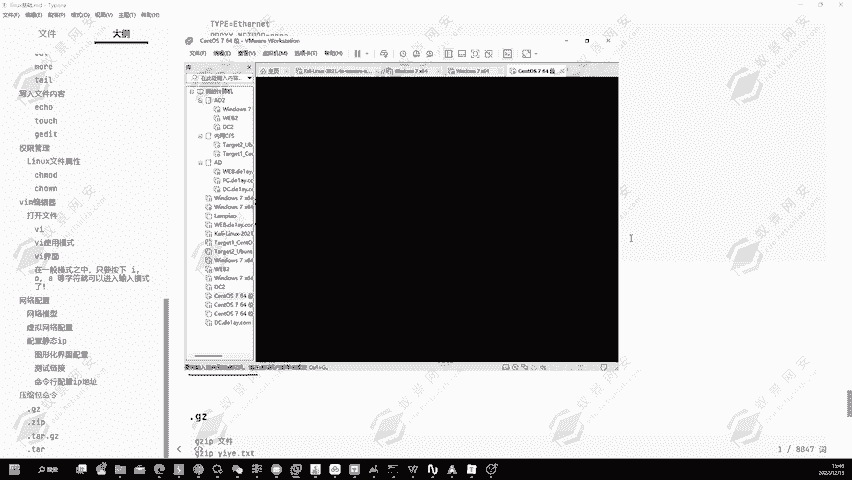

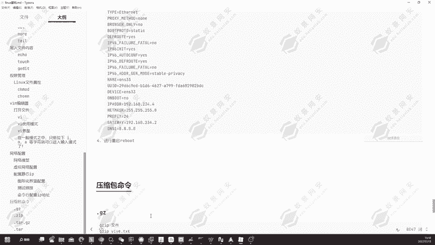

好，稍稍微有点缓慢，那我们再稍微等待一下。

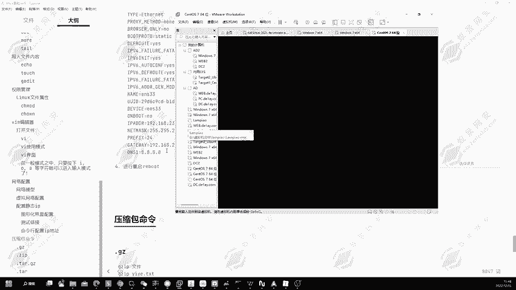

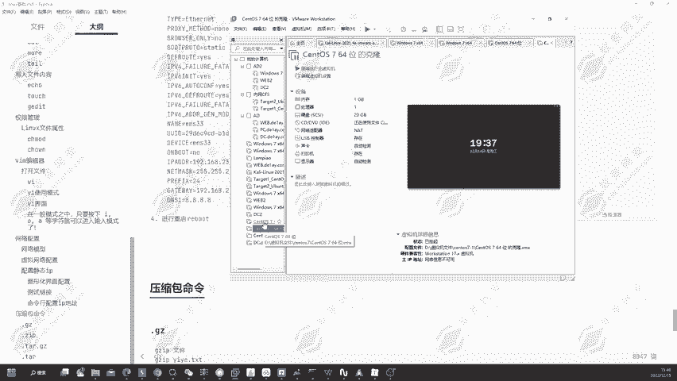

好的。他这边正在重启啊，重启结束，然后我们回车进入。

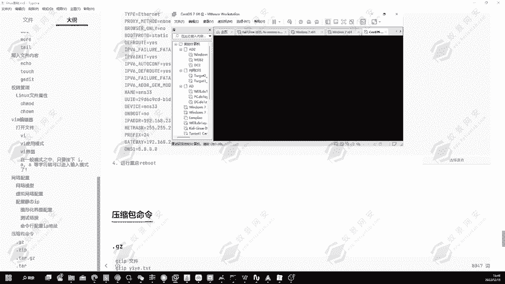

这里的一个重启速度啊，就跟你的一个电脑性能的有一定的一个关系。那我这里可能是开的东西太多了，然后导致它的一个重启比较缓慢。那没有关系啊，我们稍微等待一下，等待它的一个重启完成。好，重启完成了。

那现在我们再重新的去进行一个登录。嗯。😊。

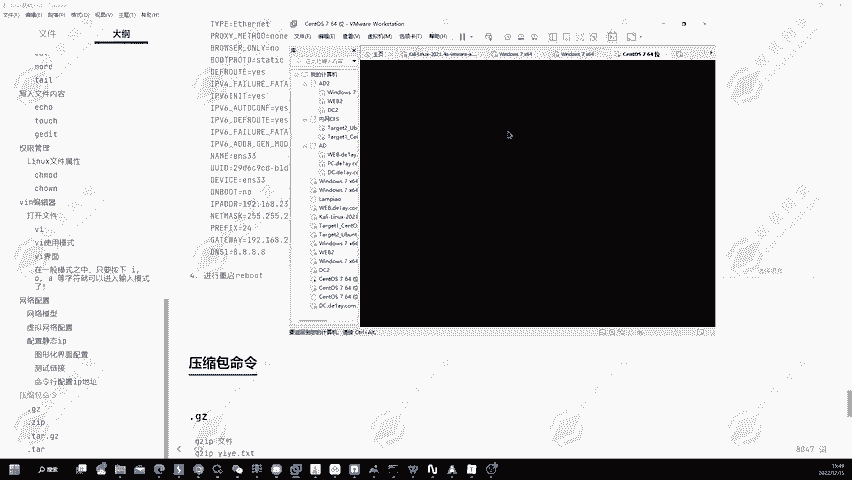

好的，现在我们在这里点击右击打开终端。啊，这里没有去进行一个连接啊。好，点击连接。它这又会变为234。129啊，它这个是。好，我们重新的来看一下。好，这边是配置的，没有什么问题。

这里配置是没有什么问题的。那为什么会出现这种情况呢？其实就是他这里去。

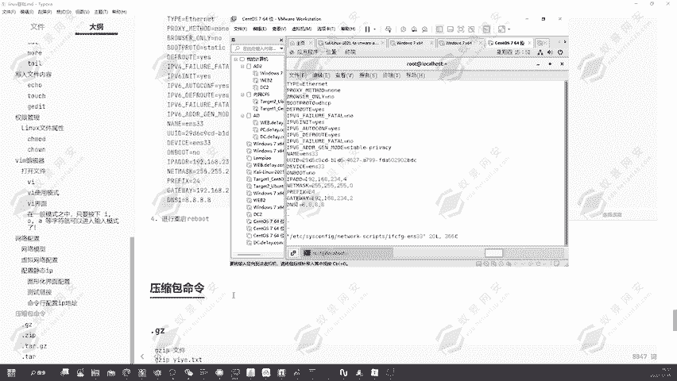

啊，我们这里也是哦，这里还是DHCP啊，他没有去更改。我给它改成静态。好改成静态，然后我们来看一下。呃，API。IPADDR好，我的一个配置出现了问题啊。我这里少打了一个R，然后导致出现了一个问题。

然后重新保存。然后重启一下我们的一个网络。好，网络重启完成，我们再点击连接。然后可以看到已经更改完成了，这就是我们这一节课的一个内容。现在给我大家讲解，就是压缩包的一个命令讲解。

