# 2024年最强Kali渗透教程／网络安全／kali破解／web安全／渗透测试／黑客教程 ／代码审计／DDoS攻击／漏洞挖掘／CTF - P21：15._linux压缩文件操作 - 网络安全系统教学合集 - BV1Pe411C7Zb

然，同学们这一课我要讲解就是压缩包的一个命令。呃，在我们的linux里面，它的压缩包不仅只于。ZZIP还有GZ的，可以看到。

那这一些还有对应的打包命令TR的那我们来看到这一个点击Z压缩包在linux里面应该怎么去进行一个处理。我们要去压缩文件，可以看到。嗯通过机ZIP介绍文件名来去进行一个压缩。

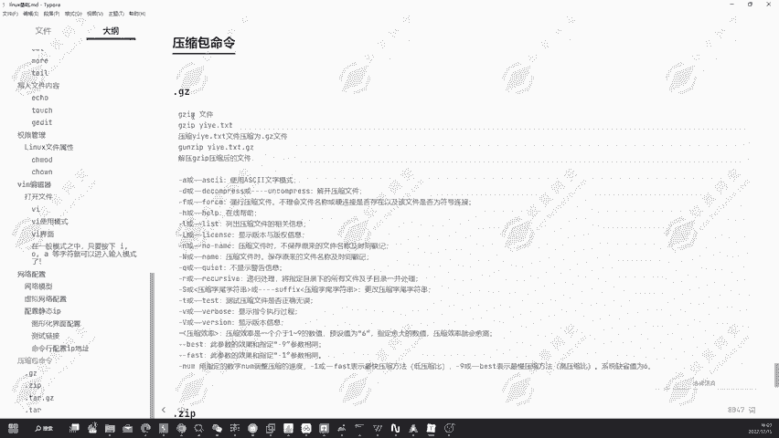

好，打开我们的机器。好的嗯嗯。可以看到这里有个一页点TST。那现在我们要对它去进行压缩，输入GZIP，然后压缩我们的一页点TST这个文件。可以看到在我们当心目录下。

它会生成1个1点TST点7GZ的一个压缩包文件。那这就是对应的GZIP压缩的一个命令。可以看到还有对应的一个参数啊，杠A使用到acsize文件模式，还有杠D解开压缩文件。可以看到还有杠F强行压缩文件。

不理会文件名称或应链接是否存在等这一些问题啊。还有列出压缩文件的详细信息，详细信息，可以看到有这么多的一些指令，可以根据我们去进行一个这么多参数，可以根据我们自己一的需求去进行一个填充。

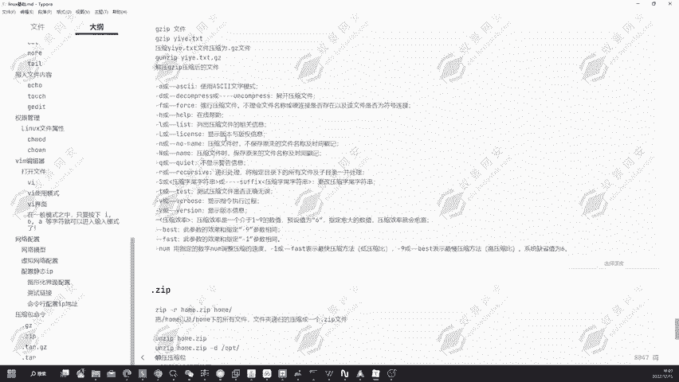

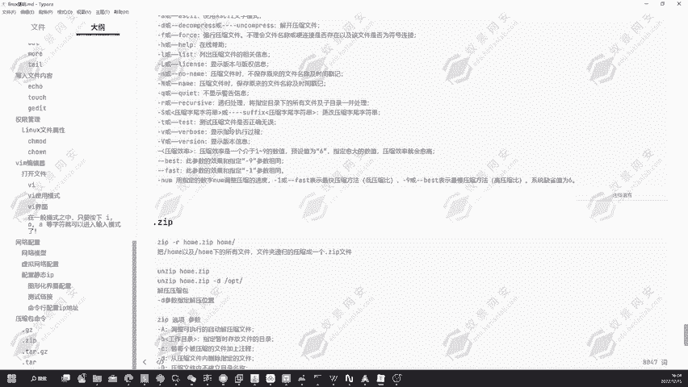

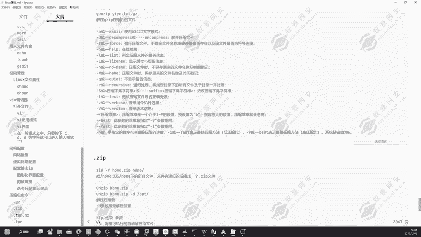

然后还有点ZIP的一个压缩包文件。点击IZIP的压缩文件，我们可以通过ZIP嘎的一个方式去进行一个。

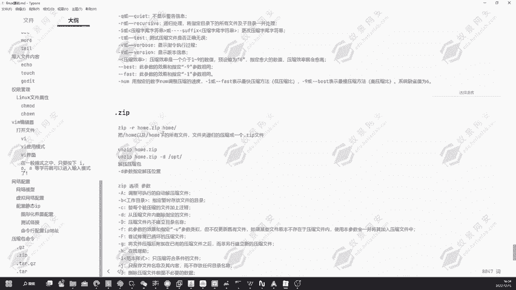

去进行一个压缩处理。那这个点击。

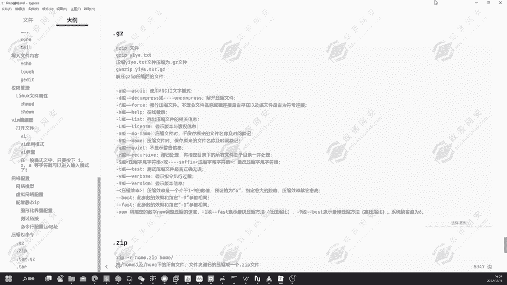

这个点击Z的压缩包文件其实可以通过。GMZIP，然后接上一页点TST点GZ就是压缩包的文件去进行一个解压。给到解压完成之后，我们的一页点TST就已经又回来了。这就是GZ压缩包文件的一个处理方式。

那下面我们来看到点ZIP的一个压缩包文件如何去进行一个处理。假设我们现在想要把号部落去进行一个打包，打包成。

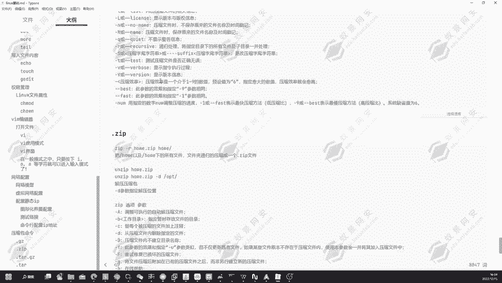

号点ZIP的一个压缩包文件。那下面我们去进行一个处理，输入到ZIP。然后ho。点ZIP，然后我们要打包的一个文件夹，就是ho文件夹回车可到。在我们当前录下就会生成一个ho点CIP的一个文件夹。

一个压缩包文件。那这就是我们把ho文件夹已经给去进行了一个压缩。🤧嗯。但是这个方式啊我们是不能够去压缩到它里面的所有的一个文件的。要压缩它所有的文件，我们得使用到杠R的一个参数。

那下面我们先对它去进行一个删除IF号我点击IP。然后现在我们要对它去进行一个递归的压缩杠R，然后ho。

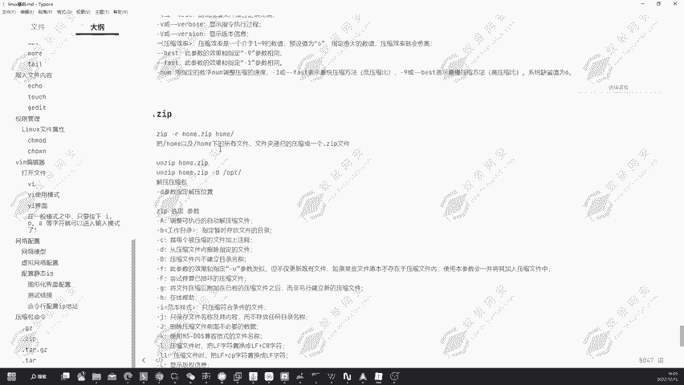

点ZIP。再接上ho的一个文件夹，回车可以看到ho文件夹所下所有的个文件都已经添加到我们的。钥缩包里面的它所有的文件嗯，它所有的文件，还有对应的目录全部添加到我们的一个ho点子IP里面了。

那这就是递归压缩的一个方式。嗯哼。然后解压的话可以看到，我们可以使用到按在IP去进行解压。那现在我们安装的这一个，我们现在已经。

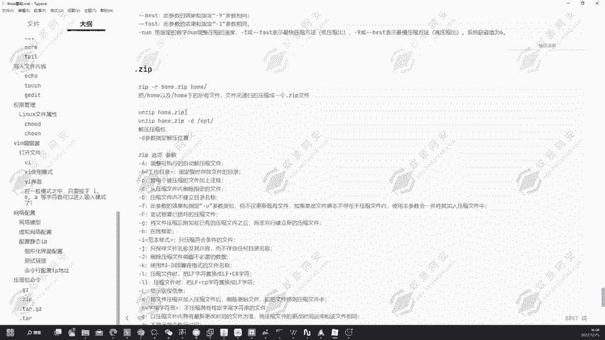

打包好了一个ho点子IP。那现在我们对它去进行一个解压。解压完成之后，在我们当前目录下会生成一个号目录。然后号目录里面可以看到有一页这个用户，那这里就是我们压缩好的一个文件内容。

然后我们也可以通过按在IP去指定到对应的一个目录去进行解压。可以看到我们可以指定对应的1个OPT目录去进行一个解压杠低。后第一步落去进行解压。好，下面我们给它回到我们的一个。啊。

他这边好像出现了一点小问题啊，我没有去指定到压缩忘文件。好，我们可以使用到按ZIP去使用到刚低的一个方式去进行一个减压操作。点ZIP，然后杠低OPT。好，下面我们可以去到OPD目录。

可以看到同样的也会生成一个号m的一个文件夹。那这就是ZIP的一个要素包处理的一个方式。同样的它也有很多的参数可以供我们去进行一个选择。

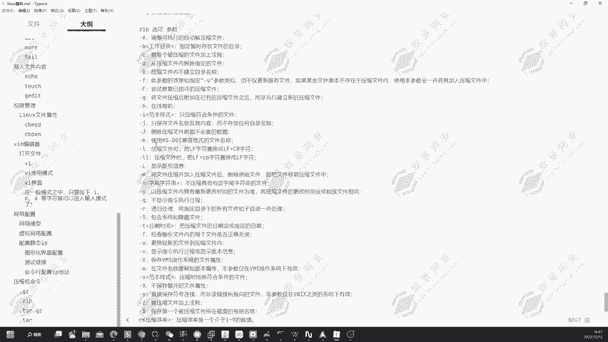

案子IP也有很多参数可以跟我们去进行一个选择，去进行一个解压缩的操作。

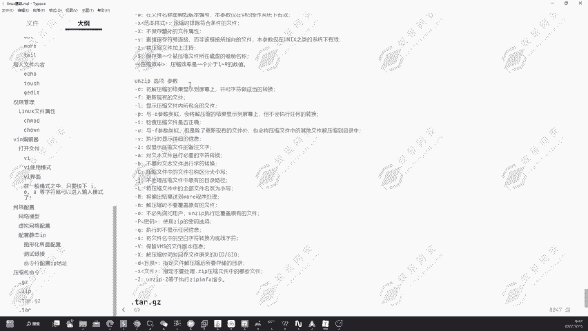

然后还有对应的TAR点击Z的一个文件。

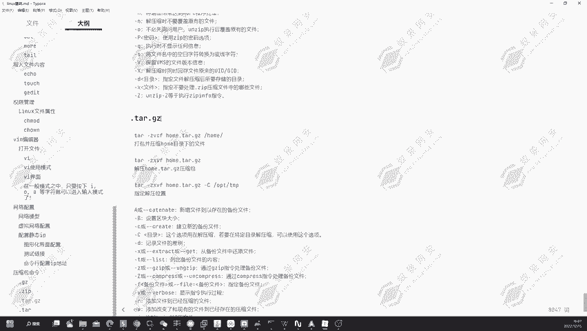

那这里的话其实使用的是TR去进行一个打包的一个操作。而打包的一个时间，打包的一个时候同时对它去进行压缩。可以看到通过TR杠ZVCF去进行一个打包。好，T二。杠ZVCF去进行打包，同时去进行压缩。

然后输入我们要打包好的一个文件名，点击Z点点TR。然后我们在这后面再加上我们要打包的目录换目录。回车可以看到已经打包完成了，在我们当前目录下会出现一个ho点TTR点击Z的一个压缩包文件。

那这就是我们通过TR打包好并压缩的一个目录文件。然后要去进行解压的话，我们只需要把对应的C改成X，也就是解压的一个操作，这就是它的一些参数啊，可以看到。

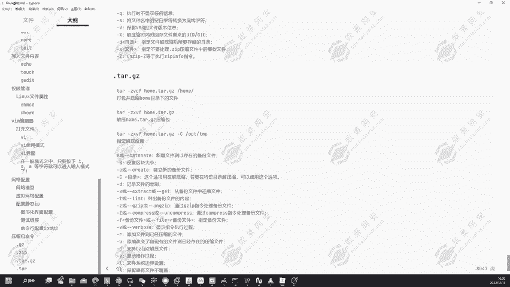

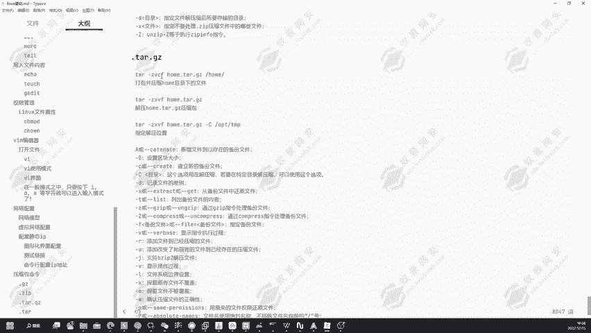

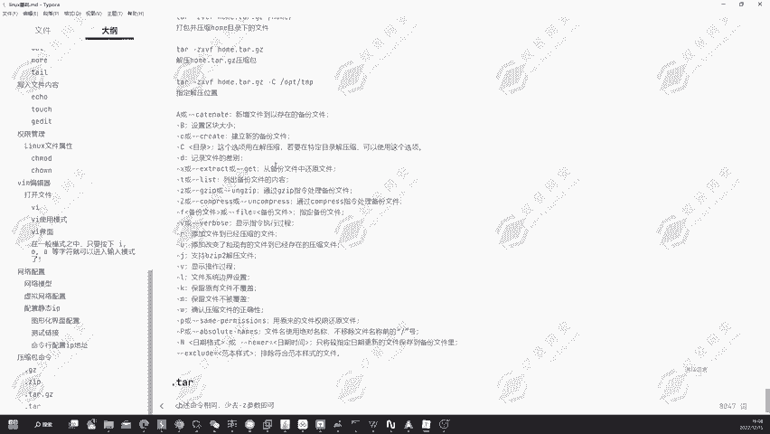

杠X从备份文件中还原文件，这里就是把对应的一个C改成了X杠C。我们可以看到建立新的备份文件，就是打包的一个意思。然后Z可以看到，通过GCIP指令处理的备份文件。

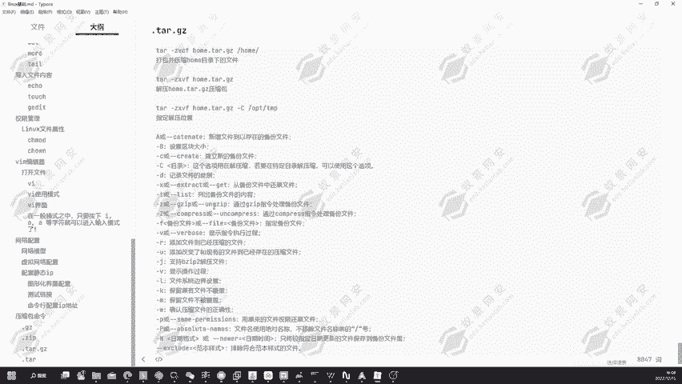

好，这就是打包和解压缩的一个操作。那下面我们来去进行个解压。好，这里的一个参数啊，我看一下。是通过的。

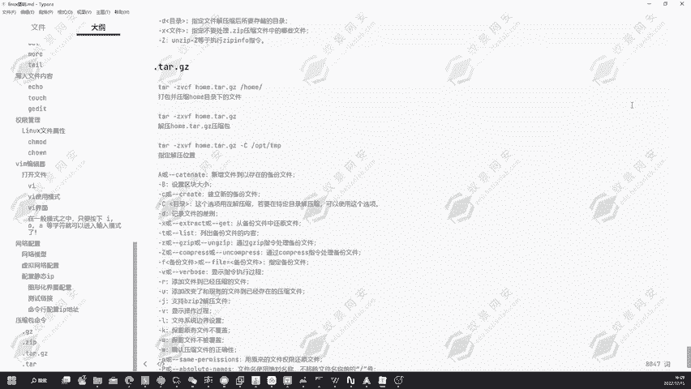

うふ。好。提。个z。XVF然后去解压我们的一个ho。点贴。好，解压完成之后可以看到在我们当前录下，这一也因为有一个号目录了，所以说它同样的是没有去进行一个更改。

那我们可以把这个文件给它移动到tap目录下。好，我们进入到typeap录去进行解压缩的一个操作。好，解压缩完成之后，在这里当前目录会生成一个叫做ho，可以看到会生成一个叫做home的一个目录。

然后这里面同样的也是有一页这个用户可以看到这就是。TR的一个压缩包，通过TR去进行一个压缩的一个方式，可以看到还可以看到通过杠大C的一个参数去指定解压的一个位置。然后还有点TR的点T压的。

就是把这个Z的一个参数给它去掉就行了。因为Z它是通过机载IP去机行的一个压缩，或者说通过。

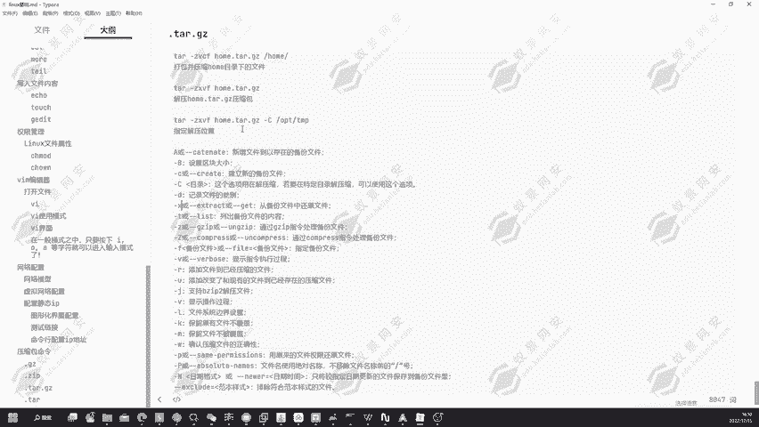

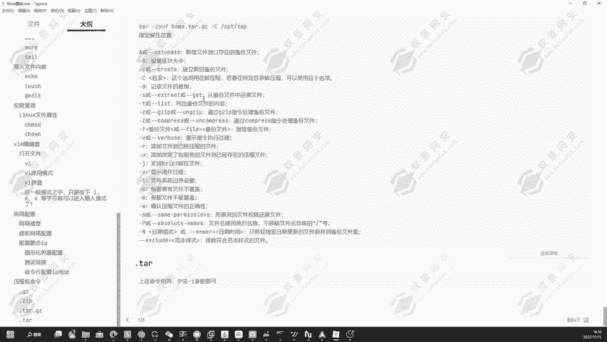

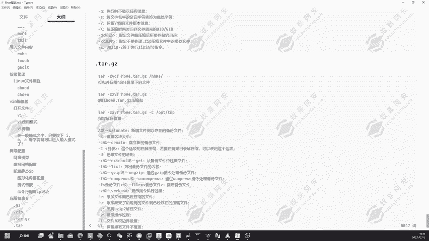

GNZIPH机器的一个解压缩操作。所以说啊我们只要把杠Z的一个参数给它取消掉，其实就是一样的一个道理了。通过T压。CVF我们就可以去进行一个打包。那这里的话我要打包哪一个呢？打包一。点。T二。

然后一页这个目录回撤。可以看到在当前目录下会生成一个一页点TR的一个文件。然后我们要去进行一个解压缩的话，同样的通过TR。Go。X为F，然后去进行一个解压。好，可以看到它这边就会挤压出来。

因为我们当前录下已经有一个一页了，我们现在给一页删掉。好的，那我们重新的解压一次。连到一页这一个目录就又重新回来了。那这就是对应的压缩包的一个处理。好的，那我们下节课为大家讲解，就是通过。

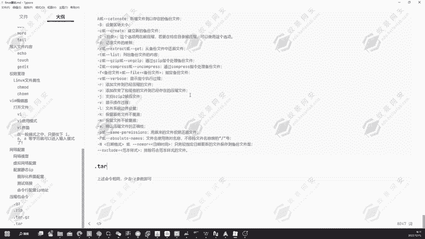

Lux去搭建DVWA的一个跋涉环境，也就是搭建网站。

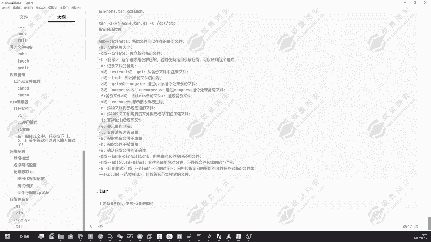