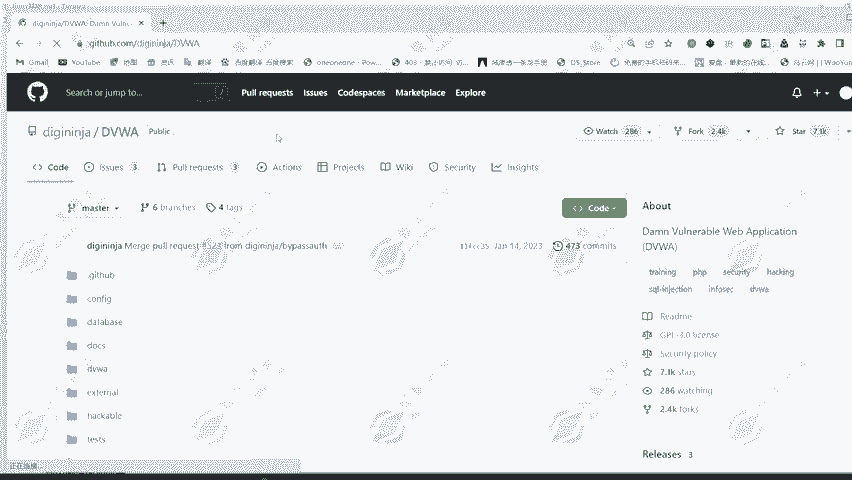
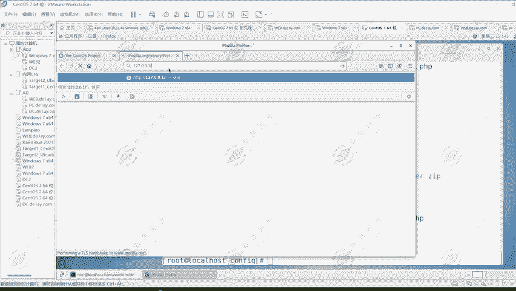
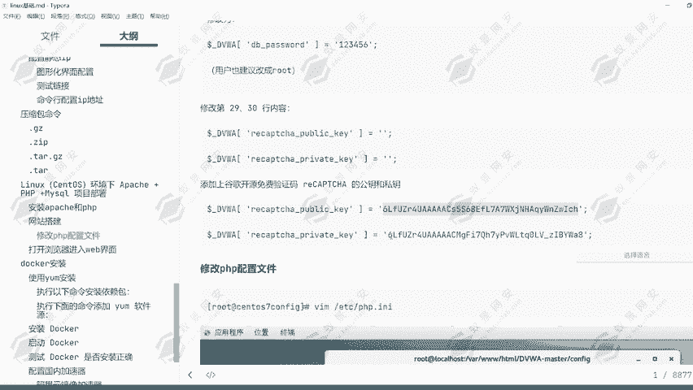
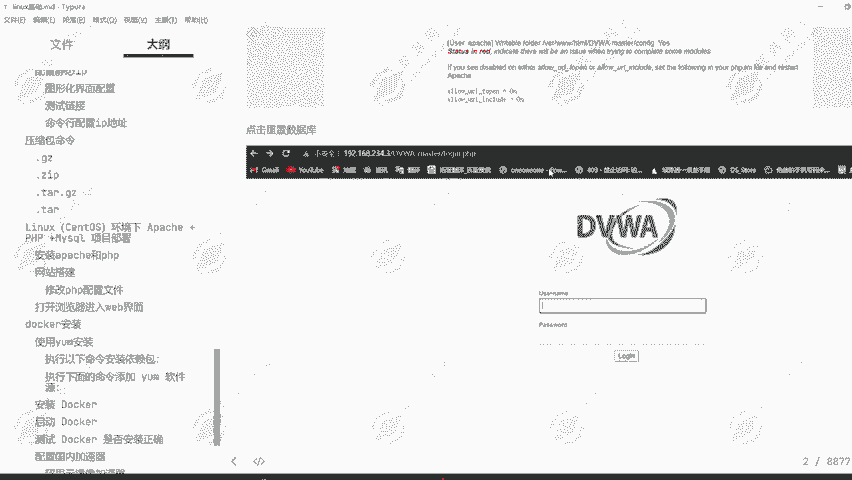
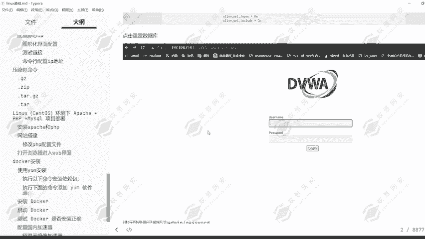

# 2024年最强Kali渗透教程／网络安全／kali破解／web安全／渗透测试／黑客教程 ／代码审计／DDoS攻击／漏洞挖掘／CTF - P22：16.centos搭建web网站 - 网络安全系统教学合集 - BV1Pe411C7Zb

好，同学们，今天我们这节课给大家讲解环境下的阿帕奇和PHPMS logogo的一个项目部署，也就是搭建一个PHP的一个网站。那今天我们要演示的一个站点是DVWA的一个靶场环境。

因为这对于我们后续的一个学习来说都是有一定的一个帮助的。可以看到这是我们今天要安装的一个帕奇和PHP首先安装阿帕奇服务可以看到阿帕奇它是一个服务器软件。

还有安装PHP和一些扩展PHP啊是一种后端编程程序语言，然后再安装my搜go。那my搜狗的话，其实在于阿帕奇在于这一个度S上面啊，它是没有它的一个安装包的。所以说我们要通过亚马安装的话。

只能安装这个MAR。IEDB但是这个和阿帕奇服务其实是比较相似的，也都是一种mysgo的一个。卖搜狗的一个服务。所以说我们直接安装它也是一样的一个效果。那下面我们开始去进行一个安装。首先复制这一个命令。

通过亚母杠Y的一个方式去安装到LTEP。HTPD也就是阿帕奇服。然后PHP和PHP杠my搜狗，还有PHP杠GD，这就是PHP的一些扩展然后对应的。MAR就是mys狗的一个服务。那我们下面去进行一个安装。

嗯。😊，好的，稍微等待一下。好，稍微等一下，他在这里去进行一个访问。好了，可以看到它现在已经正在开始安装了。嗯。😊，等待它的安装完成。好，这边下载速度有点缓慢，那我们稍微等待一下，等待它的一个安装完成。

安装完成之后，我们就可以开始去进行一个配置了。同学们如果说网络比较好的话，它其实一个安装速度啊是比较比较快的。但是我这里的网络好像出现了一定的一个问题。只有3KB每秒有点慢。那这边我先暂停一下。

然后等待它的一个下载完成。好，可以看到已经下载完成了，下载完成之后，我们就要启动这些服务。因为这些服务啊现在只是说已经安装在我们的一个机器上面了，但是我们还没有对它去进行一个启动。

所以说我们要首先启动这个服务，然后再给它设置一个开机自启动。也就是我们每一次打开神诺S7的时候，它都会自动的启动。阿帕奇的服务，还有对应的这个数据库服务。因为数据库如果说它没有的话。

肯定是无法使用这个网站的嗯。同样的也要对它设置一个开机自启。设置完成之后，我们再关闭一下防火墙。因为这个防火墙啊是生透S自带的一个防火墙。那如果说我们没有去关闭它的话。

可能会导致我们的一个网站无法被别人能够访问到。所以说防火墙我们要对它去进行一个关闭，然后关闭完成之后，其实我们在安装完这一个mys啊，它是没有账号密码的那没有密码，我们怎么办呢？怎么去连接呢？

很明显是不可能连接的上的，所以说我们要通过mysgo me。mysgo的密，然后给它设置一个密码，123456。然后我们在这里输入到mysgo杠U rootot，然后再杠P。

123456连接上去证明我们已经设置成功了。那下面我们就开始搭建对应的一个网站。首先我们要下载这1个DVWA的靶赏文件。那在这里的话我们就打开一个窗口，然后去进行一个下载。

可以看到在这里我们就点击下载。那下载完成之后，我这里其实已经下载完成了。那我们可以看到这里啊，其实我已经下载完成了。那这个时候的话我只需要对它去进行一个复制粘贴。给它拖拽进来我们的一个渗透S。

然后我们执行。MV命令进入到我的一个目录。进入到我的一个桌面目录，然后找到这个DVWA的一个文件。给它拷贝到通过CP命令，给它拷贝到我的1个3W目录器。VR3WHTML不录下。

然后我们再进入到VR3WHTML。目录，然后找到这个文件使用到按字IP。我相信这条命令大家应该还记得吧。就是在linux里面解压这一些压缩包文件的一个方法，通过按自IP解压这个文件。那后解压完成之后。

我们就可以进入到这一个目录了。DVWA目录。那下面我们就开始对这一个进行一定的一个配置。首先第一步操作。进入到它的一个config目录啊，这里的话其实是推荐大家改一下名字的。

就是对这1个DVWA的这一个目录改一下名字。因为它现在是叫做大写的DVWA杠MASTER那这个目录可能不太好记。所以说啊。推荐大家通过MV命令改一下名字。改成小写的DVWA，那这样就比较好记了。

然后我们再进入到，然后我们再给予它对应的一个权限。因为它现在是root权限，我们是通过root用户启动的那root权限如果说被别人攻击之后啊，危害性是非常非常大的。所以说我们给它去缩小一下权限范围。

那就通过窗。CHOWN然后杠大R，然后接上阿帕奇。给它设置为阿帕奇用户，然后再接上DVWA这个目录。那这样我们的DVWA就是属于阿帕奇这个用户的了。然后同样的组也给它设置为阿帕奇用户组啊。好。

现在他的一个用户和组都是阿帕奇用户的了。那下面我们要去对它进行一个修改，进入到config部落，给它放大一点，可能有些同学看不清。好，我们进入到config目录。

然后下面有一个文件叫做config点INC点PHP点DIST的一个文件。首先我们要对它去进行一个改名的操作，改成PHP可识别的一个文件，也就是。点PHP后缀的一个文件，然后再去对它进行一个修改。

改哪里呢？我们可以看到，首先我们第一步要去修改的就是DBU的改成。我们数据库的一个连接账户root，那密码123456。然后去进行保存，然后我们再打开火狐浏览器去进行访问。那这样的一个网站。

其实我们就已经搭建成功了。那我们下面去进行访问，尝试一下，看能不能访问到这一个网站。这一道火锅浏览器启动有一点缓慢，大家可以稍微等待一下。嗯。😊，等待它的一个启动。好，启动成功了。

然后我们来访问一下127。127。0。0。1，然后接上我们的目录DVWA回车。

可以看到出现了这样的一个现象，就证明我们的网站已经搭建成功了。然后它里面的一些配置我们并没有去进行一个修改。我们看一下有哪些需要我们去进行配置的。然后这里有一个ALLOW杠UIL。

然后杠in这个我们没有去进行配置。它这里显示的是红色的那证明是配置失败了的。然后这里还有一个king，也就是验证码的一个谷歌验证码的一个地方，然后也没有去进行配置，所以说我们要去进行个修改。

然后这里还有一个。文件它是没有对应的一个权限，我们也需要去给予对应的一个权限。所以说啊这些是我们需要去进行一个配置的一个点。那我们下面对它去进行一个，根据它这里面提示的一个方法去进行一个修改。

比如说第一个。ALLOW啊杠UYL那这个啊是在PHP的一个配置文件中，ETCPHP点INI这个文件中，然后我们搜索ALL。搜索ALL，然后杠UILALLOW杠UIL。好。

可以看到它这边啊是offer的一个状态。那我们给它改成on。好，这里的一个on啊其实。是大写的。然后保存。让我们再去进行一个访问，我们再重新刷新一下。哦，可以看到他这边还没有切换过来。好。

他这边还没有切换过来，这里我们改完之后啊，它其实是应该能够去。OW。がUL。这于我们改成on之后，它其实是应该会切换为对应的一个绿色的一个状态的。但是它竟然没有去进行一切换，那我们也暂时不用管它好。

我们暂时也不用管它。等会儿我们再一起重启一下，然后再给大家去进行一个查看。那这里有一个谷歌的king。那这个king值呢，我们可以看到在我的1个PPT上面也是给予了大家在这里修改一下用户名密码。

然后这里还有对应的一个king。那这个king啊，我们就用到屏幕上面给予的，也就是原来的那一个文件。好，在这下面，然后它的一个config。去进行一个修改。

然后这里也可以看到就是DVWA的一个验证码king。然后我们在这里去进行一个添加。当然我们也可以自己的免费的去进行一个注册。那这里也可以看到，这是谷歌给予我们免费获取的一个地方，我们可以直接的复制。

然后去访问，就可以得到一个公开的king，然后再复制下面这一个去进行一个填入。

嗯。好，保存退出。然后我们再来刷新一下，可以看到这一个king它就立马识别出来了。然后这也还有后续的一个。还有后续的这一些目录的一个权限给予。那同样的我们对它去进行一个复制。然后在这里通过触摸的。77。

然后再给予嘎的一个参数啊，嘎。然后777再把这一个目录给它去进行一个粘贴。回车。然后下面还有一个目录，就是这一个config目录。那如果说同样的这里的一个upot目录，它如果说也是红色的话。

那我们也需要这样的一个操作对它去进行一个修改。嗯哼。😊，好的，那我们刷新一下。可以看到它这边并没有出现这一个也没有变成绿色的那这两个也没有变成绿色的，然后这里是。黑色的那我们可以看到，那这一些的话其实。

可以看到这些啊，其实我们只需要通过这种方式去进行一个修改，它就没有任何的一个问题了的。然后我们给这个linux设置为给它更改一下，改成unuxlinux，然后就给它设置为0，这里设置为0。

然后我们就重启一下，可以看到它这边就已经设置成功了。然后我们再重启一下对应的一个。HDEP服务。IESTART然后HTPD。重启一下他的一个vi博服务。那么们再来刷新一下。

可以看到就已经全部变为绿色的了，这里我们就全部变为绿色的了。然后我们现在就可以去点击这一个重置数据库。然后我们就可以去进行一个登录了，可以看到它这边是已经重置完成了的，已经启动完成了的。好，启动完成。

然后我们就可以去进行一个使用了。可以看到这里我们就可以去进行一个使用了。但是现在他的一个。比较的等级比较高啊，我们改成no，你就改成最低级的，然后我们就可以去进行一个使用了。

这里的话我们就可以去测试不同的一个漏洞，看是否可以去进行一个运行。好的。😊，这就是1个DVWA靶场的一个大建，可以看到。

点击重置，然后去进行一个登录，登录账号名，用户名和密码都是al me，就是al me和pa错的。这里的话我们先给它退出，然后重新登录进去。

账号addme密码PASSWORD然后登录可以看到这样我们的一个靶场就已经完美的搭建成功了。下面这里面的一些漏洞使用方法，大家就可以自己的去进行一个学习了。好的，这是我们这一节课的一个内容。

