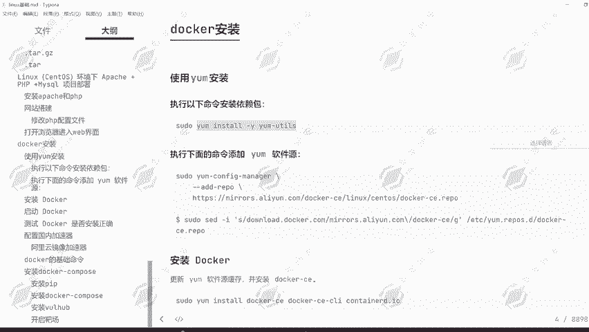
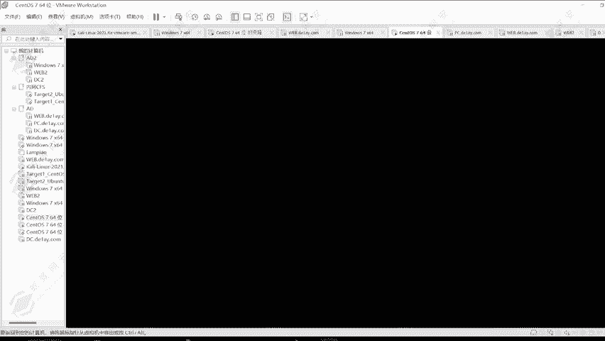

# 2024年最强Kali渗透教程／网络安全／kali破解／web安全／渗透测试／黑客教程 ／代码审计／DDoS攻击／漏洞挖掘／CTF - P23：17.docker使用 - 网络安全系统教学合集 - BV1Pe411C7Zb

好，同学们，今天我们给大家讲解到的一个课程是docker的一个安装，也是我们Lux基础的最后一节课程。首先我们来学习一下，就是使用到docker该怎么去进行一个安装呢？

因为这个docker啊是我们用来搭建拔赏环境，还有搭建对应的一些网站的一个工具。那这个docker我们应该怎么去进行一个安装。首先我们执行这条命令安装对应的亚某的一个依赖包。

好，在这里我们右击打开终端，首先给它连上网。好，然后复制粘贴。可以看到它需要我使用到root权限，那我们就使用到root权限。首先给它去进行一个。注销。切换为入信用户。然后在这里我们切换为root用户。

好，稍微等待一下。电脑有点卡电脑有点卡。我们把这物理器给它取消一下。

给它关闭一下，关闭一些东西，然后以免出现了对应的卡顿的一个现象。好，前进前进跳过开始使用。然后在这里我们打开一个终端。然后把刚才复制好的命令去进行一个粘贴，可以看到虚拟机现在有点卡顿的。

这里的话可能是出现了一定的一个问题啊。他现在有个程序正在占用，那我们就使用到跳，然后接上4539。然后再重新的去进行安装。稍等一下，等待它的一个安装完成，可以看到已经安装完成了。

然后我们要执行下面的命令添加亚么的一个软件源。因为我们安装的docker，它是要在do口的一个官方源上面才能够去进行安装的。所以说我们要给它去添加do口的一个官方源才能够去进行一个使用。好的。

我们重新的去给它添加一下对应的一个圆，然后再给它添加对应的一个密钥，然后再去安装docker。安装do克的话使用到亚宝安装do杠CE。回车，那这里的个安装可能会需要有一点时间，那我们就。好。

这里的一个安装啊需要一点时间。我们首先先它又有一个进程占用掉了，然后我们先把这个进程给它关掉4818。然后安装。好，可以看到它现在正在安装中，可能会需要一点时间，我们先暂停一下。

可以看到安装的大小350多兆，所以说需要一点时间。那我们就暂停一下，然后等待它的个安装完成。好的，现在多克已经安装完成了。那我们下面来看到。docker安装完成之后。

我们来熟悉一下docker的一个启动，这里就是设置docker自启动啊，也就是我们开机之后，它会自己启动这一个程序。然后这是启动多com命令。然后我们检查自己docker是否已经完成安装。

是否已经可以去进行一个正常使用。我们可以使用到这一条命令。docker run杠杠IMhello word这条命令啊就是用来检测对应的docker，它是否已经可以正常的去运行对应的一个容器。

拉取对应的一个镜像了。好的，稍微等待一下。可以看到出现这样的一个现象。hello for docker，那就证明我们已经搭建成功了。然后我们使用到它去配置对应的国内的一个加速器。

因为我们要去搭建对应的一些把扫环境，或者说搭建一些网站的话，那我们肯定要去拉取对应的一个镜像。那这些镜像啊，它其实是在国外的，也就是docker的一个仓库里面的那这样的话拉取速度会非常慢。

所以说我们给它配置为阿里云的一个镜像加速器，也就是阿里云官方提供给予我们的一个国内的镜像。那这里的话我们就是访问这个地址，然后点击登录镜像服务控制台，然后登录进去之后会得到一个页面。

登录使用到支付宝登录就可以了。然后这边就会跳到镜像加速器的一个页面。然后我们选择渗透S的一个去进行一个安装。好，让我创建一个目录。首先第一步操作创建目录，然后第二步操作可以看到。写入文件内容。

第三步操作，这里总共就是四个步骤，我们按照顺序一一的来去进行一个输入，总共4条命令。然后再重新启动一下我们的一个do卡。好，这样我们的一个docker环境就已经配置成功了。

这样我们的一个docker环境就已经配置成功了。然后我们要去使用到docker搭建对应的一些靶手环境。比如说我想要搭建1个DVWA的一个靶场，那我就搜索DVWA。然后使用到docker。

🤧我们就选择使用人数最多的这一个吧。选择第一个，然后复制。然后我们想要知道它的一个启动命令啊，也是非常简单的。我们只需要在它的一个官网上面就是。docker的官网上面去进行一个搜索搜索这一个资源。

可以看到它这边就会给予我们启动的一个命令。在这里通过docker run杠D杠P，然后8080杠P，然后这样去进行一个启动。那首先第一步操作是要给它拉取对应的1个DVWA的镜像文件。

所以说第一步操作肯定是dockerPULL去进行一个拉取。好的，稍微等待一下。因为我们配置的加速器啊，所以说它的拉取速度是非常快的。可以看到刚才下载多核的时候是几百KB或者说几KB10几KB。

那现在都是几兆起步了。所以说现在的一个安装速度是非常快的，下载速度。那我们只需要稍微等待一下，它就可以下载完成。好的，等待一下时间，可以看到只需要还需要大概十几秒钟吧。好的，稍微等待一下。

可以看到已经启动成功了，然后我们要已经拉取成功了，然后我们要去启动。因为现在我们只是把镜像拉取下来了。那镜像拉取下来，我们并没有开启容器。那在多cker里面啊。

它的镜像就相当于一个压缩包文件一样的那压缩包文件能可以可以直接使用吗？它是不是要去进行一个解压。那解压之后才是我们要使用到的一个东西。那现在这个镜像我们就相当于一个压缩包文件一样的。

然后解压出来的一个东西，我们称之为容器。那现在我们要做的一个操作，就是给它解压出来，也就是给它去进行运行起来。那这里的话就是33068080端口。然后这里我们给它改成密码改一下，不要后面的一个感叹号啊。

那如果说大家在上一节课搭建了网站的同学，那80端口和3306端口都被占用了的。所以说这里的8年端口这一个我们改成81号端口，然后3306改成3307，这样就可以了。然后我这里啊是80端口。

所以说我这里这台机器是没有安装的。所以说我就直接用80端口，然后用3306。好，回车去进行一个运行。运习成功之后的话，我们就可以打开火狐去进行一个访问了。我这里用的是80端口，我访问的就是80端口。

如果说大家用的是81号端口，那就访问81号端口。好，稍微等待一下，等着它的一个打开浏览器，因为浏览器打开还是要一点时间的这一台机器比较卡。好的，我们在这里也输入到。127。0。0。1。80回车。

当然如果说是81号端口的一个同学，就改成81就可以了。然后可以看到我们的一个网站就已经搭建成功了。然后我们只需要重置一下数据库。然后再去进行一个登录。可以按到输入账号密码，add me发错的。

然后去进行一个登录就可以了。那这样啊是不是比刚才我们上节课讲解的那种方式更为简单，更为方便。然后还有一个工具叫做docalcomp这个工具啊是。docker里面的一个小工具。

可以帮助它快速的搭建对应的一个靶赏环境，快速的搭建环境，也不需要输入这么一条命令了。do run的一条命令就不需要再去进行一个输入了。直接输入docker compose upD就可以去进行一个运行的。

所以说更为简单而且方便化的帮助我们可以去同时管理多台镜像多台服务器啊哦多台容器。因为有可能一个容器是由多个镜像组成的那这个时候的话，我们要去启动就非常麻烦。所以说我们通过do compose。

我们就可以通过一条命令启动多个镜像。好的，下面我们去安装对应的一个python3环节。因为我们要用到的这个工具是要通过python3去进行一个安装的。通过pyython去行安装的。要等待他一个安装。好。

path3已经安装完成的那我们再来看到，通过path3安装对应的PIP3。python3和PIP都是我们后续要用到的一个工具。所以说我们现在正在去我们现在去安装是没有任何问题的。好，稍微等待一下。

等到他的一个安装完成。安装完成之后，我们输入PIP3。杠大V我们看一下效果，可以看到出现了对应的一个版本号信息，证明我们已经安装完成了。但是大家安装完成的这安装完成时候的1个PIPI其实是有问题的。

就是。可能会出现代码报错的一个问题。那我们先对PIP去进行一个更新，我们先更新一下这个PIP啊。首先我们先把这个PIP更新为最新版，那这样的话就不会出现一些代码报错的一个问题了。🤧嗯。好。

这里等一下安装时间有点久，我们稍微等待一下。那我这边先暂停。好的，PIP已经安装完成了。那我们现在来安装一下对应的docker杠com po。那推荐大家使用到国内语言的一个方式去进行安装啊。

这样的话安装的比较快。因为国外去进行，我们去拉取国外的一个资源肯定是比较慢的。所以说推荐大家使用到国内镜像园的一个方法去进行一个安装和国内。国内访问资源和国外访问资源，他们两个速度啊完全是没有可比性的。

嗯。天哪，我们直接使用到PIP去进行安装的话，它这里是用到PIP3inst的杠U，然后do口杠compos。但是我们可以通过杠I的一个参数啊去指定一个镜像网站镜像原站。好，现在已经安装完成了。

那下面我们就可以使用到docker杠compos杠V来显示它的一个版本号信息，可以看到出现了1。29。2，那就证明了我们已经安装完成了。然后下面我们要去安装到一个网站，那一个靶场环境叫做Vh。

那这个Vh的一个版本环境，可以看到可以通过GIT的一个方式去进行一个拉取。当然我们也可以通过自己的一个下载方式在这里下载。那可以看到我这边是已经下载完成了的。然后我们这边来去进行一个导入。好。

给这个导入到。申度S7中。好，可以看到已经克隆成功了。哦，没有克隆成功。错误了。好的，那我们这里去进行一个粘贴，就是把我们的一个文件给它粘贴过来。没有这一个目录，那我们的一个文件。啊，没事。

我们可以通过SCP的一个方式啊。在这里我们打开SMD窗口，然后我们在这里使用到SCP。为哈虎。点ZIP文件。点ZIP文件，然后输入到root。艾特。🤧。19I点168。234。129。

然后放到它的root部录下。这里的话我们是要通过密码的一个方式，然后去进行一个。然后我们直接回车。可以看到输入到yes。123456回撤。可以看到它现在正在上传中，已经上传成功了。

那我们来看到在它入图目录下是不是存在了这么一个文件。然后我们使用到按ZIP的一个方式去进行一个解压。好，解压完成之后，我们可以看到它这里正在进行解压的一个操作啊。解压完成之后，我们进入到微ha目录。

然后进入到一个。think客PP的一个目录，然后再进入到5-E的一个目录。那这里的话我们要去使用到不同的一个漏洞文件，要搭建不同的一个漏洞环境的话，我们就要进入到不同的一个目录。

当我们能够看到docker composeos点YML这一个文件的时候。当我们能看到这么一个文件的时候。当我们能看到这么一个文件的时候。

就是我们可以在这里执行命令的一个地方输入到docker杠comp up杠D。启动这个靶场环境。可以看到它是这边正在去进行一个启动的一个步骤，稍微等待一下。这是。python的一个报错啊，就是很正常的。

就是我这里是306的一个版本，然后出现这样的一个报错是很正常的。然后他现在正在拉取weh，然后thinkPP5。0。20的一个版本。那我们稍微等待一下，我这边暂停一下，可以看到它自己正在去进行拉取。

应该也不用暂停，它的拉取速度还是比较快的。比它缩小一点。有点卡，电脑有点卡。啊，稍微等他一下。好的，这样我们就搭建完成了。然后我们可以通过一条命令叫做。稍微等了一下，还没搭建完成。

通过do考PS查看一下映射的一个端口，8080端口。那我们下面来访问我的1个8080端口，看一下现在搭建的一个网站是什么样子的。大家如果说电脑空间足够的话，推荐给他多放一点空间。

你可以看到我的现在这么卡。然后回车。可以看到出现了一个蹭客PSP5V5的一个网站。那这里的话我们想要搭建不同的一个漏洞啊，那这里我们可以通过CD。CD然后可以看到这是它里面所有拥有的一个靶场环境。

那根据这一些靶场环境，我们就可以我现在要搭建一个接boss的一个漏洞，那我就进入到接boss的一个环境里面。然后这里面有分别不同的一个漏洞版本，然后去进行一个搭建。

搭建的命令就是stock杠composup杠D。然后关闭的命令就是我们刚才是在thinkPP目录下，然后它的1个5-2E目录。然后在这里我们开启了这个靶场。

然后我们在这里也再通过dockercomposDOWN去进行一个关闭。这样我们就把自己的一个靶场给它关闭成功了。好，这就是我们今天所讲解的最后一点内容。好的，那我们的一个Lux基础课程就到这里我们。

结束了。