# 2024年最强Kali渗透教程／网络安全／kali破解／web安全／渗透测试／黑客教程 ／代码审计／DDoS攻击／漏洞挖掘／CTF - P24：1.渗透测试-域名信息收集 - 网络安全系统教学合集 - BV1Pe411C7Zb

喂喂啊。Sa。那大家这个。OK那我们就开始唱课啊，这个声音还应该还行吧。嗯，有杂音的话是我电脑这个风扇。这风扇在不停的转着这个。呃，大家体谅一下，后面我们会有麦克风设备会到的。OK那我们开始今天的课程。

啊，今天给大家讲解渗透测试信息收集的第一课。信息收集分为三天来讲，分别讲域名信息收集IP端口信息收集和网站信息收集。那今天我们来看域名信息收集。首先，为什么要进行信息收集呢？

信息收集是指通过各种方式获取所需要的信息，便于我们在后续的渗透过程中有更好的一个进行一个渗透测试。我们要收集，比如目标站点的IP地址中间键中间键，也就是服务器，比如说阿帕奇还有tomca等等。

脚本语言PHPGSPISP等等端口邮箱等。现金收集包括资产收集，但不限于资产收集。在渗透测试的过程中，为什么要进行信息收集呢？一、信息收集是渗透测试成功的保障。第二。

信息收集会给这个资产带来更大的暴露面，会增加我们渗透成功的可能性。大家应该都知道，知己知彼，百战百胜。我们当公司的甲方给我们一个目标之后，我们要对这个目标进行进行一个充分的资产收集。

收集他的IP和域名信息才能够进行很好的渗透。那大家去比如说公司给你1个IP不可能只对仅仅对这1个IP进行一个扫描。你去啊挖百度的SRC不可能直接对着3W点百度点com这个主站进行疯狂的扫描。

是它是出现漏洞的几率是非常小的。这个时候我们就需要搜索它的子域名或者是庞站C段等等，去探索有没有那些是就是不太重要的站点，或者是刚刚上新的测试站点，去找这个里面有没有漏洞。

信息收集的分类呢主要是分为主动信息收集和被动信息收集。也就是字面意思，主动信息收集就是通过直接访问网站啊，在这个服务器的网站上进行操作，对网站进行一个漏洞扫描和端口扫描等等。这是有网络流量。

经过目标服务器的信息收集方式。这种信息收集方式会在对方，也就是我们把机的服务器日志上会留下你的日志访问信息。如果对面有防火墙或者是硬件IDS的话，可能会对你进行封锁。而被动信息收集就是基于公开的渠道。

比如说搜索引擎或者是网络空间搜索引擎等，在不与目标系统直接交互的情况下获取信息，尽并且尽量避免留下痕迹。比如说我们需要对一个网站进行一个搜索，我们不一定非要访问这个目标机器，而是利用搜索引擎。

搜索引擎的爬虫已经帮我们爬好，并且放在互联网上了。我们只需要在搜索引擎中输入我们想要的内容进行一个信息收集即可。也就是主动信息收集和被动信息收集的区别。那我们在信息收集中，通常需要收集哪些信息呢？

这些不论是面试刚入门想转行渗透测试的同学，包括自己已经从事渗透测试工程师，接不论是大小项目渗透项目互网项目的时候，都需要对这些信息进行收集，分别是服务性信息，也就是端口服务和IP地址。第二，网站信息。

我们通常对目标进行渗透，首要是渗透它的web服务，也就是网站。我们需要了解这个网站的架构，包括网站服务器的操作系统、中间件、数据库、编程语言，包括其他指纹信息。

wawa意思是web应用防火墙敏感目录、敏感文件，是否有源码泄露，包括C段和庞站的搜索和查询。第三点，我们需要查询这个网站的域名信息，通过hose查询或者是备案信息和子域名搜索。

最后我们还需要搜索这个目标所具有的人员信息。比如这个甲方去给的渗透目标，这个服务器所具有的人员、管理员、姓名、职务、生日、联系电话或邮件地址等等。我们拥有这些人员的管理员信息。

就可以对其姓名、职务生日进行呃打乱生成字典进行一个密码爆括。大家都知道，管理员包括我自己在设置一些密码的时候，通常会使用自己的姓名或生日，再加上其他的一些字母构成我的密码。

这个别人如果知道了自己的姓名、生日，就可以呃生成一个字典进行一个呃有效的爆括爆破。那这里啊我们就来看一个域名信息收集。首先我们来看什么是域名。域名很显然，大家已经非常清楚了，现在已经是网络事态。

也就是用一串用点分隔的名字组成internet上一台计算机或计算机组的名称，也就是域名就代表计算机名。域名相对于IP是互相对应的，是通过DNS又叫做域名解析系统。

将域名和IP地址相互映射映射成了一个分布式数据库，能够使人更方面的访问互联网。当我们访问一个网站，比如核天la，我们核天网安实验室的官网。如果让你去输入核天实验室服务器的IP地址。

这个是非常的呃不容易记忆，也不容易访问。那我们把它通过DNS映射为我们的域名核天lab这个大家就非常容易记忆。访问微博3W微博点com访问百度百度点com，这些就是通俗易等的域名。

域名分为顶级域名、二级域名、三级域名等等。顶级域名，也就是我们域名最后面的这一个啊，最后面点后面的字母为点com顶级域名有很多种类。

比如普通的国际顶级域名点com政府域名点GOV商业教育域名点EDU在我们政府政务网站一边一般是以点GOV进行G尾的。我们在没有得到一个授权的情况下，是一定不能对GOV进行渗透或者是扫描及信息收集。

有可能你对GOV进行一个啊一个一个输入框，你对它叉SS一下，有可能后面就请你去喝茶了。教育域名EDU大家如果挖SRC就是一开始挖不到的话。

可以去尝试挖一个叫EDUSSRC一般嗯各个高校嗯使用的一个域名都是点EDU结尾的。hoiz who呢就是用来查询域名的IP及这个域名所属的这个管理者信息。

也就是用来查询域名是否被注册以及注册域名的详细信息数据库。比如说域名的所有人，包括域名的注册商，这就相当于我们去一个商店里面这个商店，包括公司都会有一个工商注册信息，我们可以通过一些外包接口。

比如说天眼查去查找这个呃公司这个商店是谁开设的法法人是谁？嗯，是在哪里？是在哪个板块上市的。ho is呢也就是同样的道理。它是用来查询我们域名是谁注册的注册商是什么。那呼意思呢其实就是一个啊服务器。

我们通过Wiz查询可以获得域名、注册者、邮箱、地址等信息。一般情况下，中小型网站域名注册者就是网站管理人，我们可以利用搜索引擎，对hoiz查询到的信息进行搜索，获取更多域名注册者的个人信息。

我们来看会iz应该如何去查询。首先，web接口查询，这是非常方便的。有阿里云的hoiz查询接口，还有站长之家的护iz查询接口。我们这里站长之家来为例给大家看一下啊，这个都是一样的啊，哪一个都是一样的。

它都是请求我们的会iz服务器。啊，在这里。在在这里啊直接。去找我们的，比如说隔天lab。点COM。可以看到这个是和天的 who意信息。可以看到它的创建时间，包括DNS解析。DNS服务器的一个情况。

这里的注册商包括联系邮箱，都是他的，就是一个代理商，也就是阿里云。因为我们现在注册域名，包括自己搭设博客网站去注册域名。你不会自己向工信部去申请域名吧。你总是去找注册商，比如腾讯云。

还有阿里云万网进行一个注册。这里的话你进行你自己注册的域名查询。那这里的注册商和联系邮箱就是阿里云这个注注册商的一个邮箱。当然，也可以使用一个hoiz命令行进行查询。

hoiz命令行在卡利里面就可以使用啊，它也是请求hoiz服务器，这直接进行hoizhoiz百度。就来查询一个百度的信息。那我们继续来看。第二种方法，查询备案信息。查询备案信息，什么是网站备案？

在中国大陆进行网件搭建域名解析，都需要对网站服务器进行备案。在备案之后会生成一个网络ICP域名备案号。一般在中国大陆的网站最下方的banner都会显示这个备案号，就以和天网为例。

在最下面可以看到它的备案号是西ICP备加备案号。

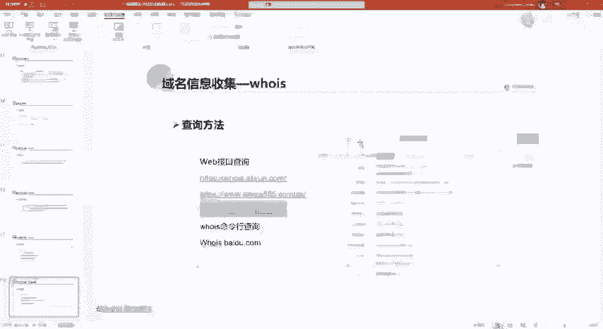

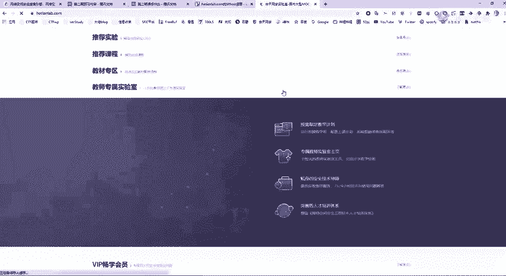

如果在国内你搭设网站不去备案的话，是没有办法进行正常域名解析的。

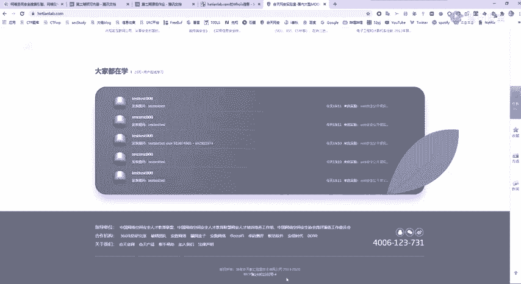

所以我们可以使用备案号信息去搜集这个呃网站的一个管理员信息，包括庞站。还有子域名信息。这里我们还是以。公司的和天 labb。哎，可以看到这个跟刚刚我们看到banner上面标注的是一样的。

同时这个嗯注册这个单位还会注册着其他的网站。比如说点ORG点啊这个竞赛系统一些。资产这就可以暴露公司的一些资产。那，下面呢可以经过经过这个呼意获取的注册人和邮箱进行反查域名，这个是实际是不太实用的。

因为刚刚已经说过，很多公司的DNS解析，包括域名的注册，都是由运营商，也就是中间商代理商进行注册的。查到的这个运营商和邮箱注册人都是代理商的信息，这个已经不常用了。大家想使用的话也非常简单。

只需要在我们刚刚查找的那呼意子里面去点一下那个邮箱即可。下面我们来看在渗透测试中非常重要的一个环节，叫此域名收集。子域名即为二级域名。二级域名很显然是顶级域名的下一级域名。

比如mail和天点com是BBS和天com和和天com的子域啊，这个就非常好理解了。那我们为什么要收集子域名呢？大家要知道，我们在挖挖掘漏洞，包括SRC和渗透测试的时候，一。

信息收集是渗透测试成功的一个保障。你收集的子域名越多，你挖到SRRC的可能性越大。如果你只收集的这几个常用的子域名，或者是只是主站，它有可能没有漏洞，或者是它的漏洞比较小。

或者是已经被其他的大佬给挖过提交，然后修复好了。所以一般我们是要进行一个子域名的广泛收集。那收集的方法有哪几种呢？收首先是搜索引擎的收集。搜索引擎，我们是利用谷歌语法。

大家如果去尝试去有搜过谷歌黑客语法，应该会了解。我们来试一下。在google中google中搜输入我们的site就为指定我们的域名为和天lab。然后这里呢就会把这个核田lab上面一些信息都会啊显示出来。

这里可以看到3W和田labCOUMT和田labGSLI和田lab等等。利用谷歌语法，我们可以搜索子域，并且搜索其他的一些信息，大家可以去简单。这个大家可以去寻找一些。

比如说你想找啊这个circle注漏洞，你可以啊直接用URL啊，比如说PHP结尾的啊ID等于一啊，你要找到的有可能就是一个啊ID等于一啊，比如说这里你打开它后面ID等一。

你可以测试一下它有没有cicle注漏洞，它常用的一些语法，大家可以看intest in totalle。Have info in uLs等等。大家可以在课后自己如果感兴趣的话，可以多看一下。

这可以帮助你找到一些小站的一些漏洞。去练练手，拿一些嗯。国外的一个网站练练手。第二呢就是一个第三方网站查询，也就是利用这个啊一些站长之家，也是能够查询一个子域名的。

因为它里面收集了大量的DNS第三方服务，可以用供我们来查询一个子域名信息。

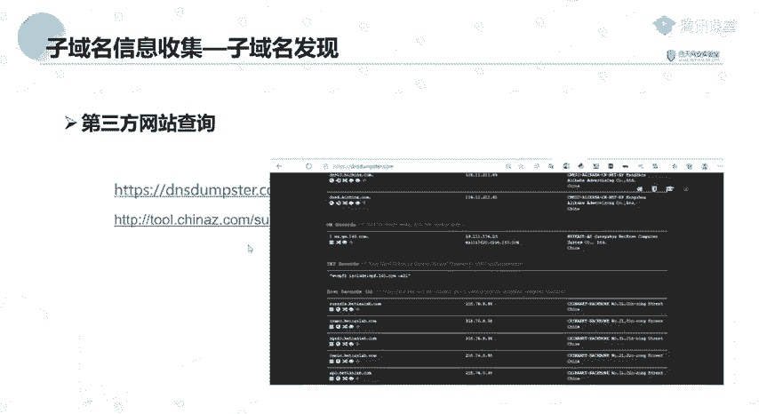

这里我们啊百度。还被屏蔽的域名这个。我们还要查询我们公司的这个。还，可以看到他找到的非常少，还没有go歌google语法找到的多，这里就几个。那我们就是用这几种方法综合的一个去寻找。

然后去虫即可搜集一个子域名信息。啊，这个这个东西呃你自己这这自己不要说嘛，自己去百度找一下嘛。然后我们再接下来继续，还有其他的方法。

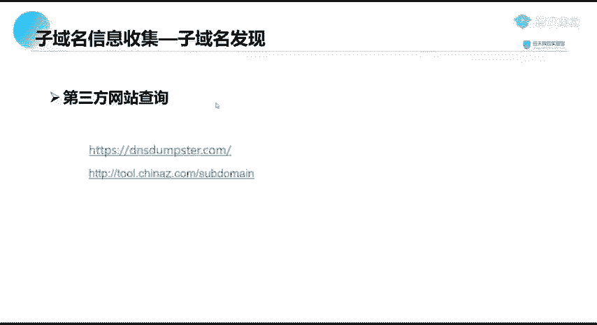

还有就是刚刚在搜索的时候讲到的网络空间安全搜索引擎。网络空间搜索引擎for法，还有那个撒旦，还有一个钟馗之眼，这些都是跟我们普通搜索引擎不一样的。它是一个服务器，不停的对全网进行端口扫描。

去暴露他的一些啊服务器信息，包括其他关键信息。当然这里我们也可以对子域名进行搜索啊，这里我们要说打开我们的方法。

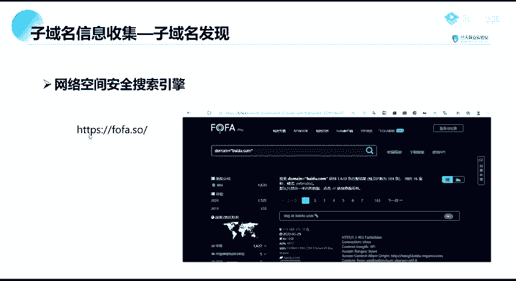

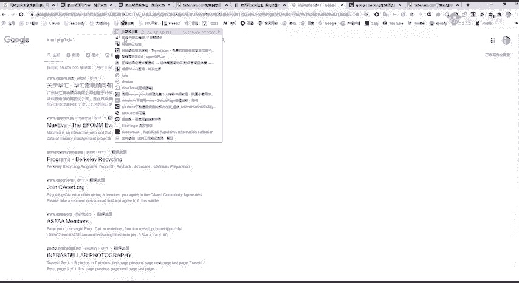

然后输入我们的这个域名等于这个百度啊，等于百度，可以看到搜索出很多百度的一个子域名，不仅仅是二级，包括三级域名都能找到。还有它的服务器的一些信息。

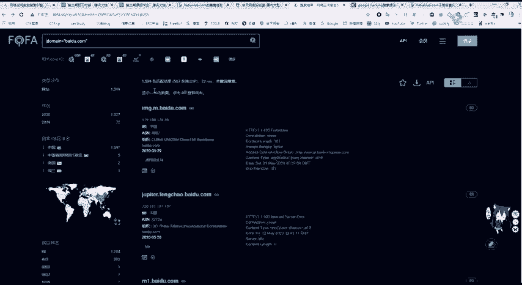

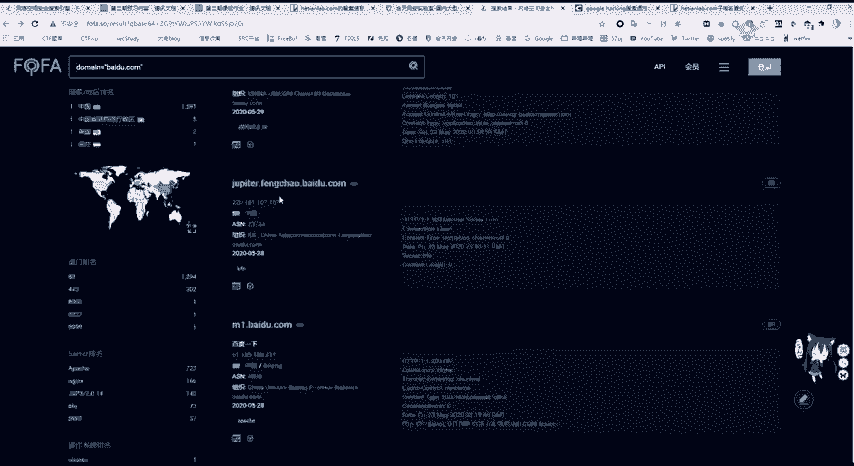

但这里呢是一个收费的，这个是个收费的。

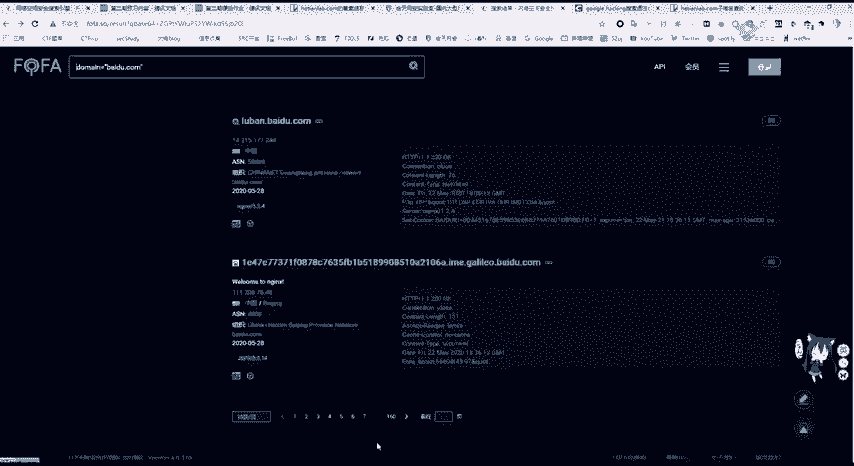

啊，不可能这么好的东西给你免费用是吧？别人这个服务器也需要一个资金来维持的。

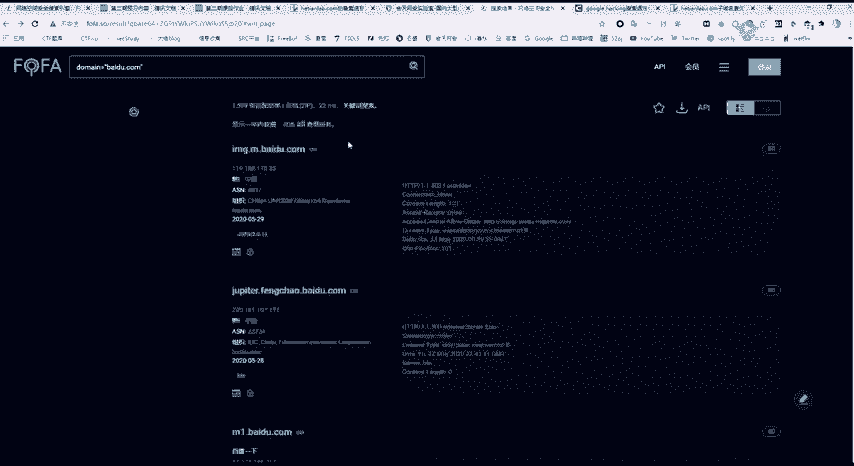

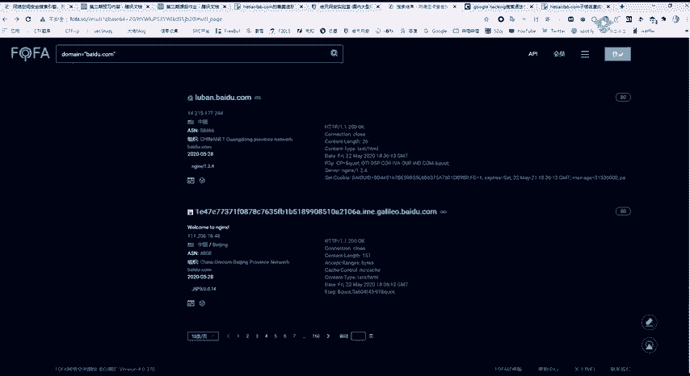

还有方法叫做SSL证书查询。大家都知道，当这个网站开启443，也就是HTTBS安全传出协议的时候，都会有一个运营商去颁发SSL证书。那么SSL证书在哪儿呢？在我们已经有这个HTTBS的。

可以点开这个证书可以看到啊，这是有哪一个公司给颁发颁发的日期是到哪儿的。

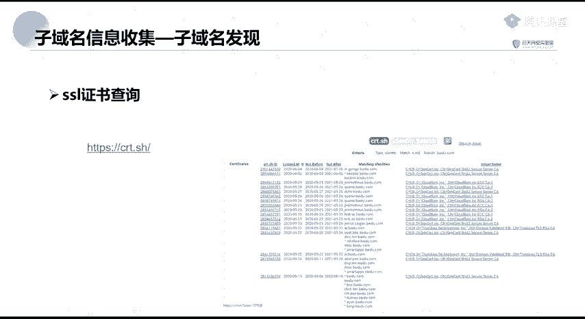

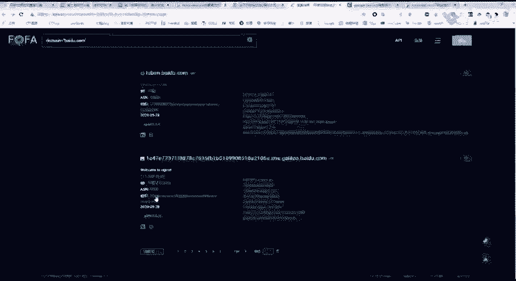

我们通过这个证书啊，这个证书的。我们可以查看这个。查看这个证书，包括这个证书的一些信息，可以找到。子鱼搜索子鱼，他通过这个web接口进行一个呃查找，他找到的是要比我们之前说的那些都要多一些的。

因为只要开启了我们的443，比如这里我们输入我们的百度，百度百度点com。哎，这里可以看到他找到了很多百度的一个子域名。

另外一种一个发现就是通过GS文件发现自域名GS可以把它就是当做就是网页的前端这个代码去发现自域名是如何通过前这个前端去发现代码呢，我们知道在我们查看网页源代码之后，这里面就会出现很多的一些链接。

比如说啊这上面一些链接，包括一个域名信息，我后就拿百度来呃开刀。我们来看百度的一个源代码去搜索百度。点com。来，我们来看有没有他的子玉去暴露出来。这以肯定是有的。大家可以看到这是MM点百度M点百度。

我再往下。M点百度。是不是有很多news百度、map、百度、贴吧、百度都是有很多子域名的。但是我们不可能这样conttrol F进行一一的查找。那这里我们还是要利用工具进行一个爬虫，并且筛选。

是使用我们的GS findnder。可以把它直接下载下来啊，直接。它是一个get up文件，嗯，我们把它打开。你想安装到我们这个咖利，咖利里面的话，就是get，然后克隆。啊。

大家做这个安全或者是开发的话，一定要对get up十分熟悉。get up上面都是一个代码库。就是直接。get然后克隆过来，在国内的话，你克隆可能是比较慢，你可以去自己去寻找代理。

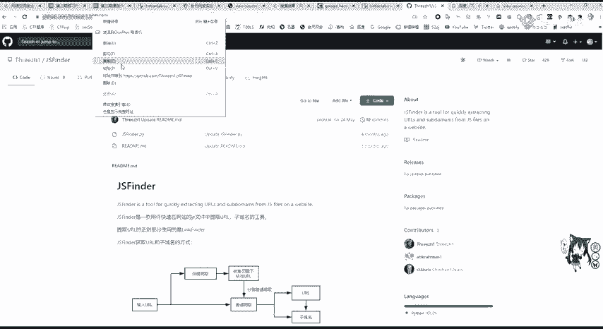

把他再挂挂挂过来，克隆过来。

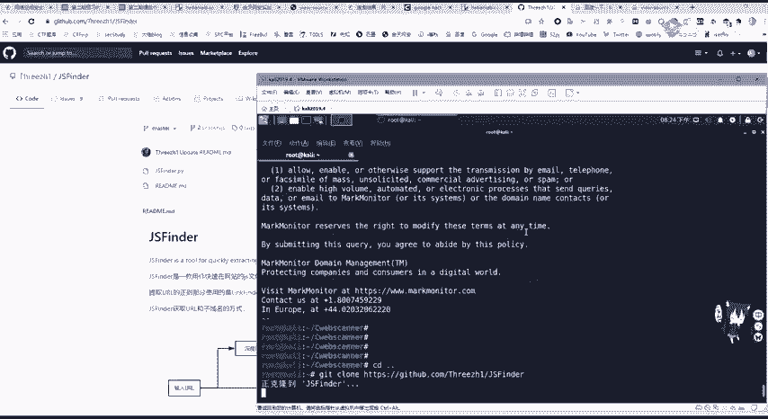

啊，稍等一下，它克隆完成之后，我们进入这个里面啊，可以看到直接你的python接JS。这是一个pa森2啊帕森。发现2没有这个模块，我们使用PIP。insstore进行安装。OK给安装好。

这个就拿这个之前服务器上安装好的那个。这里我们呃使用这个python。GS standard。哎，这个是paon2。

这不行的。啊，这个这个也不知道为什么这个这个又不行了，它是之前试是可以的。

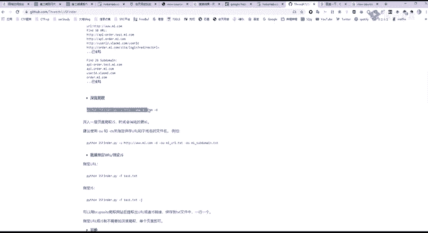

他就是用爬虫把这些网站都爬下来。哎，PIP的找得到。你奇了怪。

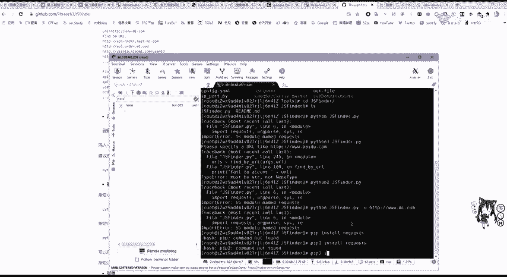

之前都是调好的。那这里的使用方法也非常简单啊，就是啊pyython加上我们这个PI脚本杠U指定你这个链接。比如说3W百度HTP然后就可以进行一个爬取。爬取之后，这些啊子玉就会给暴露出来。对的。

这个扒仙模块没有装啊，之前我是调好的。啊，这有点翻车啊，但是也没有没有事啊，这个就非常简单，这个非常好用。那我们。一般进行信行收集的话，还有几种方法，分别是利用三个工具。这三个工具我就分别讲一下。

第一种呢叫做爆破工具，叫子域名挖掘机。这个在啊和田班主任给你们的这个工具包里面啊是有的是有的。那它的一个原理啊，就是利用这个。里面的这2个TATT文档。你点开这个贴T文档看一下。

利用它这里面的这个字典去拼接我们的。域名进行爆破，看回线。它的一个作用就是爆破嘛。可以在这里设置线程然后启动即可爆括。那这里我就不给大家演示了，因为它是非常的慢，他要把这个字典给跑完。啊，断网挖掘机。

是的，你的线程比较高的话。他这个而且这个线程比较高的话，挖的有可能会错。就是有的域名它会跳过去，因为他没有收到一个呃HTV1个呃response响应包还会丢掉，以为它没有。这个子域名挖掘机啊。

这个不常用也不好用啊，占用内存资源。那下面我们看一个现在正在，而且这个呃 lawyer这个挖掘机都已经很长时间没有更新了。

那我看现在就是一直在更新维护的这个onefionefi是一个非常强大的子域名收集工具。但缺点呢就是我们需要一一的去配置这个IPI接口，这个接口有可能是收费的，我们配的越多，它找到的越多，你配的越少。

那它基本上就跟你这个DNS还有SSL证书找到的就差不多了。

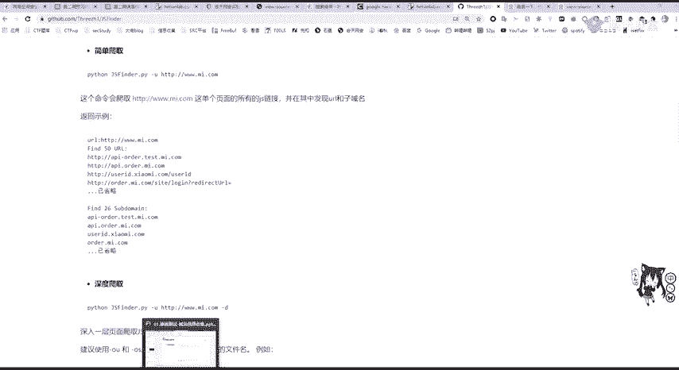

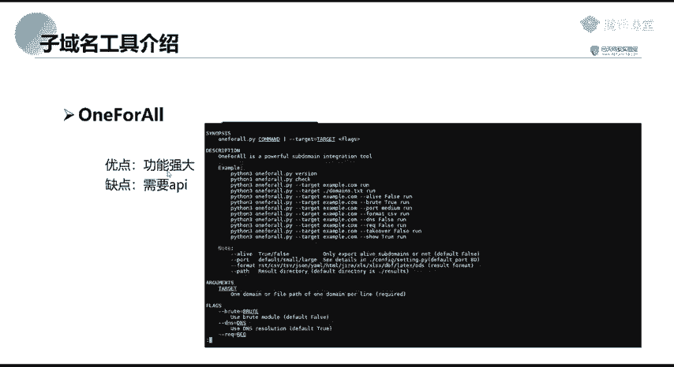

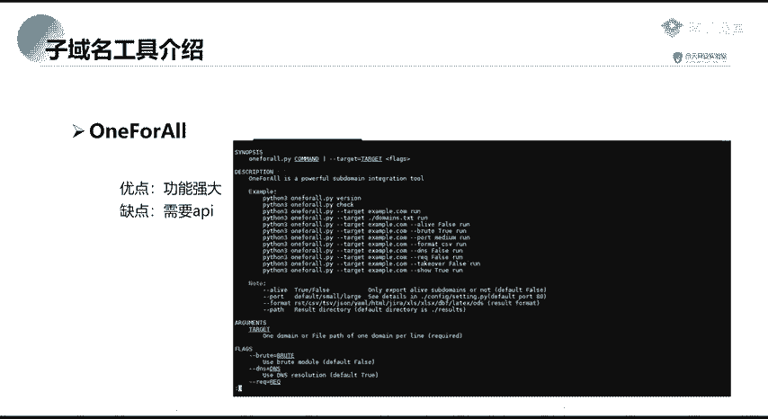

这个要去配置。这也很简单，直接呃去下载或者是get clone column这就行。克隆哪个地方呢？这code里面这有个地址，看到没？这个地址我安装的时候只需要这个。Gid。啊，这个我发现。

CLONE加上我们这个地址，它就会下载到我们本地，或者是你说你这个get不会挂代理，或者是没有代理的话，你可以在浏览器里面先把这个ZIP压缩报下下载好，然后又有UN onZIP进行解压缩。

再放到我们的卡利或者是linlink操作系统，或者是我们本地来进行一个运行，都是没有问题的。

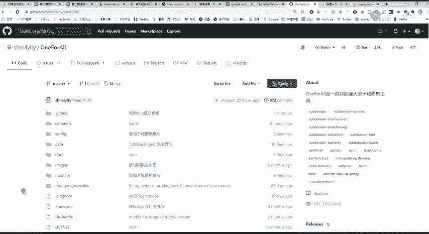

他的缺点。来看这one for2，它是非常好用的，它的用法也非常简单，就是使用我们的python，这里one for2是python3。8或3。7。

加上我们的one for all点PUI杠杠target指定我们的目标。这里有着隔天lab点com。指定目标之后，设置run进行跑。

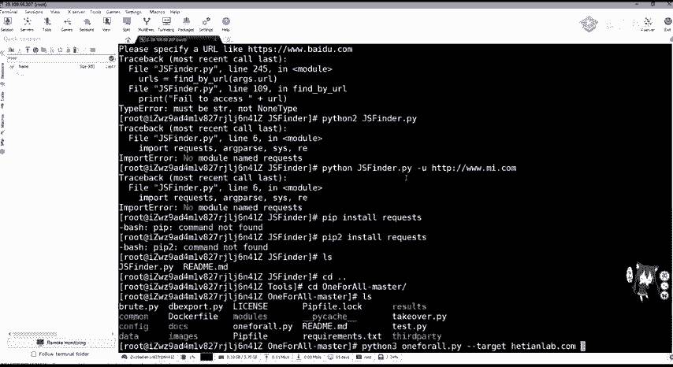

啊，这里因为我是没有设置任何IPI的，它跑出来的应该不是很多。啊，先让他简单跑一下，看能不能跑好。这个跑的太慢了。跑太慢了。哎，就就不跑了。哎，要知道他跑完之后。啊，不是跑完之后。

会在这个result这个目录啊，results这个目录结果里面会有一个对应的TIT以时间这个为命名的TIT文档。

这里面就包括了我们的子域它的复杂之处在于你需要是设置IPI这IPI在我们one for confi目录里面嗯。

点击confi cD的confi里面可以看到有个IPI点PYI呃sing设置PI先看这个sing。3D的PI需要配置我们这个线程数，可以看到有一个可以开启它的版本检查。包括一个代理。

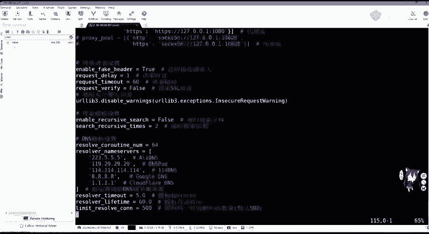

延延迟的一个超时设定，还有搜索的递归层数，这里默认是2这个递归层数大家应该知道吧，就是二级、三级的，还有递归搜索指子域。

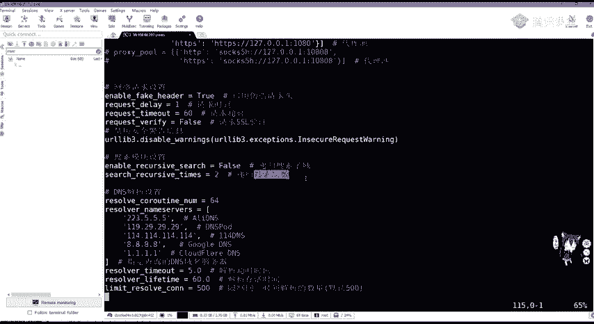

可以设置DNS。

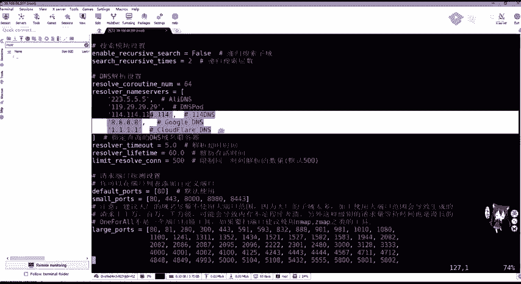

后面呢可以设置一个端口，因为并不是所有的web服务都是开放在80和443上面的。我们可以进行自定义端口，这里默认呢是对80进行了扫描。

我们可以在这里添加443就是HTTPS那这里呢可以对其他端口进行扫描。但是这里是不建议使用的。因为你去扫描这些端口，这里也会有提醒看加上使用大端口范围会导致生成请求上十万百万千万导致内存不足，程序崩溃。

另外这个时间也是非常漫漫长的那就如刚刚这个同学所说这onefi号就不是wifi了变成了断网挖掘机，它有可能挖不到什么。啊，这里个默认基本上用默认配置就没有问题。

我们对wifi号的设置啊主要在这个IPI里面。IPI可以看到你需要去设置。比如说站长之家的1个IPI这里可以免费注册获取。这里wipo特别贴心，他把这些用中文注释，还有链接都给放出来了。

那你只需要去啊现在已经这个。

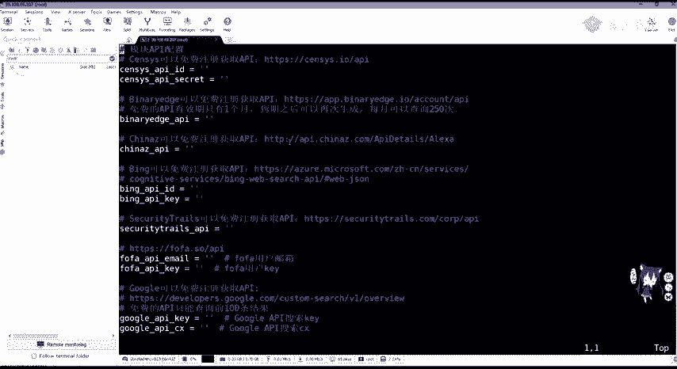

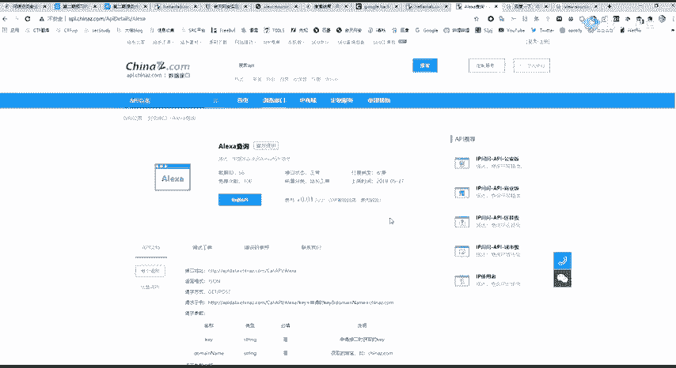

呃，去注册分别注册，然后进行填充。这里还有必应的fo发fo发这里是收费的，还有google的IPI，包括肖旦的IPI。

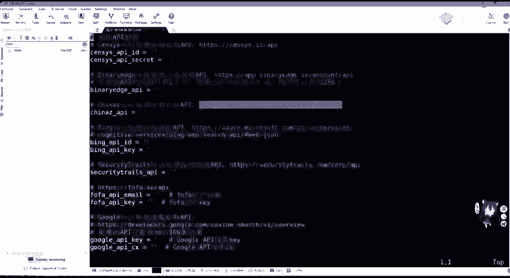

等等。这里需要大家自己去一一设置DNSDB的1个II，包括gitthub的一个token。这里大家都可以自己去访问。

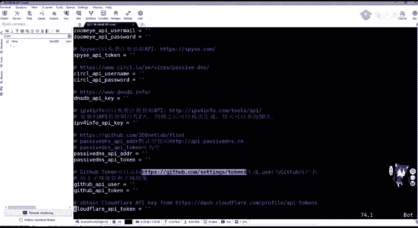

这些链接。然后去设置去设置O片。在着create new cooking进行设置即可。

这里大家如果有不会的话，后面可以问啊，可以问，这里就不给大家做演示了。因为这个IPR是非常复杂，有些收费，但他只需要把免费的啊，就是给搞上就行了。

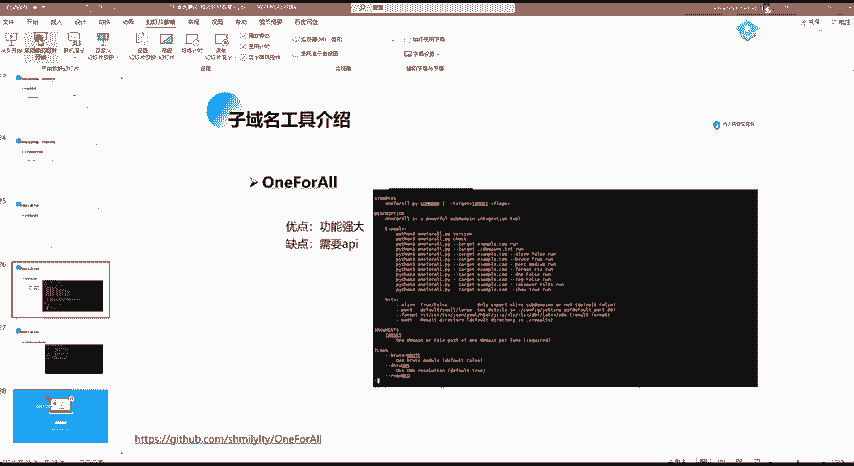

这些子域名工具啊。是非常的多，你去b hub或者是网上一搜，会搜出一大堆。它有的呢是非常的好。有的搜索出的子域名也就非常一般了，数量也不是太多速度也非常一般。那我们就需要不停的使用。

然后进行综合去去除重复的内容进行找到我们最多最快最实用的子域名。那这三个工具其实都是非常不错的。还有一个是sman这个。子玉的一个爆破脚本，这个也是到我们的这个get up上面进行一个刻隆下来即课。

他这里是增加了pathon3的一个支持，这里是更简单了，直接加上我们的域名即可。那我们来看。

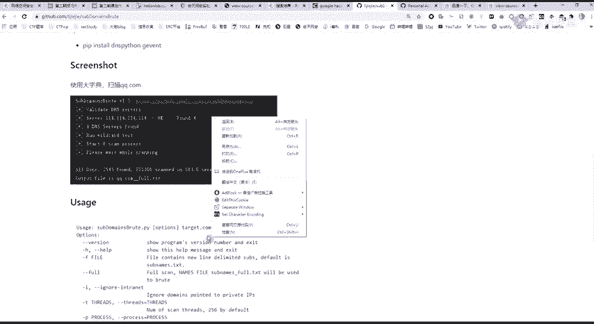

啊能爆破出什么东西。

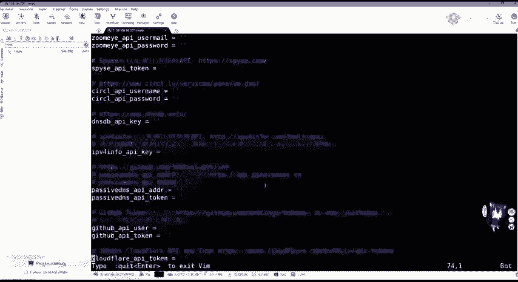

在这里我们啊这个我已经。之前也试过了，那我们python。啊，python加上我们的。Yuming。和田。Lb。Come。还进行1个DNS扫描。也就是相当于用DNSDB进行一个寻找，是原理是相同的。

那这里呢它是有几个啊选项的，包括fo scan，也就是全can。这里呢会利用我们这个sub name full TST进行一个爆破。如果你不加这个杠杠fo的话，它默认就是使用这个。DNS进行一个查找。

爆破其实也是搜索子域名的一个非常好用的一个呃方法。但是不同的工具有可能这个爆破的这个效率，有可能就比如说这老眼它的爆破的非常慢，而且会造成你机器卡顿。

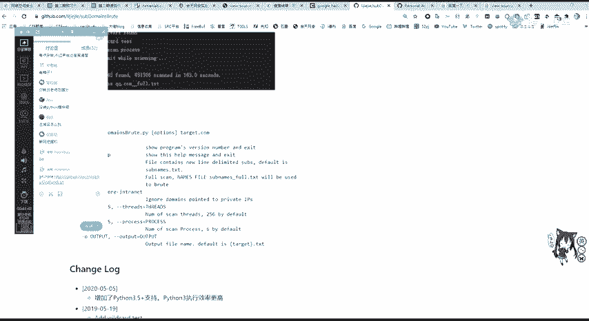

来看。他现在才找到12个就没有wifi2好用的。那大家把wi方的II也配置好了，那其实onefi2是比好用的，但是它的IPI收费，而且还有一个次数限制，比如站长之家一天只是100次，这个就是不是太好了。

所以要进行一个结合。这里它只找到了13个，只找到了13个。还没有这个go狗语法找的耳朵。好，我们ca一下。你看他指导的这13个。啊，这EDU核天lab包括3W和天lab。那么搜索的子域啊。

大家掌握这三个方法就行。大家如果有更好的方法，可以就是自己啊藏起来，你更有更好的子域名搜索方法，自己去把SRRC。

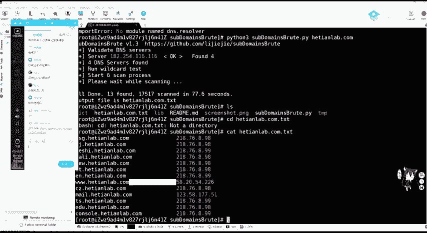

啊，能找到更快。比如说你一秒能找到很多域名，这些也有这种工具的。那今天的这个课后任务呢，大家就是啊使用。任意两种工具吧。因为前面我还是讲是这是预渗透阶段，我们的作业啊可能比较简单。

大家一定要练习一下这个工具的使用。因为在后期你去做真正的渗透测试过程中，是肯定都要对资产进行一个收集的，使用任意两种工具啊进行搜索。收集。和天lab啊和天lab点comM。还有百度。这。呃，子域名。

IPI点PUI啊，可以的。那这里我就给大家就是看一下吧，看一下这APIPI怎么配置。

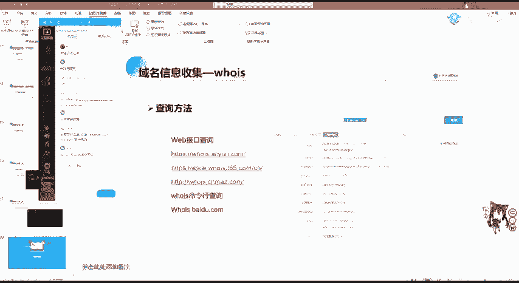

啊，这里是大同小异，因为它很多就是不停的这个东西。你这个嗯wifi的不不配置IPI它基本上啊是。嗯，拿不出什么东西的。那我们来呃看这个在confiker这个目录里面啊，confiker这个目录里面。

IOS。这IPI哎，我们VIM。

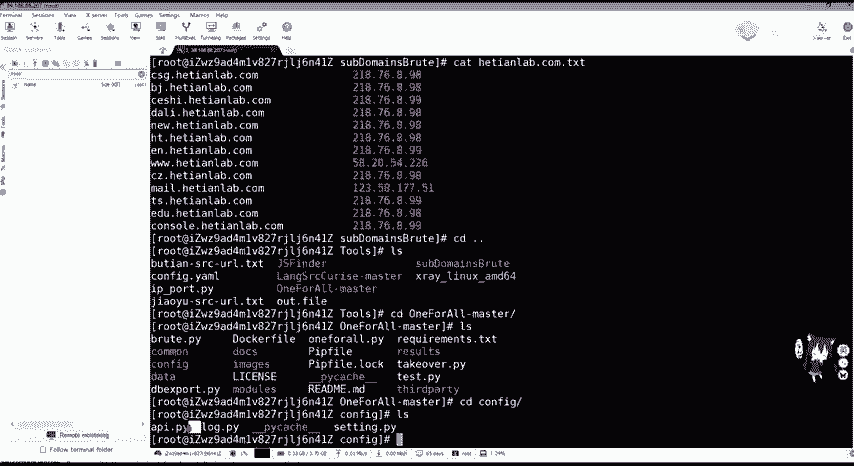

进行一个配置。那这个git up我们来看呀，来看他们进行一个配置。就比如说嗯就用第一个，这里告诉我可以免费注册获取。那我们就去这里吧，去这里来打开这个链接，这个是比较费费劲的啊，比较费事。

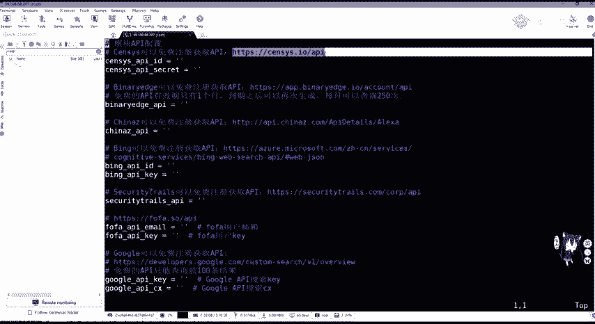

可以在这里呃点击注册进行一个注册。这里我看一下有没有号，好像已经注册过了。好像又没有注册。H。啊，我是已经注册过了，那注册过之后我们去访问这个访问这个链接。啊，也就是它II链接。

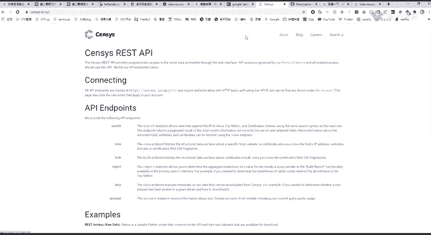

我们来到这个首页。一般的II它会在哪呢？

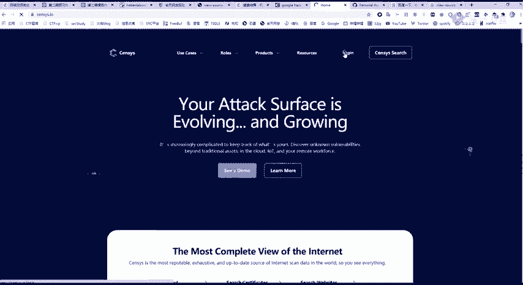

哎，这怎么怎么给退掉了？在这个我的用户里面，用户里面可以看到有个IPI啊，大家应该能看到这IPIIPI这里啊有IPIID，还有secret，那我们分别复制过来，点这个复制。

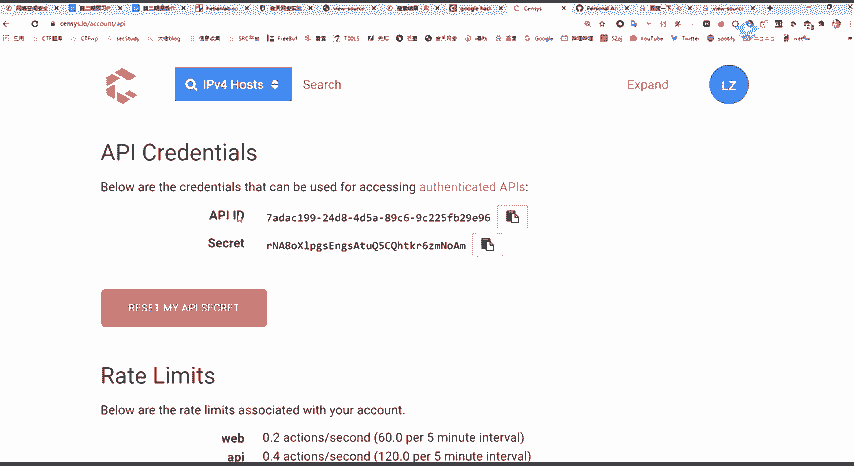

哎，看到这1个IPIID。啊，这个VI编辑器大家应该会使用吧，按I进入insert，也就插入编辑模式。然后把它给粘贴过来。

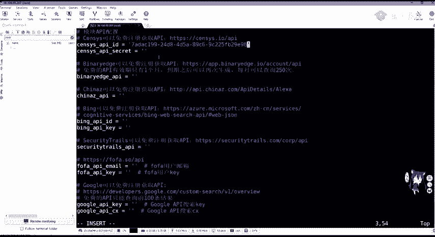

这工具包就是和天的工具，可以找班主任进行啊进行去。

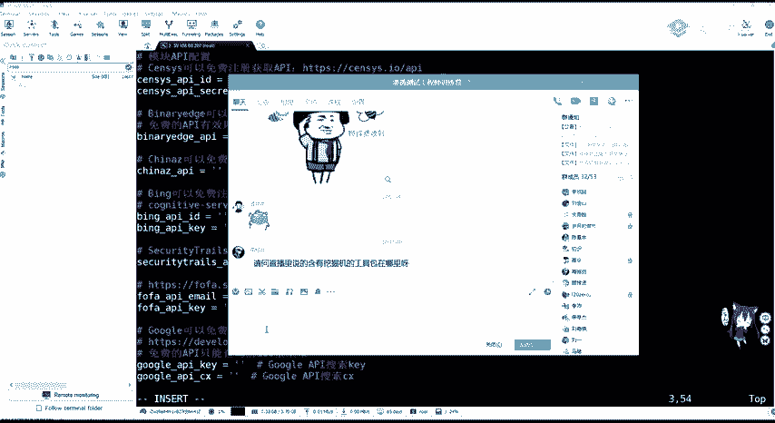

找班主任要找班主任要下载链接。或者一会儿我发到群里也行，把这个链接发到群里。

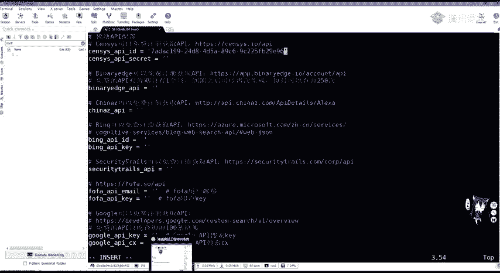

Okay。那我们这里第二个就是这个secret把它复制过来。

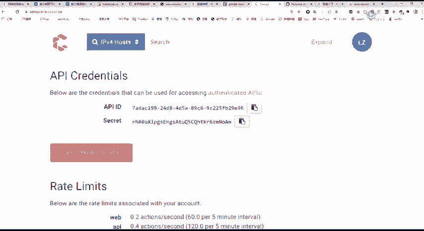

然后同样粘贴。那我们这里。第1个IDI就配置完成了，配置完成之后，按ESC冒号WQ进行保存。那我们这时候。

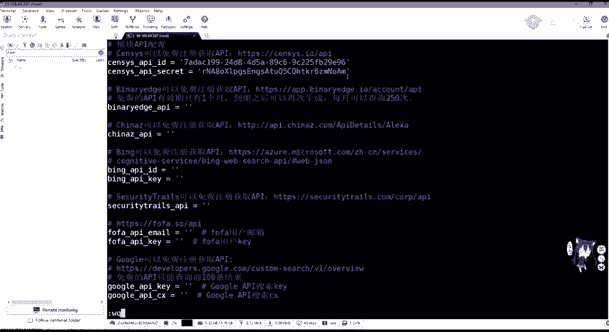

对的，有在线子鱼名挖掘的。在线子鱼挖挖掘，你是浪费别人的服务器资源吗？也有在线的爆破。因为go歌谷谷歌一搜就能搜到。

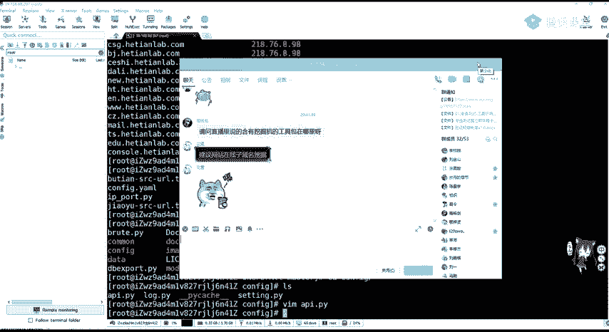

你可以去搜嘛，就个在线的一个挖掘呃是。此爆破。啊，你看第一个就有。那我们这里输入子域名，这里输入我们就不会卡了。启动让它进行爆破是吧？它慢慢的爆破呗。这也是一些方法，你可以写一个爬虫啊。

写一个用拽request，然后把这些信息给抓下来就OK。也是一种爆破的一个方法。那么下面。IPI再看一下还有哪些啊，看一下还有哪些。

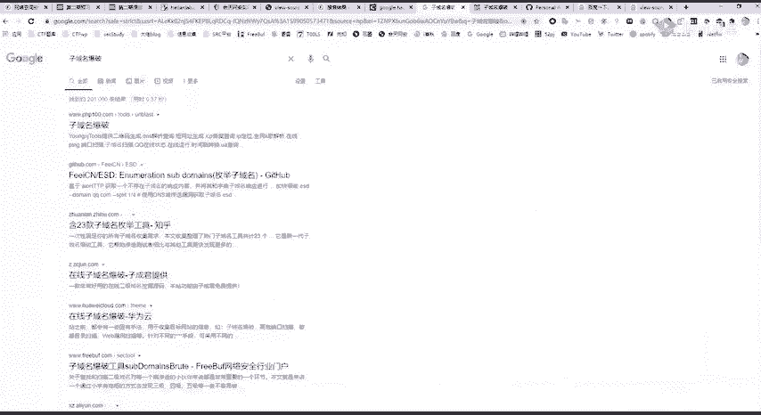

啊，后面这些免费注册的我就不多说了啊，一样的事情，这必应的，还有这个security这个是一样的。for法的话是收费的那我们来看这个啊，比如说get up用接管自于收集。那get up很简单。

你去访问这个token去生成。

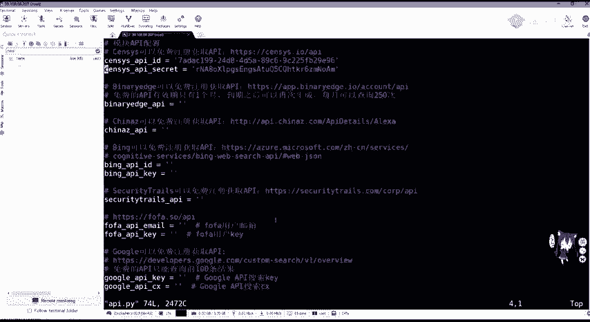

1个IPI即可。哎，这边子域名还在爆破。那好了，抱着玩吧。在这里geth如果没有账号的话，还可以免费进行注册。生成一个新的token。然后输入我们的这一个。内容，然后可以在这里。

去点击我们的一个偷ken，甚至偷跟的信息。生成一个demo一token。感觉生成。哎，这个偷ken就来了。我直接复制过来。

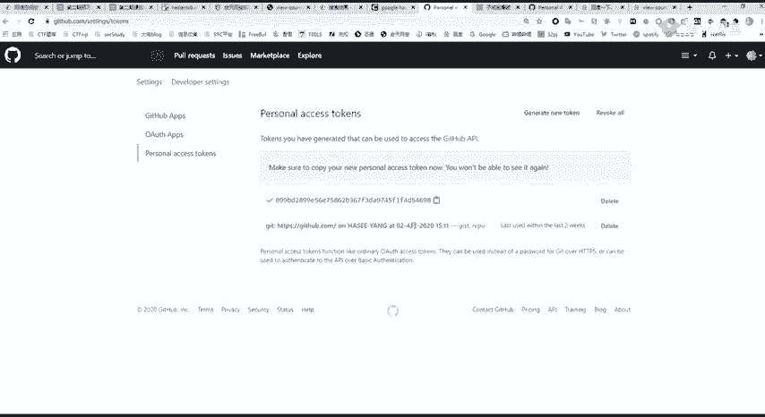

粘贴到我们这个地方。那上面已经告诉你，我们这个token是这个值。那我们的IPRus就是。我们的。这个。get up的一个user名get up用户名。那大家都可以这样去设置。那后面的这个DNSDB。

感觉是一样的。

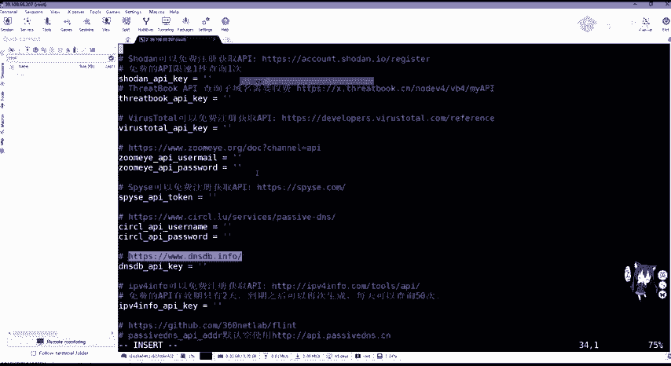

进行一个注册啊，登录即可。啊，这个好像呃注册不了啊。

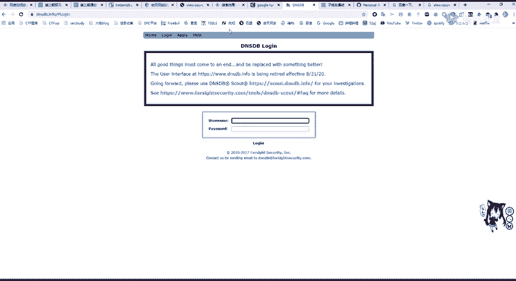

啊，最后进行保存这个II就基本OK。

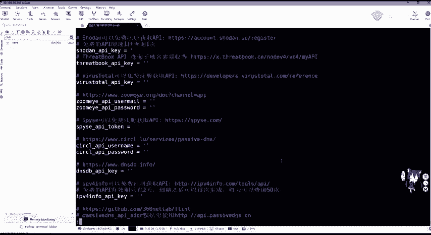

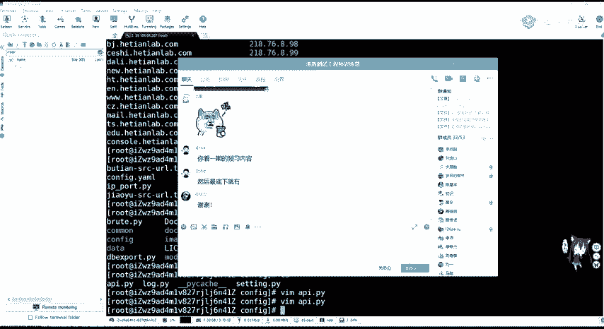

那这IPI也应该没有问题了吧，这个上面它是都有解释的。

那今天的课程有没有哪里就是需要再详细讲解会有问题的。啊，子域名收集是非常重要的，大家不要觉得它简单，就是确实是基础，但是也是最重要的。你收集的域名信息是直接关乎你渗透测试的一个成功率。

那大家如果没有什么问题的话呢，今天的课程就先到这里了。啊大家的课后作业就是使用任意两种工具，或你爆破也好，one call也好啊等等，或者是你自己从网上搜索工具，自己写的python脚本也好。

去搜索啊收集这个和天lab和百度的一个子域名。然后记得一定要在明天下午3点之前提交到我们班主任的这个邮箱。这个课后作业我也会复制到这个文档里面。啊，这里就是。使用任意两种工具。

收集和天n和百度com的子域名。OK那这节课就到这里了，大家在课后的时候一定要把这些工具啊都给安装好。如果没有的话，可以再问何天班主任去啊要这个下载链接，他如果就是没有回复的话。

可以直接啊在群里要或者是找我要都行。大家要记住啊，渗透测试，包括大家在学习外部安全和渗透测试的过程中，一定要常动手要做复线听可能觉得听懂了，但是自己复线，有可能会遇到各种各样的问题。

就像我刚刚进行一个啊域名爆破的时候，这个我在上午是已经调好了，但是刚刚还是翻车了。大家在做的时候有可能也会遇到同样的问题。爬s森脚本无法运行，或者是出现各种各样的错误。在解决中学习，在学习中去记住。

然后在应用到工作中，就是这样啊，这节课就先到这里了啊，感谢大家的听讲。如果大家有什么问题的话，可以在群里问啊。或者是私聊我们都行。那就先下歌了。

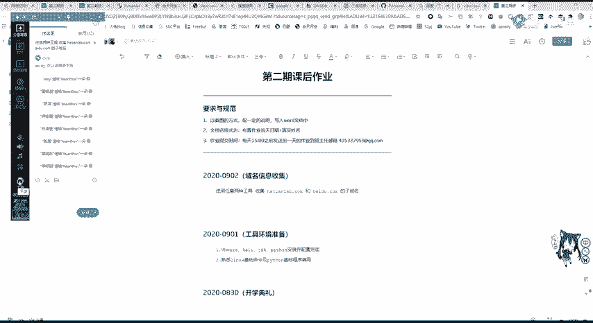