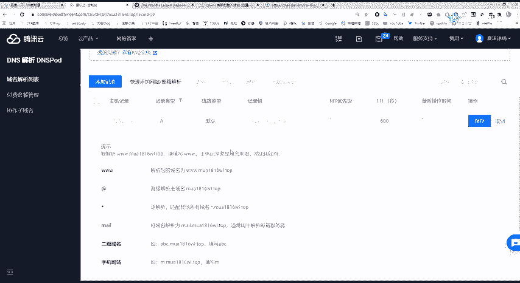
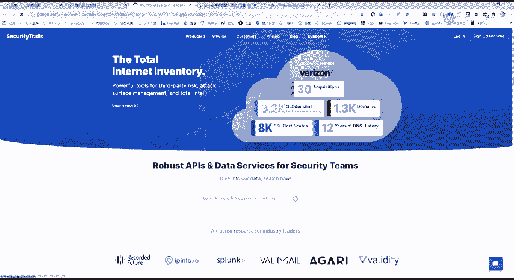
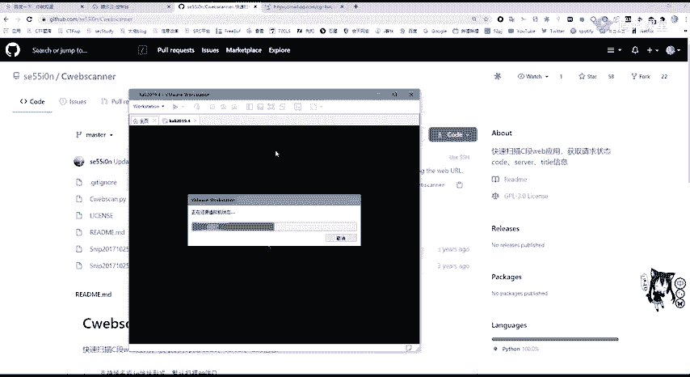
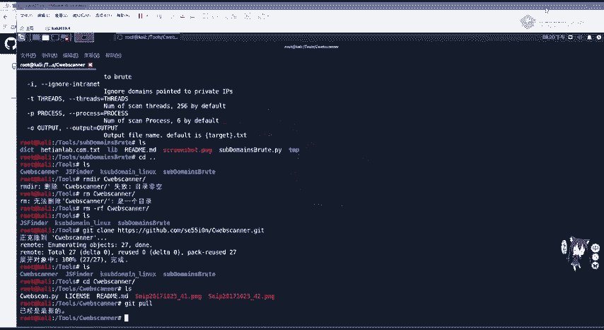
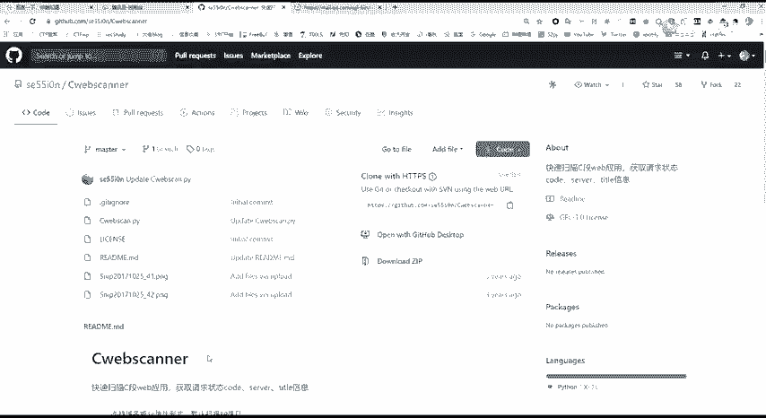
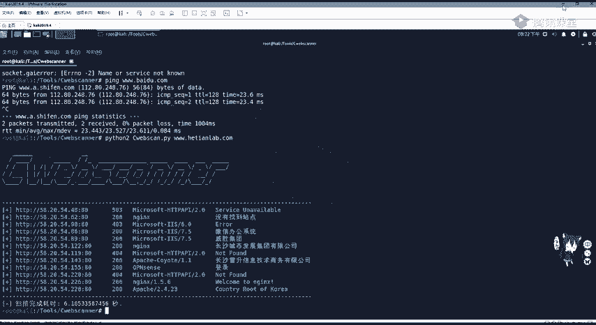
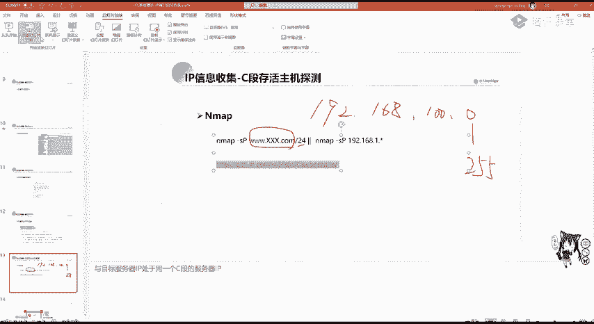

# 2024年最强Kali渗透教程／网络安全／kali破解／web安全／渗透测试／黑客教程 ／代码审计／DDoS攻击／漏洞挖掘／CTF - P25：2_IP反查域名 - 网络安全系统教学合集 - BV1Pe411C7Zb

我们上一节课主要讲了域名信息收集和子域名的收集。这节课呢我们要讲渗透测试信息收集的第二点，也就是IP地址及其端口的信息收集。IP地址信息收集就是非常重要，因为它是代表我们主机名。

当甲方给予大家的这个目标是IP的时候，我们可以通过IP进行反查域名。如果渗透目标为虚拟主机，那么我们通过IP进行反查域名就很有价值。因为一台物理服务器上面可能运行多个虚拟主机，这些虚拟主机有不同的域名。

但通常共用1个IP地址。如果你知道有哪些网站共用这一台服务器拥有同1个IP地地址，那么就可以通过IP进行反查域名。通过此台服务器上其他的网站漏洞，获取服务器控制权，进而迂回获取渗透目标的权限。

这也就是我们经常说到的帮助。这个大家应该用PNP study应该知道，我们在3W目录下可以建多个文件夹，也就是拥有不同的站点。这些站点它是都是具有一个IP地址的。如果我们是使用真实的服务器。

在这一台服务器上可以搭建很多个站点，他们每个站点只是域名不同，而IP是相同的。就像大家有的时候去挖SRC挖到搜cle注入。搜cle注入，你可以看到它这个表，就有非常的数据库，包括表非常的多。

有可能这不只是这个站的数据库，还有其他旁站的一些数据库，这又代表这些数据库呢都是存放在一个服务器上面的。那我们可以通过拿到其他网站漏洞，从而获取服务器权限。通过IT反查域名。

还是使用站长之家china z这个外国接口进行一个查找。就web接口直接我们公司的，比如说582054226，就直接查询就可以查到这个域名和天lab。这就非常简单。第二个。如果我们收到的资产是域名。

包括进行子域名收集。收及到域名，我们需要对IEP进行一个服务探测端口探测，需要看它有没有开启my蚁搜cle呀，或者是readis或其他的桑共享服务等等。那我们就需要知道服务器的IP地址。

通过域名查IP很简单，可以拼一下它拼一下，就是请求DNS将它转换成我们的IP地址或者是使用站长之家的外部接口进行查询。这里我查询何天来。Yeah。嗯。

可以看到这个地址是湖南长沙移动联呃长沙联通获取的地址582053226。还有下面还有一个定位，看一下，他定的并不是很准确。这个看一下就行，但是他查到了这个IP的1个IP地址。那这里就遇到了一个问题。

现在大部分一些SRC网站都是开启了CDN服务。那什么是CDN服务呢？CDN及内容分发网络。是构建在网络之上的内容分发网络，依靠部署在各地的边缘服务器，通过中心平台的负载均衡等等，使用户就近获取所需内容。

降低网络云才，提高访问速率和命中率。这是一个官方的定义。那CDN具体是什么意思呢？比如我现在在湖南，我需要去访问黑龙江的一台服务器。因为我们湖南离黑龙江物理位置就是物理距离比较大。

而且中间呢可能遇会遇到这种各个运营商的交换机，服务器的不停的切换。我们发送给。黑龙江这个服务器的请求包，包括他返回的响应包就会非常的慢，延迟特别高，甚至有可能会存在一个高丢包率的一个情况。

那这时候我们CDN服务就是将黑龙江这个服务器。通过内容分发，分别分发给每一个省CBN每一个地区CBN服务器的边缘服务器上面。也就是这个做相当于可以简单理解为做一个备份。这时候。

我们在湖南省去访问黑龙江的外部服务器，他访问的就不是物理位置的黑龙江，而是访问了这台外b服务器。在湖南省长沙市CDN边缘服务器的这个备份内容。那这里我们访问的速率。这个延迟就大大的降低了。

而且丢包率也几乎为0，就会降低网络云塞。那如果我们使用CDN的时候去查找，一般查找到的就是CBN的1个IP地址，不是网站真实服务器地址。那我们去做一个扫描端口扫描，包括渗透的一个扫描，就没有多大的用处。

那我们要绕过CDN去呃拿到真实的IP地址。啊，这里有几种方法。首先我们要判断是是否使用了这个CDN使用CDN这里还使用呃这个站长之家。战场支家是非常的好用。这里我们对站长之家对一个网站进行多地聘。

比如说我们聘百度。我们稍微等待一下，可以看到几乎每个每个地区去聘百度，它的延迟都是非常低的是为什么呢？因为百度可以看到，江苏省聘百度和深圳市聘百度，它IP地址啊是不一样的。啊，有39有220。

这是因为百度呢开启了这个CDN服务，它是一个就近一个访问。那如果没有开启CDN服务的，就比如说公司的核心lab。Yeah。那拼到的肯定都是1个IP58。那这里他各个省去访问。

他的速率也是非常快的啊也是非常快的。因为他这个线路啊是商用线路BGP。多地聘可以帮助我们判断服务器是否开启了CDN。那我们这里再看如何去绕过CDN呢。首先就是进行国外访问CDN它的是按流量收费的。

并且在中国大陆收费是十分昂贵。如果你对每一个站都开启了CDN，那它的价格如果一个站的访问量比较大，价格是非常高的。所以呢这个CDN一般不会对国外用户进行开启国内的网站。

那我们可以利用国外的多地聘进行查找。这里可以。利用这个国外的多地拼，或者是站长之家，他最后也会拿国外的服务器进行拼，或者是这个。这个外we卡卡这个。卡卡网都行的。可以在这里设置啊。

我们可以只让它全选之后点掉，然后点击海外。用海外的这些机房去聘。就可以看到他是否在外国开启了CDN如果这些国家聘的都是1个IP地址，那这个IP地址就是真真实IP地址。这是其中一种方法。

但如果他在国外也驾设了CDN，那就这个办法就行不通。第二。第二种方法，查询子域名的IP还是刚刚说过的。因为CTN的价格非常昂贵。当我们架设子域名，也就是开启其他网站的时候。

一般啊一些庞站小的站呢不会对它进行CDN架设。那我们通过查询子域名的IP。并且去查询他的C段，就是同一个网段中的IP有可能会拿到他的真实服务器IP地址。这是查询子子域名IP大家应该知道吧。

就是用子域名收集之后拼一下，或是用刚刚的站点之家进行查询即可。第三种方法，查看PHPin文件，但这里是有限制的。第一个就是这个服务器上必须有PHPin文件。这个文件大家在加设网站的时候，一般会给删掉。

所以这个可能性是比较小的。在P info文件里边，我们可以看到一个servver IDPR server address，它会显示我们服务器的真实地址。

如果你是在本地去装PA study去访问PA info的话，你看到的是你的内网地址。而在公网服务器上，你去访问去查看servver address发现这里8918473149即为公网I地址。

也就是服务器的真实地址。但这个可能性比较小。一般的网站架设管理员都不会把PA info给你，并且很多网站是SP和GSPpython等等，并没有PA文件。还有一种方法就是邮件记录邮件服务。

在邮件的原始代码中会显示邮件服务器发送的地址。如果这个邮件服务器和网站的外包服务器是搭在一个物理机上面的那就可以找到外包服务器的真实IP地址，那这个邮箱的原始内容应该如何查看呢？那。

这里就拿这个啊QQ邮箱做一个演示啊，其他的邮箱也都大同小异。随便看一个。就比如说这个啊。有个漫画网站，那我们去看在这里。我们点击最这边的一个箭头会显示这个啊这个显示原邮件啊，原邮件邮件原文。

显示邮件原文之后，在最上面有个received。from168245106255。那这个就是这个PC这个网站，它的邮箱服务器的IP地址。如果他是和外国服务器在同一个地方的那这就可以拿到他的真实IP了。

那这里我们来稍微看一下他的一个。那IP啊，这里。IP肯定是能拼通的那我们就不看了。那是一个。美国的原IP地址。最后一种方法也是我觉得啊就是跟多地聘非常常用的一个方法，就是查询历史DNS记录。

查询历史DNS记录，我们还是使用这个啊。DNS这个网站。外国网站进行一个查询。本级查询隔天。Lever。我都是以公司的这个为例哈，大家可以去看，这里可以看到这些记录，包括他的IP地址。I记录的IP地址。

这里我们是看目全的，看目权可以用第二个。第二个大家注册一下，就可以看到它的完整记录。那为什么查找历史的DNS会去拿到这个IP地址呢？是因为我们在申请完域名之后，都会对域名和IP进行绑定。

也就是进行域名解析。当我们解析完之后啊，第二步有可能才是购买，并且架设CDN服务。有可能一开始啊这个网站管理员搭好了网站测试好之后才去购买的CDN服务，或者是后期需要CDN的时候再进行购买。

那我们一开始的进行的域名解析，就是把域名和某真实的ID进行绑定。那这些呢这个记录就会放到这一个历史DNS记录里面。那我们就可以进行去查询。这里比如说啊这个腾讯云腾讯云里面，这个你去做了这个域名申请之后。

你需要去添加记录。这添加记录我们可以看记录类型。啊，这是腾讯云。阿里云万网也是一样的那我们可以添加I。我们去查找DNS记录的时候，也是查找I记录。I记录是什么？用来指定域名的IPV字地址。

将域名指向1个IP地址。那我们肯定是需要这个嘛，需要这个之后，它的一个记录值。啊，这个主机的一个记录很简单，就是3W。是可以解析为这个域名。

或者是进行泛解析或者是二级域名ABC或是SYZ等等进行二级域名的解析。那么解析好之后，这个域名就会经过呃几个小时之后就会绑定在我们的。这个呃解云解析上面就会解解析到我们的IEP地址。解析到IP地址之后。

有可能才进行一个呃CDCDN的一个开启。

Okay。开启CDN的话，这里大家如果架设架设网站的话，应该嗯是知道这个。呃，cloode fire这个网站。

这怎么了？这梯子挂了呀。那这里就先不讲了，这里我们就是呃在架设之后。开启。第第一次进行域名解析，它会保存这个记录里面呢我们可以去查找。他的这是IP地址。绕过CDN的方法嗯，就上面几点，大家要熟悉。

因为有可能一种方法行不通，用另外一种方法。如果他对全球都开启了CDN架构建服务，并且没有进行一个解析的话，那就没有办法绕过了。这个就没有办法。但是一般进行小站的话，是肯定能找到IP地址的。

在找到真实IP之后，我们需要对IP的C段进行主机探测。什么是C段呢？就是同一网站，比如192。168啊，168。100。点00至255，他们都是属于一个网段里面的。这一个网段在公网里面。

如果一个公司去申请IP地址的时候，一般都是相邻的网段，就是在同一个网段中的相邻IP地址。那我们去探测C段，就会找到这个公司其他的资产，包括主机，这里可以使用N map进行一个探测。

N map杠SP使用P进行探测。可以加上域名。杠2424就是子网掩码，255255250就是子网源码，也可以加上我们的IP地址进行主机探测，生活主机探测。

或者是N map它的速度是比较慢的那我们可以使用第三方工具C web scanner进行一个。查询。那这里我们还是大家一定要学会这个用get up进行安装。嗯，我先把这个讯机打开。

。去。克隆软件非常简单，直接把它克隆下来即可。啊，这里。这里好像我是给删掉了。Okay。Yeah。嗯。I。直接get，然后克隆。把这个地址给粘过来。克隆完成之后啊，大家说怎么升级升级很简单，直接get。

然后who直接这样就可以升级。这里可以看到是最新的，不需要有个升级的，不需要升级的。

那如何使用在get up的这个read me这个markdown里面已经写好了，非常简单，python加上。

CV看点PI再加上我们的这个。嗯，域名可以指定端口，因为刚刚讲过外包服务不仅是80，有可能会自定义为8080或其他端口，或者是HTTPS的443端口。那这里我们来扫描一下。

刘就拿这个和田的。进行扫描加上。每天。那个。点com。加上杠P，我们。这个8080端口HTP端口443端口HTPS端口进行一个扫描。这里是。要翻咧。还是排第爱。哎，我看一下。那是核天籁吧。

还要加还要加上3W。今天上秒。就他默认会扫080端扣，这以大家可以看到，582054后面这些加上同一C段的这个网站，他都会给扫出来。这里可以看到有其他的一些网站对。这就不打开看了，就是是扫描C段。

。Yeah。

。