# 2024年最强Kali渗透教程／网络安全／kali破解／web安全／渗透测试／黑客教程 ／代码审计／DDoS攻击／漏洞挖掘／CTF - P26：3_端口信息收集介绍 - 网络安全系统教学合集 - BV1Pe411C7Zb

那下面呢我们需要对端口进行收集。端口端口是什么呢？在互联网上，各个主机通过TCPRP协议发送和接收数据包。那我们每个数据包它需要知道主机的IP地址进行网络互联网路由选择。

从而将数据包顺顺利的传给目标主机。那他需要传给哪一个服务呢？这就是通过端口号来一个区别。端口呢是根据提供服务类型的不同，可以分为TCB团口和UDP端口。TCP和UDP是传租层的两个通信协议。

一种是面向连接的可靠通信协议，一种是无无连接的，不考核不可靠传输协议。那TCP大家如果学过集团性网络，应该知道它是有一个三次握手的过程。UDP是没有的。TCP协议的端口和UDP协议的端口是相互独立的。

大家要知道。那端口的类型呢分为三种，是根据端口的大小来进行划分的，一种叫做周至端口是0到1023，这10001024个端口。这些端口呢是。系统固定服务的一个端口号，也就是众所周知的端口。

比如80是3W服务，也就是web服务的一个端口。第二种端口叫做动态端口，一般不固定分配某种服务是49152至65535这个最大端口。这些大端口是不固定分配某种服务，也就我们可以进行使用。

第三种叫做注册端口，范围是从1024到49151是用于分配给用户进程或程序。当我们比如哎进行一个外b服务链接连接的时候，你去访问外b服务器的80端口。外b服务器会发送response响应包返回给客户端。

那客户端上面就会有一个端口去接收这个response。那这个端口就属于注册端口范围，是分配给用户进程程序。端口的作用，我们为什么要收集端口呢？那把服务器可以比作一个房子，而端口呢比作进入这个房子的门门。

那我们作为渗透测试，就是作为一个窃贼，我们需要进入这个房子。那窃贼想在没经过房子，主人允许进入房子就要破门而入。那在破门之前，那我们肯定要知道这有几扇门。这个门呢是什么东西，门是铁门还是木门好不好破。

门后是什么东西，也就是俗称的踩底。踩点踩的越多，对顺利的渗透就至至关重要。在渗透测试端口中，我们需要了解周至端口。周日端口有哪些端口具有一个渗透测试的可能存在漏洞进行一个后门而入呢，通常是具有这些端口。

我们来一一看一下重点的一些端口。首先啊这个是FTP文件传输协议。是使用2120呃用于。20呢用于传输数据。21用于控制传输信息。这个呃大家如果学过网络的话。应该是呃很清楚。FTP文件产出协议。

他有哪种有哪些可疑的漏洞点呢？第一个叫做FTP爆破。我们可以使用HRDIR这个软件这个程序在这个呃卡里里面也是有的，可以看它的一个使用方法。它可以爆破各种的服务啊，可以爆破各种的服务。

可以看到有FTP有脏吧。有嗯SMTP有SSH等等，还有VNC。第二种叫做FTB匿名访问。当FTP没有开启一个验证的时候，我们可以使用匿名用户密码为空登录FTP服务器。那可能会泄露敏感信息。第三呢。

FVSFTPD这个是林操作系统的FTP服务器。那就可能存在后门漏洞。通过其可以提全到root权限。这个大家可以自己去搜索，并且啊尝试看能不能利用。第四呢就可以进行一个秀探。因为FTP呢是使用铭文传输。

这里就还有后面的远程代码溢出跳转攻击，这些就是啊比较不常用了。大家可以进行了解一下。这里主要是对主要端口进行一个介绍和了解。如果零基础的同学就是一定要知晓这些端口。

也可以就是之后会把这个PPT发到我们群里，也可以把这些保存一下，进行一个查看和记忆。第二呢，SSH就是啊远程规话接口啊，远程传输协议安全传输协议。那我们可以利用这个远程登录服务器。同样他也具有绕口令。

还有一个用户枚举端口SSH大家应该就非常熟悉了。那我们需要连接到我们的卡利里面，就可以使用SSH的客户端进行连接一个服务器，连接服务器这里。

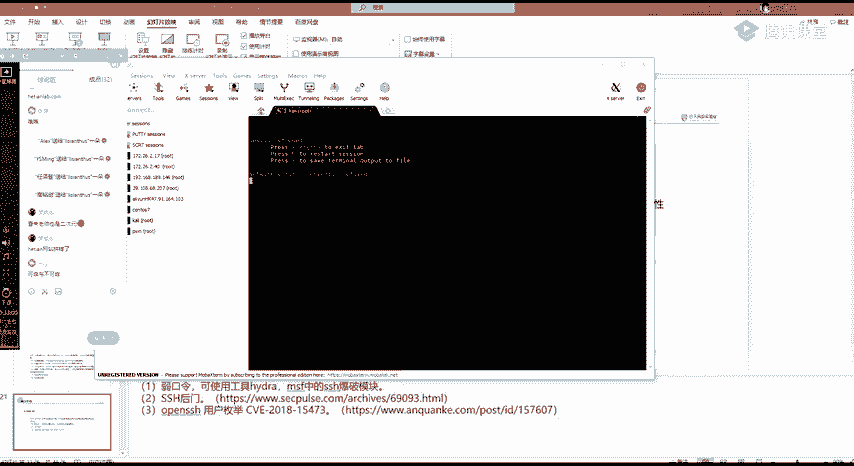

啊，没连上应该是这个服务是没开。嗯。把开启之后。

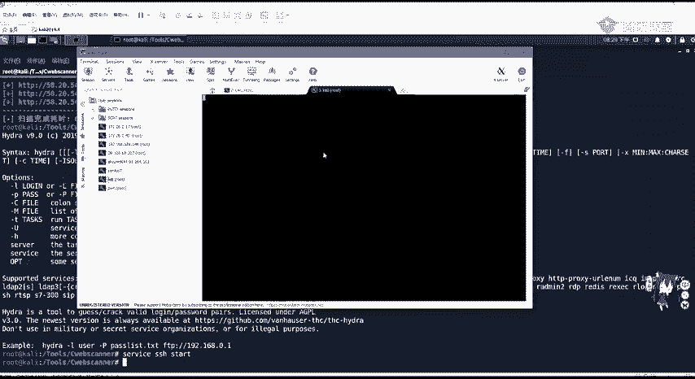

啊，我们就可以连到就我们这个服务器，就可以对它进行一个shall一个操作。他的端口啊是22。tnettnet也是一个比较相似的SSHSSH叫什么叫。安全sha。

而tnet呢在我们的windows下是十分脆弱的，它是没有经过任何加密，就在网络中进行传输。那我们如果对它的流量进行一个拦截，就可以获取截取远程登录的一个密码。SMTP邮件协议啊。

邮件协议这个可以利用这个服务发送钓鱼邮件，分别是25和465端口。3W最常见的超文本传输协议HTTP。是用于我们外部服务器的一个站点啊传输。那我们通常呢80端口是使用中间键的。

比如IIS阿帕奇engtomca等等。我们一般通过外部应用程序常见漏洞OWSP可以对80端口进行一个攻击，或者是使用中间键的漏洞。比如阿帕奇的任意文件读写漏洞。下面3把。共享文献服务一般是139。

和45。用lin叫做扫马服务445端口，大家应该知道有一个特别出名的漏洞啊，有几个特别出名的漏洞MS17010M08067都是桑马服务所具有的漏洞，包括今年的这个永恒之黑，都是扫马445端口的漏洞。

大家可以去搜索利用，直接去松它的脚本去跑，或者是使用ma split进行一个渗透测试框架利用即可。mysocle3306mysocle数据库，一般我们使用PAAPP进行外b服务搭建的时候。

会使用mysoq数据库。那mysoq呢可能会存在一个弱口令，或者是呃进弱口令登入myoccle进行一个提全。RDP33893389是我们windows远程桌面鉴听端口，可以进行。

如果3389进行开启之后，可以对远程桌面进行一个连接。OK这里也没有什么了，就是1个RDP的一个爆破攻击。还有一个死亡蓝屏MS12020远程桌面漏洞。

包括MSMSF通过外国漏洞开启RDB或者是调用注册表开启远程桌面进行远程桌面里连连接。大家都知道，如果我们使用admin去连接了这个windows5器的远程桌面，那我们就对它拥有绝对的控制权了。

所以445端口和3389端口是一个漏洞非常多的一般也比较常见。readis redis是一个可持久化的日志型数据库，它一般存放在内存里面。这里我们一般是redis弱口令。未授权访问。

也就是我们可以通过SSRF去打造6379端口reads进行一个未授权访问。we weblog7701是中间界or的它welog SSRF及反循环复盘序列化漏洞，这个对影响是非常大的。

大家也可以去搜索利用在后面的课程也会给大家去讲SSIF和反序列化漏洞。Yeah。tom cat8080t to cat是阿帕奇的一个分支，一般用来GSP，也就是java web page的一个服务。

我们通常对加接写GSP的时候进行运行，一般是使用toptca作为中间键。那tom也具有任意文件上传上传或管理页面若口令get share等漏洞。大家可以去自行搜索。这个都是要去积累，然后去发现这些端口。

那我们进行端口扫描，一般是使用N map。A map是一个啊不老的神器，一直都很好用。如果你使用它把它使用好了，那它去探测网络是非常的快的，并且可以进行一个漏洞的扫描和利用。

N map是一款开放的源代码网络探测和安全审核工具。那它的一个参考指南有中文啊，中文参考指南，这个我也经放到我们的预习资料里面了。大家可以去看一下这个参考指南。

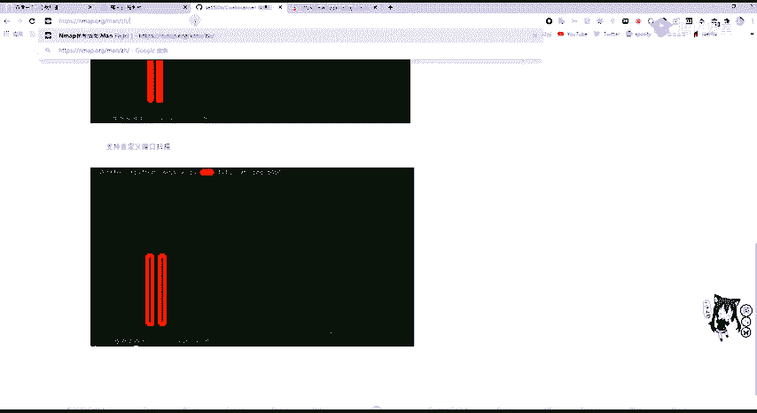

他会告诉你端口的一个扫描。功能介绍很简单。第一个主机发现，刚刚已经说过了N map杠SP加上我们的域名或IP地址进行1个C段的扫描。第二。也就是我们今天要讲的探测主机开放端口去攻击这些脆弱型端口。第三。

可以检测相应端口的服务版本，比如三大服务，它只是特定的版本，具有MS08067等等漏洞。那我们可以探测通过M map探测相应的端口软件版本。第四。

N map能够帮我们检测操作系统版本硬件网卡地址及软件版本。第五，N map可以帮我们检测脆弱性漏洞。那Nm有很多脚本可以帮助我们检测漏洞。当我们使用Nm进行端口扫描的时候。

回显过来的一个端口信息就只有啊常见的这三种。后面几种就是大家看一下就行。首先open这很明显是端口开启，并且。意思是数据有到达主机，有程序在端口上监控啊，这里就是端口开启close很简单，端口关闭。

那filter这个是意思是数据没有到达主机返回结果为空。这里呢一般是被防火墙或者是硬件IDS流控给过滤了。啊，我们一般会遇到这三种。端口状态。它的基础用法非常简单。

使用跟NM杠I可以进行一个全面扫描杠T指定它的一个。呃，速扫描的速度，这个T可以指定从0到5。越高它越快，T0代表非常慢的扫描可以逃避IDS硬件的一个检测。而T5呢是极速扫描。

这种扫描会降低这个端口检测的准确性。我们一般是使用T4，也就是快速扫描。在网络环境很好的情况下，这个扫描是很快的很方便。在默认情况下，这个Nm并不会扫描所有的端口，因为扫描所有的端口。

它这个数据是非常的大非常的慢。它默认是扫描周支端口，也就是1到1024。那我们这里可以啊尝试扫描一下。嗯。这。MMMM杠。A杠T4那就扫描我们的这个。可天来吧。Yeah。嗯。Okay。

Mm的扫描会发发起大量的数据啊，如果对面有wa或者是IDS，你是的IT是很容易被搬掉的。Yeah。这小子也挺慢，那我们先继续看。那它的基础用法呢可以对单一主机进行扫描，也可以对子网进行扫描。

子网扫描这里也已经说过了，也就是加上子网源码。进行直光扫描，也可以对多主机进行扫描，也就进行排列。进行主机范围扫描，用抗指定扫描1921681。1至1921681。100。也可以将。

IP地址写到TSD文件里面，用杠Iim l import list进行一个IP地址导入扫描，就是批量扫描。当然这个过程是非常慢的是非常慢的。刚刚我们看到扫一个都特别慢，那他还没出呀，还没出来。

那我们再不解。在扫描的时候，对子网进行扫描，也可以使用杠杠exclude进行一个。呃，去除。比如这里我们不想去扫描点一这个网，因为它一般是作为我们的网关，我们扫描它没有什么用。

也可以把除IP外的子网主机写到TID文档里进行去除扫描。也可以指定扫描主机上面的端口。比如我们不想让它变译1到1024去指定802123去扫描这个端口有没有开放。如果是扫描全端口也非常简单。

就是使用我们的这个啊杠P啊，0至65535进行扫描。当然这个过程是非常慢的。那这还没出来。不。嗯，对的，官网有这个叫ZN map，这个是一个窗口界面，窗口界面还可以看到top图。

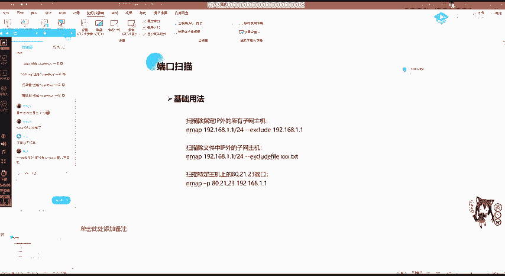

。那我们来继续来看，通过Mm进行探测主机，我们可以使用啊配合cut cut命令进行一个探测。使用M app map这个参数啊非常的多，大家可能一时半会记不住，这没有问题。大家只需要记住这几个关键的。

比如杠A杠T4，然后其他的大家可以照着这样敲多敲两边多接两个渗透的项目，那你肯定就能记住了。

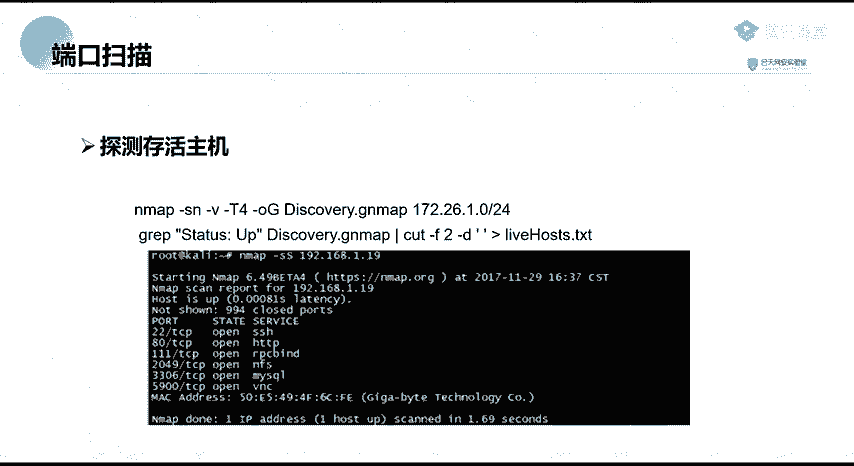

那这里SN啊我们来分别的看一下。首先SN它是等于SP的，也就是进行P扫描。P扫描大家知道吧？就是相当于嗯ICMP这个协议。

杠V可以扫描它的端口杠T4刚讲过了，杠OG outputput outputput g是以GN map进行一个文件导出，就是将扫描的结果导存在这个discover gN map这个文件里面。

扫描内容是172。26。1。0的所为网段。

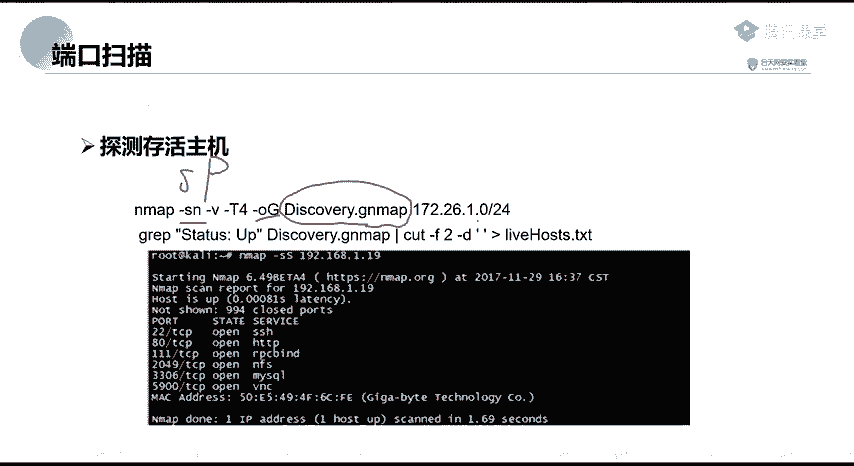

这里也可以给大家去演示一下，就扫描我们这个卡利在这个网段就行了。这里我直接给。

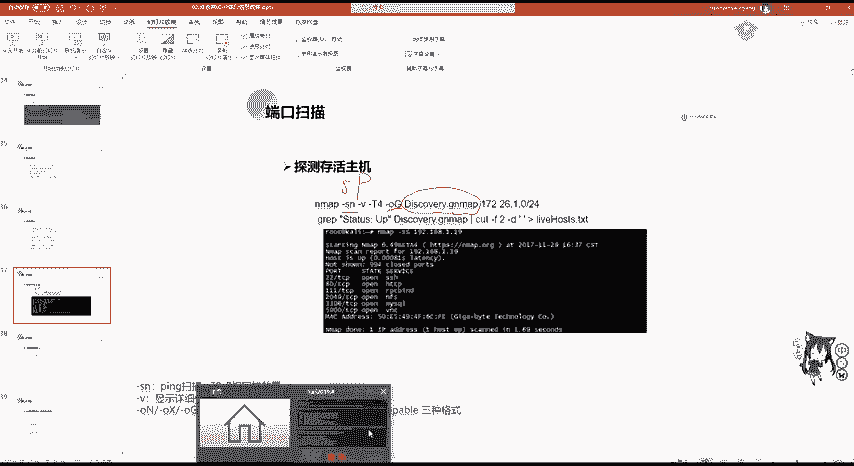

退掉了，这里扫描扫描书就是那些端口嘛，这个核天是有IDS的，你会扫到扫到很多fil。那我们这里看A map。首先看一下我们的IP地址啊，189135。

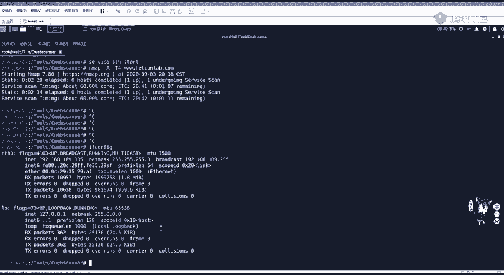

。

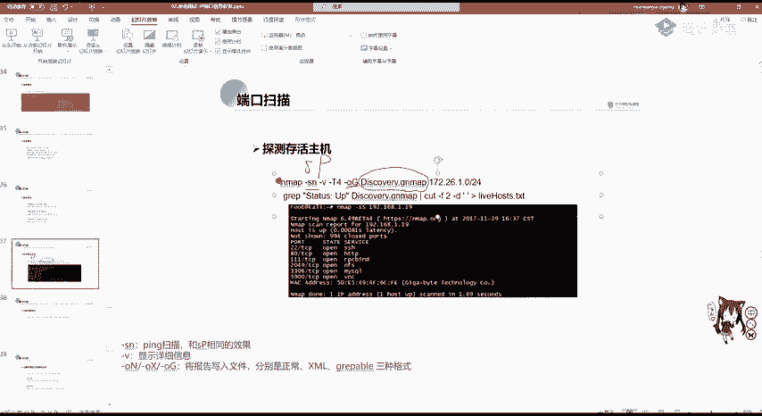

그。进行1个192。1168。189。0224进行一个扫描。他会扫描，这是可以看到扫描的一个结果。那他是告诉有4个啊，这个是开启的。那我们可以ca一下这个。这是扫描一个结果。那有up有档档就是关闭。

up是开启。那我们这样看是不是非常复杂非常复杂。那我们可以使用lin0克斯自带的啊GREP和cut进行一个查找查找之后的这个内容放到liveho点TIT这个文档里面，使用GREP去查找up的这个东西。

直接复制过来。

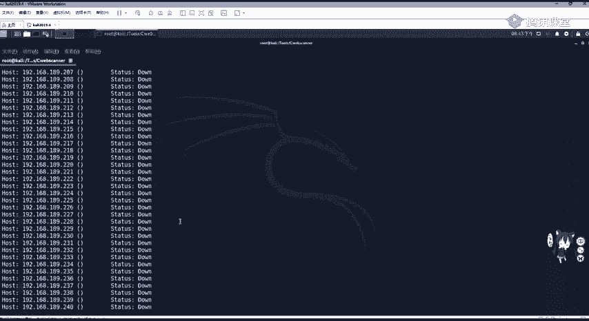

。呃，他放来之后，我们去查看这个li host，那这些就是开启的。可以看到135，我们本机是开启的一个存活主机探测，它速度也不慢也不慢。

啊，非常快的这个。那我们可以对存活的主机，也就是刚刚我们就进行了一个C段探测进行一个全端口扫描。在全端口扫描的时候，我们一般不推荐使用SP和SN因为ICMP会接收响应包，它会发包，并且接受响应。

有一个叫TLL值，它会接收响应的那我们一般是使用SYN进行扫描。SYN大家如果学习TCPIP的时候，应该知道，当我们进行TCP第一次握手的时候，是由客户端发给服务端SYN这一个呃数据。

然后进行一个回复ICK那SYN这里呢就是单独SYN扫描，它不会从服务器接收响应。这样的话就可以更好的防止。IDS对我们访问进行一个探测，还有把IP给封锁掉PN呢就是no pin不使用杠P杠V杠74。

刚刚已经说过了，杠P就是指定端口。我们对全端口进行扫描杠O是使用output导出导出什么呢？导出使用默认导出导出名称为 tCP对live点TIT里面的这些进行一个全端口扫描。

那我们来看SYN扫描在Nm中叫做半开放式扫描，它不会进行一个完整的TCP连接。它的特点呢是执行特别快，效率高。因为1个TCP连接需要三次握手，而SS选项不需要握手。

Amap发送到通过SYN包发送到远程主机，不会产生任何的绘话。也就是说，目标主机几乎不会把连接的这个日志进入到系统日志里面。那这里因为他特别慢，就不给大家演示了。下面还有一些常用的N map语句，啊。

这里就是这些参数刚刚都已经讲过了。啊，S one in扫描no pin。output以那个N map的GN map的格式进行一个扫描。啊，下面SV进行一个版本探测刚O是查照操作系统，就是是探测操作系统。

刚SV探测每个服务的版本号。当然你探测东西越多，它的速度就越慢，这些是一些常用的命命令。同时，n map也可以进行一个漏洞扫描。在我们N map的 screams这个目录里面，它是有很多这个扫描工具的。

这里有非常多，可以看到有CVE编号可以进行进行扫描，包括桑把子一些服务，永恒之蓝都可以进行扫描。这里呃比如说进行扫描MS17026，它是45端口，也就是桑把服务的一个漏洞。

我们使用45端口杠V显示详细信息，然后杠杠cr指定我们要扫明的扫描这个脚本s啊这个gost，也就是这个08这个17020进行对192168点1。0这个网段进行全部的扫描。如果有的话。

我们就可以利用现有的POC或者是matta split进行一个攻击。获取服务器的下有权限。Yeah。那这里对m大家有没有什么问题他的使用？反正大家按 map还可以使用python呀。

python有摁 map这个包的，也可以使用nm辅助pathon脚本的编写。

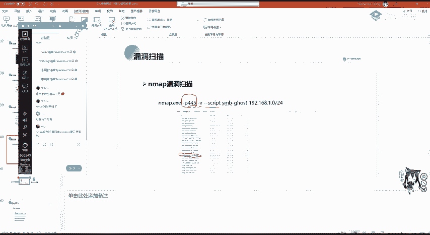