# 2024年最强Kali渗透教程／网络安全／kali破解／web安全／渗透测试／黑客教程 ／代码审计／DDoS攻击／漏洞挖掘／CTF - P27：4_其他信息收集-社会工程学 - 网络安全系统教学合集 - BV1Pe411C7Zb

下面我们来看其他信息收据。其他信息收集一般是对一个历史漏洞收集。也就是我们现在拿到一个网站，它是CMS连CMS或者是森科PHP阿帕奇啊，我们当探测到这些中间件或者是网站的架构之后，我们需要对它进行攻击。

那攻击我们不可能是自己写攻击脚本。那我们要拿现有的漏洞，也就查看历史漏洞信息，这里有几个平台，首先乌云，因乌云的站是已经早到关闭的，但是乌云镜像，它上面还是保存了呃很多东西的。

这个你去百度搜索或者自己搭建都行。啊，这里乌云镜像很多路人甲路人甲乌云大佬路人甲补天带头大哥。第二个就是乌云的知识库。这些啊都会发给大家。无人的一个知识故可以在这扫描。嗯，比如说。

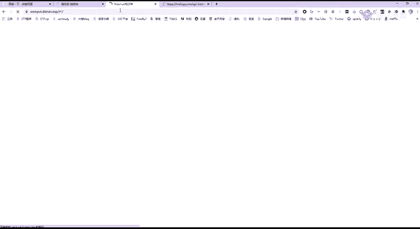

这个想学啊，胖啊，就搜索ROP这上面就有ROP的一些知识。想学SSRF。啊，直接去搜索。

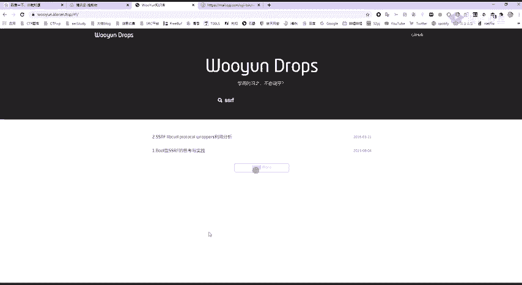

下面呢是一个explode dB历史漏洞，包括E叉P的一个搜索。

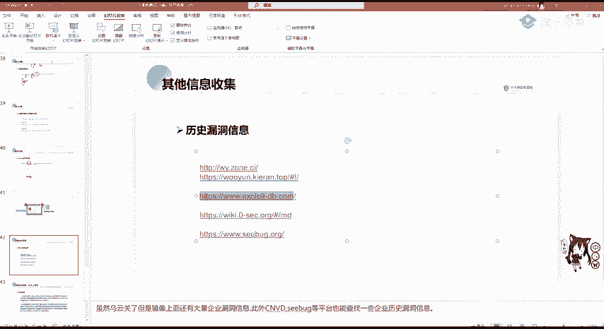

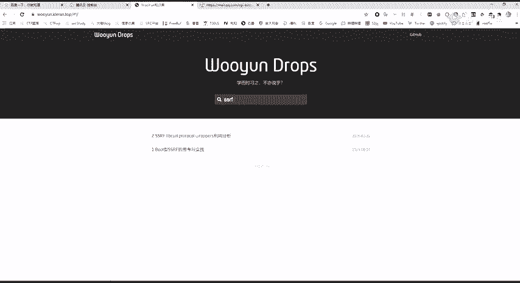

这是一个国外的平台。呃这里我们想搜索阿帕奇有哪些漏洞，那我们可以在se这里面输入阿帕奇进行搜索。可以看到啊，就是阿帕奇输入这个漏洞。

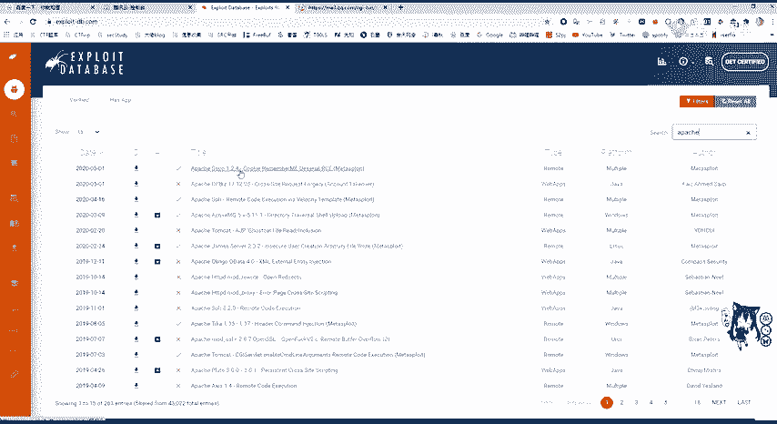

包括其他的一些啊，他有的是有这个E叉P的啊explode，我们可以直接把它下载或者是查看，然后直接拿来用就行。

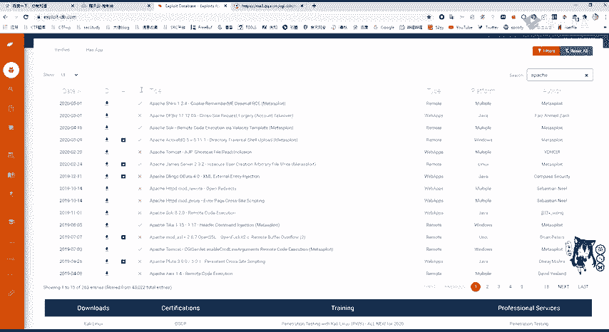

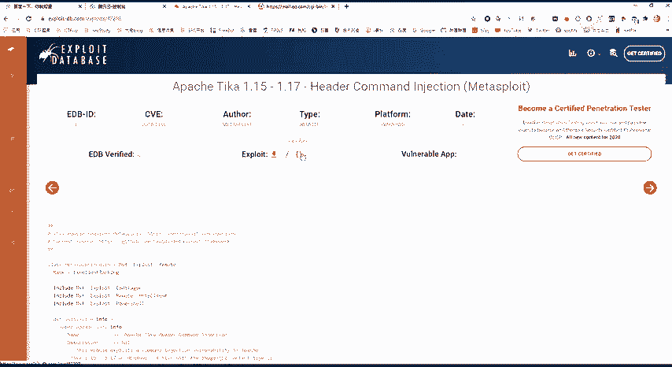

。还有Cbu也是非常好用的等等。还有其他的。

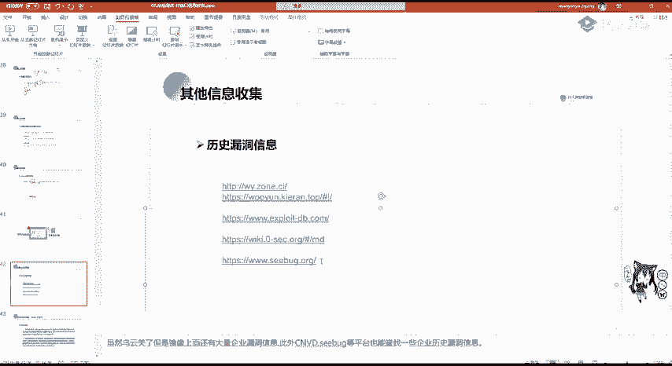

啊，这个是制造创业平台的，都差不多。

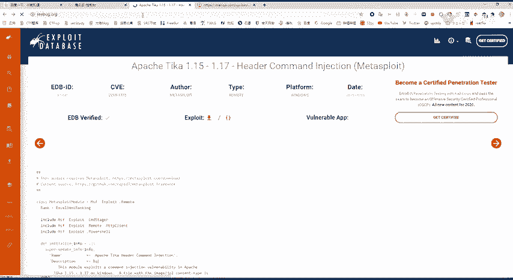

是。这里可以看啊，有些是有详情的这些呃word price或者是深信福的EDR宝塔的未授权访问这些漏洞可以去查看历史漏洞信息，并且搜索跟如何攻击进行攻击。

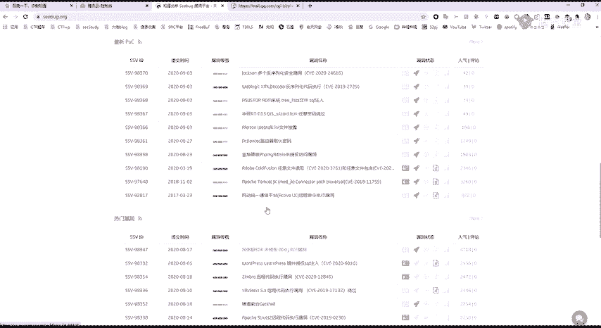

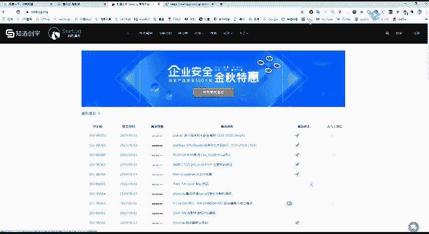

还有进行收集社会工程序。社会工程学一般啊用在我们这个，比如现在我需要对一个网站进行渗透。我需要登录到后台，发现这个后台登录页面，没有搜Q入入，也没有逻辑漏洞，也没有任意密码重置，啊，也没有弱密码。

那怎么办呢？我们发现这个。这个网站后台登录页面呢有一个管理员的邮箱，那我们就可以伪造相当于伪造一个公司的高管或是其他的客户。对这个网站管理员去发发一个邮件教育邮件进行一个密码攻击。

就像我现在在向QQ向你发一个请告诉我你的QQ密码啊，就像这样这个钓鱼那社会工程学大家觉得哎这个好像没什么，但是他的危害是特别大的。像电竞诈骗一般就是使用社工库进行查找。

就比如这个区域案就是呃山东省的这个高考信息招生平台，这个被窃取。然后通过呃状户等把这个库给拖了下来。这这些高考招生信息，就泄露到黑客这个手里这个黑灰产产业的这个受理。他通过个人信息进行骗取。

导致这个徐玉宇啊，这个最后死掉了啊，这是一个电信诈骗，在社会公程学的危害是非常大的。那在真正的互网过程中啊，也是有会遇到这个社工钓鱼邮件的这个攻击是经常的啊多钓鱼邮件就告诉你啊，企业邮箱现在要升级了。

你要告诉我你的姓名职位手机号码，还有密码，你看这个姓名职位其实都没有必要，主要是要这个密码啊，主要是要这个密码，同时也有这个钓鱼页面，钓鱼页面啊。

这个 split还有co strike都可以生成钓鱼页面，或者是卡利里面自带的，你可以去搜索生成钓钓鱼页面啊，是钓个人信息，是是用这种问卷系统。

或者是我们可以在啊之前啊前几年在QQ空间可以发现有什么啊同学录啊或者什么问卷系统啊，其实都是就是对你的个人信息进行一个钓鱼，或者是伪造一个抽奖啊，抽奖的时候。

你需要输入你这个游戏的账号和密码进行抽奖。那你输入他的后台，就抓到了你的这个登录的密码，那你的账号就泄露了。

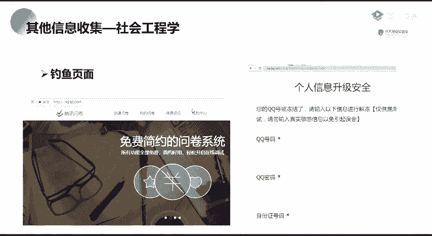

。那那这节课那就到这里。主要是讲了IP及端口的信息收集。那，社会工程学大家如果有感兴趣的话，可以自己搜索一下。当然，现在国内对社工库是肯定都没了啊，这个是不要轻易去搞这个东西啊，也没有什么用。

你在YSRC的时候，你是不能用社工的。作业的话呃，我想一下。大家呃对。用。啊，用。用n map或者是这今天讲的这C web看。对，我们还是公司的，其他的没有个授权。歌厅lab点com。啊。

进行一个C段扫描。并扫描。OK并扫描是吧并扫描和天 lab。并扫描我们公司这个网站的这个呃开放端口啊开放端口。这是第一个作业。第二个呢是你搭建一个啊搭建一个windows啊叉P之前的。的操作系统。

之前的操作系统或者是啊这个linux低版本的操作系统。比如啊这你可以装一个wins server。2003啊，这是尝试啊。如果你觉得啊不会，我们后面都会讲啊都会讲。然后使用啊N map部。包含包含叉P。

包含叉P。你可以自己去使用嘛，A map使用A map进行一个，就是你搭建这个虚拟机之后，对虚拟机啊，对你这个虚拟机，也就是你的把机。进行一个。端口扫描。并利用漏洞。过去吧击扇。Okay。Yeah。啊。

这是常试啊尝试啊，不是长线。嗯。那我也会把这个啊呃放在我们这个文档里面。大家不要去扫其他的站啊，扫其他站，你可以扫S2RC啊，但S2RC你也扫不到什么。这个在实际的你去挖S2RC，其实哎卖部。

你去扫也扫不出什么东西。因为这些38服务别人肯定第一时间修复，别人运维和嗯安全工程师也不是吃白饭的，这些主要是在工作中啊，这个护网啊你扫描，你会发现有很多，特别是在内网中。

你一扫那MS080671701011堆啊，一堆。直接co strike能带出来一堆机子。那我们把这个好我把这个复制到这个里面。这是IP和端口信息。第一个作业就是用N map扫描。第二个啊是尝试。

你要是做不好的话，没有没有关系。如果是零基础的话，做这个就是可能要去自己搜索一些知识。大家要常用搜索引擎啊，常用搜索引擎。Yeah。搭建windows XP或windsserv and03。虚拟机。

在使用Nm进行虚对虚拟机进行一个端构扫描，并利用漏洞。过去。啊继续。啊，这些window叉P和2003都是有很多漏洞的，你可以直接去利用框架，或者是已经写好的脚本去打，可以自己尝试一下。

OK那大家现在还有什么疑问吗？对这节课一个使用，包括就是。你如果对面试的时候有什么疑问，都可以问，或者问我们班主任，都会有一个指导的。那大家如果有什么问题的话，可以在群里或者是私聊我进行询问啊。

如果环境啊搭建不好啊，我会给自给大家详细讲解啊，或者是我远程连接手把手教。

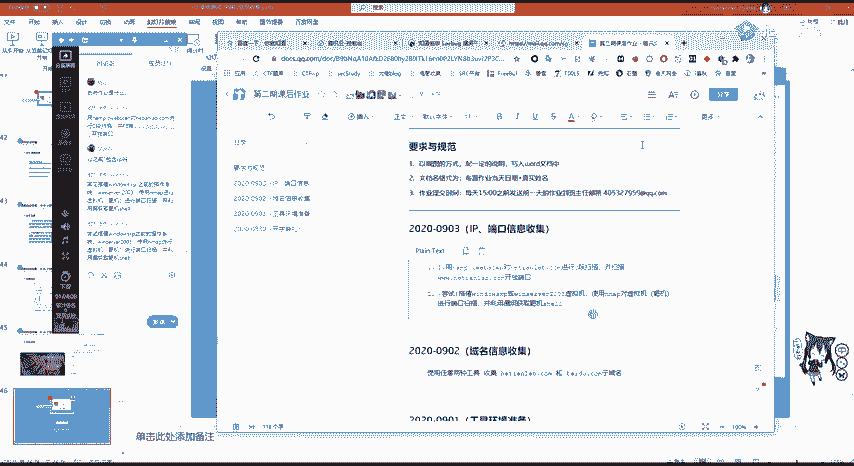

OK那我们这今天这节课就先到这里了啊，谢谢大家听讲。还，记得要交作业，要交作业，交到班主任的。啊，这个这后面交作业是有奖学金的啊，还有还有证书。

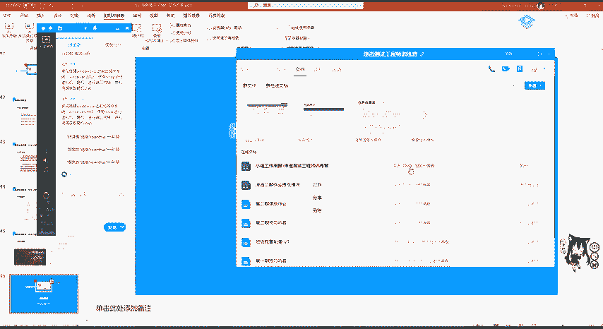

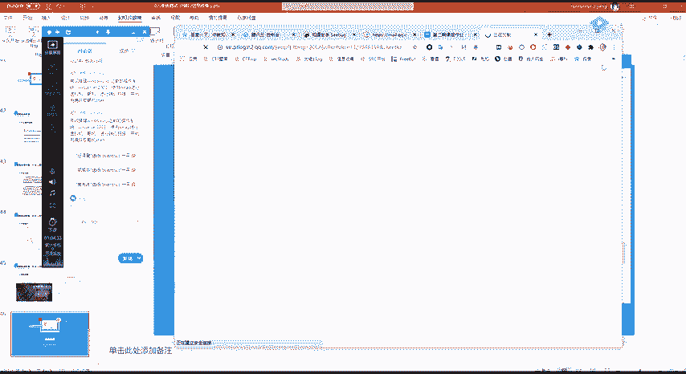

。嗯，我就先下课了。

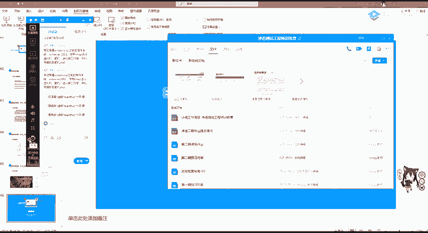