# 2024年最强Kali渗透教程／网络安全／kali破解／web安全／渗透测试／黑客教程 ／代码审计／DDoS攻击／漏洞挖掘／CTF - P29：6_敏感文件及目录探测 - 网络安全系统教学合集 - BV1Pe411C7Zb

第二，敏感文件及目录探测。在网站管理员进行搭建网站的时候，有可能会遗留部分敏感文件，比如数据库配置文件。备份文件。等等。我们可以去搜索敏感文件，去拿到服务器关键信息。

通常敏感文件和目录有以下gitth和get SVN。这三个分别是我们代码库代码仓库的一个备份文件。当网站管理员将代码上传到get up，并且克隆到本地时。

如果没有对get up点get进行一个隐藏或者删除的时候，就会泄露仓库信息，我们可以利用工具直接把网站源码给直接宕下来。DS draw这个是markOS，也就是苹果操作系统的一个呃网站。

一个文件系统备份系统。接下来的webINF和一些备份有文件，其实网站管理员进行一个遗留问题。那我们如何去发现和查找这些泄露文件呢？首先我们来看getth泄露。

get up是一个全球第一的一个代码管理仓库。我们国内有个比较相似的叫get e。开发人员将代码上传到网站。一般我们在写博客的时候，比如haxel进行写博客的时候，会将博客备份到。

也就是上传到我们的代码仓中。在上传的时候，没有删除一些重要的信息，比如邮箱信息SVN信息关键的账号和密码，数据库连接信息等。尤其是内部的账号和密码。那我们可以通过在get up上搜索公司的一些特定信息。

查看是否有程序员将信息上传到了get up上面。get up大家呃可以去啊，没有的同学可以去注册个这个账号。啊，这上面工具也都特别多，我们可以在这里搜索，比如我搜索和天lab。

搜索 a get help。OK这里我们并没有看到公司的一些泄露信息。啊，可以看到这个是我们和田晚安的一个月刊。get泄露get的泄露就是网站管理员将本地仓库与远程仓库进行互相备份克隆的时候所遗留的。

get文件泄露，我们可以使用get tank进行自动化。的泄露将直接把。这个远程仓库给克隆到本地本地，那他使用也非常简单，我们直接将它克隆下来。

然后使用网站的URL加点get即可就会将整个的网站源代码给当下来。他的成因是因为开发人员使用get进行版本控制，也就是对网站进行部署。本地仓库和远程仓库进行相互备份。如果配置不当。

那get文件就会被部署到我们的线上回环境，是以相对路径点get进行存储的。SVNSVN和get一样都是一个版本迭代的功能。那我们也可以使用SVNex这个工具进行一个泄露。

这些因为没有现成的一个网站进行搭建。大家如果在做CDF题目的时候，有可能会遇到SVN包括ge泄露等等。那我们核天实验室是有相应的这个实验的，一会会告诉大家，大家也可以去搜索一下。

下面webNFwebNF是javaGSP web应用的安全目录。如果在页面中直接访问其中文件，必须通过web点叉文件对访问的映射才能够访问。那这里还是有一个泄露信息的，比如阿帕奇的任意文件读取。

大家都可以进行一个简单的了解。那这些。网站信息的收集在我们渗透测试的一个过程中是非常重要的。我们拿到资产，首先要对这个资产进行批量的扫描和收集。第二就是我们要收集网站的备份文件。

那备份文件有可能是PHP货或者是1个ZIP现在一个管理员他比较懒，他把这个网站的源代码都打包成一个TR包，就放在了3W目录下。那我们可以通过外直接访问这个TR包直接下载下来。那他的源代码是给泄露出来了。

泄露出来之后，他源代码里面，我们需要去查看confi文件。进行呃查看网站配置、后台密码、数据库密码等等，进行一个数据库的渗透和登录。包括网站泄露源代码之后。

我们可以使用代码审计及一些自动化审计脚本进行一个代码审计，发现其中的漏洞，也就是进行白盒渗透测试。那我们通常搜索网站备份文件，备份目录，使用几个工具。

分别是7KB scan包括这个软件啊其实啊并不是太好用。这些软件在我们的可天小姐姐的工具包里面都有都有。他使用我就不多讲了，这些都是汉语，大家拿过来肯定就会用啊，拿过来肯定就会用。

这个并不像will shark帮那么复杂。Yeah。点geget是get的一个访问文件。当这管理员把这个get的这个备份文件上传到，就是上传到线上环境的话。

他比如说会在这个HTTP3WIISSS点com它下面就有一个这样的一个文件。就有个这样的文件。那我们就有这样一个网站，那我们直接用ge hack把它给。跑一下就会把整个网站的源代码给跑出来。

下面呢我们对敏感文件还有一个目录的探测，我们需要发现敏感文件目录或者是可以利用的后台目录。现在我们拿到一个网站发现它并没有后台页变。那我们如果如何如何去寻找后台呢有可能就是通过一个目录探测。

目录探测工具，一般这三种都挺好用的，一个遇见啊，预见是个老牌了啊，遇见老牌，它虽然很老，但是也挺好用的，挺好用的。这也是一个中文的啊，我们可以在这选择去报过DIR。

就是文件夹或者是SP网站SP到net网站PAP网站GSP网站还可以设置它的线程和探测200或300301等等。403等重定位等成定位状态吗。Yeah。

现在出的两个比较好用的就是DIR search和DIR map这两个工具，我们分别可以去get up上面把它克隆下来。这么打不开？Yeah。OK那我这里因为有同学比较疑惑如何克隆。

那我这里再给大家演示一遍，那我就来到我们的卡利里面。

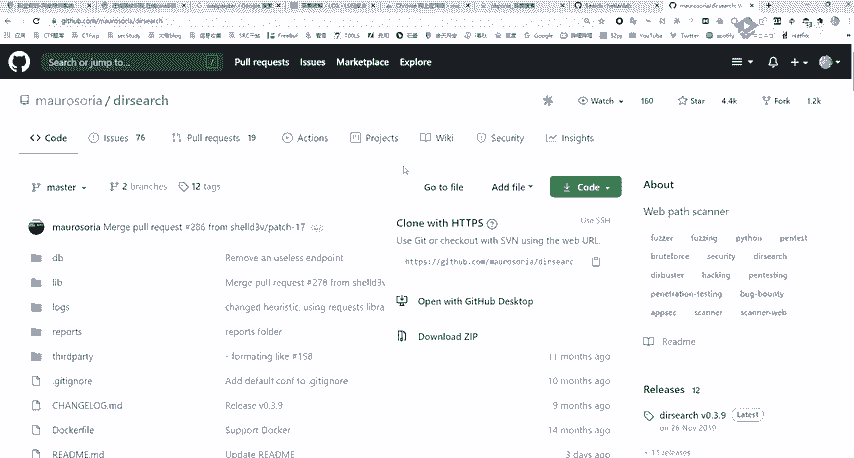

。克隆什么意思？就是下载。就下载把那个远程仓库给拿到本地，那克隆很简单，就使用get加克隆，然后加上我们这个点get的这种文件即可。如果大家就网络环境不是很好的话，它克隆呢有可能速度是比较慢的。

大家只需要耐心等待。我们克隆之后就会在本地生成一个跟我们远程仓库相同的文件名称DIR那么CD进去CDDIRD进去就会看到这些文件。

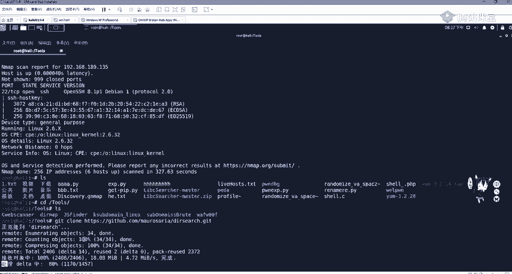

看到这些文件之后，我们需要去查看它如何使用，查看如何使用。一般在get up里面都有一个read me点markdown文件，告诉我们应该如何使用。那我们使用非常简单。

使用thonthon3杠U加上URL地址，再加E加上我们的额拓展额外就是后缀名是PHP还是等等？我们可以直接进行一个扫描。这里下面也对我们这个进行一个呃例子。

比如扫描HTPS targetge网站的PPTDZIP内容，即可使用这一句这个命令。啊，大家要常看这个read me这个read me。不是啊，我们在本地都可以的都可以的。只要你装了get就行了。

只要你装了ge就行了。在windows也是行的在windows也新的。

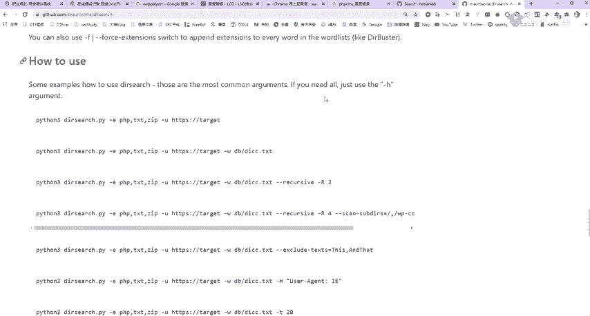

你看我给帮你看一下吧。这是windows，我们可以CD到我们的C盘啊，get都可以的。

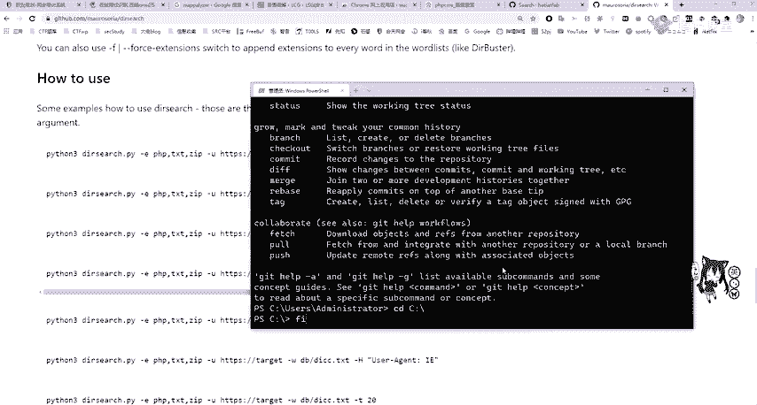

啊，这怎么我复制在这个地方呢？是是一样的。Yeah。系。那有复制。OK这你应该知道是。啊，这个啊，我挂了这个代理啊，这个代理人已经失效了，这个克隆不了。其实正常是可以的。我这是代理问题代理问题。

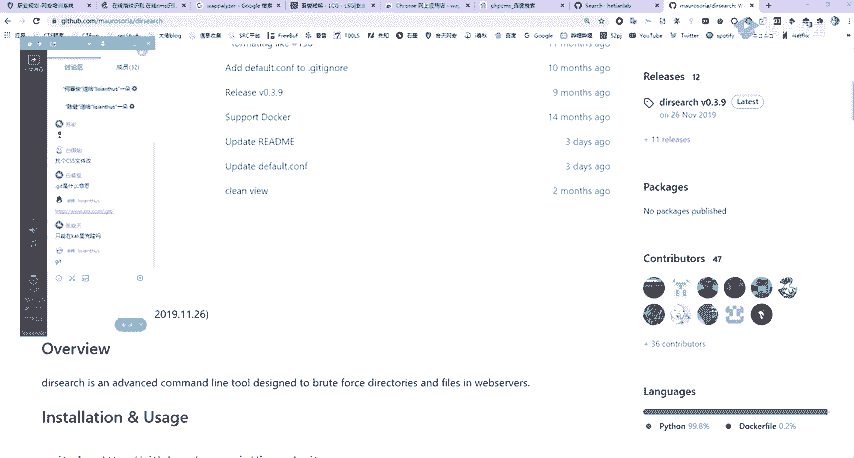

那我们拿到这个之后，我们现在已经知道如何使用了，那直接上啊DR点DR点PI杠U加上我们的，比如就拿我们一个本地的本地的来看了，本地的来看了。因为这个不好拿别的进行一个扫描，就扫描这个133了。

133OK。

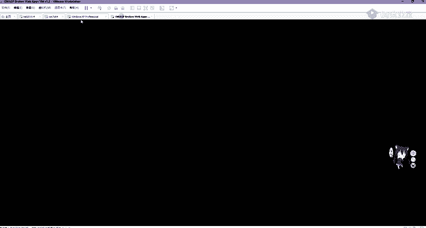

我来去访问一下。黄伟夏直接把它复制过来。进行一个粘贴，然后杠E加上什么，我们PHP。

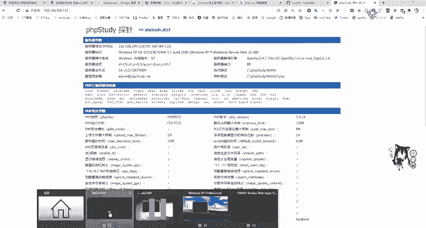

再加你想加什么加什么TST。然后有ZIPOK进行一个扫描。可看到发现了一点TSD我他扫描是很快的，发现了DVWM后面还有log点PVP发现PV mymin。哦PHBPHB大家应该都非常清楚了啊。

PH特别清楚了PH呃 my它是有一个呃任意文件文件包含漏洞等等。对我们可以利用它进行一个提全等等，它是有漏洞的。还有我自己写的smarty。一些数据都会给我们报出来。那我们也可以报它的一个下季目录。

比如说我们现在已经报出来DVWI了，那我继续加个DVWI进行一个报破。他速度还是非常快的。그。啊，这里可以看到read me啊ros setet up这些关键的一个代码。Yeah。

下面呢还有一个工具是DIR map，它和DRR search置比较相似。那我们来打开看一下它的reme。

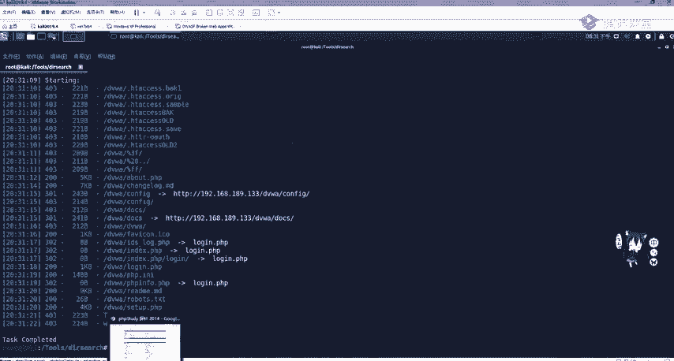

。对。

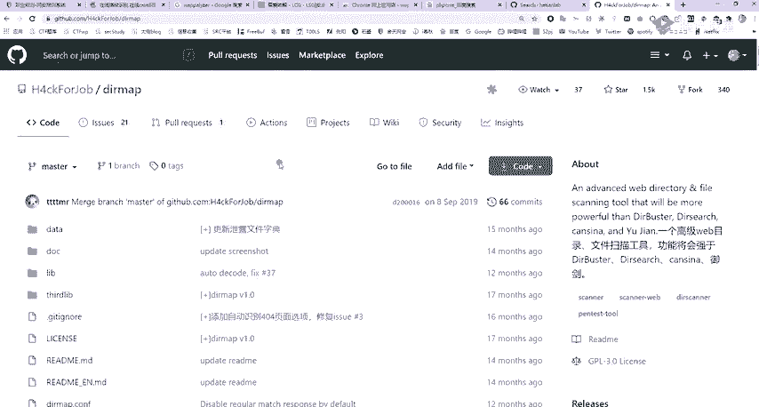

他说这个功能会强于啊这个DI爆破DR search还有预见。那我们来看一下它怎么样，它是具有一个并发字典爆括复取等等。那他的使用方法啊很简单，就是python杠DR map将杠I也就是啊input导入。

然后使用HTPUIFURL杠LFLF。

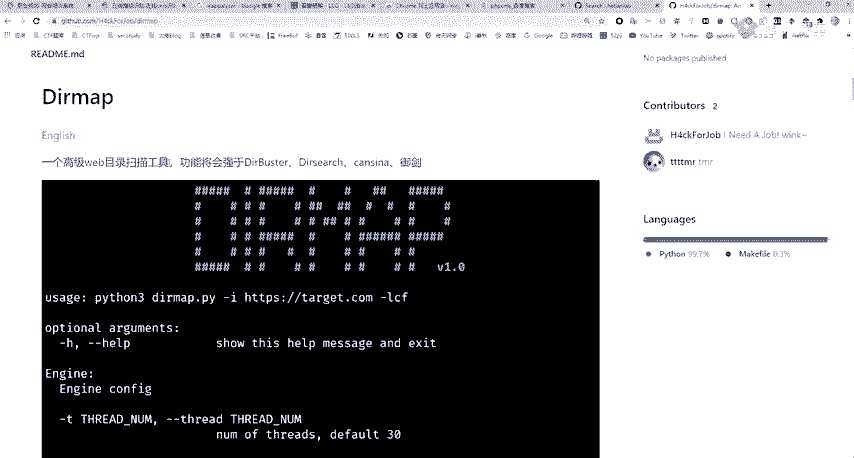

那这里我们来呃简单来看一下。就是跑我们刚刚的那一个。IP。

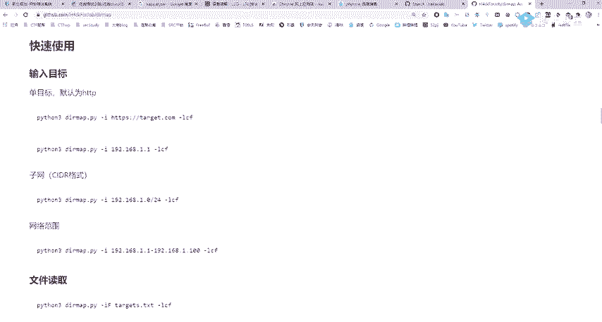

这里我跑的是我自己搭建的这个网站，大家可以去跑SRCSRC你也跑不出什么。但是在真正渗透测试的时候，我们会对这个目标进行跑一遍的。而对目标进行跑一遍的。那它安装我就不再讲了，因为就直接克隆过来就行。

克隆过来的DRR mapap我们CD道里面可以发现，大家如果在运行的时候会出错。是因为没有模块thon是一个模块化的语言。这个模块在哪呢？在我们的这个repriment这个。

文件里面可以看到这个需要givenrequestL叉ML这些模块。那我们可以使用PIP加上inst。啊，这是Iin3，可以加PRB3instore杠2。requestrements把这些给一次安装完。

因为这里我都是已经already已经安装好了，大家安装好之后就可以直接进行一个运行了。那如何运行，那我们就看这个get upread me大家不需要进行记忆，不需要进行记忆。

那直接把它copy过来就行了。

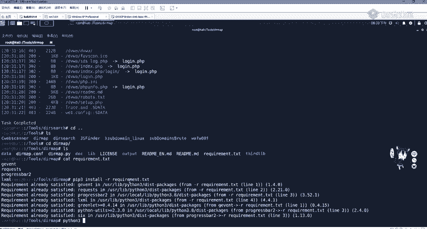

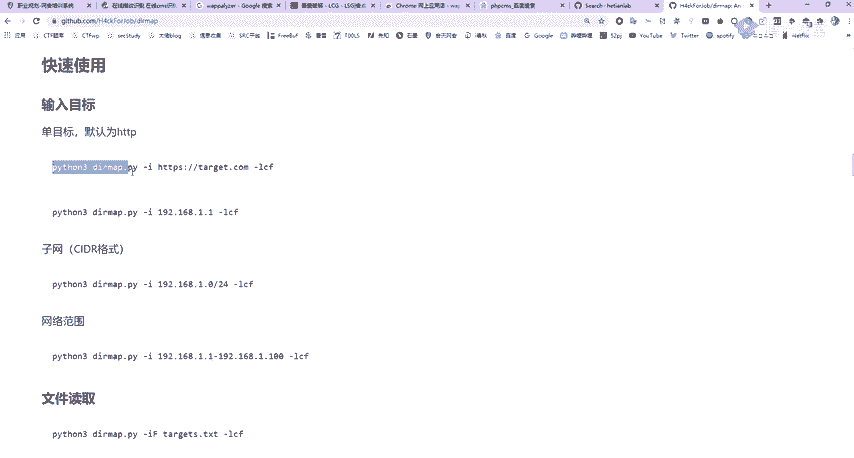

他直接copy过来，然后将这个UIL改成我们自己的之前的一个。之前的那一个。URL地址，那我们把它。对， copypy过来。我们来看他的效果如何。当然这些都是非常快的就是非常快的。他不像预见啊。

预见还是比较慢。因大家要知道，pathon3的效率还是呃要比GUR要高一点。OK他他也找到了不少，他也找到了不少。也绍达不少，那我们也可以试他的DVWI。那具体的使用方法啊，大家就是。嗯。

可以自己去试一下。那有同学啊就有疑问，我们去爆破这些。这些文件，那我们为什么不直接去看一下呢？就不接到不直接到我们三大目录下去看一下呢。是因为我们这里我扫描的是一个。我自己搭建的，比我们能看到源代码。

能看到源代码叫做白盒。而我们真正做渗透的时候，你是看不到源代码的。除非你是利用我刚刚说的get泄露，或是其他备份文件泄露进行一个源代码泄露。否则你进行的是黑盒测试，也就是进行一个探测。

包括进行一个渗透啊，他也找到了不少这些关键的东西他都都能够找到，都是差不多的。

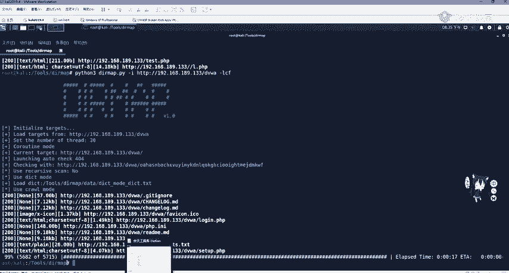

就是速度要快一些。对。还有一个叫针对漏洞的信息泄露。啊，漏洞的信息泄露。这里我们用的是spring框架的一个信息漏洞信息泄露。大家可以关注一些论坛，比如先知社区freeuff或者一些微信公众号。

这些或是关注我们和天智慧的一个微信公众号，这些都会有这个漏洞的一个讲解。那spring boot这个框架漏洞呢，它是有信息泄露漏洞的SVN信息泄露。那我们可以利用它去泄露网站的一些敏感信息。啊。

这个EVN信息泄露。比如说这里就会泄露这个在挖SRRC的时候，这个还是有的是有的。这个现在还是有的，你可以去找一找看这会泄露我们这个oracle的一个信息，包括上面一些包的信息。

有的里面还会有这个啊user name root啊username root。包括密码信息、邮箱信息都会泄露在这个EVN里面。这个是未授权访问，我们直接拿UIL加ENV机行即可。那这里我们怎么发现它？

那很简单，就是要用目录探测，不然的话你怎么知道他是有ENV这个目录的呢？那下面最后一个也就是啊wa的一个识别。

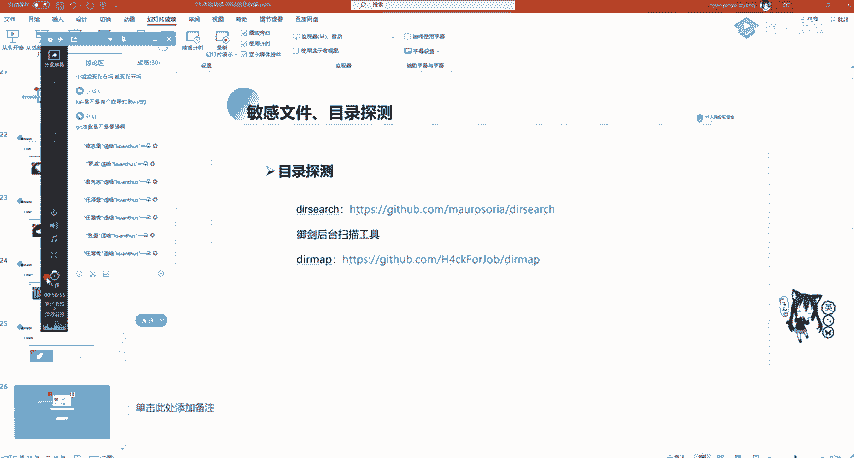