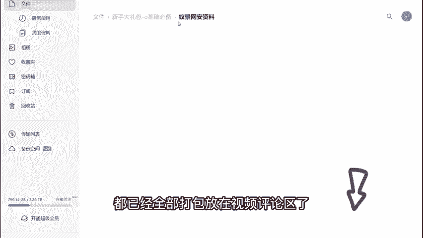
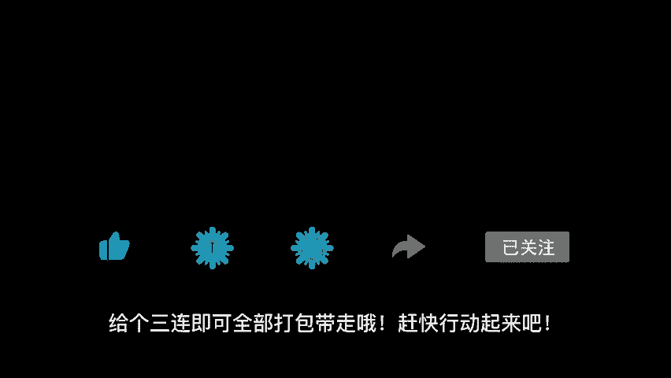
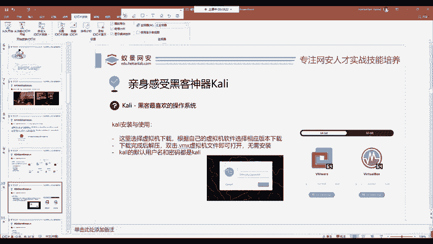
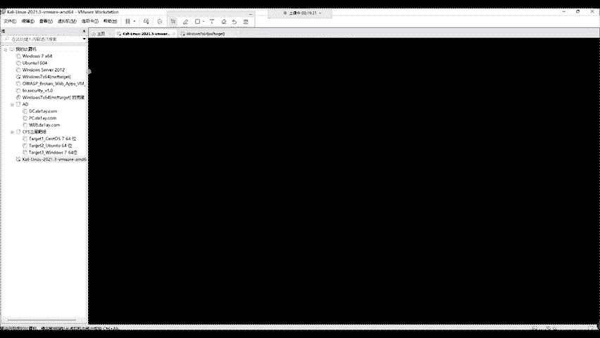
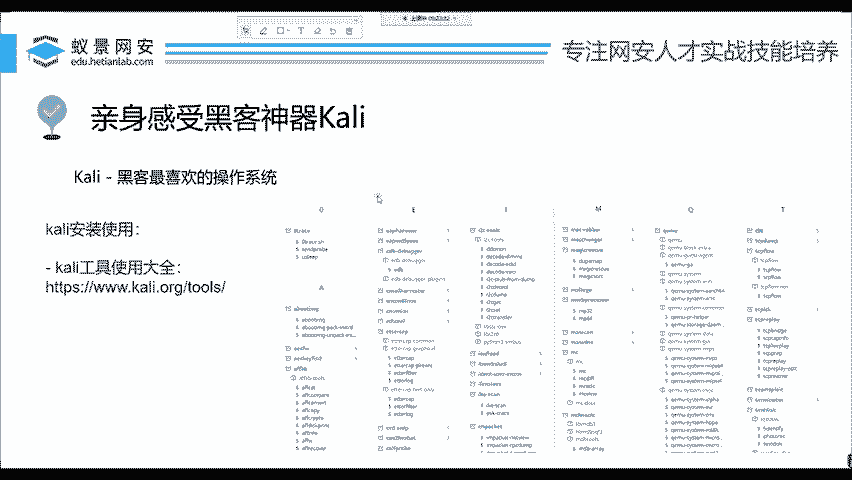

# 2024年最强Kali渗透教程／网络安全／kali破解／web安全／渗透测试／黑客教程 ／代码审计／DDoS攻击／漏洞挖掘／CTF - P2：1_揭秘黑客攻击机-kali的介绍和安装 - 网络安全系统教学合集 - BV1Pe411C7Zb

教程开始之前，up已经把相关的网络安全入门学习路线图，高清教学视频、网安学习必备工具包、网安精选面试题、电子学习书籍、网络安全靶场合集CTF赛前文档都已经全部打包，放在视频评论区了。

给个三连即可全部打包带走哦。赶快行动起来吧。我们今天来正式讲课。首先呢就是找到合适的公积机。其实这一点对于我们新手来说，不论你学习任何的东西，就我学习开发也好，学习前端也好。

你遇到的最大的困难就是搭建环境，而，可以明确的告诉大家，所以说我们要找到这样一个合适的公积机。😊。

啊，大家如果有任何问题，也可以随时在讨论区提问啊。那我们在各种电影或者是新闻里面，尤其是现在啊在搞这个网络安全宣传周啊，大家的每一个学校都会有相应的社团或者是学生会去搞那种防止电信诈骗。

那这些海报中经常会出现这些黑客攻击的场景。你会发现啊这些黑客大佬，他的屏幕上面花里胡哨的各种东西。那这些操作系统很明显区别于我们通常使用的像windows麦克OS这些操作系统。那它是什么呢？啊。

这里就带领大家认识一个系统叫做卡利。那这个咖利呢大家入门安全的同学可能会觉得哎这个咖利可能比较没有用，其实并不是这样的。大家如果你觉得没有用的同学，请你去查看世界顶级的峰会以及在youtube上面。

很多网安顶尖人才去发布的这些视频以及演讲，他们依然在使用卡利这款操作系统，如果他没有用，那卡利也不会更新到现在，而是直接演磨于历史的场河中了，是吧？那这个卡利呢它是一款linux操作系统。

是基于低半的那这个操作系统呢，它的好处就是已经为我们安装好了300多个渗透测试工具，并且日常所用到的开发环境以及运行环境，在上面都已经完全配置好。我们几乎不需要做其他的操作就能够直接的渗透。

并且这款操作系统是。永久免费的，大家一定要清楚，并不像windows，它是一款收费的操作系统，并且micel S这种它更是开源，而且你必须要购买苹果电脑才能够使用。那卡利呢它基于linux的开源性。

它是完全免费的。那这里还是提醒大家，都有一句名言叫做呃卡里学的好这个吃饭吃到饱。所以说呢我们在学习咖里里面有很多的工具，可能会对操作系统造成一些危害性的操作。我们在学习的时候，请务必遵守相关的法律法规。

现在的中华人民共和国网络安全法。OK那我们下面呢就来看一下在世界上被誉为黑客最喜欢的操作系统。卡里那这个卡利呢它是有自己的官网的我们可以在百度或者是谷歌中打开呃这样一个卡里的官网给大家简单看一下。

那在卡利官网中，我们就不能够直接的去下载它，点击get卡利就是获取卡利。我们会发现啊这个卡利操作系统它提供了针对各种主流平台的下载。比如说IRM架构IM架构是什么？你的M一芯片的macbook。

包括平常所使用的手机，或者是你自己搭建的数本派等等。这些很多都是ar架构的。然后就是我们正常使用的虚拟版本。docker容器手机的移动端，甚至是微软，它的WSLlinux子系统也有相关的版本。

就如果你觉得你懒，我不想去用虚拟机，完全可以用WSL就WSL版本啊。在微软的这个官方商店里面你就能下到。就是在这样一个microsoft的 store里面就能下到它。

OK我们现在简单来看一下它的功能有多强大，就是它针对所有的平台可以说都有。就比如说这个手机这个手机呢，因为国内的手机一些限制，就导致了它可能是没有正常使用的。比如说一些。这个开放性比较好的手机。

像一加手机，像小米的部分型号，以及国外的一些像三星啊，以及pixel这些谷歌的手机，它都能够去直接通过刷机的方式去安装我们这样一个卡操作系统，再进行一个移动的渗透，或者是啊这样一个无线渗透啊。

就是说你装到这个手机里面潜入别人的公司，就可以用这个手机连接到别人的互联网去攻击这个公司里面所处的内网环境啊，这是完全可行的。那我们这里呢为了方便教学以及方便演示，我们通常是采用虚拟机的一个形式啊。

这个虚拟机是非常方便的。第一，它不会有太多的性能损耗，并且我们能够实现一个双系统类似的功能，所以说非常方便。啊，这个虚拟机呢。

我们可以在get他卡利这个地方选择VMSVMS呢叫做vi啊vi machine就是虚拟机的意思啊。在这个地方我们选择之后，那下面呢就有相应的版本，我们可以根据自己的虚拟机软件。

比如说有同学啊在使用VMor，或者是呢有的在用mike的同学使用是vi box，那这都没有关系，直接去下载它就行。下载完成之后，记住这个虚拟机版本呢是不需要任何的安装操作的，不是说像win10一样。

你一步一步一步的安装，你下载完成之后，它就是个压缩包，你现在要做的，非常简单。第一步解压第二步里面有一个点VMX后缀的虚拟机文件，你只要双击之后就能直接打开卡利，不需要任何的安装操作。那你打开卡利之后。

肯定就是输入用户名和密码呀。在现代的最新版的卡里操作系统，这里最新版的是指2021年第三季度就是2021。3这个版本的卡里它的默认用户名和密码都是KILI这四个字母，也就是卡里啊，大家知道这一点就行。

那我们的这个虚拟机啊，它也有告诉你。

啊，我们在打开虚拟机之后啊，双击那个VMX打开之后啊，就是这样一个界面。

那，稍等一下好，我们输入相应的用户名，卡利以及相应的密码，然后点击log in或者是回车，都可以去进入到卡利这台操作系统中。我们在进入之后，哎，这里面啊大家首先给大家讲一个学习方法。就是这是虚拟机。

你千万不要去害怕，那这个地方有非常多的一个工具。我们可以随意的去点并且发现它有什么功能啊，有有些工具啊，它特别的高级特别的好玩。

我们可以发现啊它这里是从这些信息的获取到漏洞的扫描到漏洞的攻击以及密码攻击无线攻击逆向工程等等一些嗅探钓鱼的工具在上面都应有尽有。可能它的有的工具对于国内来说用不上。但是很多工具也是非常实用。

非常方便的啊，也请大。家呢认真的学习卡利，而不是说我遇到哪个东西没办法解决。很多的帖子啊，他就会让你去写脚本，我就不能理解。咖里上面有很多的工具，就能实现相似的功能。为什么还要自己去写脚本啊？

并且你写的也不一定有别人好，是吧？不然的话，怎么不登录你的这个软件呢？是吧？这个卡里里面大家一定要清楚，就是避免重复的去造轮子。OK我们下面呢来看一下这个卡利的使用大全。在卡利的官网中。

我们只需要在他的官网后面跟上一个tth，就是工具集的意思啊，就可以打开这个卡利的所有工具使用大全。我给大家简单看一下。啊，在这地方。哎，我们可以清楚的看到，这里是包含的卡里中所有的渗透测试工具。

你想使用哪一个就去点哪一个就行。可以看到这么多还能不够你用吗？啊，肯定是完全足够的这就是卡ytth的官方文档。那这个文档呢很抱歉，它就是英文的，因为这些的啊它本身就是一个公益性的项目。

没有人必要非要必要为它去翻译成中文啊，大家呢可以利用浏览器的翻译插件啊，自己的去查看这些到底有什么用啊，我就不做过多的解释了。因为我们一节课的时间，你响啊把它全部学完，嗯。

根本不可能你能掌握一个工具就非常优秀了。那我们接下来继续来看，这是卡里的一个工具使用大全。

