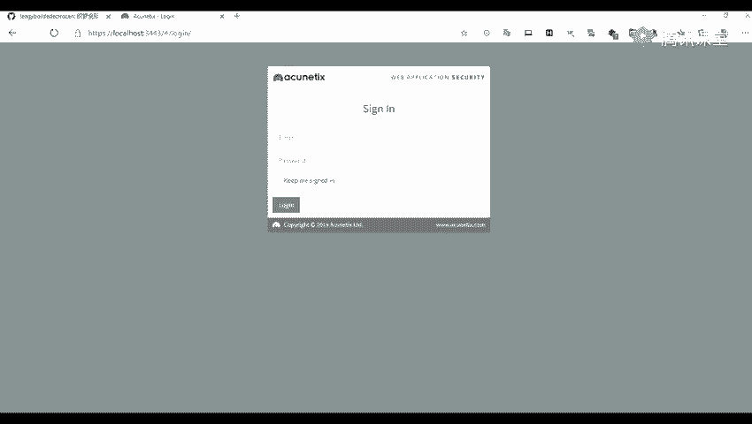
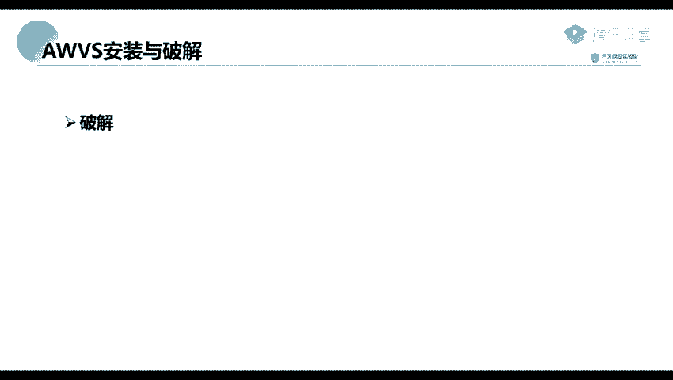

# 2024年最强Kali渗透教程／网络安全／kali破解／web安全／渗透测试／黑客教程 ／代码审计／DDoS攻击／漏洞挖掘／CTF - P32：2_AWVS的安装和破解 - 网络安全系统教学合集 - BV1Pe411C7Zb

下面呢我们来看一下第二个部分AWBS的一个安装与破解。首先呢我们下载将我们的一个工具进行下载下来。这工具呢我已经在你们的一个预习内容里面已经写在上面了。

并且把我们的一个破解的一个哦那个破解好像是没有讲的。但是呢我们这节课呢那里是写的比较简单一点。这节课呢我们来给给大家讲一下如何去破解。另到这个是我们的一个下载链接。你们可以去访问进行一个下载。

Yeah。然我们的一个D区码哈。一起码是我们的一个和。lab就是我们这个HETIAMAANLADle。那呢这个呢是我们的1个AWBS主要的一个安装包，以及它里面还有一个破解破解包。哦。

这就是我们所做的一个模糊测试。你这个呢你可以去就是就是模糊测试。我们先来看一下这个。然后安装安装的话呢，是跟我们正常安装一些QQ啊或者微信啊是一样的。

不过呢到这一步就是我们有一步是需要去对我们的一个账户去进行一个设置的，就是设置我们的一个邮箱登录的邮箱，以及我们的一个登录的密码。这里呢都是一些一些比较简单的一些设置。然后呢。

我们还有一步就是去设置我们的一个端口，就是我们web访问的一个端口，就是浏览器访问的一个端口。这个端口呢，你可以随意设置就是设置完了了之后，我们访问的端口，就是你所设置的一个端口。

然后下面这个呢就是我们就是询问我们是否允许远程进行一个访问。就是说是否只只允许你这个本机进行访问，还是可以允许其他的机器进行访问这个AWVS。我们我这里呢是没有选择进行，就是允许的。

我所以呢我这里呢是只只能在我们的一个本地进行访问。下面呢就是一个破解。破解呢我们有。哎里面呢就是有两个工具。就是我们的下载的一个下载包里面，解压了之后，里面有三个工具，一个有三个安装包。

一个呢是我们的1个AWVS12的一个安装包。另外两个呢就是我们的一个破解的一个破解包。Yeah。首先呢将我们的一个破解破解包点EEX，还有一个d这两个包去复制到我们的1个AWBS的一个安装目录。

那这个安装目录呢是我们默认的，它安装呢是不能我们不能去选择它的一个安装路径的。所以呢这里我们可以来找一下它的一个路径。我找我先找一下。在在这个C盘上面。然后看一下是不是这一个啊。

在这个proclaimproclaim。这个fi这个文件夹上面就是在这个从86这个文件夹上面。那到我们我们这里呢有一个这个第一个工具就是第一个呃这个ACN。这个文件夹。文件夹上面。

然后那我们可以看到我们是不是将我们的这两个一个两个破解包去录制到我们的这个目录下面。Okay。破解了了下面之后，我们。另行即可。就是以我们以一个身就是这个管理员的一个身份去进行运行。运行了之后呢。

他会提示我们去填写一些信息，比如说这个名姓名啊，公司名称啊，还有一些就是我们的一个电话号码等等。那那那里呢我们可以随意填写。因为这里呢。我们有截图，但是这个呢都是我们看看都能看懂的。

所以呢我这里就不进行演示了。下面呢我们来看一下我们的一个。

嗯。