# 2024年最强Kali渗透教程／网络安全／kali破解／web安全／渗透测试／黑客教程 ／代码审计／DDoS攻击／漏洞挖掘／CTF - P35：5_Burp破解及代理抓包 - 网络安全系统教学合集 - BV1Pe411C7Zb

因为这。那我们讲一下我们的的一个po的一个破解，以及我们的一个代理抓包。首先呢破解我们。下载的那个的话，应该会有。看一下。因。下走的之后，我们应该会有里面有。有两个文件。

一个是bo load这黑这个文件，还有一个是bo switch your。就是里面呢应该是有两两个文件的。现在我们点击这个bo load推转这个文件，点击了之后。我，今天我在。即我得嚟总经你话。

其实这个文件呢就是我我的一个文件要我我双双击。这点击双击哈。登记之后，我们他会出现这样子的一个窗口。另这一个窗口呢，我们点击乱。点击乱之后。就可以。到这里。就是。点击乱之后，我们就就会出现这一个。

这个这个页面boxproession这个页面这里现在就将我们这个这个。这个激活程序里面的那个recent这个序列号让我们的一个序列号进行一个复制。复制到我们这个enter pay。这个窗口上面。

然后复制到这个参口上面呢，我们去点去点击下以后有一个。就是应该是右右边。第三个就是从左边读起第三个一个按钮去点击这第三个按钮。然后呢，我们就是到我们的这一个不就是破解。到了这一步之后，就就是这个。

MA这个SV转这个步骤这里就是点击我们那一个SV转之后就是到了这里，到了这里，我们将我们的一个这个第二步，我们前面是将我们的这个listcent复制到我们这个第二部这里了。

现在就将我们这个第二部这个内容。毕竟我们这第二部的一一个内容，就这个popy request。去复制它复制它复制到我们这个Iationdequest这个框框这里。我这里呢我因为已经破解过了。

我这里就不再进行一个演示。他复制到我们这个ed request这框框这里之后，得到了我们这第三步他复制了到我们这个ed request之后，它会自动生成一个嗯。I且微3的po这个里面的一些字符串。

要将里面的一个所有的一个字符串，就将里面的所有的一个内容去复制到我们这个第三步这里。第三步这里这里呢然后我们点击n。就可以进行一个激活成功了。这样呢我们点一下代理招包，因为我们嗯。

这个box switch这以以一个拦截代理的方式去拦截所有通过代理的一个网络流量。比如说我们客户端的一个请求数据以及服务端服务器端返回的一个信息等等。

那这个报设备它它主要是拦截我们的1个HTPP以以及1个HTPPS1个协议的流量。要通过这个拦截我们这个工具box这个工具，再以一个中间人的方式。

可以对客户端请求的数据以及服务器端返回的一个一些信息做各种处理。来达到我们这个安全评估测试的目的。但是在我们的一个日常的工作中啊，我们最常用的一个外博客户端呢，就是我们的一些浏览器。

比如说一些火狐啊、谷歌啊、360啊等等一些浏览器。我们呢就可以通过代理的设置。做到对这个web浏览器的一个流量进行拦截。并且我们可以经过我们这个工具代理的流量数据进行一个处理。嗯。

首先呢嗯我们来看一下代理代理包包。HTTP代理，那呢是一个。他作为一个web代理服务器进行运行的，并且他作为我们的一个浏览器和目标web服务器之间的一个中间人。他允许检查。

并且修改和修改这两个方向上传递的一个原始的业务。

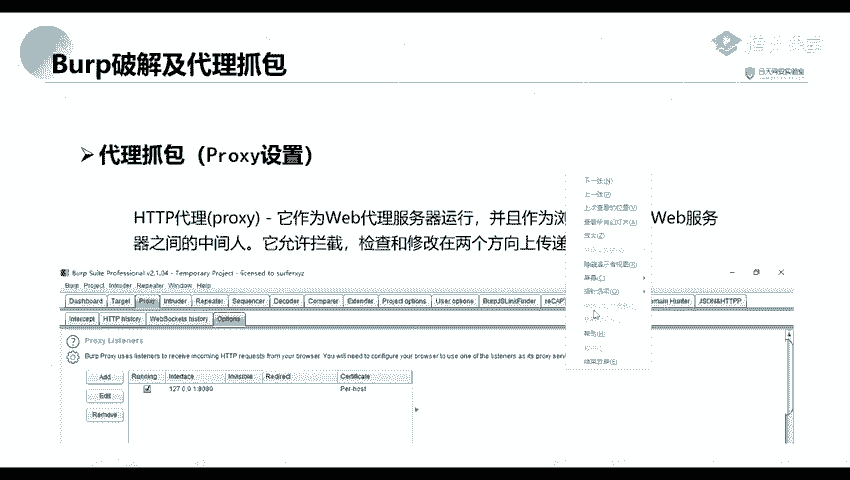

首先呢他是在他默认默认的话。你看一下。那默认的话呢是他默认拦截就在这个。hellolo这个点下这里，它默认呢是拦截我们的1个127。0。0。1，要还有一个是8080端口。

他就是它是拦截这个地址上面的8080端口的一个数据。所以呢我们就就需要进行对我们的一个浏览器进行一个设置。比如说我这里呢。就是我这里呢是一个。

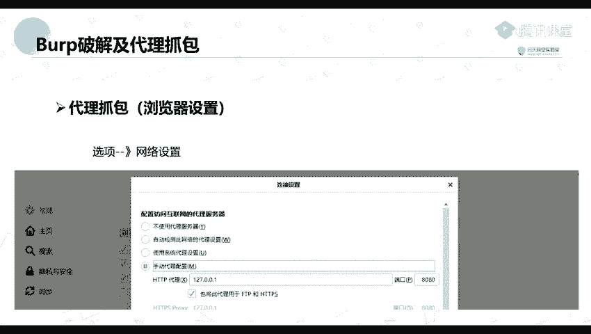

一个微软的1个EBG这个浏览器。能一。

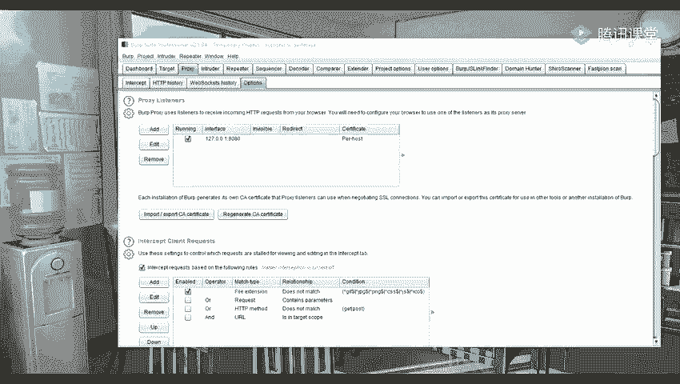

看你们的一个浏览器的不同来进行一个修改。比如说我这里呢是一个。这个浏览器，然后呢，我们点击这个这个设置。设置这里你要找到我们的一个。系统设置系统设置。

因为我这里呢是使用了这个这一个一个工具进行一个管理的。所以我们是打开之后就是进行进行一个设置。如果说是我们的一个火狐火狐的浏览器。

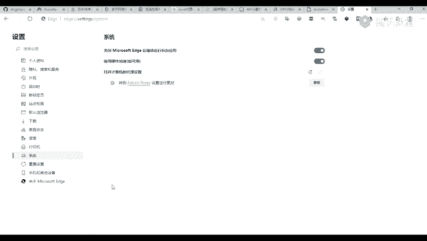

服务的浏览器呢就是点击我们的一个选项，然要找到我们的一个网络设置，就是拉到最下面找到这个网络设置。要修要将里面的一个配置访问互联网的一个代理服务器。他默认的话，他默认的话。

他可能是这个不不使用代理服务器，我们就我们正常就选择我们的一个手动代理配置。而配置的这个IP呢就是我们前面的1个127。0。0。1。我们配置可能跟这一个一致的，就是这个top。

它拦截的这个IP地址是配置成相同的。

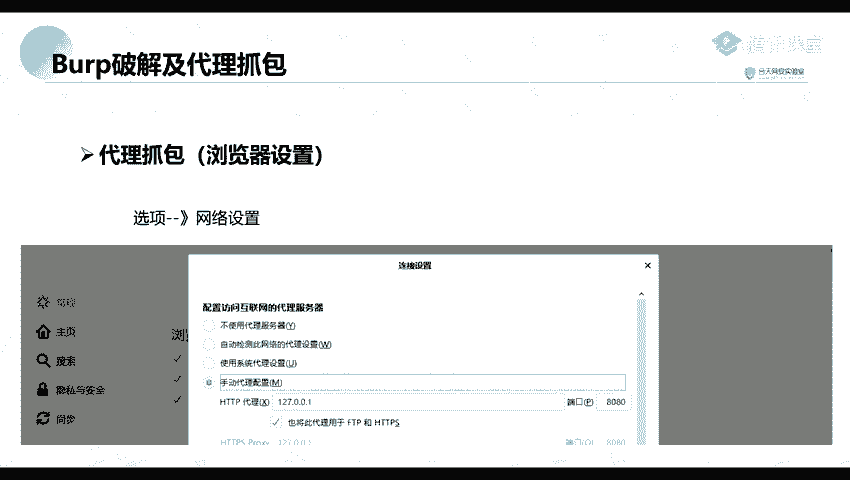

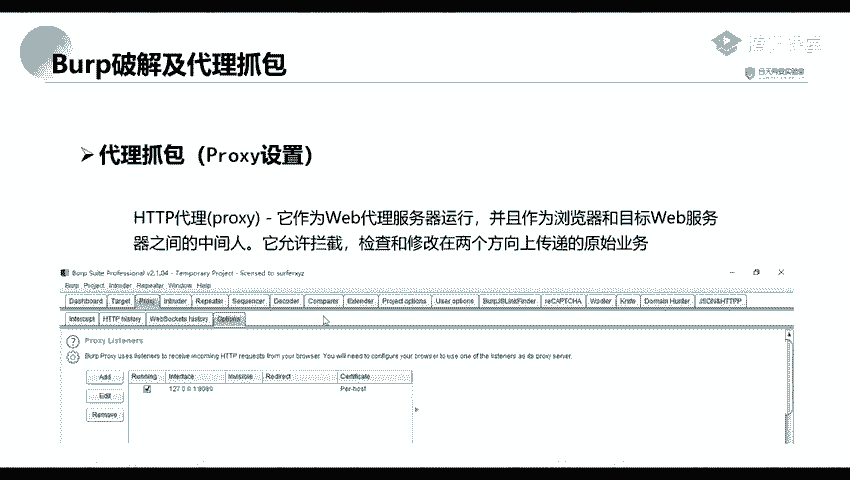

这端口呢也是配置成相同的。然后我们将我们下面这个高高给高尚。播上了之后，我们就进可以进行一个抓包抓包。就比如说我们访问嗯。

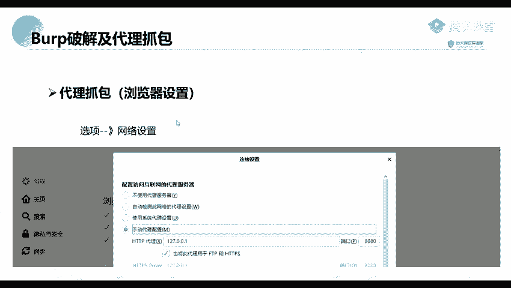

访问之后，我们就访问我们的，我们设置了代理之后，我们去访问。我们并且我们的这个bo也打开了一个拦截，那么我们就可以进行一个抓报了，访问我我们的一个浏览器。

比如说我这里我这里呢我这里呢是待会会会给大家讲一个工具。就说我这里。

你家。对。我我这里呢开了一个代理人，然后呢，并且我们我打打开这个inter set，这就是我们将它改为onon。然呢我们进行一个访问。有啊。访完之后，在这里呢。他就会将我们的的这个包进行抓取。

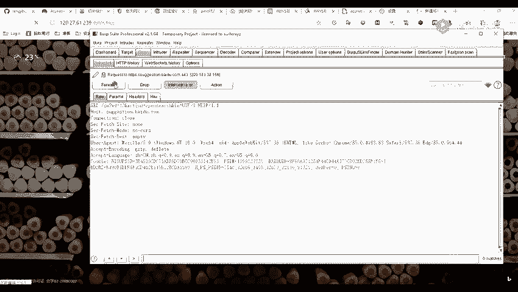

这个这个呢就是我们的一个包，就跟我们这个访问的这一个包是一致的。嗯。哦，这个工这个插件反像其实都差不多的。你们可以就是搜索。我待会呢会给你们讲，我这里呢就先不讲。

那我们这里呢可以看到我们是已经抓到了这个包了，所以我们就可以对这个包进行一个修改。比如说我们这可以这里呢也可以去修改返完成。访问是其他的一些一些地址或者是端口，或者是如果是他里后上面还有一些数据的话。

我们也可以进行一个修改。

你个 body。啊，我这里添加他发了。我们先点这个PPT。Okay。然呢。因为我们的这个bo sweet，但是他他通常情况下，他只抓取我们的。呃，我们的1个HTTP的一个包。

但不能说对我们的1个HTTPS的一个包进行抓取。所以呢我们这里呢就需要去安装一个证书。首先呢我们设置好代理之后，我们访问这个提DDP yourour这个地址。比说我这里设置。带你有几条啲。嗯。Oh。

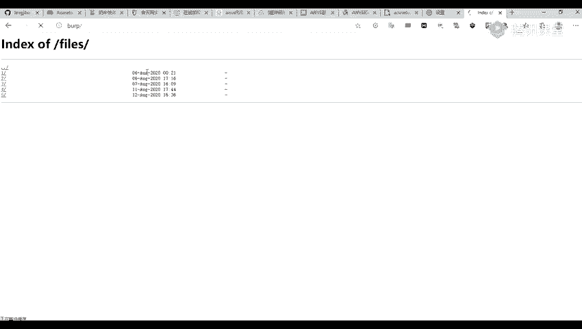

访问访完之后呢，我们这里呢点击右上右右上角这个CA。惊佢哋激器。诶嗰啲极题。对。这个呢我们将它进行下载下来。再展下来呢，它是一个点点低压的一个后缀的一个格式的一个文件。我这里将它进行一个保存。

我装了之后，他是这样子的。

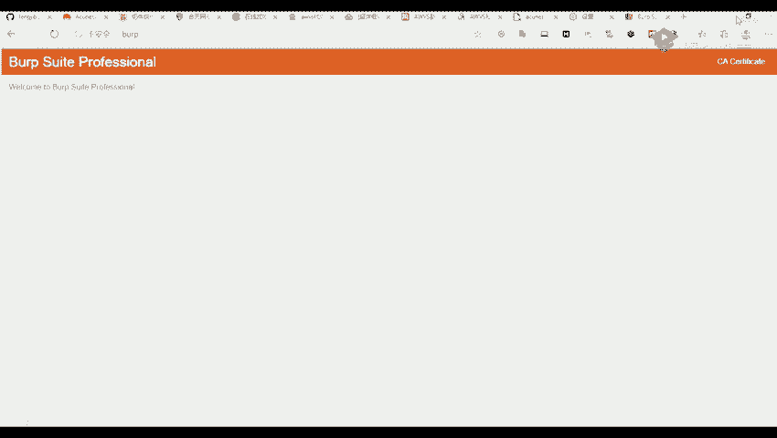

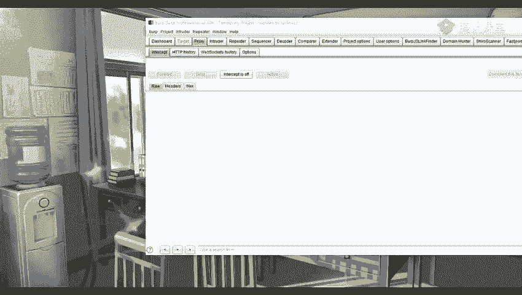

啊啊你找不到了。这我刚下载到哪里来？哦，在在这里。我这里呢已经。

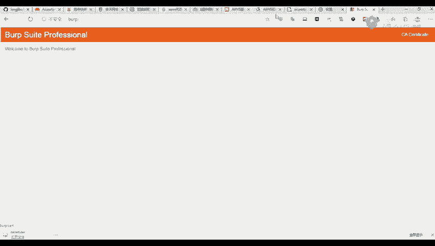

下载下来了，这个呢就是下载了之后，我们可以看到那是这样子的一个证书。然后证书下载了证书之后，我们需要将它进行一个导入。我们这里呢以我们的一个这这一个火这个火狐浏览器为例。现在我们打开这那个证书设置那里。

就找到我们那个证书给管理器那里。我们在这个证书颁发机构去导入这一个证书，比如说或者是我们这个浏览器。看一下这里。测试。那我找到这个隐私搜索，再有一个。那那我们这里呢也可以看到有一个管理证书。

就是我们找到这个管理证书。这里，你们在其他浏览器呢可能是有点不同啊，其实也都差不多的。你找到这个管理证书这里，你找到这个。我看一下是哪一个。翻花嗯。哦，什么意思啊？哦，的。

我们这里呢就是一个中间政书的一个颁发机构。我们这里。他就导入我我们的一个证书。嗯。对所有文件去进行一个导入。打开以后下一步我们就去进行一个下一步，下一步就好。投入了之后呢，他这里。

我们可以看到成功了导入之后，我们在可以在这个颁发者这里，或者是这个颁发给这里可以找到我们的那个证书的一个地方。比如说这个呢就是一个po。嗯。我们可以看到他这个证书的一个颁发者是这个po。

就说明我们可以看看到这个之后，就说明我们已经导入成功了。因为我们这个工具，这个这个bo three。op switch这个工具呢就是我们这个ho week这个公司进行一个开发的。嗯。导入了之后。

我们需要对我们的一个浏览器重启一下，就是关闭我们的浏览器，再重新进行打开。就可以了。嗯。要设设置了之后，我们就可以去对我们的1个HTDPSS的一些站点进行抓取了。Okay。

但是呢我们就是每次去进行一个代说是代理的时候，我们是不是会就是很慢，就是很很复杂的这样子。这呢我们就可以去走一些。这是工具就是帮我们去快一些快捷方式吧，可以说。

比如说我们在我们的在我们的一个口狐浏览器里面找到我们的一个扩展扩展程序里面，然后去在扩展商店里面去进行搜索搜索这一个工具。也可以就是在我们的一些其他的一些浏览器里面去找这个扩展，就找到扩展这里。

到扩展这里也要我们去找这个。

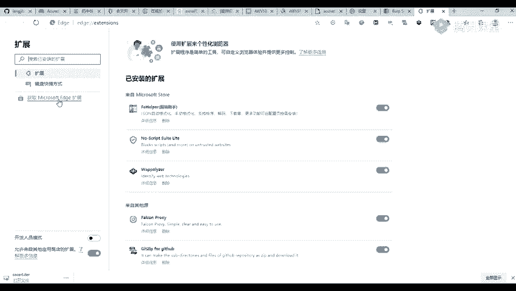

获取其他的一些扩展，要去搜索这个13Y，其实搜索这这个呢也差不多了。那里面的一些工具其实都差不多的。

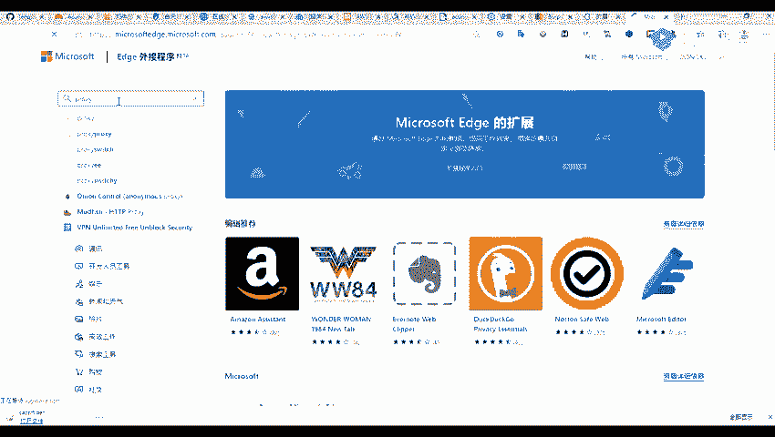

然后因为其他这些呢我也没用过，我我是用的是另外一个的，你们。待会要的话，我也可可以发给你们。不过呢你们要是可能导入我那一个的话，可能会进行一个突错。现以呢你们可以在你们的一个浏览器上面去搜索这一个。

搜索这个进行一个下载。那等下嗯。就就就要进行一个设置。比如说我这个东西为你。我这里去然后去进行一个添加一个。添在一个就是我们这个代理类型这里呢是不用理的。呃嗯这个代理地址就是我们的1个127。点0。0。

1，然后这个端口端口呢也就是我们的1个8080，就是跟我们在这个这个设置上我们的这一个op switch是一致的，就是这一个端口。8080。八零八零。Okay。127。00。1。

那么我们这个loc host，我们将它进行一个删除的，删除掉之后，我们创建创建了之后，在这里有一个未命名设置。嗯，我这里呢就选择这一个。我们可以看到要进行一个抓包一。

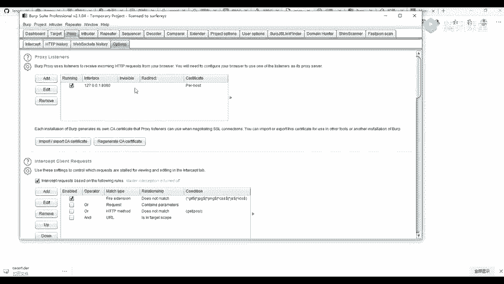