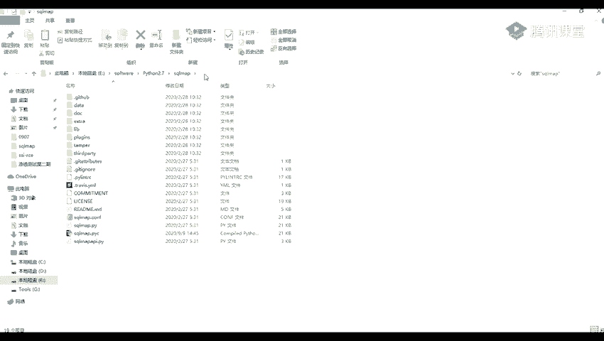
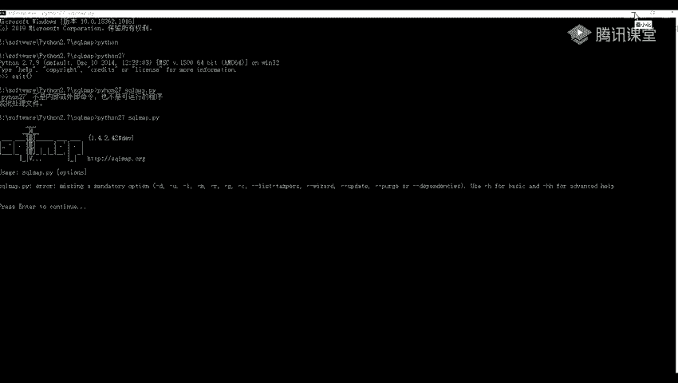
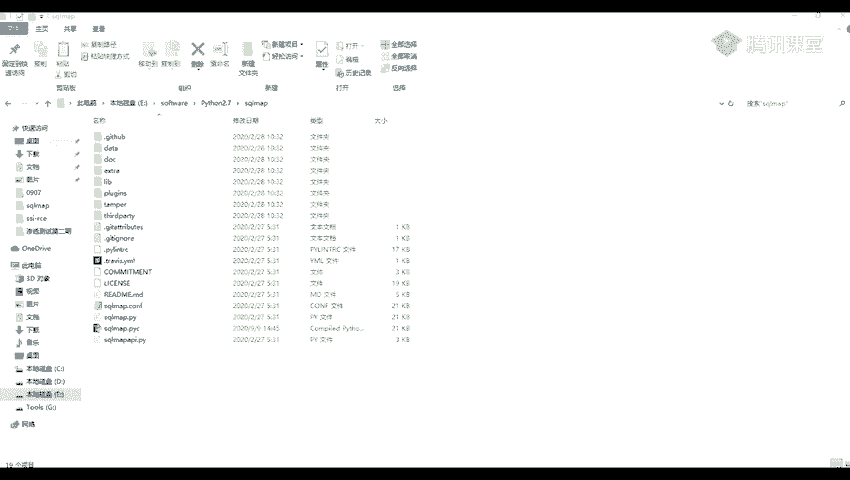
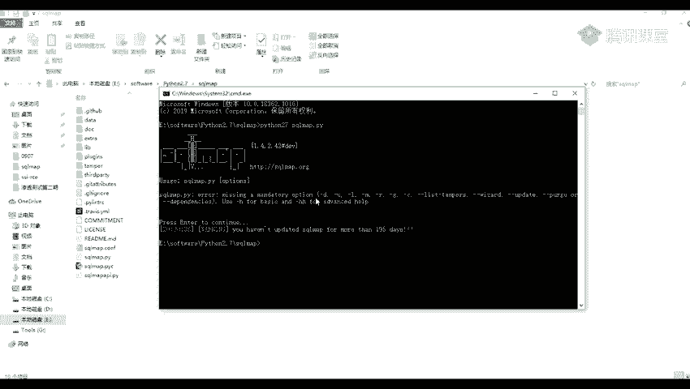
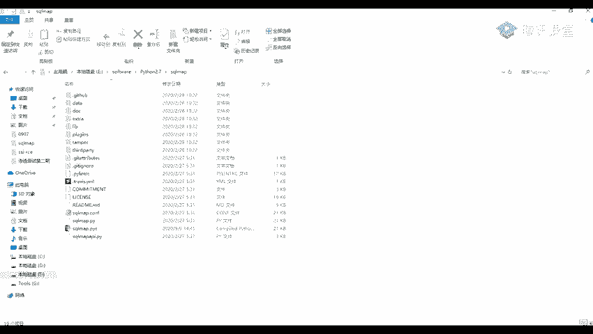

# 2024年最强Kali渗透教程／网络安全／kali破解／web安全／渗透测试／黑客教程 ／代码审计／DDoS攻击／漏洞挖掘／CTF - P38：8_sqlmap介绍与安装 - 网络安全系统教学合集 - BV1Pe411C7Zb

下面呢我们来看一下嗯。这方面好的一个介绍以及安装。首先呢我们来看一下so后 map是什么呢？它是一个开源的一个渗透测试工具，它可以用来进行一个自动化的检测。利用这个窗口注入漏洞。

获取数据库服务器的一个权限。也就是。通过我们刚刚演的那个思索就入漏漏洞。来获取一个数据库服务器的一个权限。然后那他是用一个。pythonpython语言写的，所以呢我们。如果要使用的话。

我们需要安装一个拍thon的环境。安审的环系的，你们在前面的课已经安装了，我这里呢就不给大家做一个演示了。刚才我这里有一个一个是官方的一个网站。还有一个是编号。

我们来看一下这个这个呢是他的一个官方的一个网站。我我之前呢也给也给大家在预屏内容里面也给大家写了这一个你们就是将这个下载，就下载这个压缩包，然后进行解压就可以进行一个使用了。

并不并不用说像其他的那些要激活或者什么的。没有呢，另外一个呢就是他的一个。别的哈。这个呢嗯。是他的一个官方的一个仓库。这里呢也有一些它的一个安装安装方法，以及它的一个使用方法。

还有他在这里呢也做了他的一个版本运行的一个版本。Oh。刚才我也给我我也在我的一个就是网盘里面给大家放了一个链接。你们可以也可以在我这里下载。他载了之后，那是这样子的一个。奥特曼。嗯。

这个呢就是我我找一个。Yeah。你要解解压了之后是他的一个scle map。后面我们可以看到他这里带的一个。运行的一个脚本，实际上是使用这个co mapPY，我们就运行这个文件。

但是呢我们要是说每一次每一次都需要进入到进入到里面来的话，就是进入到我们文件里面来的话，是不是有一点点麻烦。那么我们就可以为他创建一个快捷方式。怎么创建呢？我们可以新见页面，新见这个桌面。

这这个右键桌面也要新建一个快捷方式。推见快捷方式，然后我们在这里呢，就是需要我们去填。让我们。前有一个对象的位置，我们。我们这里呢是为我们的1个CMD。1个CMD的一个窗口。个我代你给换。

所以呢我们就是右键创建一个快捷方式，然后为这个填入1个BMD它的一个路径。再然后呢，我们就是右键属性在他的一个起始位置，给于我们的一个三方面保文件的一个位置。就是说我们在这里填有了我们的一个。

DMD之后，我们连接下一步。这呢你可以。命名随便命名或者是一个车号。卖货。Yeah。要完成完成了之后，我们在右键。药店属心这里。在他的一个起始位置，将我们的一个。乐高麦克的一个路径给放上去。

对我们的又起始位置这里将他放放进去。再点击应用就可以了。你应用之后呢我们。这可以在桌面去对它进行一个使用。我们双击它。关机他他这里呢，是是直接进就可以直接进入到我们的那个路径这里。

然后呢我们输入一个拍出来。python要看你们的一个Pthon是是输入python呢，还是一个直接。有一个。那个。就是多多多版本一个共存的。比如说我这里是一个多版本的。

所以呢我将我的一个hon改为一个hon二期。这里注有一个python二期，在这里呢就会出现我的一个大的一个版本哈。我们这里呢不是这样子，然呢我们去执行这个pyython二期。

然后再执行我们的一个serv map。搜涛麦点PY这个文件。现在我们对。哦，这里少了1个DYGO拍on。我买。原来我们就可以看到他的这这里的一个他给我们显示的一个版本信息。环境变量环境变量，你那个我。

我我没事了。环境变量，待会你你们也可以试一下，我这里。

就是我们主要是我们将我们的一个on的一个环境变量搞好就行了。这个的话都是不重要的。我们也可以就是我们在运行的时候，我们也可以进入到它的一个目录里面执行1个PMD，然后去运行它。

Okay。对。三方卖。

嗯。

我用给个拖布。