# 2024年最强Kali渗透教程／网络安全／kali破解／web安全／渗透测试／黑客教程 ／代码审计／DDoS攻击／漏洞挖掘／CTF - P39：9_sqlmap功能及应用 - 网络安全系统教学合集 - BV1Pe411C7Zb

然后呢，我们这里呢有有一个中文的一个手册。那我手上呢也介绍了一个比较很详细的。我这里呢只只是给大家介绍它的一个简单的一个用法。等先，那我们。可以看就是可以看到这里给大家列出了几个参数。

一个是杠H杠H参数呢是查看到的一个一个基本用法，以及它的一个命令行参数。还有呢就是一个杠HH就是查看所有所有的一个用法以及命令行参数。还有呢，就是他的一个钢杠磨损，查看到的一个版本信息。下面呢我们嗯。

先来看一一下他的一个用法。我们先将我们一一边介绍这个用法，一边来讲这个课。所以呢我们。进行一个漏洞的一个检测。漏洞的检测呢，我们主要是使用一个杠U的一个参数。

杠U参数呢它后面呢就是跟我们的1个UIL或者是1个杠M参数。也就是我们可以去批量去对我们的1个UIL进行一个检测注入，就是检测它是否存在这一个注入漏洞。比说我们这里到U，我们来给大家测试一下。

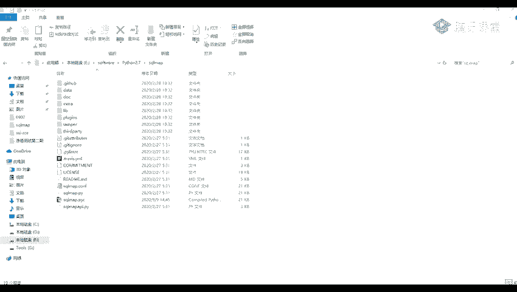

嗯。要拍出。27你车号麦。杠U杠U呢就是跟我们的1个UIL后面跟我们的1个UIL。

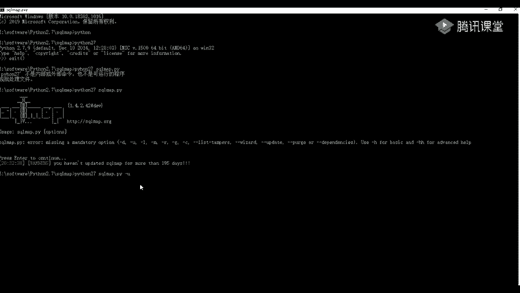

那大家双你号。然后这个这里呢就是跟着我们的一个。对了。跟我们的1个UIL就是我们的一个参数的一个值。这里。

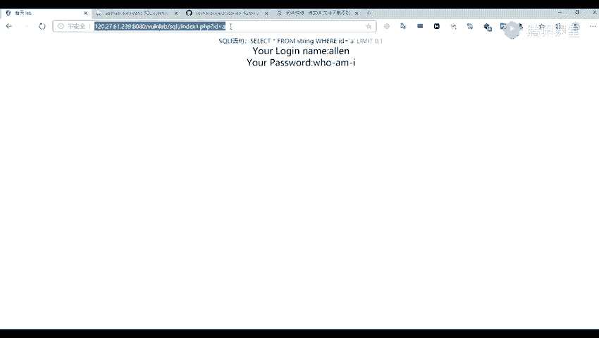

1我们UIURL。他进行回车。回车呢，他这里呢就会给我们进行。

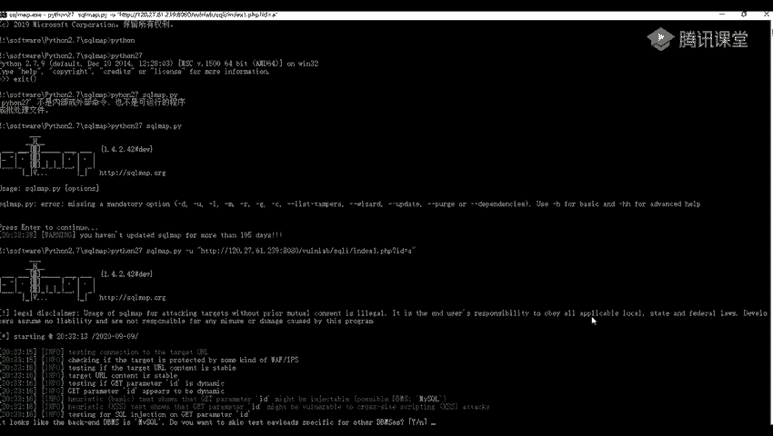

做一个检测。检测的话，在这里呢，待扣大询问我们。就是如果说我们不懂这些英文什么意思的话，我们也可以进行一个复制。那这这个意思呢就是告诉我们。我们后端的一个促据库，看起来呢像是一个myr的。

看起来像是一个买射索数据库，然后你要再询问我们是否去跳过测试其他的一个数据库。我们这里呢也可以去翻译一下。

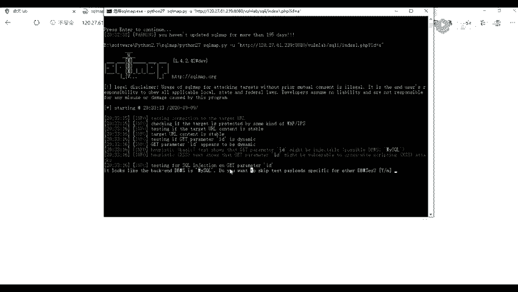

他这里呢是询问我们是否要退过？这是其他的一个数据库。

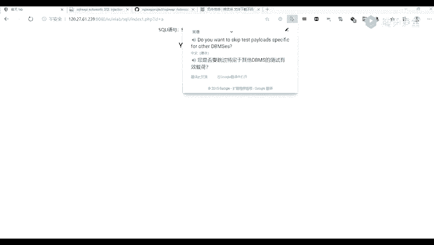

啊，然后要那我们就确定就好了。都有1个YFP确定。然后这里呢我们要是看不懂的话，那我们我们也可以去进行一个复制，看看他是一个什么意思的。

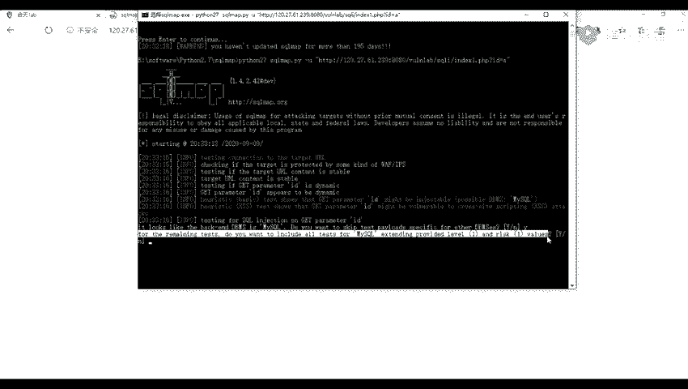

那么在这里呢询问我们是否要包括所有针对一个mro的一个测试。我们这里呢也可以可以就选个NN也可以。

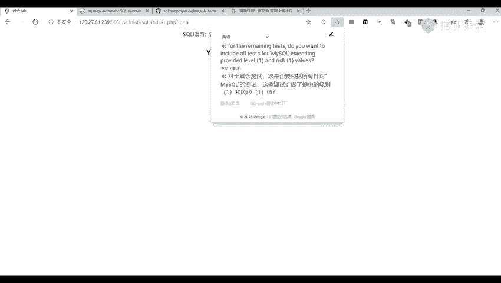

这里呢我们可以就随便去，就是就是我们不懂使用的话，我们都都可以去多进行一个尝试。就是可以输入Y，第一次输输入Y看看看一下会是什么结果。你要输入N你看一下什么结果。那到这里嗯。

他他询问我们就检测到这个ID的的这个参数是脆是脆弱的。也就是说他检测到了这个ID的这个参数可能是存在一个漏洞。那后面这句话呢，就是问我们是否要还要去测试其他的一个参数。

我们这里呢就不进行测试其他的一个参数了。我们这里呢就是测试1个ID的一个参数。现在我们都有一个安。对有安置号。那这里呢就是我们的一个检测的结果。他这里呢就是检测到了它的存在的一个注入。

就是存在了一个get型的一个注入。那呢如果是我们使用了一个杠杠M参数。27小车风麦克杠M杠M3个呢，我们可以就是将我们的1个URL复制到一个。

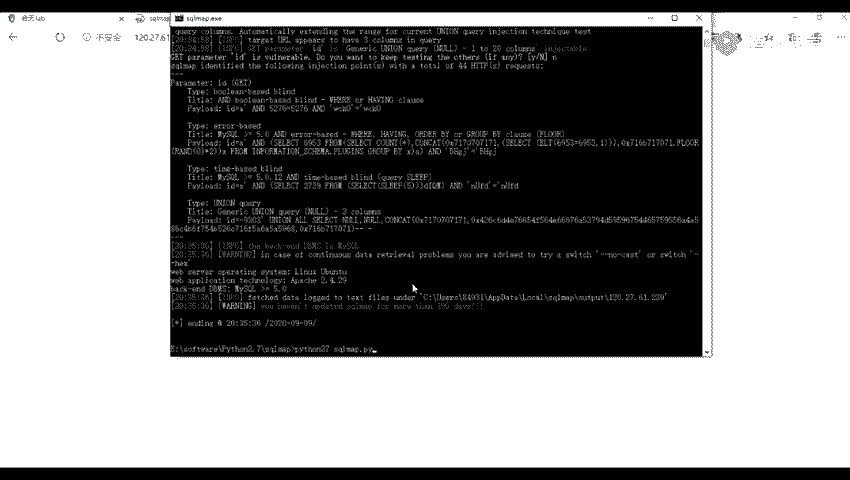

文文本里面比如说我们复制复制到这里。要一行一行一条。比如说这里是一个一，还有一个2。比如说比如说这样子，如果我们是这己还是小一点。好，就是我们一一行1个UIL。如果我们使用的一个杠M3组。

就是进行一个批量的一个检测。

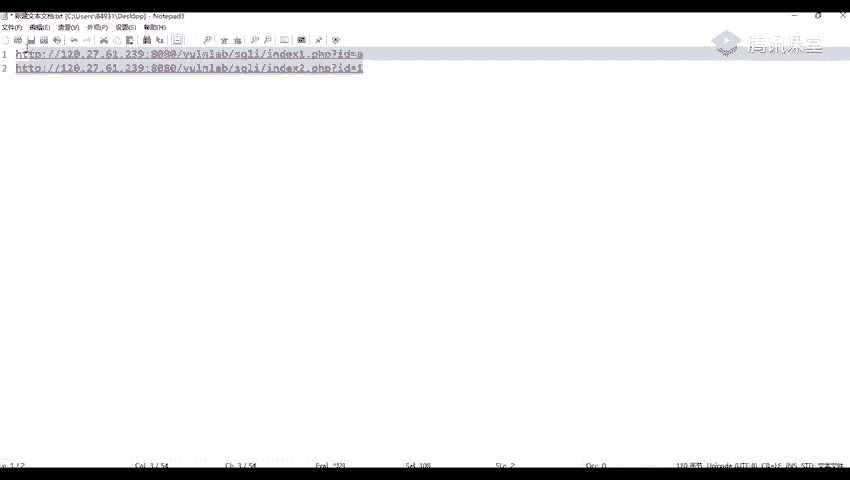

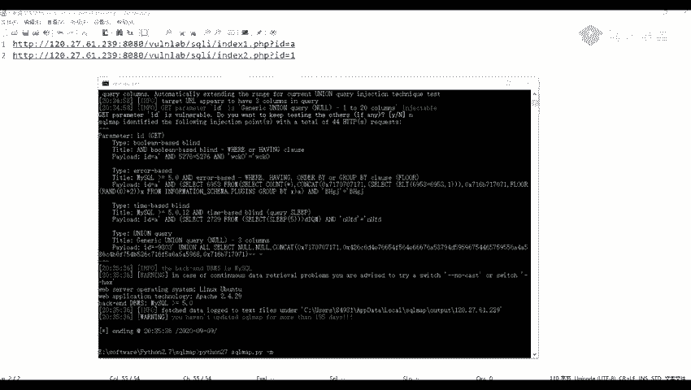

下面呢我们检测到了他存在的一个操作。那么我们。再进怎么去进行一个利用呢？首先呢就是一个第一第一步就是媒举到的一个数据库。这里没没举到的一个数据库呢，就是我们要注意的时候的就是一个地方。

就是我们后面的是一个杠杠DBS杠杠DB杠杠DBS也就是说媒举所有的一个数据库，也就是在我们的这个。数据库系统里面的一个所有的一个数据库。

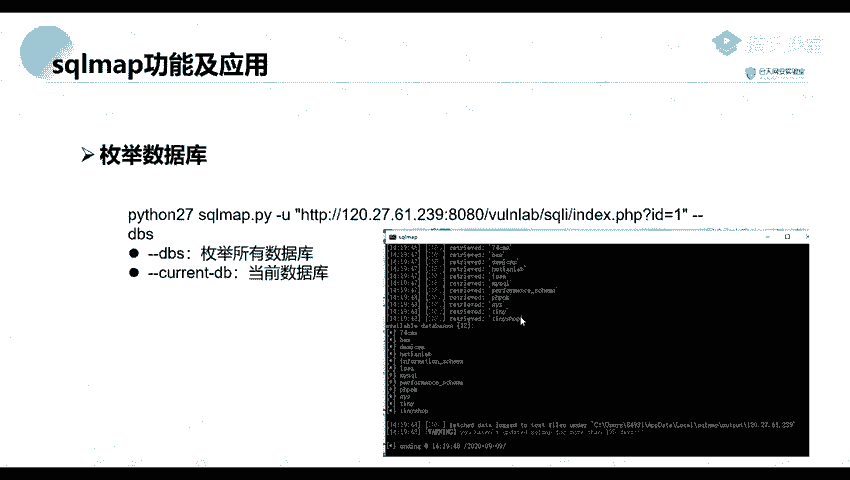

哦，这个呢就是就是他的一个测试的一个等级。比如说我们这里呢是一个。也因为我们一个注入的话，我们并并不只并并并不仅仅只有一个get或者是是一个post。

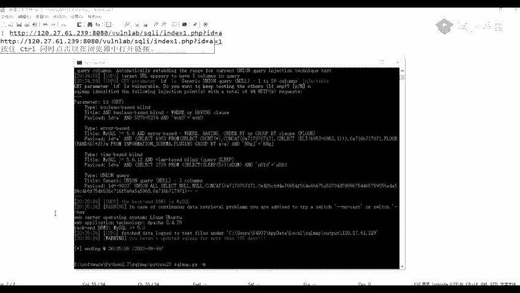

我们还有一些我们你的也友，也可能会存在一些 cookieookie。guook作用还有1个HTTD淘作用HTD。嗯。头部。ど用？就是这是什么意思呢？就是说如果我们我们注入的一个参数。

就注入点并不在这这里面get或者是post里面，就是并不在这里。那么那个就但如果说在这个cook的话，如果我们选择你刚刚说的这一个，那么他就会去测试其他的一个地方。等一下。

比如说他的那个level就是你就是那个等就是等级的level那里，它一共有5个5个等级。当默认情况上呢，这个搜cle map只支持我们的一个get，还有post参数的一个注入测试。

但是呢如果当当我们这个level大于等于2的时候，就会测试它的1个HTPHTPP里面的一个cook以及一个user agent，还有一些de头等等。这个呢你可以看一下那个中文手册里面也有一个介绍。

可以设置。但是我们对呀，就是你你扫描就是跟我们前面讲的一个扫描器一样，就是AWBS1样。你你设置的就是越越慢。那就是我们不是有一个选择吗？可以设置快的，还有一个慢的。如果你设置5的话，那就会走的很慢。

但是呢他就会可能就是走的比较详细。因是我们我们可以根据我们我们的一个需求来进行一个设置。哦。

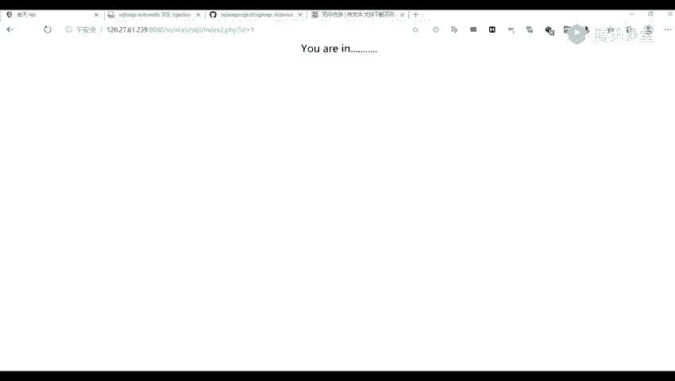

呃，下面呢我们来看一下我们。这一个。继续我们前面讲。原在我们在凹面加上一个。杠杠杠DBS就是我们没枚举我们当前的一个数据那个数据库管理系统里面的所有数据库。

我们可以看到我们这里呢已经给我们枚举了我们的一个所有的一个数据库存在的一个数据库。这里呢跟我们的一个是一样的。这里。

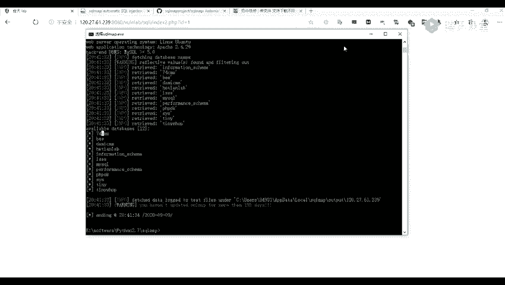

哦，对，默认呢是一级默认为一，他就是可以测试我们ge查有pot参数里面的一些参数。

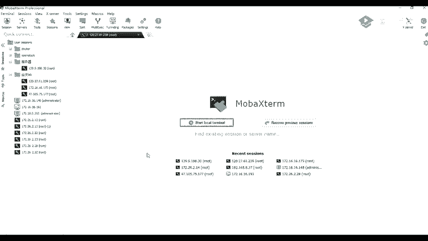

就说我们这里麦生烤。杠优。Yeah。搞错了。买色到杠1。嗯嗯。啊，比如说我们进入进入到了了我们这个数据库这里了，要让我们来看一下它里面的一个所有的一个数据库这一颗。你 a飞得背。我们这里可以看到呢。

他这里他的一个数据库跟我们跑出来的，这里呢是一模一样的。他这里呢是12个，我们跑出来的也是12个。

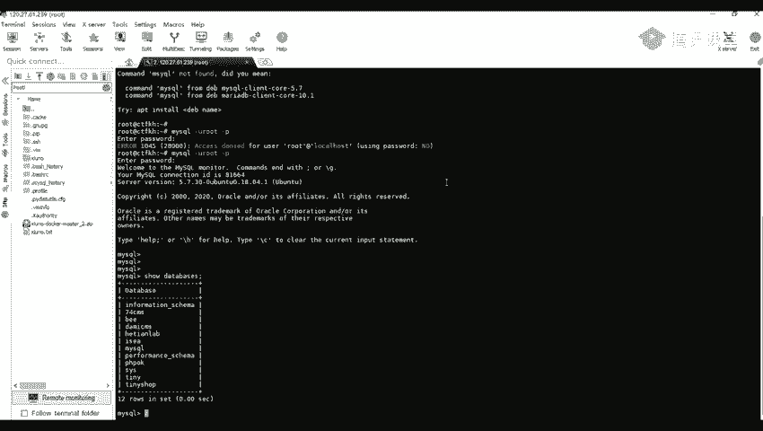

原来我们除了跑我们的这一个所有的一个数据库之外，我们还可以去跑我们当前当前的一个。当前所使用的一个数据库。就是我们将我们的一个大单字体改为一个。有了。啊。IENP。大滴滴。这个三组呢。

Q冷这个参数Q冷杠DB这个参数就是每几没就是。查询我们当前当前这个网站所使用的一个数据库。

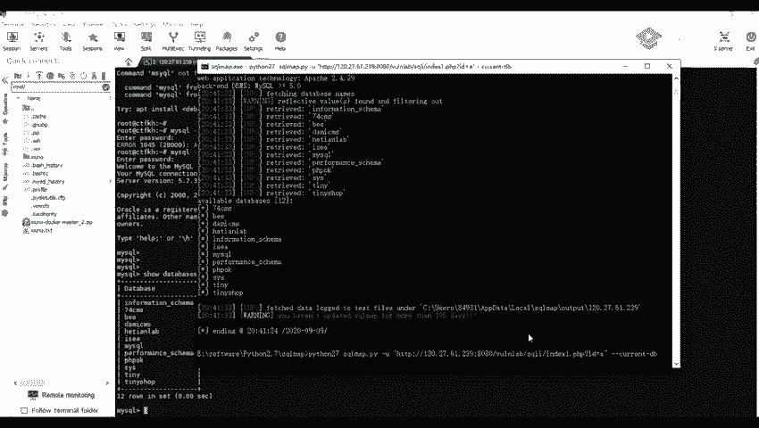

现在我们这里呢可以看到在在这里。在在在这里我们已经注出了一个他的一个数据库名字，当前的一个数据库的名字。我一个和天来不。那在我们在实际发SIC的时候啊，我们就是。导出这个数据户名就可以了。

就是我们在使用这个搜索脉搏还是一一个人工进行一个修入的时候，我们都是我们一般来一般来讲的话，我们跑出了这个数据库名就可以提交了，并并不在需要进行后面的一个。录用了。

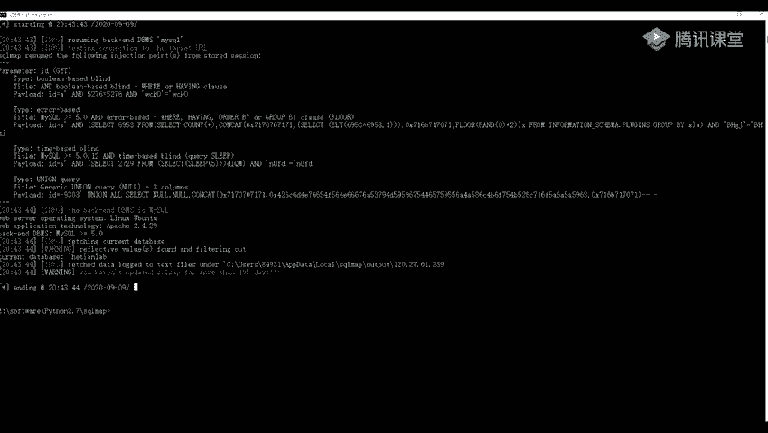

刚当我们注了一个。注入出了跑出了一个数据库之后，我们就。还还可以去对他进行一个数据表，就是跑他的一个数据表。数据表中呢，我们前面的一个数据库呢是一个杠杠DBS然后数据表数据表呢就是一个杠杠黑宝。

Avo就是一个表表明对吧？这个这个杠D杠低参数就杠大写D这里，后面呢就是跟我们上一步没举到的一个数据库名。比如说我们上一步上一步就不是没举到了一个和天la，那么我们这里报道的一个数据表呢。

就可以将我们的那个数据库名就是写写出来。

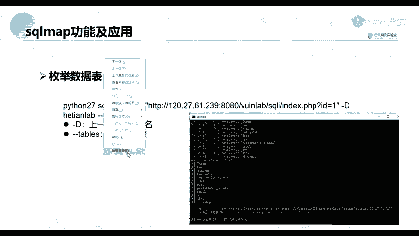

比如说我们。比如说我们这里我们前面是。对。前便我们跑了一个。我天内吧原来我们杠低杠低，也就是我们的一个face背，就是数据库嘛，要和和。嗯。That。然后后面是刚刚一个杠杠黑保。你保。

他就会对我们的这个数据库里面的一个表进行一个查询。刚在我们可以看到，我们查查到了这个88个表，一个user comment man以及email等等。那我们我们跑出了一个表名册。

我们是不是还可以跑它的一个表列，就是它的一个类名。那你比如说然后呢，我们可以在这里。

我们前面跑出了一个。表明也要杠杠T杠T呢就是我们跑出来的一个前面的一个表明。比如说比如说我们这里呢跑一个U。右手是不是这个右手就是我们前面跑道的一个表明。那我们在列名列名是哪一个呢？就是。

holCOLUMMNS这个呢就是跑它的一个列名。把内名之后，我们来看一下。这里呢可以跑到它存在了三个类，分别是1个ID password一个以及一个username。啊，对，这边呢是自己自己添加的。

就是那个呢是我们用来练习的一个网站的。这个你你你在上一个的时候应该也也有做过这一个吧。对，现在是给我们做一个练习的。那那我们跑出的这个ID还有一个youname爬sword之后，爬word之后呢。

我们还可以对它进行跑出到里面的一个具体的一个数据。那么怎么。那到了这一步呢，也就是还要再继续的话，也也就是我们所做的一个脱库。

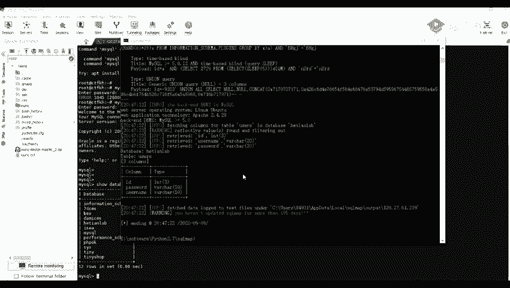

就是前面我们前面这里呢，我们跑出了他的一个媒体到了他的一个数据表列。然后呢我们这里呢有还有一部是拖库，拖库这里呢，我们在挖SIC啊，或者是做一个。做一个极大的一个漏洞挖掘的时候。

我们对这个呢尽尽量不要去使用。除非说我们是在做一个渗透的项目，就是别人有一有了一个授权，然后并且说明这个情况了之后，我们才可以对这个进行一个使用。不然的话，我们这个托户这个当杠断口。

这个命令就是我们最好呢是不要对他进行使用。

因为这个很很容易就。那个。被抓进去了。那我们怎么。我们前面呢我们跑到了他的一个跑到他的一个数据表列，然到我们杠C杠C呢，后面就是跟我们的一个列列名，比如说我们这里的1个ID。ID然后就是。耐容。有的。

你要他好他在查除我的。后面就一个杠杠档篷，也就是一个拖布。现在我们可以看到我们查查到了这个88个表，一个user command man以及email refer等等。

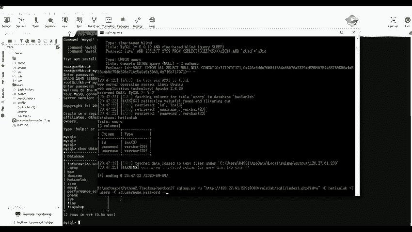

那我们我们跑出了一个表名册，我们是不是还可以跑它的一个表列，就是他的一个类名。那你比如说然后呢我们可以在这里。

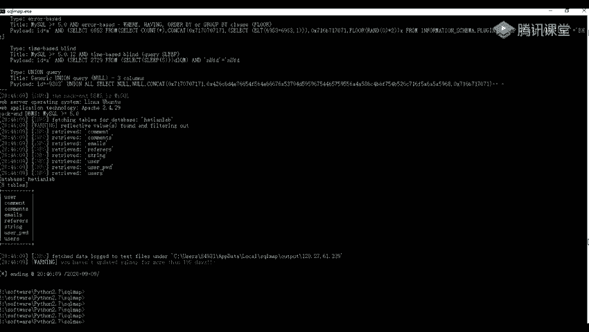

我们前面跑出了一个。表明有要杠杠T杠T呢就是我们跑出来的一个前面的一个表明。比如说比如说我们这里呢跑一个U。右手是不是这个右手就是我们前面跑道的一个表明。那我们在列名列名是哪一个呢？就是。

hollonCOLUMMNX这个呢就是跑它的一个列名。好，列名之后，我们来看一下。这里呢可以跑到它存载了三个类，分别是1个ID password一个以及一个username。啊，对。

这边呢是自己自己添加的，就是那个呢是我们用来练习的一个网站的。这个你你你在上一个的时候，应该也也有做过这一个吧。对，现来是给我们做一个练习的。现那我们跑出的这个ID还有一个name爬word之后。

爬word之后呢，我们还可以对它进行跑出到里面的一个具体的一个数据。那么怎么。要到了这一步呢，也就是还要再继续的话，也就是我们所做的一个拖库。

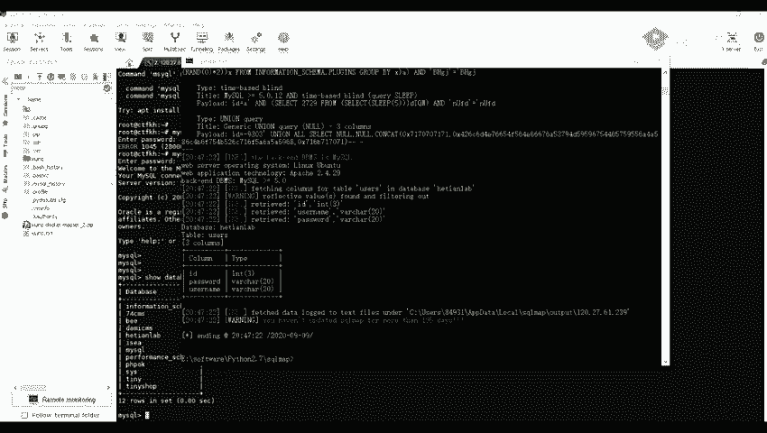

就是前面我们前面这里呢，我们跑出了他的一个媒体到了他的一个数据表列。然后呢我们这里呢有还有一部是拖库，拖库这里呢，我们在挖SIC啊，或者是做一个。做一个极大的一个漏洞挖掘的时候。

我们去这个呢尽尽量不要去使用。除非说我们是在做一个渗透的项目，就是别人有一有了一个授权，要后并且说明这个情况了之后，我们才可以对这个进行一个使用。不然的话。

我们这个托户这个当当账款这个命令就是我们最好呢是不要对他进行使用。

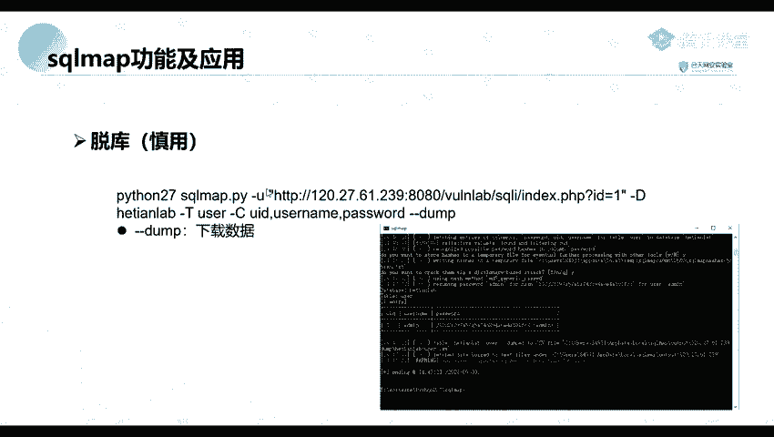

因为这个很很容易就。那个。被抓进去。那我们怎么。我们前面呢我们跑到了他的一个跑到他的一个数据表列，然到我们杠C杠C呢，后面就是跟我们的一个列列名，比如说我们这里的1个ID。ID然后。比如说。内容。有的。

你要刚好大查查主我的。后面就一个荡杠荡哈，也就是一个拖布。

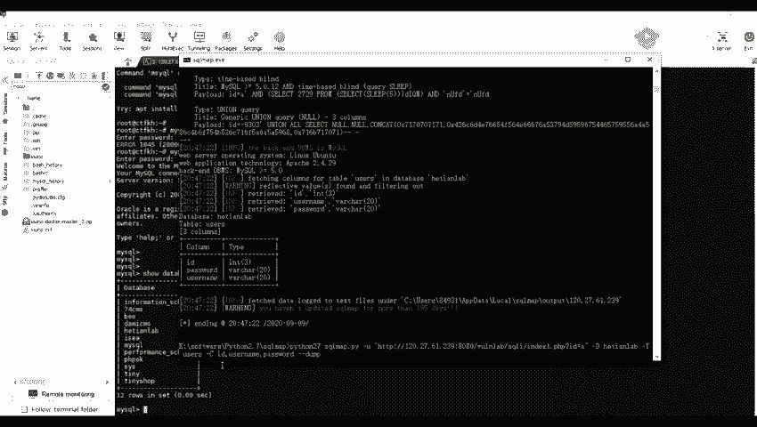

要使用了这个命令之后，他会将这些数据。我们可以看到在这里将他会将他的一个数据会保存到我了我们的一个本地。保存到本地，后呢我们可以就是保存了成了1个CSV的一个文件。

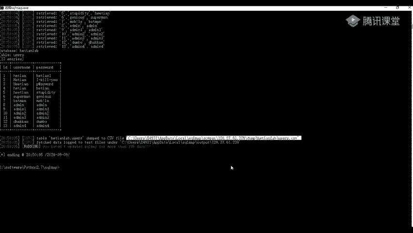

你们可以看一下，在此电脑在C盘里面要。看一个用户。在这个。找一下这个APAAPP代在哪。Loer。到我们每个多说卖。在们这个4号麦你要在oppo这里。我们可以看到这个断口。

这里呢我们可以看看到我们刚刚是已经将我们的一个数据给拖下来了。原来这这个呢就是我们所跑道的一个数据。当然了，实际上我们正常的话，我们这里呢这这这个呢是给我们做一个显示用的，就是展示用的。我们就是可以去。

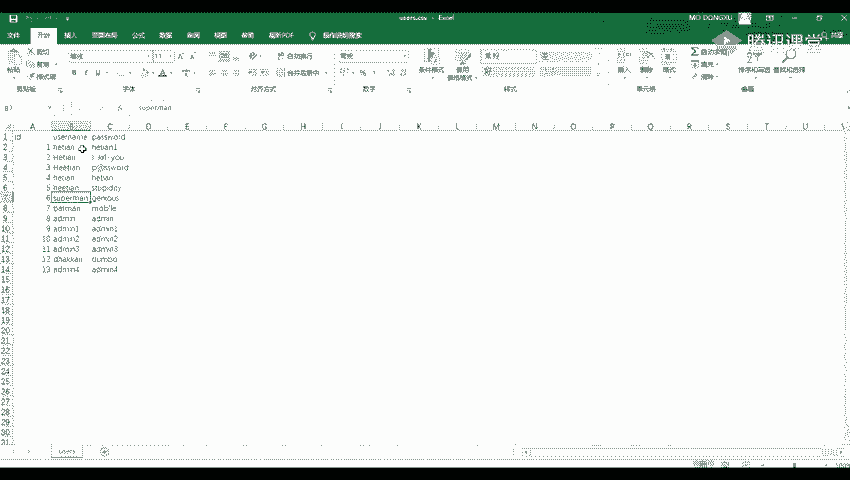

比如说我们这里呢是跑其他的一个表，比如说我们这里。

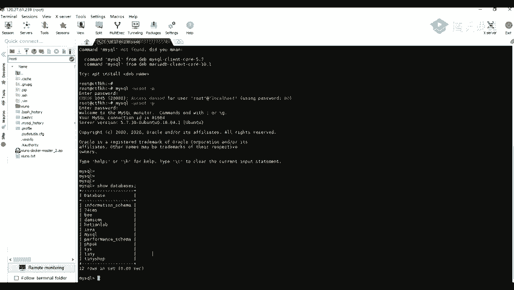

前面这一步不跑它的一个优势。不跑右侧组我们我们可以跑这个右色杠WD这一段。哦，还有就是你你们挖挖漏洞的话，就是你们在上传的时候，最好是上传1个PHP four。上传个PIP音播就可以了。Okay。因为。

因为你你这个不是做了一个，就是我们在挖是挖漏洞的话，并不是我们的一个渗透，就是。我们上传一个漏洞去证明他去证明它存在就可以了，并不是并不需要对他进行一个后一步的一个利用。

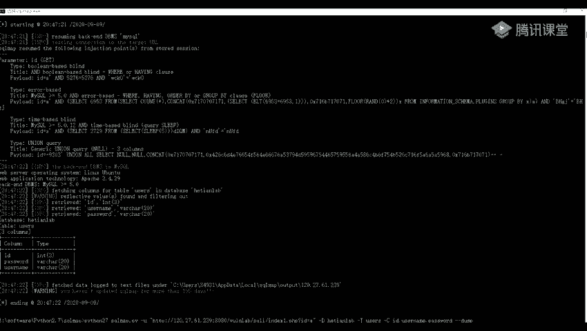

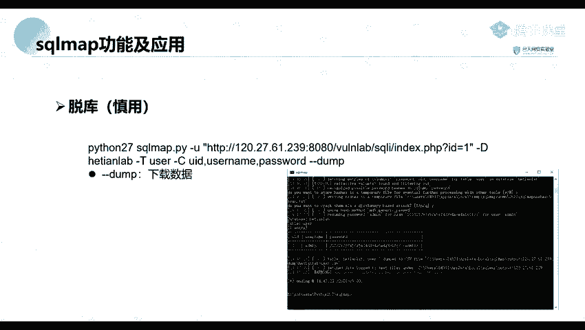

本案呢我们这节课的一个servcle map就讲到这里。那我们先休息一下，你们有什么不懂的吗？有不懂的话就发发在上面啊。我们休息10分钟，然后到9点，我们再开始下一节课。哪一个好脚板的？哦。

我这我前面不是在预计内容里。啊，那个因为我们一个时间的一个原因，并就先不讲这一个。方面我抽有时间的话，对，待会就要换一个教室的。后面我有时间的话，也会给你们讲一些其他的一个就是。方法。

而且你们这个这个车头车头卖火烤脚本呢并不是那个杠杠sp那一个参数。我们一般呢是用来就是过一个袜。

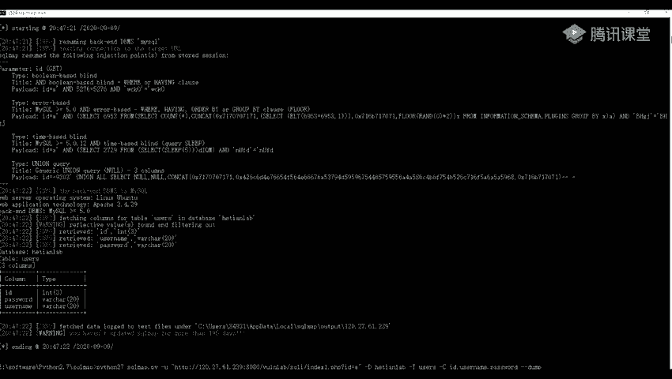

我们是使用使使用的是这一个他参数。就是手动的话，我们还是需要进行一个走手动的。因为我们在测试的时候，我们一些参数啊或者是一些其他的我们可能并没有做的那么详细。我们可以在手动的时候。

就手动跟这个工具进行结合相结合。比如说我们。手动可能去跑走动的时候跑到，我们发现他存在这个漏洞了，存在了这个漏洞的话，我们就可以使用工具进行一个跑。因为因为使用工具这使用工具跑的话，我们直接加个杠杠。

那个杠杠哎怎么对不了那个杠杠DBS。就可以了。而不是我如果我们手动的话，我们还得一步一步的猜猜大的一个数据。这个ttablele这个脚本的话，他其实也是。

比如说他会可能他可能是他里面它内置了许多的一个过袜的一个脚本。比如说可以有一些可以要过空格的，我来看一看他是在哪里的。哦，比如说在这个天本里面，他已经他内置了许多的一个解板，他默认了这些解板。

要那我这里呢给你点一下这个吧，或参保吧。让我看一下。比如说我们这里有一个slaep，我这里呢这里这个语句已经将一个slaep进行一个过滤了。比如我这里。你你懂的话，就直接那个吧，就那代的。单人。哦。

不对，这里。不让不让再看。我们这这个是一个。杜志行。我的 by。No。哦，我们我们可以看到。我们这里呢我们这里呢输入了一个是let，对吧？这里呢我们输入了一个sack，但是在这里将我们的这个sack。

将我们的一个st，我们他的一个搜cle语句，在这里呢将我们的一个slat语句给剥滤掉了，过滤的过滤掉了。那么我们这里呢就。就使用这个小姐的一个st就不能进行一个要货了。但是呢我们可以使用我们的一个脚本。

因为我们脚本的话有一些它内置了许多的一个要过的一个。

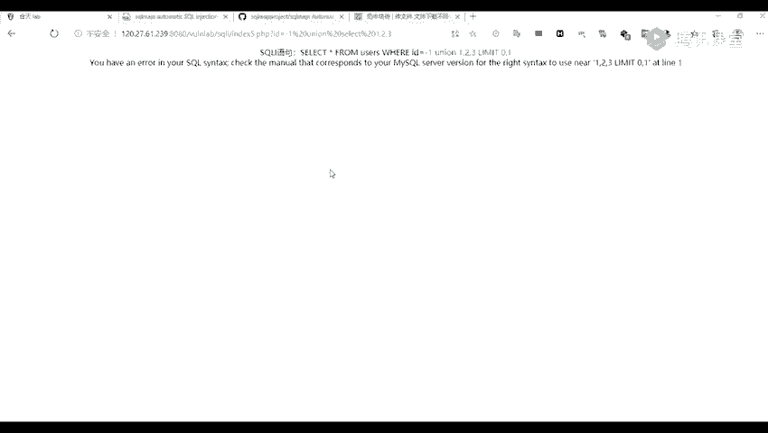

标管。就说我们这里。南天是一个那个。P分。iphone27。方卖。啊，你。

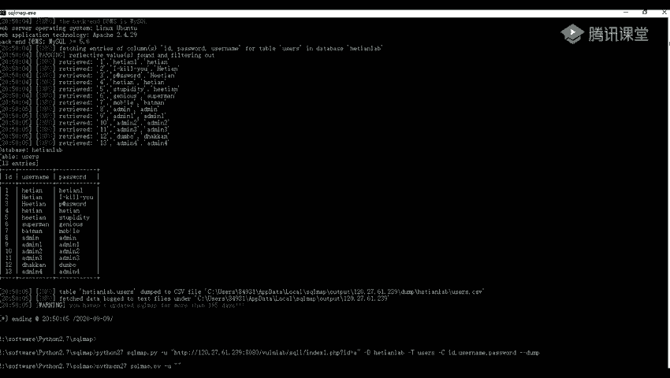

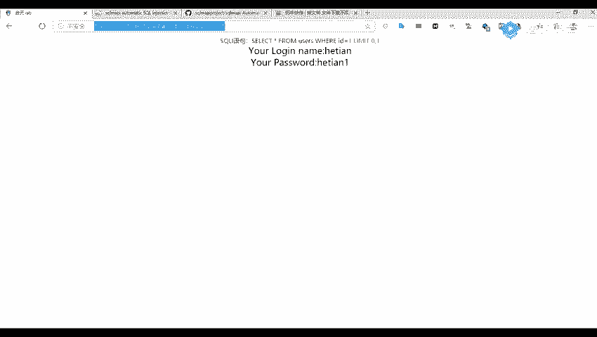

呢啲嘢。有看你下后面。关 b p s然后。搭搭加上我们的一个杠杠。

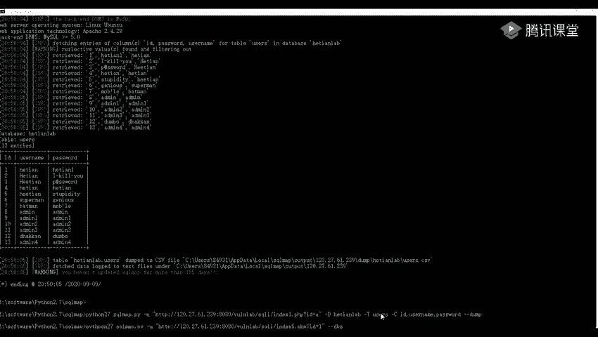

放小一点吧。金刚 e a。单保。d一系幕。天啊。然后后面后面刚我们加上一个杠杠table，就是使用我们的一个脚本，使用他的一个过袜子的一个脚本。然后面呢就是跟我们的一个脚本名字。

比如说我们这里他过滤过滤了一个slack，我们可以找一个。关键关键词要过的一个脚本。

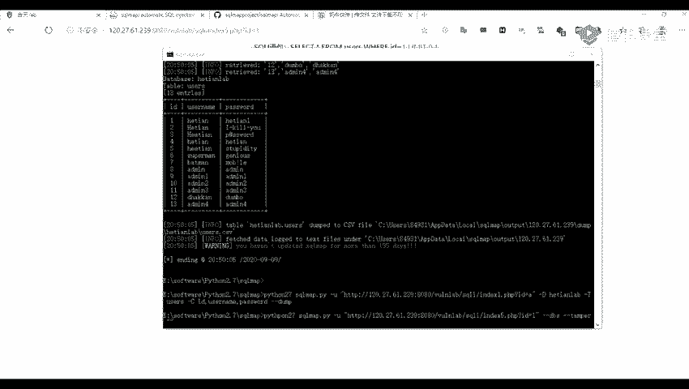

比如说我们使用这一个。这个脚本可以做一个关键词的一个要货。这个呢这个脚本的他的一个。实际上它的一个用法呢就是在它的一个关键词，在关键词里面加入它的一个注释符。比如说我们这里一个是let，对吧？

你要你让他使用了这个条板之后，就就会隐变成这样子。就会前面截面成1个S1，它可能是这样子，插有也有。别干了。他有一个周顺龙，这样子。不。他他这样子他这样子呢。

是不是那实际上它里面是在我们使用了这个脚板之后，他就会将我们的这个语句演变成为这这个sn演变成为这样子。那样呢我们就可以对他进行一个要货。还有呢或者哎有呢就是一个比如说。在关键词。一天加一些百分号。

比如说这一个脚本。这个条管大的一个作用呢，就是在我们的一个关键词里面。一天加一些百分号。这个这里有个白白班号。那这里也有一个排班号。就这样子添加一个摆万号。他实际上就是这样子的一个原理。

就是在我们的一个就是看它的一个脚本的不同，然后插入的一个地方也也不同，插入的一个内容也不同。比如说这个脚本是插入一个测视符。要要第二个呢就就是加有一个百分号，我们还可以就是可能是通过一些双写。

关键词双水。就就是这个这个脚本就是做一个关键关键词双写。进行一个要货。我们这里呢可以对一下。

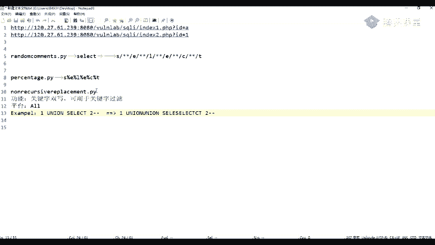

原被告吧。

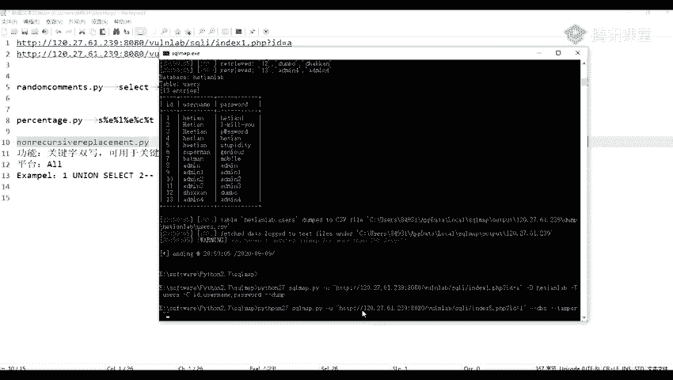

应该有有这个标本吧。

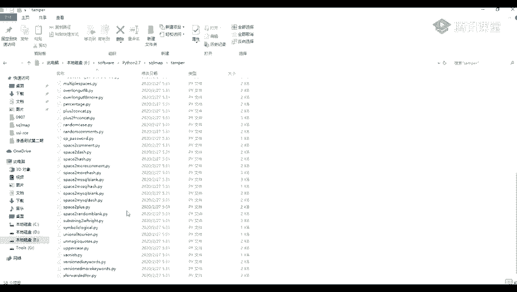

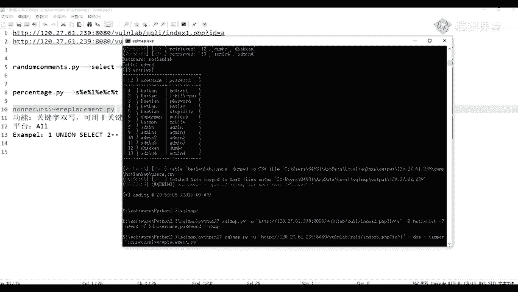

哦，哎，没没有没有这一个他内置。我找一个有的吧。你好。比如说我们使用这一个吧。

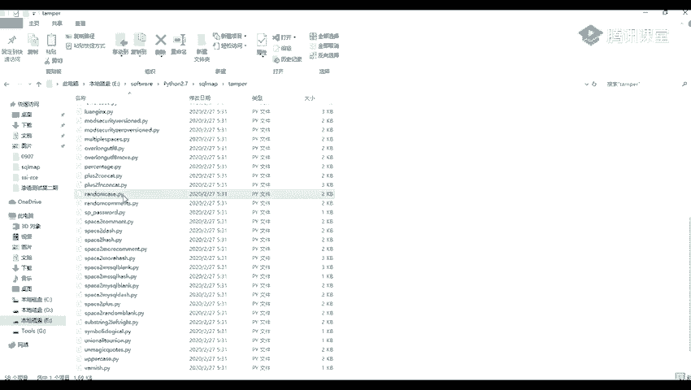

我看一下这个行不行啊。原来我们。加上一个杠。上亿的一个参数。杠一参数呢哎。就是显示我们的一个拍lo的一个变化。明白。3个。依个规噶。

那我们可以看到他跑跑的一个数据。我们这里呢我们可以看到他的这个嗯。我们这里呢可以看到他是不是将我们的一个一。这个东西就是我们的的一个关键词进行一个随机大小写了。啊，明白了那就好。

呃我们我们再再休息几分钟吧。哎，我去上个厕所。我们这个这边呢先是按后你们遇到另一个教室吧。

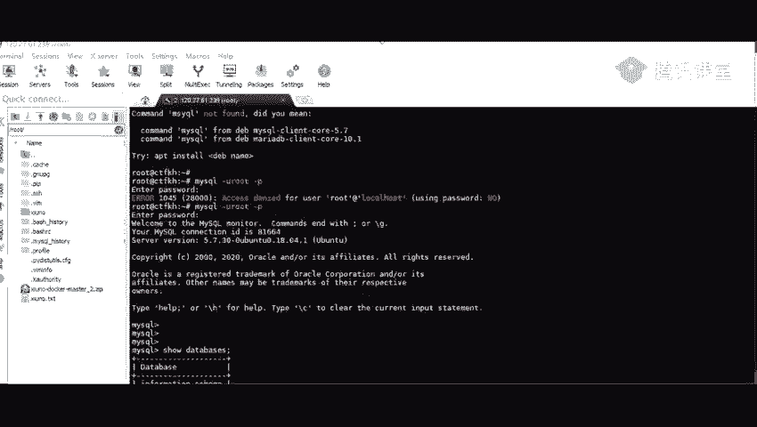

啊。

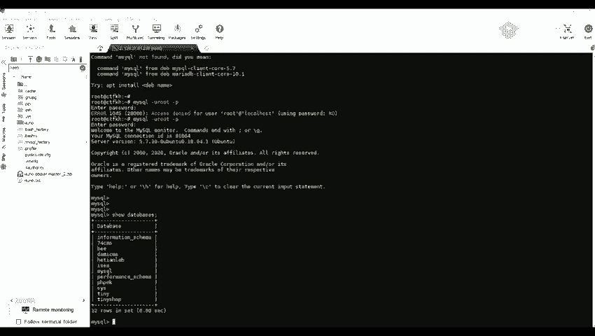

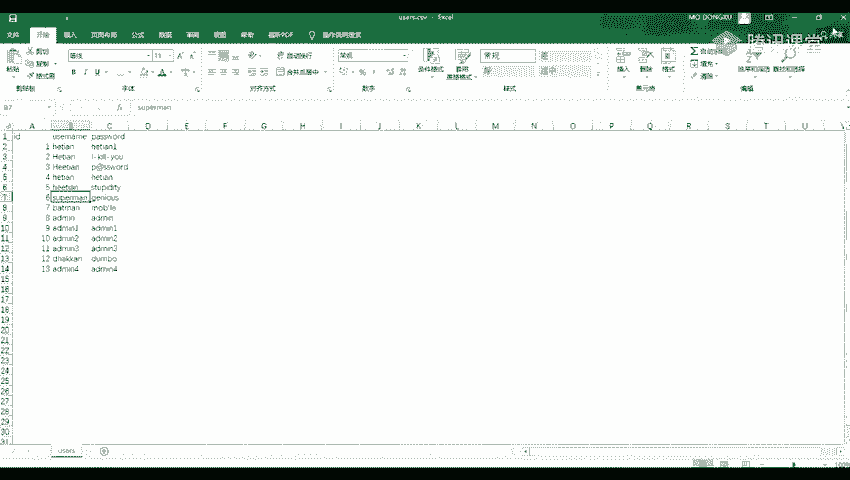

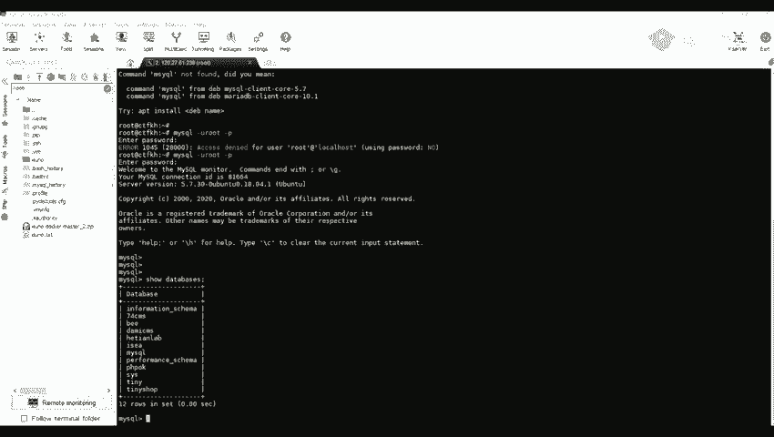

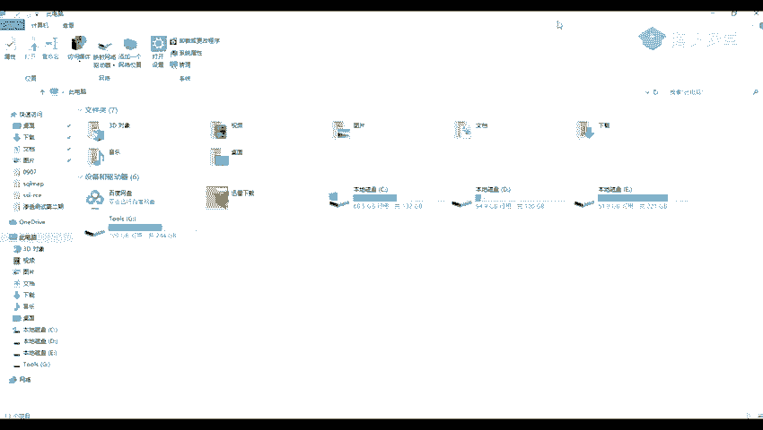

好了，我们开始第二节课的一个内容。就是我们上一节课的那个刚刚那个tableble那个参数，我们在使用那个参数的时候，我们就是需要知道我们的网站就是对哪一些关键词进行了一个过滤。

然后才可以对它进行一个对应的一个使用。

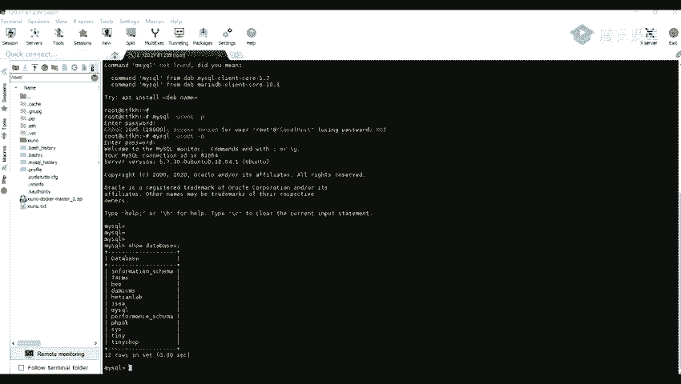