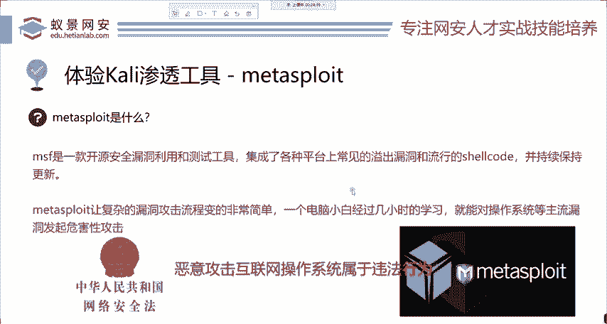
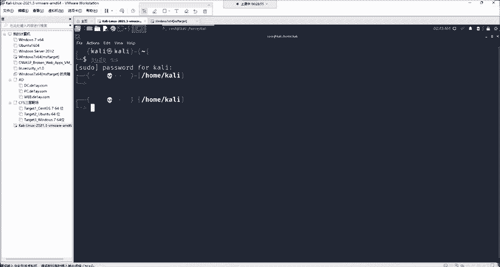
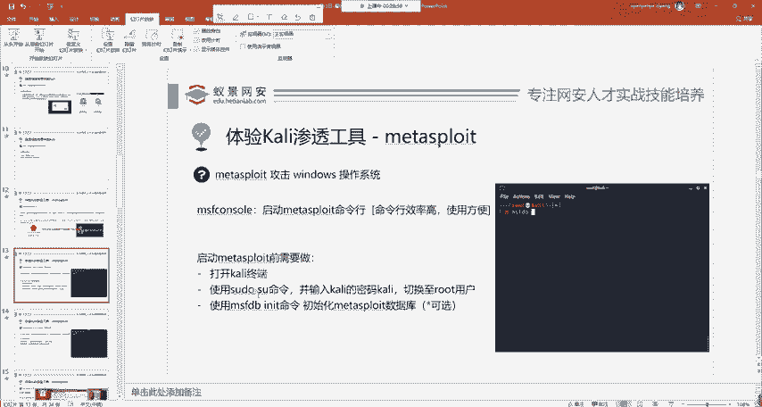
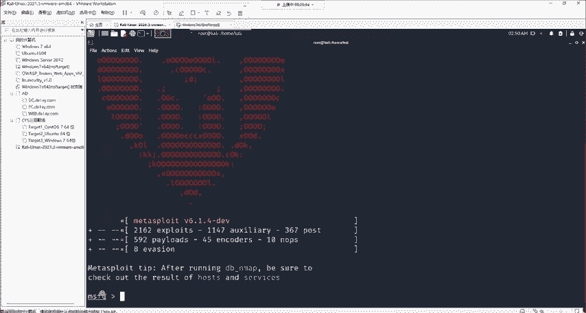
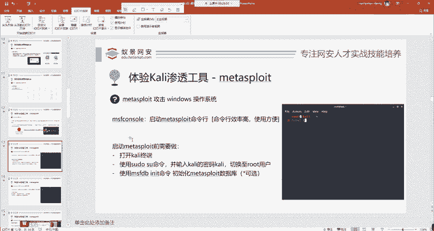
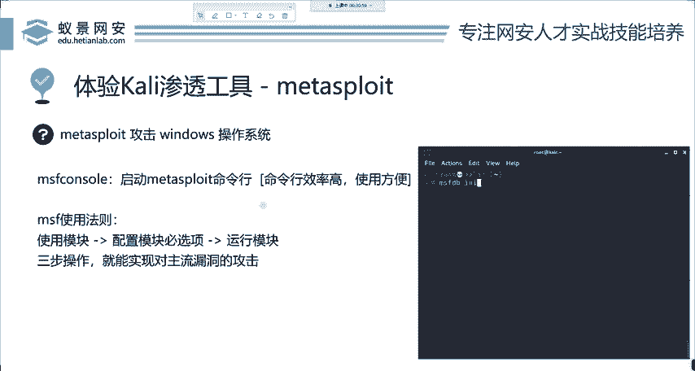

# 2024年最强Kali渗透教程／网络安全／kali破解／web安全／渗透测试／黑客教程 ／代码审计／DDoS攻击／漏洞挖掘／CTF - P3：2_metasploit渗透工具的基本使用 - 网络安全系统教学合集 - BV1Pe411C7Zb

啊，那我们下面呢就来找到它其中的一个工具，并且呢实际的攻击一下给大家讲啊。这个工具怎么去用？我选的这款工具呢叫做metapo。 metapo是在渗透测试中，包括现在实际工作中最为常用的安全工具之一。啊。

这个工具呢是被国外的媒体评为世界前三的黑客工具。首先我们要了解它，那metapar为什么能登上世界前三呢？第一就是它功能非常的强大，它包含了在各种平台上常见的漏洞攻击，利用脚本。

比如说我想攻击windows，在mate split上面有相关的攻击脚本，我想攻击linuxmic安卓等等ROS都有相关的漏洞攻击脚本。也就是说呢mate split存在。

就是让复杂的漏洞攻击变得非常简单。我们一个完全不懂电脑的小白经过几个小时的培训学习，也能够对主流的操作系统进行一个危害性的攻击。这就是它的精华所在。首先大家在学习安全，你千万不要去小看这些公司。

像微软就拿微软来说，我可以说微软它对于安全的重视是非常呃是非常重视安全的。不是说你想攻击就能攻击的。你攻击起来非常困难。那mate split呢就是解决这个问题而出现的那它那么好攻击大家。

啊就要逐一恶意攻击互联网操作系统是属于违法行为的。大家如果想实际测试的话，可以采用虚拟机或者是攻击自己的室友攻击自己的同事啊，尝试一下，或者是你自己打自己也可以啊去尝试一下体验一下他的学习路径。

啊千万不要对互联网中的，尤其是政府和事业单位进行一个违法攻击啊，一定要切机。

那首先呢我们这里就来讲mateta split攻击windows操作系统。很多同学啊包括老师经常呢会把windows的自动更新给关掉，因为他这个更新啊实在是太烦了。

我们每一次重启几乎都要进行windows的补丁更新。我们首先要知道补丁是干什么的。补丁。第一方面，有可能是修复一些功能性的bug。比如说某些软件它出现了无法打开卡顿或者是这种这样的一些小bug。

微软官方会进行修复。第二点呢就是属于安全性补丁，也就是它有漏洞，有这些可能造成危害性的漏洞。微软呢会在每一个月进行一个修复，并且每一个季度推一个大的安全更新版本。如果你把这个补丁关掉。

把这个自动更新关掉之后，那微软推出的这个安全补丁你就没有办法正常安装。那你的系统可能就会出现各种各样的漏洞，但是出现啊就没有关系。因为大部分的漏洞是并没有泄露的，就是属于没有在意利用的情况。

就是说我虽然有这个漏洞，但你不会打啊，你没有利用脚本说明啊也是没有用的。为啥你打不了是吧？打不进来。那我们今天呢来看 meta split怎么去攻击这些操作系统。首先我们来看怎么启动这样一个软件。

启动它呢我们使用的是卡里的一个命令，叫做MSF啊。记住MSF呢就是meta split framework的简称，就是MS，加上一个framework，就是框架。它的简称。跟上这个之后。

然后consl是什么命令行界面啊，大家如果有学网络的同学知道你那个路由器交换机是不是都有consl口呀，就是插上之后就能进行路由的命令这个输入以及查看这个命令的执行结果。那这个con呢也是一样的意思。

那首先呢mata split它是没有图形化界面的？就这个软件是完全依赖于命令的形式。为什么命令？因为命令行效率高。从20年前我们看黑客帝国那个时候开始。

那帅帅的男主在敲电脑的时候，就已经在用命令行了。到现在都没有人去使用图形化界面。经过几十年的洗礼，可以明确发现命令行的效率非常高啊。大家用过苹果电脑的应该都知道啊。

我们现在呢打开mateow split来给大家看一下。首先打开之前，我们要进行三个步骤。哎，我这里直接给大家演示。第一个步骤呢，我们首先需要在这里打开这样一个tminal，就是终端啊。

要点击这样一个上面的第五个啊，第五个这样一个菜单，点击它的一个命令行界面，进入命令行之后，它比较小是吧？它看不清，我们可以按住键盘上面的conttrorl shift加上加键。

就是conttrol shift和加号，这三个键，你按下去就可以把它放大。好。就会以把它放大。在打开终端之后，我们要输入速度。SUDUSU然后切换到root用户。那在输入这条命令之后。

我们要输入卡里的密码。那卡里的密码呢默认还是卡里。那我们这时候你会看到呢这个终端发生了一些小变化，它从这个蓝色并且是个do乐福变成了红色，并且呢有井号，就代表我们已经来到了root页面。

来到root用户之后呢，我们首先大家在第一次使用matta split的时候，要记住，为mat split的数据库进行一个初始化。当然你说我不想初始化完全没关系，这是一个可选项，你不初始化。

对于matta split90%以上的功能，并不会造成任何的影响。OK大家如果有什么问题可以随时问啊，随时问。那在课程的最后，我们也会给大家时间有一个公共答疑的一个时间。

我们等待它的开启。在开启之后，哎，我们可以看到这个终端的最前面变成了MSF变成了MSF6，就代表呢我们已经进入到了这个meta split这样一个界面中，OK那么下面就能够去使用它了。那这几步走。

即使你不会说哎，老师我不会laing，那也没有关系。就是这简单的几个字母，一共啊都没有超过20个字母。我相信大家肯定能够掌握。

好，我们继续来看。那这个mat split首先在讲课之前要给大家传播焦虑。我们ma split它是一款功能非常全面的工具。它可以写成一本超级厚的书，就像你的新华字典一样。

那个mattter split魔鬼训练营。同样呢，但是它的基础用法，首先我们要掌握学习东西啊，要一步一个脚印的去走才行。首先我们来看MSF的使用法则，就三个步骤，大家一定要记牢。首先。

使用模块配置模块B选项运行模块。不论你再复杂的。模块呃再复杂的攻击，再牛逼的操作系统，只需要使用这三个步骤，就能实现对主流漏洞的攻击。

