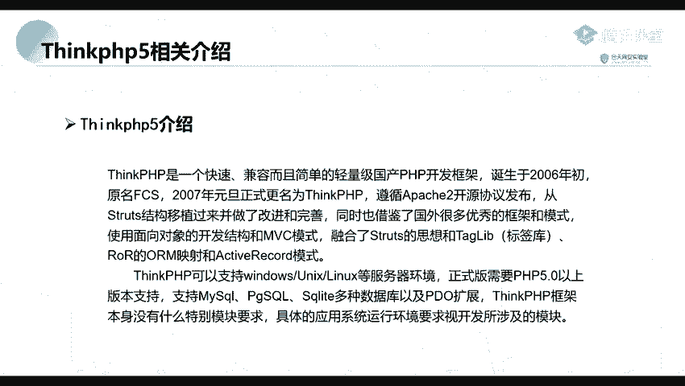
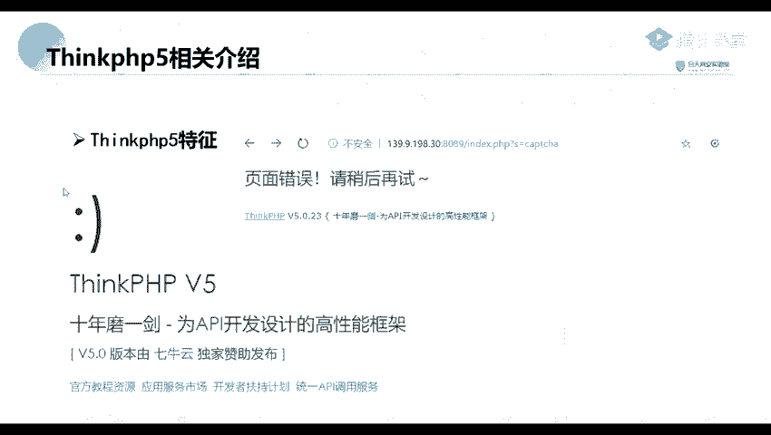
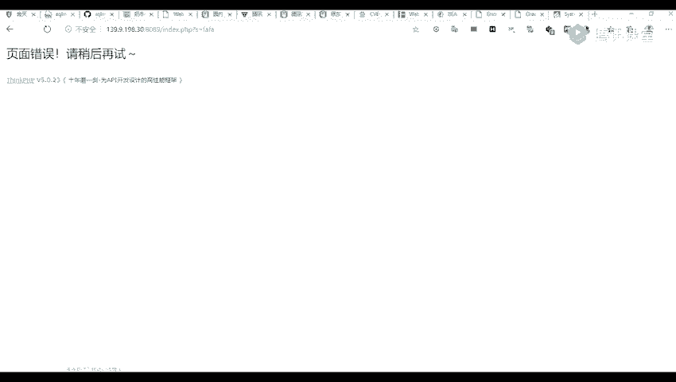
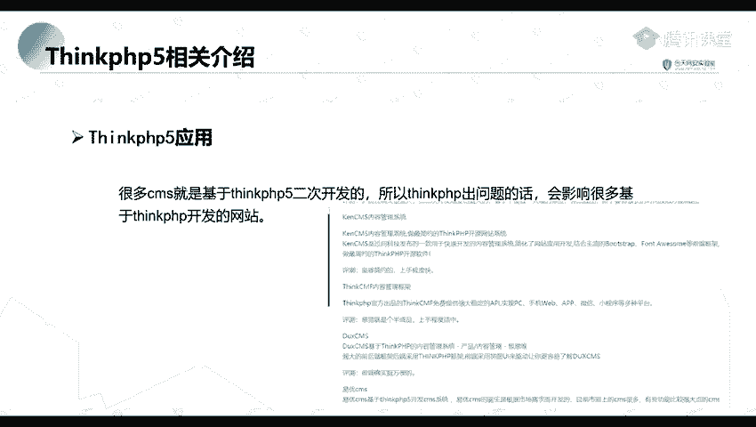
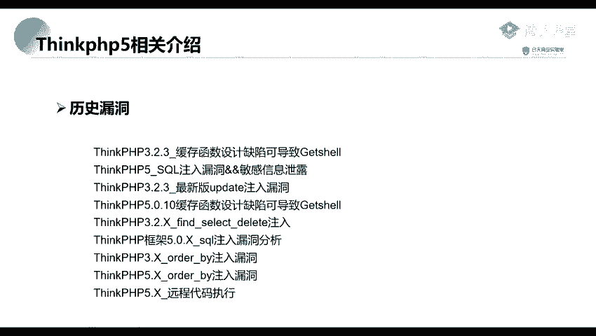
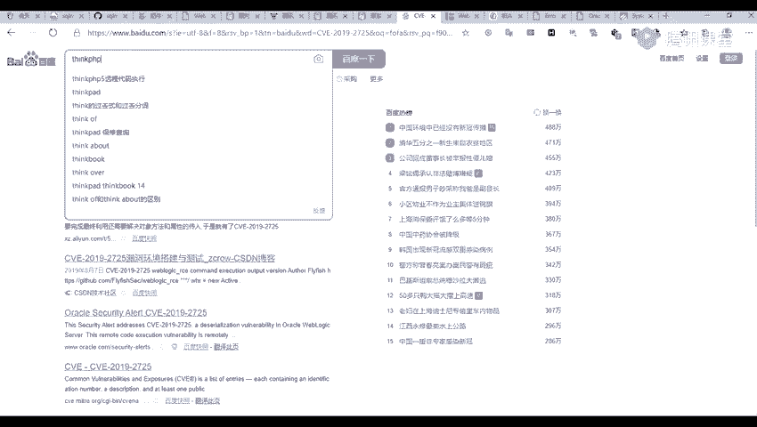
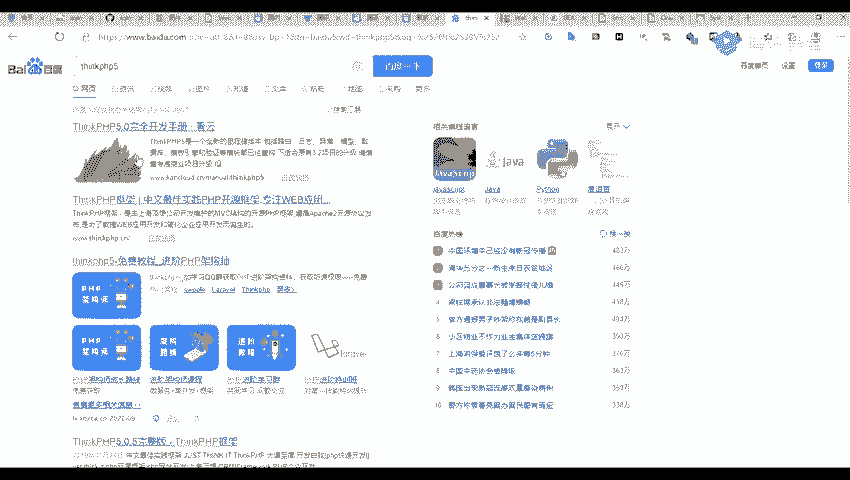
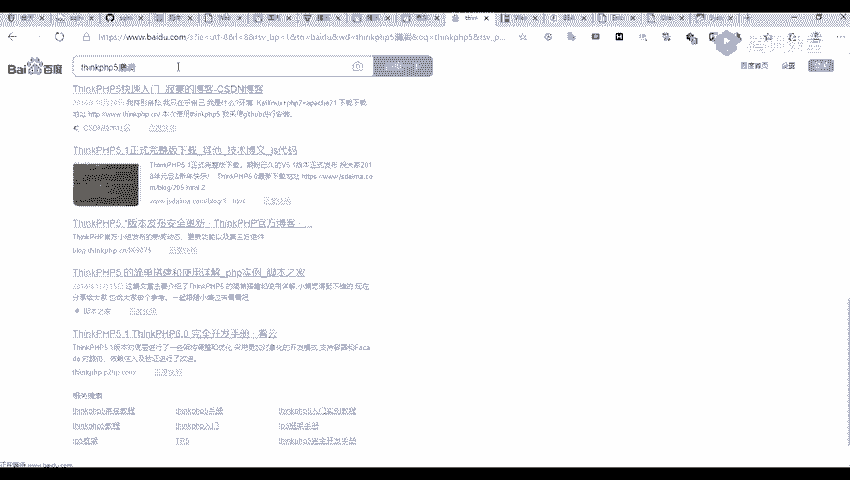
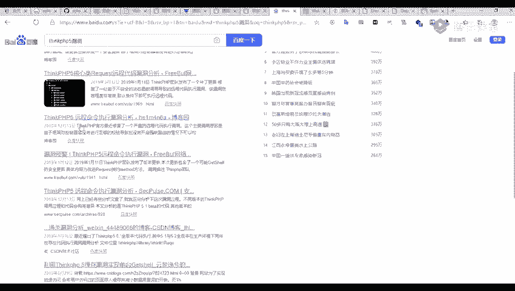
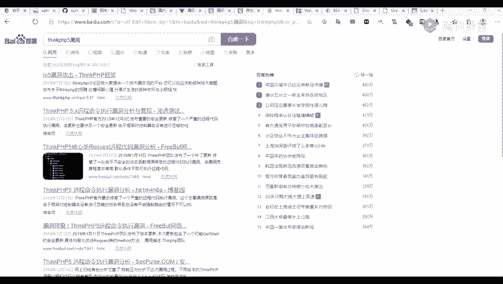

# 2024年最强Kali渗透教程／网络安全／kali破解／web安全／渗透测试／黑客教程 ／代码审计／DDoS攻击／漏洞挖掘／CTF - P40：1_Thinkphp5框架 - 网络安全系统教学合集 - BV1Pe411C7Zb

下面呢我们来点一下这个banknkPHP5。

首先呢我们来看一下这个thinkT的THP。它是一个快速兼容而且清量的一个清。简单的一个精炼国产型国产的1个PHP开发的一个框架。这个呢我就。目前不念了，简单的看一下这个吧。

然呢我们来看一下这个定的PHP它有什么特征。

本身上就是这个它的一个页面。那页面呢我们。能很明显的就是看出来他是一个thinknkPP的一个。

网站的一个页面。比如说我们这里。对，访问一个。比如说我们这里我们可以看到这我们可以很容易的就发现它是一个thinknkPPHP使用的这个框架的一个网站。还有呢就是他的一个页面。

比如说我们随随便输入一个页面。8089。分别啦，呢个。边地。嗯嗯。问号。等。随随便出是我看一下。我们可以看到它的一个错误信息，它的一个错误信息呢。

也也可以看到他的一个它是一个使用一个定的PP开发的一个网站。

那么他那有哪些应用呢？我们很多1个GMS就其实就是基于这个定PPHP进行二次开发的。所以说如果我们一个thinknkPPHP它出现问题的话，就会影响很多基于这个定nkPP开发的一个网站。就是。

就是可以理解为我们前面就是有一个一个主主应用，我们可以理解为是一个主应用，是一个定的PHP。然后上面呢有很多一些子应用。如果说我们一个主应用，就是我们的一个定的PHP出现了一个问题。

就是出现一些漏洞的话，那些子应用就是基于这个定的PHP开发的一些子应用也会。也会受到一个影响。文们具承借呢就是1个KENCMS。一个内容管理系统。以及一个Z的GMF。

你还有1个BU叉CMSEUCMS等等。这些CMS都是基于我们这个thinknkPP进行二次开发的。这个定的PP跟我们前面讲了一个微 logic是一样的，它存在着很多的一个漏洞，就是发生过很多的一个漏洞。

我们对定了一个呢就是一个pinPP5点几的一个远程代码执行的一个漏洞。

这个呢我们在网络上。高一下也能发现很多的一个介绍。

嗯。比如说的一个远程代码漏洞，我看一下这漏洞能不能到大。

我们随便搜一下呢，他也可以去找到很多他的一个相关的一个文章。

