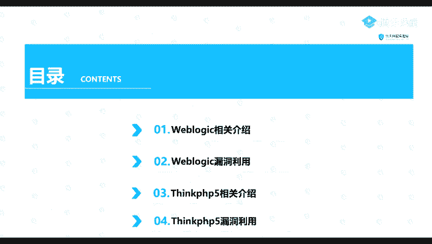
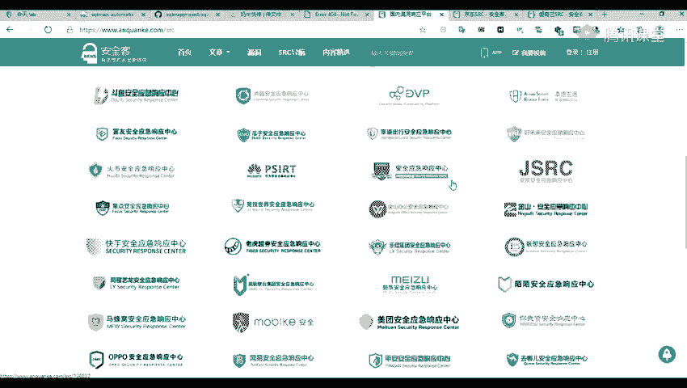
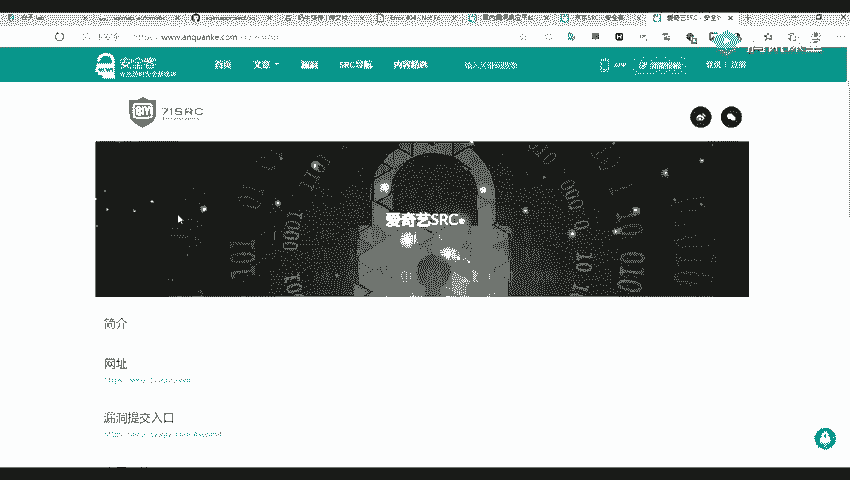
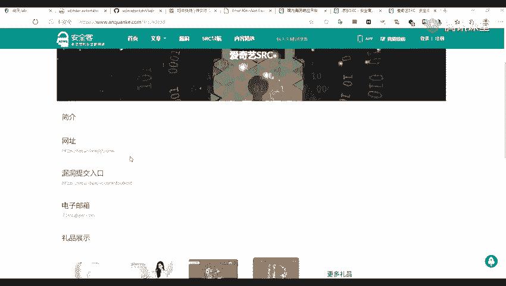
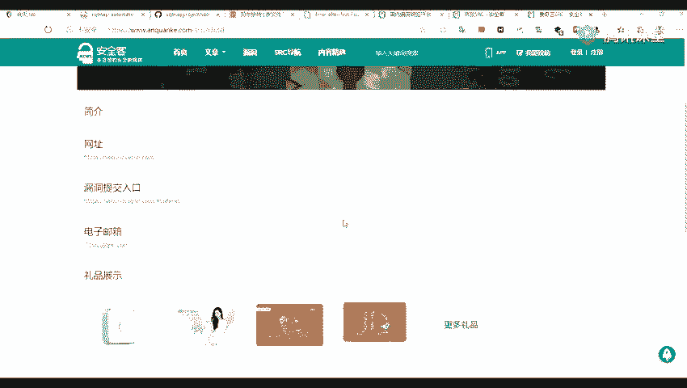
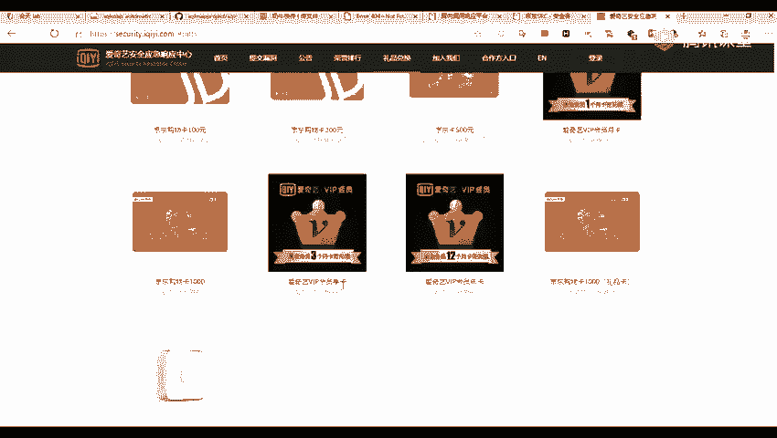
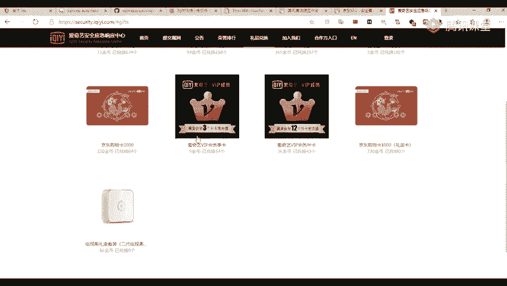
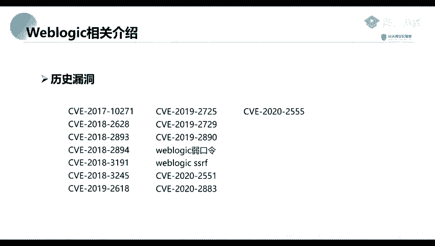

# 2024年最强Kali渗透教程／网络安全／kali破解／web安全／渗透测试／黑客教程 ／代码审计／DDoS攻击／漏洞挖掘／CTF - P42：3_Weblogic框架 - 网络安全系统教学合集 - BV1Pe411C7Zb

这节课呢我给大家讲的是我们的一个。我们比较常见的一个漏洞，vi logic的一个应用里面的一些漏洞，还有一个thinknkPHP里面的一个漏洞。为什么点这个呢？因为我们。在实际上的一个争斗中啊。

我们也会经常会遇到这些漏洞。我们前面呢我们讲了是我们前面那个三节呢都是讲了一个工具。这节呢开始我们就开始讲这一个漏洞。现在就分别对这两个就是应用检一下它存在的一些漏洞以及它的一个利用方法。我们嗯。

先来看一下，我们这里呢分为四个部分，其实也可以说是两个部分来讲。第一个，那就是我们讲一下we logic。他这个维 logic是什么以及单子的一些漏洞的一个利用方法。第二个部分呢。

就是我们点一下我们那个一个定PDP。他是是什么东西，你要用来干什么的，以及他的一个漏洞产生的一个位置，还有一个他的一个利用方法。

我们先来看一下第一部分welog的一个相关介绍。他实际上是美国。ho利考公司出品的一个 applicationserv。就是一个应用服务。确接的说它是一个基于java一的一个架构的一个中间界。

也可以说是一个容器，外包容器。如果说你知道那个阿帕奇及他们caIS，那么你就应该知道。这个微博 logic实际实际呢就是把我们开发的一个java应用程序运行起来，并提供服务的一种程序。

就实际上它是一个中间件，或者说是一个web容器。那么嗯。他有哪些特征呢？首先呢，第一个是端口。端口呢，它是一个开放在7001，就是默认开放在7001端口上面的一个。服务。这70011端口。

你们在前前面讲的一个端口信息收集，应该也也提到过这些部分。第二个特征呢就是一它的一个web界面的一个特征。这是1个L404然后放的一个页面，它是这样子的一个页面。就说我们我这里呢给大家做一个访问。嗯。

啊。看一下是多少刚搞来的。哦七零零一。前前面点了他的一个。它的一个特征就是它的1个7001端口。一个人那就是他的一个外包界面。那个界面呢我们访问这个张口，那默认呢就是这样子的一个就是404的一个界面。

如果我们在一个渗透就或者是一个挖漏洞，就是挖SID的时候，我们看到这种呢就是说明它是一个 logic的一个嗯。中间件。

那么你们前面就是有同学不知道什么是SIRCSIRC呢就是我们一些厂一些那种大的公司啊比较大的公司。比如说比如说一些百度、百度啊、阿里啊、360啊等等的一些。的一些那种大公司。

他们的一个一个应急安全应急响应中心，也就是一个叫做SIRC。原说这里还有经。华为呀、京东啊等等。我们我们的话，你们前面就是收集了一个子域名，就是在应该就是在这里面进行一个搜的。

比如比如说一些爱奇艺或者是一些京京东。以及一些什么我的世界等等。

那你们就是应该就是说集这些SIG的一个使域名。现在我们在平常的时候，就是可以在这里面做一个那个挖洞挖漏洞。

那你们可以把你们所学的一个知识，就是在这在这上面进行做一个练习。

比如说现在在这里呢有一也有一些礼品，分别是一些京东卡或者是其他的一个东西。

好，这这个呢就是它的一个特征，就分别是1个7001的好，已经是04中放的。Yeah。那么我们为什么要讲这个we logic呢？首先呢这个we logic它应用非常的广泛，特别是在我们在内网中啊。

在内网中我们可以可以，你们如果有一些同学是在公司里面的话，应该有也有看到过这些we logic。的一些应用。他应用的非常的广泛。应用广泛呢，而且他然这个漏洞也。非常的多，他的一个历史漏洞非常的多。

比如说门一些常见的，比如说一些CV1201710271，还有一些28942618等等，以及它的一个绕口令。还有今年今年的一些发生的一些漏洞。这里呢都给大家列列起来。这个呢我们只做一个简单的一个介绍。

下面呢我们来讲一下它的一个利用。

