# 2024年最强Kali渗透教程／网络安全／kali破解／web安全／渗透测试／黑客教程 ／代码审计／DDoS攻击／漏洞挖掘／CTF - P44：5_Jboss框架 - 网络安全系统教学合集 - BV1Pe411C7Zb

那么我们怎么去识别？怎么去识别这一个就是使用了这个Jbo的一些网站呢？首先呢他这个Dpo一般的话，它默认呢是开放在1个8080端口上面。它它是使用的是1个HDTB协议。

它的一个默认端口呢是在8080端口上面。并且到了一个访问的一个页面，默认的一个页面，就是这样子的一个页面。

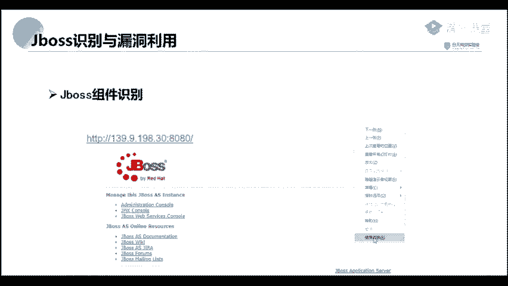

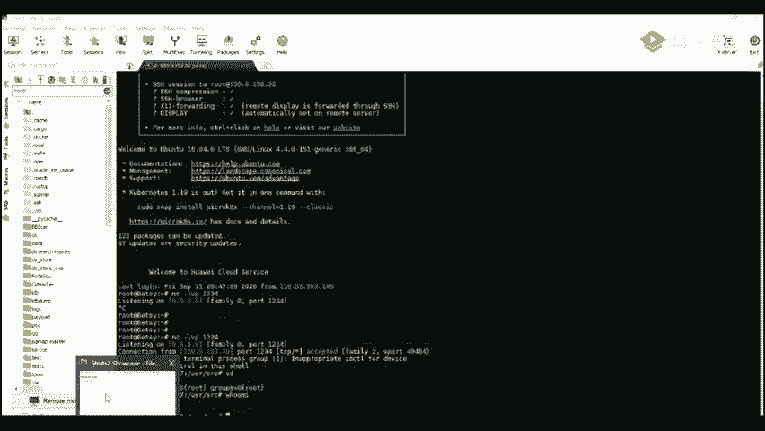

13就是这样子的一个页面。并且我们那个佛法刀应该也能搜到，我看一下。

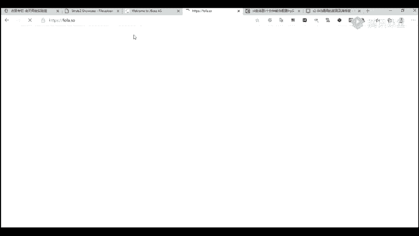

。不。Yeah。哦，比如说这个我看看一下他是。

这我知道。啊，还有另外还有一个就是相当于是这这一种页面。因为我们前面那个是1个66点几版本的，这个呢是1个7版本的，你们也可以就是很很明显的看到他的一个就是网站，他是使用的一个Jbo。

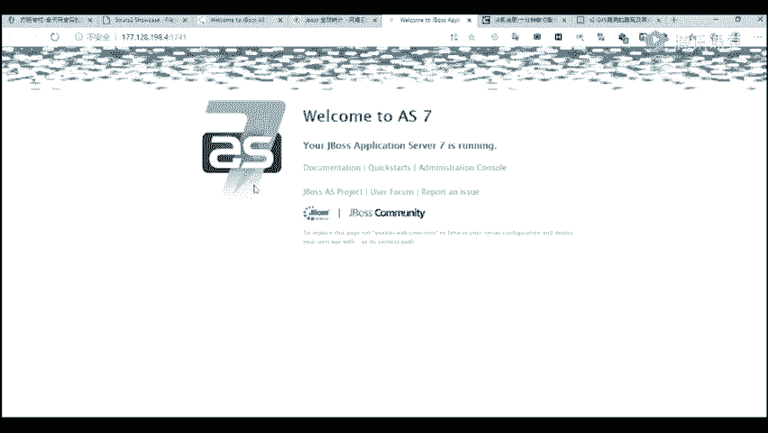

我们再找一下其他的。比了还有这种。

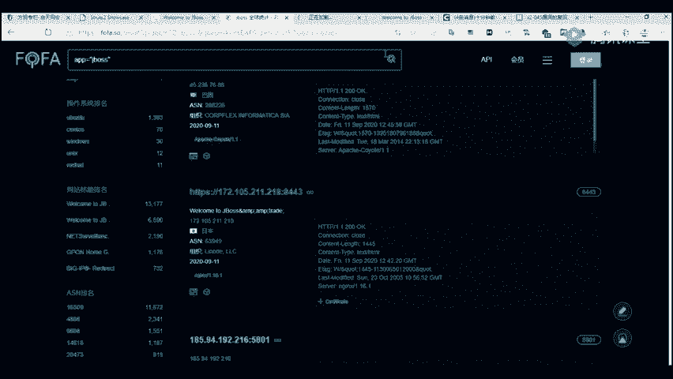

在这里呢我们也可以看到它也是一个Dbo的一个网站。

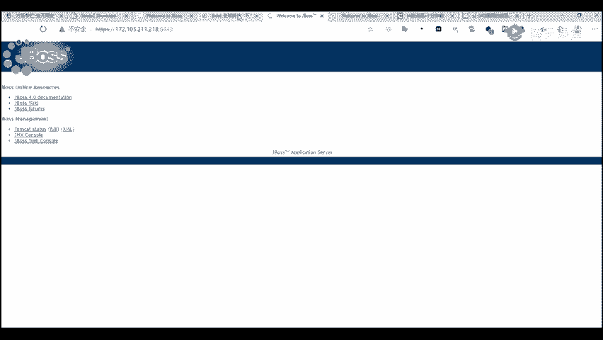

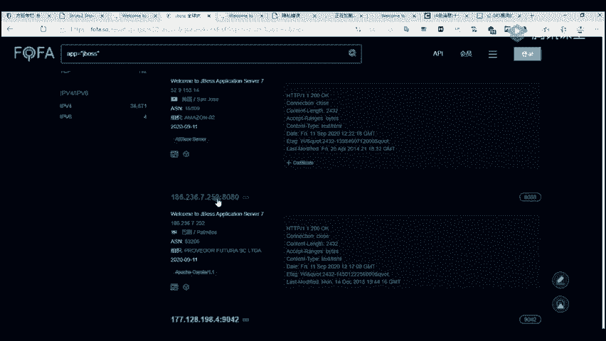

他的一个版本版本不同，它的一个页面可能就有所不同。你们可以看到这这个呢也也是开放在他的1个8080端口上面。

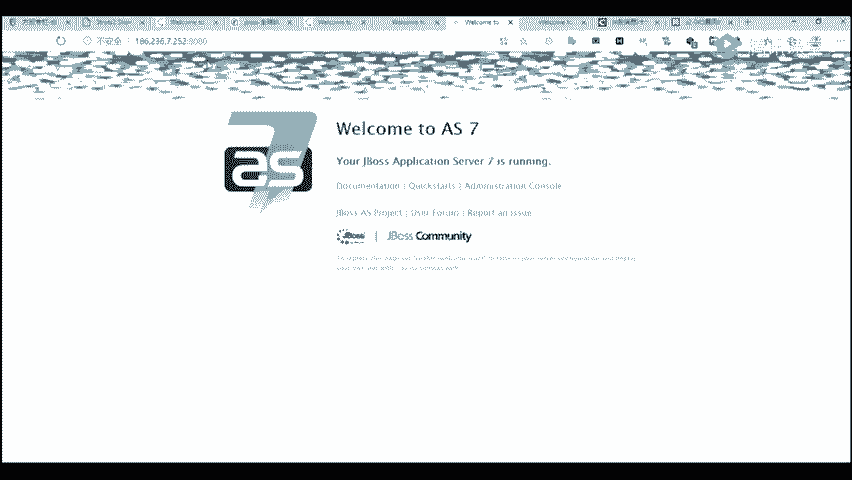

802。

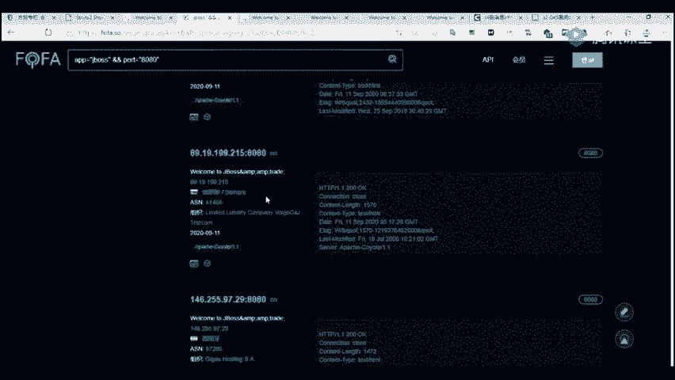

还还有还有这种也是在8080上面的。我们都可以看到，在这里很明显的一个信息就是只用了一个japo这这个图标。嗯，现在我们来看一下就是如何去发现这个漏洞。我们这里呢也使用到了他的一个批量的一个检测的脚本。

我们这个呢我们也是在别他。上面的。好。原来我们这里呢使用这个脚本进对我们的一个网站进行扫描，看看。嗯。现在我们下载下来之后呢，主要有两个文件，第一个是一个tge还有一个tboard点PY嗯。

只需要将我们的一个目标，就是目标放到我们这里就可以了。给我们的一个目标，还有一个端口，就一一行一个一行一个放上去，一样一行的放上去。比说我们这里这样子。让让我们执行一次。没有。

我们这个节盘呢是使用我们的一个python3，python3执行的。你们就是之前有一些同学，你们说就是怎么就是执行完了之后，就是怎么没有反应。

那是因为你们可能那个环境可能是一个pythonpyython2的，就是可能你们直接输入一个python，它可能就是他直接是相当于这这样子，你们注入一个python，可能是类似。是我这样子的一个输出。

可能是你们可能是一些是2。7。4或者是3点几的一个版本。因们如果说你们输入的话，有。我这里呢因为我配置的话，就是将它的一个命名为一个2，就是python2。所以呢我这里呢使用的一个pyython。

就是一个Pthon2。要不我还有一个三版本的，就是一个Pthon3。怎么我这里给你们点一下吧，就是在这里进行一个修改。比如说我这里呢安装了几个pyython版本，对吧？比如说我这里有一个。

iphone33。7的。现在我这里我们这里呢可以看到我这里它的这个命名python，这个命名为是一个pythonpython3的。所以呢我这里执行命令的话，我这里呢执行一个pyython3的话。

它就是一个python3。7的。

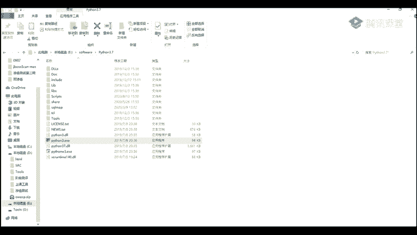

Yeah。还有呢我这里呢还有一个就是。

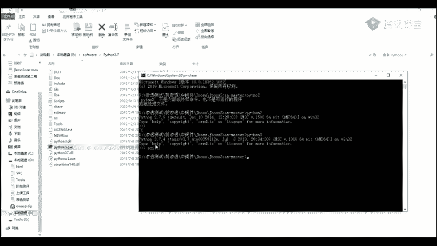

python比如说我这里有一个python3。8的对吧？现样呢我这里他的一个命名是拍粉38，对以呢我这里输有一个拍粉38。

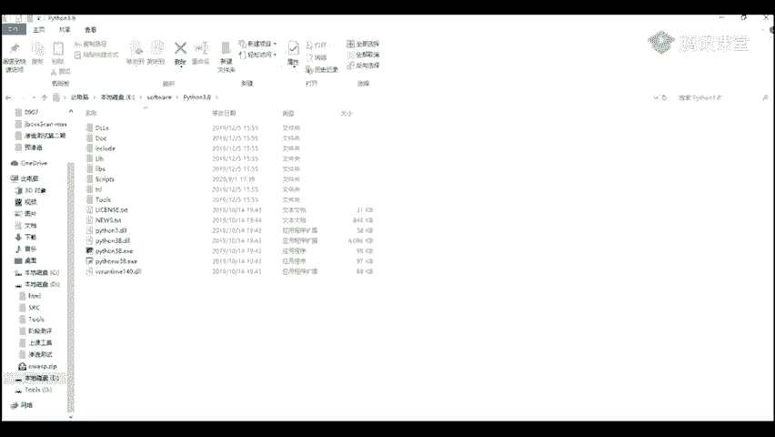

那呢他这个环境呢就是一个python3。8的。如果说你们输入输出就是输入就拍on或者是拍on2拍on3没有输出的话，那么一个是你们没有安装。第二个呢，就是你们那个命名就是没有命命名成这样子。好呀。

那我这里。这里是一个。这用一个拍遣三案的一个。牙板。呢个。要回车。回托之后呢，他这里呢就给我们做一个检测。

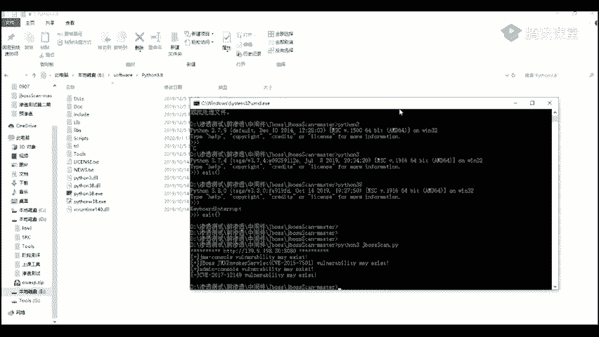

那第一个呢就是检测到了这个。边加的一个控制台就是。说他可能存在一个漏洞。那第二个呢，就是他的1个CV120157501的一个漏洞，也是可能存在的。第三个呢就是一个是就是一个儿童秘康手，他的一个漏洞。

那这里呢也是可能存在的第四就是1个CVE201712149。

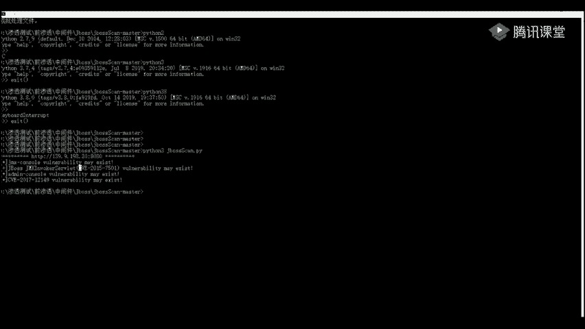

现在我们这个呢是一个B量的。那么如果是一个单个的话呢，那怎么去进行一个判断呢？就是我们访问我们的这个UIL就是这个UIL就是在我们的IP后面加上这这一部分的一个内容。

就在我们这一部分后面加上这一个的内容。那如果我们访问之后，如果说他的一个状态码就是500。如果说他的一个状态嘛显示为500呢，那就说明他是很可能会存在这一个漏洞的。嗯。

然呢我们来看一下他的漏漏洞的一个概述。但是由于是一个java环境的话的一个错误类型，存在于Dbo的1个HTTPmo的一个。组件中的一个过滤器中，就是我们刚刚的访问的这个UIL。李窝口。

那那这个个漏洞呢也会就是导致了一个。命令执行，也就是可以去对我们的整一个服务器就get excel的。那么我们怎么去get下呢？我这边呢是直接使用一个表本，就是直接使用一个脚本来进行一个反弹效。哦。

我们脚本是地址地址呢是在这里。这个呢就是我们的一个表本的地址。那他使用呢也是比较简单的。看一下，然后直接呃我进入到我们我的那一个目录片。

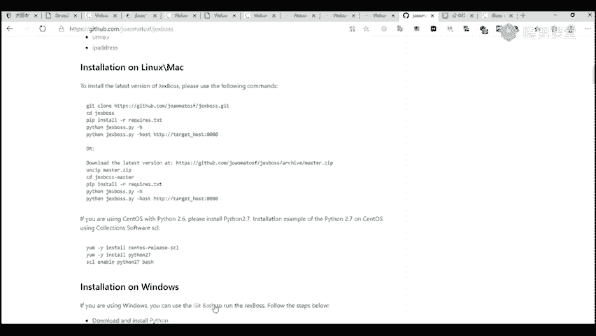

我们这里呢先进行NDC1个端口。现在鉴定一个端口，我们这里这里呢是前面鉴定的一个端口，我们先进行退出。我这里查了。我说怎么保安连不上了？哦，在里连上啊。首先呢我们这里也是NC1个端口要LEP。

11234，我们这里呢是监钉1234砖头。那之后呢，我们执行我们的脚本。

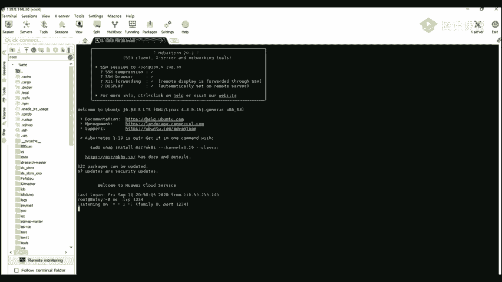

啊，这个脚本执行我们的脚款。那么在我们的路径上打开的他的1个CMD。

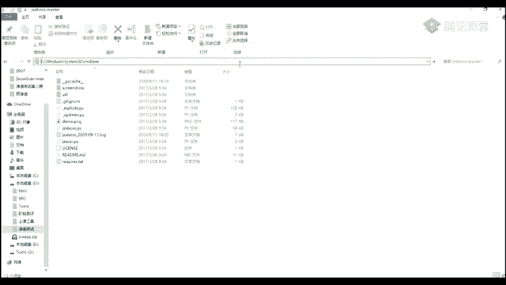

要直接拍拍展。我这里是一个潘成乐的。要拍展。要第。之后呢加上我们的一个杠杠号杠就是看一下杠号，我看一下是号还是杠杠号。

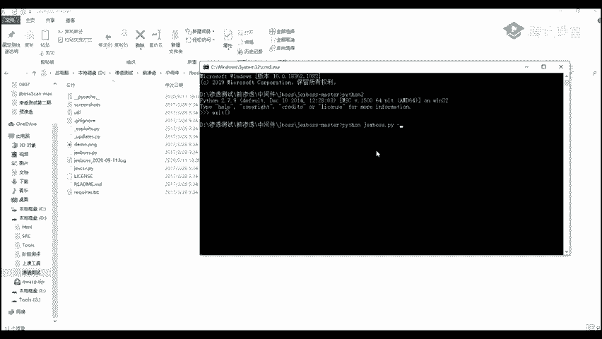

哦，杠号是啊，也要加上我们的我们的1个IP。

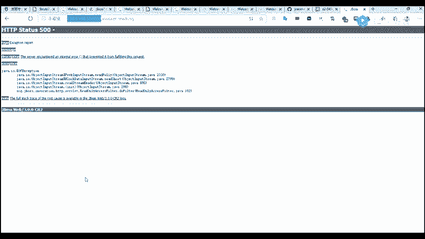

对我们的1个URL。叫我们回收一下。嗯，我我这里找了一个那个你们之前就是有些同学就执行完之后，他没有任何的一个显示。就是因为你们那个环境就是没有。比如说你们有些同学是一个Pon三的。

潘审三的然后执执行完之后，这里呢是一个拍审三案的。执行完之后，他并没有任何的一个显示，就说明你。没有那个环境或者是那个环境被料是没有配好。对呢是一个拍thon2，然后KEX。再加上我们的一个house。

加上我们再加上我们的1个URL。要回车。嗯。

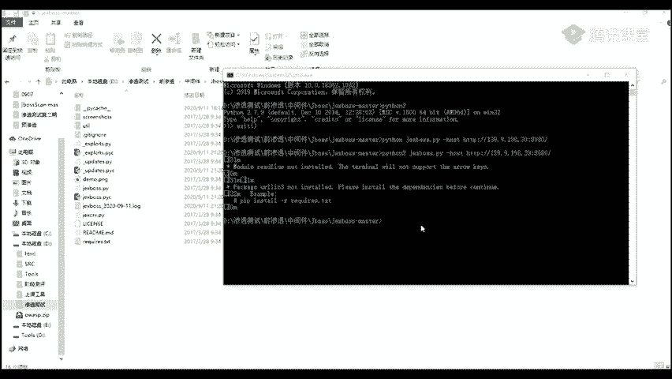

你是三的吗？我看一下。

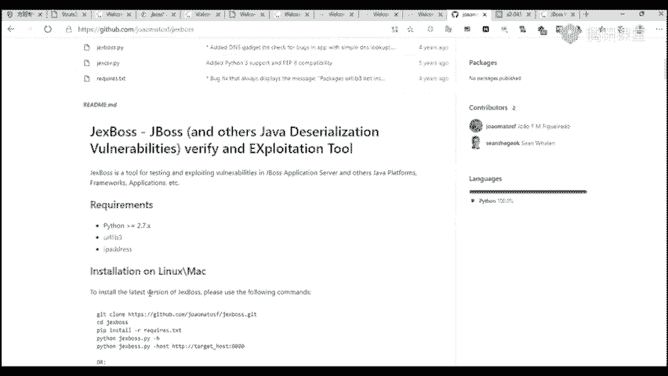

我这里不用我这里不用三吧。回车之后，他就会进行一个检测。这个脚本呢还是比较方便的，那我们可以直接输在这里输入我们的这1个IP跟端口就可以。将他的一个拜部给反还回来。那我们这里呢做一个y。y之后呢。

他就会攻击我们这这一台服务器就是139。9。198。30这一台服务器。那我们等等待他进行攻击。好然后呢，我们在这里呢来询问询问我们就是让我们输入1个IP就是一个远远程地址的IP。

也就是我们的一个公网公网的1个IP139。9。198。30。就这个IP呢就是我们就是接收接收下的1个IP。

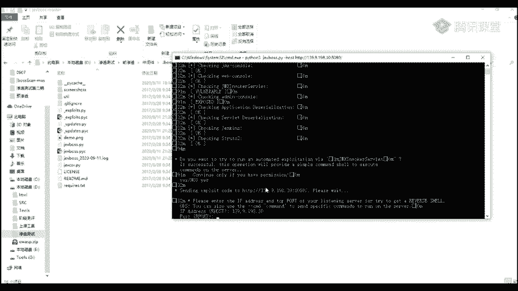

要端口就是1234，也就是我们这里建订了1个1234端口。

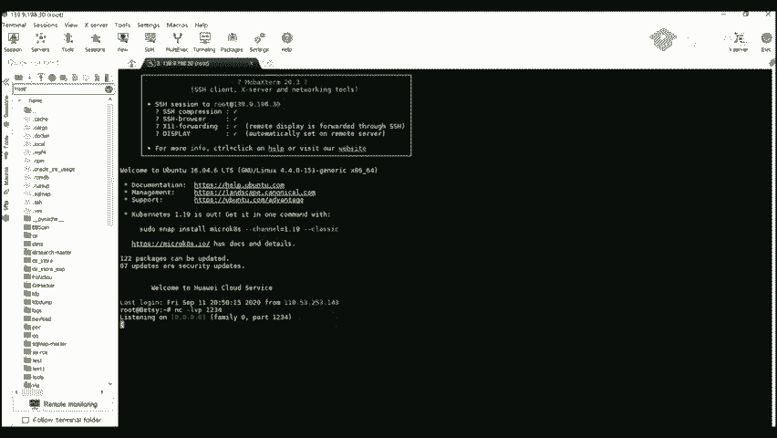

好，在这里呢就会将他的一个败纸给反弹到了这里。

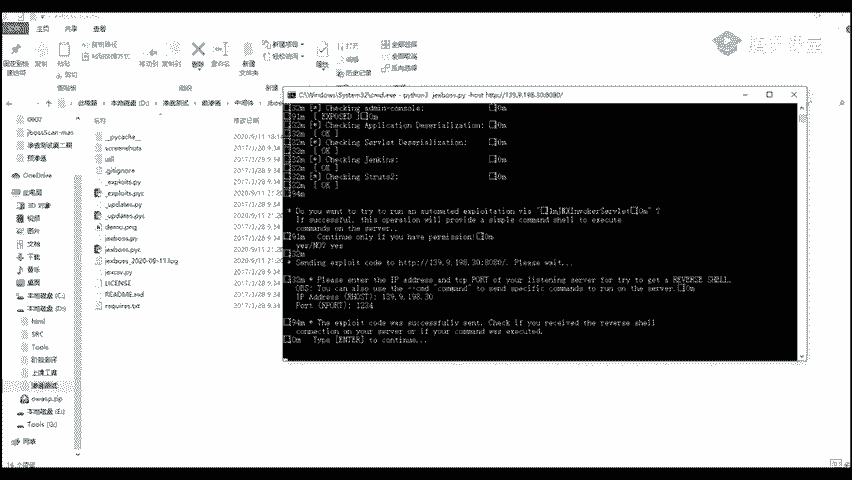

哎，没有成功吗。

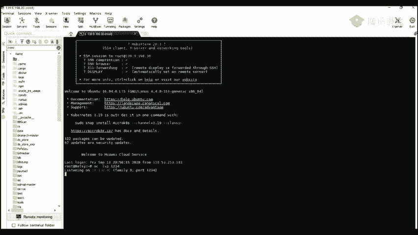

再看一下。

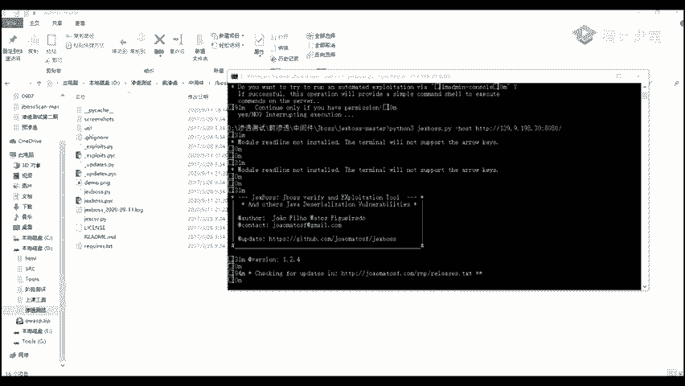

嗯，对。1234。

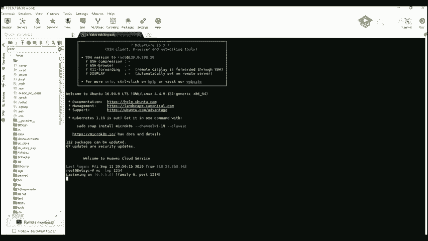

在这里报错了，但是连接连接不到我们。的一个机器。

这里看一下。应该。

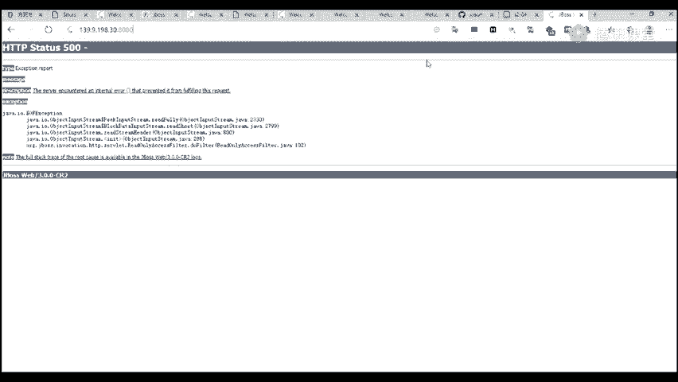

重新执行一下好吧，看一次。3。刚后我们在这里在这里出现一个错误了。Hq公 c。

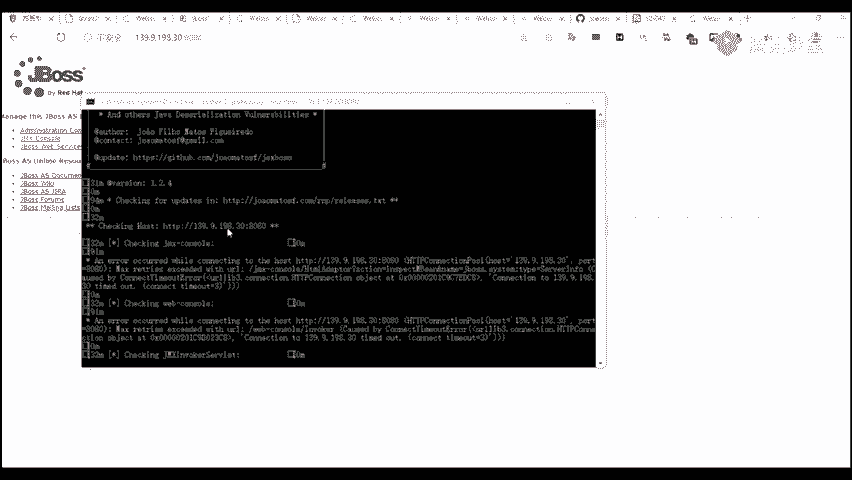

这个站可能是打崩了吧，我看一下。八零八零。

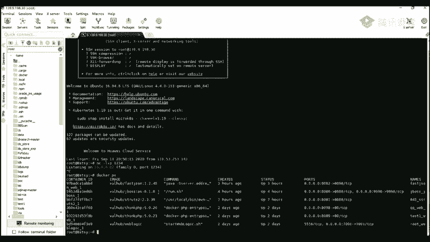

503。我这个账给打封了。

Okay。

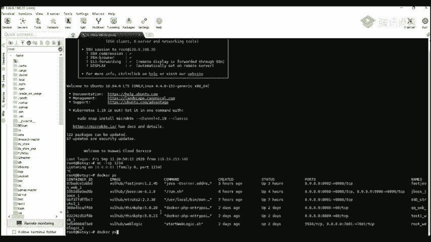

啊。要是不行的话，我们在这里呢就先跳过。嗯。然后139。我们这里等等待一下。首先。先一个章号。小啲。啊，这里嗯。这里打打不成功啊，我们这里先跳过吧，它里面的服务应该有问题。那么我们这里呢就先跳过啊。

我们开始下一节课的一个就是下一部分的一个内容。这个网网站封了啊。

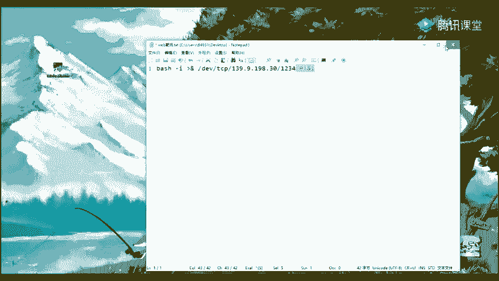