# 2024年最强Kali渗透教程／网络安全／kali破解／web安全／渗透测试／黑客教程 ／代码审计／DDoS攻击／漏洞挖掘／CTF - P4：3.kali_metasploit使用规则 - 网络安全系统教学合集 - BV1Pe411C7Zb

OK我们下面呢来看一下到底怎么攻击。在攻击之前呢，我先带领大家了解一个耳熟能详，众所周知的漏洞，就是这个永恒之南漏洞。那这个漏洞是啥呢？我是布置了百度百科的一个解释，永恒之蓝。

即使大家没有接触过网络安全这个新闻或者是微博或者是贴吧抖音，大家应该玩过吧。可能17年的时候，抖音还没有那么火啊。就17年的时候，微软就是windows的操作系统，爆出了一个非常重大的漏洞。

这个漏洞呢叫做永恒之蓝，所有的当时所有的windows操作系统都有这个漏洞。那这个漏洞呢是被这个境外的黑客组织制作了这个勒索病毒啊，导致了我们国内很多的学校以及政府机构，还有公司都中招了啊。

你要支付比特币才能够解密这些文件。啊，这个漏洞啊大家大部分都听说过，为什么讲这么烂了，我还要去讲它呢？因为这个漏洞是在当下你学习mat split所必须要经历的一个漏洞。啊，我们来看这个界面。

大家应该都见过啊，没有同学不知道吧，这个东西。啊，不知道的话，你就要经常关注网络啊，我们学习IT肯定要关注这个啊实际的这个漏洞，以及实际的这个病毒，它怎么传播的。OK那我们下面呢来实际攻击一下。

如果你的电脑是在17年之前，并且没有安装任何补丁，那很抱歉，你就有这个漏洞。这些漏洞呢是存在于windows10的早期版本，win8、win7这些操作系统是都有的。啊，我们来看，首先是使用模块。

使用模块呢就是use加上模块的名称啊，这后面是模块的名称。哎，有同学呢可能听不懂是吧？呃，这个没有关系，我可以保证大家能听懂。如果你听不懂，可能就是英语看不懂哎，没关系，这个use都能看懂吗？

这个使用是吧？

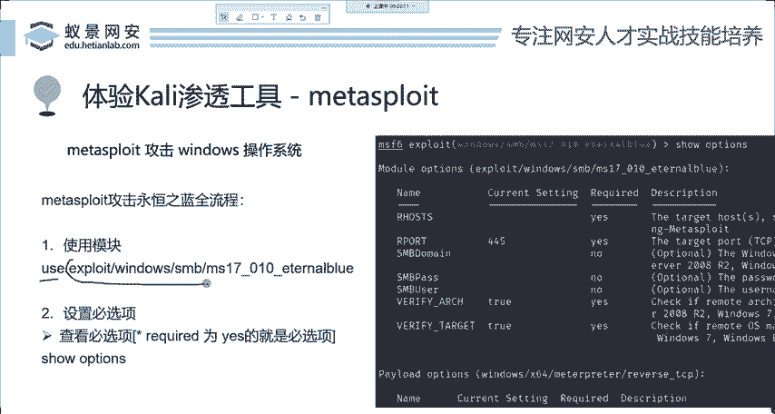

就使用这个模块，哪个模块呢？explloode攻击windows就攻击windowsSMBSMB啊是个服务，这个SMB的漏洞，就是它这个没有什么可犹豫的。然后是MS17010，这个是微软官方给他的编号。

代表17年的第10号漏洞。然后internal blue这是什么意思？internal持久的永恒的blue蓝色的永恒之蓝啊，就是这个意思。那如果你不知道的话。

也可以去搜索一下internal blue啊，也能够出来。那我们直接的去使用这样一个模块。好，使用完成之后呢，我们第一步就做好了，就是使用模块。使用模块之后，下下面一步叫做配置模块的B选项。

那在正确配置之前呢，首先我们就要去查看它有哪些B选项供我们配置，这查看呢就是查看设置是什么意思？how optionstions查看是吧？options设置配置的意思。

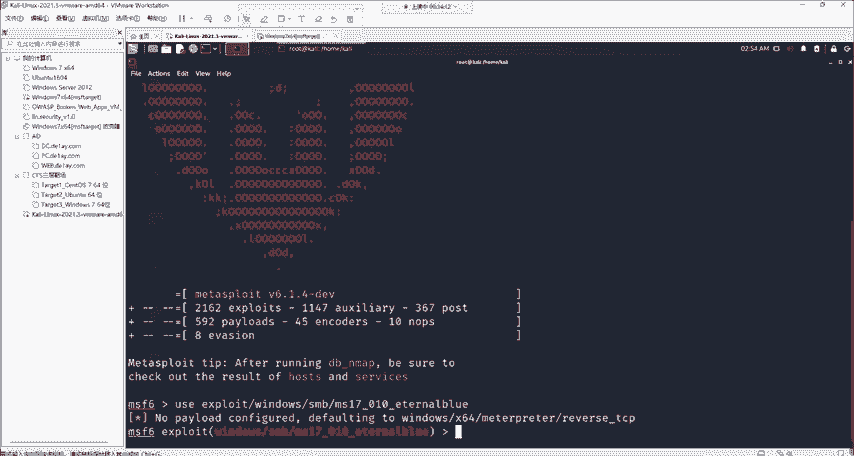

啊，都是最简单的英语，我们可以直接在这边敲。

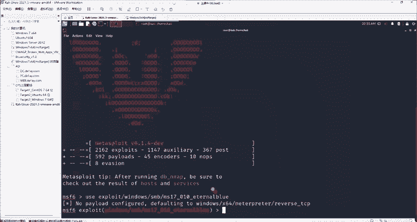

show options啊，在这个地方呢，我们就能看到它的一些配置了。在配置上required为y的这个地方，它就是B选项。如果这个地方为yes，你看这个地方是空的是吧？

这个 current setting是当前设置，它这个地方没有，那我们就需要对这一个选项进行一个设置操作才行。如果他是no，就是它不可选，就是你是可选才这个可选配置下，那你就随便啊，想配置就配置。

不想配置也无妨也无妨。那么下面呢就来具体讲一下它的配置项。首先。

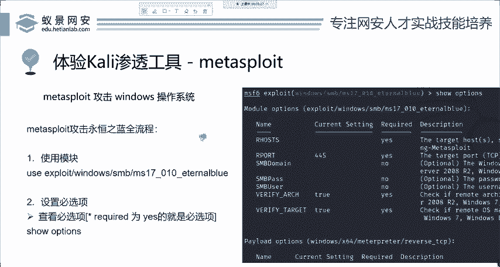

第一个配置下。Rco刚刚已经看到过了。这R后是什么意思呢？哎，大家呢在使用matta split的时候，一定要注意，在每一个配置项后面都有一个叫做description描述信息，就是告诉你它是什么东西。

我们可以清楚的看到这里是目标的地址，就是说你想打谁。你想打张三还是李四？是他们的电脑吗？就是你想打谁。打税是怎么设置？我们在周一的课程中讲过IEP地址是在互联网中的唯一标识。

所以说这里肯定是设置目标的IP地址，就是你要攻击谁。那我来攻击我攻击这个1。128。哎，这是我自己开的一台呃在内网里的机器啊并不会攻击互联网。如果攻击互联网的话，那这个是属于违法行为。

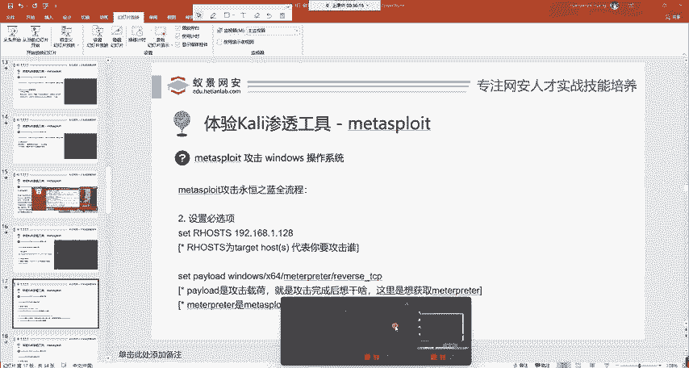

如果没有得到授权去攻击的话，怎么设置？怎么设置啊，设置的英语set那are host记住大小写不敏感，就是你想写大写就写大写，想写小写就写小写。

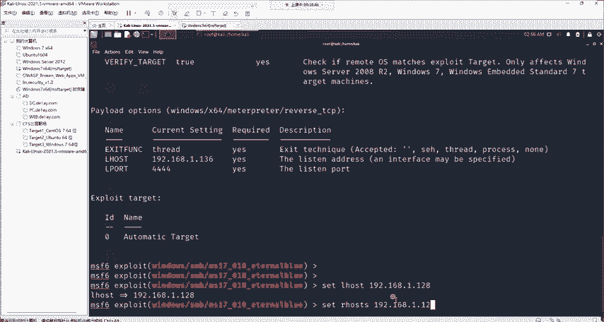

配置一下，我们再看一下设置。你看这边已经配置好了，然后还有哪几个选项呢？我先给看着PPT呢给大家过一遍。首先一个选项叫拍load攻击仔和。弓箭彩和对于刚入门的同学可能不是太了解。

攻击宰荷的意思就是我攻击完成之后想干什么事情。我想给他关机，想给他增添一个用户，这都属于攻击载盒。那这里呢我是想干什么？我想获取mattterpre啊，这又遇到了一个新的名词，mattterpre。

那matpre它是什么？它是mat split官方起的一个名词，它是它的后渗透神器。如果你在这里不清楚的话，没有关系。我们马上讲到啊，大家就迎刃而解，自然就理解了。OK我们下面继续来看。

才做拍漏那这里呢我就不去做设置，为什么不设置呢？我们仔细看一下。看一下他前面告诉我们的。叫做defating默认的piload的是它。就是在mat里边，它已经把默认的拍漏的把帮我们设置好了。

所以说我们就不需要再做多余的操作。那下面呢我们就直接呢来去设置其他的哎设置其他的打开看。🎼下面一个IL host。这个L host的呢跟L host看起来比较像，但是完全不一样。

这个L host我们通过描述信息能够知道它是代表laon host，就是监听的地址。这个监听地址呢就是代表你是谁。你是卡里的IP地址，就是卡里的IP地址，就代表你是谁？我是卡里，我就是啊卡里的地址。

那所以说呢我们就直接设置成卡里的IP地址就行。那在mat split里面呢，也会自己的帮你设置，也会自己的帮你设置。我们同样也可以输入IF configurefi看一下啊，我这里是136。

所以说我们设置一下set air host。136设置好啊，这就成功了，这就已经成功了。那如果说这个set我不知道是什么意思，那这个没办法，s就是设置的意思。就是设置的意思。那。

然后下面呢我们还剩一个B选项叫做airport。port意思为端口elport呢elport呢意思为laon port就是监听的端口，它代表你要在卡利上面开启的端口。那这个端口呢是1到65535。

6万多个端口随便你选。但是呢你选择的这个端口不能被占用。就是这6万多个端口啊，你随便选一个就行。那有同学说啊，我非要选一，我非要选2，不推荐大家这样。因为这些端口很有可能被系统服务所占用，6万多个端口。

你就选大点，那不行吗？是吧？你非得选这个1234。好，我们来看下面配置这样一个airports。我就选12345。我就选12345，配置完成之后。我们来看是不是O了。是不是都配置好了。

来看一下这个叶s里面还有哪一个没配置的配置配置。是不是都有都有了，还怎么办？是不是来到了第三步？使用模块不是不是第三步，运行模块，运行模块就一个单词。就是运行跑run啊RUN就这三个字母。来看。

你输入入网之后，它就能够对这一台机器进行一个自动的永恒之南攻击。我先明确告诉大家啊，那17B10我们可以看到，只要这样几步简单的操作，5分钟不要你熟练的话，就两分钟就可以对这一台机器进行攻击。

那有同学说就微软啊也太垃圾了，不是微软垃圾，而是mat split，它比较强。这个漏洞啊，你分析起来还是非常困难的啊，它并不是就是你如果没有mat split，你想打这个漏洞。

我可以明确告诉你是非常困难的，是非常困难的。就是我们一般都是用这个工具去打。打完之后我们来看一下它有个叫做成功 win的一个选项。那在这里呢我们就来到了matpre的这个界面。

那这个界面能够做什么事情呢。哎，我们首先回顾一下，好吧，回顾一下这个。

特别简单，就几步使用模块配置B选项。

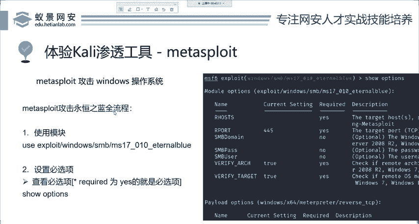

然后。跑起来。运行起来RUN run就能够去成功的攻击这样一个复杂的漏洞。那在攻击成功之后，我们能够做什么呢？你可以看到呢这个命令好是来到了matepre的一个界面中。那首先呢matepre它是我们。

强大的一个后渗透模块。什么叫后渗透？就是你攻击成功之后，你想干啥？就是这个意思。你想干啥？你想干什么干什么，只要权限允许。远程控制命令执行、摄像头监控、密码获取、创建用户篡改系统等等，把它关机重启。

你想做什么就做什么。这些看起来就是如果你没有mat split，也是明确告诉你，你现在就比如说现在让你打开摄像头，我就告诉你这个操作你根本就没有办法去进行。而mattterpre却让这一切变得非常简单。

也是只需要简单几个字母就能够完成这些自动化的攻击。那我们下面呢先举一个简单的例子来给大家了解一下，就是创建后门用户并开启远程链接。那这个命令呢是利用了miccroprint里面的命令。

以及windows的 command的指令，两个相结合打出的一套组合权。OK我们下面来给大家演示一下。

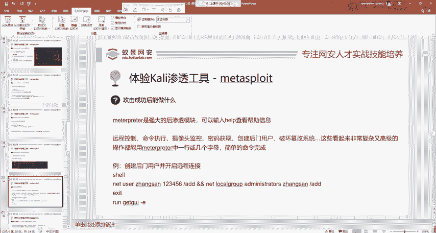

那在这边呢，我们首先你可以输入好，在这边大家不会用的话，没关系。mow split它非常人性化。你在哪个地方不会用，都可以简单输入一个单词叫做help。help之后呢，他就会告诉你。

像当前你所处环境的帮助文档。那当然没有办法，这些帮助文档肯定都是英语的，这个是没有办法避免的。因为他们没有必好对这这个地方进行翻译。我们可以简单的去看一下这些英语，也不是特别难呀，也不是特别难。

那我们下面呢来利用这四个命令来去攻击来去攻击。首先shall。你输入shale之后，你会发现你进入到的是什么？

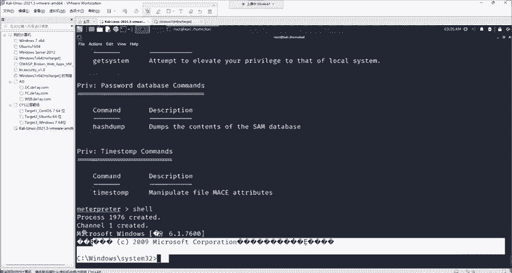

是不是就是windows加R的这个CMD。

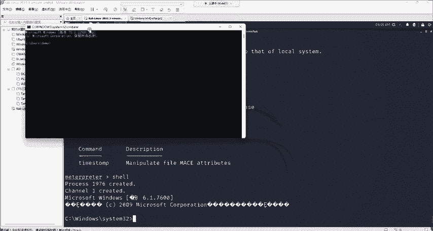

是不是就是这个。那进入的你要清楚，你现在进入的CMD是受害者他的CMD。就你已经控制他的命令行了。你都拿到他的命令命令行了，你不想做什么做什么呃，关机重启，随便你。那我们这里呢去添加一个用户啊。

添加个用户，这里我就直接复制过来。这条命令呢就是windows添加用户的命令，我添加一个名为张三，密码为123456的管理员用户。

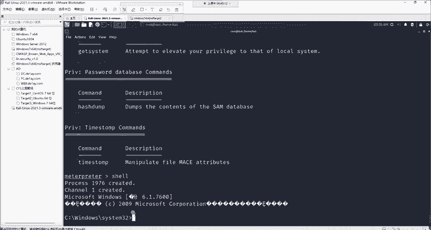

这个操作叫做添加后门用户啊，我们直接粘贴过来。

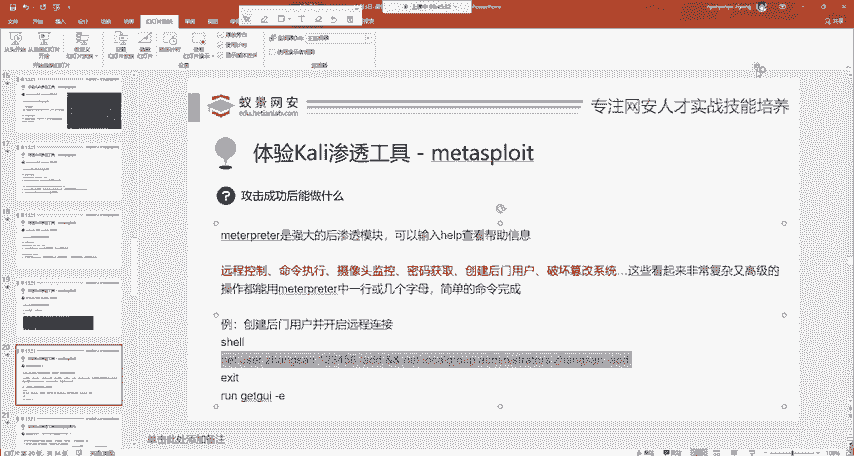

我们运行之后，哎，这个张三用户啊就已经添加上去了。添加上去之后，我们现在来去退出一下，就是east退出。退到我们的matetterprint中，现在我想做一个操作，就是想远程连接我的把机。

我想连他的电脑，看一下他在搞什么鬼。我想连连他的电脑，这种候怎么办？有同学啊他去网上去搜windows开启远程连接的方法，你会发现呢他是让你更改注册表，其实这些都是属于二次造轮子的操作。

我们man split，它这么强大，难道没有为你考虑这一点吗？肯定有考虑，所以说只需要简单10个字母就能够实现一样的功能。就是run get GUI。杠一给大家解释一下run运行get GUI。

GURE的意思为图形化界面，就是我们获取目标的图形化界面，杠E叫做enable开启，就是开启目标的远程桌面连接服务。

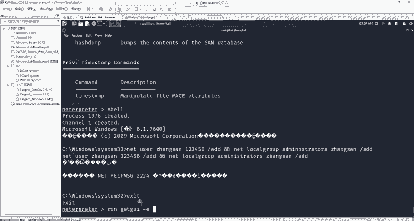

那么回车。直接就能开到啊，你不需要再什么去操作注册表，再去干什么，完全不需要一条命令就能开。开完之后啊，你现在就能够连接啊这个电脑了，我给大家演示一下。我们在windows中打开远程桌面连接。

连接受害机。受害机的地址呢是192。168。121。128，就是刚刚我们攻击的这个机器。然后我们点击连接输入张三的密码。张三的密码是我们自己设置的，你难道还能不知道吗？是吧？123456点击确定。

点击是。哎，我们呢就可以去连接到目标的机器。连接到目标的机器。大家可以看到，一会儿啊等待30秒就能够连接到它了。但是这个操作我来给大家讲，在真实的渗透测试中，就是我们工作中是一般是不会去使用的。

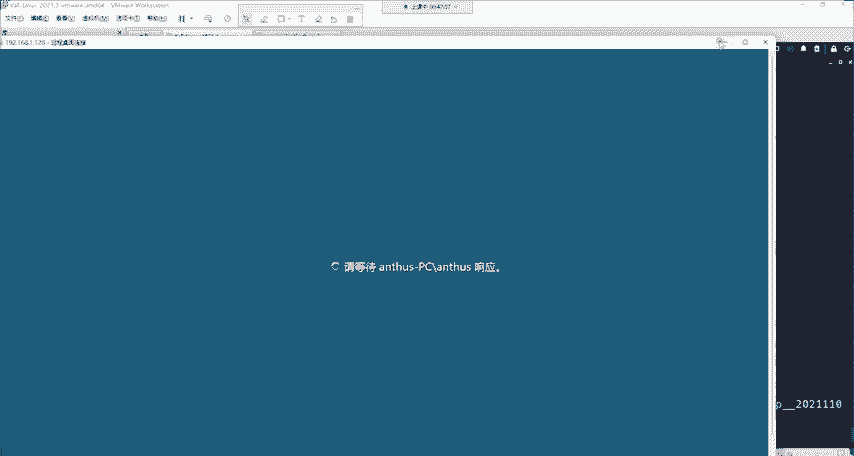

因为它有一个缺点，就是windows啊这个操作系统它是只允许一个用户同时登录的。也就是说呢，你现在登录张三原本的那个用户啊，它就会被顶掉。顶掉会有什么后果？你是不是就被别人发现了？比如说你打你的室友。

然后你把别人顶掉了。你室友一看，哎，这个张三啊把我顶掉了。你不就被发现了吗？然后赢得一顿爆锤是吧？所以说呢这个地方不推荐。

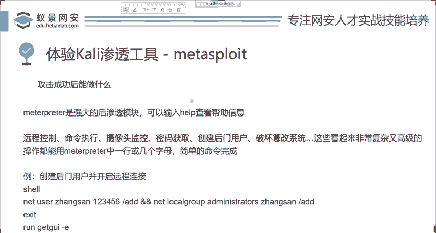

好，我们就讲到这里。