# 2024年最强Kali渗透教程／网络安全／kali破解／web安全／渗透测试／黑客教程 ／代码审计／DDoS攻击／漏洞挖掘／CTF - P51：12_Shiro反序列化漏洞发现和识别 - 网络安全系统教学合集 - BV1Pe411C7Zb

那么嗯。我们怎么去发现这个？漏就是这一个组件或者说是框架，就是哪一些网站去使用了呢？一个就是我们前面所说的，就是一个记住密码的一个功能。能这里呢做一下演示。我们这里呢是举个例子啊。

比如说我们这里有一个网站嘛，对吧？139。给我看一下是哪哦，对，就这一个。嗯。比如说我们有一个网站，就是我们访问网站的时候，对吧？然后呢，我们进行一个登录，登录的时候，就是它有一个登录框，对吧？

一个登录表单，然后然后下面呢，它可能会有一个选项，就是让我们去记住记住它的一个密码。也就是记住密码的话，那么我们下次登录，可能就再次登录就不会再使用这个密码进行登录了，就不会不用再输入这个密码。

就说像这种他有一个man me的一个功能，就是这种网站呢就可能很可能是使用了这个框架嗯。第二个就是他的一个返回包那里就是我们在抓包，就是我们登录一个网站进行抓包的时候，也要进行一个重放。

就是我们将我们抓到的包放到我们的一个repeat那一个模块里面。然后呢，我们。就是发送银的，如果他的一个返回包。就是那个thatck that那里它显示了这个re me等于deele me。

这里就是有存在了这个字段，那么就说明了这个网站使用了这个chel的一个组件。我们这里呢可以给大家看一下。啊，比如说我们这里一个网站对吧？然后呢，我们进行一个抓包。我们先开启这个代理。

应开你代理要进行抓包。我这里呢已经嗯。我搬到这边来。啊，这个就是我的一个要我们重新访问一下。比如说我们随意随意进行一个登录吧，我们这个随意进行一个登录。登录之后他这里。他在这个包子里。

我们可以将我们将抓到的这个包在黑里这里将我们的一个历史包然后发送到我们这个repi模块里面。然来我们endend的就是发送。发送这个请求之后，我们在这里在他的返回包这里。

我们可以看到有一个在 cookie这里。他有一个字段，就是0方等于这类 me这里。如果说他显示的这个的话，就说明是使用了这个。酒店或者说是一个框架，就是我们这个地方。这个呢是比较容易识别的。

然后我们来看一下第二个。就是我们有有时候我们的一个服务器并不会主动返回我们这个member me的这个。这个字段就是也就也就是说我们有时候我们的一个服务，就是我们的一个包。

这里呢可能没有没有返回这一个字段。那么我们也可以在这种这种地方就进行构造。加上一个remember me。好的。M m。Remember明。密就是我们。自己构造一个。Okay。对。

我们就随便去构造一个平面波米的一个字段。这呢。然后呢他我们可以看到我们这里呢构造了一个黎的一个字状，那这里呢就会就会多返回了一条它的一个that cookie。就比如说我们原来的话，就是我们举个例子啊。

我们举这里就是这两行，可能他原来是没有的。然呢我们去加上这个reman for me在我们cookie。字段里加上这个lim me，然后呢他在返回包这里呢，也会返回这个li me delete me。

那那我们来看一下。他的一个漏洞检测。就是我们前面讲了讲了的是一个如何发现网站是否使用了那一个框架，或者说是那一个组件。但在我们发现了使用了那一个组件了之后，我们就需要对它进行一步检测。

就是检测它是否存在漏洞。我们这里呢有一些现成的工具。并且是一个图形画的一个工具。那怎么怎么检测呢？我们这里呢也是配合我们的1个DNS log，也就是一个可以帮助我们测试一些无毁险的一个漏洞。

是否存在的一个平台。因为这个漏洞呢并没有像我们之前讲的那一些漏洞那样子有回旋。我们这个漏洞是没有回旋的。也就是我们抓包的话，他并没有将我们的一个结果去给我们在我们的返回包这里可以显示。

所以呢我们呢就需要使用这个DNSlog的一个平台来帮助我们进行一个测试。啊，这告。不找一。这个。这个那个工具呢，也是在我们ge他上面的一个工具。我们我们PPT里面有。

待会你我把这个PPT发下来去了到候你们自己再再载下来。然后呢，我们访问之后，我们在右边在在右边这里呢可以看到有一个。这类这里我们下载这个炸包，就是 can炸这里这个这个包哦，我我先这个链接替换一下吧。

Yeah。嗯。下载了之后，但是这样子的一个。途形界面。我找一下。陈9华酒店。哦，我这里呢有有几个，然后呢我们下载的下载下来之后是这一个ccan要1。1版本的一个这个炸包，按照我们双击进行打开。

打开了之后，它是这样子的一个图形界面。然后呢，我们这里可以看到他这里呢是一个比较简单的，就是这前面呢就是1个UIL，也就是我们这个识别到的一个组件。比如说我们这里呢这个。网站就是这里嗯。

现在我们复制过去。复制了之后，然后呢，我们这里上面我们可以看到他说就使用哪一些就是进行检测。我们只用1个DNSlog。现在我们在DNSlogUIL这里呢，我们可以。填填写1个DNS log。

我们这里呢可以看一下。DNS我们这里呢就使用这个DNS lock点CN这个网站。这个网站呢我们平常就是可以用来帮助我们测试一些无悔险的漏洞。那到我们ge get mail这里我们去获取到的一个子域名。

获取到的一个子域名之后，我们将这个子域名这里去复制到我们这个DNSUI要这个部分。现到我们进行一步检测。检测之后，如果说他存在漏洞的话，那么他就会在这这里面就会产生一些结果。哦，但这里呢已经检择完成了。

还是比较快的。我来看一下他是否存在结果，要后我们刷新一下。哎，这里没有结果啊。支次。这就尴尬，你们等一下。那我要也号。周三九点九点多十分。能重新刷新一下。这个没有结果啊。来看一下这里。我人。空调。

我们我们重我们重新获取一个职域名看看。重新进行一步检测。139。9198530。8085进行检测。你这之后我们再重新刷新一下，我们可以看到他这里呢。我们这里可以看到他这里呢已经给我们返回了一些结果。

那么说明他这个网站呢，就很可能是存在这一个漏洞的。为什么我并没有做到肯定呢？因为我们这个工具的话就是检测，那么也也有可能就是检测不出来，就是或者说是一个误报。因为工具嘛肯定有有部分的一个误报的存在。

对以呢在这里呢是有可能是存在这个漏洞的。原来我们就既然我们发现他是存在这个漏洞了，那么我们就可以进行对他进行一个进一步的利用。其实我们除了这个方法，就是除了这个。这个图形画的一个工具的话。

我们也有一些是一个脚本，就是通过一些脚本来进行检测的。脚本的话，我们这里呢也是在其他上面的一个脚本。我们可以我们这里的链接呢也复制在那里了，待会。发上去，你们也可以下载再来看一下。

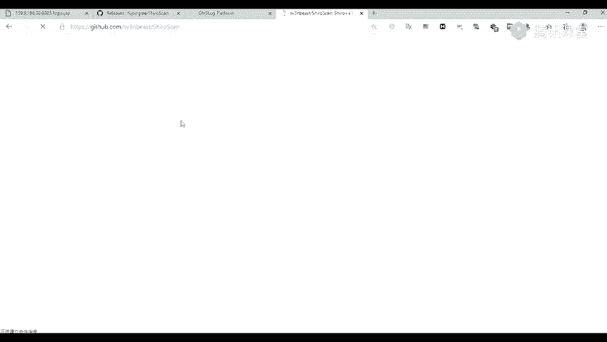

然后这这个脚本呢是用一个python3，就是用python3来进行运行的。

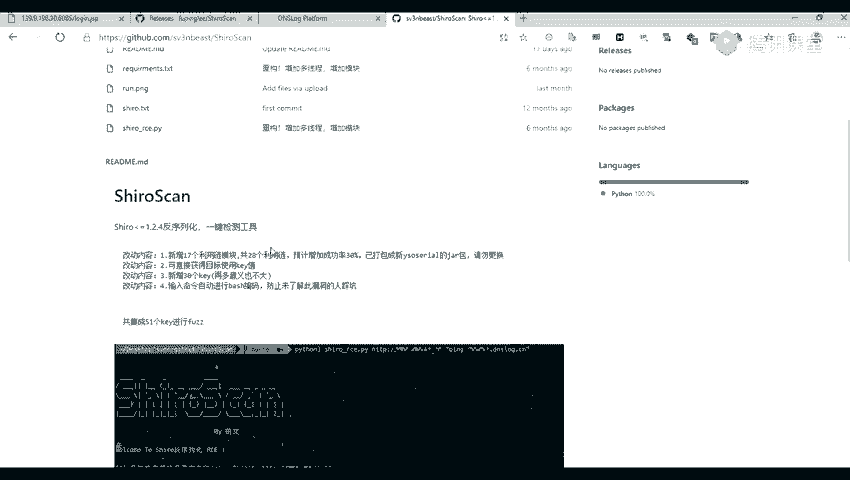

他使用呢也是比较简单的，就是我们执行我们的一个脚本。

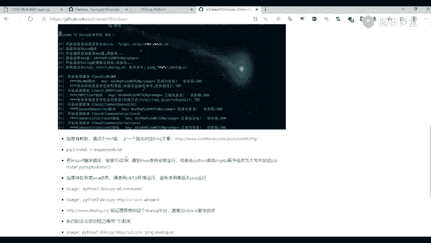

之后然后面跟上我们的1个U1个URL后面跟上我们的1个URL之后，在后面呢就跟上我们的一个命令。比如说一些P的命令啊，或者是其他的一些命令。那么我们使用也可以使用这个脚本来进行检测。

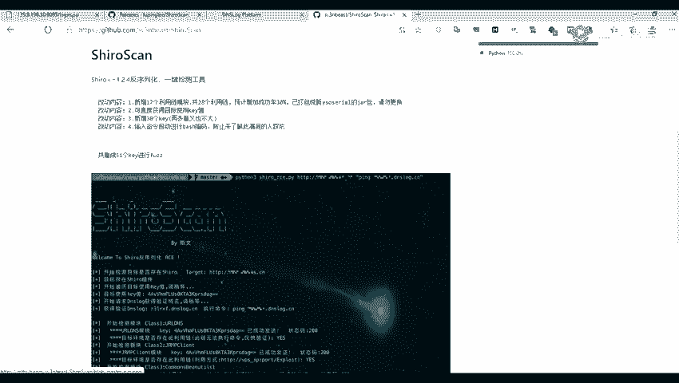

我们这里呢先将那一些人关掉。这个这个脚本。然后是CM1，然后ion3的一个环境。

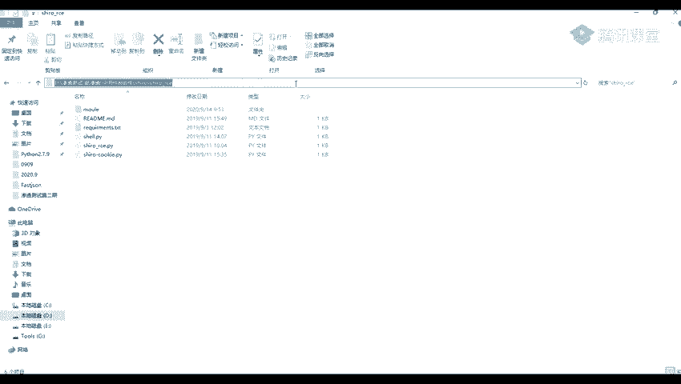

就是他用开审单来给的。开审张，然后我们的一个脚本名字。CcICE然后后面呢就跟上我们的一个网址，就是我们的对那个。

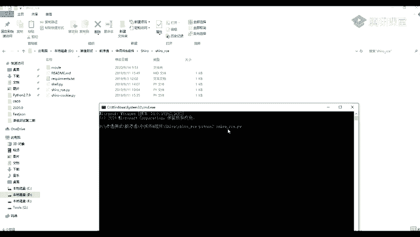

这个网址。8050这一个。在在后面呢就跟着我们的一个命令，比如说我们执行一个pin的命令。P命令也就是这里呢也是借助我们我们的1个DNSlog。

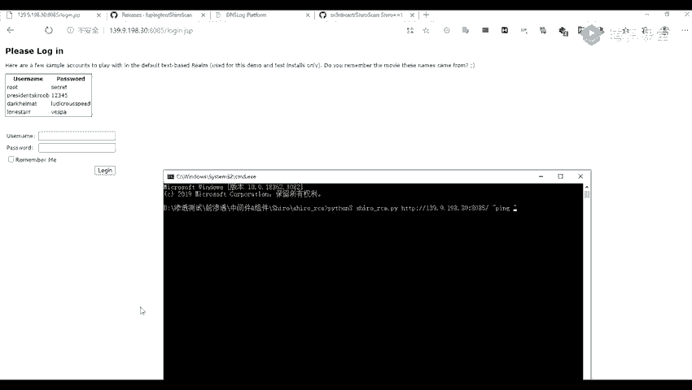

姓明你要到我们这里。将我们的1个DNS录，我们先将这个重新获取一个，我们重新刷新一下吧。规定之后，我们重新获取他的一个子域名。哦，那那刚刚不是被拦截了，就是他可能有一点有延迟吧。

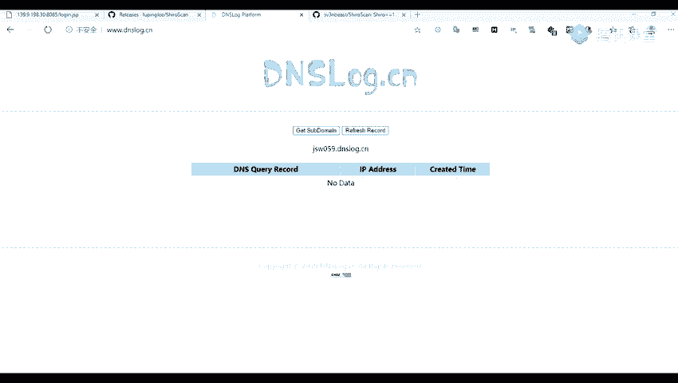

让他获取到我们的一个子域名之后，我们在我们执行命令这里就是聘一下我们的这个子子域名。如果说。

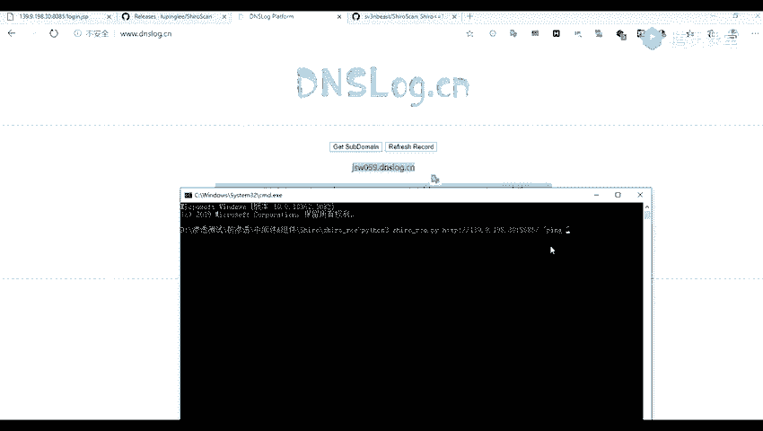

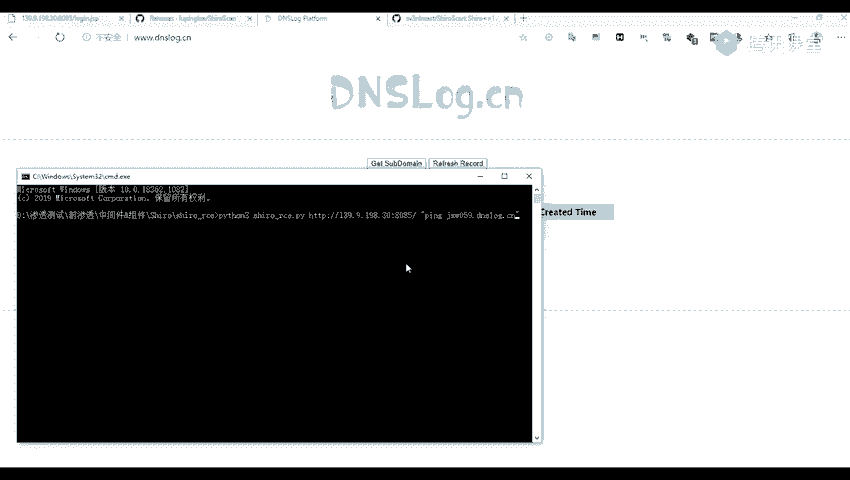

如果说他存在的话，那么他这里呢也是可以就是收取到他的一个结果。

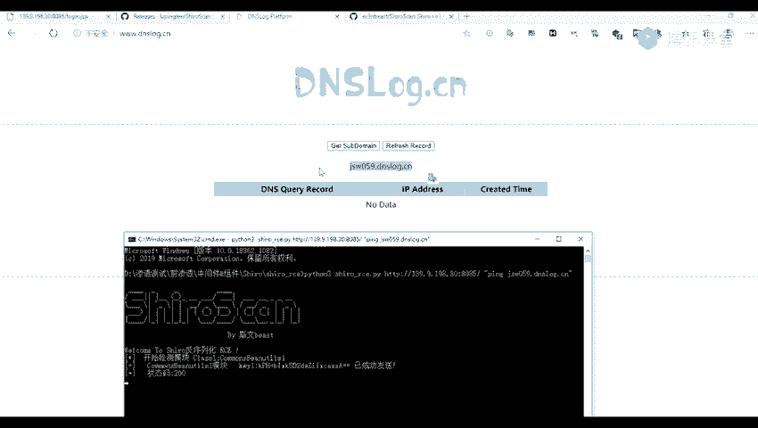

在这里呢需要跑一跑几秒钟吧。

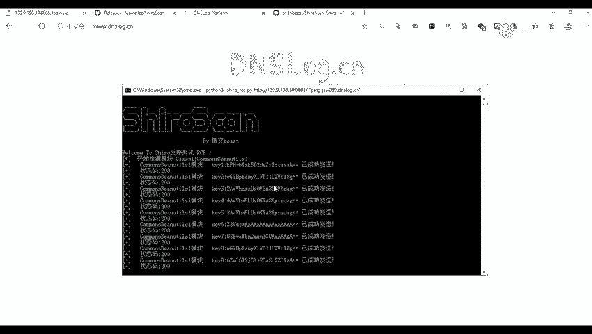

然后除了这个DNSro点接我们网上呢还有一些就是DNS的一个平台平台，或者是1个CEY1点IO这个网站呢就比较卡。这个网站是一个比较比较卡的，然后我们也可以。用这个网站来帮我们进行一个测试。

那么这我们的一个域名就是这一个我们常用的就是这一个域名就是帮助我们检测的一个。一名。这个呢是一个自己的一个专属的。现在我们也可以将我们的这个域名给复制，然后让他去聘这个域名。

我们先来看一下前面这个有没有结果。这里呢我们也可以看到，就是我们这个DNS log点CN呢，我们也可以看到他这里呢也也收取到了他的一个请求DNS的一个请求。这个呢就是他的一个脚板，就是使用脚板进行验证。

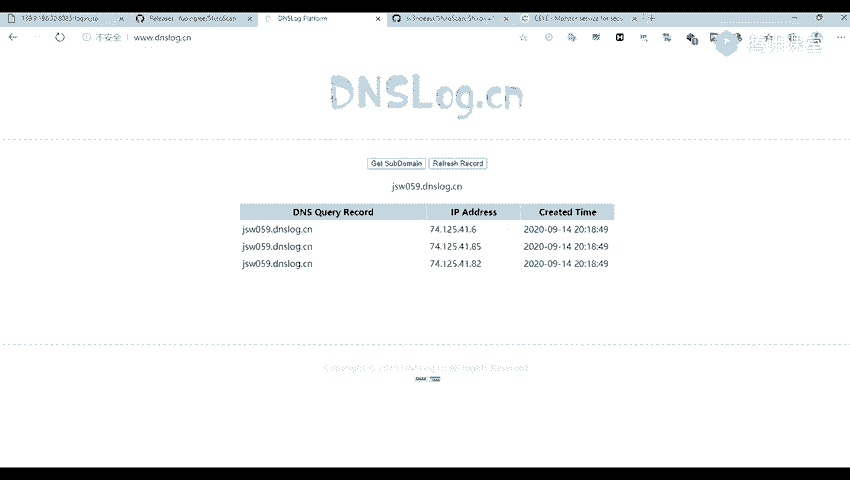

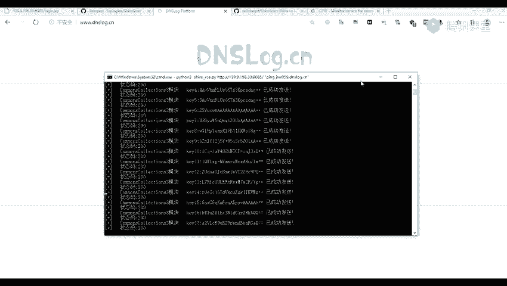

哦，我们就继续下一步了。我们。嗯。

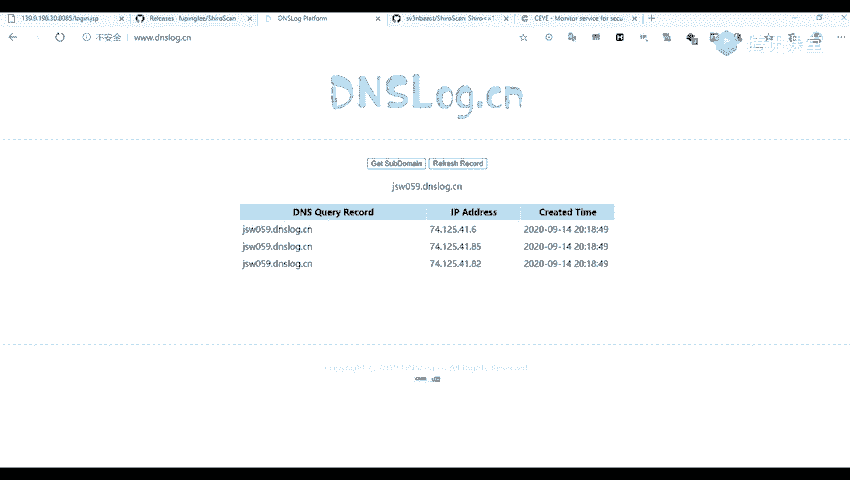