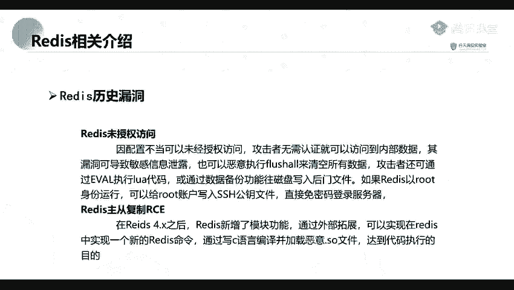
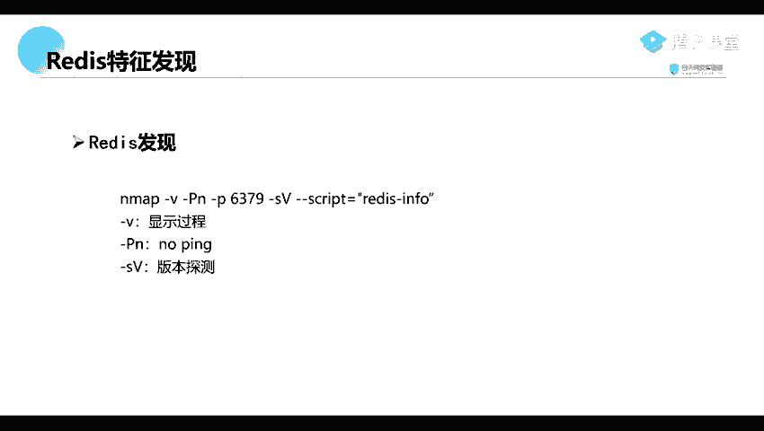
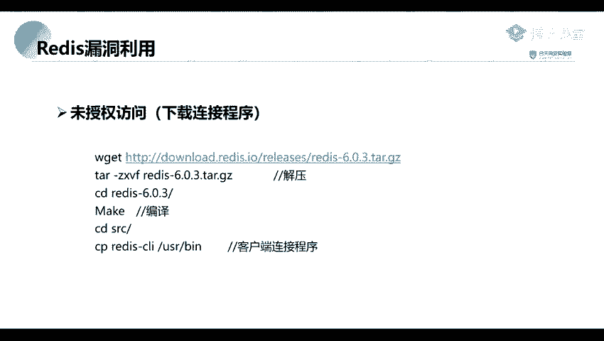

# 2024年最强Kali渗透教程／网络安全／kali破解／web安全／渗透测试／黑客教程 ／代码审计／DDoS攻击／漏洞挖掘／CTF - P54：15_Redis未授权访问漏特征和发现 - 网络安全系统教学合集 - BV1Pe411C7Zb

那么这个bait它有哪一些特征呢？相信你们在信息收集的时候也讲过。

那的这个ready。首先呢它是默认绑定在1个66379端口上面的。你们在信息收集就是端口扫描那一部分，应该有有讲过这1个6379的一个端口，就是一个。会经常存在这个readit未授权访问。他这个端房呢。

并不是走我们的一个常用的1个HDDP的一个协议的。就是说我们并不是通过浏览器去进行一个访问的。我们访问他的话，需要使用我们的一个leauce的一个客户端进行访问。那么怎么去发现这个laduce呢？

现在我们通过我们信息收集中的一个端口扫描。在我们的一个端口扫描可以发现我们的一个ready。我们可以使用这样子的一个命令，就是一个Mm杠V杠PN杠P。

然后6379就是我们的一个res的一个默认的一个端口，然后L杠SV。这里呢这里呢应该你们都有了解过这个命令它的一个意思啊。比如说我们的一个杠V就是显示它的一个扫描的一个过程。然后杠V案呢就是ning。

也就是。不进行一个主机探测。也就是说我们输入多少主机，那么他就会探测探测多少主机，并不进行一个pin的一个扫描。然后杠SS大V呢，就是检测这个版本，就是检测它的一个服务版本。我们这个刚杠室累。

就是就是指定我们的一个脚本，指定我们所使用的一个扫描脚板。我们这里呢是使用的是一个readin这个脚本进行扫描。方面呢就是跟照我们的1个IP。要扫描到这个之后，我们就因为我们前面说了。

他是一个未授权访问的一个漏洞。所以呢我们。

并没有，就是我们直接去进行一个连接，就是连接到的一个数据这个readice就可以了。

