# 2024年最强Kali渗透教程／网络安全／kali破解／web安全／渗透测试／黑客教程 ／代码审计／DDoS攻击／漏洞挖掘／CTF - P57：2_破解Tomcat后台弱口令 - 网络安全系统教学合集 - BV1Pe411C7Zb

这个呢就是我们的1个SSH。

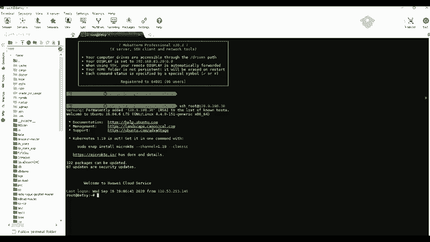

下面呢我们来看一下，就是使用我们的一个。BP就是bo straight就对我们的一个comca的一个后台进行破解。首先呢我们来看一下这个comca，我这里这个网站呢是拉了一个comca。

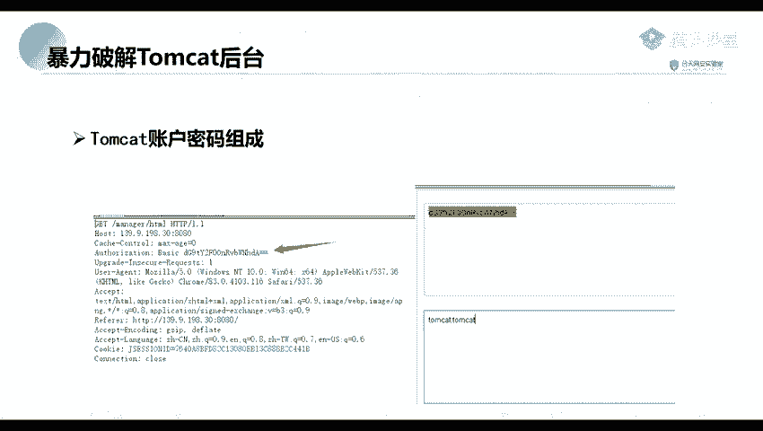

的一个环境，我看一下是哪一个。嗯。你。嗯，我找我找一下。哪一个来的？

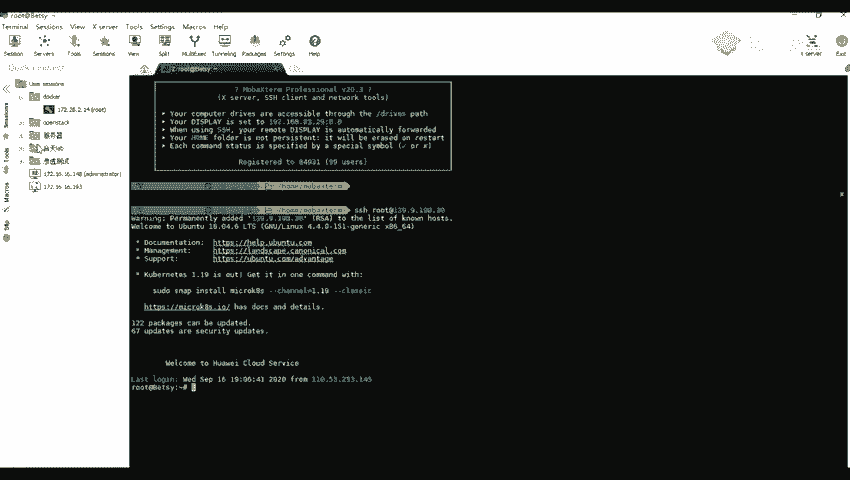

47。104。47，比说我这里呢是有一个comca。这个有一个tca，然后我们访问的时候，我们可以看到他这里是一个就是很明显的告诉我们这里呢是一个tca的一个界面。那么我们。在就是找他的一个。

后台的时候我们可以直接在这里呢输入一个manageage。MANAG呀，然后回车回车之后，我这里已经进行一个登录了，我用另一个吧。比如说我这里。你这里重新说要47，这里我看一下，这里应该没有登录。

等到我们猪又到的一个menageage。MMMANAGE呀和回车回车之后，我们看可以看到他这里呢是需要使用我们的一个密码账号密码才可以进行登录的嗯。那么我们没有。就是没有这个账号密码怎么办呢？

那么我们就可以就是对他进行一个爆破。那包括呢我们先来包括之前，我们先来看一下它的一个密码的一个组成。因为这一个comca他的一个账号密码的一个组成是。我们虽然说看到这里呢是分别是两个灯录框，就是输入框。

对吧？但是实际上他在传输的过程中并不是这样子的。来看一下，首先在我这里随便输入两个t。TFP。然后。没卡。我们密码呢这里呢也都有我们的一个t，然后进行登录。登录之后，他还是返回就是弹出这一个登录框。

说明我们的一个验证码是不正，就是我们的一个密码是不正确的。那么我我们来先来看一下它的一个密码的一个组成部分组成。我们这里呢因为已经开启了他的一个代理了，就是可以进行抓包了。

那到我这里我这里可以就是开启了代理代理之后，我这里呢可以进行一个关闭它的一个拦截。就关闭拦截之后，我们可以在我们的这个HDDB的一个里里面去找找到他的一个。就是请求包。

比如说这个这个呢就是我们刚刚的一个请求包。我们我们将这个包呢先发送到我们的一个repeat这个模块这里。当然呢我们也。我们起来看一下，他这里呢是。就是请求一下，也就但是1个401的一个错误。

就说明我们的一个用账号密码呢是不正确的。不正确的呢，我们来先来看一下他的一个。就是密码密码的一个部分，这里就是这一串就是它的一个密码的一个主部分。这个呢他是经过他的一个b64进行编码的一个这个。

字符串这一串我们先来先将他进行一个解密来看一下。我们将我们的这一这一串这一串数据，然后要件要件发送到我们的这个。先先读先读decode这个模块，这里这个模块呢就是用专门用来进行一个编码解码的一个模块。

也就是这个decode这个模块。今间我们的这一个。数据这一串数据也要发送到我们这个can这里。要因为我们是已经知道了这个com cat，但是只用了一个face64进行一个编码的。并到我们这里呢。

就对他进行一个解码。然后找到这个decode decocode，然后这个找到这个被64这里。我们可以看到他这里呢就实有有许多的一个选项就可以选择了。我们这里呢就选择一个被64。然后我们解码之后。

我们可以看到它的一个密码，密码组成是。是这样子的。这是一个test。这里看一下就是一个test，然后加上一个冒号，再加上一个tt。我这里给大家。出来。是这样这样子的一个章，就是还原之后。

我们可以看到前面呢就是我们的一个用户名。因为他的一个组成方就是一个用户名。用户名加上一个冒号哦，这是冒号对吧？也要加上一个密码。密码然后在之后呢，再定理一个。被604的一个。B a f p。

64的一个单密。就是编或者说是一个编码，要就得到了我们的一个就是传输，就是传输的一个密码。那么既然我们知道了他的一个。就就是他知道了他的一个加密方式，那么我们就可以去构造出我们的一个字典。

首先呢我们将我们的一个包定请求包发送到我们这个研的这个模块之后。我就可以。对我们的这一串这一串东西要进行一个就是添加一个标记。我们本来呢应该是没有标记的，我来看一下。InQ的。我发送到这里之后。

但是这里呢是没有标记的嗯。现在我们先添加一个标记，就对就是标记这一部分是用来进行爆破的一个部分。然呢。我们对这个呢，我们是前面的课呢也给大家讲过了，所以呢我们这里呢就不详细的去讲了。

要添到这个标要记的一部部分之后，我们进入到我我们的一个拍照的一个设置这里。翻乐的。然后呢，这里。有有有几个权限，一个是plo的 set。哎，还有一个呢就是plo set option这个权限。嗯。

看到我们因为我们那里前面呢是只选择了一个一个爆破的一个参数。所以所以呢我们这里呢是只有一个设置plo set。那在我们选择一个字典，这里呢就是它的一个字典的一个类型。

比如说我们比较常见的就是一个一个simple simpleple list。这个呢就是一个简单的一个字典。上面这个呢轮轮胎表ll就是一个运行文件。以及上面的一些，比如说他的一个日期呀。

还有或者是一个数字等等或者一些日期，我们可以看到也可以去设置他的一些日期是。那么我们这里呢就选择我们的一个自定义迭代器，也就是我们可以自由去设置的一个。这个字典类型选择第三个。

第三个呢就是gas这这个权限就是一个自定义迭代器。我们选择了之后。就对就设置我们的一个用户名。首先呢我们在这个。

poposition这里这个hello option这个权限这里也要找到我们这个 position这个地方。那我们我们可以看到那这里呢有1个12345678。

但是呢我们这个字典的一个组成是一个分为三个部分。第一个部分呢，就是我们的一个。用户名。对吧所以呢我们就可以设置我们的一个用户名。就先在之先在我们这里说就是他的一个用户名，我看一下这里。

我们比如说我们这里面随意设置一个test，也可以，我们可以自己添加进去，也可以去导入，就是导入我们的一个字典。我们这里呢就随便就添加几个吧，11231234。这这个呢就是我们的一个用户名啊。Not。

啊啲我等咩。嗯。还有一些。嗯好啊，我们随便做这几个啊。原那我们嗯。在在设置我们的一个第二第二个部分呢，我们我们前面这个第一呢就是我们的一个第一部分就是一个用户名。然后呢。

我们进入到第二第二部分的一个设置。就是。加上一个冒号，加上我们的一个冒号，加上冒之后呢，我们就添加就行了。然后进入到第三个的设置。第三个设置呢就是我们的一个密码。密码要呢，我们这里就设置我们的一个。

随便设置他的一个密码。好的。然后。啊。我们这里呢就随便设置5个12345个密码。设置完密码之后，我们如果是直接爆破的话。我们可以看到。如果是直接爆破的话，他这里呢是他的一个并没有进行他的一个加密。

我们可以看看到，而且他会对他的这一个特殊的一个字符，也就是这一个冒号进行一个编码了。比如说我们这里呢就是进行的一个编码，就是对一个特殊字符进行编码了。并且他并没有对这一串数据进行我们输入的一个账户密码。

进行一个被60字的一个编码。所以呢我们。还要去进行一个设置。首先呢我们进入到我们的这个。那那个倒数第二个。这个propi process这个地方这里。然呢我们添加添加一个就是加方式。

它的一个编码的一个一个方式。比如说我们这里呢就选择一个就是我们艾艾，然后选择它的一个类型。我们这里呢是进行一个编码的，就是意思呢就是对我们的一个这这里这一段这些设置进行一个编码。

那在我们就设置一个incincode这里进行一个编码。然后呢我们是一个facease64的一个编码。所以呢我们就找到我们的一个face64的一个inco。之后呢，我们点击OK。OK之后因为我们前面说了。

他会对我们的。对以我们的一个。特殊字符，比如说这里的一些特殊字符进行了1个UL的一个编码。就是他会对这这种字符。

比如说这点号、斜杠版斜杠等于还有编括号、问号、加号、分号、双引号等等的一些符号进行了1个URL的一个编码。所以呢我们这里呢就让他不就是不进行编码。这个不对不对这里面的一些特特殊字符进行编码。

就是我们得把这一个高包给去掉。就不进行编码之后，然后呢我们就可以设置完成了。设置完成之后呢，我们就点击进行一个报破。我们点击这个star attack这一个等项，就在最右上角这里。

那在我们可以看到他就进行一个报破了，并且他的这些报破的这些数据就是这个。用户以及密码的一些这些数据进行了一个加密了。那呢希望我们可以进行一个筛选。我们可以根据他的一个状态状态进行一个筛选。

因为我们如果是登录成功的话，那么肯定是1个200的一个状态。就是我们可以根根据它的一个状态来进行一个筛选。哎我们根据状态筛选之后，我们可以看到这里有1个200的一个状态，明显跟上面的一些是不一样的。

有很大的一个区别的。就是上面这些401呢，就是说他的一个用户名以及密码是不正确的。现在我们可以就是从这个状态码可以找到他的一个正确的一个用户用户名以及密码。这后呢，我们还可以根据它的一个长度。

长度来进行判断。比如我们可以，因为我们一个登录成功。登录成功的一个他给我们返回的一个包的一个长度跟登录不成功的返回包的一个长度呢，是可有可能不一样的。但样呢也有也有些是一样的。

我们得根据一个实际情况来进行一个使用。我们这里呢就使用我们的一个长，也可以使用我们我们的一个长度来进行一个判断。就是它的一个返回报的长度。现那我们可以看到他这里那有一个是20955的一个返回包长度。

跟上面的1个2736的一个长度呢是明显不一样的。所以呢我们这里呢就可以得就是得到了他的一个正确的一个用户名及密码。就是这一串这一串数据呢，就是他的一个用户名以及密码。那么我们就对他进行一个解码就是。

对他进行一个解码。那么我们发送到这个decode这个模块这里。嗯。要要进行一个解码。解码之后，我们可以看到他的一个用户名以及他的一个密码呢，是一个compca跟comca。

所以呢我们就可以出意我们的一个得到的一个用户名，comca以及密码comca。来进行登录。嗯。不过呢有一点需要注意的是，那个在这个com6版本以后呢，它是针对了一个爆破做了一个锁定的机制的一个设置。

所以呢如果是。我们有时候就是爆破的时候，我们会爆破。不管是证密码是否正确，都可能会爆破不成功的。就是他这里呢都是可能是显示到的一个是01了。因为他对这个爆破做了一个锁定的机制。

不管我们这一个用户名以及密码是否是正确的，都是都不能进行一个登录了，需要等30分钟吧，还还是5分钟来着。然后才能进行一个解锁。所以呢我们遇到遇到这这种登录框，就是这种comca的时候。

我们可以就是去手动就是随手动输入几个常见的一些用好类。比如说我们比较常见的。比如说它的一个comca，以及comca。就是怎么开的？这个呢就是他的一个默认的一个用户名以及密码。还有一些是其他的。

比如说comp或者是一些空空密码，空密码这也是可以的。有。我们。泡po得到了他的一个正正确的一个用户名密码。之后，我们就是接下来呢就是对他进行一个get cell，也就是上传他的一个外包进行get下。

反正呢嗯。上成的一个话包外包它是什么东西呢？它是用来进行一个web开发值的一个网站项目下所有的代码，包括我们的一个前台HTML代码TH的一个代码，以及JS的一个代码。

以及它的一个后台的一个javawe一个代码，也就是它的一个。java的一个代码嗯。当我们的一个开发人员开将我们的一个网站就是开发完毕时，就会将这些源码就是打包成一个挂包。就是给我们的一个测试人员测试。

那呢我们我们呢就可以就是通过就是这种远程，就是通过外包端去部署这一个外包进行一个复制这个网站。原后呢这个外包呢可以放在我们的一个comp上面的一个weAPP上面。

也就也就是weAPP上面呢是它的一个根目录，是它的一个根目录。跟我们我们的一个阿帕机的一个那个VAR3WHTML这个目录是差不多的一个意思。然后呢，当我们的一个toca启动的时候。

我们的那个挂包呢也会将之。进行一个解压来自动进行一个部署。所以呢，我们这里呢。就可以将我们的一个webc。

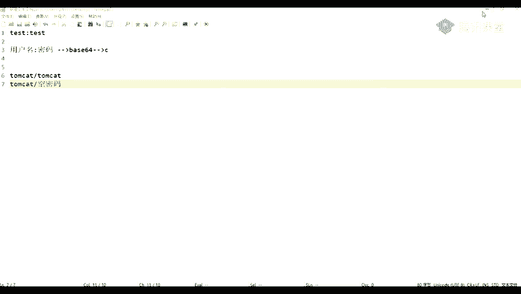

跟我们的一个java的java的一个wetel，就是打包成那一个大袜袜包。那么打包呢，这里。给大家演示一下。首先呢我找到我们的一个。就是外包下。因为我们这个deca是用我们的一个java进行一个开发的。

所以呢我们上传了一个。上传的一个包呢，也是需要的一个是java的，不能是黑PHP的。我我在在这里找一下。这他。你揿到书。我先找一下我们的我的一个web叫。啊。哦，比如说我这里呢有一个。

有一个1个JSB的一个we，一个文 webC。那这个呢？我看一下。这个外博调他的一个密码呢，就是他的1个111，这里呢也进行一个备注了。那那我们怎么去制作我们的一个将我们我们的J这个JIP的一个文件呢。

制作成我们的一个挂包呢？

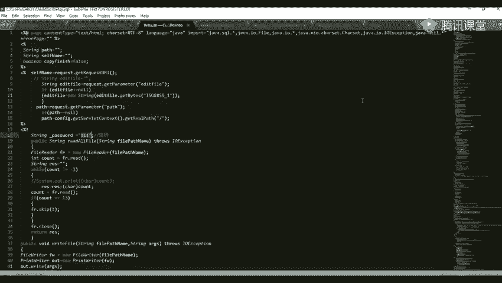

首先呢我们打开我们的1个CMDMD。打开PMD之后，我们进入到我们当前的一个。路径上面原来路径上面有一个。AB的一个文件。现在我们注意我们的一个炸接压。

然后杠CVF杠CVF然后跟上我们的一个想要打包成的一个什么名字。比如说我们这里呢想要打包成一个t点哇。然二方面呢，就是跟照我们的一个1个DSB的一个文件。要回车之话，我们可以看到。他这里呢是已经成功了。

租出了一个挂包了，我们来看一下。这个呢就是我刚刚做刚刚的一个外包，就是利用这个s点件P去压制成的一个这个外包。这样呢我们就进行一个部组。不署之，我们找到我们上面的这个we图。

这个地方这个那就是我们他的一个就是部署我们我们的一个画包。那么我们选择我们的一个文件，就选择我们刚刚的那一个包。要t test点哇要打开，打开之后进行一个附署。不足之后呢。

我们就可以对我们的一个网站进行管理了。原来我们的一个路径路径呢要注意我们的一个路径呢，就是我们的一个网站的一个登目录。就是我们的这里要加上我们的那个外包的一个名字。比如说我这里呢是一个test。

就是这一个外包的一个名字，是一个test。然后后面再加上我们的那1个JSP，就是这个weshop的一个名字。BETSY点ZT这样呢，我们回车。

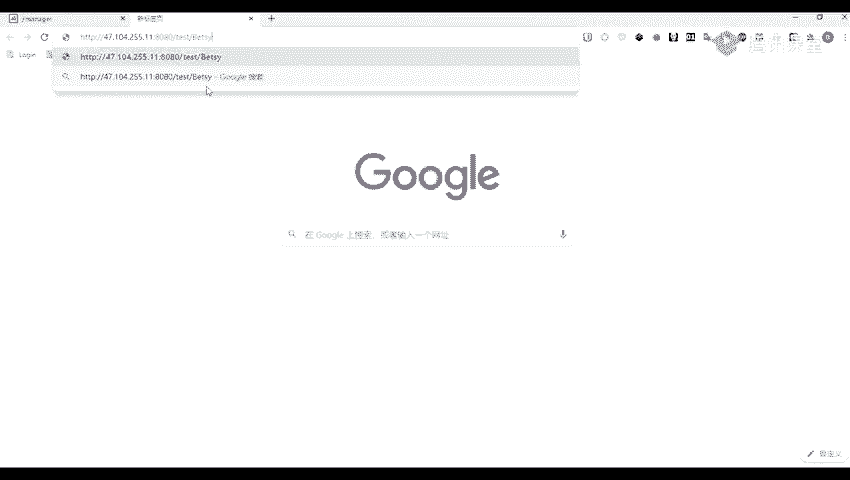

回家之后我们可以看到我们已经可以访问我们的一个wecha了。那么我们的一个密码呢就是1个111。合定你个登录。登录之后呢，我们就可以就是对我们的一个网站进行一个管理的。

我这里呢是使用我的一个web端进行一个管理的。Okay。我们呢也可以去上传我们的一个其他的其他的码，我这里呢算是一个小码吧。就是可以对我们的一个文件进行一个管理的。或者比如说新增文件或者是复制文件等等。

还可以进行一些执行到的一些其他的命令。比如说我这里方废的是没有的。LL的一个命令。现在我们我们可以看到我们执行了我们的1个LOS的一个命令呢，他这里呢就给我们列出了他的一个文件。这个LS命令呢。

就是我们在我们linu上面就是查看我们的一个就是列出我们的一个文件的一个命令就LF。Okay。以及ket我们的一个密码文件，caca就是一个查看。1EDC上面的一个password。

我们可以看看能不能执行。那也可以看到。我们tEDEDC busword也可以去查看这个文件。就是我们的一个linux上面的一个密码文件。好，然后呢，我们这一节呢就讲讲到这里啊。然要呢。

这个这一节课的这一节课呢，我们主要是给大家介绍了这个。工工具就是我们的一个。一些常用的一些工具。哦，这里呢还有一个nack这个这个工具。

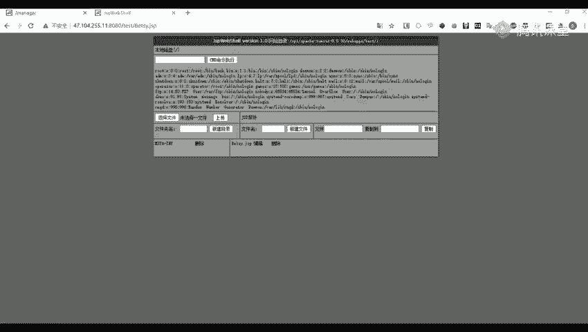

就是这一个这个工具呢，你们的一个工具包里应该是有这个工具的。这里呢打开给大家看一下。一盘。好，就是就是这一个工具，你们的那里呢应该是叫一个。超级超级诱口令检查工具。Okay。

刚然找到我们这个n的的这个程序，让后我们双击打开它。双击打打开它之后，我们可以看到它这里呢是支持爆破非常多的一个协议。比如说我们的一个IDBIcyclcleical FTP等等。

以及netVNC各种的一些应用，或者说一些协议。并且他还支持他的一个。就是批量就是批一量的。的一个破解或者是一个账户呢，我们也可以去自己去导入他的一个密码，就是用户名。密码呢也可以自己去导入。然后呢。

他这里呢是已已经内置了许多的一个。一个密就是密码，或者说是一个字典。这里呢有39个字典，我们也可以自己去进行添加。这使用呢是比较简单的，我们直接在我们的一个目标账户。比如说我这这里呢举个例子啊。

我这里呢有1个127。0。0。1。我们这里呢是举个例子啊。那呢我们选择我们需要爆破的一个应用。我们这里呢选择我们的的一个白 circle。原来我们导入我们的一个账户。导入我们的一个优的。

一个usernamemy circle这里。要再导入我们的一个密码。那之后呢，就可以进行一个检查了。那检查呢他这里呢也非常的快，就是直接给我们检查出了我们的这个myscle，要他的一个用户名。

这个root，它的一个密码，这个123456，并且还有他的一个数据库的一个版本5。6。27。那么我们就可以去登录一下，看看是不是。是不是正确的？好，比如说我在想我就登录登登录一下我们那个。

捞因为我们127。0。0。1呢，我们也可以对我们的一个loc号啊。Yeah。post这这个两个呢是一样的。然后呢，他的一个用户名是一个root，密码是1个123456。需要要进行一个添加。确定确定之后。

我们我们这里呢就是这这个这个logo host，就这个三这里呢，就是我们刚刚添加的那那一个地址。哦，原后呢，我们就可以进行一个管管理了，就是可以登录进我们的一个数据库了。嗯，然后在这里呢，这一节课呢。

我们就先讲到这里啊。没有这么疑问吗？Yeah。哦，那个就你这个就先不理吧，就你们做其他的一个作业。如果是有什么问题再就是访问不了的话，你们再告诉我。因为那个上面开了太多的一个应用。

就是开了太多的一个服务，然后也被人也被人打，就是搞得很卡，可能有一些是。会被自动停掉了。这个呢，我我这我这边呢是可以随意的进行连接的。这个高版本高版高版本的话，我们对就是我们一般就是遇到这种的话，都是。

只用一下他的一个一些用就是默认的一些密码，或者是一些常用的。比如说一些com。123456，他的一个用户名额一般都是一个tmoca。那样呢那也可以自己去试试一下其他的一个。中西。

主要呢是看我们的那个网站的一个管理员，就是有没有就是修改，就是将他的一个。一个限制给修改掉。如果是修改的话，那么我们就可以进行一个爆破。如果没有修改的话，那么我们就就是是使用使用手工进行一个爆破。

就使用手工进行一个尝试。如果我们能进去的话，那么一般一般都能去部署一个外包的。

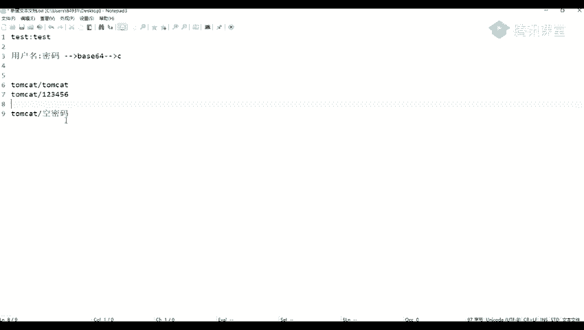

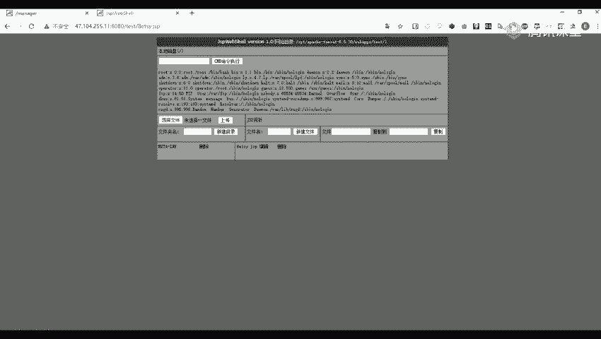

就是不足一个外包姚金玲就是去getel。嗯。比如说我这里呢我待会也也可以给你发一下，我这里给你们看一下，我这边连的。我这今天我改了个端口，应该是还是可以连的。

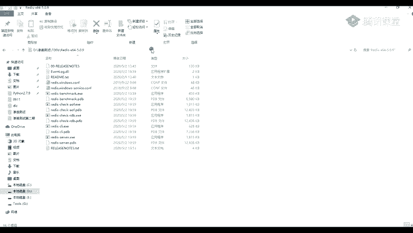

。I p i。达标啊。응。我这里呢是改了一个端口的，不知道你们还能不能连连下是1个6388的一个端口。给我们执行一个in付in付之后，我们也是可以执行的。刚刚我们看你们有一些同学啊。

就是使用的一些其他的一一些CD的一些命令。我们在这里面在这里面呢，并不是使用我们的1个CD的一个命令了。就是我们要设置我们的一个路径，我们是一个con。对然后DI呀DII就是我们的一个设置它的一个路径。

比如说我们这里呢是1个VAI斜杠3W斜杠HTML这样子。现照我们设置的一个路径，就是得看我们是不是能访问的。比如说我之前的话，好像这个8080端口好像是不能访问的。就是所以呢你们可能有有一些同学。

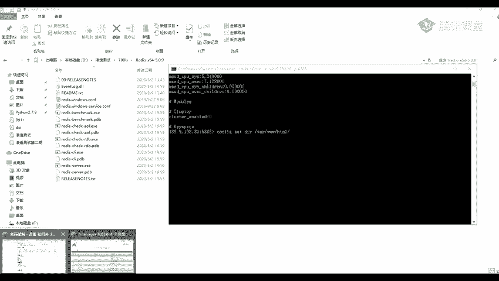

有些本来呢是不要不能访问的，现在是可以访问的。你们有一些同学可可能就是设置了之后，就是把用你们的一个菜刀或者是一个语键连接不上。因为你们的一个路径是不对的。我们我当时给你们讲的是一个。

是我看一下。

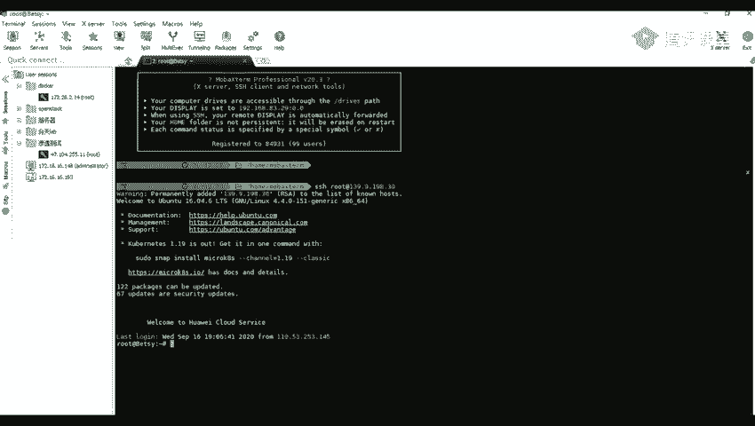

嗯。SHIF的一个路径，但并且这一个这一个路径。让呢我们设置之后，要再设置我们我们的一个文件名。设置完文件名之后，我们再设置我们要写写入的一个东西，然后进行一个保存就可以了。好，这节课呢我们就到这里啊。

我们就先上诉，然后翻到另另一个教室。

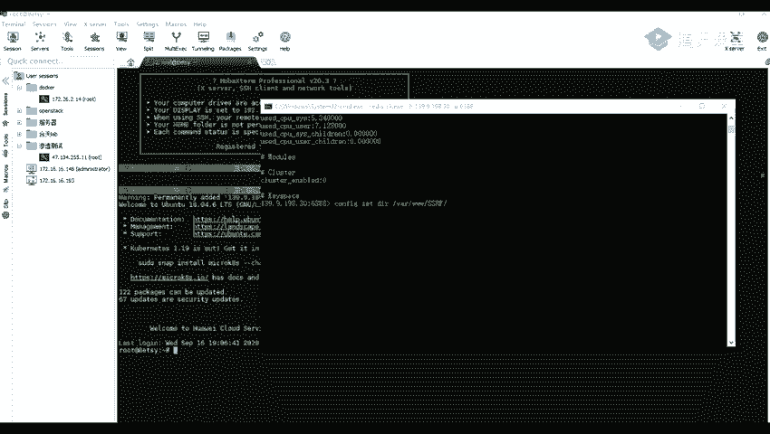

88的一个端口。给我们执行一个infoinfo之后我们也是可以执行的。刚刚我们看你们有一些同学啊，就是使用的一些其他的一一些CD的一些命令。我们在这里面在这里面呢并不是使用我们的1个CDE的一个命令了。

就是我们要设置我们的一个路径，我们是一个con。要然后DI呀BII就是我们的一个叫设置它的一个路径。比如说我们这里呢是1个VAI斜杠3W斜杠HTML这样子。按照我们设置的一个路径。

就是得看我们是不是能访问的。比如说我之前的话，好像这个8080端口，好像是不能访问的。就是所以呢你们可能有有一些同学。

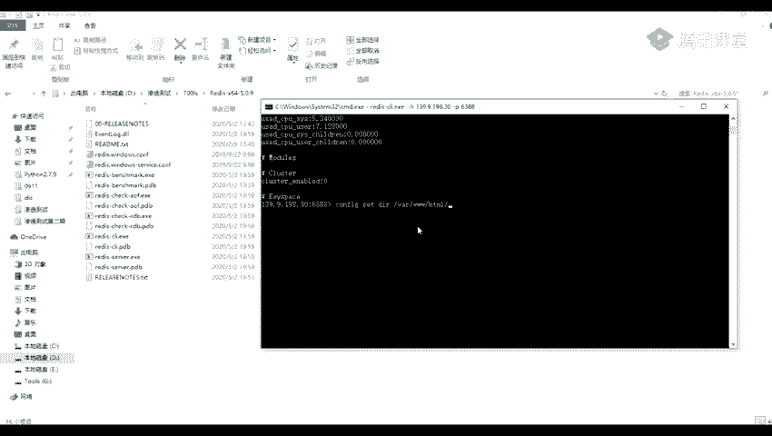

有些本来呢是没有不能访问的，现在是可以访问的。你们有一些同学可可能就是设置了之后，就是把用你们的一个菜刀或者是一个语键连接不上。因为你们的一个路径是不对的。

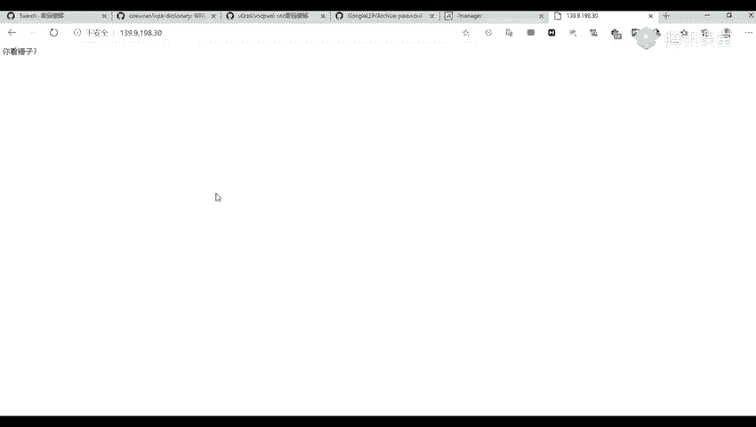

我我当时给你们讲的是一个。

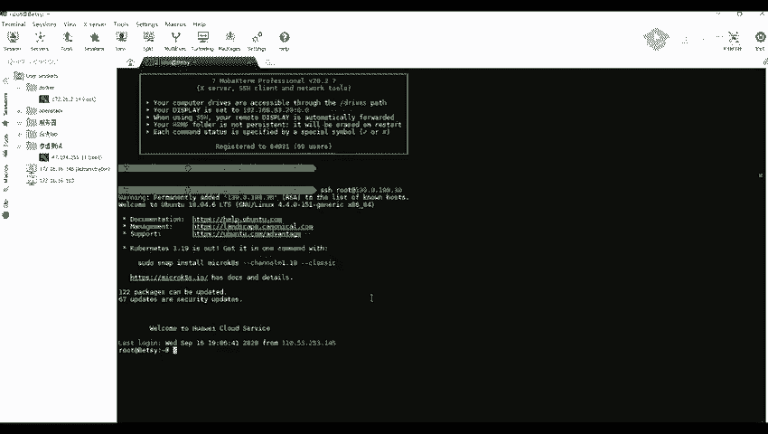

是我看一下。是HHI的一个路径，但而并且这一个这一个路径。然后呢我们设置之后，我要再设置我们我们的一个文件名。设置完完件名之后，我们在设置我们要写写入的一个东西，然后进行一个保存就可以了。好。

这节看呢我们就到这里，我们就先上课，然后翻到另另一个教室。

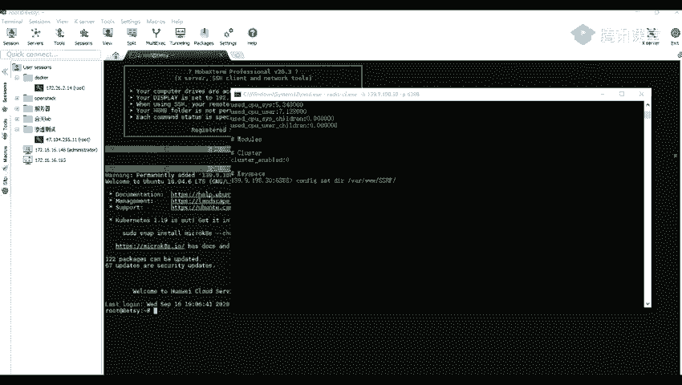

啊。喂。

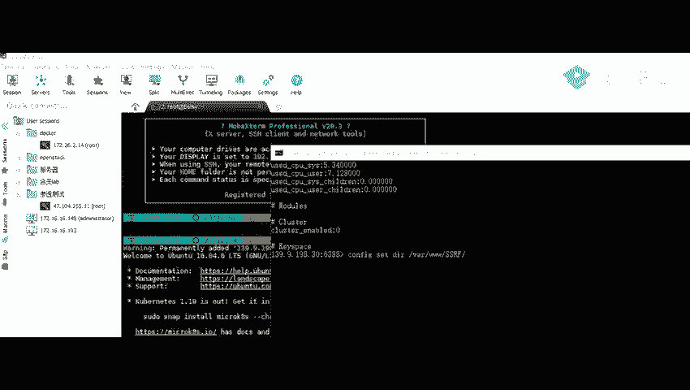

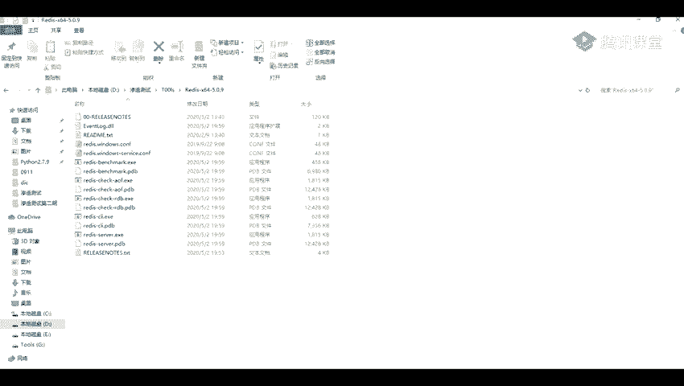

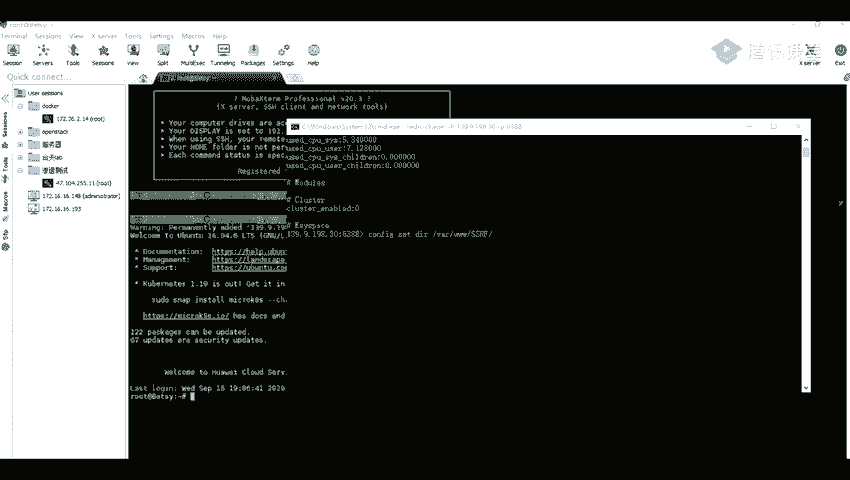

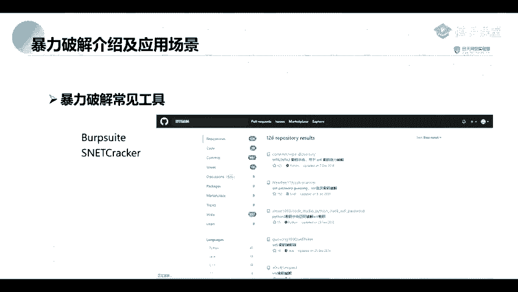

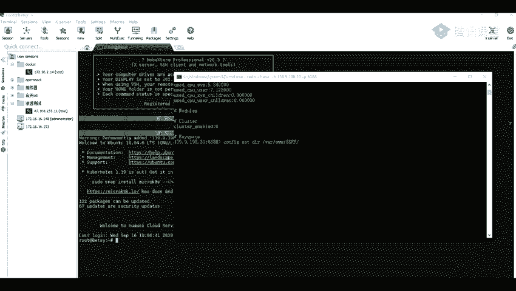

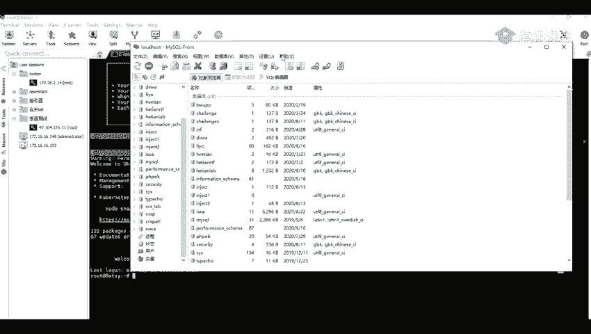

嗯。嗯。

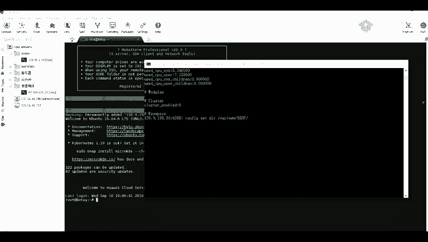