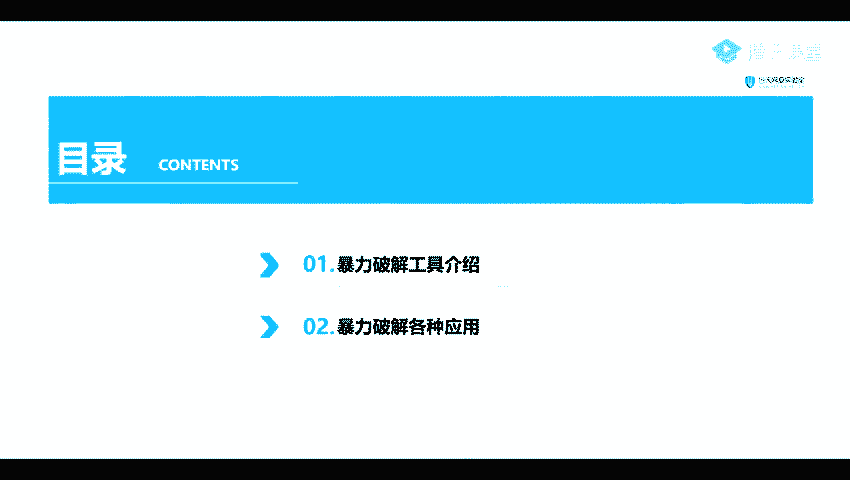
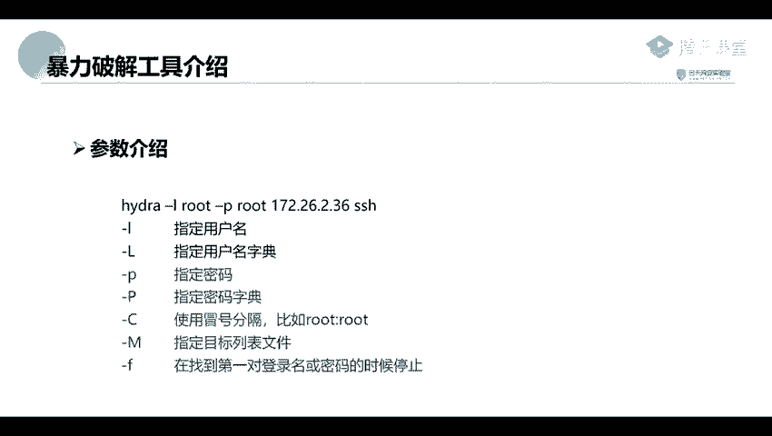

# 2024年最强Kali渗透教程／网络安全／kali破解／web安全／渗透测试／黑客教程 ／代码审计／DDoS攻击／漏洞挖掘／CTF - P58：3_密码破解工具：九头蛇Hydra - 网络安全系统教学合集 - BV1Pe411C7Zb

这二节课的一个内容呢也是讲讲的是一个密码，就是密码破解。或呢我们是讲了一个另外的一些工具。就是我们讲一下另外的一些密码破解的工具。首先呢这里呢也是分为。两个部分。

一个是我们一个暴力破解的一个工具的一个介绍。第二个呢就是我们暴力破解各种应用。我们这里呢是举了两个例子，一个是一个。H的HHH的，还有一个就是一个myci的。嗯。我们来先来看一个第一第一部分。

暴力破解工具的一个介绍。

所以呢。我们前面给大家讲了我们的一个。top switch以及它的一个nackcl的一个工具。另呢我们捡到另一另一款工具。这完工具呢就是一个嗯。我们的一个中文名呢也也叫叫他做一个九头蛇。

那是一款该开源的一个暴力破解的工具，它支持FDB。my circleHH等等的一些暴力破解。并且这个工具呢是讲了，就是在我们的一个ca里里面是已经。包含了这个工具了，就是内置了这一个工具。

现在我们直接开箱即用即可。首先呢我们来看一下这个工具就是怎么去使用。我们先来看一下它的一个参数。嗯。那这他的一个参数呢主主要主要有几个一一个是。嗯，杠杠L。以及杠1大写小解，还有一个杠P的一个大写小写。

以及杠C杠1杠O等等的一些。那个参数。我们呢这里呢就主要是。这将几个常用的一些参数吧。第一个就是一个杠L的一个参数，杠小姐的一个L。这杠调节呢就是指他的一个参数的一个意思呢，就是指定一个用户名。

大写呢就是指定一个用户名密码的一个用户名的一个字典。到小姐B就是指定我们他的一个密码。大批呢就是指定他的一个密码字典以及杠C杠C命令就是使用一个冒号进行分割。比如说root，然后冒号root。

然后杠杠M呢就是指定目标列表文件，也就是做一个批量的时候，就是使用到这个杠M。原告F呢就是在他的一个意思呢，就是在找到第一对登录名或者是一个密码，就是正确的时候就进行就将我们的一个程序给停止掉。我们。

除了这个九头蛇之外。我们还可以使用我们的一个mateax pro里面的一些内置的一些模块。

我们呢也也第二个买mate pro呢，是一款渗透测试的一个框架，里面是非常强大的。然呢我们在下一节课，就是周五的时候，还有后面的一些课程内容的时候。

都会讲到这个mateaxpro的这一个渗透测试的一个框架。我们在渗透测试的时候，是离不开这个框架的。就。那这个他里他然也是在我们的一个咖里里面是已经内置了。那么这里呢我们就讲到就使用他的一个。

模他的里面的一个是canner的一个模块。这个10天的里面的一个魔幻呢。但是专门用来进行扫描的一个模块。比如说可以对我们的一个mymysql的一个一些的一个mysl的一个用户名密码进行一个扫描。

还有一些Ole等等的一些我们前面讲到过的一些应用。