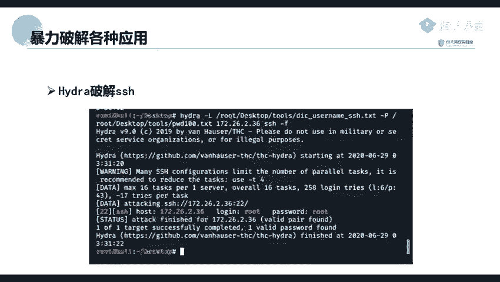
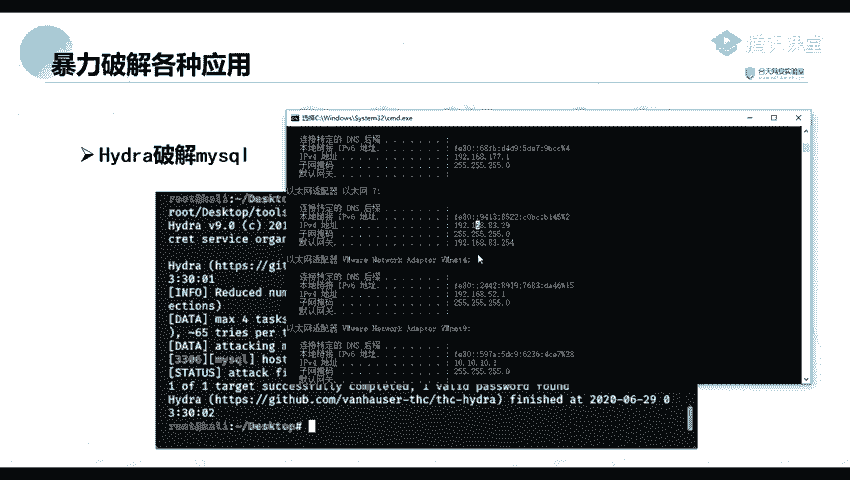
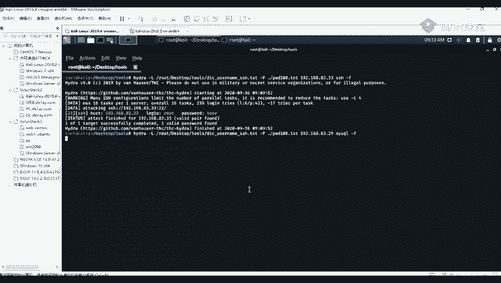
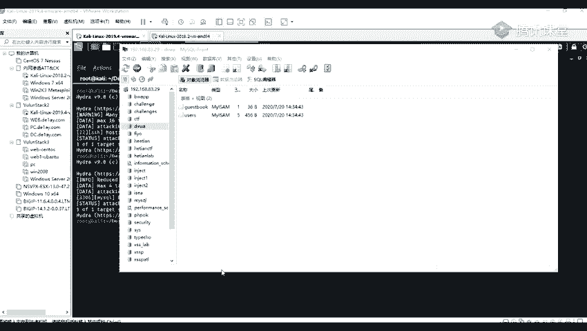

# 2024年最强Kali渗透教程／网络安全／kali破解／web安全／渗透测试／黑客教程 ／代码审计／DDoS攻击／漏洞挖掘／CTF - P59：4_Hydar破解SSH - 网络安全系统教学合集 - BV1Pe411C7Zb

那我们来看一下，就是另一个包括另一个my思跑。我们前面呢是报告了我们的一个。使用我们的一个图形画的一个工具进行包括我们的一个myrcle。下面呢这个呢就是使用我们的一个。有头蛇去破解我我们的一个买烧跑。

打你。首先呢，我这里来看一下。我我我在里面就举个例子去破解我本地的一个买车口啊。我先看一下我的ID。我这里呢是1个192。168。83。29，在这里呢是。进行了一个mysl的一个服务。

就我们这里呢就。假设举个例子，就是我们也是在定期收集的时候，就收集到我们。就是存在我们的一个mP就是找到了他开放了一个端口。这是1个3306的一个端口。那之后呢，我们就进行一个爆破，然后HYEI。

1杠带回的1个L，那是跟我们前面是一样的。我这里呢直接用前面的那那条语句吧。192。168减多少来着？83。29。然后我们的指定我们的一个应用是一个my circlerl的。

那到单就会进行一个报破。在这里呢报破呢也是比较快的，在这里直接将他的一个用户名给报告出来了。他的一个用户名呢就是一个test，还有一个密码呢，也也是一个是一个root。原来我们进行连接一下。

看这个用户名以及密码是不是正确的。我找一到一个工具。我这里呢我我就使用我的一个。工具就是。mysl的一个连接工具。mycycl这个工具进行一个连接。要连接到这里呢，我看你们看一下他的一个一个是。有。

92。168。83。29。然后呢，他的一个端款呢是3306，然后用户用户名栏就是我们的一个t啊。Okay。密码密码密码呢就是一个not，我们看一下能不能连接成功啊。啊，原来我们进行一个连接。连接之后呢。

我们可以看到也也是可以成功就进入到的那的一个数据库里面。那那我们就可以对大的一个数据库进行一个操作或者是一个管理。比如说查看最大的一个的一个数据库进行一个增山改查等等。그。

这个呢就是他的一个。使用他的一个九头蛇去破解他的1个SHH以及埋C口。前面呢我们也讲到，我们还有一个mateax pro的一个渗透设置的一个框框架，它里面的一个。扫描的一个模块。

