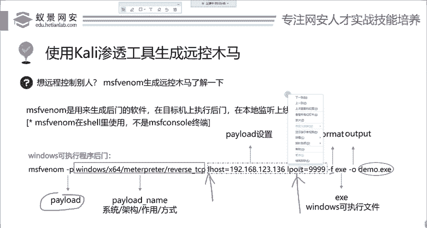
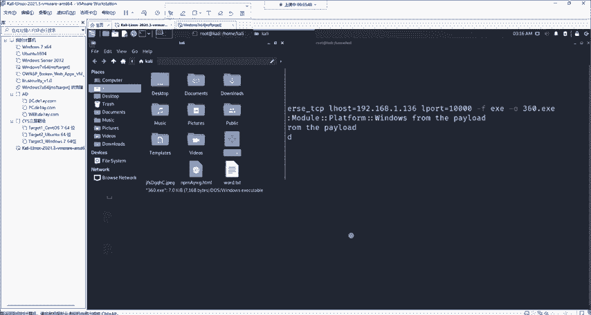
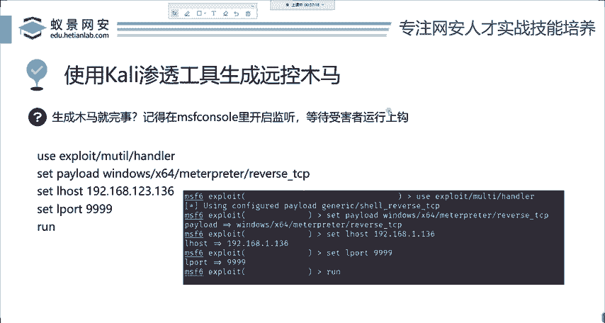
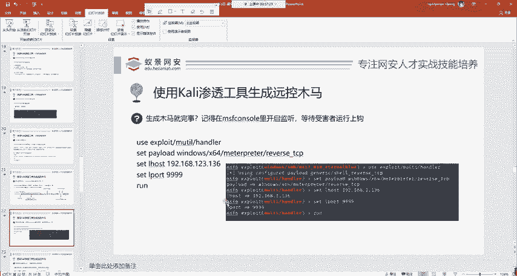
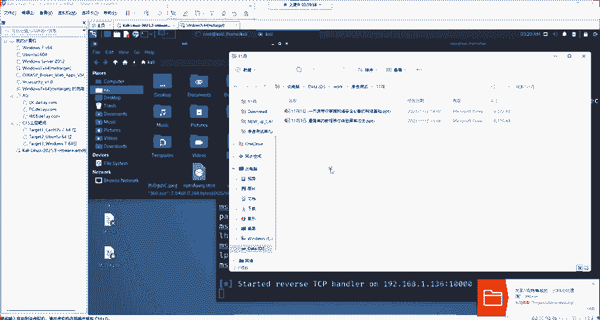

# 2024年最强Kali渗透教程／网络安全／kali破解／web安全／渗透测试／黑客教程 ／代码审计／DDoS攻击／漏洞挖掘／CTF - P5：4.metasploit如何攻击永恒之蓝 - 网络安全系统教学合集 - BV1Pe411C7Zb

然后我们下面呢来看一个东西，叫做生成源控木马。首先。木马是我们在渗透测试中最经常使用的一种方式。为什么我们要学习生成明木马？首先，大家电脑是不是都中过毒？可能有的年龄比较小的同学没有中国度。

如果有同学用过XP年代的那个售候，那电脑是经常中毒，那各种什么破解软件啊，各种的那种游戏啊，可能都嵌入了这些木马，导致我们的电脑中毒。那这些木马是怎么生成的呢？首先明确告诉大家。

在操作的系统上面难道都有漏洞吗？比如说老师现在的电脑，他就没有永恒之南漏洞。这时候怎么办？同样的思路，你一定要把自己带入进来，把你想象成一个黑客，那你只能去生成木马，然后进行木马的传播。

让别人运行你的木马，我们就直接攻破别人电脑了。就是这样一个思路，也是最常使用的。那这个木马应该如何生成呢？呃，大家稍等一下。🤧OK那这个木马的生成。是使用了mateta split。

也就是carly里面自带的一个工具，叫做MSF venom。veom的意思为病毒毒液。啊，你看那个电影叫毒液，那就是veom翻译成中文。那这个Wdom呢，它支持的后门木马非常多。

你可以生成各种操作系统的木马。比如说windows、linux、安卓、miccroIOS都能够生成。那在生成之后，我们这里先讲一个最简单的其他的大头小异，你尽可以举一反三。我们来举一个简单的。

就是这个windows的可执行程序后门。来看一下它生成的目命令。首先，MSFmen。加上几个参数杠P，这个P还是我们刚刚所熟知的泰漏的攻击载合，就是你想干什么。如果在这个攻击载盒中，我设置成关机。

那受害者一旦下载运行了你的木马病毒，那这个电脑就会直接关机。但是一般情况下，我不想让它关机，我想远程控制它。所以说还是用我们的老朋友这个matetterpre相关的攻击载合啊。

就是这个windows的64位版本的matetterpre，获许拍lo的。然后这个拍load中啊，它需要有一定的设置，设置呢也是我们之前讲过的，分别是listen host。

还有laen port这两个东西。那下面呢我们就可以设置一下，应该还记得吧。listen host是你自己是哪一个地址，就是卡里的地址。啊，这个run get GUR啊，这个同学问这个是什么意思啊？

他的意思呢叫做开启操作系统的远程桌面连接服务。默认情况下，这个服务是关闭的，我们是没有办法进行远程连接的。你这个命令呢就是为它打开啊，就是这个意思。就是为他打开。然后拍漏的呢就是两个。第一个是你在哪。

就是卡里的地址。第二个呢是你想开的端口还是一样的。这1万端6万多个端口随便你选啊，1到655351到65535随便你选。那这个F是formar。phonemar意思为格式。

就是我想生成什么样格式的木马文件，比如说windows的EXE。安卓的IPK。lininux的。EMF。这些都是属于formar。2杠OO的意思为output。就是我这个文件名。

这个木马的名字你想取成什么？你可以随意指定OK我们下面呢来快速的。运行下探。

う。首先这个命令的运行，你就不能在。这个命令的命运行，你不能在mattter printer里面运行，因为它是linux帕利的一个命令。我们需要先打开一个终端。在这边呢我们同样切换到。这个root用户。

其实不切换也行，但是我们为了避免可能会出现的权限错误，尽量把它切换到root用户。然后我们使用MSFveeno。杠P是指定你想干啥，就是你想干啥。我想获取我想远程控制它，我想获取mat create。

就是这样一个排load。然后还有就是你是谁？哎，我是谁我是卡利呀，我是谁？我卡利的地址192。6681。136iport，你想用哪一个端口，还是1到6535，随便你选择我这里选择1万，好吧。

选1万F format，就是你想输出什么？我想输出一个EXE这个东西大家知道吧？你双击就能够运行的这样一个东西。然杠O我们输出一个后门，比如说我给他起一个奇怪的名字，叫做360点EXE。

我们直接回车等待片刻。等待一会儿它这个生成是要有时间的那这个时候它就生成了1个360。1X1。那它在哪儿呢？我们其实可以简单打开一下看一下。在这这个360。那我们下面这个后门的生成。

就这样简单的一句操作，就可以生成一个木马。

这个是非常简单吧，不然我请问你现在离开了matta split，我让你生成个木马，你给我生成一个。成不了吗？是吧我们必须要借助这些工具，它非常好用。不要再自己去造其他的东西了。

我们去生成这个后门之后就完事了吗？肯定不行。肯定不行，为什么不行呢？我们要开启监听，等待受害者的唱歌。这是什么意思？这什么意思？就让大家去看那些电信诈骗。电信诈骗电信诈骗的时候，比如说让你给我打钱。

是不是诈骗分子要留一个这个手机号，或者是要留一个银行卡号等待别人的转账。所以说我们要留下这个东西，就是属属于开启监听，等待受害者的上钩。哎，如果说你现在诈骗别人，把钱转给你，你都不说你在哪儿。

别人转给谁那是吧？你诈骗不成功啊，是吧？这个是一样的，木马就是属于一个诈骗行为。我们下面呢来看一下怎么去开启这个等待上钩的这个鱼钩啊，怎么开。

怎么开又来到了我们MSF康颂里面。

首先我们把之前的都退掉，好吧，退出就是简单的英语east就退掉了。这最简单的英语。那我们来到MSF康里面使用一个非常重要的模块。叫做exloit multi handleer。

这个handler呢为叫做处理程序负载程序的意思。那我们在设置好之后，我们下面要进行配置。这个配置化非常简单，也就不用大家再去看s options，这个没有用，大家就跟着老师的节奏配置就行。

首先你想一下。你告诉了。比如说你告诉诈骗分子，你要打这个电话，并且把钱汇入到这个银行卡号。那你现在这个不是不是也是一样，你要告诉。这个受害者，你要把你的权限给谁？哎，我们就设置三个东西就行。

这三个东西呢也是在我们刚刚生成后门的时候指定的三个东西，分别是tload。I host。airport来，我们设置首先seet panel。设置它。复制过来。大家直接复制啊，可以直接复制。

还有什么Iho是吗？啊，我直接复制过来，1921681。136。然后set airport跟这边完全一样，这是1万，我也写1万。然后这时候我们设置好。就这三个。设置好B选项之后，要做什么事情？

跑起来是吧，run。

跑起来。OK你现在这个鱼钩呀就已经钓到河里了，就等着小鱼儿上钩就行。上钩怎么上钩，我这里啊就自己打自己自己打自己啊，你不是个违法操作，你想怎么打怎么打，你把自己电脑打坏了这个这个。这个是啊愿打愿挨。

这没办法。哎，我们首先呢把这样一个木马，我先放到我自己的本地，好吧，我们给他copy过来。copy到我的机器里面，比我放到这儿。大家看好，我翻过来之后啊，这个杀毒软件就给杀掉了。

