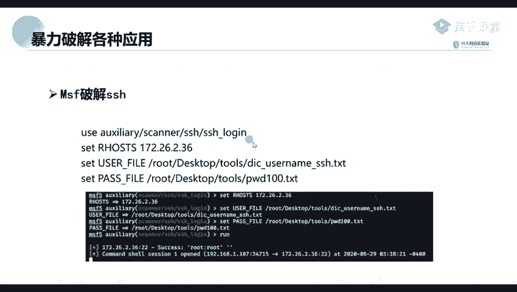
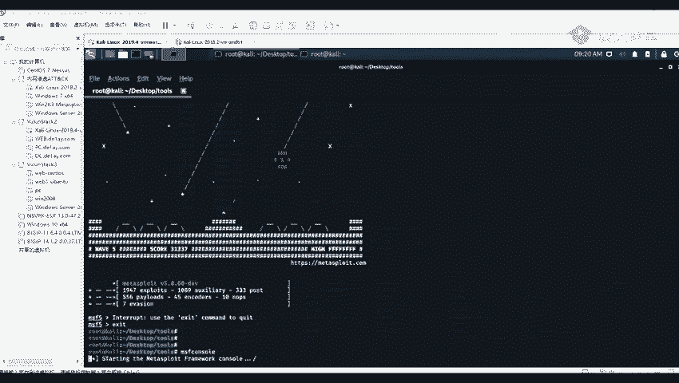
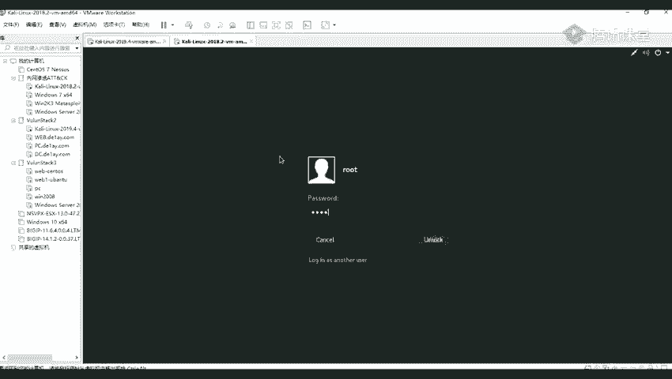
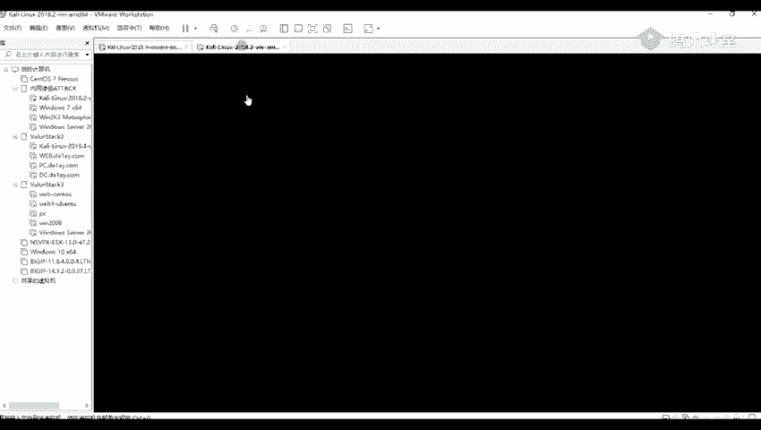

# 2024年最强Kali渗透教程／网络安全／kali破解／web安全／渗透测试／黑客教程 ／代码审计／DDoS攻击／漏洞挖掘／CTF - P60：5_Hydar破解mysql - 网络安全系统教学合集 - BV1Pe411C7Zb

第二，那里面呢是已经内已经内置了许多的一个模块了。我们正常就使用我们的这一个搜索我们的这个SHH login这个模块进行一个破解。然后呢，我们第一步呢就是使用我们的这个模块。然后第二步。

这个在R host这个那就是指定我们的一个远程的一个地址。比如说我们在信息收集到我们的的这个172。26。2。36。他开放了一个二的一个端口。那么我们就可以我们这里呢这个RR host。

这里呢就指定了那1个IP。然后上面呢这两步呢，就是分别分别指定他的一个用户名以及他的一个密码密码的一个字典。原那我们我们这里试一下。

首先呢我们提供我们我们的一个mateaxpro，只有直D截屏M。SF。看守。MSMMSS。MSSF分守这个命令就是开启我们的。嗯。哦，我们找了一个N方少。那呢他就会进入到我们的一个这个框架里面。

这个呢他举动的话需要等待一会呀。好。无法连接，好像我看一下，好像数据库没有开启，我看一下。Yeah。好。这个呢他的一个数据库没有开启，我们先将他的一个数据库给开启。嗯。诶点埋加一。系I啲。Okay。

现那我们的一个数据库是一个找一下是哪一个。有到。postt glass circle这个数据库，它使用的是这一个数据库，看到我门开启它。那我们重新。我们重新登订阅一下。

我看一下这里。加了。还是没没有连接上啊。我来看一下这个是否开启了。5432开庭了呀。我们这里呢先出始换一下吧。要我们注意我们的1个MSFDV。进行一个初始化。呃，站长这个IMIT这个命令进行一个初始化。

现在我们再重新进一入看看。这个呢在你们后续后面的一个课呢，会讲到这个这个工具的使用，这个框架的使用方法。好那，我们可以看到我们出始发之后，我们已经。嗯，已经定入到了。

那那我们这里呢我们可以使用我我们的一个社取，就是一个搜索的一个命令。搜索的一个命令去搜索他等一些。login的一个模就是包含了这个log login的这个模块，这个这个名字的一个模块。

那我们这里呢可以搜索到很多它包含了这个login的这个模块。那那我们找到我们这里呢需要的一个。我们这里呢所需要的一个模块。比如说我们这里呢有1个SHH的一个login的这个模块。这里。

这个呢就是我们所需要进行一个使用的。那在我们就使用我们的这个模块O之后。那在我们我们使用一个右右子的一个病例，就是使用我们的一个模块。1继0将我们的一个模块给输入进去。江南牙回车。

回这之后他已经设置好了。然后再设置我我们的一个远程的一个地址，就是setRSHOSPS。我们这里呢设置我们的一个远程的一个地址。然后我们这里呢是一个地址，是一个。多少来着？

被告192。168。83。33。这个地址呢就就是我们近期收集到他开放的这个22端口的一个地址。要了，回车。回车之后，我们再设置我们我们的一个用户名的一个字典在借。USE啊。

到FILE加上我们的一个路径ro。我们嗯。要再加上我们一个扣。依家飞天。那样呢我们也可以使用我们的一个option的这个命令，查看我们所需要设置的一个东西。比如说这里呢他设试了。他的一个叶子。

这里呢就是说明我们是必须要设置的一个东西。那我们再设置我们我们的一个密码密码的一个字典。啊。Part杠表。原告落。Ftop。测置完之后，我们再查看一下，我们是不是设置好了。我们那这里呢已经设置好了。

我们可以看到。这里这个require requirere。这个选项上面这个。上面他这里有几个页，然后呢，我们这里呢就需要设都需要进行一个设置。原告我们这里呢有一。这个quire就是所需要设置的一个东西。

而这个就是我们当前所设置的一个东西。比如说我们我们的一个pa pass，就是我们已经设置了这个路径的一个PWD100的一个P的一个文件，以及我们的一个远程的地址 host就是我们的一个要破的一个地址。

后面这个apple就是远程的一个端口端口。这个呢是默认的默认是2的一个端口。让呢我们执行一下乱的一个命令。乱的这个命令呢，就是执行的意思。看那我们需要等待他就可以了。关灯电关灯。我们等他跑完啊。

原来我们可以看到了。他这里呢已经跑到了他的一个用户名以及密码，就是我们前面只用九头蛇跑道的一个用户名密码。然后跑到了之后，就是这个mateax pro的这个在探测这个SS的一个热口令的时候。

如果是发现了存在，就会返回他的一个linux的一个chell。就是就会返返回到一个linu的一个c。但是呢注意我们返回的一个el，并不是我们的这个框架里面所内置的一个mate的一个cel。

所以呢我们这里呢属于我们的一个阶段。SESSSS杠IONS1杠U原来他这个son的一个ID呢是一，然后我们就回只有一个一son杠U，然后加上一个ID是一。没没有定制啊。我看一下。Okay。好。

我们只要先出来，就是先出来之后，我们再输入啊SESSSIONS1杠U加上我们的一个E。知道吗嗯。他就得到了他的一个mal black的一个笑。嗯，他这里有一个错误啊，我看一下。到。0400。我看一下。

看下 s一。然两个。行那我们第。啊。hel那我们升级了之后。升级了之后，他就会。找到我们的一个met的一个c之后，那在我们输入我们的个s杠I，然后加上我们的一个ID。

就是比如说我这里呢是一个我们又进入到这个met这个c之后，我们就它的一个ID之后。所以呢我们就输入我们我们的一个s杠I，然后加上一个2。到才我们这里但是他就得到了他的一个。mate的 exccel。

这样呢我们就可以对它进行进一步的深入利用。那么关于这一部分的一个后续后续的一个内容以及深入的一个利用。你们。后面的一个课程内容呢会讲到我这里呢，就讲到他如何对他进行进行一个破解。

并且去得到他的一个mate的一个el。对。呃，这节课呢我们就讲到这里啊。下面。哦，待会待会我会把我在群里那个在线作业呢，我我会在上面写上。哦，会会有关。后后面的话是另一个老师给你们算吧。

门见不到见不到我了。不过就是你们有问题的话，你们还是就是在后面的课也可以就是去问我的。嗯，因为我们今天呢主要是就是讲主要主要的一个内容呢，主要是都是讲一下我们的一个爆破。

就是使用我们的一个爆破 sweet的一个爆破的一个使用的方法。还有呢就是我们的一些常用的一些爆破的工具，就是介绍一下这些爆破，就怎么去对我们的一个应用进行一个爆破。

并且还有这个使用我们我们的一个macpro的一个框架，对我们的一个应用进行爆破。因为这个框架呢，你们后续都会讲到这个的。现在我这里就先给你们讲一下，使用这个框架进行爆破。呃。

然后这个fas接省的一个利用我我在这周末，我看一下是是周六还是周日，这周末就是给你们讲一下。然后后面呢还会。还会再讲一下其他的一个内容。就是我们在挖SIP的时候，就是可能会经常遇到的一些一个漏洞。

就是给你们讲一下他的一个。就是发现以及他的一个利用方法，那个呢是比较常见的。嗯。其实这个ice的一个密钥呢是我前面那个PPT呢，也是在上面是写了的。因为你们是一个我不知道是那个什么原因，就是连接不上了。

这个我当时我就没有讲，我看一下就是嗯。看到什么时候我搞好了，他就是连接上了之后，我也给你们一并讲一下。就是我们一些没讲到的一些内容，还有一些其他我们一些其他的一个漏洞的一些发现以及利用的方法。

