# 2024年最强Kali渗透教程／网络安全／kali破解／web安全／渗透测试／黑客教程 ／代码审计／DDoS攻击／漏洞挖掘／CTF - P61：6_MSF破解SSH - 网络安全系统教学合集 - BV1Pe411C7Zb

那见面下面呢我们先来看一下，使用一个九头蛇去破解他的1个HHHH的一个密码，用户名以及密码。

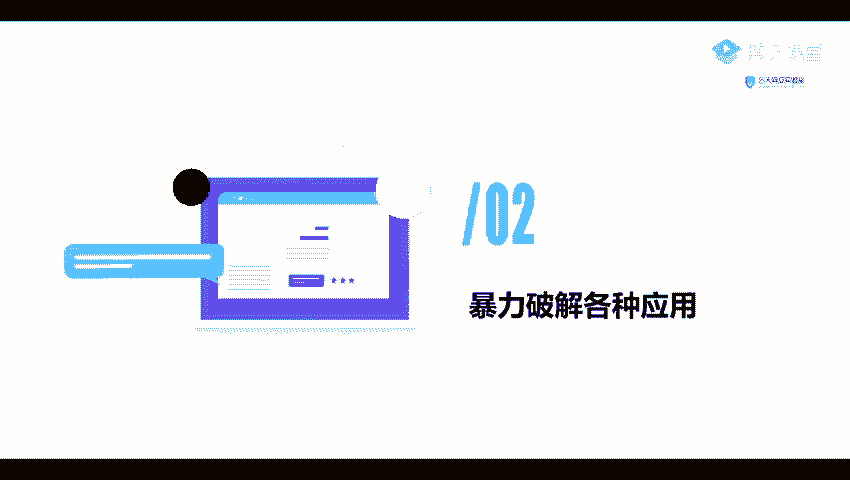

它比较简单，我们可以就是使用那个HYDI就是这个9头折的这个命令以后指定我们的一个杠大写的一个L。要再加上我我们的一个用户名。这个用户名的一个字典。这个字典呢我们可以自己去指定，也可以。

只用我们它里里面它是一个内置了一个字典。因为我们卡里里面呢其实也内置了一些字典的，我们来看一下。嗯。

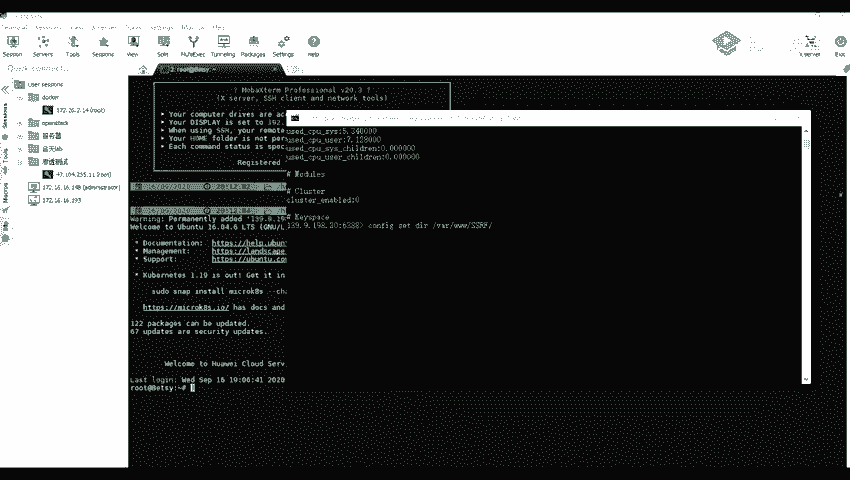

啊，这个呢就是我的一个咖里。

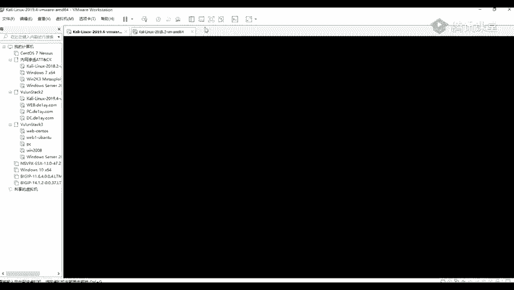

跟那我们进行一个先进行一个登录啊。然后登录之后，我们。在它里面它的一个字典的一个路径呢，我找一下在CB。因啊。USR要刷word list那在这里面就在这个USR刷要 word list这个文件夹里面。

那里里面呢是内置了一些字典，比如说我们一个mateax pro这个框架里面的一些字典，或者是一个n map里面的一些字典等等。还有一些就是一个路径的一些字典，你们可也可以看一下D滴也DI呀。冰12。嗯。

随随便看一个一个吧，梦。我们可以看到这里呢。可以看到他这里呢是一个路径，就是。是一个路径的一个字典。都是一些从就是。一个大部分都是一些英文英文名吧。这是一个小的字典，我们还有一些大的一些字典。比如说这。

这个字点呢就比较大了。原来我们这个。CD我们我我加入的这个CD呢，就是切换路径的一个命令，就是在我们边有。linux下面呢是切换路径的一个命令。我们在windows上呢。

实际上也是可以使用这个CD进行一个切换路径的。

我们比如说我们回到上一局要滴滴。Spo这个切换路径的一个命令。

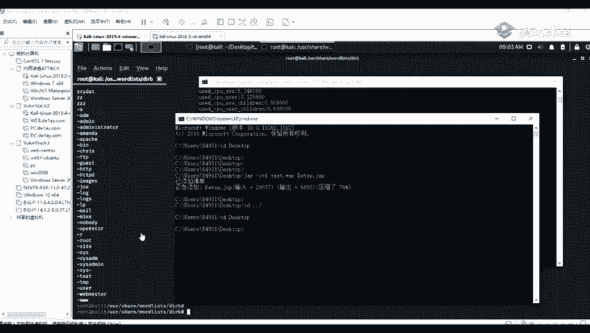

原那我们前面讲到我们的要catca就是查看我们的一个文件内容，跟我们。就是查看我们的一个文件内容，比如说我们ca more。等等。好像是跟我们这个派口走一下。

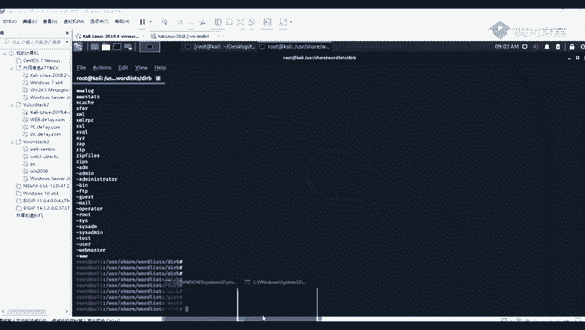

电费。

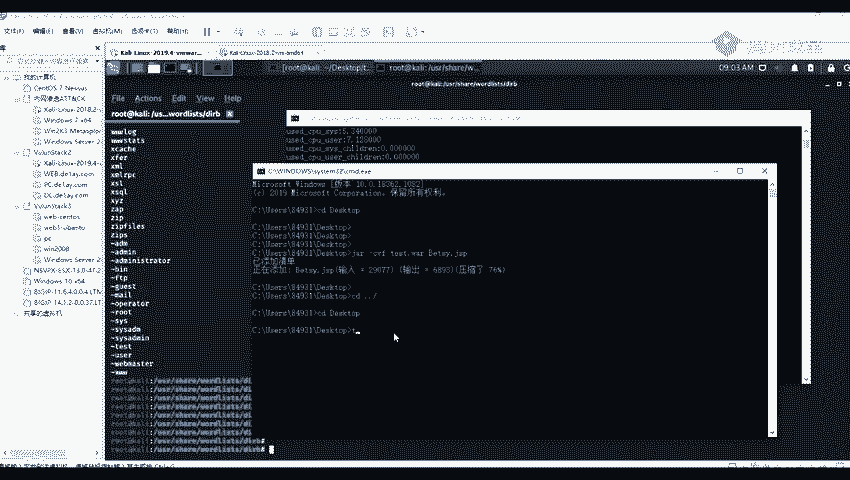

啊。我，跟我们这这个windows上面的一个type的一个命令是一样的一个意思，也就也都是查看我们文文本里面的一个内容。哦，不是。VIVI是编辑，比如说VI也后mo。

我们可以看到可以进入里面进行一个编辑。我们可以对我们的一个我们VI呢是一个编辑器。Yeah。Okay。就我们可以对我们的一个文件进行编辑。我们。开命令呢才是就是查看那个文件的一个内容。

你用VI进行查看也行。因为这个就相当于这个VI跟我们windows上面的一个文本编辑器是一样的。就这样相当于是我们这样子去右键，然后去查去打开。

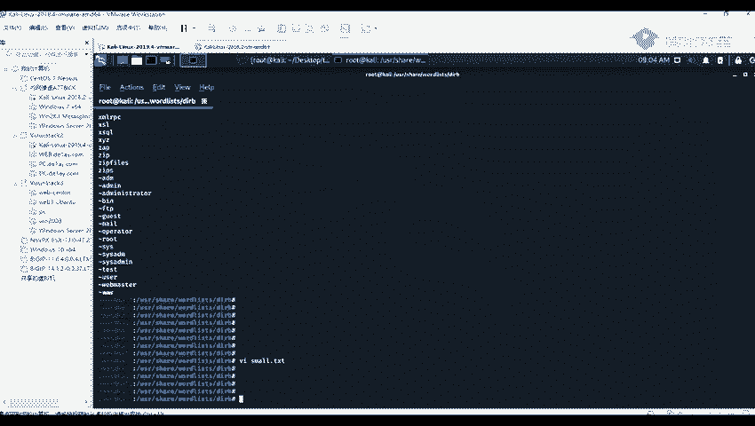

打开之后，我们就可以对我们这个文件进行编辑了。对，这个意思。

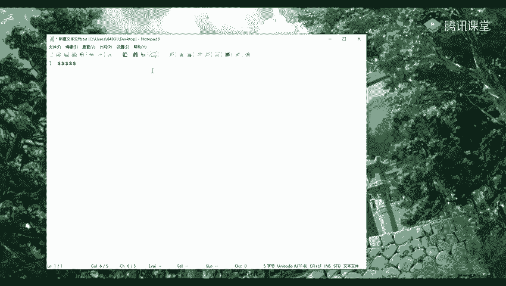

然后我们来看一下，使用我们的一个九头蛇去破解我们的一个用户，就是HHH的一个用户名以及密码。

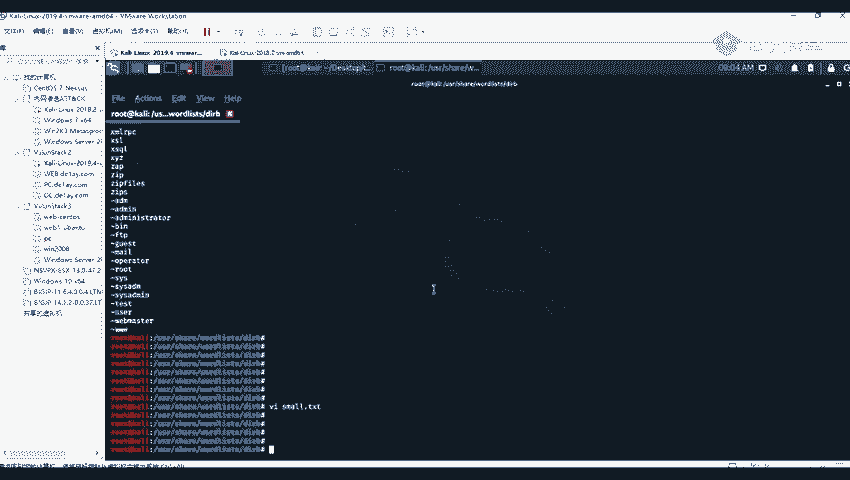

首先呢我这里我我这里呢有另外一台咖里，我们举个例子啊，我这里呢是举个一个例子啊。

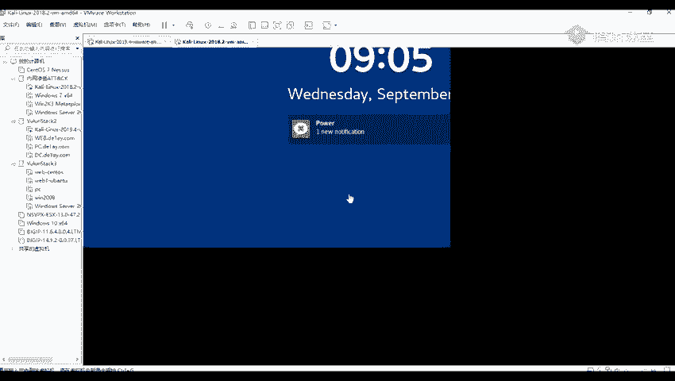

我们在定期收集的时候。就我们在信息收集的时候，我们找到一个就是使用我们的一个nm，就是查看我们的一个端口的时候，我们查看到这台机器，比如说比如说是查看到1个192。168。83。33这台机器。

它开放了这个22的一个端口。开放了这个22的一个端口。那那那么我们就可以。使用我们的一个工具，只有这一个端口进行一个爆破。因为这个这个二的一个端口呢，它是一个默认是是1个SHHH的一个端口。

现在我们就可以使用它进行一个爆破。然呢我们输出于我们的一个命令HYDIA。1杠LL呢就是指定我们的一个就是用户名的一个字典。杠L就是指定的一个用户名字点，如果是一个杠L，就是小写的一个L。

就是指定我们的一个用户名。我们呢因为我们是需要对我们的一个用户名以及密码进行破解的。所以呢我们使用我们的一个杠大写的1个L。在哪嗯。是我们的一个字典的一个路径。因为我这里呢是已经有一个字典了。Okay。

Yeah。그。我我这个po这个文件夹里面，它已经有两个字典，一个是username的一个字典，就是用户名的一个字典。然后还有一个password一个字典。那那我这里呢就使用这两个字点进行一个爆破。

杠151斜杠路的指定我们的一个文件的一个路径。好。Yeah。我们这边指定我们我们的一个路地。然后我们再指定我们的一个密码杠大批。张大飞就是一个密码字典。那到这里呢，我们可以输入我们的一个绝对路径。

也可以输入我们的一个相对路径。相对路径嘛，就是我们可以在我们当前路径上面就是相对于他是在哪一个路径的。比如说我们这里一个相对路，我们这个tos上面有有有两个字点，对吧？

我们就可以是使用我们的一个相对路径点斜杠。然后我们的一个密码字点BWD。我们绝对录地路径呢就是我们指的是在我们的一个根根目录上面就就一路指定到他所在的一个目录。要知道呢，我们嗯。那。让P要跟上字典之后。

我们。在是注入我我们的1个IP，比如说我们这里呢是一个，我们看一下这个IP是多少来着。我们这个ifcomp这个命令呢就是我们在linux上面查看IP的一个命令。

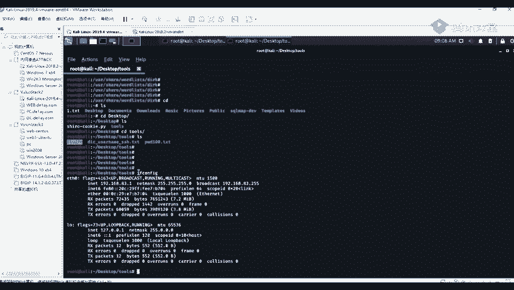

如果是在我们的一个windows上面的话。在windows上面的话，就是ID。

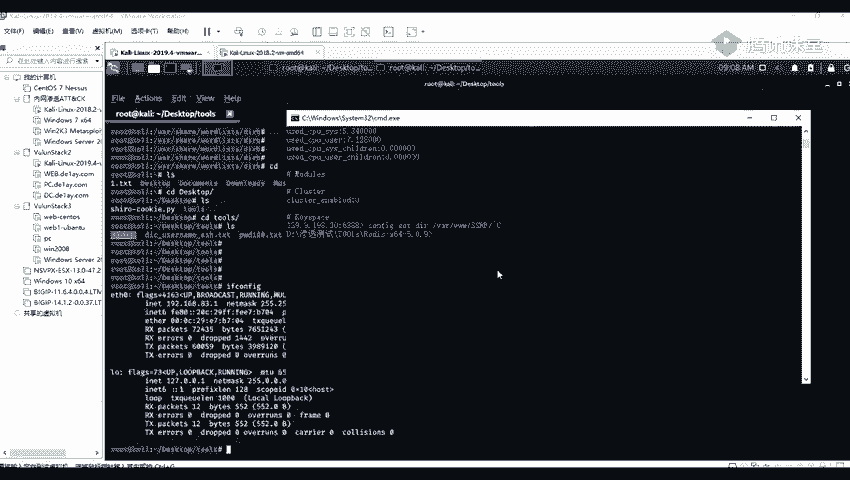

我们另年承拿就是一个A分贝告。我们这里呢有1个192。8168。83。1哦，是这边的机器啊。192。168。83。33。要指定我们我们的1个IP。192。168。83。33是这样子吧。然嗯。

在指定我们的一个协议。比如说我们这里呢是报括一个。SH的也可以指定我们那一个，如果是一个myC口的话，就属于我们的一个myCr口。我们这里呢是一个H。你住啊。之后呢我们这是可以的。

但这后呢我们可以就是加那一个杠F的一个参数。这个杠F呢就是指我们在报破到一个对就是。一个成功就是成功爆破到的时候，我们就自动停止掉。看到我们进行一个回车。那回车之后，我们可以看到他这里呢是爆破的的。

还是比较快的。在这里已经给我们爆破出来了，他的一个用户名in也就是一个root，他的里还有它的一个密码，paword就是一个toPO啊。现在我们将我们报破到的一个用户名以及密码进行登录看看。

那那我们可以看到现在呢是1个192。168。83。1的一个机器啊。那到我们使用我们登录HHH，然后root艾艾就是我们前面所爆破到的所爆破的一个地址，192。168。83。33。192。168。83。

33，让呢我们进行回收。回收之后，他就输告诉我们输输入这个密码，现在我们输入我们的一个密码718。回车之后我们可以看到已经成功进行登录了。那我们查看他的一下他的IP给彭贝。你看到他这里呢。

就是他的1个IP192。168。83。33，就是我们这一台机器里面的1个IP。

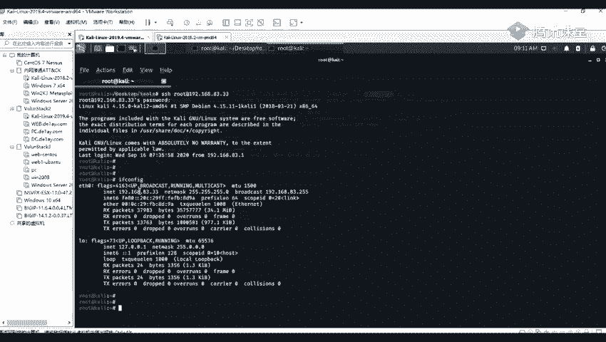

嗯。