# 2024年最强Kali渗透教程／网络安全／kali破解／web安全／渗透测试／黑客教程 ／代码审计／DDoS攻击／漏洞挖掘／CTF - P62：1_Metasploit渗透流程 - 网络安全系统教学合集 - BV1Pe411C7Zb

今天我们来讲呃框渗透测试框架的第一个met split。 meta split是一个啊排名第二的，我也不知道这个排名是哪里的，排名第二的一个安全工具。它能在我们渗透测试的过程中。

帮我们自动化的进行攻击服务端口或者是生成后门木马权限提升权限维持等一些复杂事情。我们在攻击系统服务脚本，比如桑把的永恒之南漏洞，我们不需要对这个漏洞有过深的研究，也不需要自己去写POC，也就是漏洞检测。

利用脚本。我们可以直接使用渗透测试框架mattter s也帮我们自动的进行攻击。方便了我们这个渗透测试的入门。在大家提交的作业里面，我看到大家嗯很多都会用mattaplay，这非常好。

因为他说简单基础流程是非常简单，但他里面所拥有的东西是特别的复杂。即使是啊matplay魔鬼测试训练营的作者蓝莲花的创始人诸葛建伟啊，他也说自己是不能完全掌握这个mattaplay的。

在我们看来确实如此，因为它里面的内容是特别的多。那我们今天就来学习ma splitlate。首先我们需要了解ma split的目录结构，就是里面放了一些什么东西。

matta split就是MSF是它的简称，是高度模块化。这个框架呢由多个模块组成，是最受欢迎的渗透测试工具。对MSF呢，它是一款开源安全利用和测试工具。

它集成了我们常见的系统服务漏洞和流行的s code，并且持续保持更新。现在的MSF已经更新到了6。6版本。那他 split涵盖的渗透测试中全过程。

你可以在这个框架下利用现有的piload或sha进行一系列的渗透测试，我们就不需要关注。漏洞的一个本质就不需要再去调试了，真的不需要吗？其实是需要的。我们如果去自己去调试MS17016。

会发现啊这个漏洞是怎么形成的，自己去调试，也会学到学到很多东西。当然我们现阶段作为一个入门，那我们不需要去花这么多的功夫去做这件事。metta split在卡利里面是自带的那它的一个安装路径呢。

在19年的卡利新版通常是第二个路径，是user目录sha目录下的matta split framework目录。在这里面有我们框架的文件内容。哎，我们来看一下。

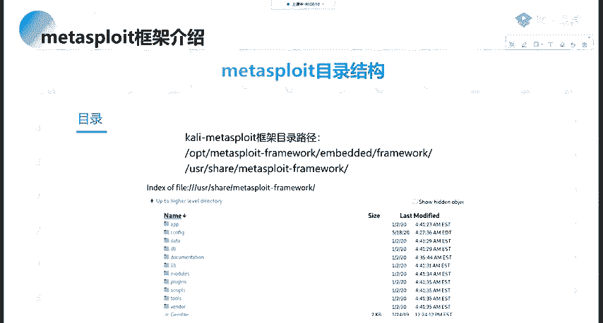

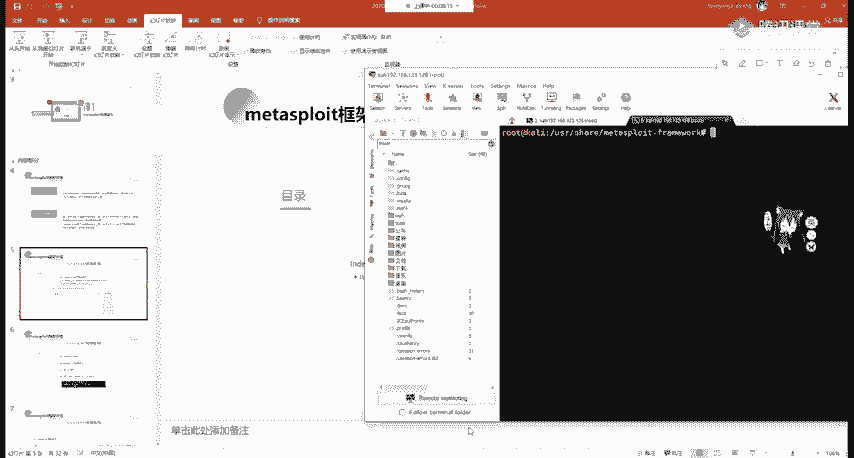

嗯，就在这个在这个目录里面。

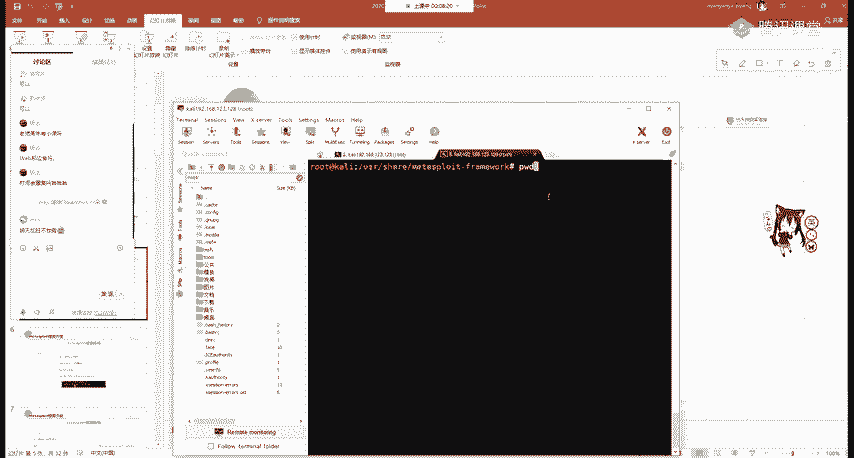

就是它的一些文件。那我们来快速的看一下这些文件是干什么，我们可以使用。

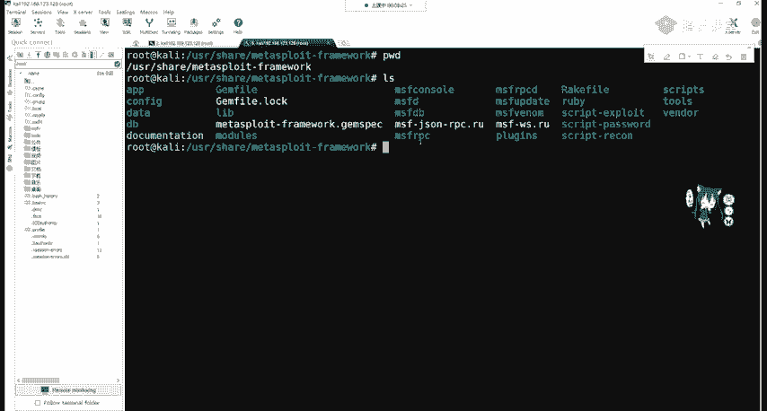

MS console这个是MSF的一个接口，我们是通过它来操作操作MSF杠V version查看版本。如果更新它也非常简单。首先更新我们的IPT get语这个语言大家如果是使用卡里自带的de软的话。

有可能在国内访问非常的缓慢。大家可以去百度自行搜索如何更换IPT语言，更换成净华源或阿里云源进行upate就是更新语言之后，简很简单。

IPT get installstore安装mat split framework即可对MSF进行更新。在MSF，如果大家不想去更新整个的框架，而是利用它现有的一个插件或者是漏洞利用脚本。

大家可以到git hub上面。matetter split的官方仓库进行寻找最近更新的内容进行一个下载，然后移动移动到我们的models这个模块目录即可。这些大家都可以操作，命令不需要自己去记。

因为这些都可以找到。我们来看一下它的目录，也就L看data数据。很显然，它是包含了MSF用于存储某些漏洞的二进制文件和可编辑文件。那documentation这个就是包含了文档。那lab呢是库文件夹。

还有插件文件夹，screens脚本文件夹，tth工具文件夹，还有我们最重要的models。是包含了MSF的所有的模块。那我们对渗透测试自动化利用，通常就是对models里面保存的模块文件进行调用。

那我们来看啊这个models目录里面有哪些东西呢？这些是我们需要掌握的CD的models进行IOS可以看到里面是有7个子目录分别来看一下，那么代表什么。首先辅助模块。很显然，辅助模块就是辅助渗透。

也就是对渗透测试进行前期信息收集，进行漏洞的扫描和探测，包括端口扫描，若密码爆破漏洞验证等。

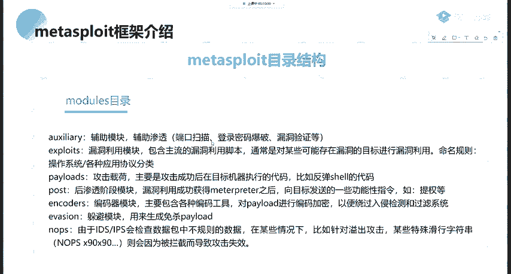

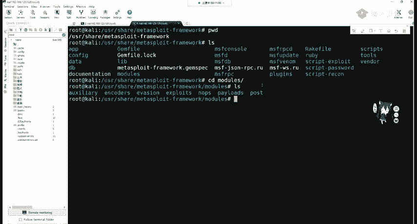

explse漏洞利用模块。很显然，这就是E叉P里面包含了主流漏洞的利用脚本。ps攻击载荷。ps主要是用于攻击成功后，在目标机器执行代码反弹shall的代码。我们不论是渗透测试，还是通过web进行公路。

最终是拿到shall权限，也就是get share shell什么就是我们可以输入命令的地方。就是我们lin操作系统的dash，还有windows操作系统的CMDpos后渗透阶段模块。

当我们进行攻击拿到shall之后，我们会获得mat printer，这个东西可以帮助我们向目标机器发送一些功能性指令，比如提全或者是进行内网的代理路由的一个创建，等等。inco编码器，很显然。

这些都是字面意思，即对拍漏的进行编码加密，编码和加密能够绕过入侵检测系统或者是杀毒软件。躲避模块用来生成免杀的拍lo。Noose。😡，nice是因为一些入侵检测系统会检查数据包中不规则的数据。

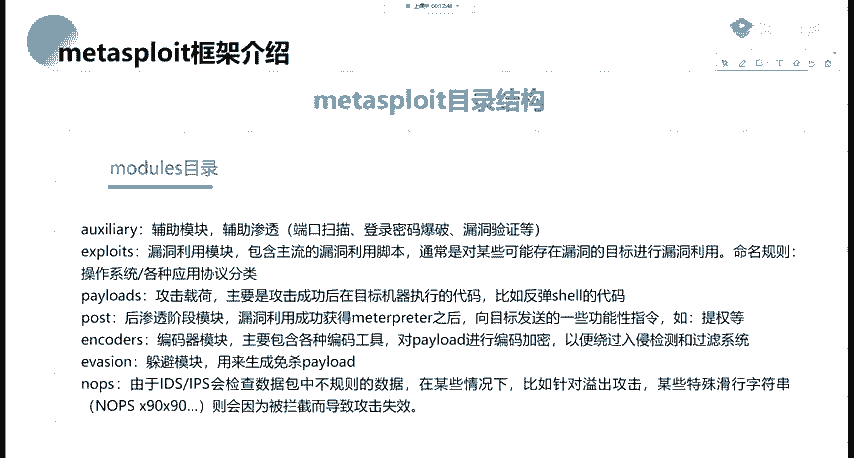

我们这个nopes呢，大家如果学过汇编，应该清楚，在汇编二进制语言中。这个诺不是0000，而是9016进制的90代表汇编语言的nopes指令，它不会执行任何的这个指令。

那我们来看一下matetter split体系结构。也就是核心的库文件。我们通过interface接口是MS console这个接口调用这个。matetter split的核心文件。

这核心文件中基于MSF的mods。这些进行一个调用。

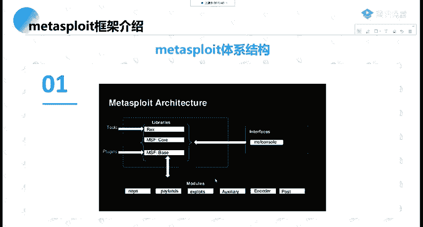

我们首先来看如何进入MS抗松。首先我们需要对数据化、数据库进行初始化。当然这里你如果不做是也没有问题的啊，我们有的时候不需要保存到数据库里，啊，这是也是没有问题的。

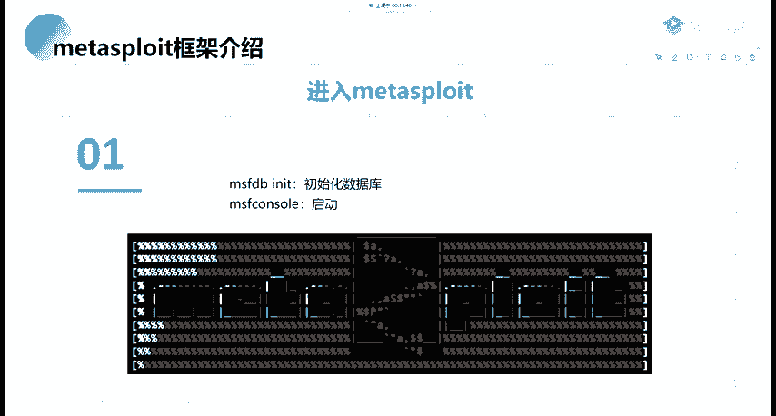

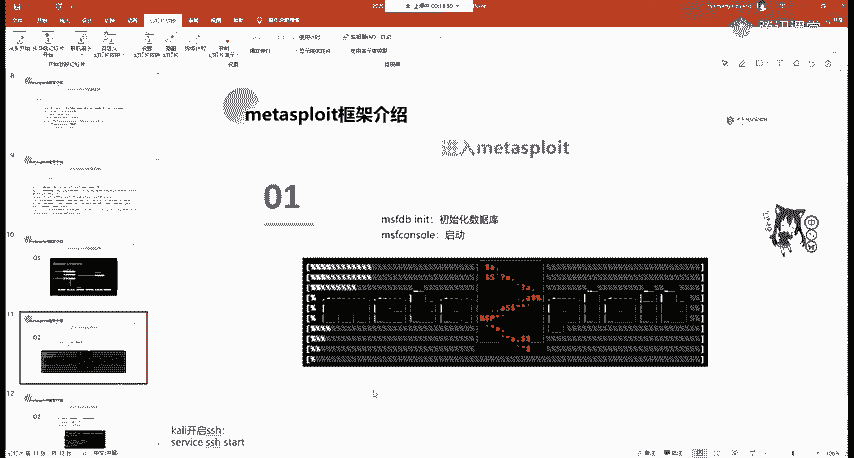

那数据初始化很简单，MSFDB initialit这个就进行一个初始化。

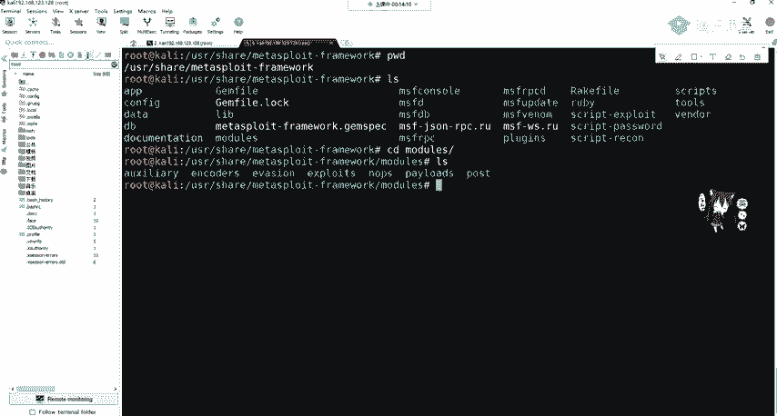

然后在他这里面直接输入MSF console宋进行启动。那这我就不多讲了，就这一条命令。在启动之后，我们会推出shall来到MScon的一个命令行里面，我们来试一下。

这个大家如果。嗯，去做过这个MSF的，应该都非常清楚。

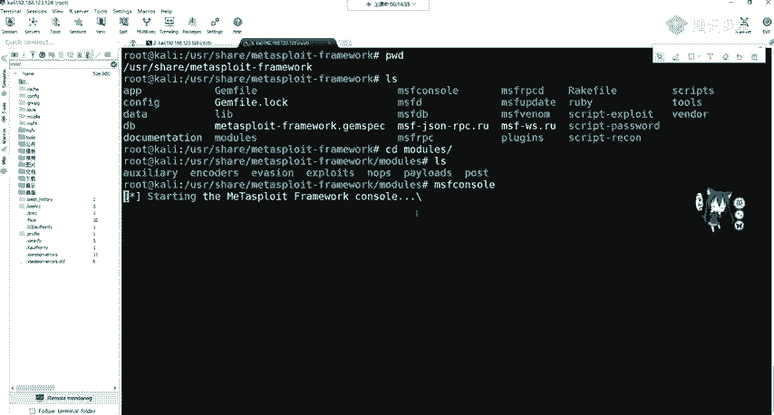

这么我们会来到1个MSF的一个命令行模式。好，我们继续来看。在这里面呢，我们可以输入DBt去查看是否成功连接到数据库，就是连接到我们的。

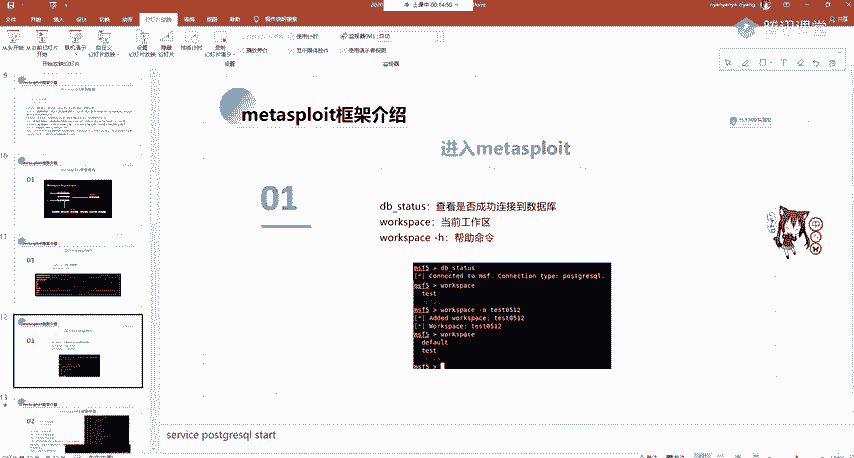

MSF使用的是post gray circle，那我们使用DB。可以看到，已经成功的连接到post gra circlecle，当然这里不连接也是可以的。workspace查看工作区。

我们是处于default，也就是MSF的默认工作区。我们可以进行创建其他工作区，使用workspace杠A，也就是艾创建其他工作区，并且切换至其他工作区。这里大家都可以不做。

因为对我们后续的渗透测试及后渗透都没有任何的影响。

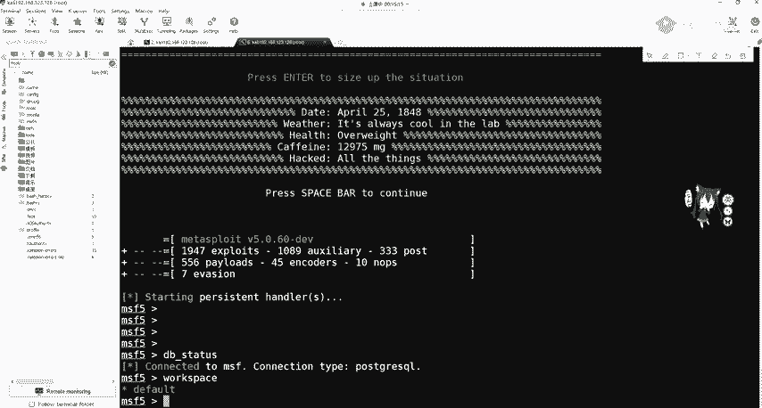

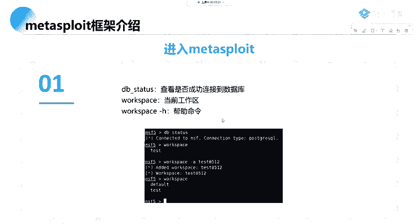

内网主机发现。那这里metta split当然它能满足我们渗透测试的全过程。我们在第一阶段讲到渗透测试，首先要做什么？面试官HR首先问你什么，就是问你如何进行心息收集。

那MSF作为一个全能的信渗透测试框架，那信息收集肯定也缺不了。首先，收信息收集的一个不扰的神器，N map mat split里面也是自带的。

但是我们使用它需要加DB杠N map它的一个使用方法和我们在信息收集中讲的N map的使用方法是完全一样的。只是它扫描之后，会存储到我们的post gra circle里面。

那我们来简单的进行1个DBN麦。还可以看到它有个usage。那个H看到这是我们和这个N map是一模一样的。那，这里我就不多讲了，因为跟我们嗯麦部这个已经讲过了，大家如果忘记的话，可以去。

看一下之前我发到群里的PPT。同时，N map的所有功能，它这里也都分别支持，分别端口服务和版本探测。包括SYN半开扫描，还有TCP扫描。同样也可以调用n map的的参数去检查是否有常见的服务漏洞。

比如SMB445端口的。一些漏洞。在我们信息收集里面，可以不利用N map。因为这个DBM map实际上还是调用了N map工具进行一个扫描。那么我们刚刚在介绍MSF的时候，就已经说过。

M对MSF的操作，主要是依靠它下面的models。mododes里面有辅助模块，辅助模块我们一想肯定知道辅助模块里面有什么，有漏洞扫描，弱口径扫描有端口扫描。那我们是不是可以利用模块进行一个扫描？

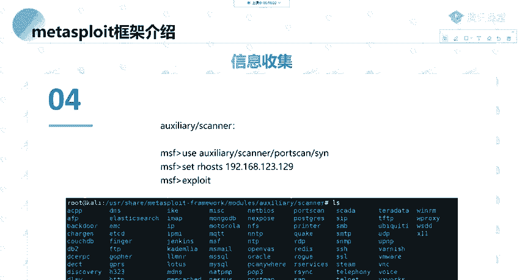

那我们这里看一下。如何去利用模块呢？使用use，我们想用什么？想用辅助模块，辅助模块下面的什么呢？是canner，我们需要扫描扫描什么，扫描端口。是吧这些都是一些常见的一些英语。我们使用什么草描。

你不知道的话，直接按t，按table它会告诉我。告诉我们，我们可以使用半开扫描是什么SYN对它是不会在我们服务器上留作留下痕迹的一个非pin扫描，也就是只发TCP的第一次握手包。如果你不知道的话。

也非常简单，使用search。测试port scan，也就是端口扫描。So。他会把这些可以用到的models都为我们列出来。那我们回到刚刚的use这个半台扫描。在来到办卡扫描之后，我们需要对。指定IP。

也就是目标机进行扫描。那我们这个叫做设置。我们想看这个模块需要我们设置什么，就是查看设置show options。Show options。那这些。那这些我们来看一下我们需要配置的。

pos这指定的是1到1万。areho这个叫目标目标的地址。那我们需要设置目标的一个地址，后面现程。延迟OK这些，而且最大的一个端口数。那这里我们去设置它的一个。目标机器它的1个IP地址。

我比如是扫描这个winI7，我们来看一下它的1个IP地址。啊129，那我们可以设置一下它为129。然后进行run，它就会进行一个扫描。那这里因为时间去过长，那我这里就不做扫描了。

当然你也可以进行一个现程的一个设置。比如20线程。OK你再去看一下这个配置，也可以看到这里已经变成了20。

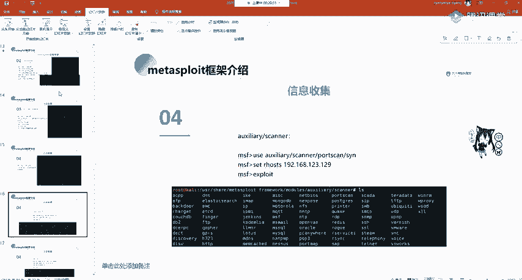

启动模块使用的是exloode攻击或者是run运行都可以进行扫描。它们两个是一样的。那么我们对。端口进行扫描，同时是不是也要对目标机器的C段进行扫描？C段扫描可以用什么？可以自己写脚本P。

可以利用CW scan，可以利用Nm自己带的这个参数进行一个内网探测。那同时我们。MSF肯定也提供了这个探测一个收集模块，也就是discovery发现。他同时同样也在我们的辅助模块下面的canner。

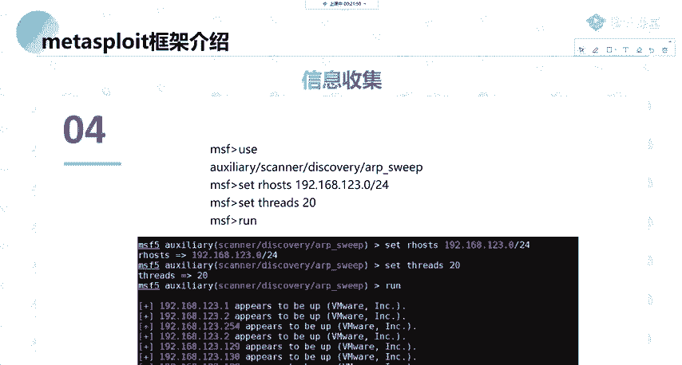

里面的一个内容。那我们这时候就可以进行一个搜索搜索。Search。不Dcover。那，这里我就直接用，我可以返回到或直接在这直接用，或者是返回到上一级。use我们的辅助模块cancanner。

Discovery。然后我们可以按t键，可以看到我们可以使用哪些东西进行一个主体发现，可以使用UDP或者是LRP。那我们最快的最常用的肯定就是LRP了。可以s options进行一个查看。

这里也需要我们指定一个目标的机器，延迟，包括线程。然后run就可以对目标机机器的一个C段进行扫描。这里大家应该没有问题吧。啊，我们继续来讲，因为这个流程还是要过一遍的。大家如果听好之后。

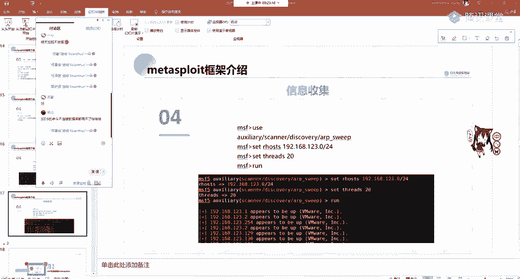

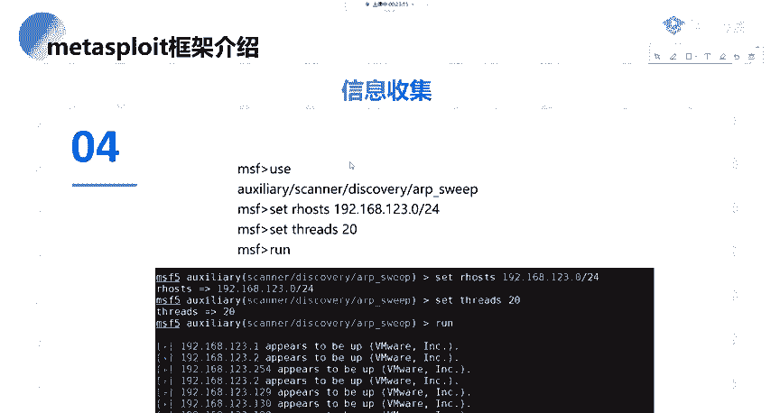

可以进行手中的一个操作，这些就是一个渗头测试的一个流程。

