# 2024年最强Kali渗透教程／网络安全／kali破解／web安全／渗透测试／黑客教程 ／代码审计／DDoS攻击／漏洞挖掘／CTF - P65：4_msfvenom介绍和使用 - 网络安全系统教学合集 - BV1Pe411C7Zb

这里我讲的都是一个整个的流程啊，不可能是利用两节课，或者是利用一个月把这个mat split给大家完整的讲一遍啊，这个是不现实的。因为它的东西实在太多，只是个流程，大家要清楚，大同小异。

我们不是做安全研究，不需要去深究这些漏洞，当然研究一下还是非常有意思的。如果大家想有有兴趣的话，可以去网上搜索一下MS08067，它如何调试它这个漏洞是如何形成的。啊，这也有书籍，还零带流动。

他会讲这个东西，也是非常有趣的。啊，我们继续来看攻击windows或者是linux操作系统的一个实例。嗯m split是支持全平台的，它不只能攻击这两个操作系统。

也可以攻击我们mux架构的路由器公共设备安卓手机或者是呃一些mac OS这些类linkux操作系统都可以进行攻击。所以它十分的强大。首先我们要看一下MSFV known，也就是。啊，嗯。

毒病毒毒液的意思。他生成了一个后能。MS win是MS pilotload和MSMSFin的组合，这两个工具集成在一个框架实的种。那他们两个大家应该还记得是什么吧，一个是攻击载合，一个是编码编码和加密。

也就是一个负责攻击一个负责绕过杀毒软件或者是IDS。这两个工具集成在一个框架中，形成了MSwineno。也就是用来生成后面的软件，在目标基础上执行后门在本地监听上线，可以理解为一个远控木马。

OK它就是一个生成木马的软件，我们只需要那利用的思路大家要清楚是什么，找到漏漏洞点，用MSV known生成木马，将木马想办法搞到把它上传到我们的靶机上面。让他下载也好，你主动上传也好。上传到靶机上面。

在靶机上面运行。在运行之前，我们需要有攻积金去接收它，那它运行我们就可以控制它了，也就拿到了我们的mate printer。那这里我们首先来看一下呃如何生成我们的后门。

它基本参数我自己在学习的时候是非常不喜欢看这个杠hel制定的。因为他把这些参参数丢给我，我也记不住，记不住怎么办，没必要记，也没必要去看，你只需要多用两次，知道这些常用的。你知道常用的。

你不知道是什么意思也没有问题，就多用就是多做。说了再多都是要经过实战。如果就是一直去到岗位上实战，那你诉这个能力是得到飞速的提升。那这里的参数还是给大家稍微的过一遍啊，带一遍。首先，杠P。

那MS win是pload和incode的一个组合。那么它最重要的不就是incode和拍load吗？那我们只看他们两个刚Ppiload就指定Pload攻击载和支持全平台啊，这不是几乎了，就支持全平台。

那LO这个是几乎所有的这个命令都有的参数list列吗？我们的in课的在哪？杠一英刻的指定编码加名方式。啊，我们常用的。我们对不同的平台，它有不同的操作系统，有不同的系统架构。

那么们需要指定系统架构杠I什么是系统架构叉86系统架构mps IM是吧？IM你的安卓手机IM架构，苹果要新发布的miccro pro IM架构。那我们通常用的windows操作系统。叉86架构。

你用的乌乌班图，用的卡利叉86架构m4。法山的设备。啊，有的是用米普斯架构，但有的是叉86。啊，planform很显然指定目标的操作平台，你是NT操作系统，windows NT还是还linux操作系统。

还是m克OS这都非常简单。那我们接下来就都不看了啊都不看了。大家还要有一个注意的，就是刚阿设置编码的次数，编码次数如读越多，那还就是对这个拍lo进行几次编码。如果你不编码就是一个木马文件。

别人一看杀的软件一下就给杀掉了。你编码的次数越多。他刷的软件越看不出来嘛，并不是。杀毒软件它是根据一个特征码进行识别的。大家要知道，每个文件都有MDO码，它病毒肯定有一个关键的算法，它有一个特征码。

它是根据这个东西给杀掉了。你编码次数的多，不代表就是绕过理论上是绕过杀软的可能性更高，但实际并非如此，因为现在杀软也非常牛逼。比如火容，它就挺好的，是吧？挺好的，但是他的故事所有的东西都很懒的。

那我们就看这些参数，其他都不看了，用到不知道自己去搜啊，自己去搜。你说能记住是谁也记不住。那这里就举三个例子，分别是linux windows和mac OS平台的排load。

MS文文这个命令杠P指定我们的一个piloadpiload指定指定什么linux啊，linux叉86叉86加构，我们要干什么？要拿到met operator。使用reverse TCP。啊。

反向TCP也就是反弹sha反弹sha这个地方啊指定其他两个参数。那么反弹shall刚刚在做M17010的时候，我们使用的什么是windows matter reserve tCP我们需要指定什么？

指定local host和local pot，也就是我们目标要在哪一个目标机器上开启计听呢，肯定是我们公击机啊，也就是local啊本地目标本地地址。那下面呢logo po我们需要在哪一个端口上开启。

服开启简听。啊，开启舰听杠Ffire。啊，你指定你输出的什么类型。ELFEFF是什么？ELF是linuxux操作系统的可执行文件，包含了可重现重定向文件、动态连接库文件和普通可执行EF文件。

相当于我们windows操作系统的DIL和EXE。这两个在window操作系层它，我们统称它为PE文件。而linux操作系统操作称为E还有F文件称为EFF文件。好，这里。没有问题吧。

使用大于号重定从定向符定向到我们的shall点EF这个文件。那么shall点EF其实就是linin操作性统的一个可执行文件，一个码。那下面您公司第二个也非常简单了，就是不一样的。

就是ban的TCP是主动连接正向正向shall正向shall。OK这个我就不多讲了。那下面windows套统很简单呀，把linux改成windows就行了呀。一样的是m克，那很简单呀。

改成mac OS OS麦 OS是什么OSX呀。如果你有macbook的话，肯定知道呀，就这样OK。它使用主播不是matepre，是使用shall reverse gCP你这里不记不住，search一下。

啊，list一下或者是。tile一下都会出来，再不知道去百度看一下，它肯定都存在。在这里。嗯。攻击手机、无线网络、电脑这些不在公网的东西。那我们需要先找公网的东西啊，你不可能直接打断内网吧。

就像我现在讲课，你用你的电脑能打到我吗？不能打到我吧，我是内网IP。我的IP是内网的，你打不过我的，你打到我，你要穿透呀，你要找我们公司的公网。找到公司公网的漏洞，一层层的打进来。进行代理。

进行逐步代理，进行内网穿透，最终打到我。那这个过程是非常复杂的。但是我们渗透测试要做的就是这个事情，就是一个内网的渗透。在第一节课或者是开课的胖白老师也有可能跟你跟你讲过。

那个web和渗透的区别就是我们渗透需要做内网渗透，啊，就是这个区别。你加I加多少次都被秒杀，这是嗯不然那IDS那么贵。嗯买了都扛不住，那还卖什么，别人都不买，要花那么多钱去买RDS结果什么用都没有。

是吧？那现在的棉纱。你这样做他的做IDS的，他就会把这些生成出来是执行那个去确定它的一个。

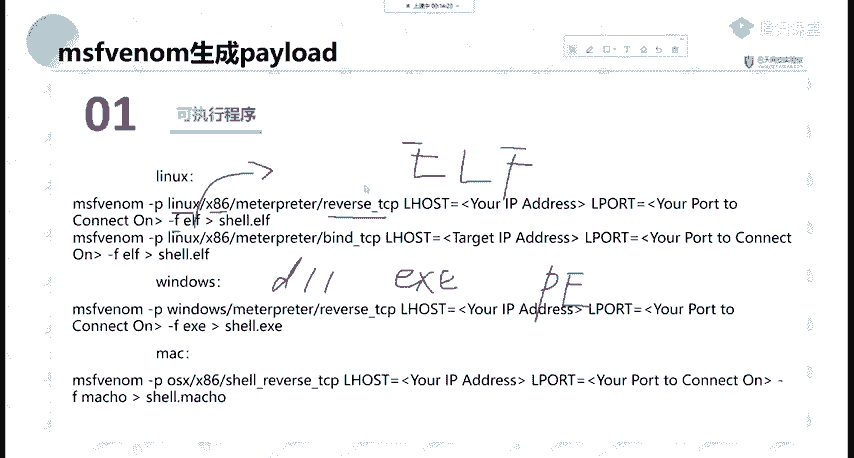

特征码进行一个查查。那这里我们简单举个例子。使用杠P指定我们的windows。windowsmate resolve TCP指定logo host logogo po当XX是指定模板。

现在我们想生成个木马，你这个木马什么功能都没有是吧？连个图标都没有，别人一看，你放在邮箱上面，别人敢下载吗？肯定不敢下载呀。那我们可以杠X把一个把一个已经正常用的。比如说系统更新。

比如说PP study，你作为一个伪装啊，作为一个伪装，作为一个模板，也就是。他一看，即使它伪装正常功能已经已经错掉了，但是它的大小还有图标是一样的那就可以进行一个呃社工对方。

相当于呃杠一刚刚已经说过了编码叉86。啊，这里编码我就不多讲了我就不多讲了。因为它真的没有什么用。就像刚刚那个同学说，你刚阿里多少次都没有什么用。当然你可以进行一个多次编码或者一个循环。

或是编法之后再利用其他的进行呃加壳呀或者一些进行一个综合利用，还是有一定用处的那这里我就不多讲了。因为它编码速度非常慢。我们这里虚拟机都是没有IDS的OK那我们这里简单进行一个生成一下。现来生成一下。

M埋SFV。好杠P指定我什么windows。matepri。Rese TCP。指定什么？指供我们的logo house。等于我们本地的地址。locgo pot这里等于我们就比如说5555啊。

你不要设80什么的，有可能会冲突啊，有可能会冲突。然后进行一个什么，我们不编码，编码大家可以自己去查看incs。我可以说除了那两个特别有用的，其他的基本现在。啊，用处不是太大，除非综合编码。

你有可能用到用到的时候再去看，你不可能把那些编码都记住吧。哦，我记不住OK那我们记不住我就不看。那刚F输出输出什么？这里我们输出ESE啊，EX你就直接写ES重定项比hello点ESE。

再让他这人生存着吧，生存着。😊，熊晨，那这里我们要干什么？要开启监听。那金厅如何开启？这里给大家讲一个叫做。expl里面的mty里面一个叫hander，它会等待我们就是一个监听，我们要使用这个模块。

使用这个模块。是指定一个piload。那这里我们不指定它其实就是一个等待的一个握手状态。那么需要指定它的一个piload。那3个pi load我们这边的piload要和什么？

要和我们这个木马生成的这个piload是一样的啊，它已经生成好了。那这里肯定有个piload。😊，点ESE啊，肯定是跟这个是一样的。那我们直接把它复制过来。知道吧？要开启静听。复制过来之后。

我们来看一下需要指定什么，指定logo po logogo po指定为什么，肯定跟我们M5vi这个是一样的是一样的。那我们来s一下设置设什么local host。19号点168。点123点128。

Logo， local park。lo设置的是吗？是555555啊，我可以run一下，或是E叉Pexplexpl杠G放在后台，就是你不会在那一直等着，你可以去操作其他东西。放在后台。他会告诉你。

starud reverse TCP handleer有个TCP的监听，现在555端口。那这个监听他这个工作它是不工作他放在哪，放在后台工作jobs，我们看后台输入jobs可以看到它。是一个等待连接的。

反向TCP端口正在监听。那我们这时候把这个ESE放到我们靶机里面进行运行啊，放在我们靶机里面进行运行，然后把它拖到靶机里面吧。我这里一会儿再给大家大家讲怎么如何攻击啊，把它给拖到靶机里面进行一个运行。

😊，hello点ESE然后先脱下来啊，这里已经我们已经拖好了，也生成好了。把还拖到8G里面。嗯，这个8G可能有一点卡。谁没拖进来呀。OK他过来了，我们双击他。呃，他是64位的，是64位的呀，我搞错了。

这里应该是叉86叉86加购。应该是叉86的。那我们看一下是哪一个，我给搞搞混test一。那我们生产的这个嗯运行应该是它为港测。可以，那我们重新生成一个吧，重新生成一个。指定我们的叉86。

那这里持续的开启监听。啊，他是没有的。没有的那我们利用这个进行一个查看。

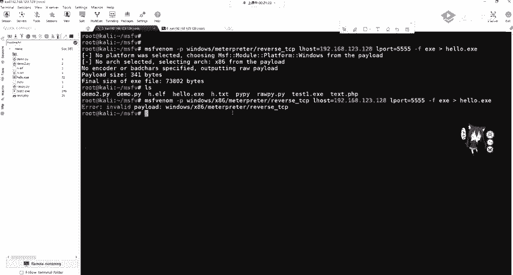

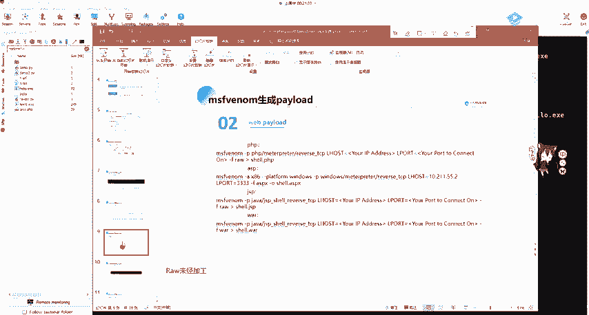

可以使用杠Lpiloot列出所有的pilos。然后GREP是GIP是什么？是我们的啊一个正则查找，查找我们想需要的内容。

然后使用I week这个字符的一个寻找print到了一可以搜索我们想需要的pilo，那直接把它给复制过来。搜索我们的windows pilot。OK这个因为他这个。冒号就是有问题的。

我们只需要把这个办的TCP给改一下。改成我们的windows。这时候我们就能看到它windows应该有哪些H叉P可以供我们用啊，供我们用。

这里有windows materesve hTPres这个这些大家可以看一下。

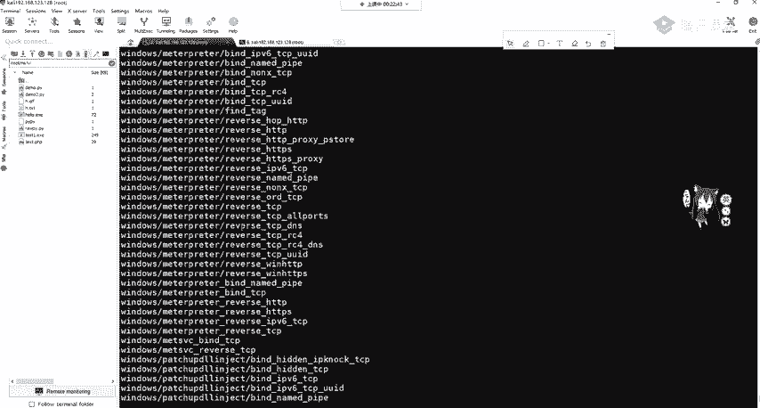

啊，只是给大家过流程。那我们呃用这个机子，有这个机子上的啊。我这个节子上。O。

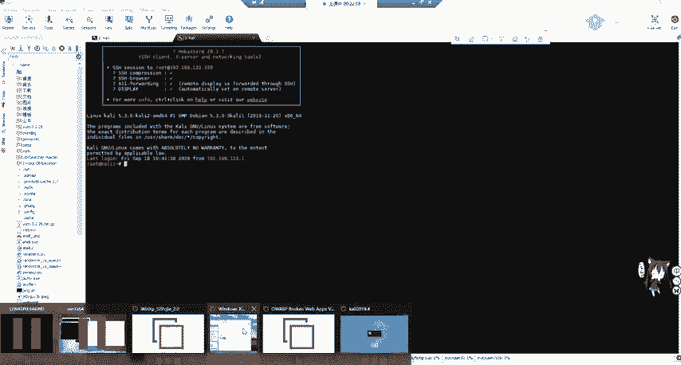

嗯，稍等一下。

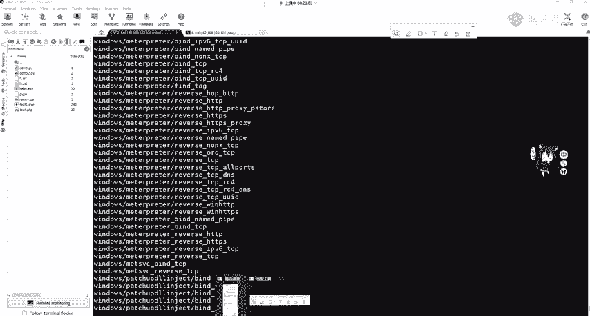

那我们先。往下讲。向我看讲。那他。做的这个是生成木码，我们就是要想办法。那这里刚好马上给大家后面讲那个真正攻击的时候，刚刚给大家补上这个可能这个编码有问题。这个嗯给上传到我们的靶机，上传到靶机之后。

公击机开启监听，开启监听，也就是等待我们的shall弹回来。这里设置的内容tload Air airpo一定要和MS win这参数是一样的，然后进行run进行等待连接。我们要上传到靶机，然后进行运行。

上传到我们target然后进行运行。啊，这里大家应该都没有问题，相信。啊，这里我们来解释一下。这个就是MSwin，可以帮我们从大量的这个有效载合，也就是piload里面进行合并。

我们需要指定piload和回联主机的端口，主机名和端口文件模板文件。当然我们模文件可以不设置输出格式及编码。那我们最需要的是哪一个一个输出格式，一个配置，还有piload，这些是必须的。

那我们一开始us的这个expl multi handleer是一个负载处理程序，也就是等待负载链接。我们最后拿到的matetter plate是mate meta split的后渗透利个工具。

可以通过创建一个新进程，并调用注入的DFL动态文件动态装载库，来让系统运行注入的DIL文件，也就是运行我们刚刚的getULDUID或者是打开摄像头等等。那这里可以生成wevo牌的。wiropl及我们。

木马只要去运行它即可，也就是web shell。可以生成PHPSPGSP还有m博应用。那这里分别使用PAPPmate reverse TCP。

还有我们的SP就是直接使用windows的一个mat printer。那这里大家可以看到我们PHP使用IIW进行输出，而ISP使用ISPX进行输出，这是为什么？IW的意思叫做未经处理。

大家如果使用相机进行拍照。拍出拍出来的未经处理，保存明暗信息的就是RIW它是无损化的。那PHP这里很显然就是生称PAH3嘛。那有没有PAAPP这个模板这个输出模板没有的啊。

我们要以这个RW未经处理的模式进行输出。那这里我们可以生成一个shall点PHP，然后进行回联。

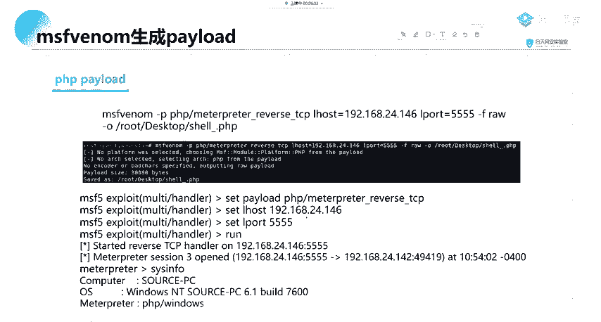

啊，这里给大家简单就做一下这个吧。

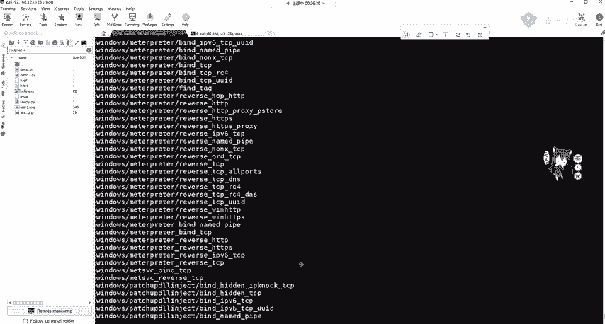

I直接。

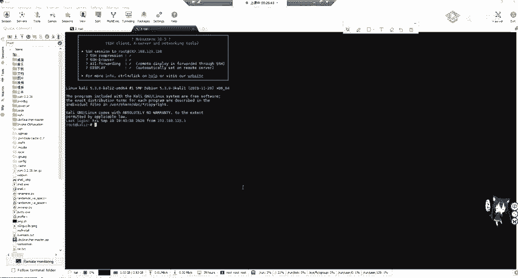

这个直接你复制过来。

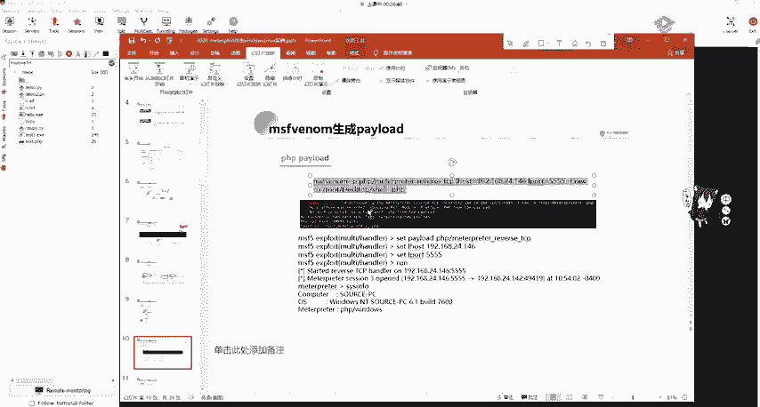

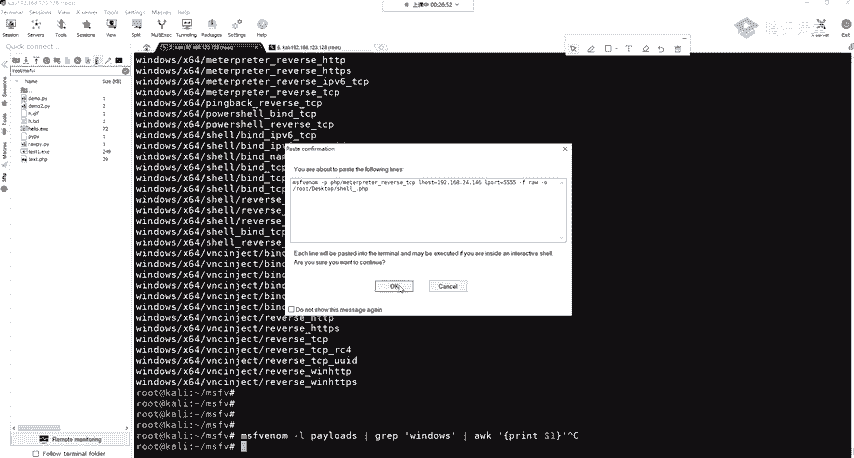

可能让他运行，因为我们这个是不对的。128。55PHP生成的一个木马文件，就在就在这个地方生成吧，就A点PHP。然后我们将I点PAAPP上传到。把机的HTR3W目录下进行运行。

它就可以拿到我们的shall啊，就可以拿到我们的mate。嗯，这里我们还是做一下吧。这个I点PAP已经生成好了，我们把它先移到本地。I点P。那你可以可以查看一下哈。OK他其实就是。

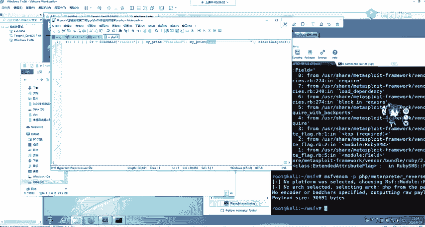

调整一个呃socks。socket进行一个连接。那我们这只是给大家讲上传到这个地方，然后我们进行一个访问，尤其在本地访问。这个变得特别卡呀。

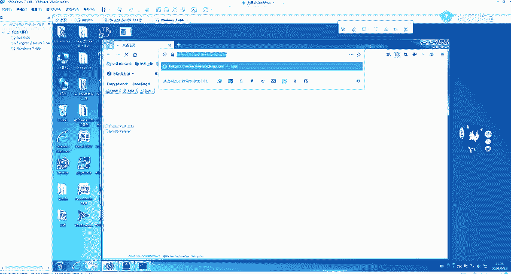

27点0。0。1A点PHP。进行访问之前，我们这边要干什么？这边要先一个啊监听。要先监听。这里我们还是使用这个my handle，只是我们的拍load呃发生了变化。我们使用我们的这个。在排楼。

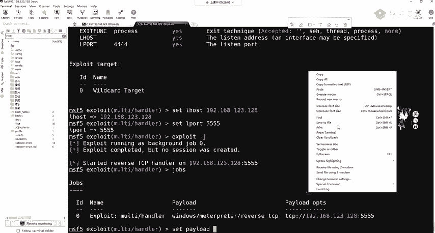

你粘贴过来。然我们 show options。我配置我们的airho，还有airport，这里是555是没问题的。然后我们run一下。嗯，他会告诉你，你已经使用了这个无5端口，那是哪个使用的呢？

肯定是我们刚刚那个搞的鬼呀，我们把它jobs。杠QQQ什么Q0，把这个给停掉。OK这时候都没了都没了。那我们把这个 run起来。OK现在它在监听55端口，那我在这边啊运行一下。

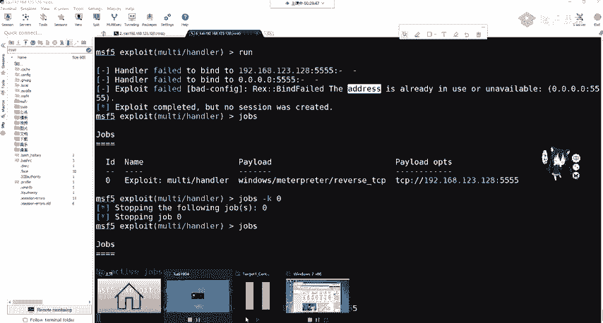

这个I点PHP。我们看这边。你好稍等一下，因为他在打开这个袋。What。那PHC的关掉了吗？没有关呀。😔，嗯等一下，我把这个服务给启动一下。这个容易被查杀呀，这并不并不比小马小马也容易被叉杀。

这些都容易被长杀了去查杀的。那我们运行一下。还不行啊。这怎么？总是加这个东西。

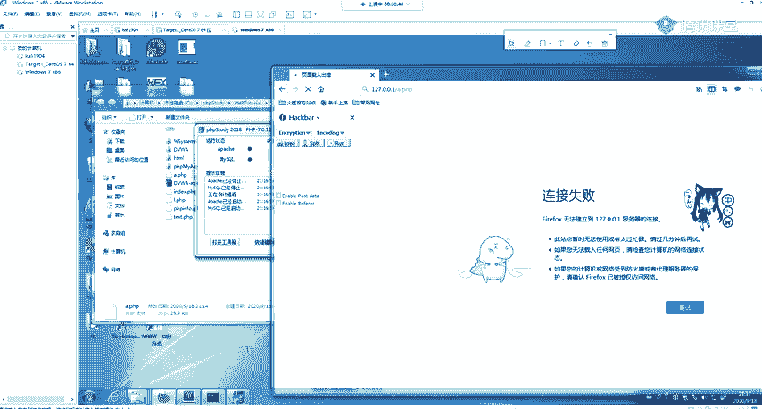

O。呃看到这边还在转，但是我们这边是不是收到了session来到了这个materate里面。OK来到materate里面。是不是来到这里面了？可以看一下。

ad administratorist可以back把它放回去呃， sectionction一已经是1个PB呃m已经拿到了。那这个就是作为一个攻击思路，你可以在那个靶机上面上传啊。

利用文件上传或者是啊文件写入，你去或文件包含进行把它执行。那我们就可以接收到这个mat，就可以接收到这个mat。

这个大家应该都没问题吧。这个就是常用的思路。有reverHTEP就是在巴黎的端口呀，有个TCP是你自己开那一个端口呀。如果就是你的那个服务器。就是怕被查插的话。

你可以使用rere IDGGP它就是端口不同啊。一个是HTTP协议，它80端口，1个TCP，你自己指定TCP端口，可以指定555。OK这些马上都会讲。呃，这里拿到了我们的we padd。

那同样可以使用脚本pilopython dash和PER这个一些脚本的一些这些很简单，就是修改pilo即可修改成pathon mat create diverse tCP然后还是指定我们的logo host logogo pot dashash是CMD啊。

这里。有个 space。这里杠F大家要知道是生成RIWRIW。如果你生成passan的话，你可以自己去看生成passin的话，它生成的是sha code。其实它并不是一个脚本。要记住这是RIW。

大家可以自己去试。

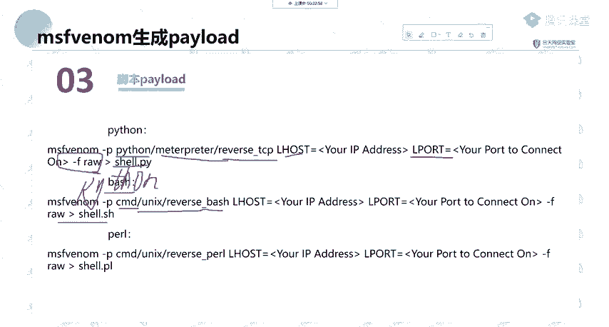

然后如果我们去设置这一个。生成MSF归定之后。我们在。公击机上开启监听，开始监听赛 plo拍lo是什么？赛 pload时是他赛lo house是他cycl logogo port是它一定要完成一样。

然后我们进行runrun之后，将它生成的这个pathon shell啊，pathon shell我们给复制到我们的靶机上面进行运行，就可以拿到我们pathon mat operator。啊。

这是同样道理。那大家再去查找，包括刚刚那个同学说的这些有什么区别啊，这些palo有什么区别？那这里啊给大家讲东西。😊，我，刚刚在设置的时候。这里大家应该都有哦这个问题啊。

比如看到这个windows叉64mate reserve tCP大家要记住这个再看上面windows叉64mate reserve TCP它跟下面有什么区别？是不是就少了中间一个杠？

那这个杠是什么意思呢？这个告你觉得他们俩个英语是完全一样的。其实它在MSF里面是不一样的东西，一个叫做分段排load的，一个叫做不分段排load的。那我们来看一下他们分别是什么？

这也是给大家就是做渗透的时候一个。

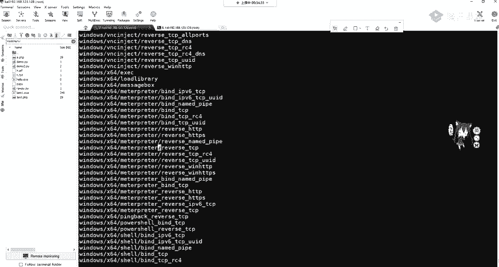

呃，讲解。因为这个如果你用错的话，你会发现你接受来m。它经常断掉，就是你正在配置路由突然断掉了，那就很难受是吧？很难受，那就给大家讲一下，就合理的使用这个tagtagless和t的这个排lo。

那拍漏的分为两种，一个叫做分段拍lo。也就是刚刚看到杠比较多，一个叫部分段拍lo的连起来的。这很好理解。那连起来的也就是windows meta没有杠reser tCP，它其实呢就是一个二进制文件。

它包含了matepre所有必式的部分和必要扩展，全部都捆绑在一起，也就是一个完整的排load。而分段的呢，它只是它的功能只是建立一条与攻攻击者之间的网络链接，其他的什么事情都没有。

然后我们获取到了m printer是另外一个阶段，也就是它会传resve TCP80TCP等等。那如果你不能理解的话，那。部部分段的和分段的那就相当于不分段的相当于我们web里面的PIP大码。

大码是什么？你不用web share管理工具，你一连上里面可以查看目录，可以执行问命令，可以上传文件，甚至可以齐全等等，功能很强大，但是它体积庞大。那不分段的呢就是小码，小码是什么？

一个ever一个stem，一个assert就一句话，这一句话你连上之后有什么用吗？没有什么用，你是不是要给他传参数啊？是不是使用外we shell工具啊，使用一键是冰线去连呀，就这个就这区别。那很显然。

他是他他这个嗯这个你看一下吧，这个分段和不分段。那很显然有什么区别？PHPIP就拿PP大码来说，它用人干什么？是非常的大的，我们上传文件一一般会做什么限制，是做一个大小限制。

如果这是一般的文件上传都会先做限制的吧？如果你不做限制，你服务器只有20GB的硬盘，我一个人上传40GB再上去了，它也不是木马，那你这个就相当于低多少次攻击了，是吧？😊，那他肯定要做一个限制。

不做限制呢，大码就没用了，让那小码就判下用场了，但是小码要用用用用有一个缺点，你小码干什么？你要用web share管理工具，we share的一个。原理就是像传入，就是像ever函数。

像system函数传入参数。那你这个网络是不停的在连接，那你中间如果网络断了怎么办？是不是就断掉了，就不稳定。这是小马的一个缺点。那大码却大码的优点啊，你什么都有。一切东西都是在服务端进行运行。

你跟你跟你的公积金没有关系，你这个网络不稳定的时候，你就考虑断码啊，这个也是一样的，网络不稳定就考虑不分段了网络稳定分段的好小，而且不易被查杀，大码肯定容易被查杀。OK那这里大家应该都没问题吧。那这里。

😊，这一些参数给大家其他参数可以给大家简单讲一下，一个是保持的一个监听端口的存活，还有是防止进程被插死，这些都不用记啊，不用记。还有一个是放到后台的一个。呃，session这个PPT会发给大家。

到时候大家可以试一下。

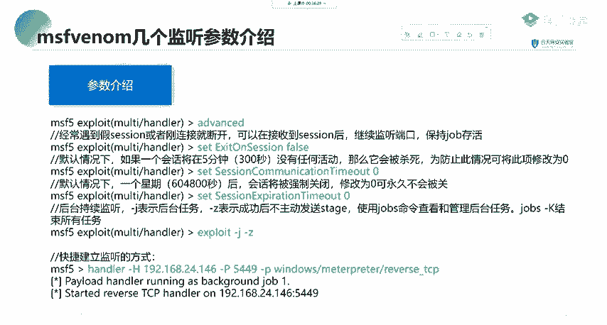