# 2024年最强Kali渗透教程／网络安全／kali破解／web安全／渗透测试／黑客教程 ／代码审计／DDoS攻击／漏洞挖掘／CTF - P66：5_msf攻击windows实例 - 网络安全系统教学合集 - BV1Pe411C7Zb

那我这里就讲一个啊例子，就是攻击windows这个实例。让大家看一下吧。targe attack的IP我这里都写好了。那这里我们来看一下方法。方法一，我们的突破口在上一章中讲。

突破口基本上都是web或中间线的突破口。也就是说，我们可以通过外b站点。外gle站点可以干什么？可以通过命令执行、漏洞、无文件的方式进行攻击。或者是使用上传点进行上传web share进行攻击。

上传web share这上传什么？上传是不是刚刚我们那个MS winwin这个生成的这个码。第三，可以攻击其他的端口445M17020拿到matepri。总结来说就这三三种。那我们首先看方法仪。

在发2一之前，我们是要干什么？是要对端口进行收集。我们需要知道它哪开了哪些服务，哪些端口，开80端口。那这Mm我就不跑了。S这跑时间很长。杠SV大家还记得吗？

探测版本杠T4第四速度探测加上它目标地址或网段进行探测。探测之后，我们可以看到开到80端口，开了445端口。开了3306，马是不端口。并且操作系统是window操作系统。那这时候我们可以进行渗透。渗透。

我们首先输出来突破口是哪里？80，为什么？因为80端口是漏洞最多的端口OWSPtop10都是80端口漏洞，对吧？都是外部漏洞。搜狗注入叉4是SSFCSF等等。所以它最好的利用点。

那我们首先访问站点生找可能点，怎么寻找DIR search。遇见上包括目录。包方目录我们可以看到一些啊可能利用的一个路径。这里我就以DVWI靶场。这里大家如果对外部有所了解的话。

应该知道DVWSOWSP的一个靶场它里面有各种漏洞，也可以进行练习，可以设置一个难度进行练习。那这里我就拿这个DVWI来看它里面有个命令执行练习模块啊，命命令执行漏洞。那我们进行访问。啊。

访问之后访问之后我们需要干什么？需要把这个sity改成这个low啊，改成low。很lowlow之后这是comman injectionion，他叫你拼1个IP，那我就拼127。0。0。1，这个就拼自己。

嗯，拼自己这个肯定是乱吧，因为他这个那个编码不同，编码不同。那我们命令执行是要干什么？😊，是进行一个命令的拼接，我们可以用end进行拼接。and什么？我and。比如按呼i。就是执行完前面一条命令之后。

继续执行下一条命令进行命令拼接。那第一条命令执行什么？执行P127。0。0。1。第二条命令执行互相拉呃subit提交一下，看一下，肯定两条命令都执行了。😊，都执行了。

是不是或 my administrator。那这里问题来了。我们有命令执行权限了。那这里时候我们就可以利用mat split帮我们来进行攻击。我们来看如何进行攻间。这个我们利用执行漏洞，结合上张知识。

我们可以做什么了？是不是可以生成piload的脚本piload的PAD拍load的pas性piload的。这里我们就遇到一个we deliveryelive，就是跟。

这个marty handle一个不同的一个。model一个模块。玩ver delivery是什么？就是当攻击当攻击者拥于部分受害者手机工具师，我们能不能进行执行是能执行。但是我没有有没有拿到shall。

没有，我们只能执行单个的命令，这就是来到的。当我们拥有部分的控制权，但还没有拿到一个完整的shall时，weable deliveryive就是这种用。

那wever提论日的目的就是快速和受害者主题连成一条session。比如。存在的命令输入、命令执行的。我们就可以用web deliveryel构建一个稳定的命令建立连接。同时。

wi delivery它不会在靶机上面写文件，它是将服务器的代码加载到内存中执行，是有利于绕过检测的。它支持PHDpartthon par shell等多种脚本。ok那我们现在来看一下。

首先我想他DVW是PHP站。首先想到什么？用PHP。没错，我来用PIP来试一下。

啊，这节省时间，我直接都复制过来。啊，直接。😊，It又。

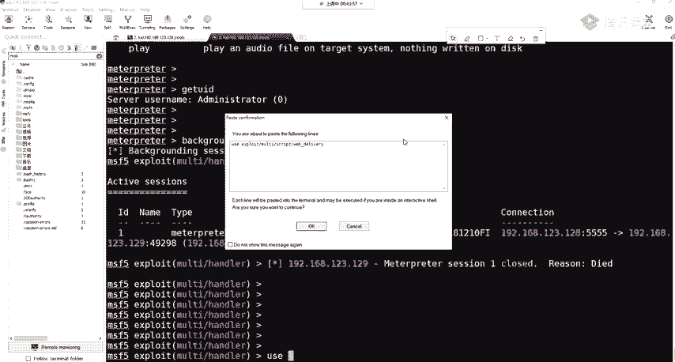

这不是真麻那么麻烦。啊，多打了1个63。然后这里我们show options啊，是需要指定pilo。我们这里默认是python，我们PP站有python。没用及下palo改成PHP的。

PAAP的啊PPm reverse TCP啊，正向的一个。A show options。指定什么？指定logo post logogo po就指定这两个东西。那么 setlogo host。

下条logo park。那这里是我666这个然后how options啊，都没事的，我们ro。让一下。啊，这个他告诉你不是一个。不是一个拍lo的那我们把这个。Ex派。啊，我们这个是搞错了。

这个是target，这下面这个target。那么指定它的一个target set targetet。我们指定它为PAP才行。那我们可以s target查看一下s target我们 target一是PA。

那我们就set target。一啊这是我们的s optionstion样，看它变成PAIP这后我们run一下。OK它要给我们生成一段代码，我们要把这些代码复制到这里运行。😊。

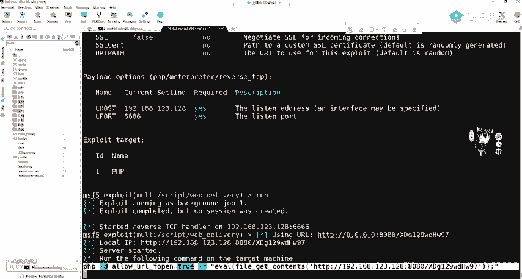

复制到我们这里运行运行什么？通过我们的web端口进行运行，拼移27。0。0。1，然后进行按按的进行一个粘贴，进行运行。

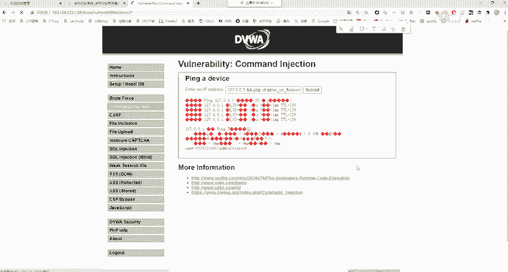

他这边会收到我们的啊一个指令吗？不会为什么不会？在这里我就给大家讲一下，因为这条命令我们复制到打机里面，它能不能运行，我复制一下我粘贴过来。😊。

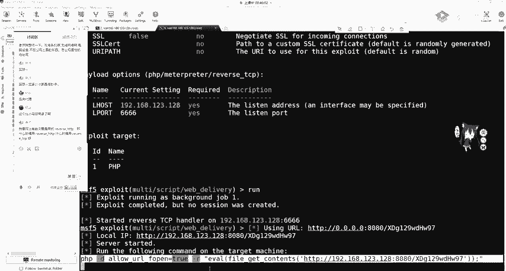

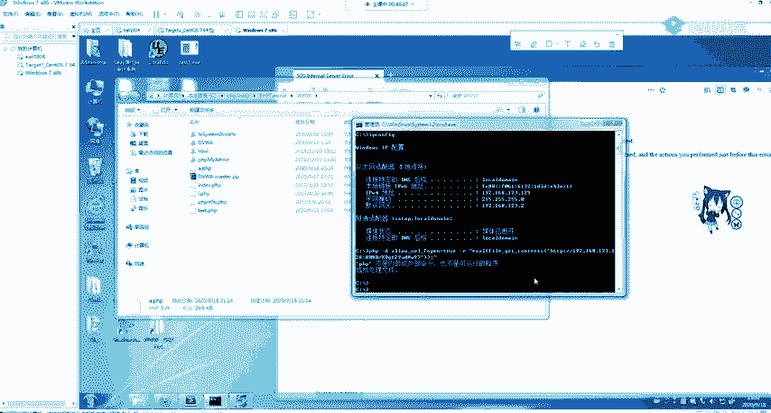

不能运行，因为他告诉你PAAPP不是外部外部指令，也不是可运行文件程序。为什么？因为我们这里是使用的集成化的PIP studyP study它并没有将PIP写到环境变量里面。环境变量是什么？

我们在装JDK的时候，大家应该还记得有个配置加法含境变量。

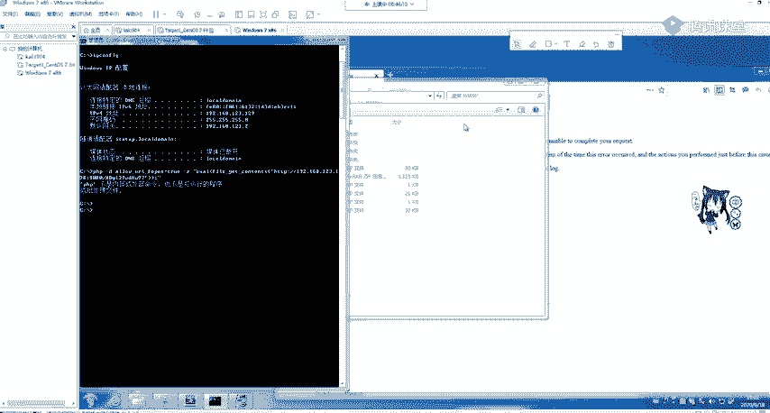

那配置java环境变量，我们在CMT输入Java它怎么那么聪明，就知道Java是什么。那计算机没那么聪明，是我们自己是配置的，配置环境变量。我们告诉他java是什么东西，那PH没有进环境变量。

那肯他肯定不知道PHP什么东西啊，我们可以进行配置一下，你可以自己去试配置好环境变量之后，怎么配置很简单，在我们PHD里面的这个PH这里面不是有PHP吗？你随便选个版本啊。

把这个路径复制到我们环境变量的pa里面，就我们java是一模一样的，你再去运行啊，发现它还是不行。为什么你因为你并没有对全全部的用户进行一个配置啊，这里大家可以去尝试一下。如果不想这样搞。😊。

我们服务器上面有可能装有python，那好吧，我们把刚刚piload换成python那来再看一下，哎，这个就不要再搞了，我setPload。直接复制PPT啊看一下这个他告诉你PP它识别不了。

或知道是什么东西。然后下面我们对拍lo的进行一个切换，切换成我们一开始的python。O这个可以尝试啊。如果他没有装python的话，你这个python也是不行的啊，你肯定这都懂啊都懂。

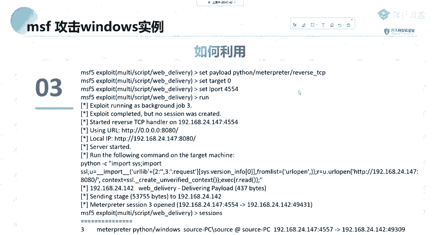

因为他没有pathon，你执行pathon代码执行到哪儿？这show absence，我们look house no pot没有变，因为我们他帮我们记住了，下面我要改什么，改tart，改目标，改什么。

改成python，python是什么？show targets。pithon是0，那我们s targets0。OK是。啊，他告诉我们正在用正在用，把它干干掉。jobo杠K。一啊这就没了。

然后我们让让一下。

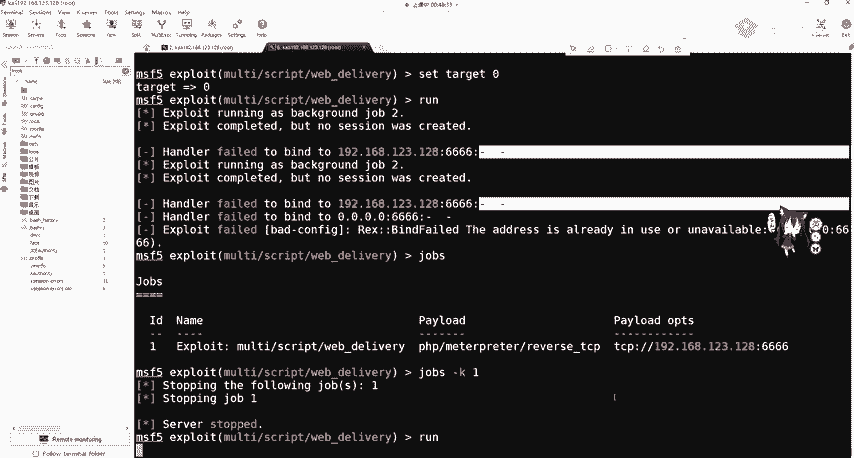

啊，生成这个python这个这个代码。

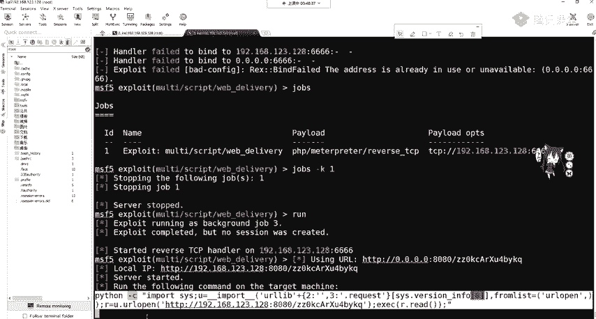

好，把它复制出来。记住一定要一行啊，他如果不是一行的话，你要给它凑成一行。

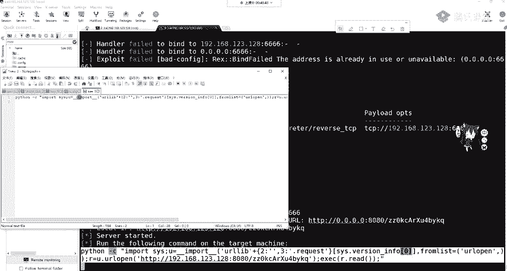

然后到这边我们进行一个运行，这边有没有run起来啊，有run起来。那我们T127。0。0按的。发后面。

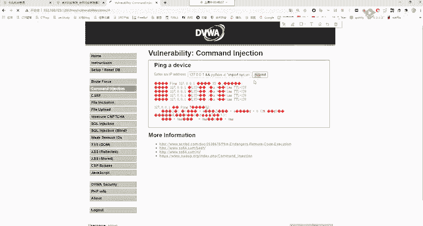

来看这边。OK okK我们收到了。😊，是收到一个matepre session2open，我们看sessions是不是session2在。😊，来到这里。啊，来到这里了。是不是很很有趣啊？就是这样。

你这样是是命令执行，遇到命令执行漏洞，就这样搞就这样搞。非常个。那我们接下来。再看我们这个目的达成拿到了这个Ymate，或者拿到mate。当然我们还可以使用power shell进行执行。

那power shell你很简单，就是换一下你的ts不就行了吗？ts我们看到的有什么？有PHP有pyython，有pyython这里我们background。

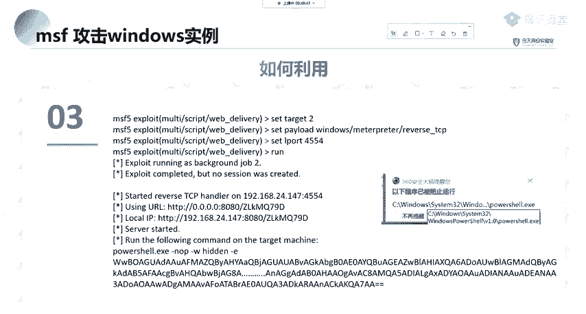

我修 tax。是不是有PIPSH是吗？还是power shellpower。还有一些其他的东西。那我们只需要改一下这里就行了。但是power shell一定要注意。

power shell是我们一个系统windows7以上系统自带的一个命令执行工具。

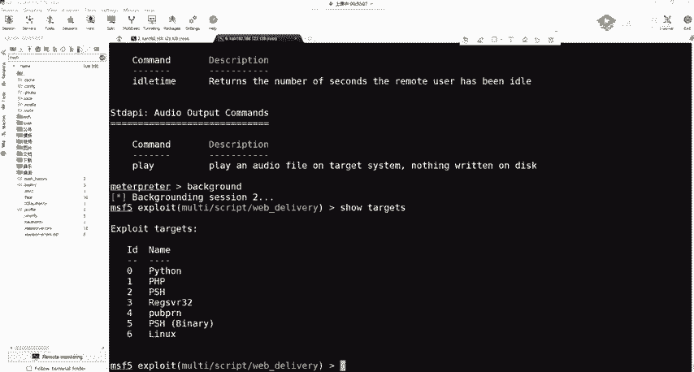

所有的杀毒软件都会燃烂它，你不相信你就可以去试。当远程执行power shell的时候，杀毒软件是肯定会燃的。因为power shell可以说呃调侃来说就是windows操作系统最大的一个自带后门。

它功能很强大，我们可以利用它做很多事情。所以杀毒软件都会拦它，都觉得啊你拿它做事情肯定是不好的事情。就把它一刀切就感觉就十分安全了，是吧？啊，这是刷毒软件的一个特征。

因为power share你混淆很多，我们后面都会讲混淆很多刷毒软件分不清怎么办？不如把power share一刀切安全。就像你把网线拔掉，互网的时候，把网线一拔安全。

如何批量分IP最最好的批量分IP的脚本，什么是电闸，就这样。😊，那我们方法2上传我们的web shell。啊，上传外部上。如果你用DIY设置进行扫描的话，你就扫描到你个HTML1个字目录。

那我们可以去访问一下。啊，可以去访问一下。哎，可以看到thinkPD这个5。1。啊，他是肯定有漏洞的。那我们是随便给他找一个S啊，随便随便输一个可以看到他会告诉你模块库存在往下拉往下拉5。1。29。5。

1。2有有什么？远程命令执行。不知道百度搜哎之前也应该讲过了吧，远程命令执行。那我们只记不住拍乐的没关系。百度。OK那我们。think科PH5。哎5。叉版本远程命令执行漏洞可以帮助我们开el。

它可以执行命令。比如说我就拿第二个咱两排lo执行的结果是一样的。啊，执行我们的Ct互MI。那他么你选下可以命令执行。那这里命用执行我们可以干什么？可以利用刚刚的一个python来进行一个。攻击。

当然呢也可以利用上传webs shell进行攻击。那我们这里就来一个上传文件的吧。刚刚那一那刚刚那一种是不会上传文件的，但不会上传文件有个问题，你达到matpre其实功能很少。

你发现你达到的是python matter。你还要进行一个后渗头齐全或杠U进行发包。在发包的时候，可能就被IDS拦截了。那可以使用一个棉纱码。我不死马进行一个上场。那这里我们找到论用点之后。

可以利用这个。呃，上传就上传我们的PHPin进行。这里呢我们上传什么上传shall点PHP它的内容呢就ever post ever post。OK这我们把它上传一下。这个大家应该都知道了，这个5。5。

S的就是远程命你这些。thinkPB的这些漏洞，这漏洞很多，大家可一要的记，可以去复现一下get up下面有一有现实的漏洞代码，有现成漏洞代码。OK百度一搜一堆啊这个博客freeb一搜一堆。

那我们把它执行一下。他没有报错。那很显然，我们PPI post这一句话木马应该都清楚吧。ever执行当我们将我们传入的参数当做命令进行执行。那传入的是通过post命执行传入的C参数。

把它当做一个命令执行。法当用并制执行，它传入了我们的catch fire shell点PP那它在哪？我们这里因为我是能看到我的靶机的啊，在真正的你看不到的这里我就给大家看一下。看一下能没有没有传过来啊。

有没有传过来。HtM L。Public。可以看到下一点PHP在这儿盯着呢。来看一下嘞。哎，这个虚拟机莫名其妙的卡呀。OK是我们写的这个东西。是我们写这个东西，那我们写到里面之后了，我们可以干什么？

可以连他可以连他。可以连他。他也告诉用我们，他没有找到C参数，这里你可以加艾进行屏蔽报错，它就没有报错了啊，就没有报错了。那这里使用web shell进行一个连接啊，进行一个连接。啊，这个工具库都有啊。

这用一键连吧。我连过吗，连过了连过了。连过之后，那我们要干什么？要上传木马，是不是可以上传我们刚刚的马？O。那这些下面大家的思路肯定都非常清晰了。你现在已经干什么，已经拿到web share了。

但web share的权限很低，你要干什么？要拿到mat printweb摄能看摄像头吗？不能m print可以看吗？可以，那你要看到拿到mat print，那怎么办？我现在拿到web share了？

如果是windows操作系统，我们是不是有上传权限，一不是是不是有上传权限，是不是有执行权限？😊，如果是英立克操作系统，我们是不是可以把木马上传到tom目录下，然后进行执行？

他目录下可读可写可执行左右用户。是吧OK这是我们的思路。那现在我们上传什么东西，上传这个码是什么？我们刚刚是不是讲过了MSF miniium生成的这个码给它上上执行，拿到mate print。

这个思路非常的清晰。如何利用用sha尔进行连接，然后进行一个木马的生成。木马的生辰。嗯难生出。啊，这里我已经生成了一个码啊，生成了一个码。

ok那大家。这里就给大家做一个简单的演示，那时间也不早了。嗯，实验室有很多就实验什么作业你可以自己当环境，也可以去实验室看。都可以，您不想自己答案，你就去实验室多吗？这些实验都有的。😊。

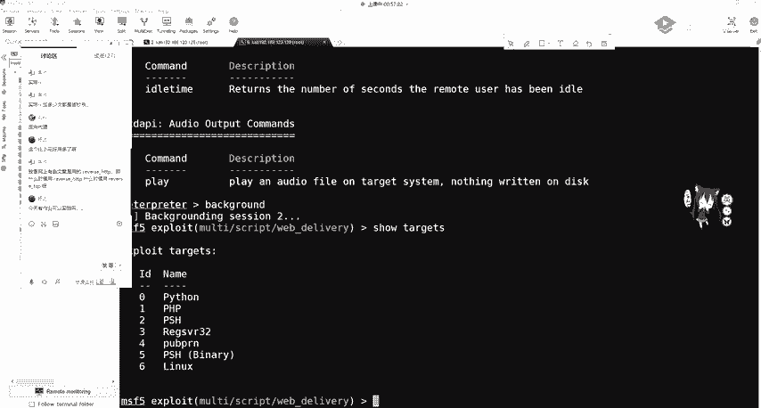

那我们这里就简单做一个演延示吧，还是用我们的marty hand啊，mar hand。

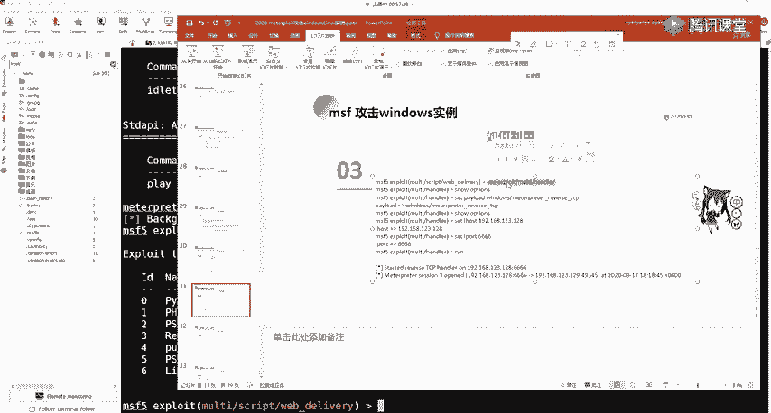

啊，要show options进行set pilot pilot，我们不能再用这个PHP了。我们要什么？我们要set pilot这个啊这个东西。

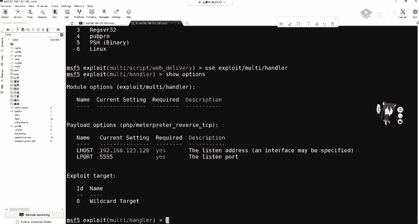

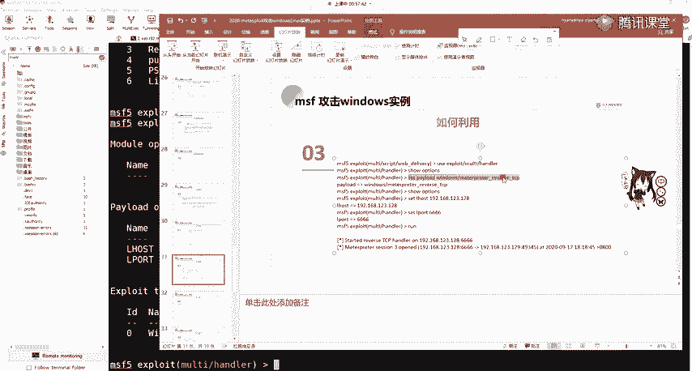

我们现在就用一个这一个大的这个东西了，大的这个东西。就是部分段的排楼。这时候我们收，看一下它里面有什么东西。ok这个logo house logogo pot，我们把logo pot改一下吧。

防止它又出什么猫腻啊，防止收小猫腻。呃，把 set。有个 port改成我们的啊8888。啊，让一下。他现在在监听了，监听了，我木马还没还没生成啊，别急。

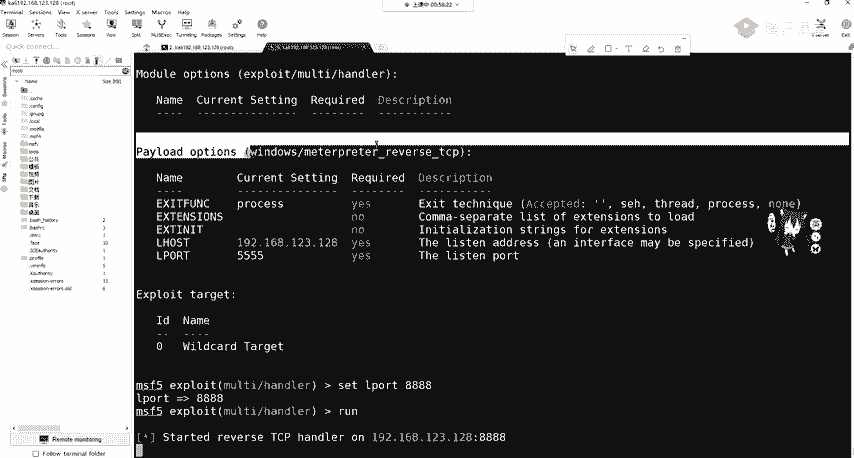

我把这个给copy下来。这边是不是可以修改一下呀？修改一下我们这个东西。那后面改一下啊，778888。输入什么输入ESE。输出啊，比如说ABCD。点ES1。你运行。那。

运行之后我们来看这边会生成ABCDESE，然后把它啊上传到，先拖到本地再上传吧。啊，投到我们的呃。这个C盘里面吧，当然你拖进来，他肯定会查杀的，肯定会查上。我们来看他会不会给大家插上。啊。

这个还还没动就查查了，还没动就查查了。我遇到这个。你到这里。为什么啊他这个会查查很显然。这是木马吗。你可以在隔离区里面进行回复。可以看到它查它的路径并不是我们地盘的这个路径。

是因为我们这个mobil这个软件，它在移动的时候会把这个文件先存储到我们的user lesson这个mobile叉 to这一个文件夹里面，我将恢复添加到幸云区。ok那我们再进行一个拖动。

他也可以过来了。可以过小师之后，我们干什么？我们来到我们的引键里面点击C盘，然后你什么都不用做，直接上传人，直接点上传文件就行。就说我们的IDCD。等他上课。它上传成功之后，我们看一下它的权限。

其实它就是可执行权限。那么在此处打开终端。打开终端知道吧？就我们的web share，我们的web share。OK这里大家应该都知道啊，web share那我们现在要干什么？

要运行我们的啊IPCTstar或者直接运行都行。但 aB cD。那IVD运行起来。O。要等一下，我们看这边灭了，这边灭了，并不是并不是给关掉了。这个已键大家如果用过。

应该知道你这个命令执行35秒没有回显的话，它会把你自动放到后台。不信我们可以这一个呃task keyt list看一下。系。可以看到我们那个IBCD在不在在不在。啊，IDCD是不是在这在后台运行着呢？

那，在后台运行的。

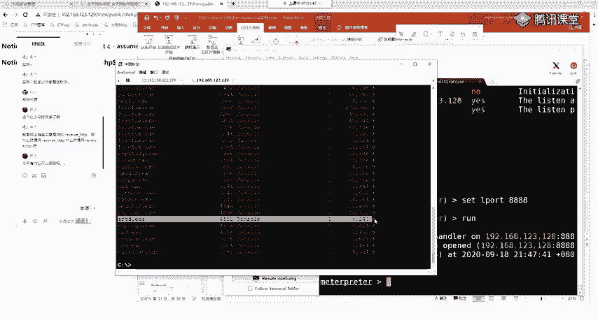

那我们这边很显然已经收到了mlerate那，收到很慢，因为我们生产的是大码，知道没没有用分段的一个木马，收到是大码。那大码之后，那我们在这里OK可以做我们想要的事情了，是不是可以想要的事情。😊。

ge your i d。Or administrator。我想提全getsitt进行一个简单提全。这个期权是利用我们的注册表进行一个管道，大家可以去查一下它的便历，这时候我们就是最高权限sem了。

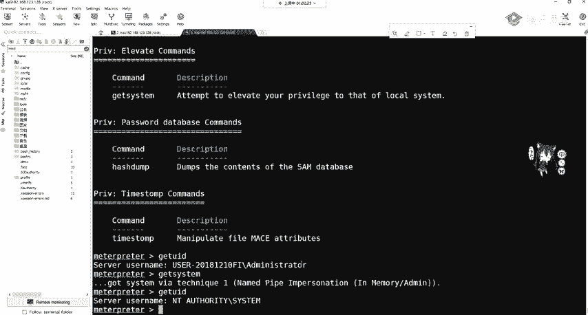

这C项目，但是大家要注意。如果你是网站管理员。现在我网站管理员，我又来到我的把气了。我发现我把银行卡可能为别人中了病毒。重病毒大家在小时候玩电脑觉得重病毒第一件事什么？

感感觉是不是启动任务管理器去看到底有什么东西在运行呢，到底在什么运行吗？来看一下看一下哦。

CMD正常。发hos火锅浏览器啊，我在看ABCDABCD是个什么鬼呀？IBCD是个什么东西啊，我把它给结束进程。我把它给结束掉。啊，结束掉。OK那你就凉了，你这个UCD被结束掉。

你这边的mat就断了是吧？财生3close。😊，端了，那这肯定不行吧。

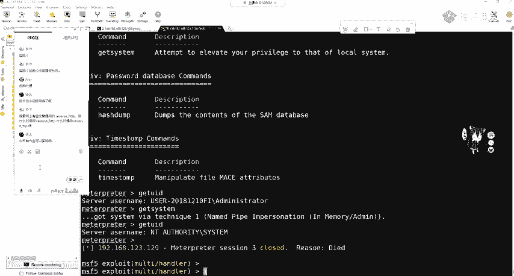

我们要做伪装。它如何进行伪装啊，我们来看一下。我们拿到之后，我们可以getPID去查看我们的这个。进程ID然后进行一个进程的迁移，迁移到我们正常的程序中。还违装我们这个后台程序。

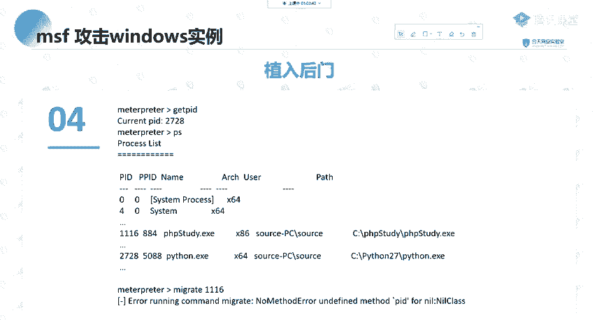

那如何进行迁移？我们首先还是把这个给跑起来跑起来。把这个跑下。

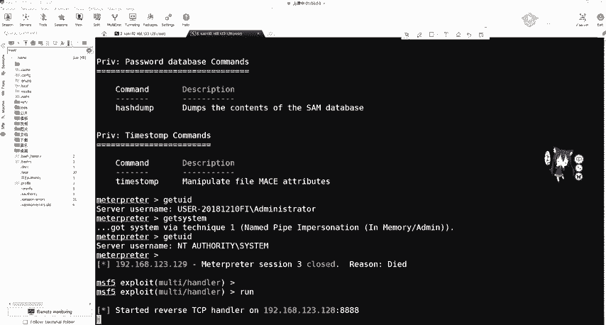

你 the web share在这 hast。ABCD点ES。大家有什么问题吗？这个目前没有什么问题吧。OK他已经收到了，收到之后。😊。

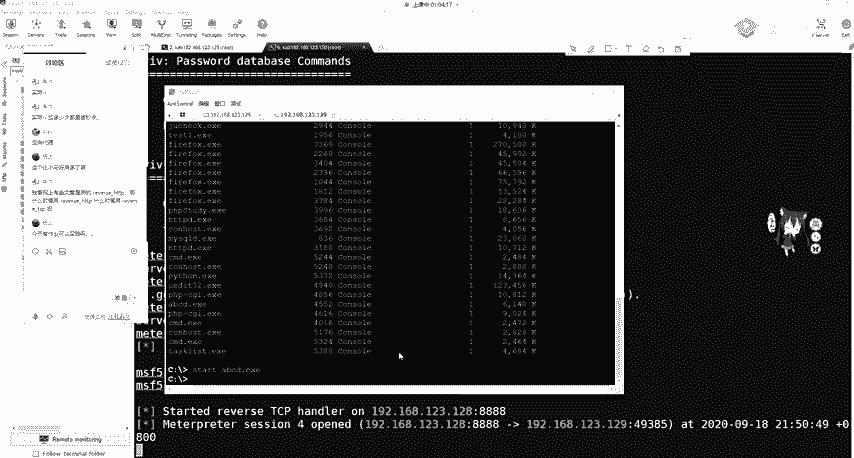

啊，稍等一下。他这个会有包发过来。学了之后，我们来看这边的一个进程。啊，我们IBCD有没有再出来呀？啊，又有又有了PID4512，我现在是管理员，我就把它干掉，我把它干掉了。

那么可以ge啊PID看一下4512跟网站管理员在把题看到是不是一样呢？4512。那我们这样不行，我们要做一个进程迁亿进程迁亿。😊，那进天迁亿我们迁移到哪呢？可以PS看一下。

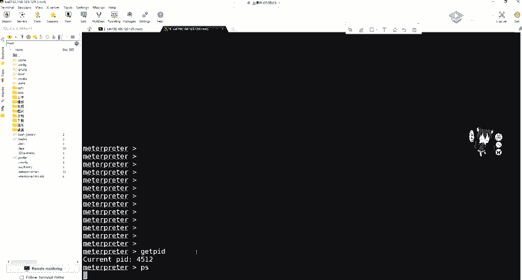

process看一下我们有哪些进程在运行。我们本身是什么？本身是IBCD是吧？本身ABCD。那么要迁移到哪呢？大家一定要记住啊。高的权限可以往低权限进行迁移，低权限不能往高权限进行迁移。

那我们现在的权限是什么？可以get your IDDuser IDD看一下administr。那么可以切换到sstem你就最高权限啊，我们再get uID看一下是不是sstem了。

那么们这些都可以往下进行迁移。你想迁移到哪？我现在现在知道这个服务器上运行的网站运行这 singlePP。那我们想把它迁移呢？迁移到我们的。阿帕奇服务或者是PIP study行不行？OK肯定行。

那我找一下PHP30在哪，找一下PH3。可以看到在这。他有administr进行运行的，我们C他们能不能牵迁移到administr肯定行啊，他的ID是多少？39963996，那我们mig进行迁移。

加上我们3996。把4512迁移到3196。也就是说啊一个进程ID能运行两个任两个进程吗？我们分布式操作系统是可以的。可以复加的，大家可以去操作系统那边看一下它的原理。式操作系统。

这是一个有算法的进行一个迁移。那这时候他告诉我4512ABCDESE先移到333996已经成功了。成功。我们再getPID看一下啊，3996。Thank you。那我们这个PH3的影没又断了没有断。

他还在这呢，他还在这。在这时候这个网站管理员再去看，再看IBCDMA的没了。已经没了，那他去查查木马，他会查什么，查查其他一些奇怪的或者系统进程，他会去查去关掉TAPP study吗？

他如果关掉网站就崩了，他不会管是吧？那我们这个met create就一直在这了，就一直在这。OK这是个进程前意，大家有没有问题？这是竞争权益。当然，matetter功能不仅仅只优这。

后面我们会在大家mate客户一定要做编习，因为我们后面的课程几乎都会贯穿它。都会用到它。我们执行之后可以。对后门进行一个植入啊，进行植入，可以植入我们的这个。后门。植入后门一般是植入到注册表里面。

大家要知道。这种我们是有后门的，我们后门在哪？是不是shall点PAAP我们上传的？如果管理员进行了重启机器，他是不是还要开启P尔P4R，那我们还是能连到它。

但是我们上一期上一个方法里所讲的web deliveryel。这个东西是没有文件的，它是在内存中运性的那管理员把它关掉了，那不就没了吗？那再重启，你这个木马就被杀掉了，那很显然不现实。

那跟减然方法二更现实一点啊，因为你有后门，你要是怕后门被炒杀的话，你可以查一下注册表。其实注册表更容易被炒杀。我不推荐那种这种这种方法。这种方法是我们在注册标里面写一个东西。

已就使用嗯regregstry，然后写一个东西进行开机的运行。这我就不做演示了，因为它没有什么用，我觉得还没有web渲好用。然后我们如果进行一个重启，它就会链上来。点上来。那我们最后呢连上之后。

我们要干什么？要对我们这个痕迹进行清除。clear啊，以为它会自动清除我们一些痕迹。夜轻节。呃，这这这这是什么？那我们后面再讲，如果利用MSF进行渗透测试的时候，我们会将自己的木马发送给受害者。

那由于我们的木马是临时临时性的。不能很好的保持持久在线或导致渗透过滤失败，或者是被管理员发现IBCD点ESE被干掉。那我们通常要做的就是将木马进程迁移到其他程序正常程序。一般你可以迁移到一些服务上面。

HTEP阿帕奇、马蚁搜cle上面。这样一来是防止受害者，也就是网站管理员可以发现可以进程关闭后面程序。二是可以有效的保持木马在线。那这里大家应该很清楚。刚刚已经演示过。那今天的课程就到这里。

课后作业呢大家可以自己去打靶击。并且做了两个实验。你就是。攻击的win7啊，这个我都放到放到我们的那个。呃，文档里面放到文档里面。大家有什么问题可以问啊，现在。啊，我放进来了放进来了。

大家去把这个实验做一下。啊，内网确实比外国好玩，我觉得是的，因为你内网有洞呀，你外国你打半天都没有洞，你找不到呀。哪受不住，现在防的比谁都好。😊，啊，是吧。那这个呃这个在大家在做这个实例的时候，因为。

啊，这些作业我。这些是看着这个实验书进行傻瓜式的操作，我是其实不是很推荐的。所以大家要通过做实验。或者是自己搭建靶题也好，做核间实验也好，一定要熟悉这个ma的利用过程。有可能你觉得很基楚，没什么呀。

这是这个流程。即使在后面在实际工作中，你遇到什么让免杀呀，无非就是这个整个的这个流程上面再加一些编码或者是免杀，或者你。进程迁移会留下会在系统留下这个记录的。如果。程序IDS包括。呃呃。

卡巴斯机杀毒软件，它是有这个内存的一个。内存的一个动态监控呢，你这个时候就没办法迁移了。你迁一的话，他可为你干掉了，他会发现你这个嗯这个木马附加到某个正常进程上面，正常服务上面。

但这个在内网中还是挺有用的，在内网中还是挺有用的。啊，这个你说它好不好用，这是比较玄学的事情是吧？它有的。有的你比如说上了呃这个wa夫，有的wa夫就很好绕，有的就绕不过去。有的你觉得这个wa夫很强。

但最简单的so入你甚至编码一下就绕过了。那这就很玄学，所以要多次尝试，帮你的编码，你敢说哪一个编码就一定免杀呢？谁都不敢说，那有MSF有没有能力做到现在的IDS还有杀软全部秒杀，是有能力的。

但是大家都不说，如果说出来了，如果大家在get up或者是free book或看水上面，把这个东西对，cle我那个进行删除。或者是后面我们会有一张专门的讲这个痕迹清楚的。那个知道吧？是倒数第二章。

我专门讲就如何把你的这个足迹给抹掉。那我们。无非就是再附加一些东西，这整个的流程啊是不变的，整个的流程是不变的。那大家还没有没有什么疑问？嗯，觉得都听懂的吗？就是这个MSF有可能今天讲的内容比较多啊。

比较快，大家有听懂吗？有听懂的话呃，没听懂的话扣一下2吧。这个秒杀大家不会说出来啊，对，操作有点多，大家要自己过一遍流程，过一遍流程，一定要操作，要记住，不论你学什么操作是最重要的。

你看跟你做完全是不一样的啊。最为这个免杀技术是不可能透露了，你透露了第二天就不免杀了是吧？第二天就不免杀了。他一看这些360的安全工程师一看哇，免杀码出来了，赶紧提取特征，加班提取特征。

然后进行写入我们的360或活入。然后你就不就不免杀了吗？是吧？就是这个道理，这很很好理解。如果你开发他的软件，你是不是。在对网上的免杀教程都不行，基本上都不行。但是你说不行是不可能的，可以多种综合嘛。

后面会讲的我会讲。会讲p share棉纱。嗯，当然会这的，当然这个还是要学一学。有的你你要说这个不可能有通用的这个这个绕过的。这个没有通用的绕过木马的通用的那第二天肯定就被杀了。你今天通用。

明天肯定就是全部都不通用，就是这样的。那有没有什么疑问啊？已经10点多了。嗯，小课会讲小课会讲一些最新的吗？我们这个课程里面会讲一些。呃，我们固定的这个渗头测试的流程吧。

因为我们这个是面对大家入门或者是。今天ma fleet就先到这。😊，但是绝绝对不要觉得masplay到这就结束了，永远没有。啊，内网后面都会讲。你到那个。嗯，腾讯课堂那后面那不是有个大纲吗？

后面有我们的课程。那呃后面那个有把机供大家练习。救远方向、渗透测试、安全服务这些。做做互网都是ge家。啊，给大笑。啊，对吧。就是渗透测试。那大家还有没有问题？没有问题的话，我们就下课了。

那我这就把PPT。上海上海你可以撒网呀，其实一线城市都挺好的，可以撒网。其实现在没有没有专门搞外包安全工程师的，都是做渗透。外国可以玩SRC呀啊SRC我们这个东西对SRC没有用。

你SRC你不能拿他的mate，你不能给他上马，你上马，你被抓到了，别人的核心东西，你不能给他上马了。😊，打网撒网撒网，就上海公司很多嘛，你可以在。投简艺投很多公司嘛，进行啥吧。那大家还有什么问题吗？

没有什么问题，我把这个打包发一下。By。甲方安全我没有了解过。我这一直都是做米发。你可以问一下我们班主任嘛，我们班主任还两个班主任呢，你可以问他们，他们资源多。专考就业。多跟他多跟小姐姐交流一下。

OK那我这个PPT已经上传的。嗯，群里的大家有什么问题的话，可以在群里问我。嗯，这节课就到这里。大家早点休息啊，不要熬夜，头发重要。那就先下课了。

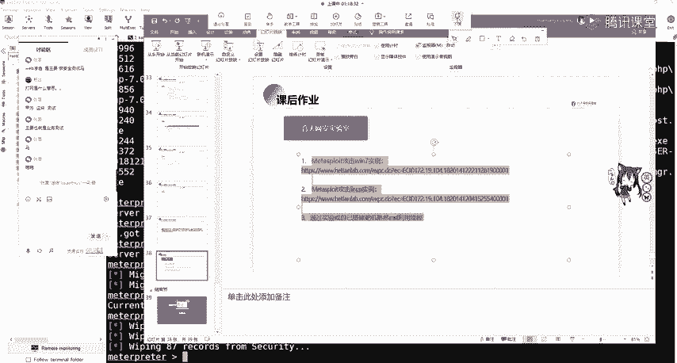