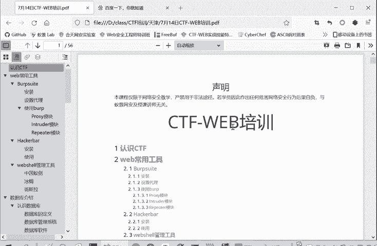
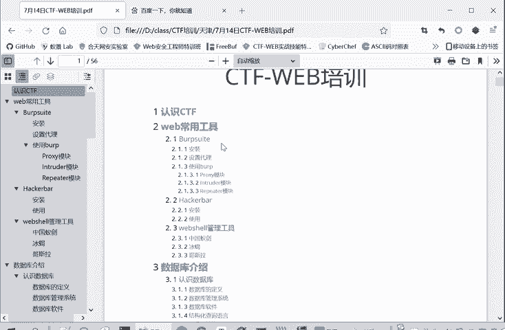
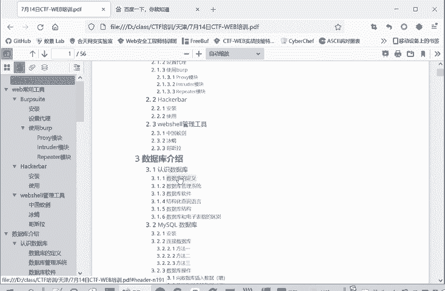
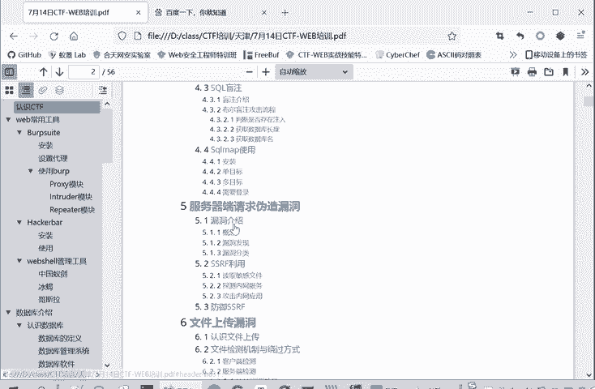
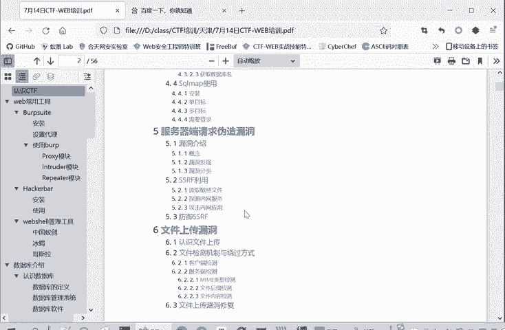
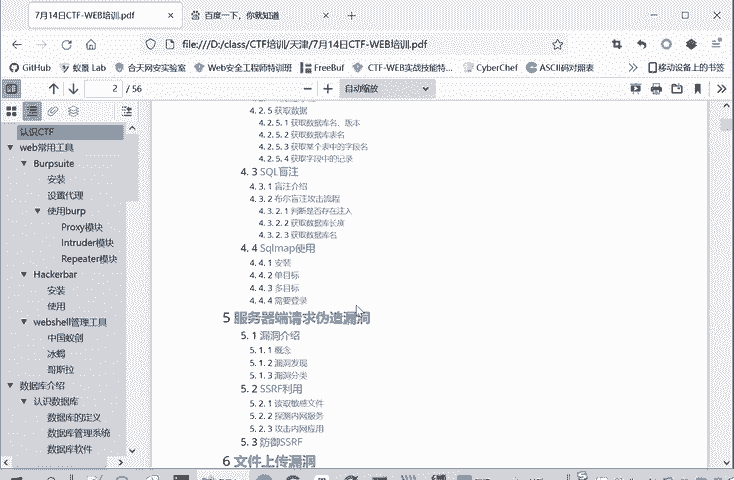
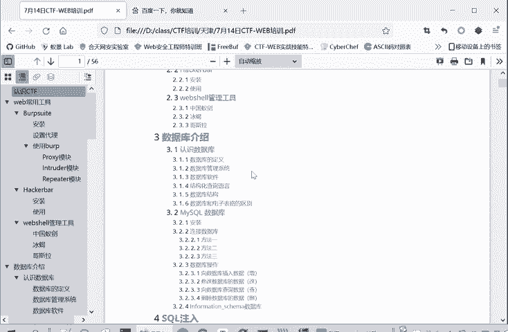
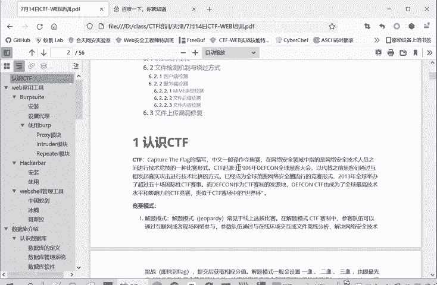

# 2024年最强Kali渗透教程／网络安全／kali破解／web安全／渗透测试／黑客教程 ／代码审计／DDoS攻击／漏洞挖掘／CTF - P67：1.认识CTF - 网络安全系统教学合集 - BV1Pe411C7Zb

首先介绍一下今天课程的安排，我们上午的上课呢是9点到10点半，我们分为两部分，中间会休息10分钟左右。然后大家上课的过程中，如果说有什么疑问，我们就发在聊天里面。然后在我们上午两节课嘛，上了两次课。

两次课每次下课之前呢，会集中回答大家的问题。然后每节课的上课的途中呢，就不会直接啊给大家回答问题了，但大不要着急，把问题都发在聊天里面，下课之前肯定会给大家回答的。🤧嗯。那我们今天的课程的内容呢主要是。

1个CTF的介绍，还有一个常用工具的安装。上午呢会介绍一部分这个数据库的知识。

然后下午的话就是继续是数据库和circle注入，然后是一个服务器请求伪造漏洞。然后最后是一个文件上传漏洞。

Yeah。在听课的过程中有任何的疑问呢，都请发在聊天里面。

那我们就开始今天的上课。

首先给大家介绍一下CTF这个CTF呢就是capture the flagCTF的缩写。

中文就叫夺奇赛。啊，这个大家应该是有一定的了解的。他事实上呢就是通过寻找这个flag。作为这个网络竞赛一种成功的标志。比如说你发现了对方服务的漏洞啊，发现对方二进制文件的漏洞。

然后成功的进行利用这个成功的标志呢就叫获取这个flag，所以叫flag夺其散了。然后如果说你这个获取漏洞成功，漏洞利用成功了，你就把这个flag提交。然后这道题。就做对。简单的解释就是这样。

然后这个CTF呢，它竞赛模式有三种模式，也给大家介绍一下。比如说一种是第一种解题模式。他比较常见于线上选拔赛，然后在解题模式的这个CTF赛事赛之中呢，参赛者一般是通过互联网或者是到现场参用网络来参与。

通过分析文件解决网络安全技术问题。所谓解决问题，也就是找到flag，然后提交和获取相应的分值。它这个解析模式一般会设置一选、二选、三选，就是你提提交的越早越先做出来，那你这道题的分值就会越高。

当比赛之后还需要提交每道题的详细解决报告叫rite up。这是为了防止啊，有些人他直接从别人那里获取了flag，进提到他实际上没有做出来这道题。为了防御这种情况。然后最近不是有个比赛快要开始嘛。

就网鼎杯，他们的。第一阶段比赛官方资格赛采用的就是这种解题模式。然后第二种模式呢就是需叫一个攻防赛模式。攻防模式常见于线下的决赛。所谓攻防嘛，就是有人是攻击方，有人是防守方。攻击方呢就是。

要攻击这个防守方的一些系统环境、服务啊这些。但防守方就是不让攻击方进行攻击嘛，就是要找到修复自己的漏洞，然后发现攻击方的攻击行为。这种模式呢每个队伍是轮流作为攻击防守。不认识。

然后像我们像快要几前者王顶杯，他们的决半决赛的决赛就采用这种攻防赛的模式。然后第三种模式是比较新颖的模式，因有一种战争分享模式，它是参赛队伍之间相互出题。然后你就你既要出钱，也要做别人的钱。

初题可以得分，做别人的题做对也可以得分。在比赛结束后，分享赛题的出题思路，还有学习过程和解题思路。最后根据你的出题得分、解题得分和分享得分。进行一个综合的评价。这是主要的呃三种竞赛模式。

那么CTF的竞赛内容有哪些呢？我们看一下。它第一大块是这个web网络工房模块。主要是包括外部常卷的漏洞，如ci注文漏洞。我们本节课要讲的叉SSCSIIF跨件请求伪造就是文件包含文件上传。我们下午讲啊。

还代码审计啊、PHP用类型等这些。就是外部中常见的漏洞，还有它的解题的思路。然后第二大块呢是一个逆项工程模块。包括逆向关的常见题型、工具平台解析思路等等。当然应阶部分难度大一些的。

就是涉及到一些软件保护啊，反变译、反调试，还有夹壳、脱壳这一技术。这些技术都是。呃，给这个逆向工程增加难度的骑手，所以它是一个进阶部分。然后第三大话就是胖。PWN这个二进制漏洞的利用。

主要考察的二进制漏洞的发酵利润。主要是通过战堆溢出啊、站溢出这些方式。来获取flag或者是控制或者是获取目标的项，然后再获取flag。第四板块呢就是一个密码工具，包括这古典密码现代密码的两部分内容。

然后第五部分就是移动安全。因为现在移动的设备是越来越多的。移动安全呢就是安卓和IOS嘛，两大主流的系统。其实这个考题中最主要的也是安卓系统。IOS的题目就是比较少的出现。

然后第六部分就是miss安全杂项。咱项就是。它的范围比较广啊，涉计领域比较多，比较杂嘛，就信息书集啊、编码呀。就取经啊饮血啊。等等这些。好的，前面的部分呢对这个CTF进行了一个简单的介绍。

这个上面的课件呢，后面也会发到群里面。然后大家也可以再看看这个课件。