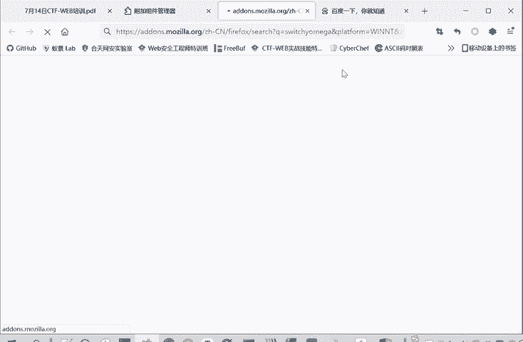
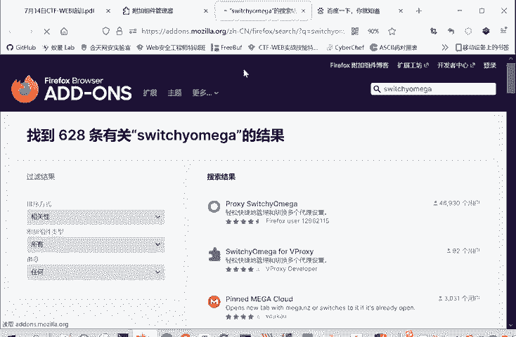
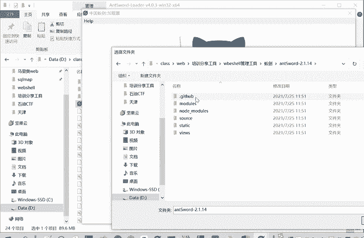
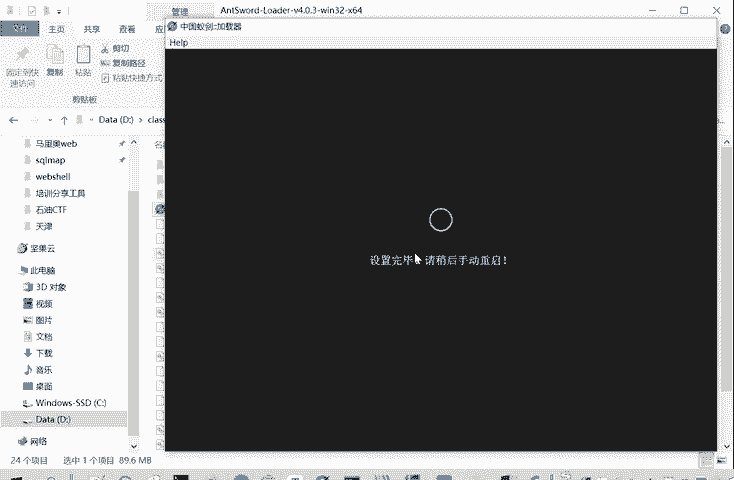
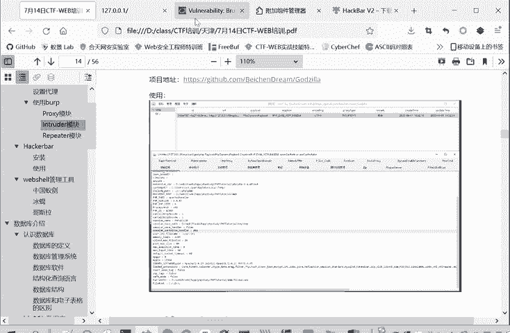
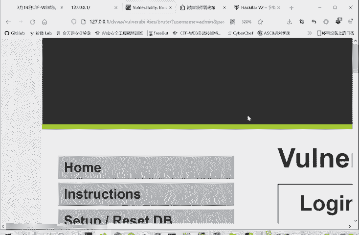
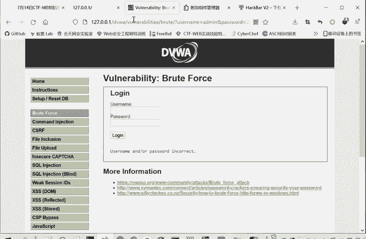
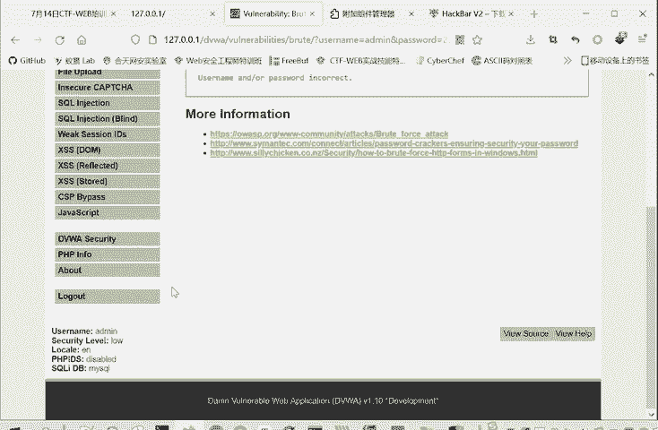

# 2024年最强Kali渗透教程／网络安全／kali破解／web安全／渗透测试／黑客教程 ／代码审计／DDoS攻击／漏洞挖掘／CTF - P69：3.Burpsuite代理模块 - 网络安全系统教学合集 - BV1Pe411C7Zb

那我们b to它是一个抓包的一个工具，抓包改包的一个工具。那为了实现它这个抓包改造的功能呢，它需有需要配置一个代理。那我们这里看一下如何的设置代理。其代理有两部分。一部分是我这个浏览器。

或者是我这个操作系统，它要配置一个概念。第二部分呢是我叫be夫，要监听这个代理的服务气。要设置代你是说我浏览器把这个流量发送到这个代理服务器上。然后所监听呢就是bu部来接收这个待理，就是这个意思。

这里呢虽然说是可以在windows系统中设置代理，这样是可以的。但是不推荐大家在windows系统中设置代理。为什么？因为我们在抓包改包的过程中，它会出现非常多的流量。包括那个windows。

它操作系统，它自身也会联网，它也有流量。他会检查更新啊等等，进行很多联网的操作。或者说你使用多个浏览器，你使用这个火狐啊，这是火狐浏览器。你还有还有这个谷歌浏览器啊，I级浏览器啊。

你如果说在windows系统里面设置代理的，你这些流量都会被抓在一起。那么你所抓取的流量。我们这里开先开启一个概念。你会接收到的流量就会非常的多。那我们要分析包的时候。

这些无关的流量就有可能对你造成了干扰。你真正想要找到精确看的包，比如说我要看这个包，我想精确的看一下。你想这是40多条，你你在里面找。如果说你在一个系统里面设置代理的话。

你可能说100条500条都有可能。你再找的话，那难度就大很多。所以推荐大家在浏览器里面啊设置一个代理。这样的话，我在火狐浏览器里面设置代理，我只会抓火狐浏览器的一个流量。

那windows系统的流量和别的浏览器的流量都不会经过b。这样避一免这个。无关流量对我们一个网络安全工作的一个干扰。那么在浏览器里面怎么设置代理呢？推荐大家使用这个switch欧米伽这个插件啊。

这里少打一个Yswitch欧米伽。这个插件怎么装呢？很简单，我们在火狐里面找到一个扩展，其实在别的地方也是找扩展，在谷歌浏览器也是找扩展。只不过谷歌浏览器的有一些扩展呢需要啊VPN才能够连上去。

所以我们一般就推荐火狐。大家都可以连上的。那么在扩展里面呢，可以搜索。To which欧米伽。

我看我听写的用MAGA。

就会出现这个proxy switch warm，然后点击这个插件。大家没有安装这个插件的，这里就会有个添加。点击添加就会进行安装。如果说已经安装这个插件了，想把这个插件删除，不想用这个插件了。

那点击移除就可以了。这个插件请大家装一下，因为这是一个设计代理非常方便的插件。我们可以看一下这个插件怎么用。但是安装正好之后呢，这个浏览器这个位置右上角这个位置会出现这样一个圆圈的标志。

这个圆圈的标志就是我们的switch warming。然后我们点击它的选项进入这个所有求欧敏感的设置。为什么说他。为什么推荐大家使用呢？因为这个设置带你非常方便，我可以新建一个情景模式。

比如说这之前bb就是我建你的一个情景模式，可以自己命名。这报表代理怎么设置怎么代理呢？代理协议。在我们b抓包，你就默认了协议就可以了。那后但你服务器呢是我们本地的服务器。但你端口呢。

这个端口可以设置8080，因为bp是默认的是8080监听。你改也可以。然后不带你的主机列表，它本来有个127。0。1，它就是不带你本地的地址。但是我们这里要把这个信息给删除掉。让让他代理本店地址。

这是因为我们现在在学习这个外部安全，很多时候我们需要搭建一个靶场环境。然后我们要自己做这个靶伞上的题。这种情况下，他这个必须要抓我们117。0。1的一个流量。要不然这个很多把卡的题就没法做了。啊。

大家安装过程中，如果说有什么问题的话，也请发在聊天里面。我们下课前的一段时间。来集中看一下问题。你还可以根据不同的需要来设置不同的一个代理。我我第二个代理，我设置代理服务器可以不一样，端口也是不一样。

大家有的时候为了学习，要关上梯子。在这里也可以设置一个代理风险。然后我们使用的时候，根据需要，我直接点击哪一个。点击bp，它就按bip的代念，然后点击这个查瑞就是查瑞的一个代理。它切换代理非常的方便。

也可以直接相连，直接相连呢就是不使用代理。这是一个switchwa伽，它是非常好用的。然后再。所以从wo密卡上设置好代理之后呢，我们要在b上监听这样一个代理。那我这个是之前已经设计好了。

所以我就直接能够抓到流量。监听是在哪呢？在这个option里面。这个一个proxy代理模块，代理模块下面四个子板块，我们后面都要讲的。第四个子板块呢，这个option选项。

这里面有个代理lister监听监听器。监梯器里面有个IP端口。前面有个勾，然后你把它勾上这个IP单口。也可以设置，但是要与这个switch欧米伽。里面保持一致。我们比如说是用这个。

bp模式来让bp进行一个。监听的。那么你这里的IP和端口要和bb监听端口保持一致就可以了。这你设成80829091都是可以的。但你最好不要设成那种常用端口，免得冲突。啊，这是一个代理和监听的事。

经过这样的设置呢，bp就能够抓到HTTP的流量，能够进行拦截，能够把这个包的历史给抓抓下来，然后进行一个分析。但是大家可以看到，我们这里面抓了很多HTPS的包。因为现在HTPS。这个用的是越来越广泛了。

如果说只进行刚才的代理和监听呢，是不能抓HTBS的包的。因为我们缺少一个证书。就像这里课件上写的bb上述设置呢，bb4只能抓HTTP的话，没法抓HTPSSS是secure安全。

因为HTPS的安全性增强了，需要证书才能允许抓取。birk suit呢不是一个合法的。数字证书颁发7个CA也就是我们说CA。那为了抓取一些TPS的包呢。就要让b伪造一个公钥证书，得到客户端的验证和信任。

然后操作是怎么操作呢？就是我们。我们开启这个代理。然后我们直接输入。HTTP。Birp。会出现这样一个界面，然后这里有个CA证书点击就会下载。因为我这里之前下载过，所以它重命名成一了。

首先第一步是下载好这个证书。然后第二步呢就是浏览器安装证书。这个火狐浏览器文件就是说在我们的。隐私安全证书查看证书中导入这个证书。比如说我们证书下载好了，那我们就点击设置。这个设置的路径在哪？

在隐私安全里面，这个找不到也没关系。隐私安全里面有个证书，有查看证书，找不到，你就直接在这里面搜，也是可以搜到的，就搜索证书。查看证书里面有个证书颁发机构，有个导入。把我们刚才下载的文件进行一个导入。

导入进去就可以了，这里我就不重复导入了。因为我之前已经导入过了。这是一种安装方式。这种安装方式就跟我们代理一样，它是。只在我只对我们当前这安装的浏览器生效，我们b想要抓别的浏览器的包，还是抓不到的。

那么还有一种安装方式呢，就是直接双击我们下载证书进行安装。双击之后就会打开这个界面。然后直接点击按照证书。然后证书存储的时候选择。将证书存储为这个受信任的跟证书颁发机构。然后剩下的就默认选择。

点击确定下一步就可以了。推荐大家使用这种系统上安装的方式。因为这种安装呢是我们。在整个系统进行了一个证书的安装。那么我们不管是抓我们这个。ho。火红浏览器还是抓我们这个。还装我们这个爱G浏览器。

或者抓你的谷歌浏览器，你你想抓哪个的时候切换都非常的方便。而不用在每个浏览器上进行一个分别的安装。啊。当然你不想在系统安装，用第二种方式在浏览器上导入也是可以的这是两种方法。

那么这个b的使用是如何使用的呢？我们来看一下。我们这里啊也给大家写了是如何使用的，然后我就不照着这个念了，大家后面可以自己。对着这个看，然后我们今天呢在课堂上就对着这个b它的一个界面，我们过一遍。

后面这个文字内容啊，大家可以对着课件自己再进行一个查看。这是一个dashboard，就是一个面板，是显示bp的一个总体的一个信息。时间呢还有他。的活动抓起了流量什么的，要整体的一些信息。

这里是target，就是我们抓取的目标。我们刚才访问了些百度啊。这个一些情况。然后我们这个proxy就是我们最常用的一个模块，代理模块。它下面有四部分，一个拦截模块。

拦截模块看这里有个incept of拦截关闭。蓝截可以打开。那你再给张小佳解释一下我们这个bb suit的一个工作。我看一下部。安装的时候。嗯。啊，没有把那个他的一个置关系是吧？这所谓的一个代理呢。

就是说我这个浏览器本来说我访问百度，我在百度上。这进行搜索。本来是直接把请求发给百度服务器，然后百度服务器呢响应我的请求。把响应结果发给浏览器，然后浏览器呢就展现出来，就这个样。

但是如果说你进入bb代理之后呢。你这个请求会过半会经过半。你看这是我们刚才发送的请求，我们搜索的是1个CTF这个字段。就是现在因为开启了代理，在buap上进行监听之后。

浏览器就去不直接和服务器进行交流了。他是把他所有的东西都转给。这个bb再转给这个服务器。相当于说他。b已经插在这个浏览器和服务器中间了。这也是b普，它为什么能够生效？

那插掉它中间啊这些包就能够发送的请求，还有以及浏览器的响应都能够进行一个修改。他现在是一个中间人了。那么这个拦截模块的作用就出来了，它既然在浏览器和服务器中间，它就可以选择让浏览器的请求。经过bp一下。

就直接发给你乱线，还是说经过bp这的时候停下来。然后再发给你们来截，这就是拦截不拦截，不拦截，就是流量经过b。从浏览器到b部，直接再到。服务器。它本身不做任何的改变。

他只是把这个访问的记录过程给记录下来。如果开启拦截之后呢，我们再看一下。我们就时要再进行一个搜索。大家看是不是这时候就不会出搜索的结果。我们搜索CDF结果不会出，它一直转圈。

因为现在这个请求是在b里面还没有发送到百度服务器。这不是网速卡，这是请求被b本拦截了。你看这我们访问百度的一个流量。这个时候呢。我们这个使用者就可以选择进行一个修改。它可以删除，也可以增加。

你可以修改这个请求包的内容。修改完后，你点击forward就是发送，就是把这个请求包发送到服务器当中去。当然他又会请求。因为你完成一次搜索需要多次请求百度服写。优惠请节又可以修改。

你也可以选择把这个包不发送给百度服务器，把它d掉。这个个标作为拦截掉，d不掉也可以。你也可以把这个包点击action给发送到什么repeer，后面的introder啊，repeer这些模块。

让这些模块来进行应用。这是我们代理这个拦截模块的一个四个功能。但是不管你拦截是on还是off这个浏览器的记录里面都会有这个访问的记录。都可以在这里面再查看包，再进行分析。把这个就。完了。

所以这是一个proxy模块的一个作用。主要是一个拦截，还有查看这HTP historyistory。HD B history。虽然叫HTP黑色，但是HTPS的包也是有的，都是有的。

这些百度的这些包都是有的。这个web socket的 historyory这个不用管，一般用的很少。这个option就是我们刚才监听的设置一个设置的地方。这是第一个模块。

然后第二个重要的模块就是这个引出的模块，它是一个爆破模块。爆破模块我们点击一下怎么用呢？光模块下面有4个模块。第一个模块，他给的目标。所谓爆破就是。它是入口定的是验证码这些。他反复的尝试这些。密码。

用看他是否存在绕口令。或者看这个验证码是否能够。被爆破，被简单的数字啊字母组合爆破。这样的一个功能。他第一个模块呢他给的目标，你要爆破的。是IP地址是什么？也包括哪个哪个设备嘛，包哪个服务。

它的IP地址和端口是什么？这是目标标positionization。I这所谓爆破呢就是。啊，比如说这里啊给大家。演是一个爆破的一个过程。

🎼我们打开这个PGP studyPHP study大家也可以装一下，后面给大家讲一下怎么装用这个PHP study。那么P study现在这两个域点就是已经启动成功了。我们本地呢就搭建了一个快部服务器。

我们打开这个DVWA这个靶场。然后进行跟录。奋斗之，它这有个安全等级 impossiblepos，就是这本身是一个漏洞靶场。它里面很多漏洞，暴力破解命令执行CSIF文件，包含文件上传等等的。

这里面的安全等级impposible就是。不喜欢动豆。我们把它调成安全等级度，因为我们这里主要是演示一下啊好，这里安全等级已经改过来了。然后我们调这报警破解这个模块。我们随便输入一个用户名，123。

他告诉我们用户名口定是不正确的，因为正确的用户名是。Ad me。肯定是pass word。很正确的说。就放欢迎来到这里，这是一个进行口令爆破的一个测试。那我们怎么进行口令爆破呢？

如果说我们不知道正确口令的情况下，我们易输入addmin。那个密码呢就是root啊，做一个测试。然后我们。打开这个代理啊，我们重新输入一下，打开这个代理。我们可以点击一个登录，它会说这个口令不正确。

然后我们就在bp里面啊，在这个。代你模块1个HPTTP historyster，你看这117点你点压，是我们刚才抓的包。把我们刚才这个访问包找到，这就是我们刚才的验证猜测这个用户名口令的一个验证包。

这是我们输入的用户名，输入的口令。其他的世界包料头啊这些内容，我们这个先不用管，这个时候呢我们就可以把它发送到引出的模块。这么发送有什么好处？这样这个IP端口就他给的帮我们设置好了，它会自动提取。这个。

所谓发送的请求。所谓进行爆密码这个爆破呢，这是我希望这个请求发送很多次。每次呢这个密码处是不同的值，这次是root啊，下次是个root123。进行各种各样的尝试。这就是我这应个报破的一个目的。

那么怎么实现这个目的呢？我们就通过刚才把这个代理里面，把这个包发送到已出的模块。然后这个请求包就完整的过来了，我们只需要在我们希望变的内容当中把它作为变量，也就加上这个。前后加上这个特殊符号。

你刚开始第一次打开这里的时候，bp呢会给你自动添加一些这个变量符号。就是它因为这些是要变的。我们可以点击这个car，把它自动添加的全部去除掉。然后我们自己想加的就是这一个这一部分。这一部分是想变的内容。

我们点击ad。那么这个攻击模式呢，这里有个attack type，有4种模式，sniper。这个工程锤，这个草叉，还有。起术炸弹这四个模式。snipper就是它只有个单点嘛，就是一个口令结。

然后不断的替换这个root123的。做root123的一个替换，然后不断的趋试。这这就是class star boom，就是一个奇术炸弹。他就是一个爆破，这个意思。嗯，我们这个课件中写的是更清楚的。

四种模式snenipper狙击手模式。这个工程锤模式。他就是要有。多个危置。然后每个位置呢。都是放了同样的配路的。比如我们这也就是是同样的口令。这草茶模式呢？就是多个位置，每个位置对应一个字典。

然后依次进行测试。这个急肉炸弹位置就是多个位置，每个变量对应一个字典交叉爆括，就是每第一个字典里面的第一个词要和第二个字典里面所有词进进行组合，每次都是这样。这是他四种攻击模式。那么我们在这里面呢。

因为它只有一个变量变，我们就选这种snier狙击手的模式。然后在第三个板块，我们设置pay。print node这里可以导入，大家可以从get hub上下载一些字典来进行导入。也可以自己手动添加。

这都是我们要测试的一些。密码。你可以从g app上下载字典，直接点击导入就可以了。那这样添加成功之后，这是后面有些option。这些一些进程啊这些设置。按默认的就行了。然后你把这个字典名设置好了之后呢。

字典的内容设置好之后，点击这里的start attack开始攻击。他就会进行一个爆破。那我们在正常情况下会有几千几万个爆破。因为这里演示为了速度快一点，就只搞4个字典进行爆光。

那我们怎么知道哪个是正确的？我们首先我们可以进行一个筛选，比如sts进行一个筛选。那么他都是200，这你就看不出来。后面n识呢我们也可以进行筛选。大家发现。哎，有一个是4604，其他都是4650。

那么这个最特殊的一个就很可能是正确。这些都是重复的那肯定都是错误的，不可能。一个用户同时有多个密码。这个n词不一样的，说明它反输入这个密码进行验证的时候，就是相当于发送的请趣包是这个样子。

user namead passwordword等于 passwordword，它的响应是不一样的。所以它可能是正确的，然后把这一个拿在我们爆括的网站中进行。验证，因为这也包括出了个别的。长度不一样的。

所以可以进行手工验证。然后就能知道它是不是一个正确的考流。这是使用brap速进行一个口令爆破的一个方法。这也是我们引出的这个模块。他的使用方法。他可以爆破口令，也可以爆破。

这个验证码也可以在circle芒助中进行一个爆破。我们后面讲seccle盲助的时候，也会用到这个爆破模块。这是第二个模块。然后我们这里的包呢还不仅它能够发送到in出的模块，还能发送到repeer模块。

reP的模块什么作用？我把这个包。在这里我点击个send，它就发送了，相当于浏览器进行了一次请求。就相当于我们在这个。页面中啊。点加一么个，把用户名口进输入。为什么在这个repayer模块呢？

因为这里进行修改非常方便。如果说我这里。这里进行一个修改。随便输入一个什么，我再发送就行了。或者说我不修改这里的啊密密码是什么？我修改这个host，修改user agent。

因为大家知道后面在做CTF的题的时候，有的。题末它会限制你访问的UerAT呢是什么？那我在这里进行一个修改就可以了。然后直接点击发送开始什么结果。如果说发送的结果不是我所想要的一个结果的话。

那我可以在这里继续修改，它非常方便。所以它这个重放叫一个repeater一个模块。这是我们最常用的三个模块，详细给大家讲了。然后其他的模块呢。其实也都有用。这个D口端是一个解码。

各种编码格式的一个解码的模块，解能用也也是有用的。等等，就不给大家详述了，最常用的就是这三个模块。proxy引出的repeater这三个模块。这是bb suit的一个。安装和使用。

然后我们介绍第二个工具，也是一个重要插件，就是hiickb。它是fire f的一个插件。这你为什么给大家说叫fire f，因为它是最方便用的。你在谷歌上也能用，但是经常要挂梯子。

这对有有的同学来说就可能没有这个条件。那么就在这个。火红里边进行一个安装，怎么安装呢？还是在的，因为都是安装插件嘛，跟刚才switch欧美感是一样的。在我们这个扩展板块里面进行搜索。

黑 bar上面的这个是要收费的，下面这个黑 barV2是不需要收费的。大家根据自己的情况。啊，选择一个插件，我们点击进入。同样的也是没有安装的，这你点击一个添加。想安装的想删除的，点击移除就可以了。

安装好之后呢。它不会出现在这个上面，它的swution文码不不一样的地方。他是。我们可以检查点击右键，点击检查或点击F12键进入我们这个开发者模式。开发者模式这边呢就会出现这个黑 bar这个插件的选项。

你们点击就可以了。比如说我们这里啊这里试试验用这个口令的时候。我们可以点load的URL，把这个URL。就是早入进来。如果说我们不通过bop，我们通过手工来试呢，就可以在这里再进行示。点击下执行。

他就相当于访问了这个UIL。它不是在这里面在在这里面修改，也是可以修改同样的效果。但是你如果用bb修改的话，它这里是稳定的不变的。就是更方便进行一个修改，它还可以添加一个post date。

还有这个其文就文件的这个refer，就是这个网页，它从哪里跳转过来的？UZ agent这些都可以酷这些都可以进行一个修改。所以这是一个非常有用的一个插件。这样子未不安全中是很有用的。

所以说也推荐大家把这个插件进行一个安装。然后我们看第三部分工具，就是一个web shell的一个管理工具。啊，我攻击者那些黑客在入侵网站的时候呢，通常是以各种方式写入we笑。也就是我们说的网络木马。

从而获取服器的控制权限。那么为了方便对这些we需进行管理。但是呢各种各样的外需管理工具。就是我们大家比如常见的有那种啊一句话木马。比如说我们。我之前的这个we里面有很多这个一句话木马我。

看一下之前写的一句话木马。这就是一个拟句换目嘛。把这个上传到目标服务器，如果它能够解析这个文件。那么我们通过这个管理软件就能够控制目标复习。就一句话木满什么意思给大家解释一下。这是PHP语言，这不用管。

然后们这是结束，这这个这个不嘛，我们真正要看的就是中间这一句话。所以大家一句话不管，这是中间真正的命密。这是什么意思呢？多了post就是以post的形式来传递参数。参数就有变量名，变量值，变量名是什么？

 passwordword这里是自己设置的。就像我们刚才b里面抓包。用这种这是传递参数的变量比，这是变量值。参数的变量比变量值变量比变量值。这样一个关系。这是变量米。这句话意思就是说。

获取posts传用数据中past word这个变量里面的值。这整块就是它的值。然后这e呢就是把里面的内容当成PHP的语言语句来执行。就是这个传入的值。会当纯PHP的语句来执行。这是以往函需要作用。

然后前面的艾特呢就是不显示报错信息。因为黑客嘛他是为了控制服务权限，他一般不会显要显示报错信息。因为报错信息是显示在他攻击的机器上的。打击上的。这是一句话木马。那么如果这一句话木马上传上去了之后。

我们怎么进行利用呢？主要是有三种工具可以进行利用。分别是这个中国乙建、冰心和哥斯拉。我们重点讲这个中国已线这一种。中过已建这个怎么用呢？我们在我们的分享工具里面也给大家有一个文件夹。

是这个web share管理工具，里面有个已键，它里面有两个压缩文件。我们首先把它提取出来，解压出来，也就是。这两个空间un sword就已键它的源代码。这里呢loader是它的一个加载器。

我们要使用这个已键呢，就要使用这个loader，打开这个loader里面进入这个un word这个程序，直接双击打开就可以了。第一次打开的时候是这个样子，他会说让你选择已键的一个工作目录进行一个初始化。

这个工作目录呢就是刚才源代码的那个目录。源代码步录就and word这个步录。我们选择。

这个文件夹。他就会。

完全初始化。完全初始化之后，你再次打开ner当中的andword这个。程序。就可以正常使用这个一键了。这里面就可以添加数据，目标的网址连接密码。等等。那我们在后面文件上传的过程中呢。会再讲到这个。

再讲怎么用中微键来进行一个连接。怎么样中国已建来进行。管理这个外部效。可以看到它是个非常强大有用的一个工具。这都是啊之前添加的一个数据，添加数据之后呢，你就。测试成功呢，这个目标服务器就可以被你控制。

你可以查看文件，执行命令都可以。然后还有一种就这个一种一件类似的工具呢，就是叫冰烯。冰烯呢是通新过程中使到AES这个高级加密算法。所以它的加密性能就更好。这个冰些也是。在我们的外部线管理工具中。

就是这个。第一大释。把它解压缩掉。们可以提取。然后在这里面这是一个java文件，所以它是一个基于java，它需要一个java的环境。然后。直接打开就可以进行一个使用。不过冰邪有点特殊的地方在于什么呢？

它不能够上传。我们刚才给大家看的这个一句话木马，它有自己专门的马。ASP的嘛SPX的GSP的PHP的。这个马和这个冰邪的这个工具是基一个一一对应的一个关系。冰C的码只能用冰C的工具，这个工具进行管理。

然后冰C这个工具呢，它也只能管理他自己这个码。就这样一个关系。其实这个使用起来也是一样的。你不管上传一句话木码，还是上传这个BCM木马，就是把这个P。比如说是一个后代语言是PHP的。

就是把这个文件给上传上去。然后用这个冰线来进行连接就可以了。这里需要给大家提示的一点是什么？就拼接拼接连接。比如说我们这个引线连接的密码呢，就是这个参数的名称。这里写的是passor。

就pasor跟你写CMD啊，写A呀，就是相应的CMDA。然后冰C这里的密码是多少的？是在这里设置这个K这里设置。大家看这里是一个哈希值。这不是我们要输入的密码，密码是什么？

比如说你把它初始密码是这个reb。rebd呢计算它的32位MD5值去填16位放在这儿，那密码就是reb。同同学们，如果说你想把密码设置成别的，把密码设置成test，那你就计算。这里。

算test这个字符串的M组值，把前十6位放在这。然后上传这个木板，那么连接的密码呢就是test，这连接密码的修改方法。他们三种工具是事实上就个功能是很很类似的，这个互为替代的作用。我们看第三种工具。

哥斯拉。哥斯拉卡。利用也是直接打开就上传木马就能利用。它不是专用的木马，通用的木马就可以了。我们介绍这三种工具，它的功能都是类似的。为什么介绍这三种工具呢？因为总是会出现某种工具被封的情况。啊。

介绍这三种主流的工具的话，大家以后在做题的时候，适用性就更广一些。不是说某一种工具被封了。那就上传木马没法管理了，不要不能出现这种情况。所谓的管理就是利用这个上传的木马。你没法利用的话。

那你就不把就是吧？白上传，调到企业就做不出来。啊，前面是我们的一些基础的一些知识，CTF的概念，还有一些常用的工具。啊，最后再给大家介绍一个工具就是。我们分享工具里面有个基础工具里面啊。

有PP study。这个直接解压就行了。解压了就是这样一个程序。这个程序呢直接双击打开，然后进行一个安装，但是不能有汉字和空格。进行入安装之后呢，就能得到我们一个本地的一个网络环境。大家打开就是这样。

这里启动两个预点，就是阿帕奇服务器和mysq数据库，就启动就可以启动成功了。就是预点。如果是不成功的时候，就是红点，点击停止，它们就变红了，或者点击重启。你这样把PHP study成功启动之后呢。

我们在本地呢就有了一个web的服务器。我们本地就相当于一个web服务器了。这我们本机的地址，H去TDP80这个都是审阅的，默认的，直接访问能访问这个。Hello word。他的 word是在哪呢？

是在这个h study这里面它会生成个3W目录。在拿位目录下有个index点PHB文件。他这个输出就一库hello word。你可以进行修改。什么i love study，那么重新进行访问呢。

我们刷新一下。给我信息修改。因为这时候我们本机是个服务器，这相当于是网站里面的一个文件。然后通过浏览器访问这个网站。这是我们本地搭建外部服务器。那么有了这个培区 study之后呢。

我们后面再搭建别的一些靶场。比如说DVWA这个靶场啊。还有文件上传里面的一个upload maps这个靶场。灾后注入的一个靶场。都是非常方便的，只要把这个把手文件放进来就行了。这是个PHP打点。

这个大家要装一下，因为装好这个之后，你买s数据库也就装好了。后面我们再进行一个。Crcle注入的一个学习的时候，也会用了买C个数据框。

那我们DVW靶场刚才给大家演示了这个靶场。缩小哎，怎么放这么大？

去白场。其实也是搭建在我们PHP study这个集成环境当中的。啊，17。0。1就相当于我们本地的一个。3W目录了，然后再访问DVWA。

这里有很多靶场。

