# 2024年最强Kali渗透教程／网络安全／kali破解／web安全／渗透测试／黑客教程 ／代码审计／DDoS攻击／漏洞挖掘／CTF - P6：5_msf绕过杀毒软件技巧 - 网络安全系统教学合集 - BV1Pe411C7Zb

首先大家一定要清楚杀毒软件为什么要杀你。首先你要清楚火龙360金山毒霸的存在是为了干什么。第一点是为了给大家推送小广告。第二点就是为了防御这些木马病毒的入侵。所以说他这一点呢也做到了。

那我们作为渗透测试的工作人员，要做的就是避免他把我杀掉。那你把我杀掉了，这个对方怎么上钩呢？是吧？杀不了，所以说呢我们要进行一个免杀操作，这个免杀操作呢，我们只讲一个啊，因为时间有限。

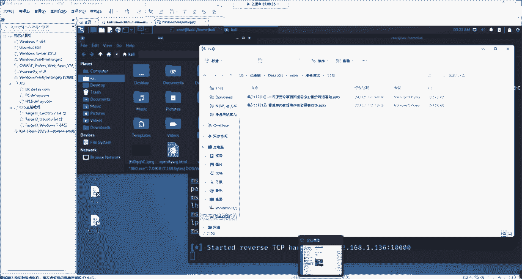

最基础的秒纱就是能够躲避火容安全探测的就是大家最常见的夹壳。加壳呢分为压缩壳和加密壳。这个东西在很早之前啊，在windows XPwindows2000之前，上世纪的时候就有这个东西。

它的作用就是防止软件被别人反编译，然后产生盗版软件，就是保护软件的作用。那它能保护软件。那我们想木马是不是一个软件。肯定是的，所以说它也能够保护我们的木马不被杀毒软件查杀，我们就可以利用这个特性。

那在网上呢，你能找到各种各样的夹壳软件常见的，比如说像UPX像穿山甲，以及呢嗯虚拟机加密。那这些呢壳都可以去使用。大家可以根据自己的情况选择相应的夹壳软件进行为病毒自动化的夹壳。当然呢你每个壳不同。

那根据不同的杀毒软件效果也可能不一样，请具体自行尝试。因为杀毒软件也是逐渐更新的，就像大家用360是不是每天会告诉你啊病毒库一更新360安全大脑提醒您病毒库一更新，然后再给你推个小广告，是这样的吧。

所以说呢啊就是能不能用大家自行尝试。我现在啊那个是被杀掉了，是吧？被杀掉。来给大家演示一下。被杀掉呢，我首先先给他恢复一下，不然的话我连他在哪儿都找不到。大家记住，我现在没有恢复，我做的是提取。

因为你恢复的话，就是把它添加到了信任区，杀毒软件就不会再次查查它。而你提取的话，杀毒软件还是会再次查查的。我提取到这个文件夹中。来看一下。这文件夹360是不是在这，现在它是会被查插的我们简单加个壳。

我选用的这个壳呢叫做the media，这个壳呢也是属于虚拟机保护的一种。这个壳加个程序大家百度一搜就能搜到，就是the media啊，大家去搜，我就不提供大家了，防止部分同学可能传播啊。

造成一系列的影响。大家呢可以自己去搜，我发到讨论区了。我们来看怎么去用，非常简单啊，你直接双击就行。双击之后。我们打开这样一个程序。等待它的启动。

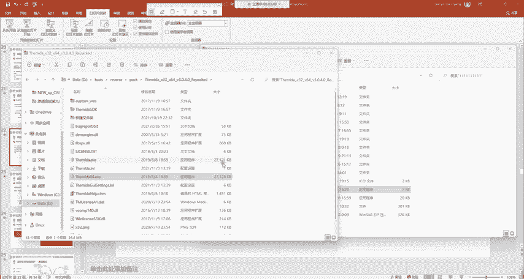

哎，打开之后呢，我们直接的把这个360给拖过来，看我拖进来。拖进来之后，什么都不用碰，什么都不用碰。这个回看的话可以问一下班主任啊，我这里是做了录屏的，到时候可能会有一些回看，那也没有关系啊。

然后我们拖进来之后，任何的设置都不用去改，点，直接点protect。就是保护protect。我们等它自动的进行啊，自动的去保护。好，现在可以看到他告诉了这个successful，就是已经成功的保护了。

成功保护之后，它会生成一个这个东西叫360protected这样一个东西。我们来看它会不会被杀毒软件杀掉。

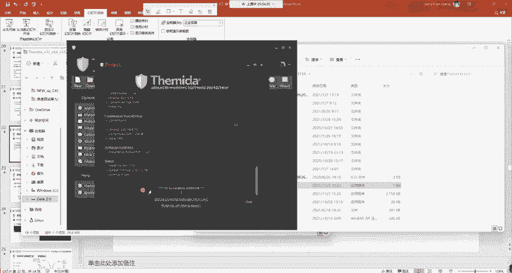

看一下。不会。我可以明确告诉大家，现在这样一个壳是能完全的绕过火容安全的。

那现在怎么办？我们。鱼钩是不是摆好了？鱼钩掉合理了吧，现在呢就等待这个鱼儿上钩就行。比如说你是个病毒发给你的室友，你改一下他的图标，改一下他的内容。你说老弟，这是我新做的软件，你双击一下，看能不能运行。

然后他一双击不就上钩了吗？但是啊他双击之后，他的电脑上不会有任何的显示。他会然后你怎么解释？你说哎这个软件可能没做好，兼容性不佳，没运行起来啊，这样就行了。这个上钩的。

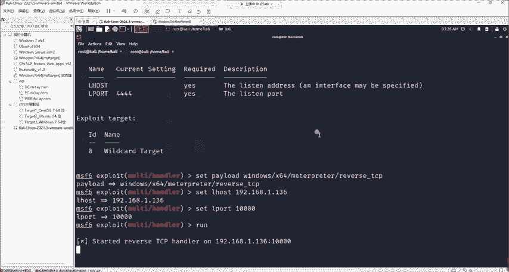

我们来看一下，我现在就以老师自己的电脑来去给大家试一下，我双击。看这边有反应有反应。啊，是吧直接就来到了这个matterpre里面。那来到这个里面之后能够做什么事情。我们之前是不是讲过了。

能够去增添用户能够去做任何的事情。我们下面呢再来举个例子。啊，这里还是提醒大家，这些免杀的后门木马请勿随意传播。如果你传播被别人点击，造成一定的经济危害的话。

是属于提供计算机操作系统入侵工具罪以及非法入侵计算机操作系统数罪并罚。这个我们懂法的，应该知道，这个是会判处有期徒刑的啊，大家千万要注意不要进行非法传播。我们通常在生成木马之后，是经过公司的授权啊。

之后我们在做渗透测试的时候才能够去使用啊，一定要清楚。

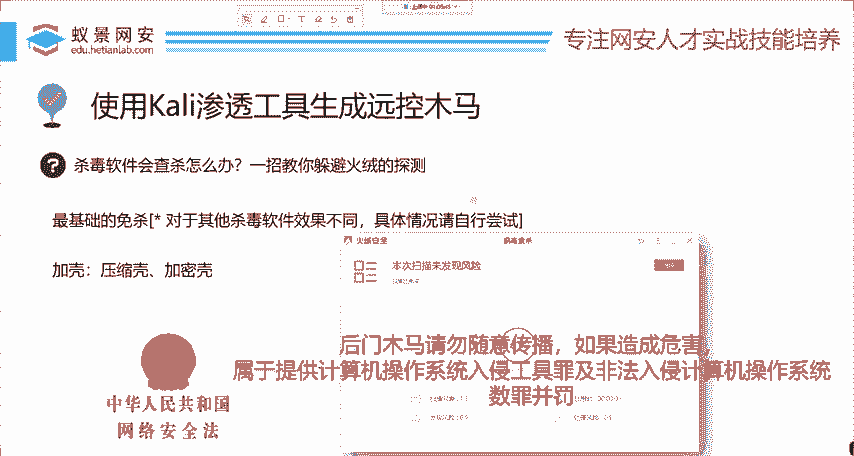

那，我们下面呢来给大家上钩之后怎么办？就随便你想篡改破坏监控，只要你的权限够，你可以随心所欲。比如说我去打开摄像头来给大家看一下。

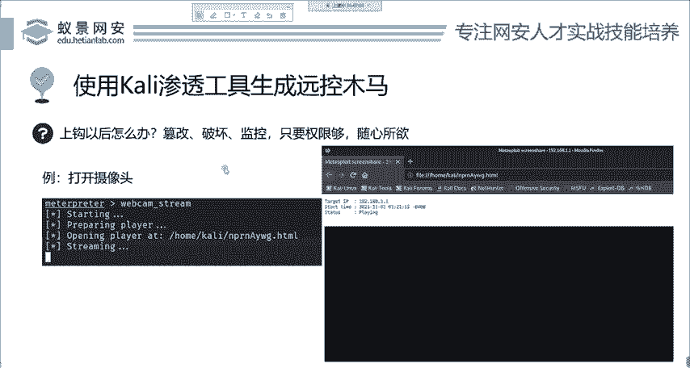

嗯，我就真的打开我本地的摄像头，打开摄像头叫做webcam list。首先我看一下它有没有摄像头，你的电脑啊，像台式机，它没有摄像头，你开个啥呢是吧？它没有我现在要看一下，我这个地方是个笔记本，它有。

比方说我这个命令怎么知道的？这个命令你help就能看到好吧，help之后，你往上滑一滑，在这就能看到。啊在这儿看没？去列出这个摄像头以及什么去打开他的摄像头录像。那我们就试一下试一下这个好吧，打开录像。

Weever cap。stream是吧，打开这个录像。

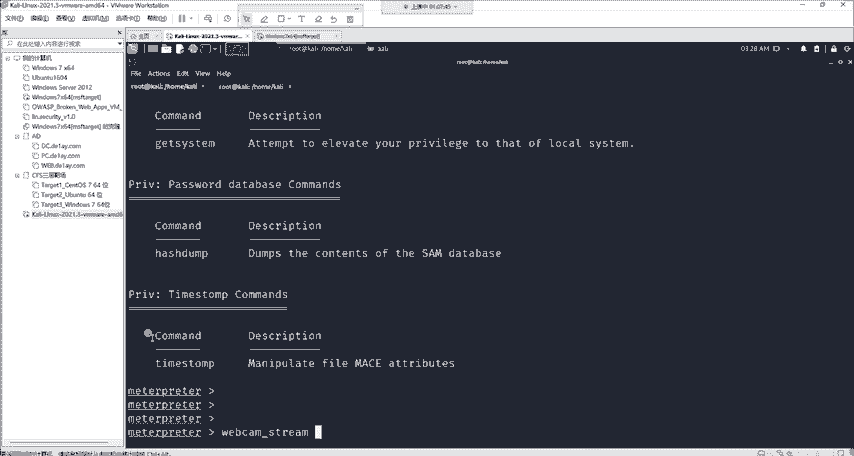

啊，等一下稍等一下，打开了。打开之后呢，我们现在这样一个摄像头，你看的摄像头是哪里的？摄像头是老是自己的机器，就是受害者的摄像头。我给大家打开看一下，因为我这个摄像头呢是隐藏的。啊，大家看好，哎。

我用手遮住了自己啊。OK可以看到能够成功的监控别人。并且如果这个摄像头没有进行任何隐藏的话，你是看不到，就是受害者是没有任何反应的。所以说这就是为什么很多搞安全的人，他都会把这个摄像头用贴纸贴住啊。

就是防止这些摄像头的泄露。如果说这些长期的录像会占用CPU的空间的话，那一般的黑客他会给你拍一个照。

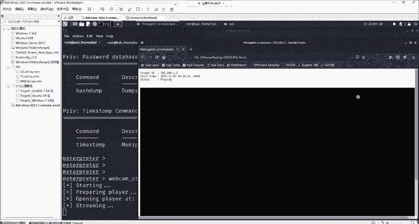

拍个照就几毫秒的事儿是吧？直接给你拍个照，你没有任何感觉。甚至你的你有很多电脑，它的那个摄像头，你拍照的时候会亮灯的，那个亮灯的时间可能都不会有，就直接给你拍下来了。拍下来了拍下来之后后果如何。

大家自己想啊，后后果如何。所以说呢这样一个圆空的后门木马在实际的应用中还是非常广泛的。

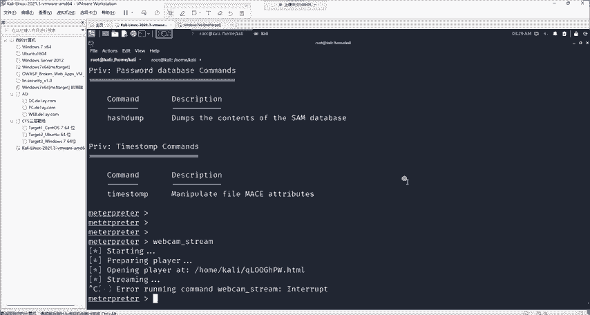

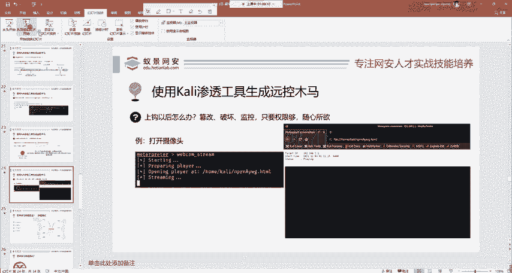

OK那今天呢我们就讲解了在卡里中一款工具，mat split基础使用模式讲解了通过漏洞攻击永恒之蓝，攻击win7操作系统。如果你还是在使用win7，请你小心要安装相应的补丁。

第二点呢是生成远控的后门木马，就是在没有漏洞的情况下进行钓鱼，让这个鱼儿啊主动上钩啊，要钓它。当然这个钓啊是要有一定的技术的，而不是像姜太公一样愿者上钩，这样的话谁都不愿意上钩。

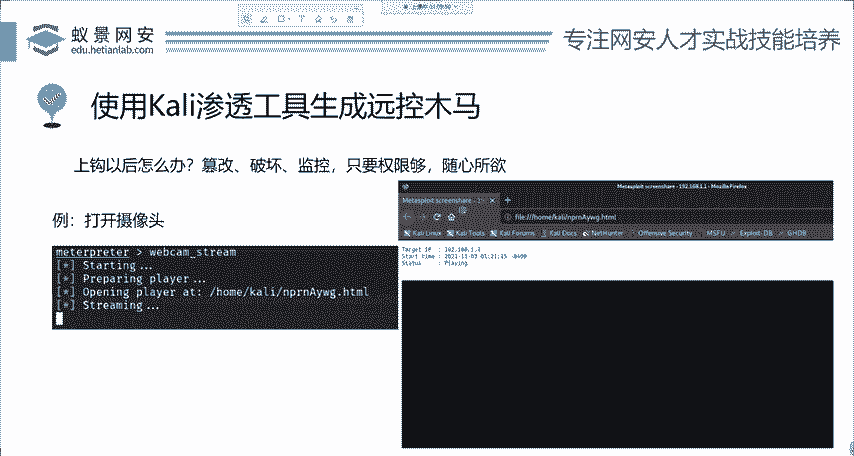

OK那这里呢就是渗透测试的一个基础课程。那下面呢在我们渗透测试的时候，是有非常多的这个内容的，这里只是其中的啊万分之11个小点。如果你觉得对网络安全感兴趣，渗透测试，觉得你想找项应的工作，它比较刺激。

想去做互网赚外快。那并且呢觉得自己学习缺乏体系的知识，并且坚持不下来，学习太过于迷茫啊，你就可以了解一下我们渗透测试的特训班。

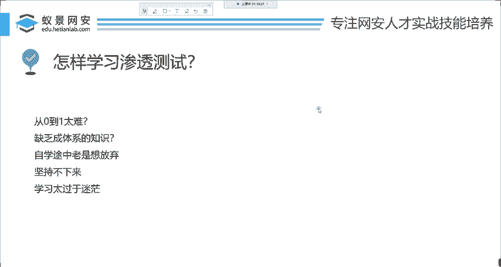