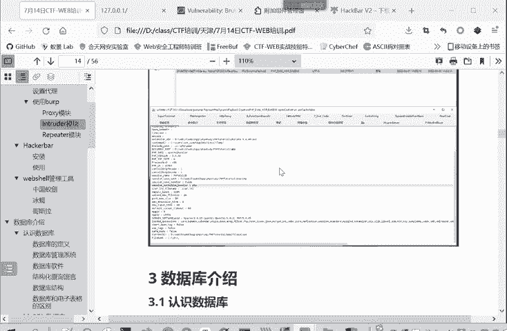
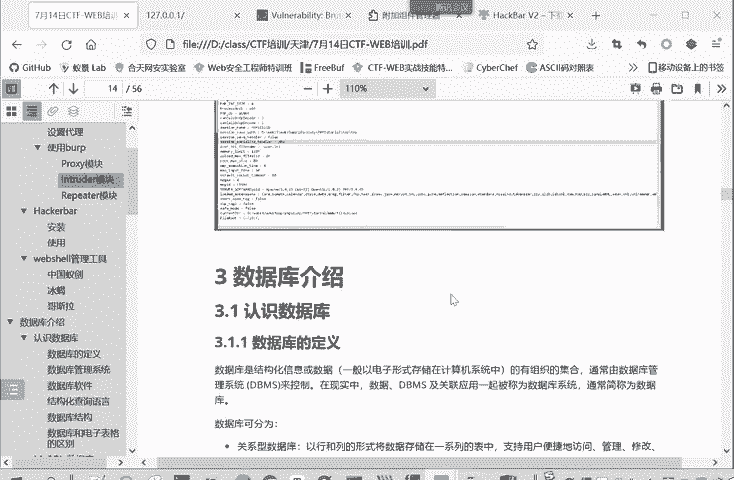
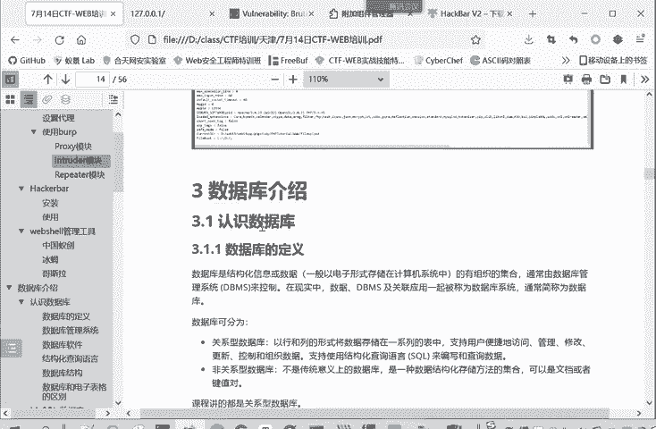
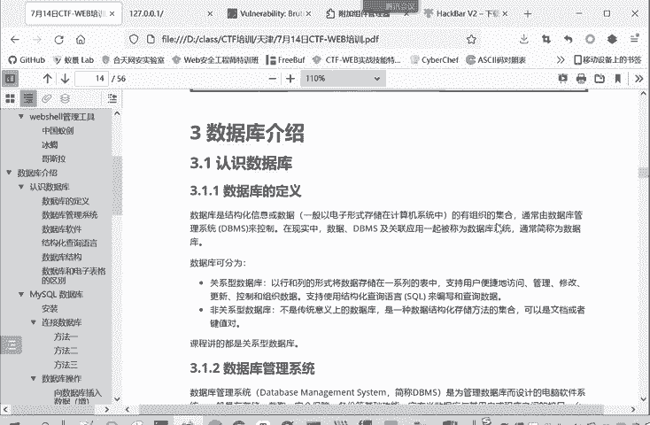
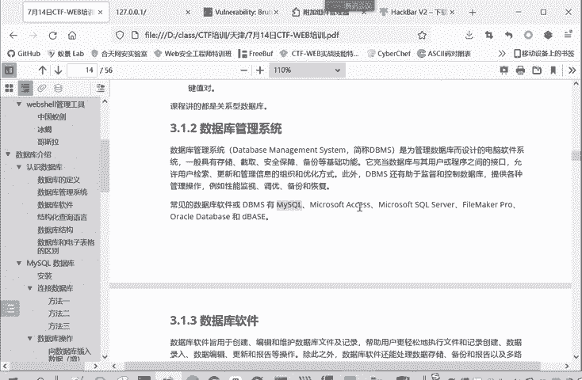
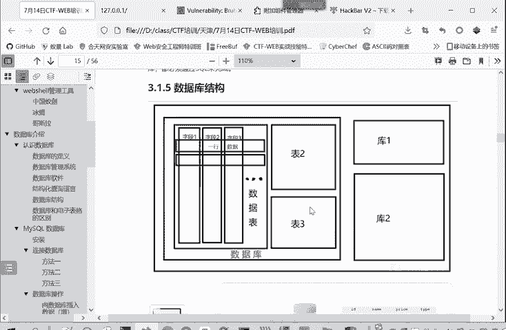
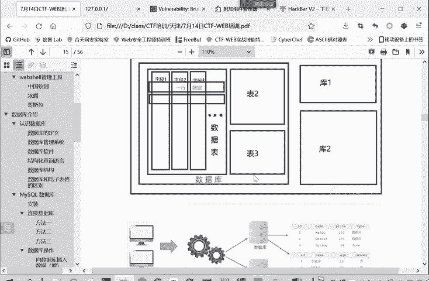
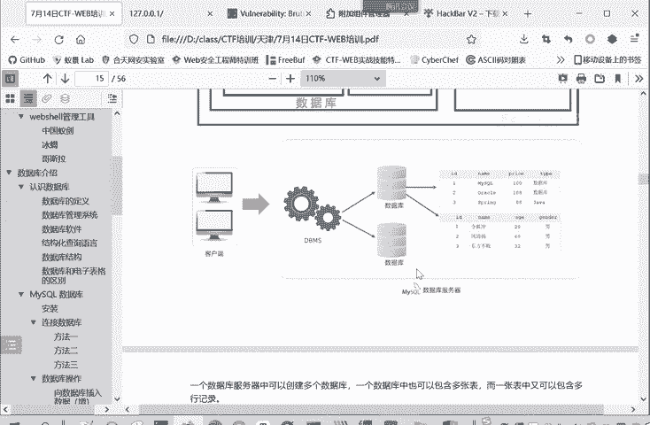
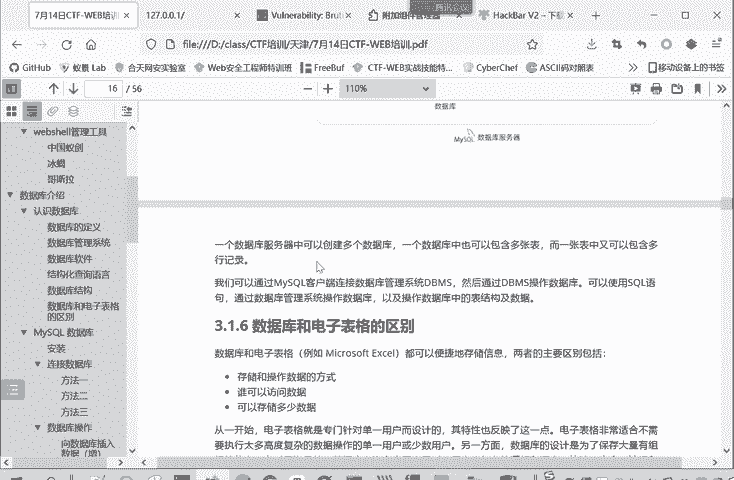

# 2024年最强Kali渗透教程／网络安全／kali破解／web安全／渗透测试／黑客教程 ／代码审计／DDoS攻击／漏洞挖掘／CTF - P70：4.认识数据库 - 网络安全系统教学合集 - BV1Pe411C7Zb

同学们好，现在是10点10分，我们开始上课。

然后我们进入第三部分的学习，就是一个数据库。其实这是为了学习那个circle注入，我们先介绍一下数据库。

下一章再介绍这个circle注入。数据库呢我们。先简单介绍一下数据库，数据库就是一个结构化信息或者是数据。其实信息就是数据。数据他也是有信息。至少在我们计算机领域就是这样。结构化信息的有组织集合。

通常由数据库管理系统叫DBMSd manage system来控制。在现实中，我们数据啊、数据库管理系统和关理的应用，就是管理的软件呢，一般就统称为数据库管理系统，或者简称为数据库。

并没有做严格的一个区分。

那么数据库的类型呢可以分为关系性数据库，它就是以行所列的形式存储了一系列表中。他支持用户便捷的访问管理。修改和控制。他支持使用结构化查询语言，也就circle来编写和查询数据。

这是我们传统的主流的一种数据库的类型，关系数据库。那么后面新出来的就是非关系性数据库，它并不是传统应的数据库。它是一种数据结构化存储的集合。

非关系性数据库就不是像关系性数据库这样规则行和列的形式来存储数据，然后可以用circle语言来查询。非关键性数据库，它反正就是存储的是一堆数据。但是他的方式是很灵活的，所以他的。复杂度也更高一些。

然后我们这里学习些数据库呢，主要是学习这个关系数据库。因为后面是讲circle注入，它必须要支持circle语言，它才存在一个circle注入。我们可以讲的都是一个关系性数据库。

下面再介绍一下这个数据库管理系统。还是为了管理数据库而设及到电脑软件系统。它具有存储啊、截取、安全保障和备份等基础功能。它实际上是充当数据库和用户或者是程序之间的接口。

就用户或者程序通过数据库管理系统来使用数据库来控制数据库。那常见的这数据库管理系统就有mysq，这是我们课程重点讲的。还有微软的accessci server等等workic的一些。

这数据管理系统。然后数据库软件呢就是用于创建编辑和维护数据库文件和记录，帮助用户更轻松的执行文件和操作数据库的一个软件。说白了就是操作数据库的软件。就是随着这个数据库软件的发展，它的功能呢是越来越多了。

它很多呢都是和这个数据库管理系统集成在一起。下面我们介绍一下结构化查询语言，structure query language。取首字嘛就是SQL，也就circle。

我们平常角circle注入就是这个结构化查询语言注入。他是一种特殊目的编成语言。什么特殊目的就是专门为了操作数据库而设计的语言。它是用于查询数据啊、存储啊、更新管理数据库系统。

就是大家无论用什么样的编剧语言，用java，python C啊等等编译程序。只要是涉及到操作关系型数据库。那么都是用这个circle语言。来进行操作，都用scle这个语法规则来进行操作。

这是一个结构化产品语言的概念。那我们再来看一看数据库的结构。我们所说的一个数据库，这整个是一个数数据库系统。或者数据库管理系统，它管理的多个数据库，这里面有一个数据库，还有库一块等等很多个数据库。

那每个数据库里面呢又有非常多的数据表，数据表一、数据表二表3，那每个表呢都是由行和列子组成的这每一个表就类似于一个excel表格一样，类似于啊。还有很多个表，就表里面有很多个字段。

就是很多个列字段一、姓名、性别、年龄。然后有很多行，第一行是张三的数据，啊，米四的数据。这是一个数据库的整体的一个结构。

让我们。换个角度来看。怎么样？操作一个数据库端就客户端。或者是程序通过数据库管理系统，比如说mysq。来访问某一个具体的数据库啊，这个数据库里面有很多个表，来看某一个表。

它这表里面有多个字段ID namepri tag有多条记录来看这些记录，或者是修改删除增删改查嘛，都能进行操作。这是另一种结构。

他们俩内容是一样的，只是以不同的形式来呈现。

那帮助大家更好的理解。

所以说一个数据库服务器中啊有多个数据库，一个数据库有多张表，一个表呢有多行记录，多个字段。

这里再给大家解释一下这个数据库和一个电子表格的一个区别。我们所谓电子表格事实上就是excel。两种区别主要在于存储和操作。数据的方式不同。比如说。数据库是为来存储大量的数据。

他是通过srcle语言来操作数据。电子表格呢是存储少量的数据，它是通过命令的界面来。或者通过excel这个软件来操作数据的。那么访问数据的方式呢，数据库呢。可以多人同时访问。就像大家上网一样。

我们看知乎知乎有这个评论哪，有文章啊，实际上都是放在他数据库当中。但是大家在世界各地访问知乎都是可以同时进行的。这个数据库的数据可以多人同时访问。那excel呢就是单人的。某一个人打开这个excel。

某一个程序打开excel。来进行使用。那存储多少数据呢？数据库是存储大量数据，电子表不能excel就是存储量比较少，可能几十兆。上百家的excel就是已经很大了，你要打开它的话，就是很费力了。

所以说一开始电子表格就是我专门为单一用户而设计的。那相对的数据库呢就是为了保存大量有组织信息，有时甚至海量的。同时还允许多个用户同时使用，为多用户而设计的。这些引啊备注的一些内容。课件也发给大家的。

大家。可以自己去看一下。然后我们重点介绍mysq数据库这个数据库管理系统。它是我们讲课的一个重点。I think数据库呢是一种开源的，基于cicle的关系性数据库管理系统。它还专门针对外部应用进行优化。

可以在任何平台windowslinux。macOS都可以进行运行。来C一个特点呢就是灵活多变。互联网的兴息带来许多新的心和不同的需求。那myser就开始成为了外部开发人员和接基于外部的应用的首选平台。

灵活。随心应变的灵活性呢是myss的一个主要特点。所以就有很多顶级的互联网网站和基于外部的应用呢，都采用了mys作为数据管理系统。

