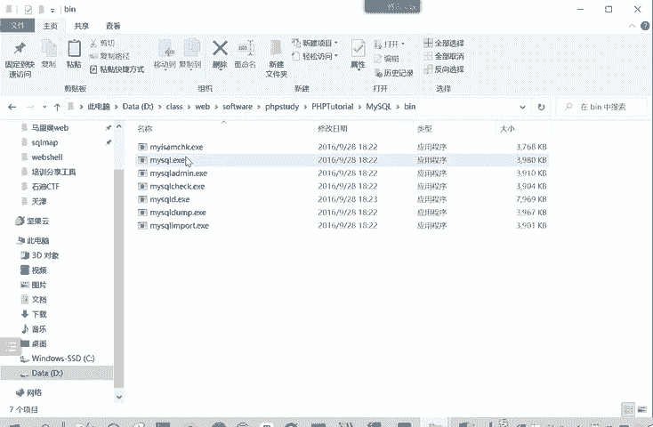
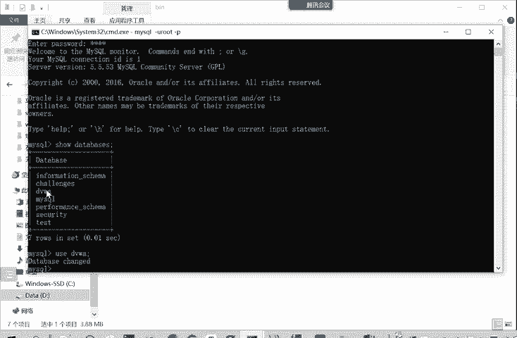
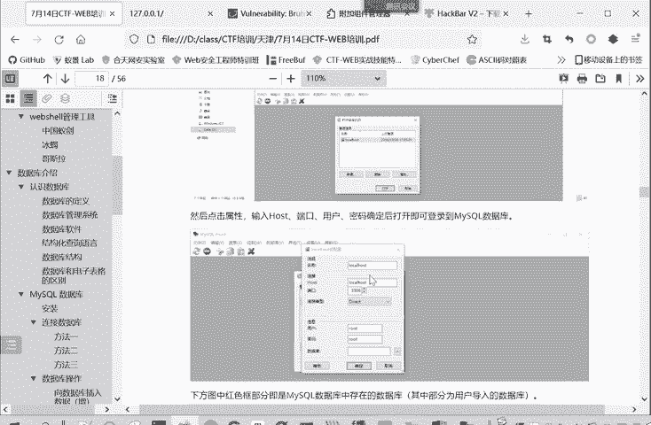

# 2024年最强Kali渗透教程／网络安全／kali破解／web安全／渗透测试／黑客教程 ／代码审计／DDoS攻击／漏洞挖掘／CTF - P71：5.数据库的安装和连接 - 网络安全系统教学合集 - BV1Pe411C7Zb

那么我们下面看一下mysq数据库的一个安装和使用。安装呢？这里大家之前装了PHP study，就不用再专门进行mysl数据库的一个安装了。因为PHP study它是一个集成环境。

它是集成了myscle就是WAMP嘛。是一个。WAMP的一个集群环境。W这个就是windows我们操作系统。这个A呢。阿帕奇M就数据库mysqP9PHP后端语言。它是个集成的系统PP study。

一个集生环境。是阿巴西myscle这个PHP。看这PHP都集成在一起了。只要启动了C口就启动了这个。要启到PP3D就启到这mys数据库。那我们启动了数据库之后，如何进行连接呢？主要有三种方法进行连检。

一种是。mycyclical数据P区 study里面有个mys目录，我们看一下。HP tutorialtor里面有不同的目录。这些目录都是对应的设置。如果大家只要设置买sql，就会在这里面进行修改。

的配置也在里面。那么想要买scle，这面有个B。有个 my secret eX c。

我们呢可用通过这个程序来连接我们的my这数据库。怎么用mycycl。朋 you用户名是什么？抗屁。要输入密码。这样就已经连接成功了。那就可以使用这样。de口命令的 databasebas啊什么的。

查看有哪些库。哪些数据库？然后呢，右侧。我们就使用跟VWA这个口。现在我们就使用已经进入到这个柚子这个DVWU这个数据库当中了。

这就是一种连接方式，课件连写了，通过命令行工具来连接。第二种方式呢就通过数据库连接软件。比如说我们的PHP study就带来一个数据库连接软件，my circle front。来点击。

对买ci管理器里买ci front。就可以了。然后大家首次连接的时候。就可能新建你输入这个名称，你这个连接的名称随便输入。民间地址呢就是我们本地。然后输入用户名和密码就可以了。

然后以后每次连接的时候直接。把你保存的登录信息打开就可以进行一个连接。连接同样我们看数据库也是同样有1234567有7个数据库。比如说我们看DVWV这个库就是我们靶场。所需要的一个数据库，它有两个表。

ge book这个表。呃，数据呢啊是一些屏comment name这信息users这个表。U在这边啊这个信息呢是Uer IDD。fi the namelast the name用户名。密码。😊。

登录时间这些信息。这是第二种方式，通过叫myic friend。当然你还有一个东西PP admin也是可以连接的，也在我们这个里面。这个也是可以连接的。不过这是通过网页来进行连接。

我们一般还是习惯用这个连接工具并制软件进行连接。那么第三种方法呢，就以上两种方法都是用户对数据库进行连接管理。那么如果是一个网站。用别人的用户访问这个网站，网站需要查询数据库的数据，那怎么进行连接呢？

这就以PHP语言为例。你实际上别的GSP语言这些都类似。关键就是这个连接命。Mycycl。Connect。然后你之前你把这个sber name。就是数据库它是放在哪个地址的。

然后数据库登录的用户名和密码填进去就可以进行连接了。这是进行网站开发需要的连接方式，对用普通用户的就是命令行或者是连接软件这两种。

