# 2024年最强Kali渗透教程／网络安全／kali破解／web安全／渗透测试／黑客教程 ／代码审计／DDoS攻击／漏洞挖掘／CTF - P72：6.数据库基本操作 - 网络安全系统教学合集 - BV1Pe411C7Zb

那么我们下面看一下这个数据库的一个操作。我们操作数据库呢主要就是。读取数据修改数据，查看数据。可以用增增加删除修改查看，增删改查四个字来进行一个概括。所以这里主这里我们主要是讲啊。

为了后面circle注入做准备的一个学习。而不是说为了一个网站的开发。那网站开发，我需要维护数据库的稳定性啊，创建新的数据库，创建新的表等等。这里我们就不需要进行这些。

我们重点是对它里面的某一些数据进行获取，这是进行这个外部安全测试的时候需要进行的工作，主要是获取数据。

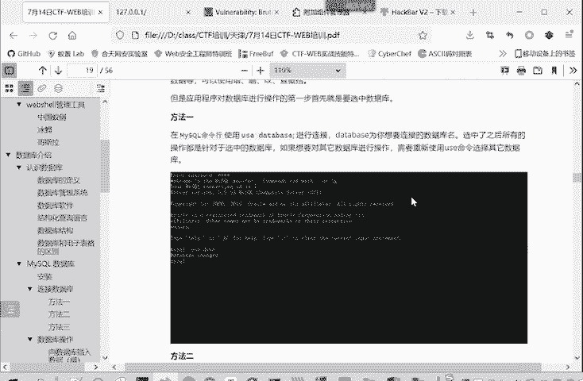

那么在进行数据库操作第一步呢，就要选中数据库，使用右s。数据库的名称。就选中了你需要你操作的数据库。那么你后面的查看数据啊，修改数据啊，都是在你选中的这个数据库进行操作。比如说我们刚才这里就是。

选中的这个DVWV这个数据库。那么们这里修tables显示的表呢，也是DVWUA的表。这个数据库里面的表和而不是其他数据库里面的表。

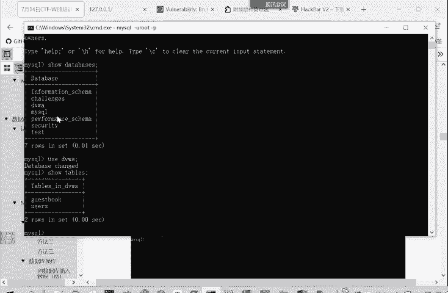

嗯。这同样的有三种方法使用数据库。

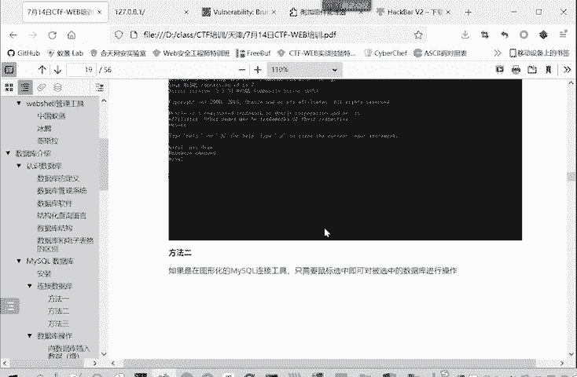

在命令行呢就右手。然后在连接软件里面，你直接用鼠标选中这个命令界面大家都懂。然后在这个网站开发里面。就是my my second say next。DB这个函数对数据库进行一个选择。我们这点写了。

先是连接数据库嘛，要把这个连接的距离给带上。然后你选择数据库的名称。选择哪一个数据库？这是连接连接好了之后呢，像数据库里面。增删改查数据。我们下面就重点看一下通过命令行怎么操作。

因为通过软件通过这个方法二呢，软件这里进行操作，这非常简单，直接进行。直接进行修改这个。用户界面是很友好的，这就不用讲了。然后网方法三呢，这是网站开发的一些方法。我们这里就我们不是开发人啊。

只要了解一下。

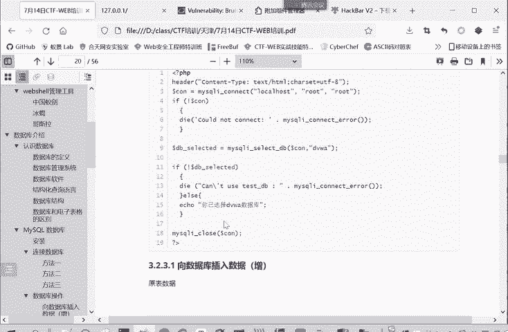

不做重点讲述。我们重点讲述就是在命令行里面。因为大家以后要参加比赛的做题，主要通过这个命令哈。就是很多时候离不开这个命令行操作。我们主要是看一下在这个命令行里面怎样进行一个增删改查的一个操作。

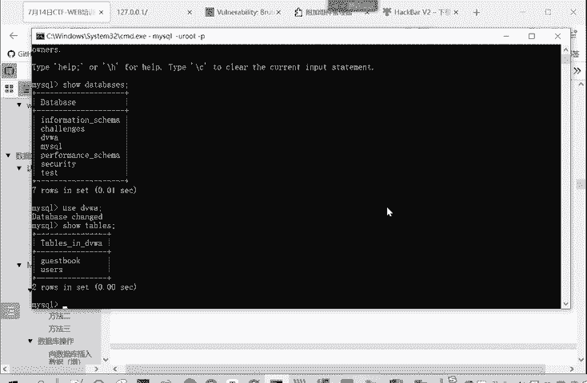

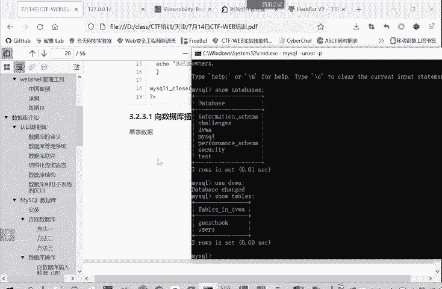

比如说我们刚开始我们首先看根据我们的这个目录啊，首先看增增加呢就是insert这个命令。他后面要带阴土，然后表明我在哪个表里面。增加什么值？🎼比如说我们的gue book，我们先看一下ge book。

那么ges the book呢就有三个字的comment ID commentment和 name这三项。如果说我们需要向里面增加一条数据的。这你写就是insert into这个表的名称。

gestbook。然后。他的。评论和name是值是什么？就comment IDD是自增长的，这个我们是不用管的。我们在这里面啊看一下。

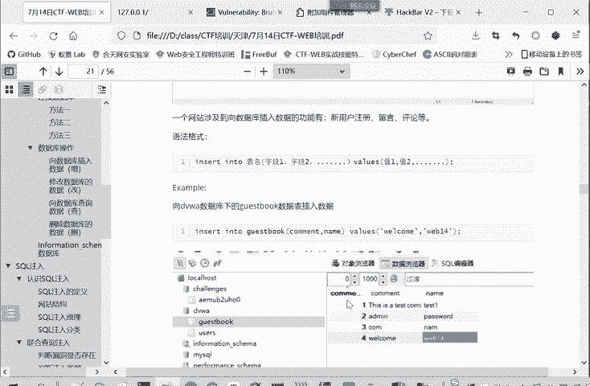

Insert into表格的名称，testtbook。然后字段名。字段名和表格名称这些都是。不用打引号的。valueual。然后他我们传进一下职内蒙，后面的是什么？Comment头。不不。然后内蒙。

你是外。好，这些就OK。一行受到影响，那我们再看这里显示我们刷新一下。

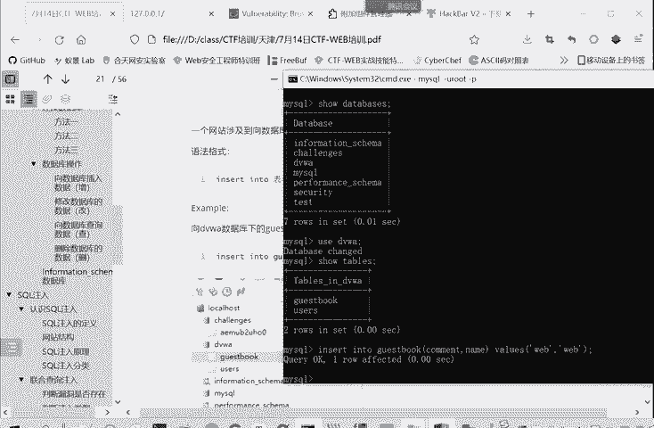

是不是我们刚才添加的信息就显示出来了。这就是一个真。就是insert into。然后选择表格里，表格里面的字段。然后在wins后面是字段的值。像这些数据库自带的这些数据库的名称表明。

然后他字段名这些是不用加引号了。原来你要输入的字符串需要加引号的这是一个区别。那我们再看看如何修改数据，修改呢就是更新updateupate一个表面，然后update后面接的一关键字呢是set。

字段名等于什么？然后为尔条件。比如说我们这里如果你不加威尔条件，加了威尔条件，只满足这个条件的这一行进行修改，不加威尔条件。那么所有的都会进行修改。我们这里先看一下这个。facebook原始的数据。

那我那么我们进行修改看一下。

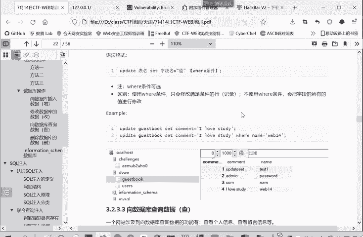

Update。Yes。update表明。然后。后面是s这个命令。然后字段名要改哪个字段？这我们不改科目的，我们换一个改内蒙字的。把name字段改成什么呢？对，是不是内蒙斯的就改成一个。全部都改成我的命。

如果说不加未来条件，就这样。嗯。命令行输入的时候就是经常会有。Okay。Yeah。

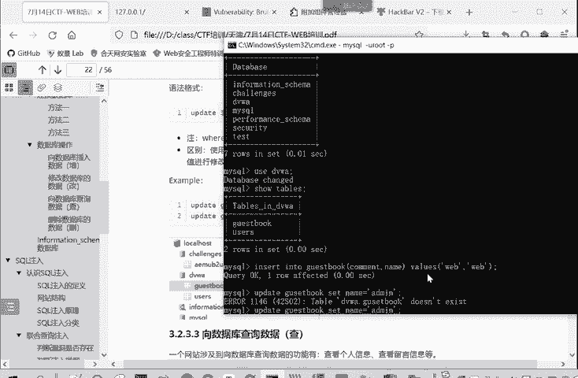

输入的一个错误。G u e s t。这你看显示成功了。卖选三行改变了两行。那么。它影响的是三行，改变的是两行。因为第一行原来就是有的密，它不用进行修改，那么刷新一下看一下。

看用户名是不是都被修改成addmin。

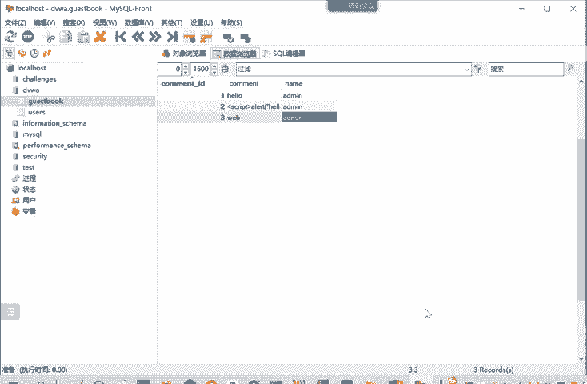

那么如果我们说如果我们加上这个未害条件呢？说内蒙改圈。威尔。加乡未养条件。where什么toment。t m m英。后面的ID等于一。

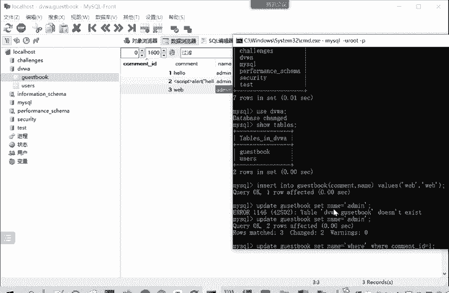

他受影响就一行。那我们刷新一下。是不是空me的 IDD等于一这一行的名称改成了威尔，其他的都不变，这就是一个威尔条件，它没有，它所有的都变，它有的话只改变满足条件的那一行或几行数据。这就是修改。

比如说大家以后参加CTF比赛或者参加货啊，有的时候要修改这个数据库里面存储的用户的口令，就可以用这update这个命令来进行一个修改。但最常用的还查找。就获取信息而不改动信息，这是最常用的。

查找的就是sn。这里面你选择查找的查找哪些字段from哪个表面，当然也可以带上未尔条件。如果是新号的，就查看所有信息。我们这里执行一下。我们比如说查看星号from。Just the book。

那查看gebook这表所有的信息。有时候我不想看他所有的信息。我只想看他的内幕。没有看他的comment。它就只会输出name是多少unquament是多少。

就空白ID这一下这个字段我们因为没选择就不进行输出了。刚才新就代表所有选择所有的时候，它就。属于被选择的字段，那就会进行输出，这它区别。那么同样的也可以带上一个未来条件。

你看我们where common IDD等于2，那么它就会只会显示。后面的第二的这一条记录。威尔是加一个限制条件。

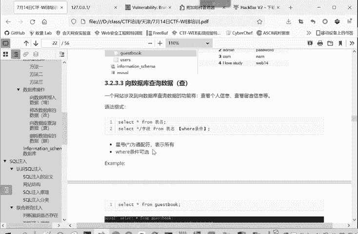

这是查那删除了删除。

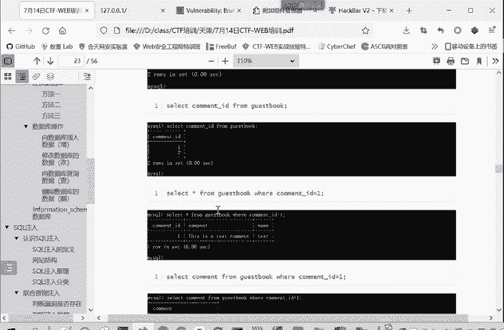

从这个英文单词就知道delete。delete from表明，然后带上一个路要条件就删除某一个记录。那比如说我们刚才这个。我们刚才查到这个addmin这个记录，我们想把它删除掉。那就是 delete。

Yesbook。ne frombook where是么common。那我们再查看这个好，我们刷新一下，是不是刚才那条数据。就一些。被删除了。我们刚才查看空me IDD等于2个数据呢。就没有啦。深客体。

不存在这个com IDD等于二的数据了。因为我们上一步已经进行了一个删除。这是数据库的一个增删改查的操作。增加。Insert。修改update。查询seect，然后删除deele。

这是一个增山改查的一个工作。

然后。下一个板下一个板块呢，我们再介绍一下来s克这个数据管理系统中非常常用的。非常重要的一个数据库，自带的一个数据库，information schemema这个数据库。我们直接打开电影看。

mys数据库都自带了这个information schememer这个数这也是一个数据库。这个数据库是什么呢？是mys5。0以上就自带的一个数据库。它叫做一个信息数据库。

它是保存着mysq服务器的相关信息。比如说这个数据库就保存了其他的这里一个我给你们看一下。Yes。s个ma。他是买 informationform这个数据库其中的一个表格，这个表格保存的是什么数据呢？

就是我这个数据库里面有哪些这个数据管理系统管理了哪些数据库，关键inform game这个数据库管节阶段级DVWN接数据库的名称。都是他这个表里面的某一条记录。我们需 databaseabase。

只有dabss刚才连接的时候，查询这个数据库的名称，也是从这里查出来的。所以说这个inform gamemer是一个信息数据库，它就保存我这个数据库管理系统的一些信息，有哪些数据？有哪数据库有哪些表。

有哪些字段？每个字段是属于哪一个表的保，存着这些信息。这里面有很多表，他们我们重点掌握前三个表，因为讲多了，大家刚开始肯定是有点。就会觉得有点懵，搞不清楚。我们先找握最重要的三个表。

在我们ci注入里找握这三个表也就够了。第一个表呢是这个smmer表。它是保存了当前mysical实例中所有的数据库信息，也就是我这一个数据库系统中所有的数据库。都在smic这里面，我们刚才给大家看了。

所有的数据库7个都在这里面数据库的名称。第二个tables顾名思义就是表嘛，tables本来就是表这个表呢它是保存了数据库中所有表的信息。我们打开看一下。嗯。table这个表它保存所表的信息。比如说。

我们筛选一下。嗯。Yes。DVWA中啊就有users这个表有guet book这个表。你table name表的名称users的名称guesbook属于table schemer，属于哪个数据库。

属于DVWA数据库。要普通的表的类型。writing。还有其他的很多的信息。时间戳这些。所以这个smment是保存着。这个数据库的信息嘛。tables表情的。不同的数据库里面都有哪些表。

每个表是求于哪个数据库保存了表相关的信息。那我们。保存了数据库的信息，保存它表的信息。那下面还有一个字段的信息，也需要保存。字段的信息呢，字段实际上就是excel里面的列。所以这个表呢叫quaums。

他提供了表中的镍信息。我们看一下。colums就保存了每个表。看来就更复杂一些。我们还看TV大V。每个字段comme IDD这个字段属于ges the book guess the book这个表呢属于DV那边这个数据库。

同样你。你反过来看，从左往右看，那gas book这个表呢就有三个字段。user这个表呢就有。这些资道。也就是这些年。所以quaum呢是保存一个镍的信息。这是最重要的三个表。地面给他记出来了。

schemmatic这里面有项table s杠name保存的数据户名table记表里面有两个字的table name table schememer。

Colums大一三 column name table name table scheme。经了这个列。存储的列名，然后来自于哪个数据表，来自于哪个数据库。

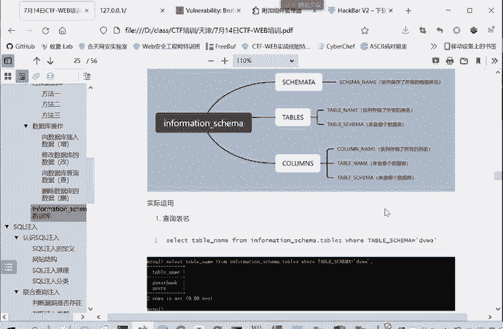

比如说如果是我没法用这个修 database。

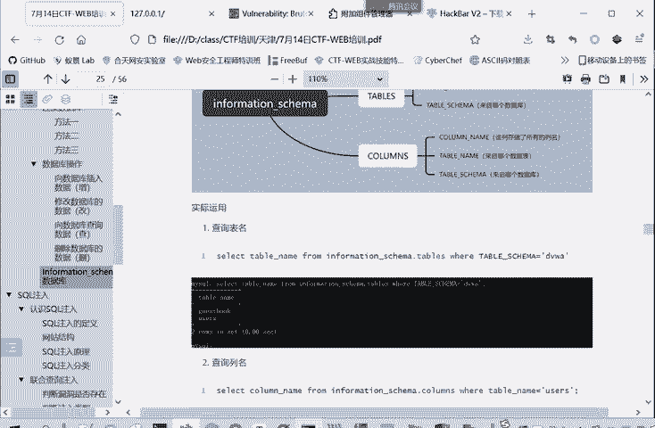

一开始是想看。他所有的数据库嘛就dababs，如果说没法使用这个命令的时候。但是他忙住的时候，命令没有危险，那我们怎么办呢？我们就可以。Theect。He本。因为我们现在是在DVWA这个数据库里面。

我们要查看information scheme这里面的表，我们就得把这个数据库的全称给带上。Senect people name of problem in for。没写。这见嘛。

点tables从这个tables这个表里面查看，是不是？我要听过。通过这样的方法呢，就把这个DVWA里面有几个表查出来了。其实上这怎么看呢？我们从inationchema点tables。

我们看一下tableables从这里面。这个表你们查。查询的条件是什么呢？Table schemema点DVWA。睇波。Skima点DVW就这两个。那它输出就是usergebook这两个表。

我们只选tableable name这一项嘛。别的时间那项都没有查看。

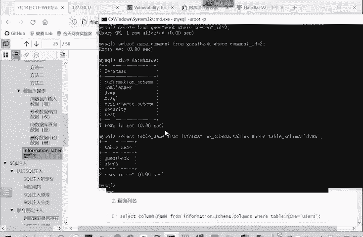

这查询表明查询页名，也就是类似的selectcom name name下面查询表面就tableable name。

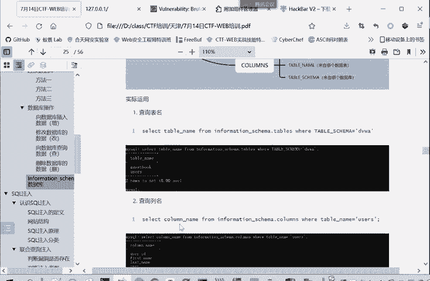

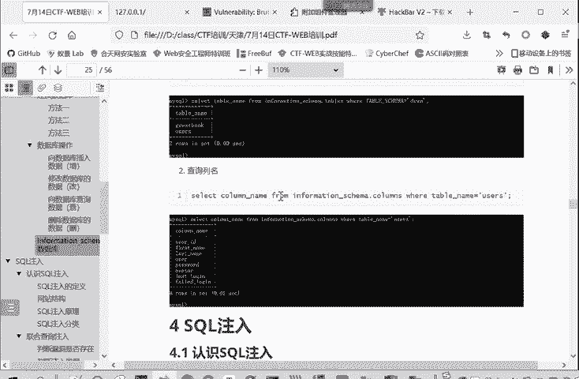

从哪 informationformationschema点 column。他要求和table name的 users。你要严谨一点的话，再加个table schememer，就它这里是先进它数据。

来自于U站之这个表。或来自于casebook这个表，但是没有限阱他们的数据库，来自于DVWA这个数据库。

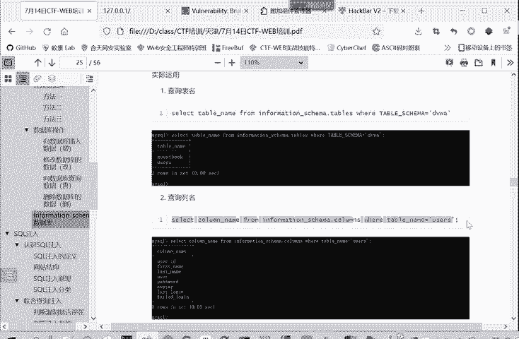

找DVWA。你把users给个表里面的。字段都查出来了。那么如果说我不想谈U。We cuttingt get the book。他们的表都是属于DV，他们的库都是属于DVWA，所以后面and不用变。

这样执行他就可以得到。这个facebook它里面知道名。

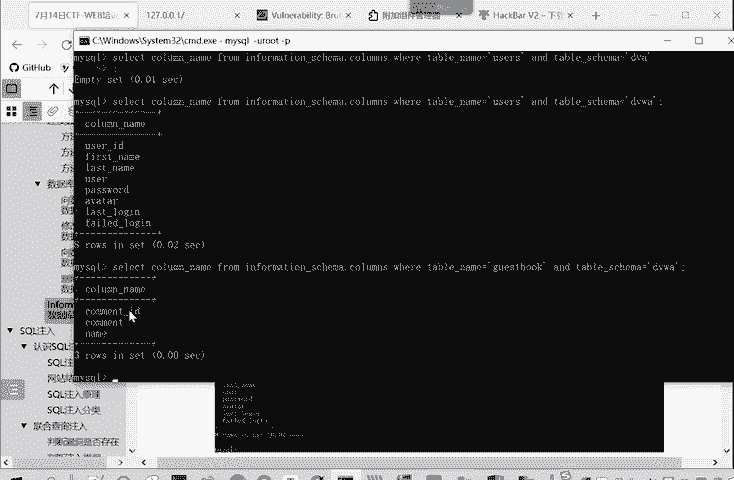

就通过这个表来获取字段名。

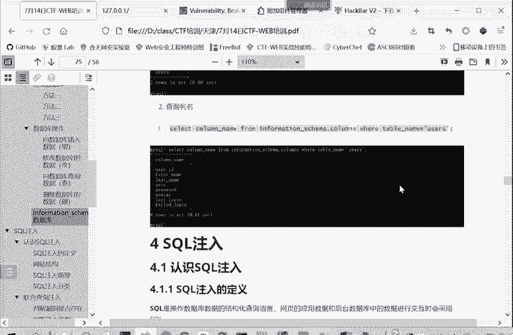

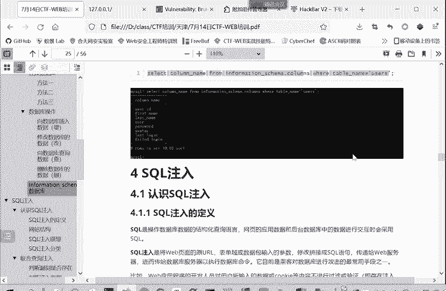