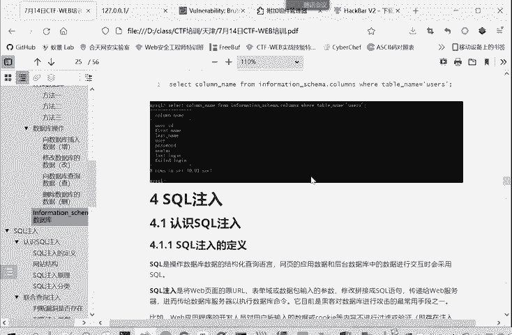
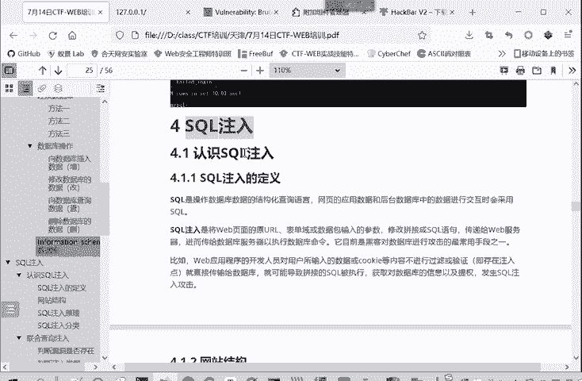
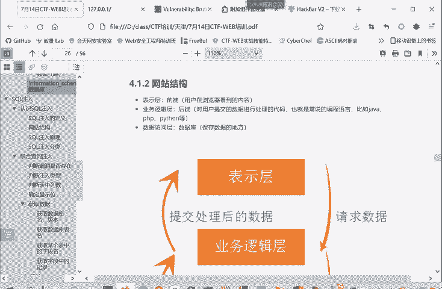
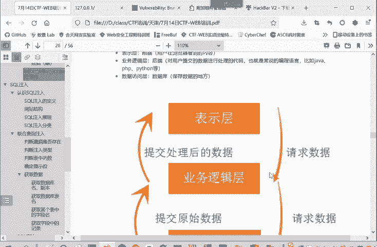
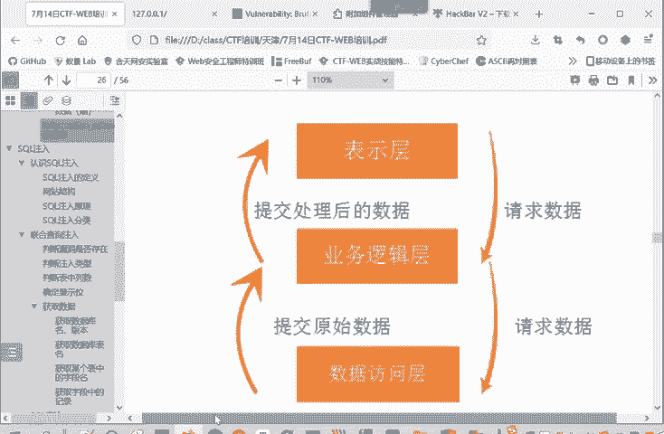
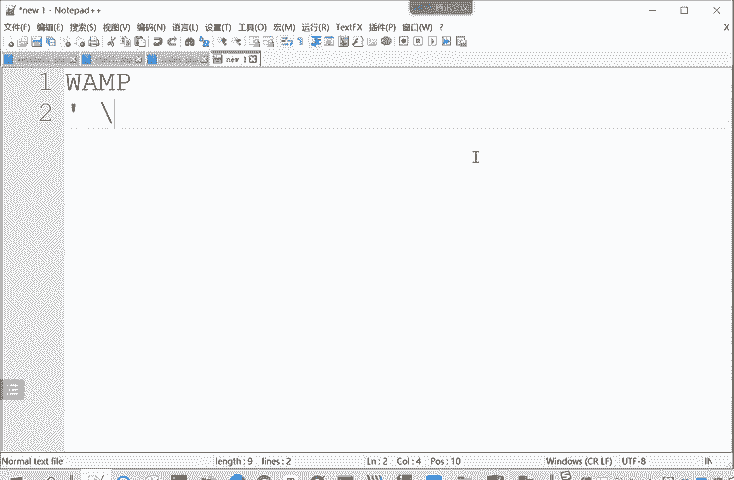
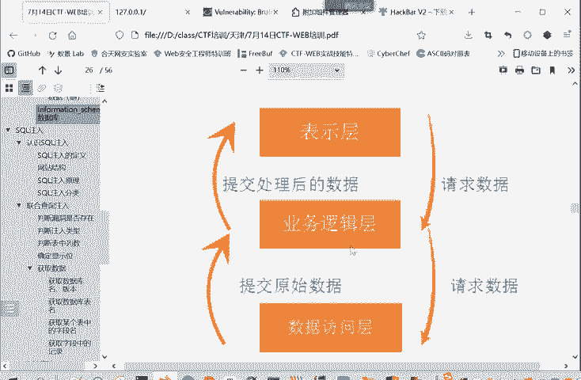
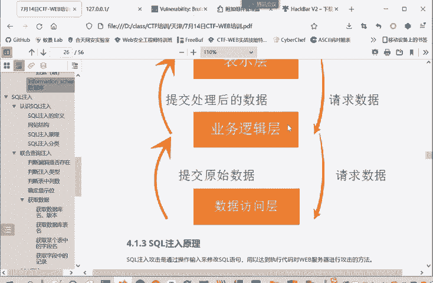
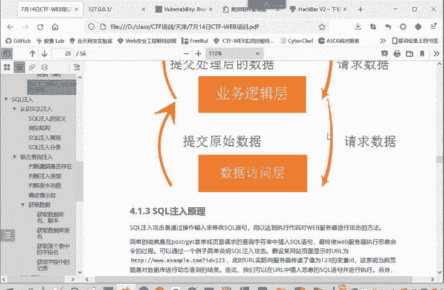
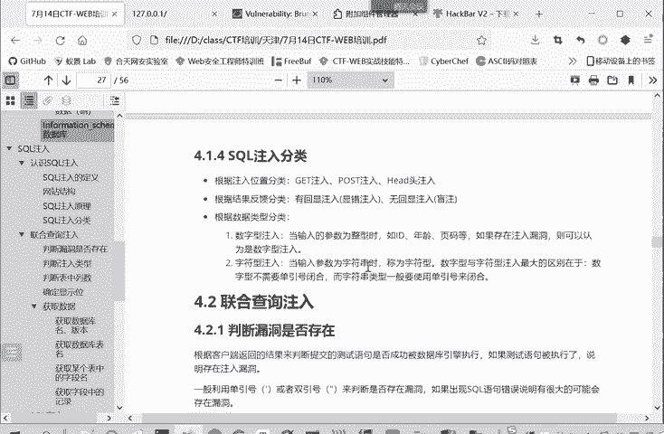

# 2024年最强Kali渗透教程／网络安全／kali破解／web安全／渗透测试／黑客教程 ／代码审计／DDoS攻击／漏洞挖掘／CTF - P73：7.认识SQL注入 - 网络安全系统教学合集 - BV1Pe411C7Zb

上面呢是关于数据库的一个。基本情况的一个介绍，现在还没有涉及到漏洞。那我们呢从第四章呢就开始进入一个漏洞的学习。前面介绍一些啊数据库的基础知识。我们现在进行漏洞的学习。

我们就是这漏洞呢，就是C口注入漏洞。

首先介绍一下scle注的概念。Cirrcle呢就是操作数据库的结构化查询语言。那网页的应用数据啊和后台。我的数据交互时都会采用这个circle来进行查询。只要是关系数据库都是支持srcle语言的。

都是用srcle语言来进行一个数据库的操作。那么cyclcle注入是什么呢？就是将web页面中原来的URL表单呢，或者是数据包中输入的参数。请修改。

通过修改拼接得到一个完整的srcle语句传送给外部服务器。然后外部服务器呢进要执行这个语句，查询数据库的命令或进行数据库的操作。那这样就实现了一个注入命名的方式，对数据库的一个攻击。

所以叫sercle注入。因为注入的是circle语句，或者是拼接完后是一个secle语句。他目前呢是黑客对数据库攻击最常用的手段机，也是最常用的外部漏洞之一。我们这里看一下网站的结构。

为了更好的理解这个注入的一个逻辑。网站的结构其实可以分为三层，一个是表示层。就是我们说的前端，也就是我们这个浏览器。我用户这边看到的是一个保护层。

这个表示层。叫前端在前端呢把请求发送给后端，也就是业务逻辑层。他对用户提交的数据进行处理。也就我们中央时编程语言和后端语言，javapyython等等。P区片等等。那业务逻辑层进行业务逻辑处理的时候。

它不是能干所有的事儿。他有些事情还是要从数据库中获取数据。那遇到需要获取数据的情况，那业务逻辑实呢就对数据防护层，也就是数据库发起请求。然，数据库把查询结果返给业务逻辑层。

业务逻辑层再把这个结果看情况是不是要返给这个表示层，也就是把响应请。把请求响应到这个原来的表示层。这是一个这个网站的一个整体的逻辑。正因为这样，所以我们在表示小区浏览器用户可以输入的。

所以这样就存在一个注入的风险。那么我输入的数据是业务逻辑上需要查找数据库查询的数据。

查询了才知道是什么数据。那如果输入的数据中带有特殊的字符。

就是是符，比如说单引号啊。斜杠啊反斜杠啊。

嗯，结钢协案这些。那么就有可能造成。就数据访问成查询语句造成一个闭合。然后。控制数据访问层能够真正查询的问据。这样就造成了一个circle注入的漏洞。

那我们再看一下srcle注入它到底是一个什么原理呢？circle注入呢就是通过输入来修改circle语句，又为达到执行代码对外服务器进行攻击的一个方法。P。简单的来说。

就是在主要是在post或者get的表单中，当然也有在cookie当中的。将请求查成字据的scle插入进去。然后服务器呢没有做恶意的命令检查。那么你这个插入的恶意circle语句就进入到服务器当中。

当成命令的一部分来进行执行的。这种情况下造成销入注入呢，就是因为。程序在执行的过程中是被动态的构造。就是。业务逻辑辑层向数据访问的请求数据，他不是请求死的数据。我请求张三的数据，我请求李四的数据。

他不是他请求什么数据，根据输入输入传过来什么，我就请求什么数据，所以这容易造成一个闭合的问题，然后改变就落业务逻辑层以为这段程序的意思。

所这里给大家举一个例子，就是我随便访问一个 example这个网站ID等于123，这实际上是用get的方式，用get方式参数传递在URL当中的。像参数传递的一个值位123的变量IDID是变量。

123是变量值。啊。然后它后台的语句是这样，ID等于这个我们传进来的这个ID就打单引号。那你想如果传进来ID它本身就在于单引号，是不是就和前面单引号进行了一个闭合呀？那后面再带一行就不会起作用。

那这中间可能就会出很多问题。所以说这些问题呢就叫做一个circle注入。就把命令注入进去，然后是用的结构化查询语言来进行一个注入。注入的分类呢，我们根据注入的位置可以分为get型注入。

pos注入header头注入。head头注入主要是在cookie中进行注入。也就注入的命密是在哪里？在get就在URL当中，post是在post收理当中。

head头就在我们抓包数据这header head部分。都有可能出现这种。根据有没有反馈题。可以分为有回险注入。包括选错注入啊，联合查询注，这都有回险注。还有包无会险注意。

就是盲助忙助主要有一什时间忙助啊、不尔忙助啊。就是盲助是你拼接命令，这个命令呢是能够得到执行的。但是呢它不会给你返回执行结果，就你看不到这个命令执行的结果，这叫盲助。

但是我们要通过别的办法来看到命令执行的一个结果，这样才好后进行后续的一个。利用啊或写报告或做题都是的。根据类型呢可以分为这个。数字性注入和这个字符性注入数字性注入就输入的参数为整数。

有数字嘛就要输入运输字符型呢就输入参数为字符型。那我们看上面这个例子，那这里面是数字形还是字符型？大家可以想一想。那稍微思考一下，那这个语句这后端的命令，这个语句是一个数字型还是字符型？

这里就可以看出它是个字符形，是不是？因为你输入的东西都被单引号所包住了，它采定于ID它不是ID直接等于多纳ID多纳ID就传入的变量值，它不是直接等于变缘值，它是单引号等于变价值。因为它是一个字符型。

那你以后进行闭合的时候，ID后面就要跟一个引帕来进行闭合。但我是数字型，这两边本来就没有银行。那也就不存在用引号来进行闭合了。这是数字型和这个字符型的一个主要区别。

