# 2024年最强Kali渗透教程／网络安全／kali破解／web安全／渗透测试／黑客教程 ／代码审计／DDoS攻击／漏洞挖掘／CTF - P75：9.DVWA靶场搭建 - 网络安全系统教学合集 - BV1Pe411C7Zb

Yeah。啊，下午本来是要讲这个cyclircle忙助的。但是我看同有的同学在群里面问这个。

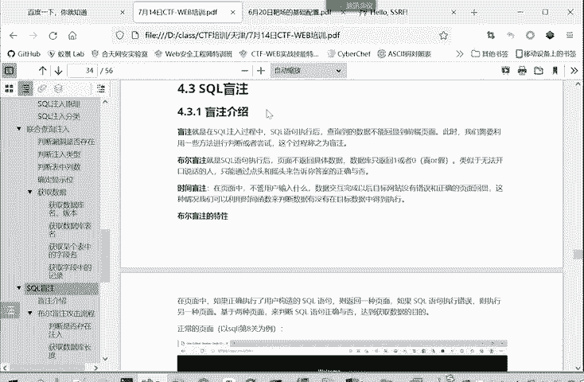

DVW靶场的一个配置。那我们就先讲一下这个靶场是如何安装配置。这个DVW叫靶场啊。啊，是我们这个外部安全里面一个非常著名的外场，它也是非常全面的。我们先讲一讲这个把卡如何安装使用。

把卡的文件呢刚刚已经分享到我们的群里面了。首先把那个文件下载下来，然后下载。

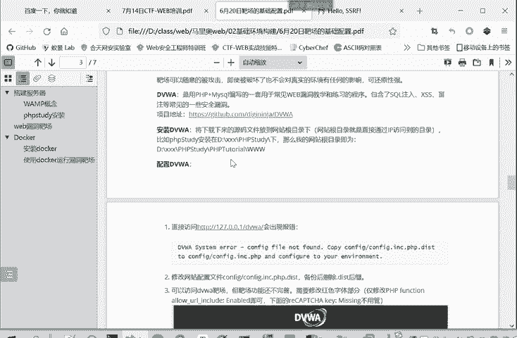

下载下来之后呢。就是这个DVWmaster。有一把姐啊。把提取出来，然后把它放在我们之前是安装了这个PP study。P去P study这个 tutorialtorial，然后3W目录下。

或者你在这里再建个文件夹，放在子目录下也是可以的。反正要放在这个三打那的目录下。然后把它放过来。因为我之前已经有了1个DVWA，所以我这里新复制的，我就命名为DVWAE。然后怎么使用这个靶场呢？

首先我们要开启PHP study。要启动一下。这里是两个域点呢，代表这个PP study要启动成功。然后我们访问呢。我们本地的地址就是117。0。1，然后。输入这个文件路径。因127。0。

1访问到的就是。我们这个3W目录，然后我们是在3W目录下面的这个DVWAE这个目录下面。所以我们访问3这个17。点1，然后斜杠DVW1。本按N进行访问。在第一次访问的时候呢。啊。

汇报这个给大家报这个信息。有个system error。这配置文件 canfi file， not found。

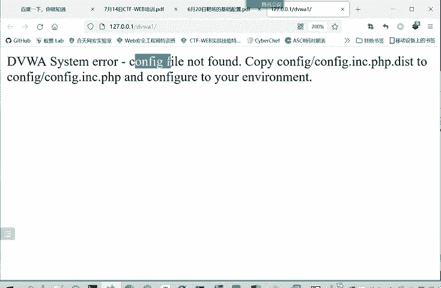

这个是正正常的，第一次抓都会第一次时候都会遇到这个问题。

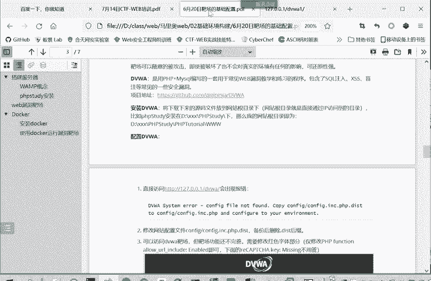

这个需要怎么办呢？就修改。配置文件在config目录下的config INCPHPd把这个d这个后缀去掉，我们看一下。

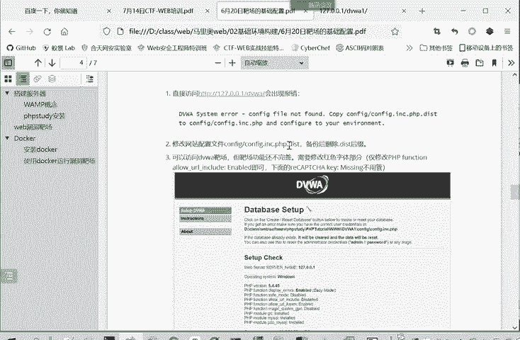

在DVWA1，你们可以直接命名DVWA。因为我要和之前安装的做一个区分。在这个confi目录下。有一个confi。ICPVd把这个后缀去掉，你不放心的话，可以先复制一个进行一个备份。

你把备份的这个后缀给去掉。Yeah。呃，这样一个是DVWA这个白场的一个配置文件。

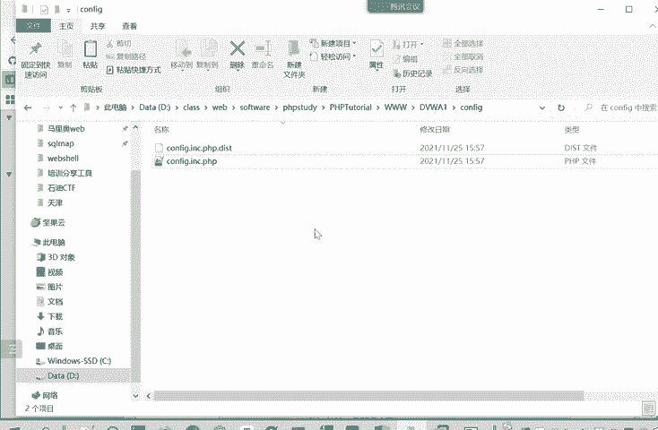

然后我们再重新访问这个DVWA我们刷新一下。

哎，这个时候就不会有刚才的一个错误了。

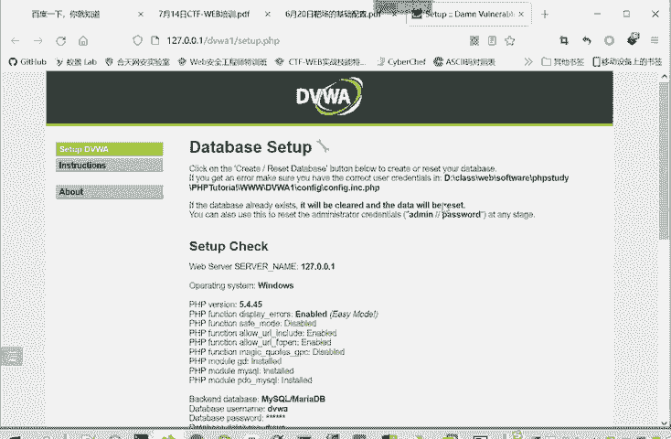

大家看到的应该是这样一个界面。啊，但是这里面有一些红字。

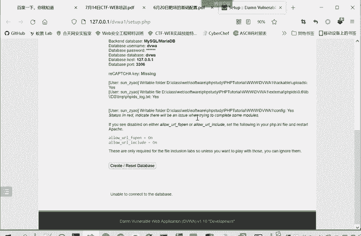

啊，比较引起我们注意。啊，大家。如果说你的PHP study之前没有设置的话，应该是这样一个界面。这里面有个PP functional uLin。Disabled。这里呢要修改PHP study的配置。

我们这里面有一个选项。其他选项里面有个PP study啊。看一下。打开配置文件啊，打开配置文件里面有个PHP杠INI打开这个文件。这里面有个alow inURLin这里要打开。

把这alow in uRL for open和al uRL include这里打开。这个打开是为了什么？因为我们这个靶场里面有一个文件包含漏洞。你要把它打开，这个漏洞才存在。如果把它关闭了。

那就不存在文件包和漏洞了，那也就无法利用文件包和内洞。但你如果不使用文件，包含no洞，不练习这个漏洞的话，这你也不用管。这是另一个那个验证码的一个no洞，这你也不用管。然后这些修改好了之后呢。

或者说你不想用这个漏洞的话，你就不用管。然后就到下面修改的话，要重启PP study修改才能生效。如果说进行修改的同学。就要点击这里重启PCC study才能生效。然后就到最后一步。

我们要创建一个数据库。这个靶掌才可以正常的运行。这时候我们要修改一个数据库的配置，数据库配置在哪呢？就在我们刚才修改的这个配置文件当中。

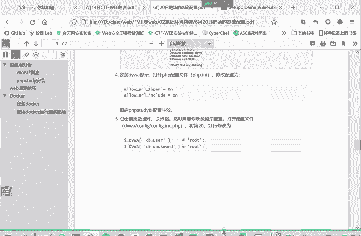

因为我们这里这里有个点击创建数据库嘛，为我们直接点击创建。他会告诉我们一些错，不能够连接到数据库这个service。

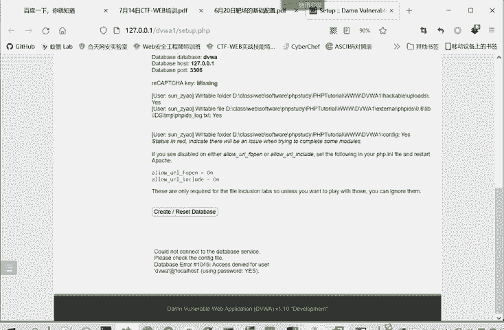

这时候呢要修改我们刚才这里去掉后缀的这个文件。这里面一个。DVWA我们看一下。按这样修改。把这个DVWA的DBU载和DB passwordsword改成root。

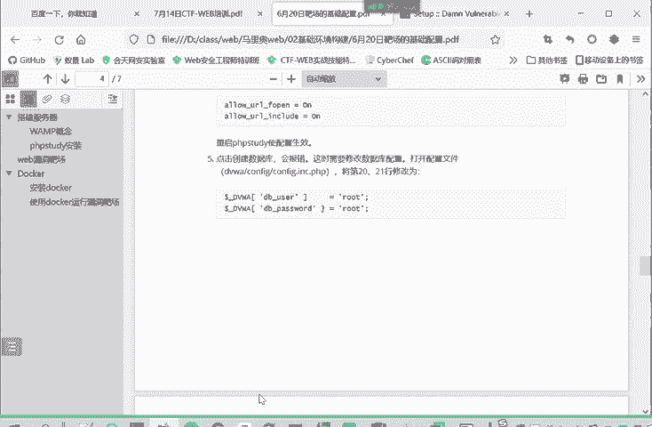

对。这你的。DBUer和password都改成root。然后就能正常的创建这个数据库了。因为我之前已经创建过数据库，这里就不进行重复的创建了。

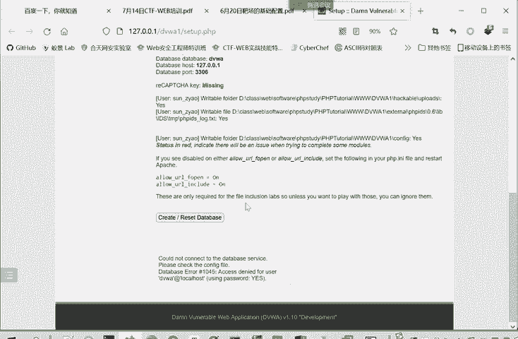

这就是我们1个DVWA靶卡序要。这些配置好了之后，你再访问DVWA。都可以。正常的使用了，然后他会让你登录，使用默认的口令，ad me，然后密码是password。

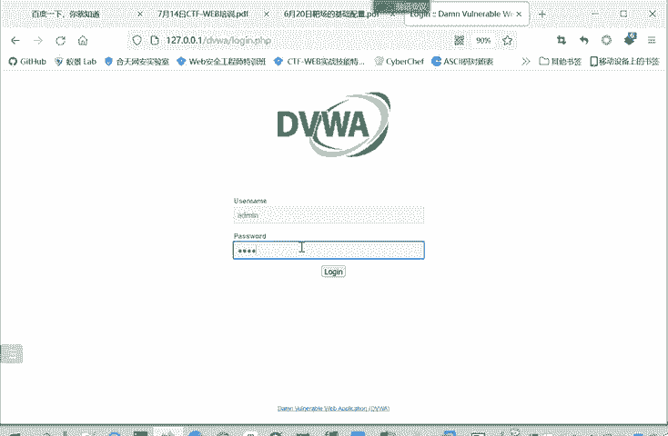

然后点击登录就行了。这里面呢就有各种漏洞。暴力破解漏洞命令注入的漏洞叫CSRF快干请求伪造文件包含文件上传等等。然后这里面是。security是设置这个安全等级。如果安全等级是impposible的话。

它是不存在漏洞的。这时候是不能进行漏洞利用的。那每一种漏洞呢都有不同的安全等级，就是no。ビデもは。比如说我们讲的这个三叔猪猪。现在是no，这是最低难度的情况下，这下这还没改成。

这里改的时候也要注意一点。这里改成要看这里改成了没？有时候它的这个漏洞难度imppoory是存在cookie里面的，你要把那个那条删除，你才能改成。

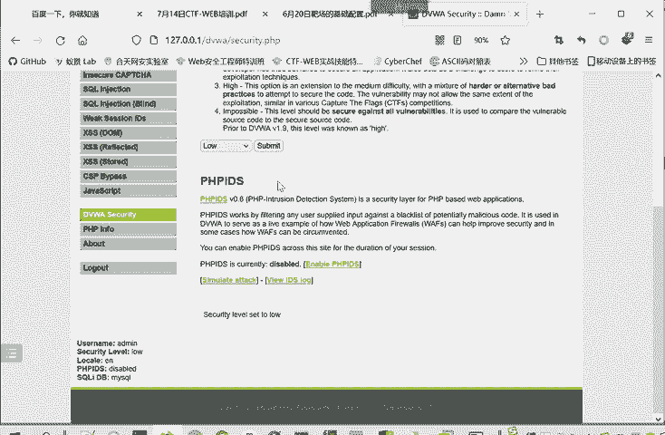

改成之后就能够进行一个相应的练习。那不同的难度呢，它的对于同一个漏洞来说，它的练习的题目是不一样的。我们改成mediaium，再看这个cyclcle注入。是不是这里是就不是输入了，而是进行一个选择。

它难度就不一样了。

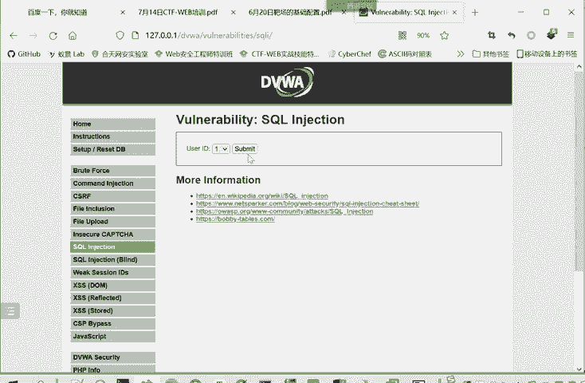

这是我们一个靶场的配置和使用。啊，就简单的讲这么多。然后后面大家有什么问题呢，也可以在群里面问。