# 2024年最强Kali渗透教程／网络安全／kali破解／web安全／渗透测试／黑客教程 ／代码审计／DDoS攻击／漏洞挖掘／CTF - P76：10.SQL盲注和布尔盲注流程 - 网络安全系统教学合集 - BV1Pe411C7Zb

那我们开始啊今天下午的内容。这个是circle，上午是把这个联合注入讲完了，我们下午学习这个srcle盲住。首先看一下什么是盲助，盲助呢就是在circle注入的过程中。所以可以去执行之后查询到了。

数据不能够回显到前端页面。这时候我们要利用一些方法进行判断和尝试，这过程称为盲助。也就相对于我们上午讲的那个联合查询注入来说呢。他们的共同点和盲助的共同点就是能够注入命令，注入的scle语句能够执行。

而不同点是我们联合查询注入能够看到执行的结果，而盲助是看不到执行的结果的。我查询数据它是能查询，但是他不会把查询的结果给我显示出来。这就是盲助。盲助呢主要有两种类型，一种是布尔蒙助。

就是说circle序执行之后，页面不返回具体数据，它只反馈真或假就一和你这两种情况。就是你的srcle语序注入是正确的，它是一种界面，注入是错误的，是另一种界面。他只反馈正确和错误这两种。

他不会返回具体的信息。这就类似于一个无法开口说话的人，他就只能够通过点头或者摇头来告诉你答案是否正确。但不会告诉你具体答案是什么。这布尔芒住布尔嘛就是出或者forth叫布尔。是不是？

还有一种盲种啊就叫时间盲助。时间忙碌是吗？在页文中，不管用户输入什么。那么数据交互完成以后呢，目标网站没有错误或者正确的信页面回显。这就给不安忙助。更难一点，他什么信息都不显示。这种情况下呢。

我们就可以用时间函数。加入一个时间函数来判断数据有没有正确的执行。我们注的命令有没有得到正确的执行？那个在讲布尔芒著的特性的时候呢，我们也我们要用到一个新的靶场。

这个我们这个DVW靶场是一个通用的一个靶场。它范围广，但是它对于某一某一种动洞来说。就是他的靶场就不是那么全面。这时候呢我们可以用一个专门的sercle注入的一个靶场。这个白卡呢就是。

这是我分享给大家的文件里面有个cyclclelip，就这个靶场。也是同样放在3W这个目录下。然后我们打开PHP3D，然后进行一个访问。我们这里访问。你这个文你放在3大目录下，你的文件夹的名称是什么？

然后你访问的时候路径这里就是什么？跟你文件夹名称保持一致。那么进行一个访问呢。初次使用的话，要点击这个创建datbase。那我这里啊我之前已用过，就不用再点击创建db了。它这里面有非常多的靶赏的。

非常多的练习题，专多的观卡。都是供我们学习这个或者练习这scicle注入来使用的。比如说我们这里是第八卦，第八卦它也有个解释。ban波璃就是布尔芒助。那我们看一下，把这道题打开看一下。

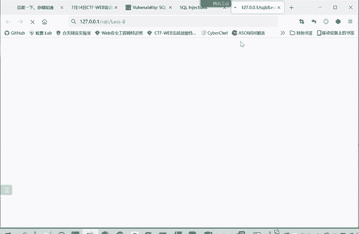

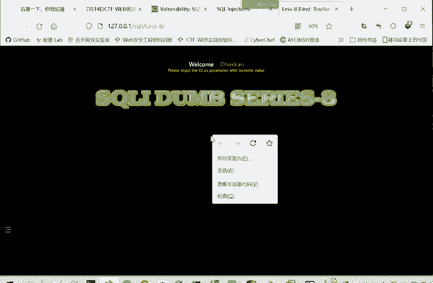

这里我们打开这个黑ickb。然后把这个URI导入进来。你看它里其实我们要输入ID作为这个参数。带上一个数值，那我们试一下，把ID作为参数，ID等于一看一下。那么现在给我们显示URE。

他不会把ID等于一这个查询结果显示出来。那么ID等于一加个单引号。看一下。哎，他现在。you are硬这里也不显示。那么我们ID等于2呢。又是1押金。做都试一试。又没有显示。大家看这是不是很符合我们。

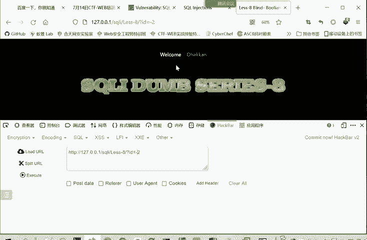

刚才讲的布尔盲多的特点。他只会返回两种界面。查询到数据就是一种界面，没有查询到是另一种界面。

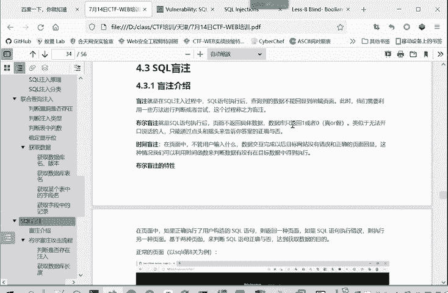

因为我们在这里一直都是这两种界面。这是一种还有一种叫URE。

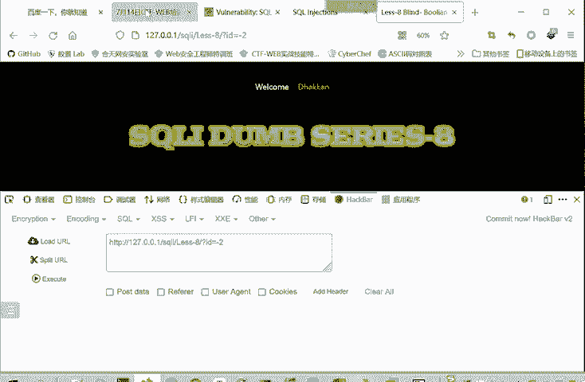

这就是不尔盲助的一个特点。查询到了就显示这个UIE，然后查询不到。就没有URE。就这两种页面。那么对于这种。帮助的我们应该如何进行一个攻击利用呢？这是一个工期利用的步骤。首先要判断是否存在注入。

然后再获取数据库的长度，再逐字拆解数据库的名。这个数据库长度是数据库名称的长度，不是说数据库里面总共存在多少自己的数据。然后再要拆解数据库的表明，然后再拆解出字段名和进录数据。

这里啊反复用到一个词就拆解。因为它不能够给我们显示具体的内容，所以我们只能一个个去猜去碰。如果说猜对了，就是UR印，那猜错了，就没有这个UR印，只能通过这样一个个去碰。一个个去猜来逐字把这个数据库名啊。

表明啊、字段啊、记录啊这些。给获取出来。

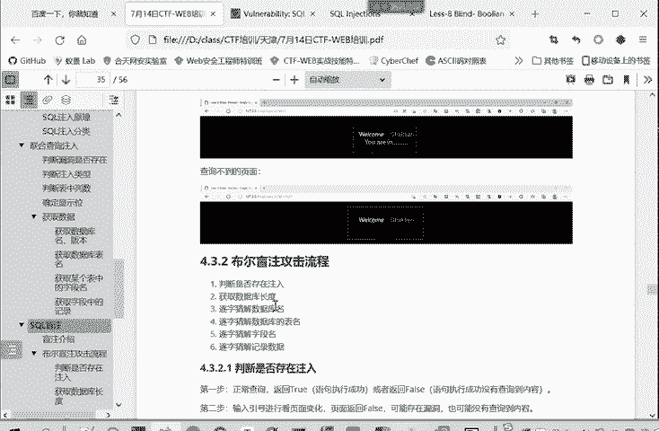

那我们一步步的看，首先呢是一个判断是否存在注入。正常查询它会返回处。然后不。查询不到结果会返回那个forse，这个是我们刚才已经。测试了就我们要知道哪个界面是能够查询到结果的界面。是语句执行。

结果为真的界面，哪一个界面是语性语句执行结果为假的界面。这个我们首先判断出来，这就是一个执行为假的界面。要把这个符号去掉。这就是一个执行结果为真的界面。首先这波尔芒就它有两种界面，我们要把这两种界面。

哪种代表真哪种代表假可以识别出来。然后第二步呢，我们要输入一个引号，就像我们刚才的上午的那个联合注意一样，然后看页面的一个变化情况。比如说这里输入二本来是查询的正常的那我加了一个单引号之后呢。

它就是返回一个执行错误的这样一个界面。那说明这很可能就类似于我们上节课讲的有点注入。因为他会给我们报一个circle语法错误，只是这是一个盲助，它不显示这个具体的信息。

而这里就是说它很可能存在这个注位的漏洞，但是也不敢说百分之百保证，我们继续往下面做。第三步呢，利用我们上节个讲的and来进行判断，分别输入一and一等于一。这个输入其实是ID等于多少。因为ID是变量名。

我们要输入的是变量值。和一等于一按一等于2，或者是一一撇按1等于1。这两种这前面是一种测试方法，后面是一种测试方法。就是一2是一组测试方法，34是一组测试方法。这两种测试方法呢都是可以的。

我们任意执行一种就行了。我们比如说我们先输入。一and一等于一，我们看一下。哎，他现在执行是正常的，查询正确的一个结果。那么一 and一等于2呢？它还是正确，说明这是一个字符型的注入，是不是？

因为它如果说是一个数字性的注意的话，那么前面是where IDD等于一，它前面这个和数据库后和这个网站后端的语言拼接已经是一个完整的语句了。and一等于2，这肯定是一个foralse。

它就不会显示这个URE。这个界面不会返回帧这个界面。所以说他不是这个数字性。那么他就是一个字符型的一个注入。

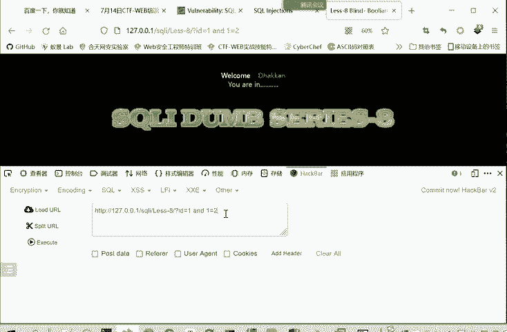

那么判断我们判断这个存在注入，就是现在发现它是一个字符型的注入。字符型注入之后，我们现在就要设计一个注入的命令，或者是我们自己构造payload来进行一个利用。比如说我们的利用啊。

上节课我们讲数据库的结构，是不是最外面是数据库。需求管理系统，然后管理了多个数据库，然后每个数据库呢于管理多个表，每个表有多个字段。我们先从最外侧开始，我们看。当前的数据库的名称是什么？

先要获取数据库的名称。因为我们没法通过页面的返返回信息，就是回显来获取数据。因此呢我们只能够依靠这个页面的真和假来判断我们猜测的这个长数据库的长度是。对的，还错的。我们可以使用bicycle的内置函数。

就nense来判断。或者chless也是可以的。比如说我们需要直接输datbase啊，我们先。还是在我们的。而成在我们自己的一个模拟环境里面，先执行一下这个名，看是一个什么样的结果。

我们靶场的数据库是这个security这个数据库。我们在这里面执行啊，把这个删了。那么这里呢就是查询这个数据库的名称。当前的数据库呢，我们是在security这个数据库下。然后我们给他前面L。

加看这个nnce。这个命令呢。就会返回这个secty这个字结束12345678。那么我们对于这个靶场来做题的话，我们不知道它数据库的名称。那么也可以用这样的方法，先把数据库名称它的长度。

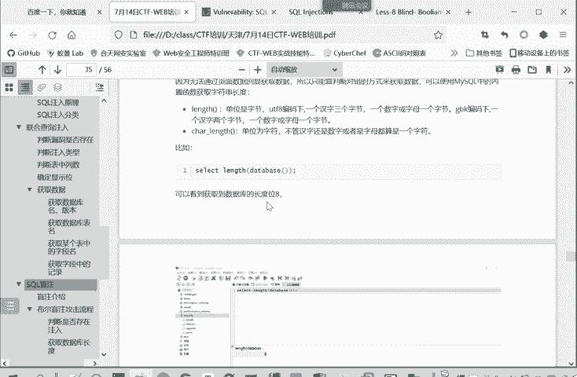

给拆解出来。因此呢我们就可以。他说。输入为-一。也不能啊输一不能输入负一，因为前面的语句一定要保证它是正确的。我们的后面的语句判断才有意义。如果说前面的就是错的，那你他按着一个。

你后面的语句就没有意义了。再让他执行一个语句，按 syn。Nice database等于1。然后这里是URL，我们就直接输入23%。来注释掉后面的内容。那我们执行一下看一下。哎，他报错。

说明说这个数据库名称长度不是一。那我们也可以一定要用等于，也可以大于小于来判断那是多少呢？我们说这个数据库名称长度是十0以内还是10以外？我们看看小于十是否正确。IID等于1and。

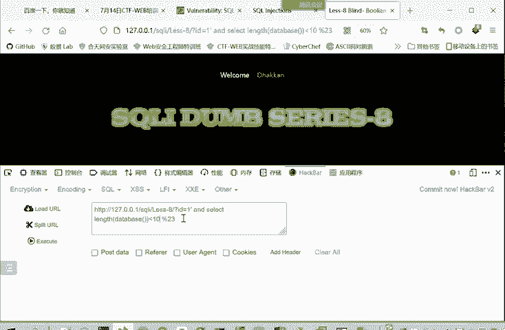

Se哪。dabase等于8嗯。

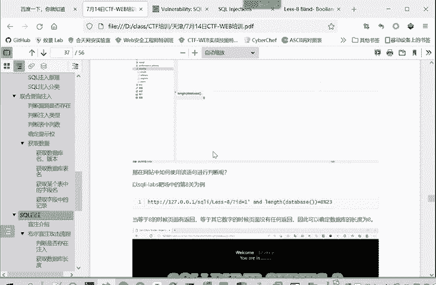

啊，我们这里不用输出s net，因为它不会输出，我们直接计算这个ense。啊，you are in说明它小于10是正确的。那么小于十了，它是否是大于5呢？其实就是用一个二分法进行一个。查找判断。啊。

大于五也是正确的，那就在五代时之间。那是否大于7呢？那也是正确的，那就是在7。到十0之间，那就是8或者9。因为它是大于期的那就等于8是否正确。哎等于8，它选URE。

那说明等于八是正确的那我们看一下等于九是什么样。如果说判断它等于9的话，是什么一个？输出。哎，这里就没有URE了，这是一个错误界面，说明它不等于9。那经我们刚才的判断啊，就知道它是等于八的。

就是我们这个法卡，我们比如说我们现在做这道题，这道题的数据库的名称就是把。这是通过一种二分法的方式来判断它数据库长度。除了这种方式呢，还有一种办法就是我们。

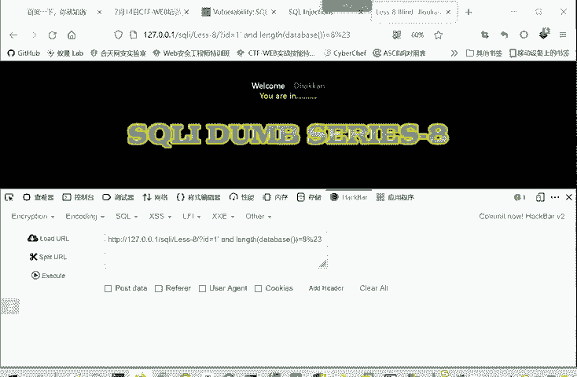

上节课安装了b suit。里面有个引出的模块，我可以进行爆破。

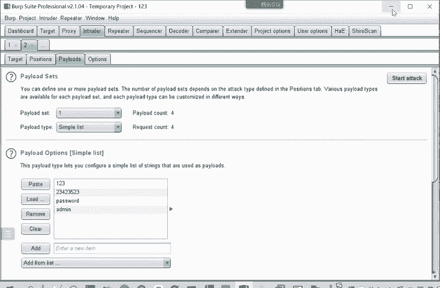

如何进行报破呢？那么这里看一下，然后。大家的话，因为这个靶场的文件呢，还有这个bp suit都是发给大家的。bp suit上午也是装好的，大家可以跟着一起操作一下。我们要进行bb suit的利用啊。

首先要开启代理，把代理打开。

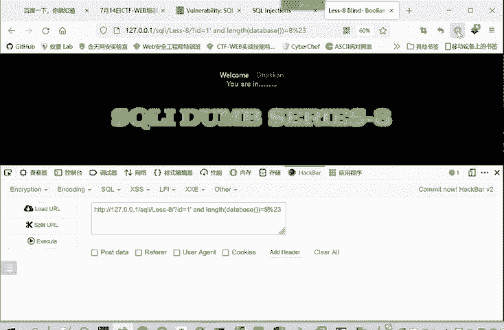

不是不这里监听一直监听着呢，这不用管。

这拦截不用打开，像打开也行。我们重要的是获取他这个访问的包。

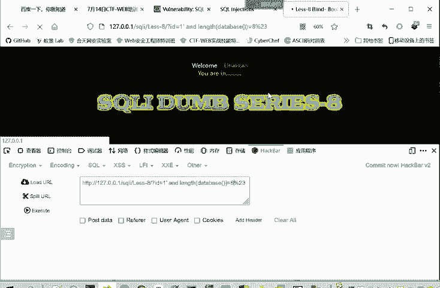

那么他现在已经进行了访问，我们就可以从b里面HTP historyory来获取刚才这个访问的一个包。这是我们访问的包，一27%就是单引号，然后andn database等于8。

我们把这个包呢发送到这个in出的模块中。这个目标。IP端口跟我配置好了，不用管。然后这个我们要改变的变量呢，它跟我们识别了很多，我们来cle一下，我们不需要改变这么多变量。我们要变的是什么呢？

就是这个等于8这里。还有可能等于一等于2等于3等于4，都有可能我们要就要试。然后这个payload怎么选呢？我们这里可以选择这里pay node type类型中有一个number。因为我们要测试的变量。

它就是一个数字，这长度肯定是一个数字嘛，它 from我们要测试的这个变量。从哪里开始测选，我们就从它长度等于一，用户名称长度等于一开始。然后。😊，最多呢就20吧，前调样设置，然后step是1。

第意思就是从123456789一直到20。逐渐替换正里的8来进行一个测试。那我们这里配置好了之后呢，就点击这个start attack。然后你看b就正在进行这样一个爆破的过程。我们。

大家可以自己操作一下，有什么问题的话，我们就发在聊天里面。然后我们课间我们下课之前呢会专门给大家回答。现在就finish了，已经跑完了。你看pay note就是一pay note是一的时候。

就把刚才八的位置替换成12的时候就把八的位置替换成2，它就是这样一个从一一直到20这样一个替换的过程。那么哪一种是正确的呢？我们刚才上节课给大家讲那个爆破的时候，就给大家讲过。

正确的那个肯定是与众不同的那一个。我们先过一0sators的都是200，这你就看不出来，然后过一遍nense。哎，这里是有2个910，其他926，我们看一下，反过来看是不是？只有两个是910。

其他的都是926。那910的是什么呢？这个是我们最开始的把。诶。然后啊这里也是8，也就是说只有databbase这个长度等于发的时候。数据库名强度我们猜测它等于八的时候，它的返回值。

页面的响应是最与众不同的。其他的都不一样，都是，而且其他都是一个整，这是不是这就是返回两种界面，一种真一种假。那很显然。N死等于8，这是个真，其他的都是假。如果说不放心的话，还可以在这个。

把产量再进行手动测试一遍。这就是利用bp速的进行一个爆破。的一个作用。所以说大家以后做起的时候，正常用花都可以用进行二分法的这样一个猜测，或者用bb suit来你设定一定的范围啊，1到21到100。

它都是可以爆破的。只是说那你测试的这个量越大的话，我们等待的时间也就越长。如果说你1到20全都是926，或者全都是一种文化。那么有两种可能，一种是你这个payload有问题。所以说你不管它是等于几。

它都是一个错的。第二种可能是这个数据库的长度呢是在20以外，比如说等于23呢数据库名称。等25。啊，就这两种可能性。

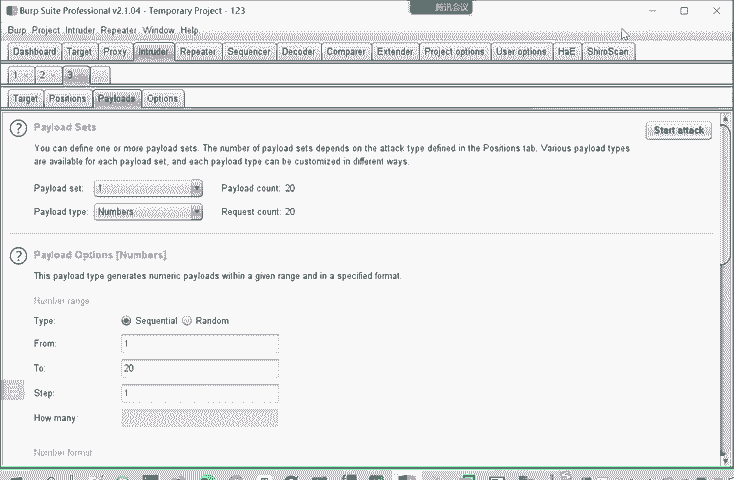

啊，这是我们对布尔芒助的一个利用。

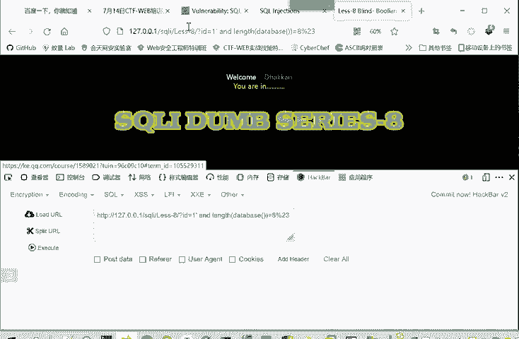

就用这种方式就获取了。数据库的长度是8，数据库名称的长度是8啊。那你给大家解释一下，就是我们输入的这个命令。

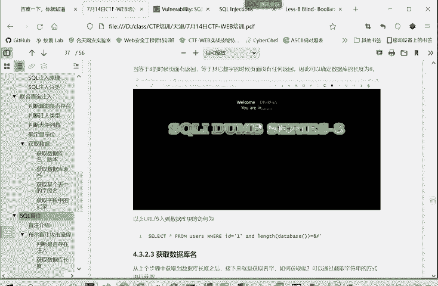

比如我们输入ID等于1一撇然and认 database等于823%到后台怎么执行呢？后台就是sax新 from userswhere IDD等于1。这个一撇是我们输入的和前面闭合的。

前面的就是一角幂and是一个逻辑运算符，后面是内。nice这个等于8，这是一个判断预算，然后再就是井号，这就是它原来的一个单引号，就被井号所注视掉。在前面的一句执行肯定是真。所以整个语句执行的是真还假。

就看这个nense是不是等于8。那么从上面的步骤，我们获取到数据库的名称的长度之后。我们要进行下一步令，我们还要想过去这个数据库的名字到底是什么？如何进行获取呢？

我们这里要给大家介绍一个s string这个函数。这函数有三个参数，一个是str，一个star，一个n，它是一个截取字符串的一个操作。他作用用就是说对于我这个第一个参数，这里是一个字符串。

从start从起点为止，一号位卷2号位月3号文件。从这个位置截取nice这长度，截取三个字符。比如说hello从一号位置截取三个字数，就是HEL就得了，这是这样一个作用。

那这样函数怎么用用于我们的这个获取数据库名呢？这里给大家写了一个pay note。比如说我们前面的部分都是一样的啊。要闭合前面的语句，让它为帧。关键这样我们后面为帧。

这整个语句是否真就完全由我们后面的语句所决定了。这里是什么意思呢？就是。databbase它是输出数据库的名称。这就是个字符串。那这个字符账我截取什么？截取它的一号位置。这也许是从一号位置起算。

不是从0号位置起算。接下来一号位置。然后截取多少字节，截取一个字节。也就数据库的第一个数据库名称的第一个字符是什么？看到是否等于A是否等于B，是否等于C。

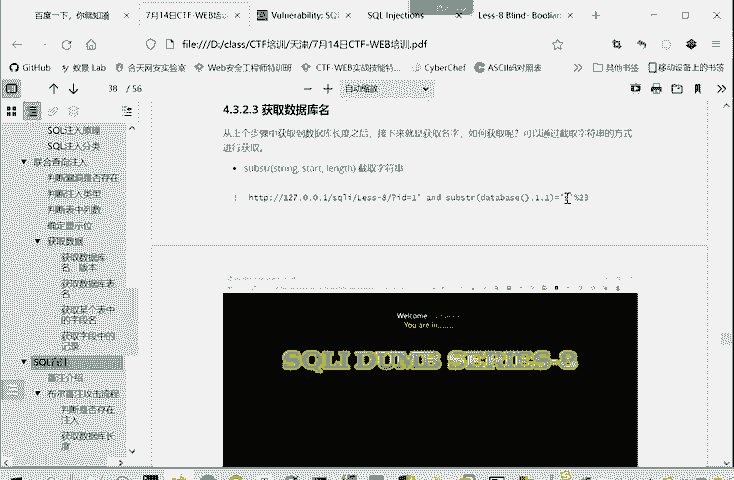

通过这样的方式来判断。因为我们叫波尔芒助嘛，它不会显示数据库名称，它只能给我们显示。看等的对不对？subst。我先把这个函数写上，然后等于什么等于A，是不是判断一下，这里面有三个参数。

第一个参数是个字符串，然后第二个参数是起点为止。第三个参数呢是截取自己的长度。然后字符串是什么呢？就是dabbase数据库的名称。teleabbase本身是一个函数，它输出结果就是数据库的名称。

那这样我就进行了一个判断，判断这个。数据库名称的第一个字符是不是A，他发现不是A，那我就是。He。进行一个测试。哎，那B也不是，那我们。把后面的测选S可选。哎，这个S它也不是不是它是它这里URE是不是？

那说明第一个字符就是S。那我们就后面就补从第一个位置进行截取啊。从第二个位置进行截取。一直到第八个位置截取。因为我们上一步已经拍了出数据库名称的长。长度是8个字节，第一个字节判断出是S。那第八个字节呢？

那不是S，就通过这样一点点的判断，把每个字符。它数据库名称的每一个位置都拆解出来。

这就是获取数据库的名称。

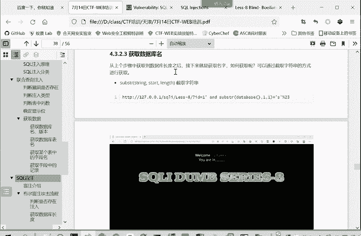

大家直接这么做，这个工作量有点大。然后我们一个个猜，那要猜很长的时间，这时候怎么办呢？

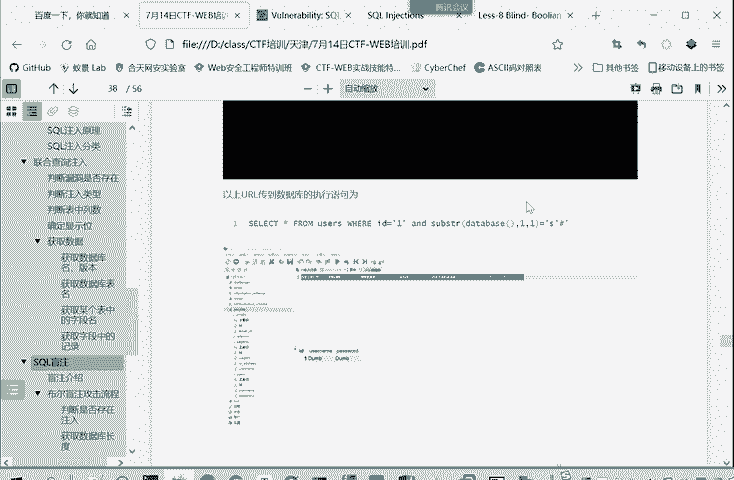

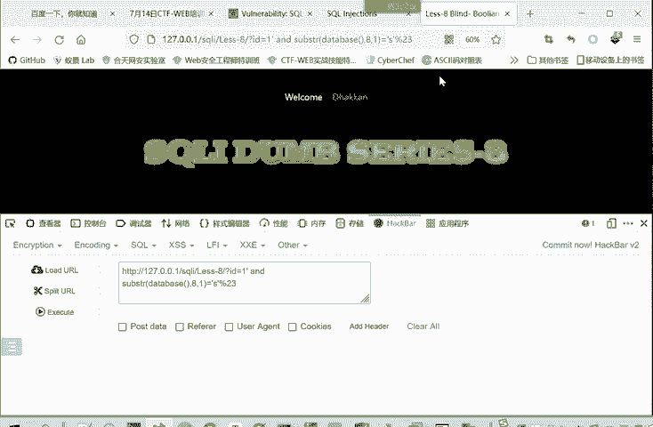

我们可以给大家啊。看一个。这个阿斯玛的对照表。也就我们说的A。对应的阿斯克玛值呢是65小A对应的阿斯克玛值是97。那么S对的20个码就是什么？15115。

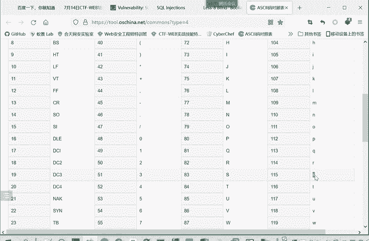

我再回到这里。如果说啊是判断第一位的，等于S的时候，它是为真。那么我就相当于一个等式嘛，subtract database11就等于S这个字符，我们可加个空号，把这个。那更弦。

那么我可以同时对两边进行一个ask玛的运算AAS去使用askask这个函数。然后把这个字符串。截取的这一个字符保起来。那我前面进行2次格运算，后面是不是也要进行2次格运算？那S的2次格运码运算就有多少？

我们刚才这里看了一下，这小S就是115。

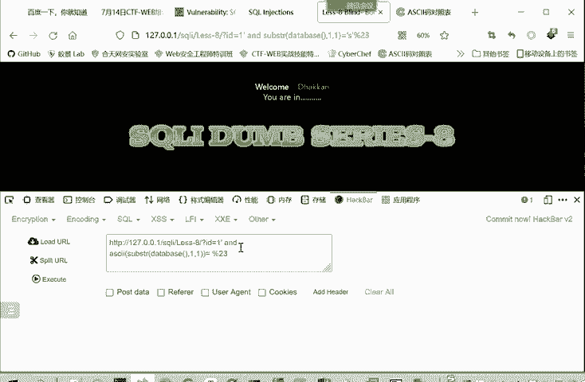

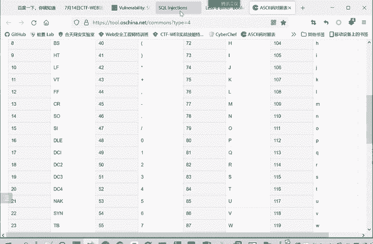

所以这里呢就等于115。这样吧，原来去进行一个。字符的一个。比对。现在变成了一个数字的一个弊端。发现这有数字的比对，仍然是成立的。那如果不是115呢，110。那么这个数字的比对。改成10就是不对的。

因为1。

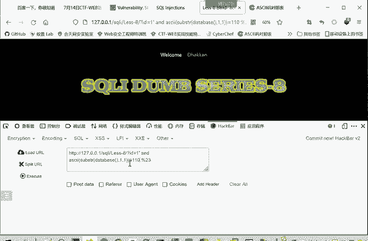

这个110是什么？是N，说明他第一个字符不是N。

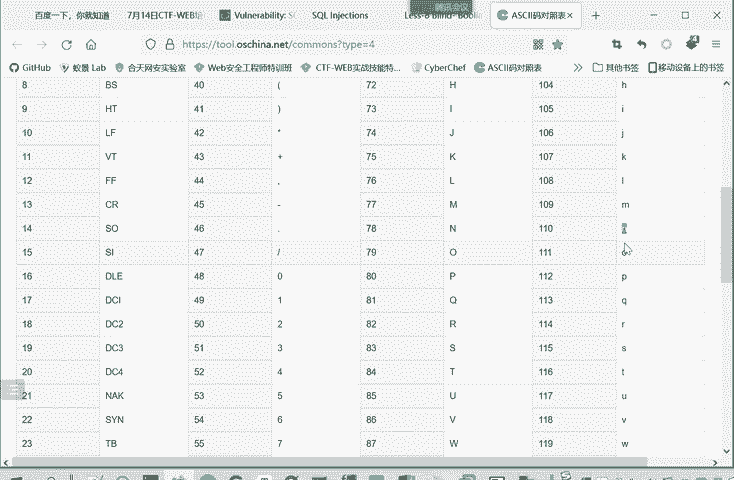

是不是那现在变成了一个数字比对就可以。啊，回到我们。上一步的方法，裁解数据库名称的长度，也可以用一个二分法进行裁剪，但是这里呢就比较费时间。我们可以直接使用这个b来进行一个破解。

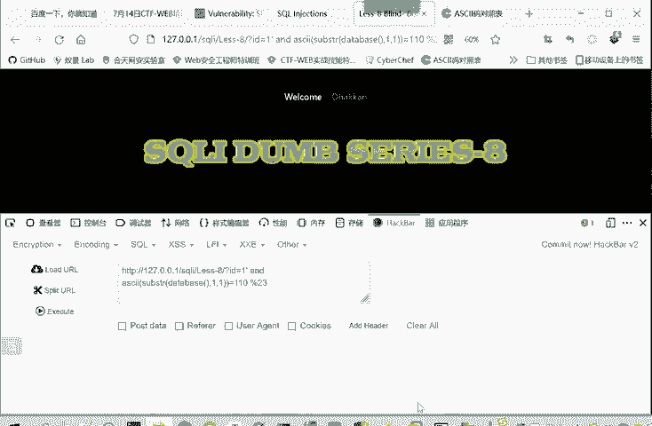

同样的方法，我们还是要从这个黑HB黑tory当中找到我们刚才。测试的。这样一个请求包。这就我们刚才测试情况，我们发的。你看是不是ask这个值是不等于10进行一个判断。然后我们发到这个爆破模块当中。

让他话替我们爆破。这个IP端口设置好的，我们不用管这个位置呢，它帮我们识别了这些位置要进行修改，我们把它去掉。因为它识别的一般不是我们想要的，我们想要的位置呢是什么？这个等于多少？

这个数字我们希望进行一个更改。同时我们还要改一个位置，就是说我们这里是判断第一个字符。我希望他判断第一个字符完了之后，他就继续判断第二个字符，判断第三个，判断第四个一直到第8个。所以说这个位置。

从第几个位置截取这个字符，它也是一个变量。就以他这是两个变量。这两个变量，那我我们的攻击模式呢就要选择哪种？我们可以啊这里可以回顾一下我们的上午的一个课件内容。讲bp suit的时候，有个爆破模块。

讲完了这种攻击模式。我们再回顾一下它的工艺模式。这个sleeper模式呢就是在每个位置逐渐放入单个配let的进行测试。我们sneer模式很显然是不适合我们刚才的情况。因为我们。

前面的变价是从1到8进行变化，那后面的变价是从哪儿呢？我们看一下这个阿斯克玛的贝尔。那常见的基本上就是。就算只有符号，也是从33开始。变到了这个126就可以了。你如果不取这些特殊符号，只取这些字母的话。

就到122。从我们的。65到122就可以了。所以他们俩的变化范围是不一样的，不能使用这个sneepper motion。所以他们俩要使用两个paload，他们俩各自学各自的字典。

那第二种模式叫工程群模式，我们看一下合不合适。还是便利一组有效载合载合也就是配动。在所定义的位置上放入同一载荷，同样是5个配动的两个位置。他就每次放映内容是一样的，也是不合适的啊这里。

第三种模式就是叫个草pick for草插模式，它每个变量对应一个字典。它包括次数呢取决于变量少个字典。使用多种有效载合，每个定义的位置使用一组不同的有效载合。这里给大家举个例子。

两个位置两组攻击载合分别有5个配套的，就要尝试5个值。那第一次攻击就将第一组的第一个配动的放入第一组的位置，将第一二组的第一个配动的放入第二组的位置。然后第二次第二次攻击呢。第一组就取第二个配路的。

你第二组也取他第二个配路的，它总共只有产生5次攻给。这种呢也是显然是不适合我们教业模式的。因为我现在。我这个。位置取一的时候，我要你从。33到126整体进行变列。不是说位十的时候，你就测33。

位十1二的时候看等于不等于34，这显然不符合我们的目。所以这种模式也是不可取的。那么最后一种模式呢就是一个奇数炸弹模式，它每个变量对应一个字典就符合我们的需求。并交集包破，这是最重要的。

它包括次数呢就是字点一群一字芽。它与这面的草商模式不同的，就是说它第一个位置放入第一组的第一个配load，然后就便利第二组的所有的配load。然后第二一个位置呢再放入第二组第一组的第二个配el文。

然后再便历第二组所有的配el的，这样一直便利下去。那么两组的话，如果每组是5个配类的，就会发起25次攻击的请求，这正是我们需要的一种模式。因此呢这里我们就选择这种奇数炸弹cast boom这种模式。

那我们设置配load，这时候配配load set里面就会出现一和2两个选项。一呢。就是哪个在前面，哪个就是一一就是负着这个变量的变化范围，这变量变量范围就是1到8。因为我们。刚才已经看了他的。

数据库名称的长度是8码。所以我们这里还是选择一个numbers，让它帮我们生成配load。起点呢就是一。中简单就是8。然后近也就间隔了，也就一和1到8。那第一个配套的集合设设置好了。

我们设置第二个配套的集合。第二配套集合是负责这后面就是110这里这个值的变化范围，这个变化范围我们就是。嗯，不取那么多，我们就只取这个字母。就因为他这跑，这个是要耗时的，如果取太多的话。

大家查看结果等待时间比较长，就从65到。65到122就行了。那我们设置一下，也是这个numbers。整能这 numberumb板起点呢就是6。终点呢就是122，直近仍然11。

这把所有的大小写字母都遍历了一遍。这样设置好了之后，我们就可以点击这个start ten开始攻击。然后他就会替我们跑。啊，利用这个时间，大家也自己操作一下自己的b。那我们就稍微等待一下。

这里总共会发起464个请求，现在已经到33了。这里给大再家再看一下为什么是464个。我们pay note一，我们这里可以看pay notepay note一是有8个变量1到8码。

然后pay note2呢。是65到122，是158个。我们选择的是这种位置是吧？classbo的模式，所以它的一个测试的次数，有一个攻击次数呢就是58乘以8，也就是464次。我们看这个啊results。

大家利用这个时间自己也是操作一下。如果说自己这个操作过程中有什么问题的话，我发到我们聊天里面。他这里测试的顺序跟我们讲的是啊正好反过来的顺序，不过都是一样，都是要进行测取。

这是先把pa note一从1到8编辑遍，然后pen note2呢固定是65。就是我把位置变变从优势我就是。有15吗？我们看一下。就大A嘛。他这个测试的意思呢。就是我先看第一位。

我数据户名第一位是不是等于大A，第二位是不是等于大A，一直到第八位是不是等于大A。然后我再看第一位是不是等于B，第二位是不是等于B。在这依次进行的一个测试。他这个测试需要等待一段时间啊。大家操作了之后。

让他跑着。我们可以继续看后面的内容。就不一直等着他。那大家有什么问题的话也可以提出来。就正好复习到一下我们这样就会讲到这个bp suit，就爆破模块的一个使用。

我们的一个爆破的一个pay note就是这样。subtract database，然后截从第一个位置起算，然后截取一个字节等于一，然等于S判断。然后再判断第二个位置。然后第三个位置。

第四个位置依次进行判断。

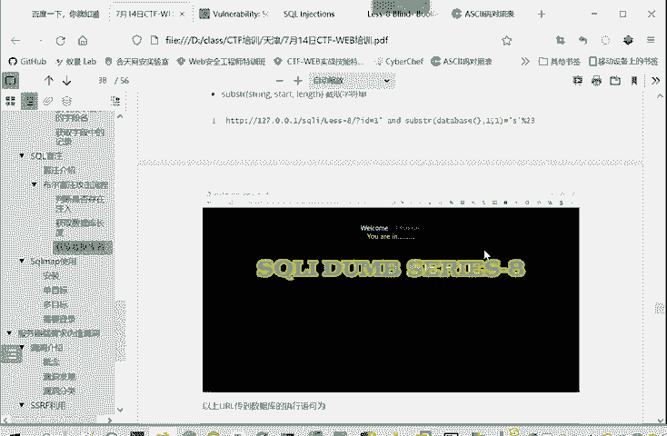

所以这里。反映了我们上一步为什么要获取这个数据库的长度？也就是在于这个目的。你要知道它总共有多少个字节，你才知道你判断到什么时候结束。那上面的命令常用到数据库中呢，它。主要的网站后台实际上执行的是什么？

就se新 from users外ID呢等于一。依这个型号进行闭合按。我们查看这个数据库的名称，然后把它第一个字符截取出来，看是否等于S。那接下来呢就进行第二个进行一个判断。

把这把这个subtract第二个参数改为2，然后再改为3，再改为4。一次的进行一个利用。嗯，我们这个。我们用他跑的时间可以看一下这个每一个请求。嗯，这个请求配个一的时候，就把这个位置改成这个2。

多个2等于65呢，就把后面改成65。这个大家应该是理解，我们后面再随便看看这里第一个位置就改成8。第二位置呢改成71。那现在呢就已经完成了。完成了呢，我们就要筛选出正确的结果。

这个pay note这里筛选没有什么意义的，这个tus可以筛选。这里呢都是200没有异义。但在很多时候。还有可能就是你进行考虑报户的时候。正确的密码和错误的密码，它的返回的状态码是不一样的，这时候就。

可以进行一个s的一个筛选。那么这里我们就进行一个n似的筛选。大家可以看到，绝大部分呢是926。只有少数的。几个1910。是不是这就说明这910这几个是正确的。那我们分别是什么呢？那第一位就是115。

就是S。第二个呢就是101，那我们查这个表。再查一下表，第二位是101。听你要求一。然后第三位、第四位、第五、第六位、第七位、第八位，第八位是121。121呢就是一个。喂。那这样呢就。最后就得出了我们。

这数据的名称呢就是。Security。是S第一位是S，第二位是E。第三最后一位是Y，总共是8位。通过这样的方式，我们就获取了这个数据库的名称。

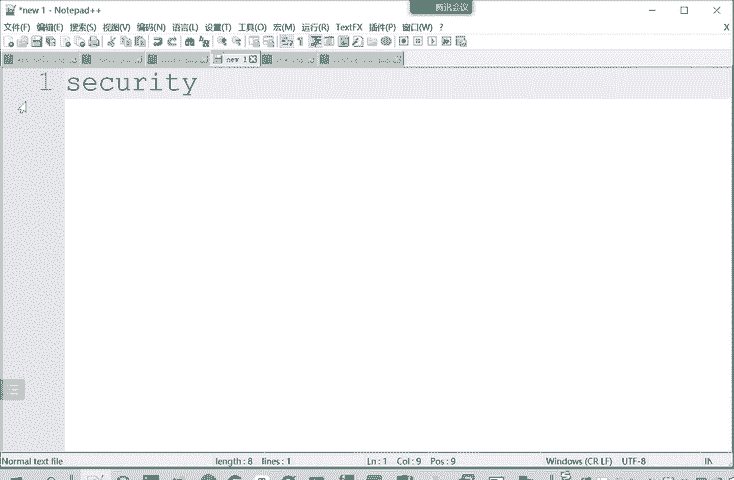

啊，尽管页面什么都没有显示，但是我们还是成功的获取了数据库的名称。

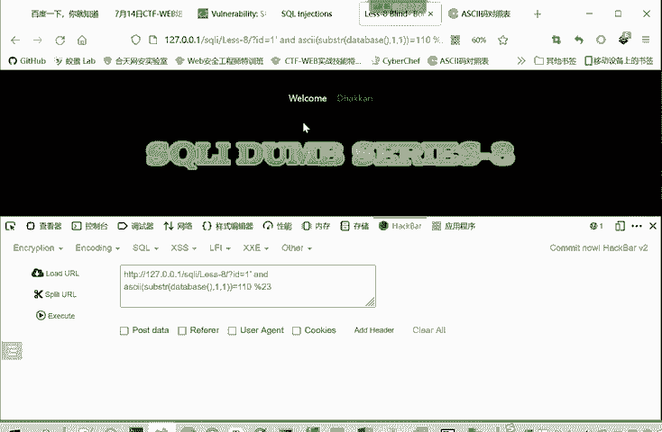

那获取数据库的名称之后，后面。是不是可以继续用这种方法来获取？我们的。表的数量，然后表的名称。再选择某一个表或者它的字段的名称，字段数改字段的名称。然后再记录。我们这个盲助的话。

它就是因为它不显示它应用的过程呢就是比较复杂。关键是你要构造好这个啊pay notepayload部分构造好。然后你把该变的部分加上这个变量。然后再设置这个paload的集合。

让这个target让这b来进行跑就行了。不用我们人工的一个个去势。如果说大家在。做一些做一些题目啊，或者说在公网上挖这个公开漏洞，要提交SIRC的时候，做到这一步也就可以了。你获取了数据库的名称。

已经证明了它存在漏洞。你不用再一个个跑去获取他表的名称，字段的名称。每条记录是什么？这是我们这个一个忙助。呃，这里我再给大家呃补充一点东西。因为盲助里面还提到一个时间盟助，就是。有的盲助比这个波尔盲助。

实间盲住比不尔盲着还。麻烦他什么信息都不显示。我们看第九关，第九关是什么plantime base时间芒果，这里是布尔芒助。我们看一下第九关。

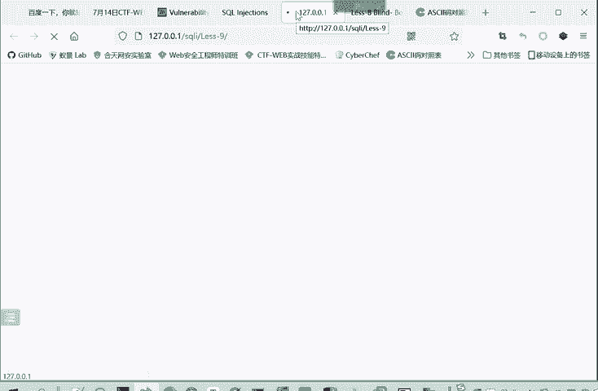

这个时间帮助，大家不用怕，它其实应用方式。跟这个波尔蒙度差不多，只要稍微增加一，只要增加一个函数就可以进行利用。买啲泳衣。就这样一个界面UIEID等于-一呢。还是要音，那加个单引号。还是压一。

他我们不管输入什么，它的输出总是不变的。这就是一个时间盲助，不管输入什么。它显示页面是一样的，它没有一个正确或者错误的一个页面区分。那么这个时候呢，我们就要利用时间函数来进行判断。

我们看一下如何利用时间函数。我们比如说数顶一，然后我们按了一下。levele就将程序挂起，我将程序挂起。后面输入是一个数字，就是程序挂取几秒，挂取5秒。看一下，如果说前面这个命令。是存在注入的。

假设它存在注语，而且是一个数字型的，那么前面就完全闭合了，后面就要挂起5秒。那么他给我的响应应该有一个明显的等待时间。这里似乎啊并没有一个明显的诊断险和之前的收入没出序。那我们试一试。这个。是服形的。

大家也可以看到是不是有一个明显的等待时间。但这个有有的人可能说这是网速的原因。是吧这么感觉呢不是很靠谱，确实这样。那么我们在这里呢已经是进入了一个开发者模式，除了有我们自己装的插件以外。

还它原来带的这些功能也是有用的。我们可以看这个网络这个功能。我问完了，刚才这是我们网络的请求，请求里面有一个耗时。是不是耗时是9。14秒？那我们现在这个黑个b把这个。ni5。给去掉。再决醒一次。

那我们再看这个控制台这里。啊，再看网络网络这里。这是我们刚才执行的命令ID等于一星号单引号，然后这个井号，这个耗时是4。13秒。大家发现没有？是不是正好相差5秒？

这个相差的5秒就是在于有没有sleep5这个函数。你要是大家如果说不是很确定的话，你可以sleep1，让样等待时间更久一些。他但是他差距就更明显一些。这里呢我们就发现它是一个时间盲种。

就他程序他给我前面的命令是正确的。那么他会执行这个后面的。时接等待的一个函数。前面命令不正确的。那么这个时间等待的函数就不会得到这些。比如说我们把前面改成一个负一。网络里面呢。尽管加入了sep。

但是还是4。11秒。把复议去掉。他们的显示都是一样的，只是在我们的网络里面查看它的耗时9。10秒、4。1和9。10相差5秒。所以说这就说明了我们这个注入的这个scle语句是已经得到执行了。

那得到执行那怎么办呢？我们。😊，如何判断数据库的名称？还有数据库的一个长度呢。比如说我们上节课是不是。我们刚才讲这个布尔蒙住的时候，是不是用的nse database这个函数。我们看他是否等于8。

但是在这里面肯定是不能直接这么用的。如为你直接用的话。他显不管怎么显示都是一样的。我们要通过这个网络里面的耗时来进行。所以我们要用一个条件判断依据。艺术。😊，大家整个。条件判断允句，它有三个参数。

第一个是。N讲第二个是一个表达式。我们单独把这一块拎出来啊，我们单独分析一下这这段内容。

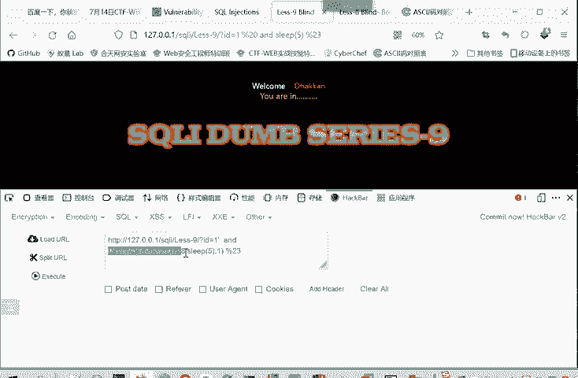

这个if的这个函数是什么作用呢？它有表达式。expression一。这是衣服这个命令的。一个格式。还有表达式一这个表达式如果是真。te他就执行CCMD1。如果是甲，他就执行CMD2。

那我们这里是怎么用的呢？我们就判断nense database这数据库的名称是否等于8啊，如果它等于8，它就挂起5秒。如果不等于8，它就执行一，这就是没有直线，什么也不做。

所以说如果说我们猜测长度是正确的。程序就会多运行5秒时间，猜测是错误的，程序就会相比来说少运行5秒时间。我们看一下。

那么我们在网络里面呢看一下，这个耗时啊9。12秒。那如果说这里不猜测等于8呢，猜测等于7。那么在网络里面呢，你再看一下猜测点印期这个请求它的耗时4。10秒。是不是始终是相差5秒？

我们就可以用这种方法来裁解出它的数据库的长度，数据库的名称。啊，这里。我们。哎给大家讲一下如何用ki普来进行一个拆解。

用它爆破，不是让大家一个一个去猜，那太耗时间了。我们看一下，把这个请求包啊得弄死。师傅等于些把这个包找到找到了，然后我们。发送到引出的模块。其实找这个包的过程中，也是上节我们给大家讲的。

希望大家在这个浏览器上装代理设置代理，而不是在整个系统上。因为我们只在浏览器上做代理，它这个杂流量就是们无关的流量就比较少。我们找到我们想要的包就比较容易。然后在整个系统上做代理。

他有大量的杂七杂八流量。包括如果说我在系统上做代理，我现在用腾讯会议，腾讯会议的流量也会被代理。这杂流量太多了。大家分析问题就会增加难度。啊，现在就是这个例子，你看现在我们一打开半。

直接就找到我们想要找的这个包。我们发送了这个引出的模块中。他有1234，5这1234，就前面我们进行测试，我们要点击到我这里啊。不要啊，选错了。

这个target的甭管这个position我们先清除再修改，其修改当然就是改正你的长度了。这个长度是一个变量。这个模式就是狙击手模式，因为它只有一个量。他就一个位置要变化。

然后pe note呢当然还是数字的，它变化都是数字。这部分啊都是相同的numbers。二。啊，20。可以的。金呢也是一，然后我们就开始攻击。现在爆破完成了，那我们还是要进行筛选，才知道哪个是正确的。哎。

筛选nice这个。948这返回是不一样的，这里可能是正确。然后不放心的话，再拿这个八等于8在浏览器里面再进行一遍测试。这里除了这种方法，还有一种方法怎么样？找到正确的，我们可以看coum这里。

这样我们这个攻击弹框里面有个选项，这个列。这列它只显示了部分。我们可以把这个时间这部分你有需要，你可以显示出来这。

对于这个题我们需要我们把这两个response received把这个response completed，把这两个量显示出来。这两个点是一个响应时间。

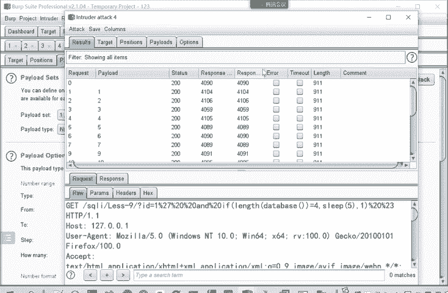

然后我们进行排序。你看这是4054的这单位是毫秒，就是4秒多。然后呢，有一个是9000多毫秒，也有9秒多和别人。基本上就相差5秒。这个单位是毫秒啊，相差5000嘛，就是相差5秒。所以说。

只有8这里它是执行了sni5的，其他的都是不执行sni。通过quaumments把这个响应时间，这个变量给调出来，给显示出来。打上勾，他默认是不打勾的。通过这样再筛选这response这个时间。

就很容易判断在我们这个时间忙碌里面。因关键的区别就在于这个响应时间嘛。那这个时间忙碌是不是大家也都会了？我只要在布尔芒著的基础上，布尔芒著直接判断。那我时间忙碌了要把这个判断放在这个if条件里面进行。

判断正确就执行snniep5判断不正确，就啥也不做。然后进行下一次判断。

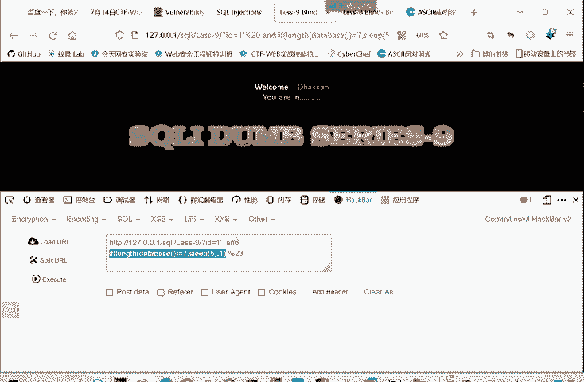

呃，这个盟助部分就讲到这里。