# 2024年最强Kali渗透教程／网络安全／kali破解／web安全／渗透测试／黑客教程 ／代码审计／DDoS攻击／漏洞挖掘／CTF - P77：11.SQL的安装和使用 - 网络安全系统教学合集 - BV1Pe411C7Zb

那我们现在就休息10分钟。后面再讲cyclcle map的一个使用。好的，大家先休息10分钟吧。什么问题还是直接可以发到我们群里面，发到我们聊天里面。嗯。喂，同学们好。那我们现在继续上课。

然后上节课是讲的这个circle芒住。

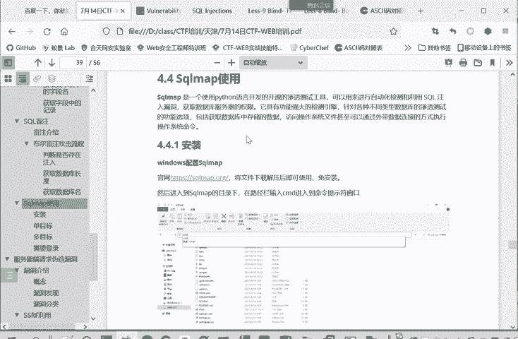

主要是讲这个倍忙住的一个利用过程。然后时间盲助也是给大家讲了，只需要在我们布尔忙助的基础上呢，把这个判断放到这个if的第一个参数当中就行了。然后衣服的第二个餐数呢。写上一个。时间的一个函数。

就全序挂起吧，sleep5啊、4啊6啊都可以。然后后面第三个参数呢，就写个一，什么也不操作。这样就能进行一个时间绑住的利用。

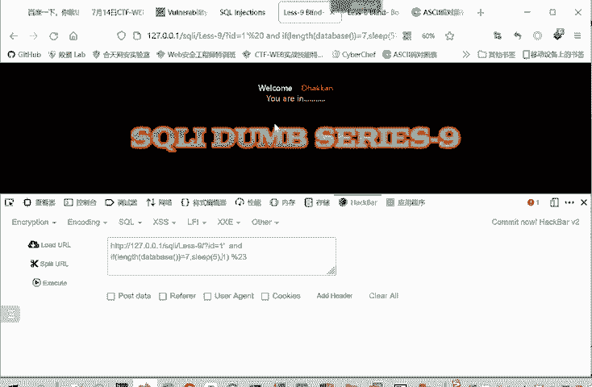

啊，如果说上课过程中老师的这声音画面有什么问题啊，或者说讲课哪里没听懂的，大家就直接发到聊天里面。要不然的话，我就啊不了解大家。的情况不遇不会知道大家遇到的问题啊。

那我们这节课呢去看一下这个cycle drew的最后一部分，就是cycle map的一个使用。scle map呢是一个使用pay语言开发的开源的渗透测试工具。

它可以用来自动化来检测和利用scle注入漏洞，获取数据服务器的前限。它有功能强大检测隐擎，能够针对各种不同的漏洞类型呢进行一个渗透测试，数据库的类型，进行渗透测试，获取数据库中存储的数据。

那么这个cyclrcle map如何安装呢？大家可以访问官网进行一个下载。啊，是他的一个官网，这个项目的官网可以进行一个下载。或者说是下载我们课程微盘里面的一个circle map。

这也是从官网上进行下载的。因为getthub上有人下载可能会比较慢，所以之前提下载好了，已经放在我们的工具集里面了。下载好了怎么使用呢？啊，使用是很方便的。

我们下载好之后就解压解压进入scle map这个目录，然后在这里面有CMD。

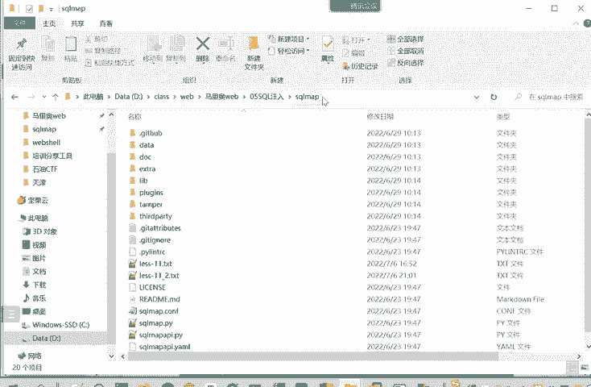

Person map。因为这是一个some map是一个pathth写的一个开源框架，所以用pasthon来执行。有APP。大家如果说出现像我这样的显示呢，就说明是一个正常的。se map就可以使用。

如果说你的pathon缺什么库啊，缺什么包啊，就进行相应的安装。那么我们一般使用一个工具呢，就有一个杠杠cre。

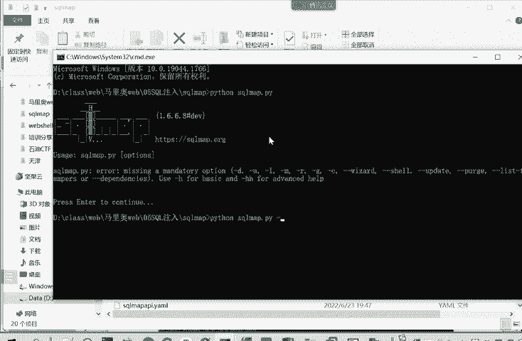

查看一下他的参数。这里的参数啊表面上很多啊，实际上不多。关键的参数我们呀ta给的就杠U杠U后面接URL。就比如说举例就是。这样一个你你接上这样的URL，它就会对这个URL进行一个测试。

看它是否存在一个注入漏洞，或者说存在一个什么样的注入漏洞。

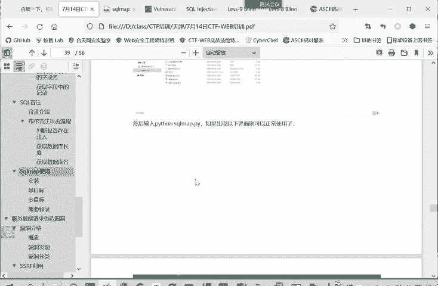

就可以正常使用了，出现这个界面就可以正常counting里面呢是。无需配置这个cyclcle map的。他因为卡里是自带了cyclcle map。直接在终端输入这个cyclcle map就能够进行使用。

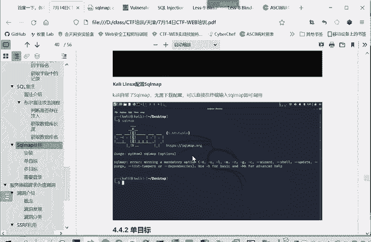

这windows和卡你的使用都说了。然后具体如何用这个secle map呢，我们首先看一个单目标的一个情况。比如说我要测试我们这个靶场第一关是否存在一个s柱的漏洞。就可以使用这样的命令。

这个命你解释pathon啊，这是这是pathon开发框架。当用python打开这个都懂scle map点PY，这是这个项目的程序。杠U呢就是。他是接这个目标，目标是什么？你这里。这是网址，你网址的时候。

你要把这个ID等于一带上，因为参数的名称。也是要带上的，要不然他注入的时候进行测试，不知道参数的名称。或者有的网站它要同时传输多个参数，比ID等于1啊，配置等于10。那你需要使用杠P参数。

指定哪一个参数是需要注入的这个参数。你是注入测试是测试配置等于多少，还是测试ID等于多少，你得指明。然后如果说你直接进行你使用的时候，你直接这么用的话，它会有很多个选项。但你如果选项觉得太多，耽误时间。

不想选择的话，你直接使用杠杠背这个参数。进行一个利用。这里我就使用啊。测试一下我们这个靶场才空内部就。就把场第一关。他是否存在一些漏洞？

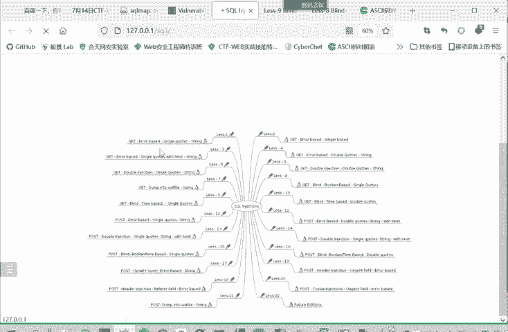

还是测试我没。我们刚采用的最多的第八款，我们熟悉一些啊。

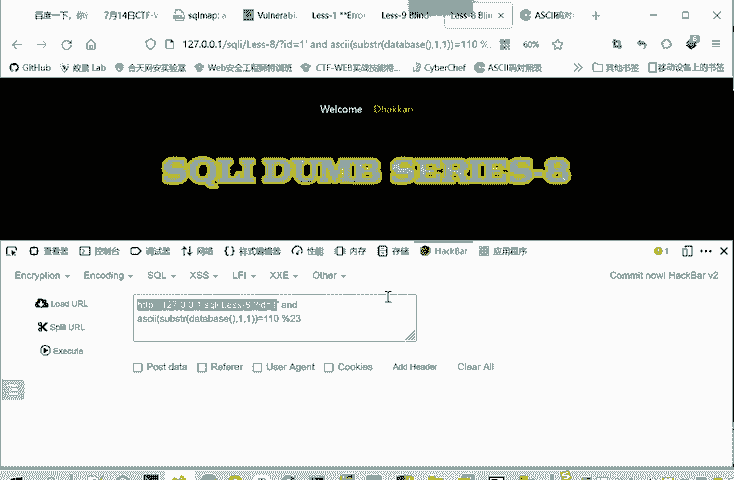

把这里把这个URL给复制过来，然后。

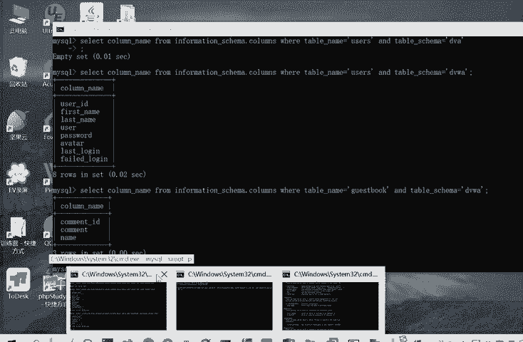

然后放在我们的se map里面进行一个使用。

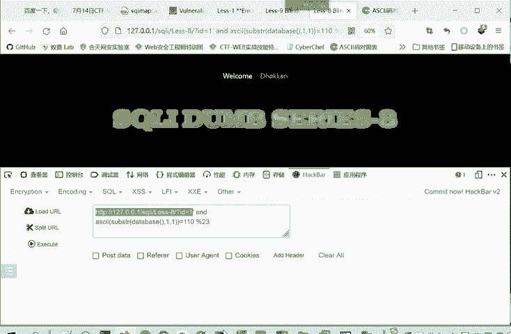

这时就杠U，然后后面就是一个参数。是UL。我们测试第八关，他是否存在一个社会主漏洞呢？我们上节课是用我们自己手动进行测试的。那然后获取数据库名的时候，用到了bb这个工具。

这节课我们讲如何用se map这个工具，它不是一个新的漏洞类型，而是一个新的工具。我们讲这个工具的使用。只要说杠杠，不要去死。

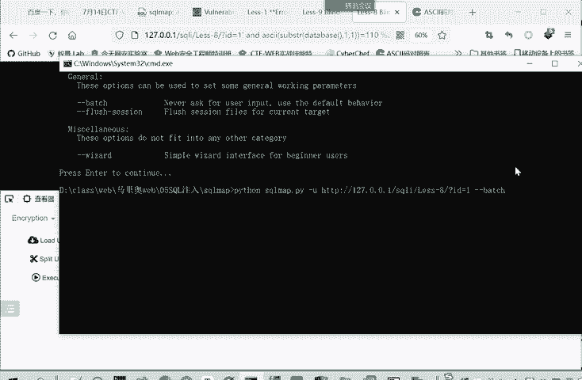

他就按默认的方式进行一个测试。你看这里给我们显示的有一个新info这个预测的信息，我们可以看。他就发现这后端backckend的DBMS支出管理系统呢是这个my circlecle。

然后他发这里的信息呢。信息是发现了下列的这个注入点。比如说参数ID。他有什么布尔芒助。有时间帮助。他发现了。那我们上节课是不是讲这个第八关是存在一个不尔帮助？实践你用时间帮助也是可以做的。

只实他能够用布尔盲住的话，那就没必要用时间盲助。比方第九关，他只能够用时间盲助的方法进行一个解题。

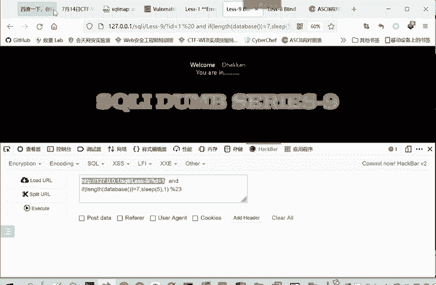

那么这就是首先测试是否存在漏洞。那我们第八关测试是发现存在的漏洞的那怎么获取数据呢？其实很简单，也就是杠杠DBS就是一个获取数据库名杠杠table获取表明，我们可以证明。

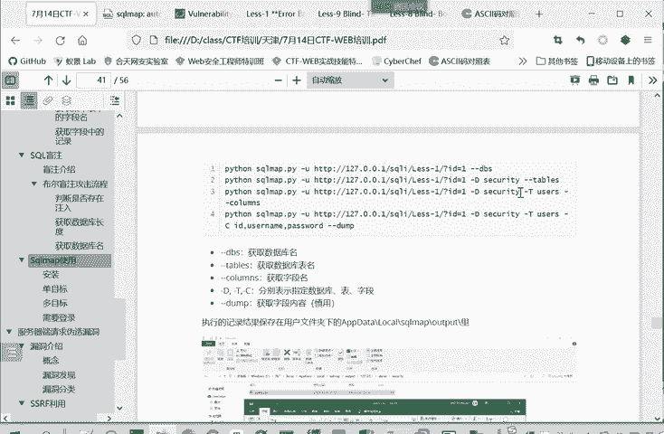

可以看一下。我不用带量外去。GBS database就是获取数据库的名称。我们现在。你看正在retrive就获取，它正在获取当中。啊，这个因为是盲助嘛，他要进行一个猜测，所以说他获取数据库名的时间。

会要比较长。快我们稍微等待。一些时间才能够完成这个获取。大家如果做一个题，第一次运行的时候。会比较慢，如果再拔卡的话，你。运行过几次的话，之前运行过，你再次运行，再次查找。他就会比较快一些。

这个应该是我之前把这个呃历史记录给删除了，所以它现在运行的话会比较慢一些。他正在一点点的这种猜测。他先re57，就是说他发现了有7个数据库。然后第一个数据库的名称呢，它正在进行。

这个比拆解它也是一个一个字符的比对。他首先发现第一第一个数据库的名称，第一个字母是I，第二个字母是N。第好，现在发现了第三个字母是F。然后呢继续进行后面的一个拆解。嗯，那我们就让他运行着。

这反正他自己一个运行的过程，不用我们中间进行一个干预。

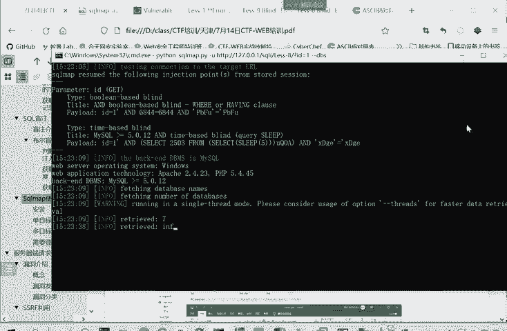

我们继续看我们的课件。前面的这个杠U接上这个U21要带上这个参数的名称ID或者是什么CMD啊，或者name啊什么的，你把这个参数名称带上。然后你想要获取的是daabbase，就杠杠DBS。

你如果想要后续表明呢，就刚 ontable。但或许表明你要获取。哪个表是在数据库之下了，你要获取哪个数据库的表呢？你都用杠T指定一个数据库，你要获取这个数据库security它下面的表明。同样的。

获取表明之后，你想获取字段名呢，那就是杠Dsecurity数据库下的杠T指定某一个数据表，比如说user这个表，然后杠杠quaums。只是获取他的。

这个seccurre这个库中users这个表里面的字段名。字段名义获取的啊是ID username passwordword，然后你再想获取每一条记目是什么呢？你就把前面的都带上啊，在杠C。

ID user name password，然后最后再加上这个。杠杠当。当铺呢其实就是一个。脱库就把这个库给扒下来，这个一定要谨慎使用，只是说存在这种方法一定要谨慎使用。因为你把别人的。

如果说大家以后在网上你要测试一些安全风险的时候。你把别的数据库给拔下来了。那别人的公司的信息泄露了，这是违法的。所以说这个ds只是在我们本地测试的时候可以用。其实你前面能够获取数据库的名称。

就已经代表它存在漏洞了，就可以提交SRC了。后面只是说有这些方法，并不一定大家要去用。

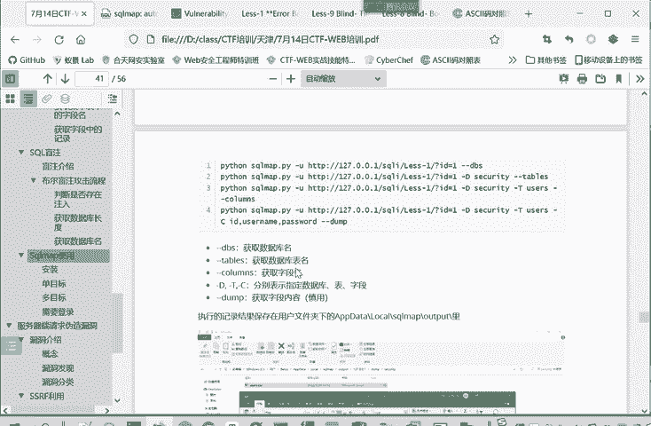

那么它这里裁解出了inform是吧，这个数据库应该采解的是information schememer这个数据库。

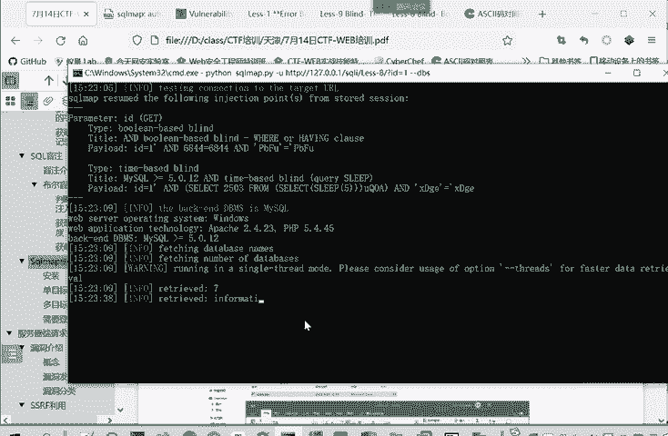

这运行比较慢，因为我们单线程的没有给他开多线程。然后你如果脱库的话，它的结果会保存在用户文件夹下的这个APPd localcycl map output当中。嗯，我看一下那个。我有没有。对。

我没有档库啊，没有把。库给拖下来，这是他刚才输输入的一些内容，他会保存在这。

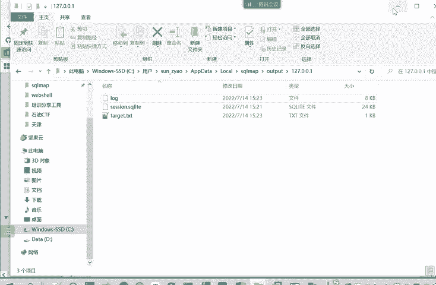

你如果断库的话，就会生成这个excel，把这个表的完整内容给扒下来。这是ciircle map的一个简单使用。那有时候说我想测试多个目标怎么办呢？你就把所有的目标写在一个文件夹里面。然后你。

python下个m杠M，然后接这文件夹。他就会一个一个目标进行一个测这个测试。哎，这个测试是有点慢。

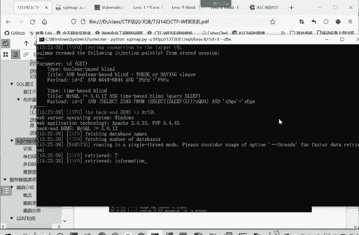

就是我们刚才杠U就指定了单个文件，你把多个URL。一行一个这样写在这个一个文件夹里面，文一个文本文件当中，然后杠联这个文本文件。但这个文本文件适和sclement在同一的路径下，如果不在同一路径下。

你就跟上这个文件的绝对路径就可以了。就可以批量化的进行一个测试。这样子你可能就有很多个URL，你测试之后，你再看哪些URL存在一个cyclcle中的漏洞，然后后续再进行利用。这对多目标的。

然后对于有的是需要登录的这样一个。下克们这个注入怎么用呢？所谓登录就是。苦黑信息。比如这里给大家看一下我们的这个靶场。所以咱们就合这个靶场，这是需要登录的，是不是？如何在这里进行一个注入呢？我们。

我们主要演示这个cyclrclecycl map的使用，所以就是。用简单的来做。比如说这里如何来。判断他是不是存在一个srcle注入的一个漏洞呢。他这是需要登录的，怎么办呢？我们先用b把他的信息抓下来。

我们这这是我们刚才访问的ID等于一嘛。这个包我们看一下。他下面是不是有个cooking信息？我们可以把这个会信息。给复制出来。我们先复制出来，先放在这里。然后我们怎么用ser map进行一个应用呢？

这里课件里面写了。

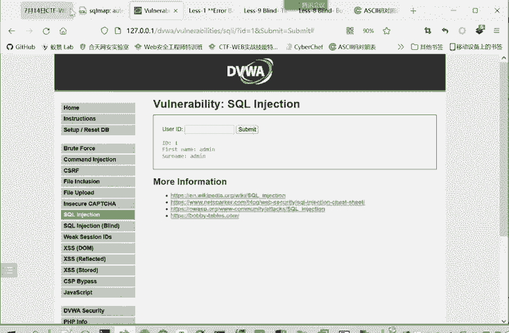

杠U啊，这前面是正常的。因为这里有两个参数ID和submit。你两个变量谜。所以要指定哪个变量名是用于注入的杠PID，然后再加样杠杠cooking。然后这里我们的。刚才的复制下来的c学。就行了。

然后你后面是获取数据库啊名称还是或取什么，那都是。根据这个场景呢，想要获取什么数据都可以正常使用。就需要使用杠杠的cookie，然后把这个cookie值带上，就不会遇到这个登录的问题。要不然的话。

你每次进行测试的时候，它都要跳转到登录界面，要你进行登录，你就没法进行一个自动化的测试了。那我们先试一下我们。啊，我们这里先。先不输入这个cook，我们看一下这个结果，他这次发现了第一个数据库。

然后再看说面数据库。那就把它中断了啊，让他继续运行了。强制中断了。他知道这个方法怎么用就行了。

然后我们。然后获取。退据库的名称。你看这你就会问他发译了302的redirect跳转，302就是跳转的一个代码，状道态码吗？然后跳转到这里，login一点PHP问我们是否。登录。

这样你没法进行一个测试了。我们要登录也是无效的，他不是要我们输入用户名口令，是要这个。哭给觉。那就没法进行利用。因此呢我们就要。搭上这个杠杠。O。放个cook等于多少呢？

我们刚才把cook值通过bb已经抓到了，我们把这个复制一下。

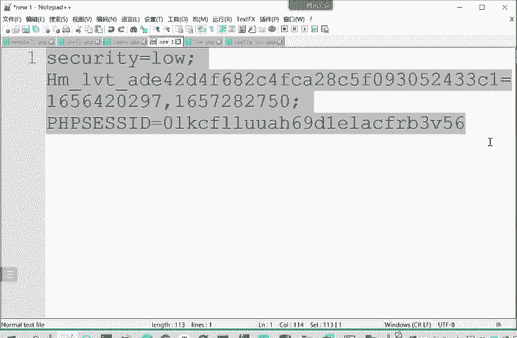

然后。引号嗯。因为这是一个变量嘛，把它都用引号包起来，然后再进行一个。漂。嗯。我们看一下这个cookie值。

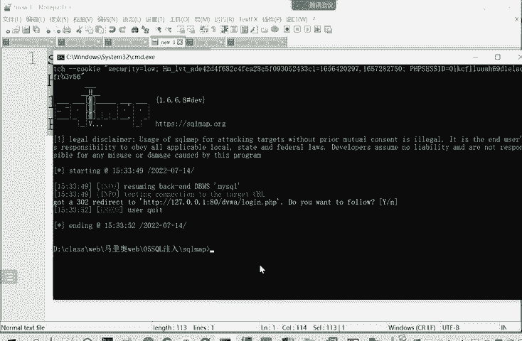

嗯，我们在浏览器里面看一下我们这cook值是否。是正确的。在存储里面有一个cookie，可以看到我们的cookie。它这里有一个cookie security impossible，对把这条删掉。

因为是imposs的话，也不能够进行漏洞利用。然后我们重新。重新抓个b来看一下。嗯重新抓个包来看一下。呃，枯毁值，我们再把这个枯毁值给复制出来。他变了嘛，那我们可签的。三V56还没有变。

然后我们再进行一个利用。嗯啊COKc。检查一下，不要输错了。嗯。😊，我把这个先关了。我们把整个过程重新来一遍。看一下他的cook。Your name。嗰个咩。啊。然后我们再提交一个。再抓一个吧看一下。

Yeah。啊。看一下。那cook还是没变。然后把我们的命令也复制出来。

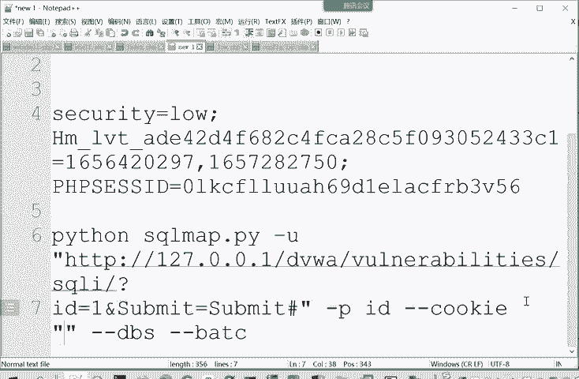

嗯，酷老师。Okay。仲要。你好ID。呼几啱。那是不是就能够直接进行利用了？啊，刚才有个多单个换行。这你把cook信息带入了，他就不会让你跳转到一个登录的过程中。你又能够直接进行利用。你看。

他这是获取的databbase name，那么千能节DVWA informationmycircle这些。这是一个需要登录的一个情况。还还有一种情况就是说如果说我们直接进行利用的时候呢。

它会带有一个我们发送数据里面会带有一个user有se map这个标识。这时候我们可以用这个randdom agent来进行一个替换。比如说我们先直接抓吧，直接抓包。我们先把这个命令复制过来。

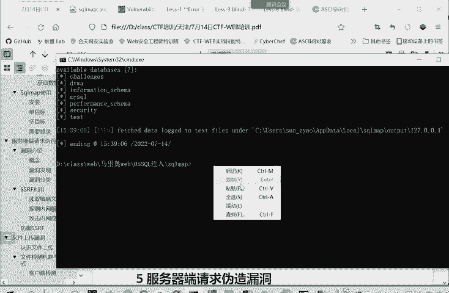

嗯个。

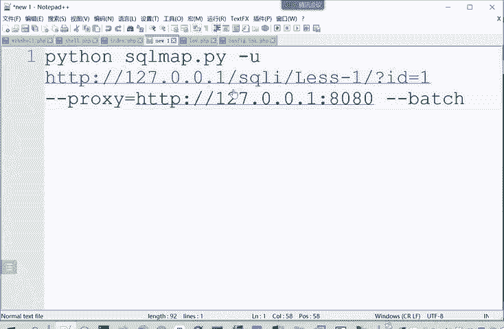

P。这句话什么意思呢？前面大家都理解了，我测试这个UIL它是否存三个注入。这你刚刚proxy就设置一个代理，我代理到什么呢？我本地的8080的这个端口。也就是我们b普监听的端口IP。

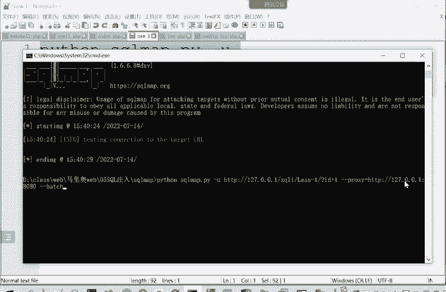

那么这这里我们b部可以开启一个拦截啊，我们可以看到的中间过程。

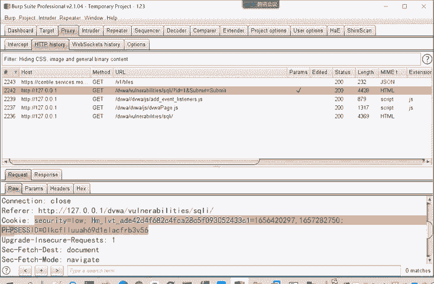

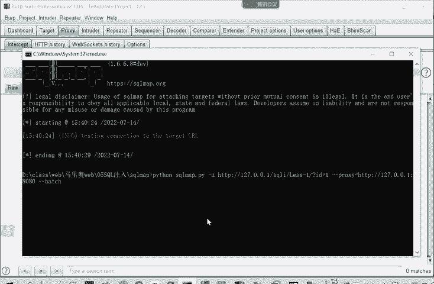

拦截我们要直接运行。那是bb在南极的，大家发现没有？我们南极的包，比如这RA型的，其接带有s map。由cyclch map是一个著名的这个cyclcle注入的应用工具。

所以你对你带有cyclcle map呢，人家一下就知道啊，你正在用s map来进行一个扫描，或者说攻击行为。

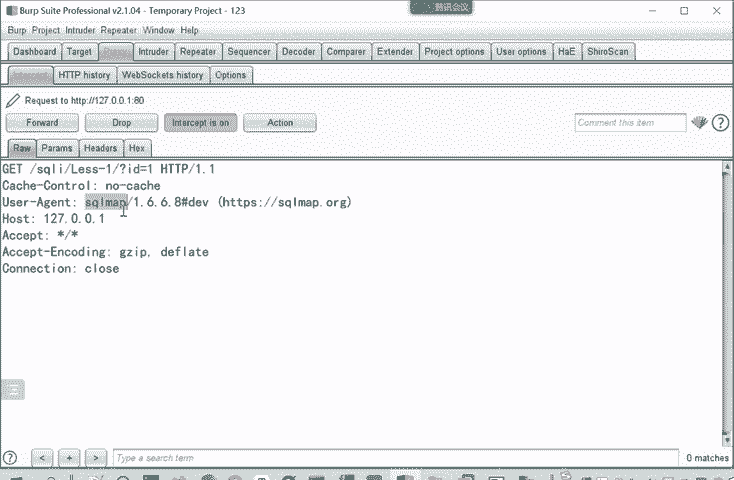

这就不是很好，这个时候我们怎么做呢？

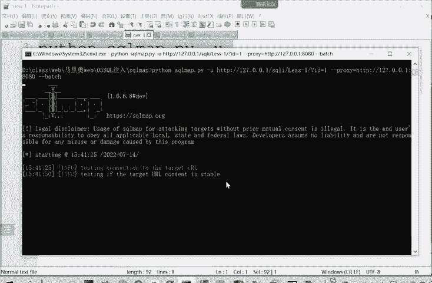

我们就带上这个。后面加上一个杠杠us random agent。或者是你杠杠user agentent等于一个固定的。这U到值，它就不会有这个scle map的一个标识了。

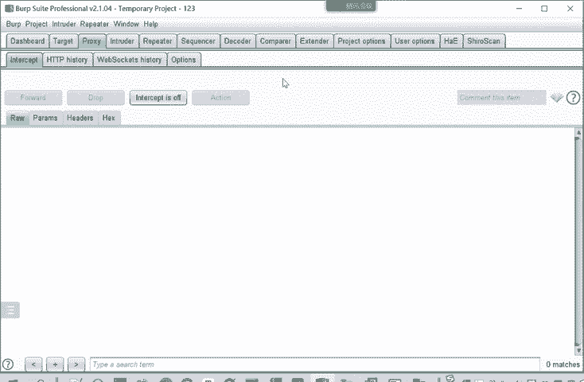

把这暂你关掉啊。我们看一下。同样是这个代理，就加上一个杠杠。嗯。不要那么A进来。看一下这个命令没有输错吧。这么A进的是吧啊，我们。

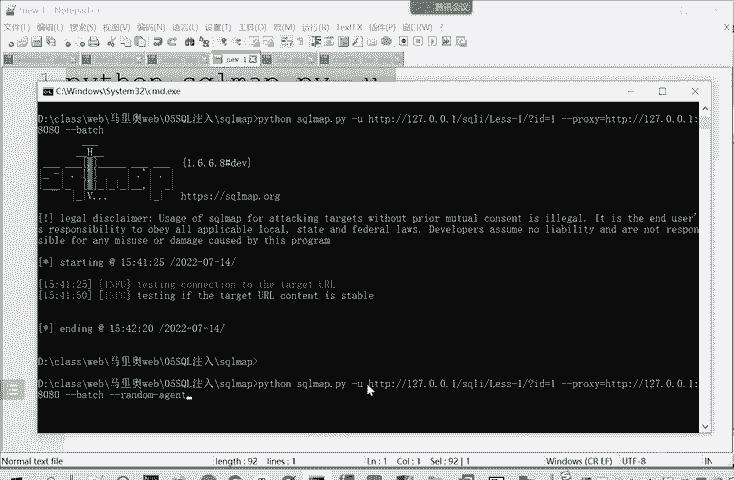

然后执行命令。这时候你看我们再抓的话就不是一个cyclcle map user agent的里面就没有一个cyclcle map的一个信息了。你看。这都是看起来正常的一个有锥劲的头。

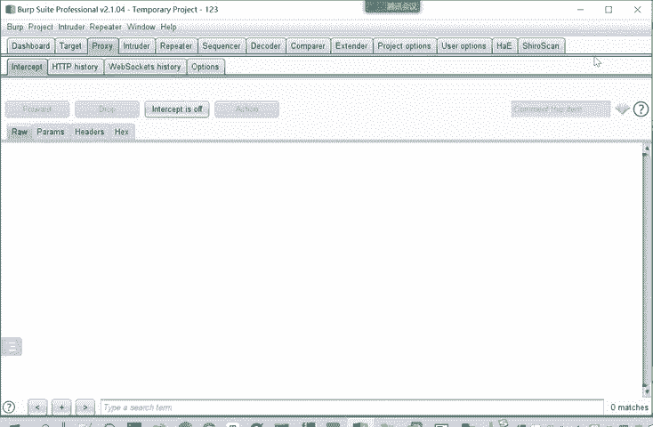

这是一个使用技巧。用random agent的来进行替换，或者是你替换成一个固定的都可以。只要不带有t map就行了。

