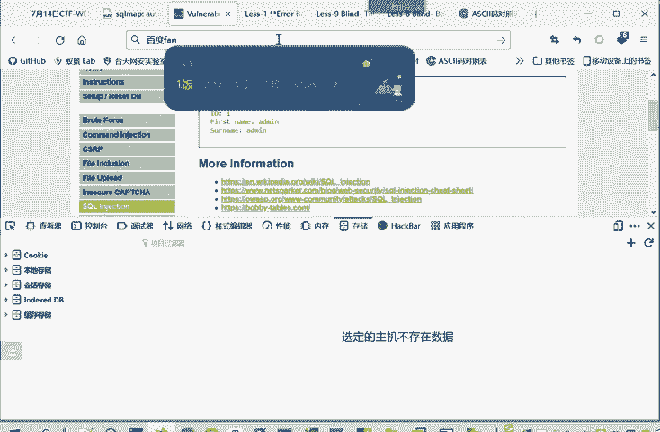
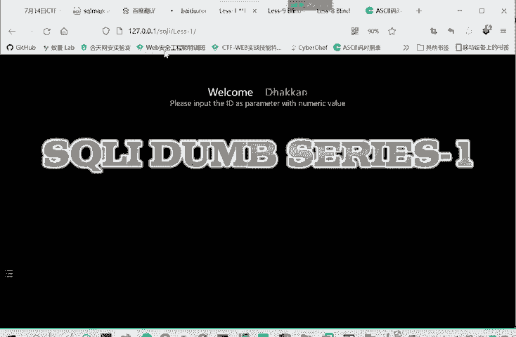
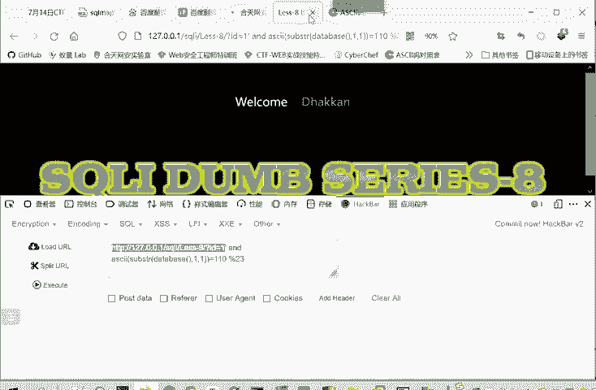
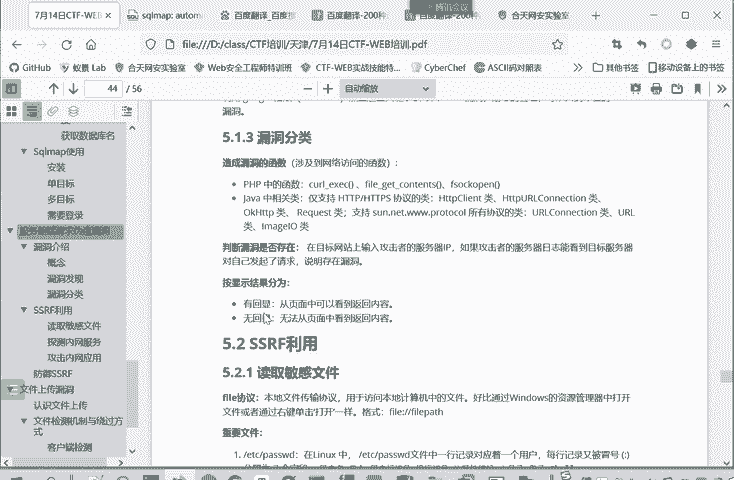

# 2024年最强Kali渗透教程／网络安全／kali破解／web安全／渗透测试／黑客教程 ／代码审计／DDoS攻击／漏洞挖掘／CTF - P78：12.认识服务器端请求伪造漏洞 - 网络安全系统教学合集 - BV1Pe411C7Zb

然后这个。数据库的那个这些注入就讲这么多。然后我们下面进入这个服务器的请求无造动作SSRF。的一个学习。首先介绍一下这个概念。服务器请求就是说从客户端发起一个请求到服务器。

服务器再向另外的服务器发起请求的过程。就本来我访问百度是吧？就是我这个浏览器向百度发送了一个请求。但如果说。百度啊成为一个。听话的，我让他干啥就干啥，那我让他帮我发送给请求。我把请求先发给百度。

百度再把请求呢发给他内部的一些设备，这就是一个服务器请求。这是内部的设备。看来，这是百度服务器给他发起的请求。那服务器请求伪造是什么呢？Your server side。SSIF服务器请求违造。

是由攻击者构造形成了由服务器端发起的发起请求的一个漏洞。就是说什么呢？比如说这个图啊，我们看一下工期流程。他一般是让你探测。内网。比如说这个黑客攻击他要攻击内网的服务，他本来是无权访问这内网的服务的。

因为这个公司有防火墙。只要通过80或43端口访问这个外部服务器。但是如果说这个外部服务器存在1个SSRF漏洞的话。那攻击者就能构造攻击链，它是访问着SS这个web服务器。

但是他用web服务器把他的请求转发了，转发到这个公司的内部的设备，内部服务。那公司的内部服务看是这个我有服务器访问他的，不是外面的用户访问他了，就允许访问，这样就造成了一个信息泄露的风险。

或者是说内网受到攻击的一个风险。所以说SSIF需要服务器。这个服务系去替你请求，通常请求不到东西，一般适用来在外网探测或者攻击内网服务。这里也是一个攻击流程，比如说攻击者和一个内网主机之间。

本来是不可达的那怎么办呢？攻击者想攻击这个内网主机，他就发送个芯片服务数据包到这个服务器A。那服务器A呢响应了欺骗数据包，然后这个包里面是有一些东西要向B请求的。然后服务器A。

就傻乎乎的向主机B进行请求，然后主机B就响应了请求，然后服奇把这个请求再响应给攻击者。通过服务器A事实上实现了这攻击者和这个主机B之间的一个连接。主机B可以理解为一个内网接器，它外网的用户。

应该设计上是应该访问不到这个内网的机器的。我们可以类比一下，外有一种常见的另一个漏洞CSRF这叫什么跨站请求伪造。服务端请求伪造了这个SSIF是将域中不安全的服务器，就是这个不安全的服务器。

就是一个代理使用。这个CSRF跨站请求伪造了是利用网页客户端的跨站请求伪造登具。都是利用别人，不过这里呢是利用这个一个不安全的服务器。另一个是利用客户端，就是利用的对象的不同，相同都是利用别人来。

转发一个请求，达到一个攻击的目的。那么这个漏洞的成立呢，就是由于服务端提供了从其他服务器应用获取数据的能力。就是这个服务端提供的这个要从其他的服务器获取数据，所以要向其他服务器发送请求这个能力。

但是又没有对这个地址做严格的过虑和限制。那么导致攻击者可以传入任意的地址或者是指定的恶意地址来让后端服务器对其发送请求。并返回对给该目标地址的一个数据。比如说攻击者可能传入一个未经验证的URL。

那么后端呢代码就会直接请求这个URL。如果说他不验证，直接请求这个UIL的话，就会造成这个服务端请求伪造漏洞SSRF漏洞。漏洞的危害呢就利用SSIF漏洞攻击者事实上访问了以前访问不到的内网。

那么就可以读取内网的文件啊，扫描内网的服务和端口。收集内网应用的一个指纹。然后根据这些指纹信息呢寻找漏洞啊，进行下一步的渗透。还可以攻击在内网中的系统或运行的程序。这是这个漏洞的危害。

那我们说这么多安利网。那么什么是内网呢？内网就是。这个公司他防护员包着他不让外网外面的用户进行访问的这个网格。就是互联网上的用户。正常情况下是访问不到的一个网道。那么内网的网站有哪些呢？

除了我们特殊就1压7点减压这本地。还有这个169这些。就就这三个段是内网的地址。这个10的。整个呃172这个段的16到31。还有192168这个段这C那段。就这些是内网IP，其他的就是公网上的IP地址。

也就是说你访问192。1，你把点1。1，你是访问到一不到一个公网的设备的。因为它不是公网IP。它必然是某个内网的IP，要么这个IP地址就不存活，要么就是某个。你所处在的内网的1个IP。

那么如何发现这个SSI分斗洞呢？那漏洞点就是能够对外发起网络请求的服务器，就可能存在SSRF漏洞。我们只是说有这个特征就可能存在。但是具体什么什么，还要经过测验。这里有两个特征，如果有这两个特征的。

就可能存在。大家在寻找这个漏洞的时候，可以多家注意。第一个是注意这外部功能。服务器端请求伟大动作是在服务器端获取其他服务器的相关信息的功能中形成的。因此呢我们可以列举几种在外部应用中常见的。

从服务端获取其他服务其信息的这个功能。比如说一个分享URL。那分享的时候。一般会去获取那个URL的一个t标签和相关文本，告诉你去哪。那就要读取这个URL的内容。

那就可能造成这个事实上也就请求了这个URL。还有转码服务。啊，在线翻译这些。然后我们看一个，因为在线翻译是一个比较典型的例子。我们看一个在线翻译的例子。

你把这个三钮模式关闭。我们这里访问一个我们核天晚安学验室。

把这个Ccle有个靶场给关闭。

给你百度翻译啊，本来说中文我们去。中文。变译成英文，我们进行一个翻译。但是它还有个什么功能呢？就是说我可以翻译一个网页。这以前是可以的，我们现在看一下它这个功能还是否保留。

看我们正在将这个第三方的网页翻译成一个英语。我们这我们原网页。那翻译成了英语。那他既然要翻译这个网页，他肯定要向这个网页发起请求，就像这个URL发起请求。像这种的话，就可能存在1个SSRF的漏洞。

因为他要向这个用户输入的这个UIL。这URL是不是用户输入的URL是一个请求。当然百度肯定他们大厂有很多安全机制。直接找到他们的SSIF漏洞是比较难的。但是更多的一些小公司他没有做那么。前面的反馈的话。

如果它具有这个功能，就很可能存在。1个SSIF漏洞。这是从外部功能角度。第二个呢，从URL关键字的角度，它允许加载外部资源的URL就可能存在这SSLRF这里。这个字是S。这些URL中呢。

这句呀经常包含的关键词有么戏。WAPPURLlink SRCsource这些。他要从别的URL处请求资源。说明它服务器本身要发出请求。他既然可以发出请求，那就有一个他发出的请求是被伪造的这样一个风险。

这都不是说有这些关键字一定有漏洞，只是说可能有漏洞。那么n洞的分类呢，根据这个后端语言的不同。K你可以分成这种。PHP和jaJava轴。造成漏作函数就可以分为两类。PP有些造成部分函数。

然后java这种游戏。这对开发者而言比较重要的，要注意。然后判断是否漏洞是否存在呢，就在攻击网站上输入目钥输攻击者的服务器IP。如果攻击者的服务器。IP是能够。看到。对目标服务器发起了请求。

就说明存在一个no。漏洞结果呢，按前结果就分为一个有回险和无回险。就是你像你利用这个服务器请求伪造动作向内网发起的请求。这结果请求发出有显示没显示。

这类似于我们三后注入里面的联合查询注入和这个盲助之间的这种区别，命令都能执行。只是一个把执行结果给你显不显示出来这样的一个区别。

