# 2024年最强Kali渗透教程／网络安全／kali破解／web安全／渗透测试／黑客教程 ／代码审计／DDoS攻击／漏洞挖掘／CTF - P79：13.SSRF漏洞的利用 - 网络安全系统教学合集 - BV1Pe411C7Zb

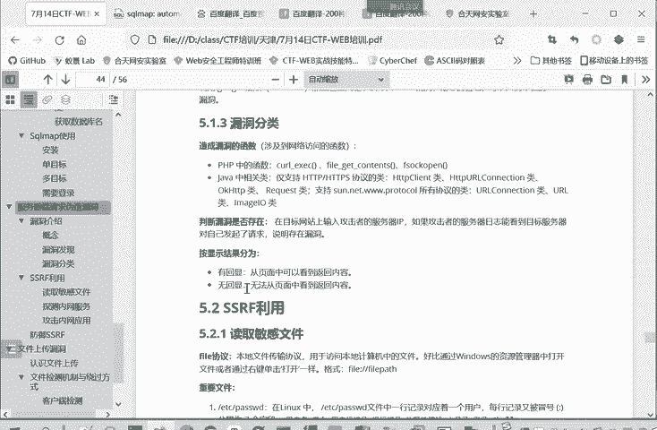

那么这SSRF有什么作用呢？我们看一下它的作用主要有三个作用。这里给大家列举，我们一个来看，首先是可以读取敏感文件。因为它可以访问到以前访问不到的内网，那么就可以读取内网中的文件。

我们常用的读取文件协协议呢就是这个file协议。来看看bi的是一个本地文件传输协议。它用于访问这个本地计算机中的文件。它格式呢就fill冒画两个斜杠，后面是文件路径。比如说正啊我们使用一个搭建好的靶场。

因为我们是不能给。但是也是这种真实的攻击的这是违法的。我们只能够在靶场上。啊，进行一个演示。比如说这是我们大建的一个靶场，它就存在1个SSI漏洞。为什么我们让我们学一个fi协议看一下。

冒号转斜杠是放斜的格式，我们要看哪个文件呢？点克 e t c。所以这里有三个斜杠，就明白这个意思。前两个斜杠是fi协议带的，后面斜杠是ETC的路径。杠一C杠ホス。我们看一下。

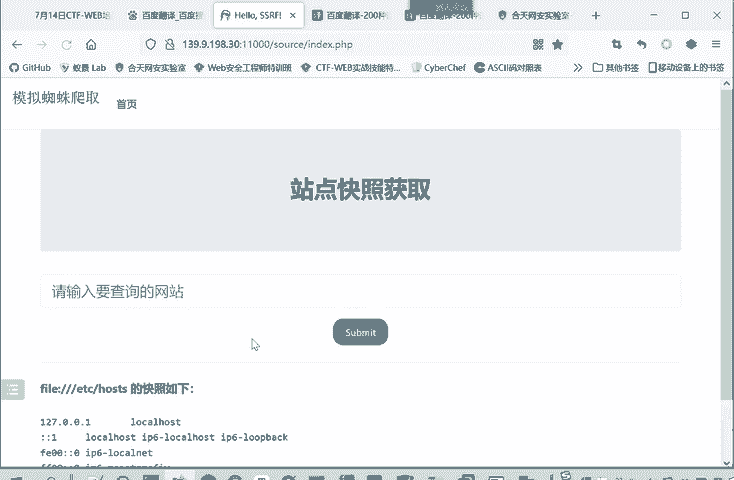

发现他能够看到目标主机的holds这个文件。说明他们。帮我们转发的这个请求。把百度的翻译关了。那常地的重要文件呢就有这个。password啊、 shadowdo啊，这些hoss这些都是常见的。

那hoss里面是配置了这个。域名和主这个IP和主机名之间的一个对应关系。比如说你通过这个，你发现它内网中存在172。17。0。9这样的IP。那么是不是可以对这个IP段172。17。0。

0-24这C那段进行一个探测。我们还可以看看别的文件。看ETCcom passwordword。把前面复制一下。

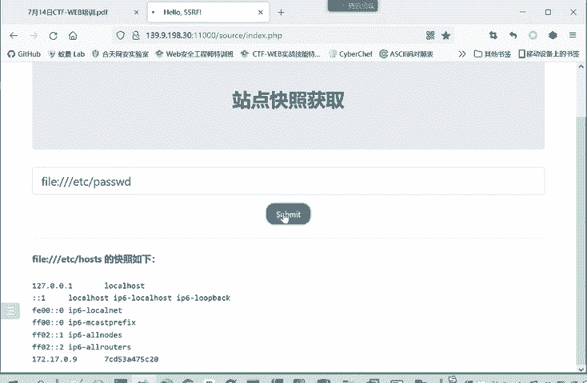

这是不是查询到的一些 passwordsword这个文件的内容？这用户啊密码，但现在密码都是用X表示，因为它真正的密码都放到s的文件里面了。看哪些用户是不是？

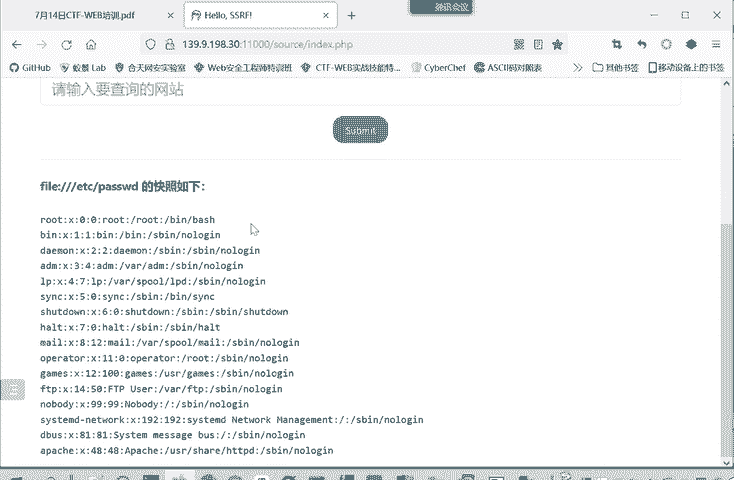

那新的文件能看吗？我们看一下。啊吧，这是不让看的。为什么？因为我们通过网站来访问，一般是3W杠T。这个用户。而写呢是要ro用户才能看。我们再看一下pasword给文件。

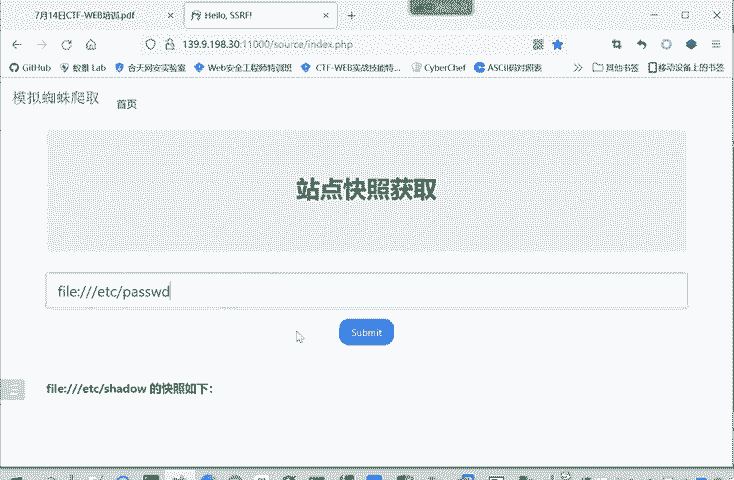

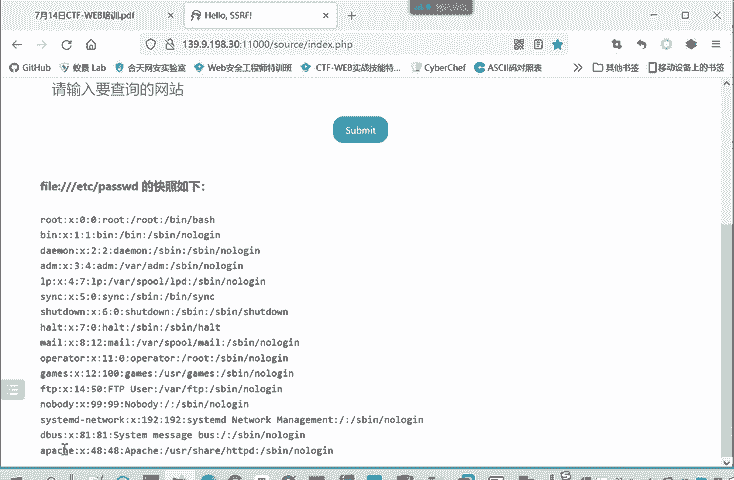

嗯嗯。😊。

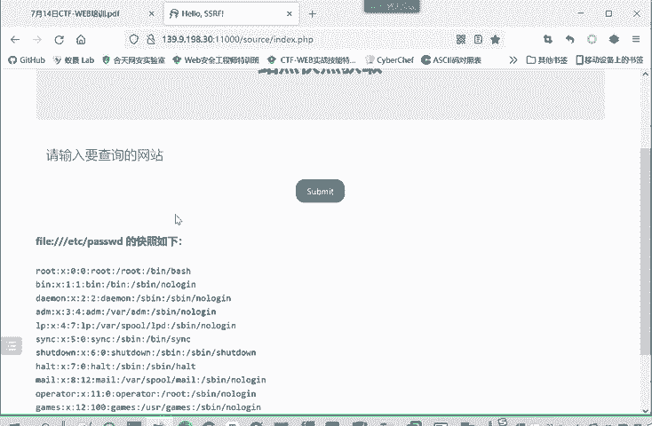

就你能看到他存在哪些用户。

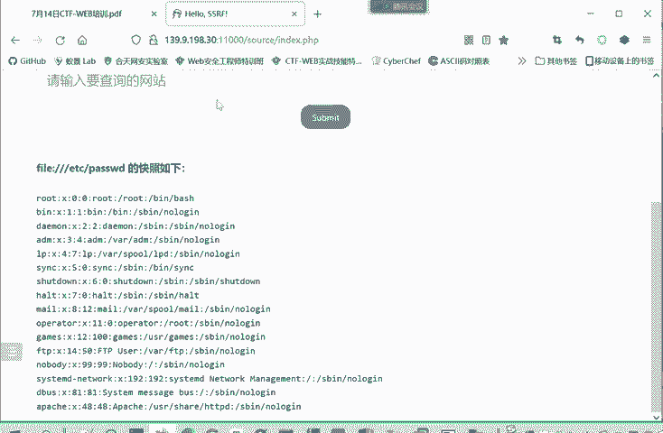

写走呢是存在着存储真正的用户信息，但是只有root用于读的权限，其他用户人是看不了的，没有任何权限。这存储的密码呢不是铭文，是它的哈希值，但是仍然是非常重要的。如果大家以后在互网中。

或者在一些网络公狂比赛中，那获取了这个用户的哈希值，就可以在一些哈希碰撞网站上进行碰撞，看看能否找到铭文。这Ehos呢就是一个主机地址和IP名的应试关系。这是第一个查看内网的文件。

windows下也可以查看文件，不过我们这个靶场是搭在lininux服务器的当中的。第二个呢就是可以探测内容的服务。我这个时候就不是用范线，是用dck这个协议，还是一个字典符系协议。在SSRF中呢。

常用于探测目标服务器端口上运行的服务器版本信息。它格式指DICT漫画两斜杠，然后IP然后端口。我们可以先用范一些读取hoss中的文件的。获取IP，然后用dX协议来读取这个服务器上运行的一些服务信息。

比如说我们看一下。

EI c t。我们就看本地117。0。0。1，它是否开了80端口。

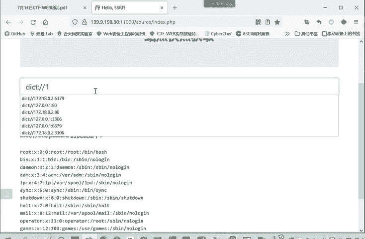

啊，这里没有。那么看看后词上还有哪些IP我们进行一个。

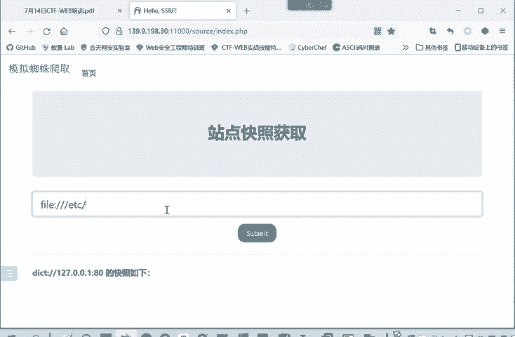

把这个IP复制下来。还有第的协议来看一下。看这里还没开80的服务，哎，也没有都没有。

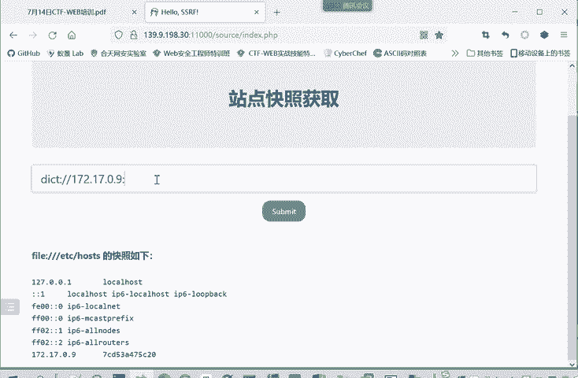

3306有没有？왜的すよ。你看有的就是会显示一些信息，没有的。就啥也不显示。

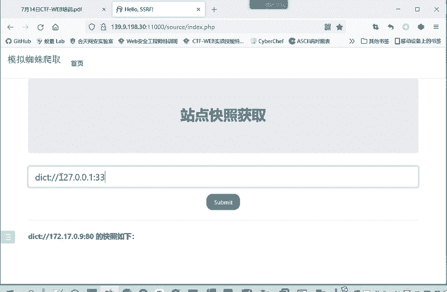

啊，也没有。可以看到它上面的一些信息。那么我们。就可以接下来就可以利用这种探测来进一步看它有哪些存国的IP啊，有哪些开放的端口啊。

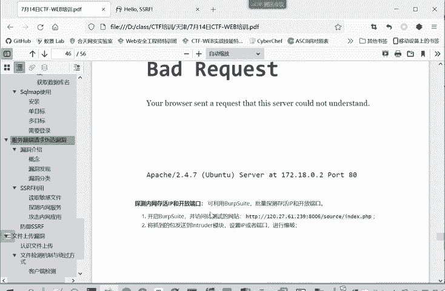

比如说我们刚才的这里我们进行一个探测。拍出。巴黎是没开的哎。43呢。也没有。6379。那你开了6379开了res服务。那么我们这个时候就我们b一直抓牢了，我们看一下。

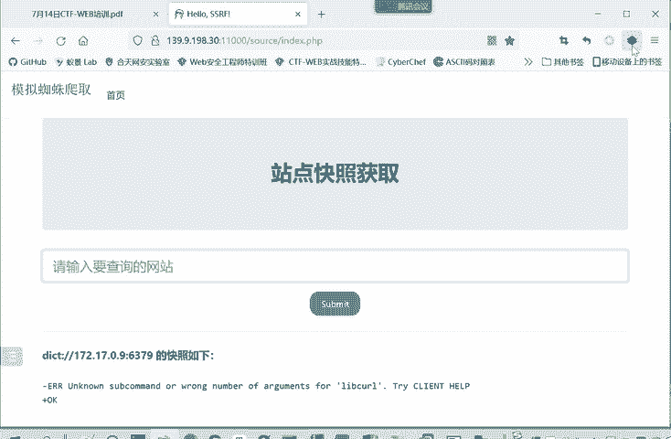

你看这里我们输入的mini是用pos的方式传输过去的dick。1276379。

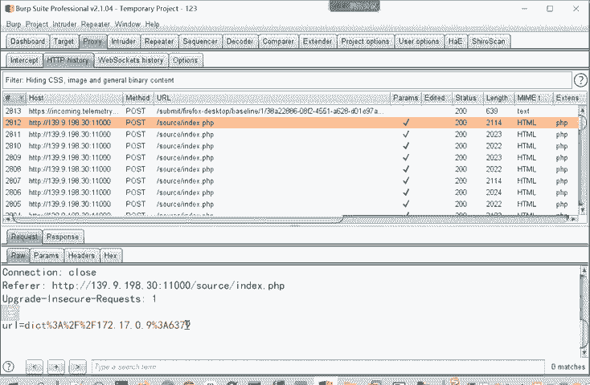

我们可以把它发送到这个已出的模块当中。

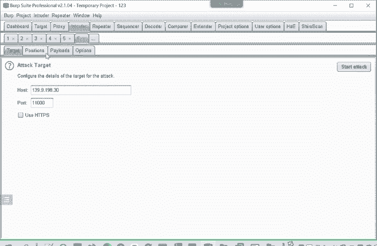

我们要变的是什么呢？是哪一部分呢？比如说我们如果说。查看他单口变化情况。那就可以在这里加上变量。然后它的端口变化栏里？

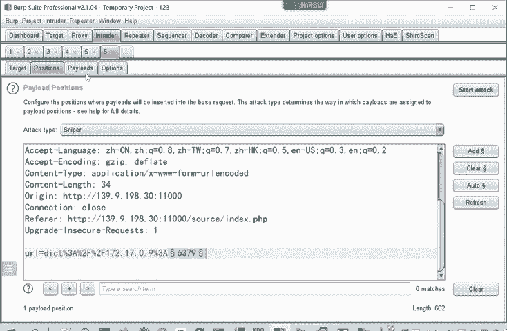

喂看他就是。一。到100。这些端口的哎。这样是可能速度会先试一下，看速度怎么样。

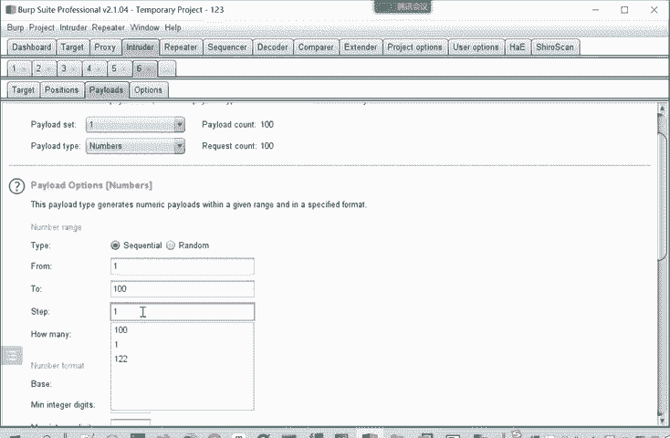

如速度比较慢的话，我们就不进行这样的测试。那速度还比较快的。这是我们看一下状态一样的。哎，它的响应值基本上。都是一样的。

说明他这个应该都是没有开放的。那我们加入一些。我们不用number里来申成，我们自己手动添加。添加一些端口，比如说80呢。43呢。二五。对有箱的，然后3306这数据库的register6379。

我们加进去看一下，让它进行一个测试。

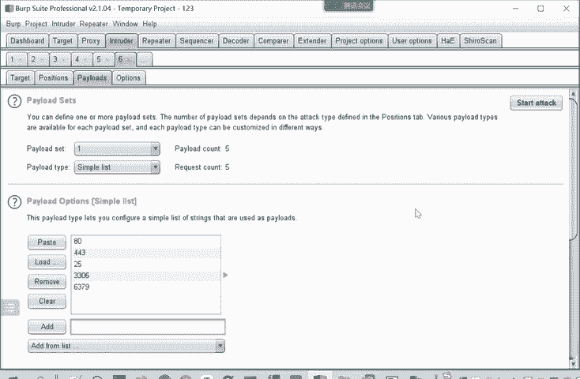

大家看到这个6379的响应明显是更多一些，还有更多的响应的内容。response里面。所以说这几个端口里面呢就开了6379这个端口。那同样的道理我们还可以。

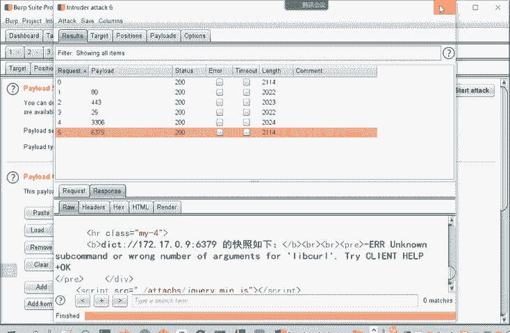

进行一个。这IP的探测。比如说这里我可以。改成八年。来，跟你IP进行改变，进行一个探测。

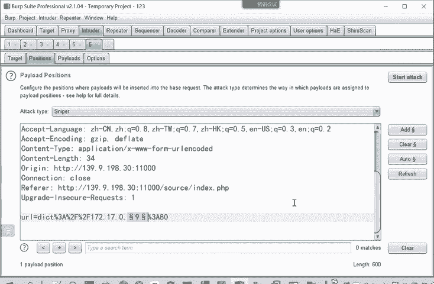

那变呢也是一个数字。然后一到一百。

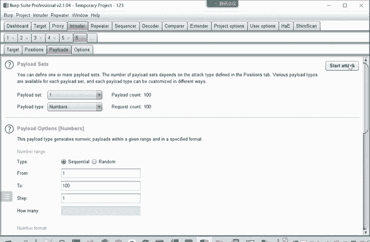

看这些IP他们哪些开到80端口。就是。1717217。0。1。然后点0。2。3一直到。0。今。2期1到0。100。那他们哪些开放的80端口？啊，这是一个进行一个爆破测试的一个方法。

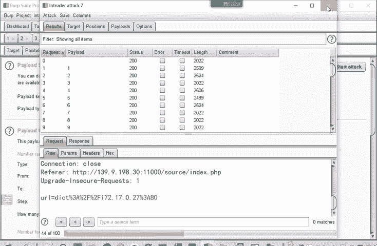

我们就不进行，不等他运行了。这个方法指道就行了。

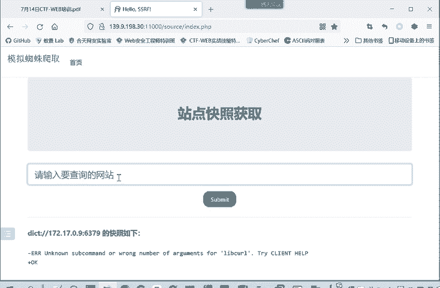

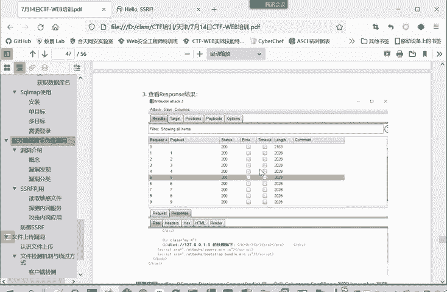

那这里重点给大家提到就说一个探测内网的redis服。redis呢它是一个远程的。4点服务器，它实际上呢也就是一个非关系性的数据库。我们上节课讲的都是关系性的数据库。啊，他这个非关系型的数据库。

reis有什么特点呢？它一般绑定在本地，它默认是不允许远程访问的。就不允许除了本机以外的其他机器来访问。因此呢他默认是没有密码的。因为只有本金来访问，它就不需要密码。那默认端口呢是6379。

因此呢我们可以探测。他这个。SSRF漏洞这个网站上是否。

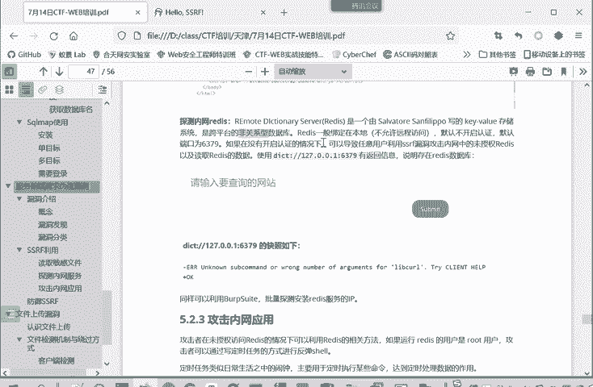

装有这个reice服务。我们运行一下。哎，发现他是流响义。

还是存在一个reginess服务的它reginess服务默认是没有密码的，所以直接可以被我们利用。

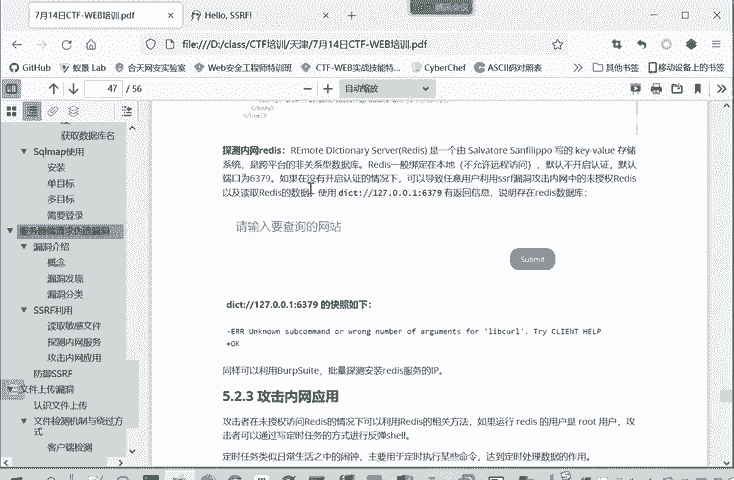

所以ready服务它的安全性在于它绑定在本地。如果你能操纵它本地对ID词发起访问的话。那么reiness就毫无安全性可言了。

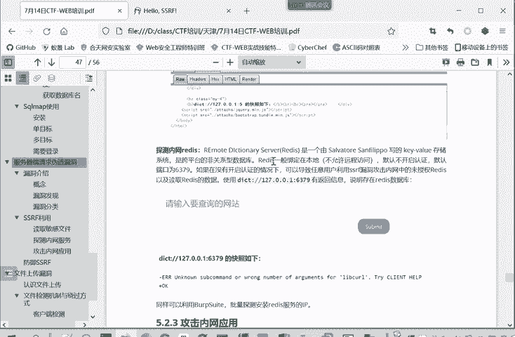

那么怎么进行利用呢？我们看下面的攻击内网应用。

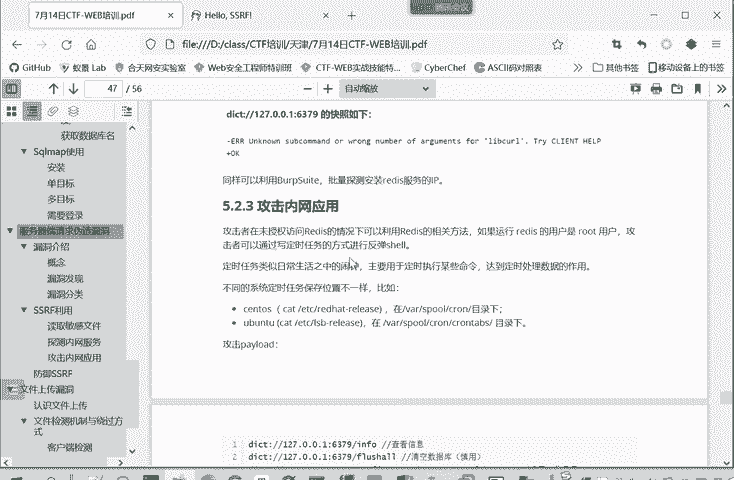

我们可以设置一个定时任务。

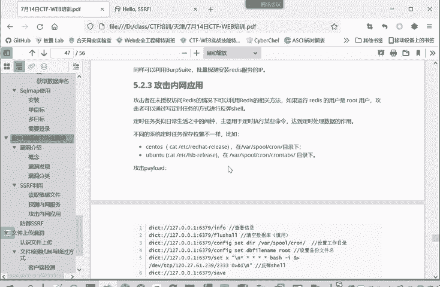

如何设置定时任务？我们把这一段。攻击配漏的给拿出来。然后我们看一下这个攻击配漏的。

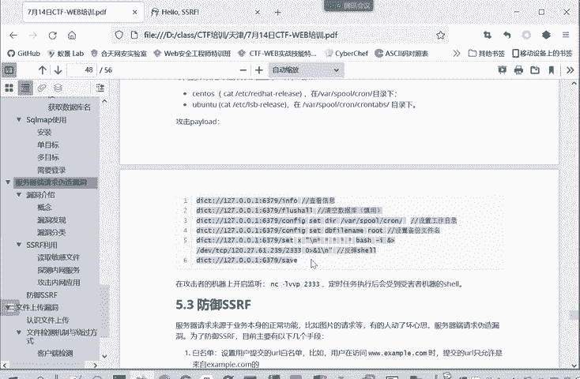

首先这第一句。看info是查看我们目标的一个信息。我们先看一下有啥信息。

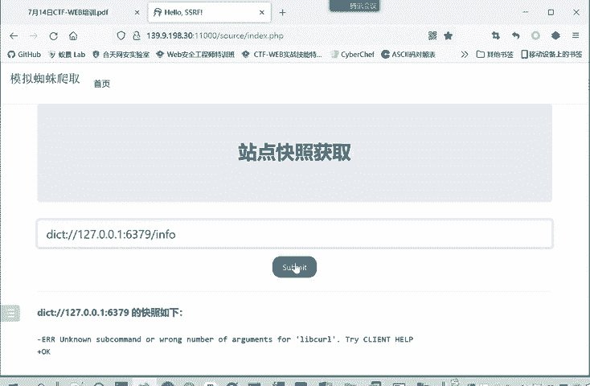

你看。😊，这infer信息就显显示了很多register的版本。是不是？操作系统肯inux。这个信息就显示了出来。那说明他确实有reis，那我们就开始用。如果你使用flash wall，就是清空数据库。

这个命令对你注是慎用。不要把人家数据库删了，自己做测试的时候，也不要用这点，不要删除数据库。然后呢，我们要设置一个定时任务，定时任务的就要。是这个工作目录。

工作目录就是我们我们前面给大家介绍一下进行任务。

使用就是类似于生活这的闹钟，它在规定的时间会自动执行某条命令。从而达到处理数据效果。那么我们可以利用定时任务做什么呢？我们让这个受攻击机器在规定时间内。

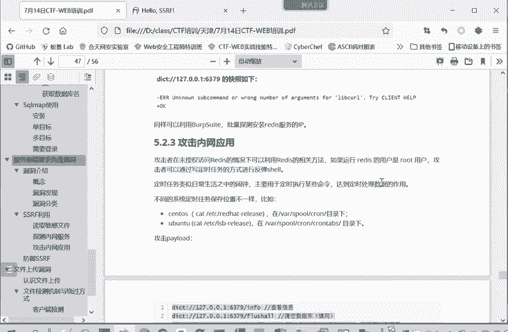

把它向发送到我们。这个测试者或者说一些攻击者控制的机器人，通过这样的方式获取系，这就是一个定时任务的作用。然后定时任务系它保存的位置不一样。在不同系统上，在snow中呢。

就在这个里面有般图啊是在这cme tap。

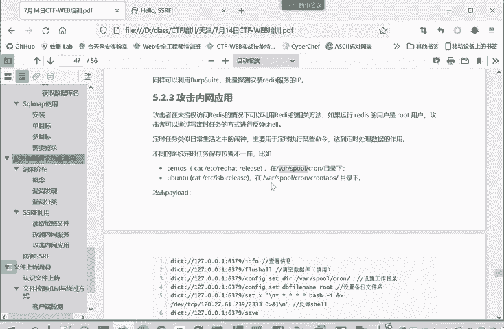

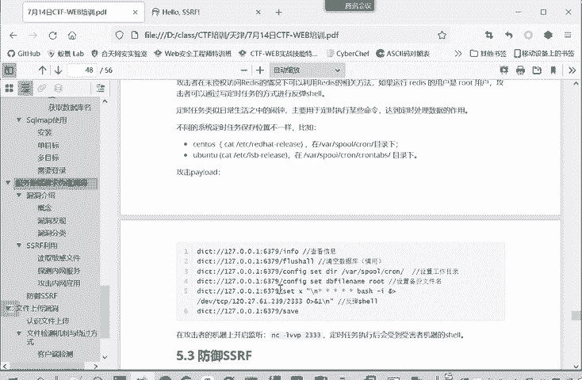

我们这个应该就是sintelS。我们刚才的显示信息里面有没有？我记得就是s态5S的，我们可以先试一下。

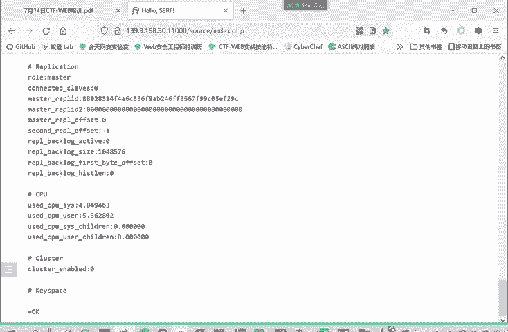

那么我们把这个设置工作目录的命令给复制过来。OKO就直行整握，就是设置的工作mod录。我们后面的操作呢都是在。这个目录下veport cross这个目录下进行了操作。然后我们设置一个备份的文件名。

我们在里面要写入一个历时任务嘛，就要先创造一个文件名。你写定生务那任务的文件名是什么？我们输进去。然后进行。再设置在往文件名里面输入一个内容，内容是什么？这个杠N就是每秒每秒应该是每分钟还是每秒。

他就会执行一个be杠I到。我们这个IP里面。这是我们自己的1个VPS这个端口像这个IP这个端口发送通过TCP协议发送bach。这是一个反弹的命令。我们先把这个命令写进去。这个命字应该是这样。

我们把这个命令写进去。进入成功了。然后呢，再保存一下sve。特别成功了。那我们就在。

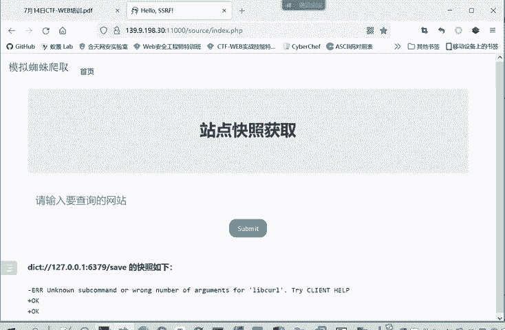

这个120。27。61这个期象开启一个监梯。

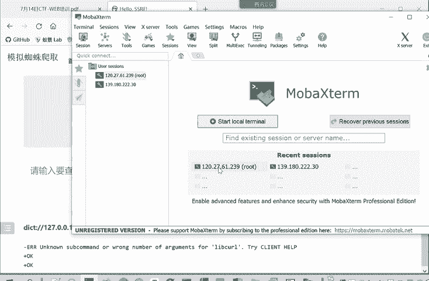

那你写了在工具要阶下开启监梯。端口呢是我们刚才设置的这个端口保持一致。2333。那个定时任务执行呢，我们这里就能够收到这个信。现在他就监听着。那么们这里就让他监听着，我们。等会再看监他监听的一个。结果。

😊，那么如何防御这个SSIF漏洞呢？这里给大家几点建议。因为服务器请求是来源于业务本身正常功能。这个你不能把这个请求直接关了，那业务不做了，把网线完了，这样来防御肯定是不行的。

他存在问题就是因为有人都在坏心思，而伪造了这个夫妻的请求。因此，主要防运手段呢，第一个白名单，设置用户提交的URL白名单。

就是不会允许你用户就是让我服务器去请求任意的UIL或者请求指定的URL白名单一个协议限制。只允许请求什么HTPSHTPS这种请求，避免使用fileFTP这文件传输协议和dick的这种查询信息的协议。

第三点呢就是过滤返回信息，针对服务端返回的信息进行过滤。尽量做到无回险，那别人就不好利用了。我们刚才也没讲无回险，你漏洞利用那种漏洞就很鸡肋，很难利用。然后。最好是无线，或者说是统一错误信息。

只显示这种固定的。错误，那就使得这个SSIF事实上成为一个无回险的类型。哎，你看我们这里就已经收到了目标的项，是不是？我们本来用户是root。我们的机器名字CTF可H选。然后我们这里监听监听到了最后。

对方发起连接了。那么就获选对方的小对方的用户名也输入它。对方机器的名称呢是这段代码。那么。这样就实现了一个对内网机器的一个攻击。这里只是演示一下，并不是要真的攻击这个机器。嗯。😊。

那我们就是现在上课也一个小时了，我们还是先休息一个小时。