# 2024年最强Kali渗透教程／网络安全／kali破解／web安全／渗透测试／黑客教程 ／代码审计／DDoS攻击／漏洞挖掘／CTF - P7：1.linux_环境准备 - 网络安全系统教学合集 - BV1Pe411C7Zb

同学们，欢迎来到由我们一进网，然后开设的linux基础课程。那我是今天的一个授获讲师一夜。然后为什么我们要用到这一个linux基础呢？其实对于现在这一些服务器来说的话。

很多都是基于linux然后搭建的一些微博服务，或者说数据库啊，mys狗等这一些基本的FTP服务啊等这一些基本的服务，都是使用的linuxlin的一个服务器搭建的。所以说而且我们使用到的攻击机器。

卡里也是基于linux内核，然后去进行一个开发的。所以啊对于linux一个基础，是我们必须要去进行一个掌握的。比如说它的基础命令，还有该怎么去搭建对应的一些服务，还有对应的一些把手环境。

该怎么去进行搭建。那这也都是我们需要学习的。所以说啊这个课程是大家来了解linux的一些基本命令和它的一些使用方式，还有微默虚拟机的一个搭建。机器的一个步骤都是在这里，我会为大家去进行一个讲解。

那可以看到今天我们这节课所要讲解的一个知识点内容啊，也就是安装we mobileware和对应的通过wemobilware搭建摄头VS7的一个机器。

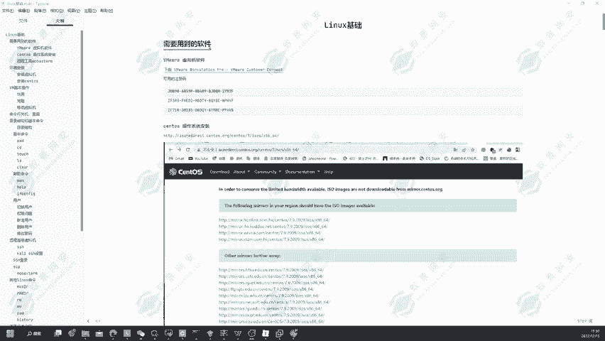

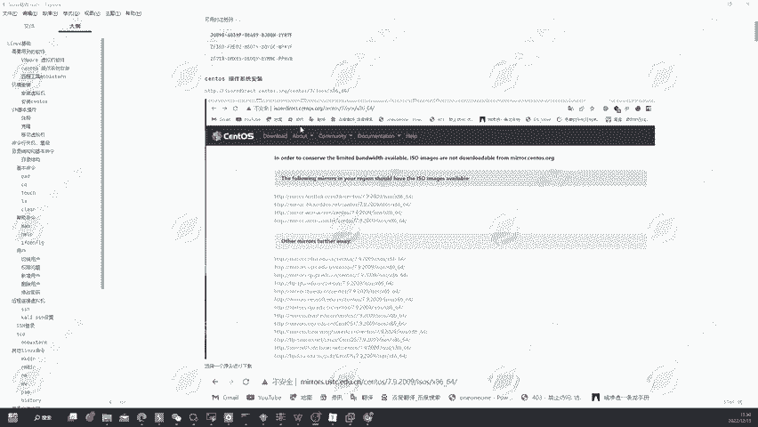

可以看到我们首先需要去安装ware的话，我们就要去它的官网下载它的一个虚拟机。

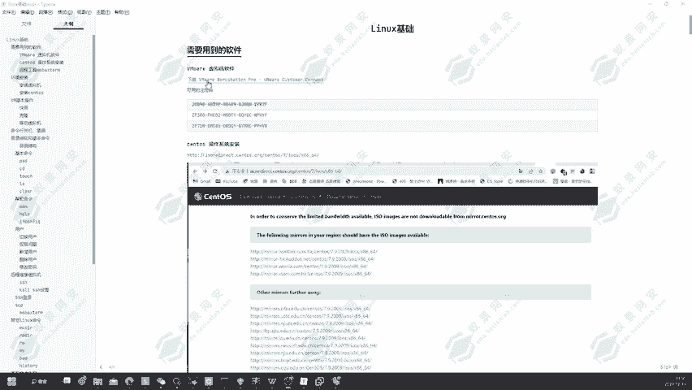

那下面我们在这里带大家打开一下它的一个官网。

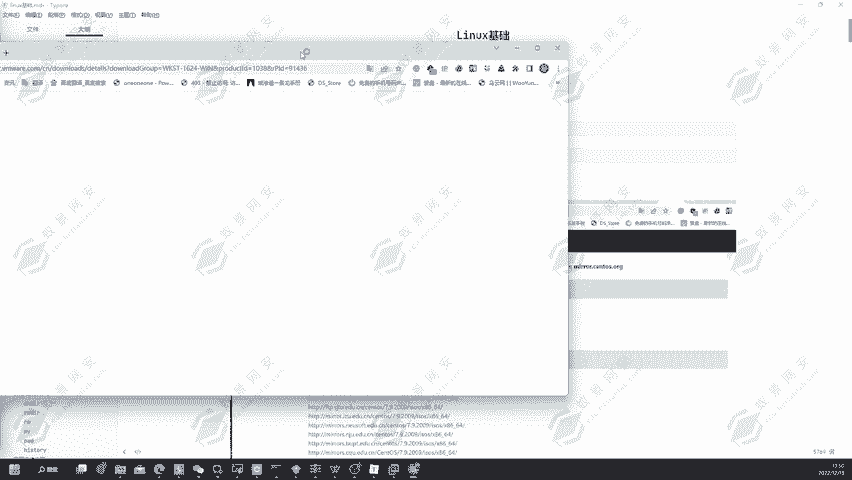

可以看到这里有它的一个下载版本，但是啊这个微末它现在已经是出到了17的一个版本了。那这个16的版本啊现在是。安装的话，我们要安装的是微模的一个试用版，免费试用版，然后去到它的官网去进行一个下载安装。

那打开完成之后可以看到这里有一个download的，就是下载微模17的一个版本。

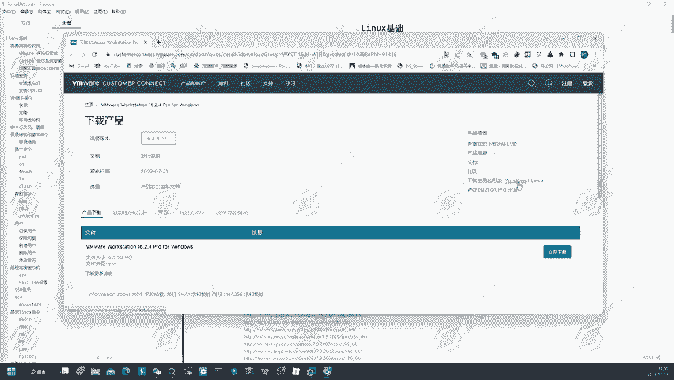

🤧H。可以看到点击下载，这里就会去出现一个正在下载的一个地方。然后我们点击保留就可以下载成功了。那下载成功之后啊。我们还需要下载一个东西，叫做。渗透S7的一个镜像文件。

我们可以看到渗透S7的一个操作系统。然后首先我们同样的按住这一个。链接，然后点击去进行一个打开。

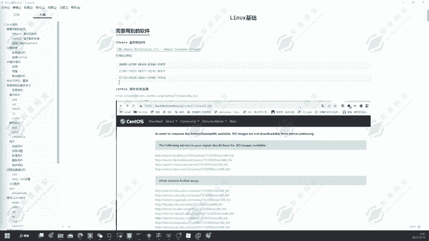

打开完成之后会出现这样的一个网站，然后我们选择自己要下载的一个地址。那这里的话我就选择第二个。

然后点击下载这里也可以看到它又会跳转到一个文件下载的一个服务器。然后在这里它有不同的一个版本，有渗透S764位的DVD2009的1个IOSG像文件，还有对应的可以看到20。2207的1个版本。

那这里啊我们就选择DVD，然后2009的一个版本。选择这个版本，然后我们去进行一个下载，然后点击它就会在这里去进行一个下载。那我们稍等。这里的话我这之前是已经下载好了的。

所以说啊这边就不再去进行下再一次的下载。可以看到在我的这一个文件夹里面是已经下载好了we mobile和对应的一个生度S7的一个镜像文件。那这一些是刚才没有下载完成的那我们给它删除掉。啊。

因为是在我的一个浏览器里面已经去进行打开了，所以说无法删除。大家可以看到在这里。光盘影响文件IO的一个文件，还有对应的winware的一个文件都是在这里已经下载好了。

那下面我们就要开始对它去进行一个安装。好，我们把浏览器关闭，然后点击这一个O where，然后去进行一个安装。可以看到。它这边会弹出一个微博产品的一个安装。那我们稍微等待一下，等待它的一个弹起。

这里就有关乎于大家的一个电脑性能的。如果说大家电脑性能够好的话，它会立马的。

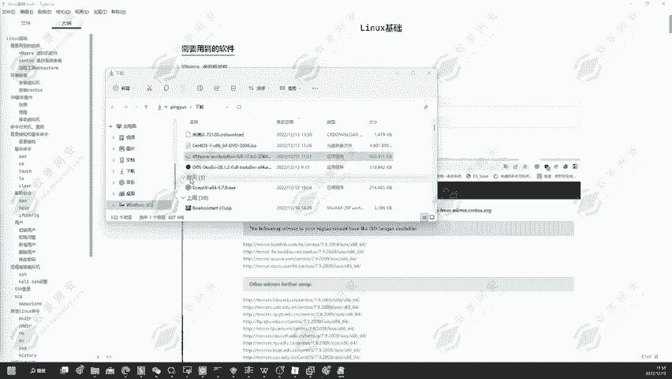

可以看到，那下面我们就点击下一步。然后我们点击下一步，可以看到它这边让我接受许可证，然后我们点击接受，然后再点击下一步，可以看到这里有对应的一个安装位置。那这个安装位置啊，我们可以去进行一个更改。

默认是C盘。但是我这里是因为之前已经安装过了，所以说它是在D盘。那下面我还是要对它去进行一个更改，改成哪里呢？我们要改到C盘的一个根目录，然后点击确定可以看到它就会安装到你的一个根目录。

但是啊在这里的话，我们推荐大家在这里先创建一个文件夹。首先我们在D盘这里先创建一个文件夹，叫做微 more尔。当然这里也可以选择默认安装，默认安装的话就会安装到C盘。

那这里就取决于大家的一个C盘大小空间了。好，我们就给它取名为微 more。然后在这里我们找到微默的这一个安装包，它的一个目录。好，点击确定可以看到它的安装目录就会选择为D盘的一个微末。

然后我们点击下一步，可以看到它这边就会去进行一个安装。点击升级，因为我这里是有一台vi默16的一个机器。所以说啊我现在点击的话，它是一个升级，那等待它的一个安装，那这边我先暂停一下。好。

可以看到它现在已经正在进行一个验证安装了，等待它的一个安装完成。好的，稍微等待一下，这里安装的时间可能有点久。

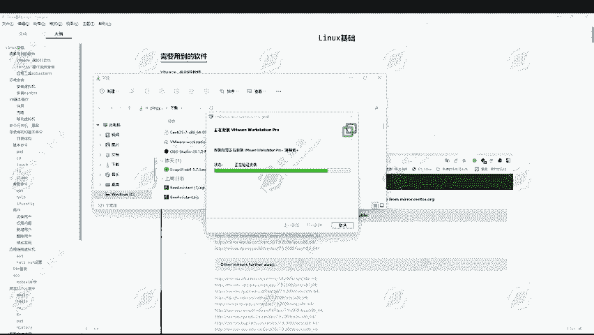

在我们安装这一个微vo的时候啊，如果说大家是有旧版的话，我们现在可以直接安装，它会自动的去继续升级。而且安装微vo的话，它会帮你安装虚拟网卡的一个驱动，所以说啊会耗费的一个时间比较久。那没关系。

我们耐心等待一下即可。好的，可以看到我们已经安装完成了。大家可以看到它这边让我立即输入许可证密钥，然后才可以去进行一个使用。但是我们可以暂时的不去进行输入，我们点击完成。点击完成之后。

在我们的桌面下就会生成一个叫做微末的一个。快捷启动。然后我们点击去进行一个启动就可以了。它会创建一个快捷方式啊。可以看到点击完成之后啊，它这边会出现一个需要我们输入到许可证密钥。

那这里许可证密钥在我们这里是已经给到大家了的，在文档里面是已经给到大家了的。然后我们只需要复制粘贴上去，然后点击继续。可以看到它这边就会出现一个感谢购买，祝你许使用愉快。

那就证明我们已经激活成功了那下面我们就可以去进行一个。下面我们就可以去进行一个使用了。嗯。😊，稍微等待一下，我的电脑好像卡住了。

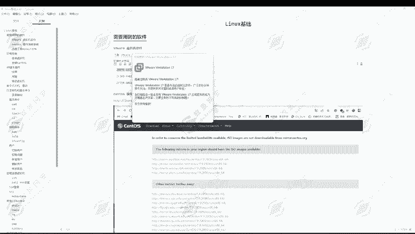

好，我们再次打开就可以去进行一个使用了。

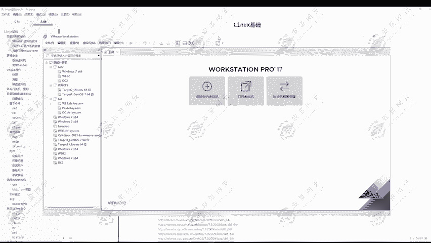

然后下面我们要安装一个可以看到下面我们就要安装一下，我们是在这里需要用到的一些工具。比如说这一个远程工具，这个远程工具啊可以帮助我们去进行一个远程管理。我们的一个深度S7。

或者说大家后续安装的一个卡点啊，都可以在这上面去进行一个管理。所以说啊这是我们必须要去使用到的一些工具，我们就去进行一个下载安装。同样的点击打开。

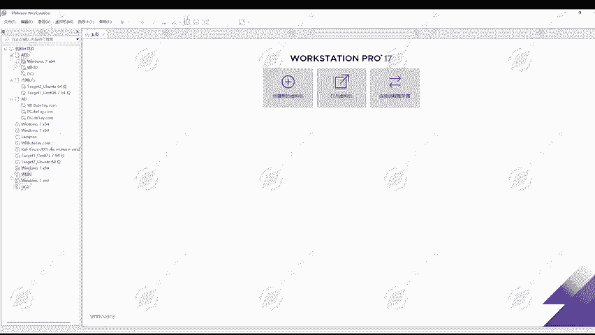

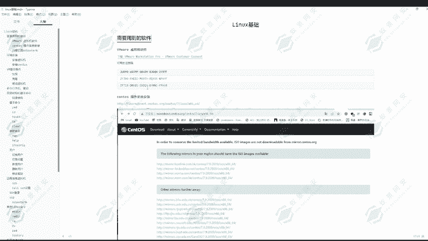

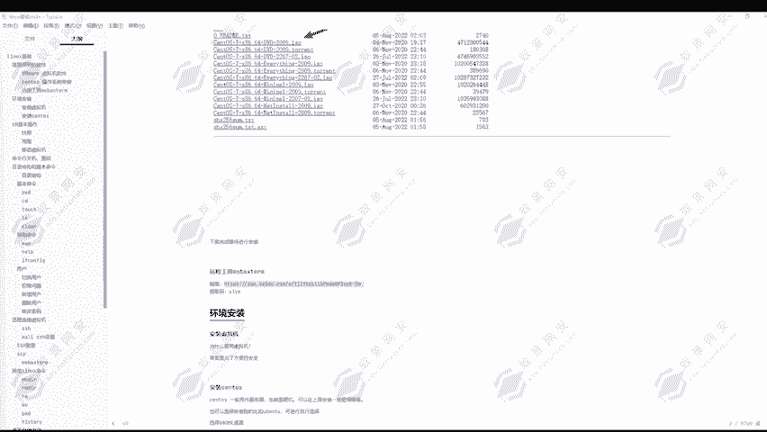

然后我们去进行一个下载。好，等到它的一个下载完成。

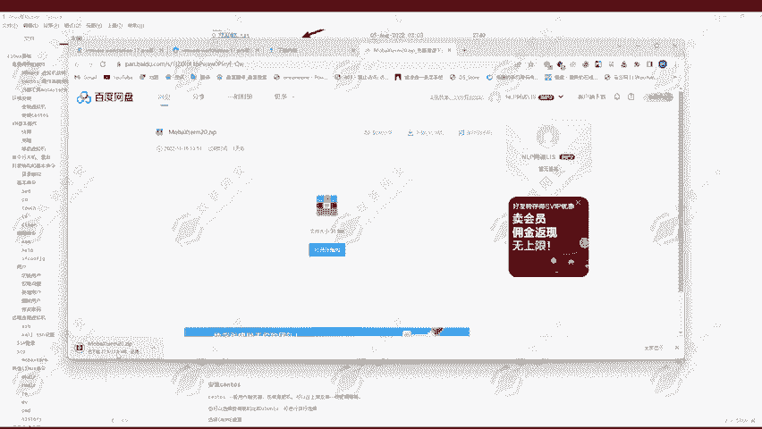

好，下节课的话就告诉大家该怎么去安装到神透S7。那我们这节课就。先到这里，我们下一节课再继续为大家去讲解怎么去通过看微末去安装到圣图S7。

