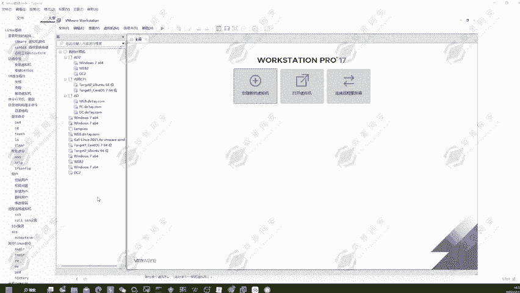
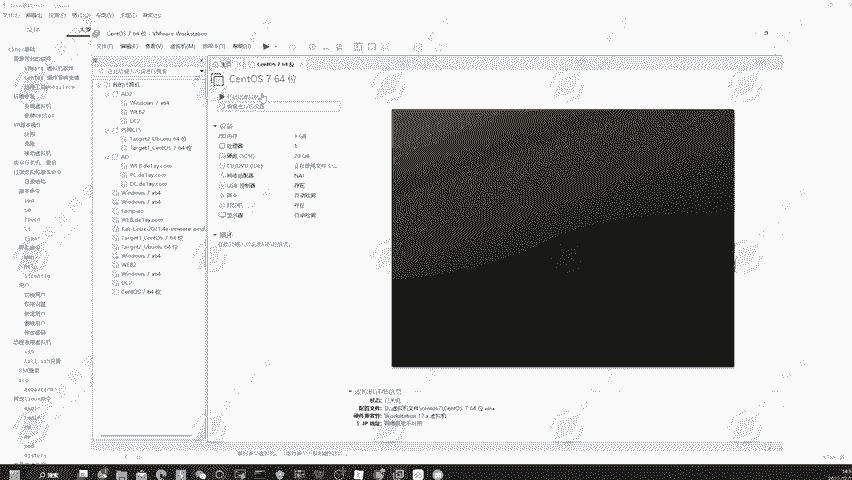
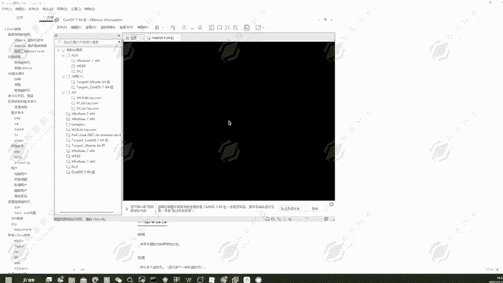
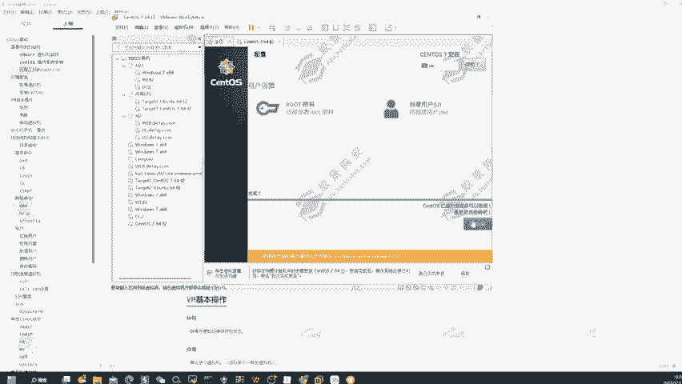
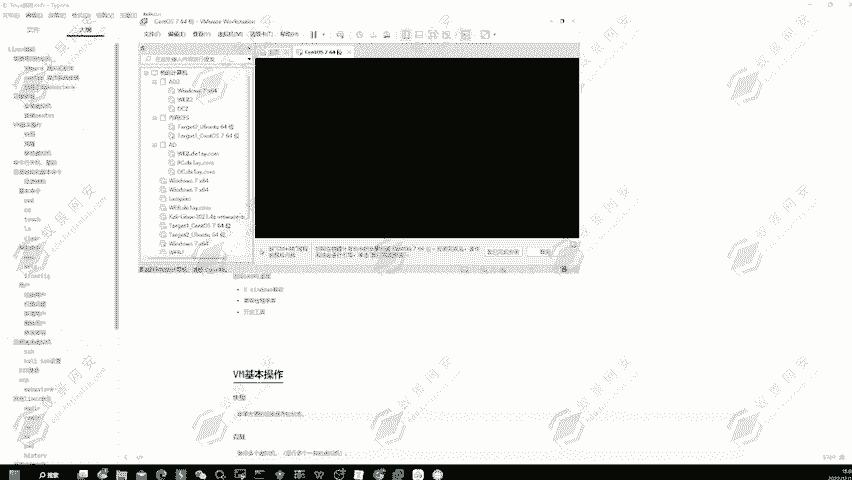
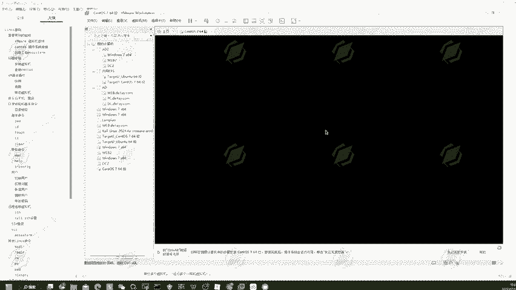
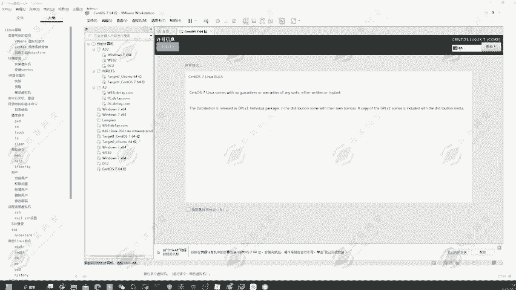
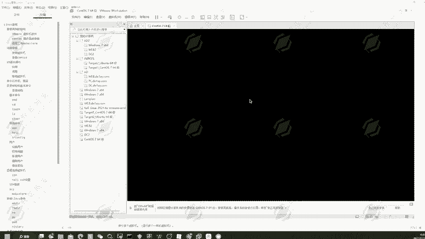
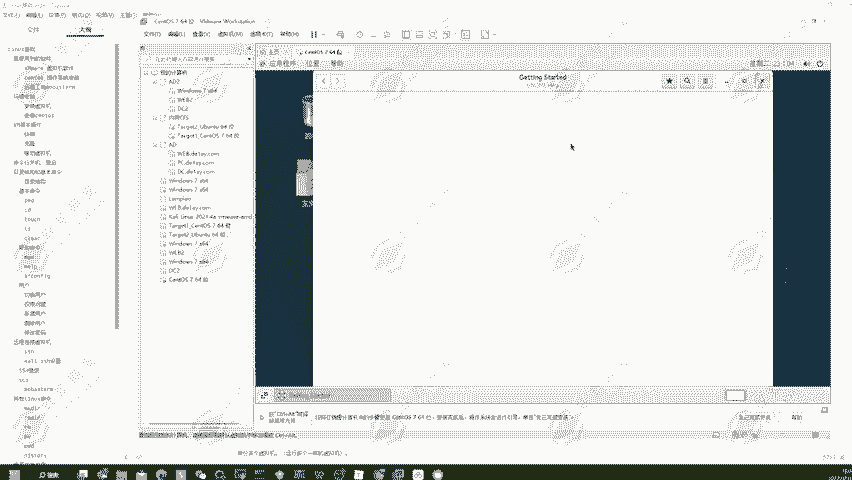

# 2024年最强Kali渗透教程／网络安全／kali破解／web安全／渗透测试／黑客教程 ／代码审计／DDoS攻击／漏洞挖掘／CTF - P8：2.centos7安装使用 - 网络安全系统教学合集 - BV1Pe411C7Zb

好的，我们开始第二天第二节课的一个讲解，我是大家的一个授课老师一叶。可以看到我们在上节课已经把基本的一个微末和神透S7的一个镜像文件已经下载安装完成了。那这一节课就带大家来安装到生透S7的一个镜像文件。

把它安装成一个操作系统。那为什么我们要使用到虚拟机来安装这一个操作系统呢。其实啊就是为了我们的一个方便，而且是安全性的一个问题考虑。因为我们在使用到这一个虚拟机的时候啊，其实我们在使用到虚拟机的时候。

我们是为了去搭建一些靶场环境，去搭建一些服务。那这一些靶场环境很明显是有漏洞存在的那既然有漏洞存在，如果说我们用自己的本地机器去进行一个搭建的话，那很明显是会被别人去进行一个攻击。

那别人攻击完成之后是可以拿到我本地机器的一个权限。那我所有的一个隐私，我所有的一个私密文件全部会别人去进行一个读取。所以说啊我们使用到虚拟机去进行一个搭建的话，可以保证我们物理机的一个安全。

因为它是使用的虚拟机的一个结构。所以说啊是可以保证我们物理机的一个安全。就算虚拟机被别人攻击拿到了权限，它也无法移动到我的一个物理机上面去。而且使用到虚拟机也是比较方便的。因为虚拟机啊。

它是作为文件形式存储在我们的一个硬盘空间上面去的那我们要去进行一个移动的话，我们直接把这一个文件去进行一个打包。打包完成之后，我给它移动到我的一个U盘，或者说移动到我的一个移动硬盘上面。

那我就可以随身携带。我想要在哪台电脑上面去安装这台虚拟机去使用到这台虚拟机都是可以直接化的去进行一个操作。因为在工作中啊，可能有一些公司，它不允许你使用到自己的电脑去进行一个测试。

它会用到公司提供的一个内网主机来供我们去进行一个使用。那这个时候我不可能说每用一次，我就把我所有的工具啊，所有的一个环境啊全部在那台电脑上面去进行一个安装吧。很明显这样又费时间，而且又不方便。

那我如果说我们使用到这个虚拟机去进行一个生活测试呢。只用到这个虚拟机去进行一个工作呢。那这个时候的话，我们就可以在虚拟机上面安装好自己所谓的一个环境，然后把所有的东西全部放到虚拟机里面去。

那这个时候我们只需要在公司。提供的电脑上面安装一台微末，安装一个微末软件，然后我再次把我的一个U盘插入进去，或者说我的一个移动硬盘插入进去，点击打开就可以进行一个简单化的使用了。所以说啊使用到虚拟机啊。

是可以帮助我们去提高自己的一个便捷性的。而且。我们自己电脑上面我们在做这一些测试，或者说我们在做工作的一个途中啊，会用到很多的一些虚拟机环节。比如说一台win10，1个windows server。

一个linux机器，一个渗透S一个优ber一个卡里，那这么多的一个操作系统。我们一台物理机怎么可能安装的过来，怎么可能去安装到这么多台系统呢。所以说啊借助到虚拟机这一个软件。

我们就可以同时的去运行多个不同的操作系统，可以供我们去进行使用。那下面我就告诉大家，该怎么通过微vo虚拟机去安装一个操作系统。那这里我们就使用到渗透S为大家去进行一个演示。

可以看到渗透S它一般是用作服务器，也就是靶机可以在上面安装一些靶铲，或者说安装一些服务等这一些东西。也可以选择安装别的，比如说优波 two，还有卡y，那这里都是根据大家自行的去进行一选择安装。好的。

那下面我们开始安装，打开我们的卡，打开我们的微m，然后点击创建虚拟机，然后选择典型，点击下一步，然后选择这一个稍后安装操作系统。然后在这里我们选择linux，然后找到生透S764位的一个操作系统。

然后点击下一步。然后虚拟机名字我们不需要更改。那安装的一个位置啊，我们推荐大家安装在第一排，然后取一个文件，也就是这一个取一个文件夹的名字。我们在这里创建的一个叫做虚拟机文件的一个文件夹。

这个文件夹是我自己在。这个文件夹是我自己在我的一个目录上面去进行一个创建的。可以看到是我自己在这里面去进行创建的。我们打开D盘，然后点击右击，然后点击新建，新建一个文件夹叫做虚拟机文件。

然后在这个虚拟机文件里面，我们再去点击进入，然后点击新建，再新建一个文件夹，叫做渗透S7。然后回去。这一个文件创建完成之后，我们点击进入，可以看到这边会生成一个渗透S7的文件夹，点击选择，然后下一步。

然后在这里我们可以选择将虚拟磁盘储存为单个文件，然后再点击下一步，然后点击完成。那这样我们的一个空壳，一个渗透S7的一个壳，就已经安装完成了。然后我们要对它去安装到对应的一些。

可视化界面啊，还有我们可以执行命令的一个环境啊。那这个时候的话我们就要去选择它的1个SO印象文件了那这个印象文件也就是我们上一节课下载好的这1个DVD的IOS镜像。

然后选择确定在这里我们就可以看到点击启动，在这里我们就可以去进行一个安装了。

好，我们选择第一个。稍微等待一下，因为它的个安装还是比较的时间还是比较久的，我们稍微等待一下。

可以看到它跳转到了这一个选择语言的一个地方，然后我们肯定要选择自己能够看懂的那我们就选择中文，然后简体中文点击继续。那在这里啊我们可以看到。有一个软件选择，那我们肯定不选择这个最小安装。

最小安装它只有基本的一些功能，那肯定是不满足我们的一个使用的那在这里啊我们要选择这一个G内。桌面在这里的话，我们再选择这一个叉windows的一个系统兼容性，还有对应的开发工具。

还有可以看到在这里我也是为大家列举出来的。兼容性存序库。好，我们选择这三个，然后点击去进行一个完成。然后在这里我们可以看到它要我选择安装位置。那我这里就不知道怎么分盘，我也不想给它添加磁盘。

我就点击完成，可以看到就已经可以了。那这个时候我们再点击开始安装。那安装这里啊，我们可以看到它这边让我选择一个root密码，那我们就给它创建一个root密码。root密码，我们创建为123456。

然后确认123456，点击完成，可以看到我点击第一次，它告诉我密码过于简单，未通过字典检查。但是我们现在这个权限是在安装一台操作系统。所以说啊我想给它设置什么密码，我肯定就能设置，我们再次点击完成。

可以看到就已经设置成功了。然后你想在使用的时候不使用到root用户。那在这里我们可以创建一个用户叫做一页。当然这个用户名啊大家可以随意自己创建，然后密码我们就选择123456。同样的确认密码。

123456，然后点击完成，可以看到点击一次还是显示的密码过于简单。那我们再点击一次，可以看到就已经可以选择完成了。然后在这里啊，它需要去安装到这一些软件，还有这些工具啊是比较久的那我们这边先暂停一下。

等待它的一个安装完成。好，可以看到已经安装完成了。那我们点击重启。

好，重启完成之后，我们在这里回车。

OK以看到它这里提示我没有接受许可证。那这里我同意许可协议，然后点击完成。

完成配置。好，可以看到我们就可以去正常的使用到圣透S7了。然后我们选择一夜用户输入密码，123456，点击回车。

可以看到我们就已经打开了顺透S7的一个桌面。好，这就是我们这节课为大家去演示到的，使用到生通S7的一个。好，这里我们选择到对应的一个点击前进，点击跳过好，就可以开始正常的使用了。好。

这就是我们为大家演示的这一个生活S7的一个环境安装。那现在我们。

好，那我们就这节课就已经结束了。