# 2024年最强Kali渗透教程／网络安全／kali破解／web安全／渗透测试／黑客教程 ／代码审计／DDoS攻击／漏洞挖掘／CTF - P9：3.VMware_基本操作 - 网络安全系统教学合集 - BV1Pe411C7Zb

好的，现在开始我们。第三节课的一个内容，微末虚拟机的一个基本操作，可以看到快照功能可以非常方便的切换保存状态。那这个快照功能有什么作用呢？我们可以看到在这里我们点击右击，然后在这里可以看到有一个快照。

那我们可以点击拍摄快照。首先我们先给它拍摄一个快照。那描述的话，我们就描述为初始状态。然后对他去进行一个拍摄快照。然后拍摄完快照可以看到它这边正在显示正在保存状态，45%、46%，等待它的一个保存完成。

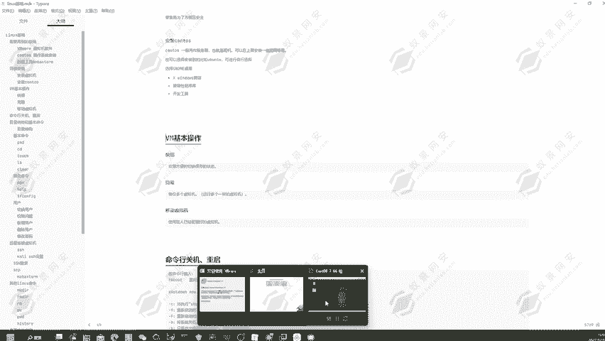

好，提安到它已经快要保存完成了。在这里啊可以看到它的一个进度条，88%、89%已经快要完成了。我们现在在它刚安装完成之后给它保存的一个初始状态。然后我们对这一个系统去进行一个更改。好的。

现在我在这里新建一个文件夹，文件名字叫做E。好，点击创建。可以看到屏幕上多出了一个一页这一个文件夹。那现在我再对它去进行一个拍摄快照。为快状2，然后描述为一页。

这个快照它的一个功能就相当于我们玩一些单机游戏一样的，它就属于一种存档功能。比如说我刚才是在初始状态，然后保存了一个快照。那如果说我要去读档呢，我就点击刚才拍摄的一个快照一。

就它就会恢复到初始的一个状态。然后。我要想回到创建好一页这一个目录的这一个状态呢，我就选择拍照，我们就选择拍摄好的快照2，点击快照2，我就可以切换到一页。有当前一页这个目录的一个快照。

也就是这一个存档的一个地方。这里啊就可以方便我们知道对这个系统可能要造成破坏性的一个操作的时候，我就事先对它去进行一个拍摄快照。然后我执行命令之后啊，它可能会导致系统崩溃嘛。然后如果说系统崩溃了。

我恢复快照就可以了，就可以帮助我们的一个存档性啊，就可以帮助我们可以随时的去进行一个恶意操作，或者说破坏性的操作啊，可以保证我们的系统不会损坏，不会出现问题，导致无法使用。好。

现在我们可以看到快照管理器。这里。有一个快照一，有一个快照2，有一个当前位置。那可以看到快照一这里，我们现在转到快照一。可看到一页文件夹它已经没了。这是我们刚才没有创建一页快文件夹的那一个时候。

它就已经回复到当前的。刚才我们没有创建一页文件夹的那个时候了，也就是我们刚刚安装好的一个时候。然后现在我要想给它回到呢，可以看到我们点击快照2。

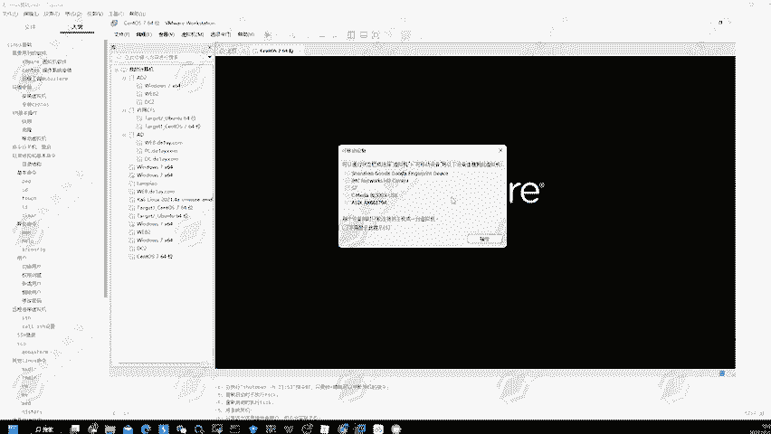

可到E文件夹就已经出现了，这样就可以帮助我们去在要执行一些危险操作的时候，可以帮助我们去进行一个回档的一个操作。而且我们要注意到，在这里它其实是有一个快照节点的。可以看到我现在在快照一这里。

我先给它切换为快照一。

然后现在我要对它去进行一些操作。比如说我要在这里创建一个文件夹，叫做一页。一页一。然后给他去进行一个创建，然后再对它去进行拍摄快照。稍微等待一下，他自己拍摄拍照是需要一定的一个时间。好，稍微等待一下。

然后我们可以看到这里的一个快照管理器，这里就会出现一个快照3。那我当前所在的位置是不是在快照三这里，它又会出现一个节点。因为我们的快照三啊，也就是我这个一页一这一个目录，它其实是创建在快照一它之上的。

它就会在这里分出一个节点。然后我现在正在使用快照三的这个位置，它就会显示在当前位置，就在快照快照三这里。然后如果说我又要在快照三这里再创建一个文件，然后再去使用到一个再去创建一个文件呢，那这个时候的话。

我再去拍摄一个快照，它这边又会出现一个节点。快照4，这就是它的一个快照功能，那现在我要回到创建好的一页目录这里，那可以看到它就会又会回到一页这个目录这里。

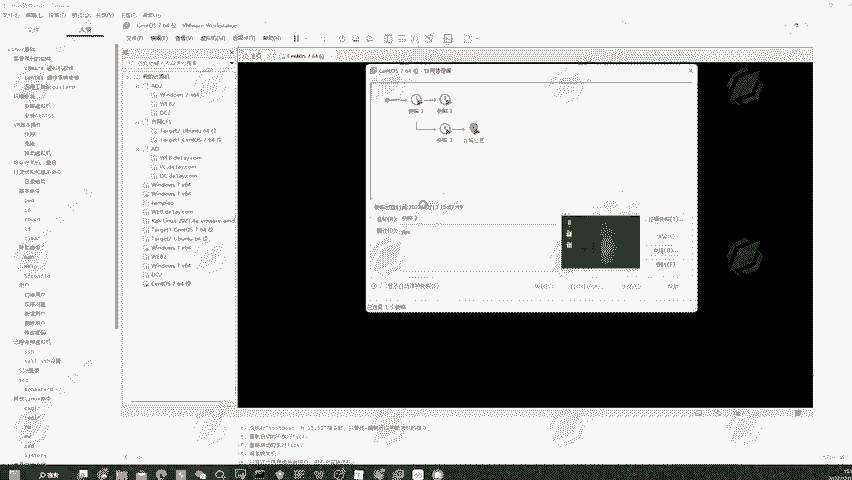

可以看到这里就又有了一页这个目录，这就是它的一个快照功能，可以帮助我们去进行一个存档。然后我们可以去读档。让我们来看到它还有一个克隆功能，备份多个虚拟机，运行多个一样的一个操作系统。

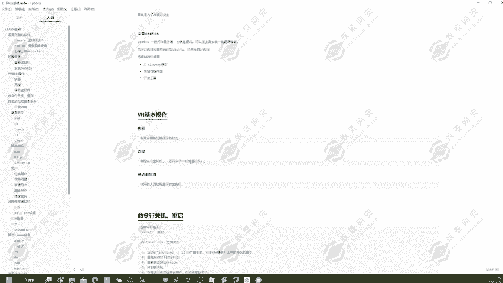

那在这里我们可以点击，然后右击。可以看到这里有管理，然后有克隆，那我们就可以点击克隆啊，因为它是没有挂起的一个状态，所以说无法克隆。那我们现在可以对它去进行一个挂起，然后点击管理，然后再点击克隆。好。

它是要处于关机的一个状态才可以去使用啊。那我们现在对它去进行关机。关闭虚拟机。只有关机之后才可以去进行一个克隆，然后点击右击管理，然后克隆。可以看到点击下一步。虚拟中的虚拟机制的一个当前快照。

从从当前状态，然后去创建一个新的快照。好，然后创建链接可轮，创建完整完整的一个可轮啊。那这个的话就等于是创建了它的一个链接，它使用的一个文件，或者说它的一个。储存的一个地方其实是一个。

那如果说我要创建一个完整的功能呢，它就等于是完全独立的创建了一台操作系统。这个链接功能啊，它只是说把它当做了一个软链接，然后重新启动了一台机器。那肯定我们要去执行操作的话，肯定是选择这一个完整可能。

点击下一步，可以看到它要我选择一个储存的位置。那同样的我选择这一个。我创建好了虚拟机文件的这个目录。然后在这里我们再创建一个目录，叫做圣透S7。7、然后杠2-一吧。而点击确定。刚才没有保存这个文件好。

点击确定，然后点击完成，可以看到它正在克隆中。稍微等了一下，等他的一个克隆完成啊，可以看到已经克隆完成了。那在这里也可以看到它会出现一个生通S7的一个克隆程序。然后我们点击运行。

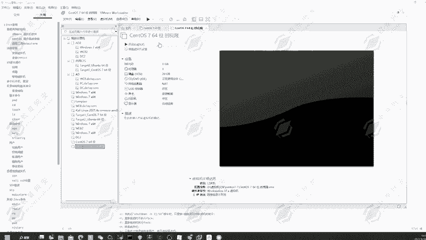

它就又是一台可以进行一个使用的神通S7的一个操作系统。可以帮助我们方便的快速创建两个相同的一个操作系统。

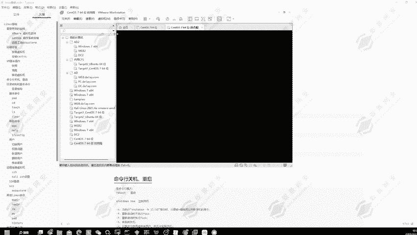

这就是它的一个克隆功能。

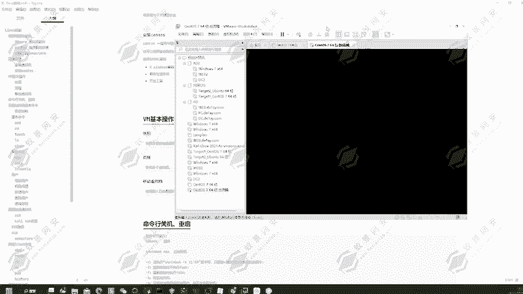

可以看到同样的一夜用户。密码也是同样的，123456点击确定。可以看到就已经登录进来了，这是它第二个功能，就是能够帮助我们去进行一个克隆，快速的搭建两个相同的一个虚拟机。然后第三个功能可以移动虚拟机。

那什么是移动虚拟机呢？这里啊其实我们可以用到我在。嗯。😊，这里可以用到我在我的一个。移动硬盘上面，然后去使用到的这一些虚拟机文件，可以看到这是我的一个移动硬盘。然后在这里面我安装了对应的cardy。

那现在我在这里要去运行一下卡里操作系统的话，我就可以直接的使用的这一台虚拟机可以看到，然后点击文件。然后打开。然后选择我的一个E盘，也就是我的这一个移动硬盘，然后选择我的一台卡里。然后点击打开。

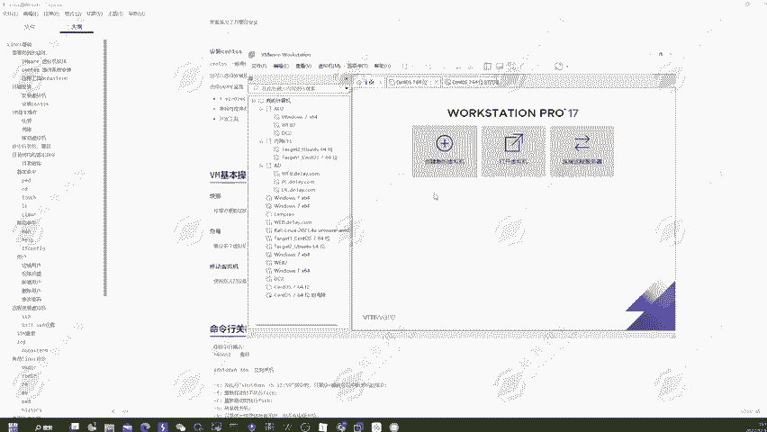

可以看到我的卡里虚拟机就可以去进行一个正常的使用了。因为在我们安装好了这一台虚拟机啊，可以看到我的开启虚拟机就可以去正常的使用了。因为在我们安装好的这一个虚拟机的话，其实啊。

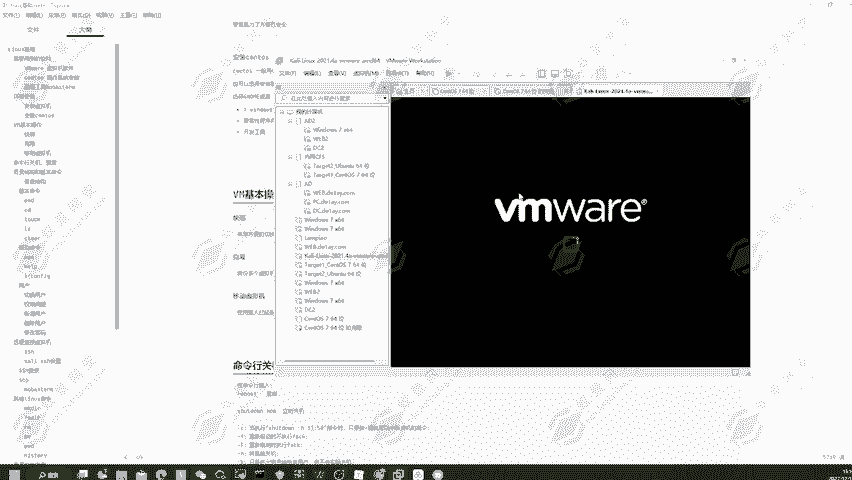

他在他的一个目录，他其实就是在目录里面创建了很多的一个文件来维持这一个虚拟机的一个运作。可以看到生动S7这里，然后我们要去进行一个运行的话，我们要去对它去进行一个打包的话，我们只需要在这里点击右击。

然后给它去进行压缩为VIP文件。我们给它去进行压缩，然后它就会生成一个压缩包文件，然后我们再对它去进行一个解压。我这边的压缩还没有完成，哎，它肯定是需要一点时间的。所以说我这边就看一下它这里。好。

有点慢，那我们就不管。那我们可以在这里选择ct加C复制，然后再ct加V粘贴一个。稍微等待一下。我们看住加微再粘贴一个，然后现在我们点击这个副本，然后我们点击这一个文件。

然后选择我们的一个微末去进行一个打开。我们这个微末是安装在我们的D盘，然后。回默默录下。好，选择它去进行一个打开。可以看到它就会又会打开一台叫做生透S7的1个64位的操作系统。

那这里如果说我使用的是别人安装好的一个文件，然后去打包发给我，我再去进行解压，其实是一样的一个效果，它就会生成这么一个文件。

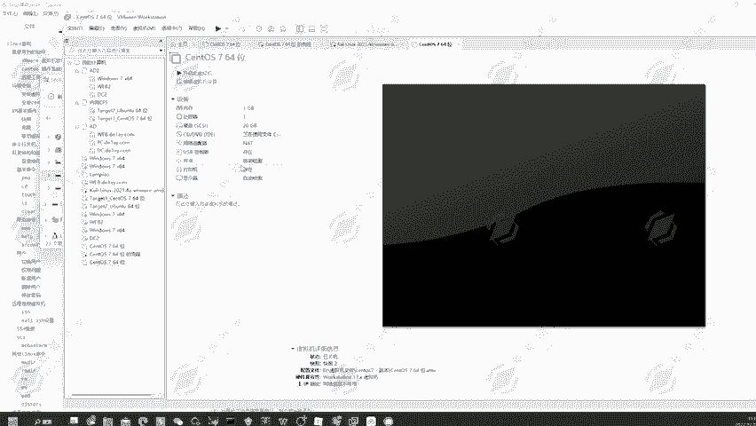

然后我们直接可以去进行使用，这是它的一个方便性。那下面我们就把这个给它删除掉。好的。那下节课告诉大家，就是它的一个基本命令该如何使用。那这节课就到这里。

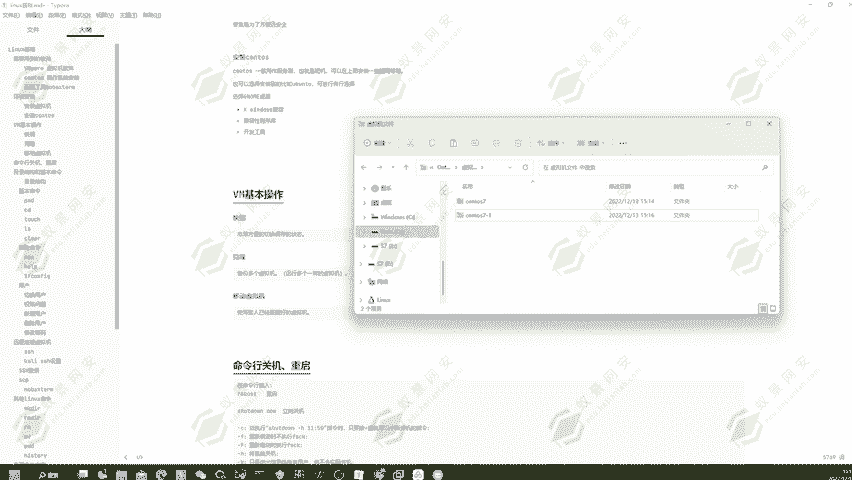