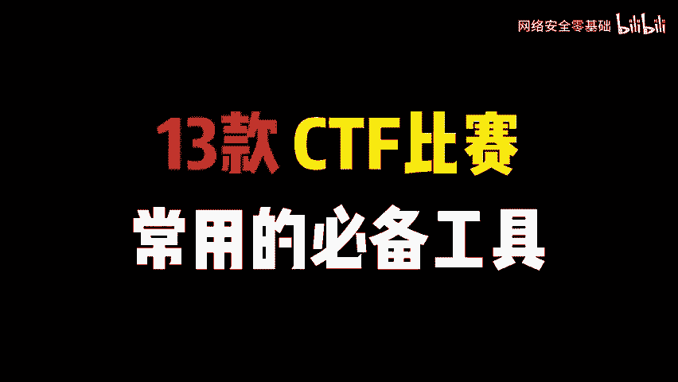
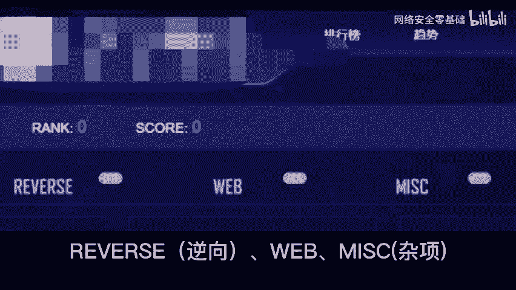
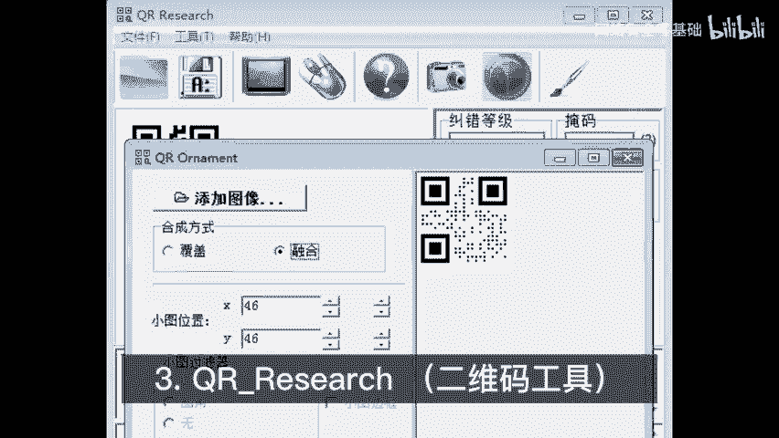
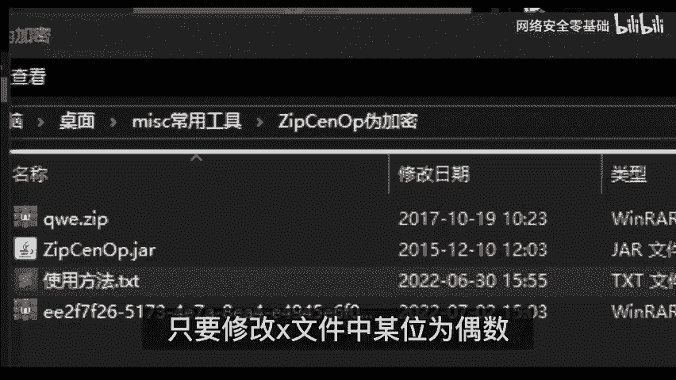
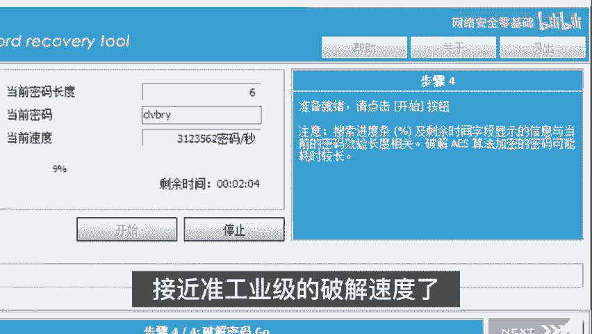
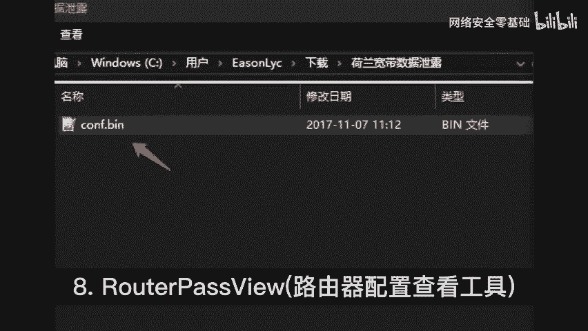
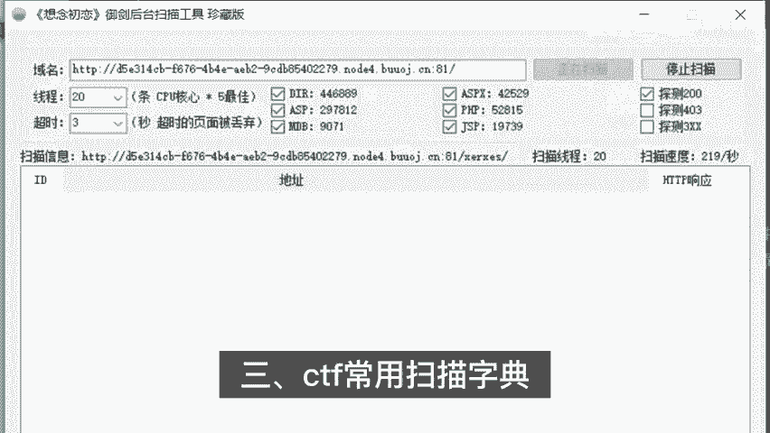

# 2024年网络安全CTF全套教程（CTF比赛必备常用工具，CTF零基础入门学习路线，CTF核心真题解析、CTF综合测试训练、项目实战解析） - P1：CTF必备工具 - 网络安全零基础 - BV1SN4113784

🎼评论可免费领取网络安全资料，给大家分享13款CTF比赛常用的必备工具，主要包括六大类工具。

🎼解密miss杂常用miss杂项类工具包含提取莫斯密码辅助工具，把音频文件拖进这个软件摩斯密码就出来了el图片音写分析工具选中可疑图片打开利用4个功能查看图片中隐藏的各种信息。

二维码工具选取工具中截图查看二维码验证是否为为加密工具，如果设为加密压缩包，只要修改X文件中某位为偶数即可无密码打开密码破解工具L压缩包是加密的打不开。

使用此工具轻松破解密码破解工具使用方式与上面的软件类似。不过这个速度更快接近准工业级的破解速度序查看调试工具使用很简单，将伪加密压缩包拖进这个文件修改X改为偶数即可破解加密防护由器配置查看工具。

🎼专门查看某些品牌路由器配置文件的工具。2、常用维尔斯逆向类工具包含一盘的软件版本和是否有个2ad64位，如文件是64位，那就要用64位打开3ad32位操作与上述相同。

无论是32位还是64位的软件都集成了伪代码功能，可放心使用。3CTF常用扫描字典，这个字典非常小，关键是比赛中没有大量时间用在扫描上，所以力求短小精悍，准确率稿，目前只收录了247个路径或文件。

全是历似比赛题目中出现过的路径，供参考。可根据自己的实际情况往里面不断添加，需要CTF比赛工具安装包的，可以看评论区。

