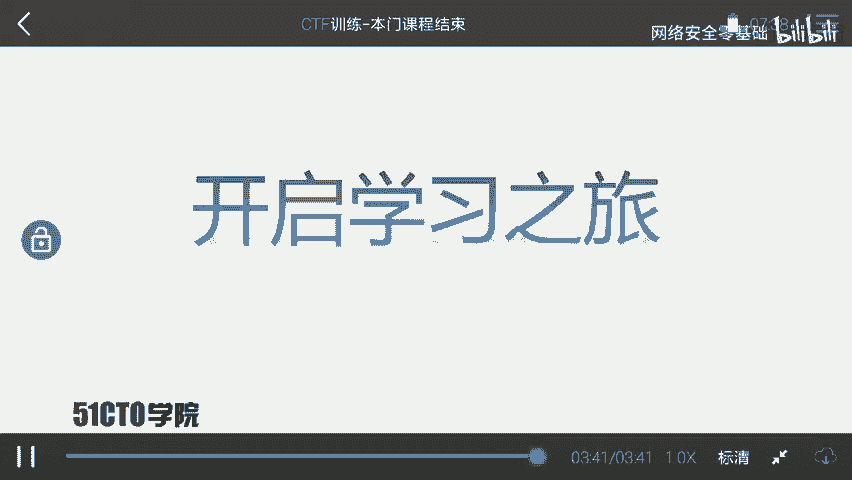
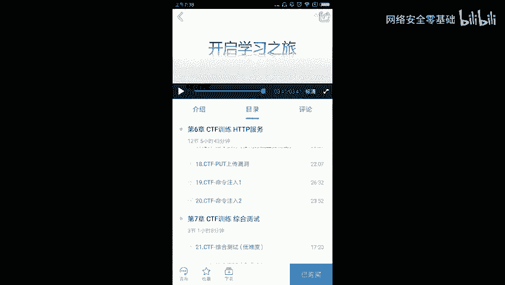

# 2024年网络安全CTF全套教程（CTF比赛必备常用工具，CTF零基础入门学习路线，CTF核心真题解析、CTF综合测试训练、项目实战解析） - P23：21.24.课程结束 - 网络安全零基础 - BV1SN4113784

欢迎大家来学习CTF训练课程capture the flag。经过长时间学习，我们今天的课程总算接近尾声。我们下面对课程进行一个总结。在之前，我们首先介绍了CTF。我们现在回想一下CTF究竟是什么意思。

CTF是一种流行的信息安全竞赛形式，其英名名可译为do flag。也可意为夺西赛。及大致流程是这样子的。参赛团队之间通过进行攻防对抗、程序分析等形式。

率先从主办方给出的比赛环境中得到一串具有一定格式的字符串或其他内容，并将其提交给主办方，从而夺得对应的分数。当然，为了方便称呼，我们把这样的内容称之为flag。在CTF比赛当中，涉及的内容比较繁杂。

我们要利用所有可以利用的方法获得对应的flag。这里强调大家需要有很大的脑洞来挖掘对应的信息。当然，我们班门课程的学习。大家基本掌握了CTF比赛当中的一些基本套路，可以完成一定难度，靶场f的寻找。

但是本门课程并不能确定。并且指导你成为一个大牛。大家拘留大牛的路是相当远的。在接下来的时间里，大家需要不断学习，不断进步，离大牛的距离越来越近。当然，我们要具有一定的学习方法。

在信息安全或者CTF学习当中，我们要不断实践，不断尝试才能。更快的进步。当然，我们在学习的时候，哎也需要有一定的方法，有一定对应的课程，有一定训练环境。那么我在之后也会推出一些课程，帮助大家学习。

欢迎大家关注我之后发布的课程。在之后我会发布代码审计这样一门课程。专门教大家去挖掘对应的漏洞，并且写对应的POC。我也会发布wifi安全这门课程。里边使用一些高度集成的工具测试wifi。

并且涉及到最新的方法去测试wifi。比如之前我们所。看到的这个中间人wifi攻击直接修改对应WPwowifi密码。在之后我也会推出mettterpo模块的编写课程。

教大家如何去写一个mattterpo模块来进行自动化测试。当然在最后我也会提升课程难度，发布一门CTF训练的高端课程。使大家对于CTF有更深入的了解。以及提升大家的安全能力。那么大家的学习尚未成功。

大家仍需努力。让我们一起开启下面的学习之旅吧。

