# 2024年网络安全CTF全套教程（CTF比赛必备常用工具，CTF零基础入门学习路线，CTF核心真题解析、CTF综合测试训练、项目实战解析） - P2：最详细的CTF-Web安全从0-1学习路线 - 网络安全零基础 - BV1SN4113784

大家好，本期视频我们来聊一聊CTF这条路的外部安全方向该怎么去入门，怎么去学习，怎么去深入。因为很多大学生在刚进学校的时候，如果在兴趣安全方向的话，或多或少就会了解到CTF，然后就会去想去尝试，对吧？

但是又不知道如何下去。我的学弟学妹们就经常会问我，哎，外部安全到底该怎么学习，怎么样才能快速的去能够在学校里呃代表学校去打比赛啊什么的，能够拿到一个好的名次。那我现在就总结了，根据我的学习经验。

视频路线绝对干活。

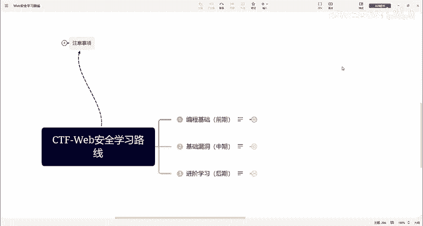

绝对不废话。那么我们来开始。

首先。谈到这一个学习。要谈到一些注意事项。

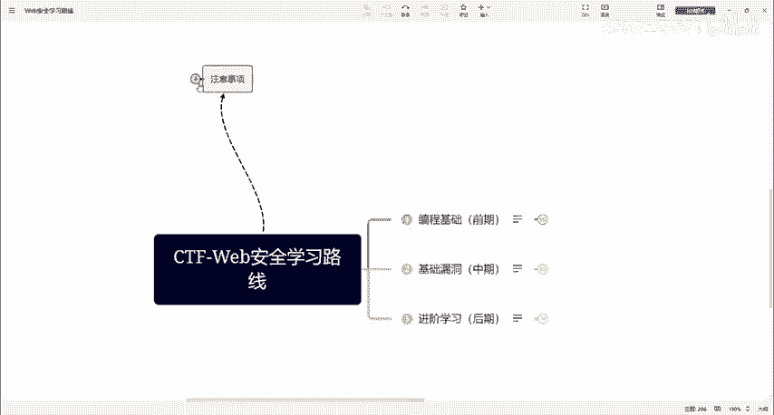

学习的过程肯定是有一点小技巧的。比如说首先。你整个学习的过程，无论是学什么，你一定要记笔记，特别是我们这个外部安全，那更加要记。因为你看我也说到了，外部安全技术又多又杂。外部安全的话。

它的宽度我个人觉得至少在初期。你如果没有找到你如果不是研究生的话，研究生你可能要挖准某一个方向去深入研究。但是你如果作为一个大学生。你肯定是外部安全技术，你肯定是要很广的，你的广度肯定要有。不然的话。

你遇到在CTL里面的各种比赛题目奇形怪状，真的奇形怪状。你根本就下不了手。到后期，那你各种语言都得懂，不然的话下下手都下不了。累积写的笔记。他能够在你比赛的时候回忆起知识点，因为你很多知识。

那PHPjava各种各样的安全知识点，你不可能全部能记住，对吧？然后比赛的时候，特别是线下比赛，线下比赛基本上我就没有见过几个能上网的，基本上都是断网比赛。所以说你一定要有笔记。

并且他还能给你一定的成就感。你想你随着你的学习，你的笔记越来越多，你就会知道至少你这段日子没有白过，对吧？第二点。就是。外部安全说到底，它也是一个计算机类的学科。它是计算机的一个分支。

所以说它就一定会包含编程，而编程你就一定要会调代码，你不会调代码的话，那你的你发现bug，你就啊对着一个代码硬看问题。即便能看出来，也耗费了大量时间，别人会调会会调试的，一下给你调出来了。是是。

还有一个安全这个行业外部安全，那更加需要调色，像什么像别人立项二进制，那更更需要外部安全是。更需要。好。因为毕竟有漏洞嘛，漏洞漏洞跟bug其实是差不多的，比bug更严重。我的个人认为。

虽然bug和漏洞其实是一个意思，bug的英文漏洞的英文就是bug嘛，但是我们一般说的bug都是普通的那种可能会导致程序崩溃的东西。漏洞。我们一般说的是那种可以让黑客去利用，有利用价值的东西。

所以说我们个人认为可能漏洞更严重一点。漏洞这个东西，你要想分析它，你想一步一步的知道这个漏洞怎么出现的那你就要更加要会调代码了。所以说请。初学的人一定要从刚开始学编程的时候，就要养成一个调试的习惯。

你不要等你变你学编程的过程中，你可能遇到一个错误，你在那里傻傻的看半天。不要不要傻傻的看动手。第3个。是最最重要的。外部安全注注重的是实践能力，不要眼高手低。很多就比如说做CTF题目吧。

就比如说做CTF题目，有的人可能他学习的过程中，他看CTF他不会做，然后去搜WP搜完之后，他一看哦，这么做的哦，懂了懂了懂了，秒懂，然后再给他去自己动手的话，其实他会中途会遇到很多问题。

因为这都说不清到不白的。很多rite up其实写的并不仔细。中间遇到很多问题，你自己发现等你自己上手了才会发现你解决不了。所以说一定要动手实操，不然你永远都不知道你会碰到什么问题。😊，注意事项说完了。

然后我们就回到主干。

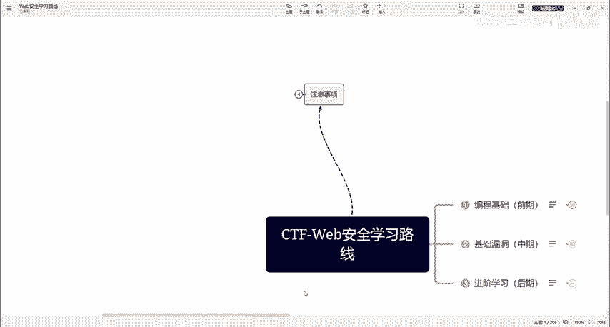

主干我把它分成了三个部分，一个是编程技术。需要外部安全，你一首先得会外包开发。因为。你安全是一个安全这个学科本来就是一个附属学科，就是有什么东西才会有什么东西的安全。就像后来出的人工智能安全。

大数据安全都是因为出现了这个东西才会出现它的安全。外部安全是一样。有了外部开发才会有外部安全这个东西。所以你一。一个。都不说优秀了，一个中等的外部安全人员是一定会外部开发的初级的脚本小的可能不会啊。

那我们作为1个CDL选手，肯定不能做脚本小子，做脚本小子你走不长的。好，那么我们首先就要学会编程。当然编程要求并不是很高并不是很高，大概能做到看懂代码，能会些简单的网站就足够了，足够的继续下去了。

中期也就是我们的基础劳动阶段。在基础漏洞阶段，我们都是采用PHP包括前面的编程基础，我们也是用PHP来编写网站。为什么？因为。当下一些前前人所写的一些漏洞教程，包括一些靶场，很多都是PHP开发的。

再包括CTL比赛中，大部分的题目也是使用了PHP。一般如果是不用PHP的题目，难度都是稍微会高一点。新手来讲的话，你把主要的精力放在PHP上就可以了。到了进阶学习的部分，就是说你基础的常见漏洞。

你全部都已经熟悉了。变成。PHP的一些常规的特性，一些漏洞特性你可能也是了解了。

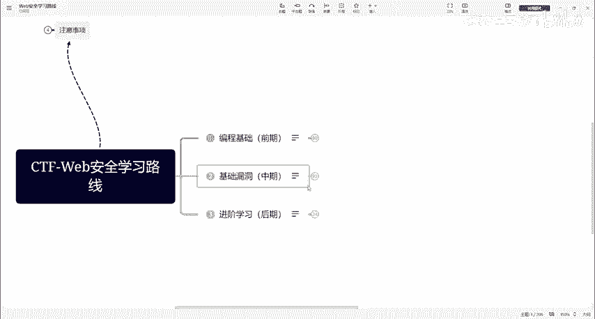

这个时候你就开始进行境阶学习，境阶学习你这肯定是要多多实战。去大量的去参与参与比赛。在比赛的过程中，你肯定会碰到各种啊不是PHP的题目，或者是PHP里面其他的特性。就你不知道的安全这个东西我都说了很广。

所以说你一定会遇到很多很多你不知道的东西，或者是你在其他师傅的博客里，在一些技术文章里都会碰到一些你不知道的东。这个时候你再去针对性的学习。包括后续你可能会走到java安全的路线，或者是python啊。

别的nodeJS来研究，或者是你可能会更加深入底层去挖寻PHP底层C源的一些东西。这些都是可能的，后面就是每个人走的路线不一样，他学一些东西可能都会不一样。那么你在学习的后面的过程中在逐步的查漏不缺。

但是前面我说的12肯定是每1个CTF的 web部选手是必须掌握的，必须会。

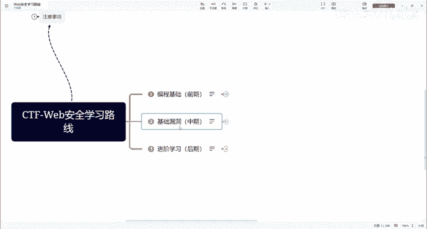

好吧。然后在经济学习中，我也会谈到一些学习的技巧什么之类的。

那么首先我们来回到编程的基础。

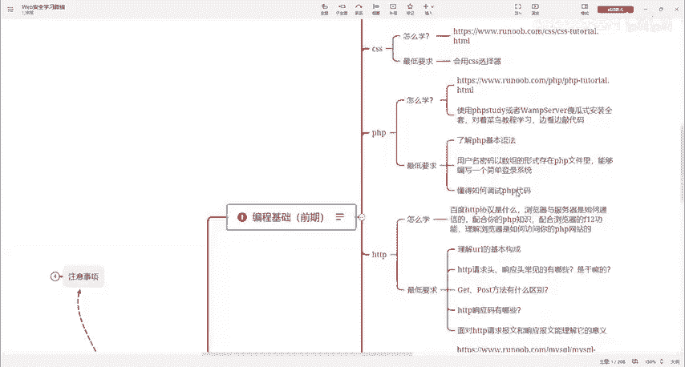

编程基础这一段，我总共给了这么多个闭学的知识点。这些知识点都是要求你在进行漏洞学习之前必须要掌握的基础。

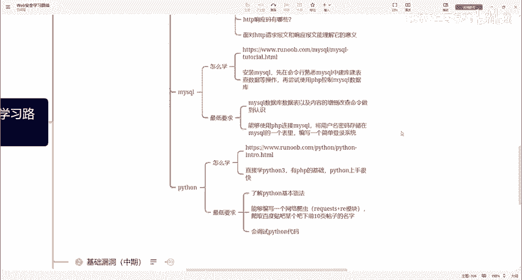

其中，对于每一个知识点，我都给了两点建议，一个是怎么学，一个是最低要求。首先我们来看怎么学怎么学，你看啊前面的一些怎么学，我都给的是一个菜鸟教程里的一个网址。菜鸟教程。

蔡照程它是一个比较精简的学习编程，学习编程技术的一个网站，里面就是直接给你了你一些。

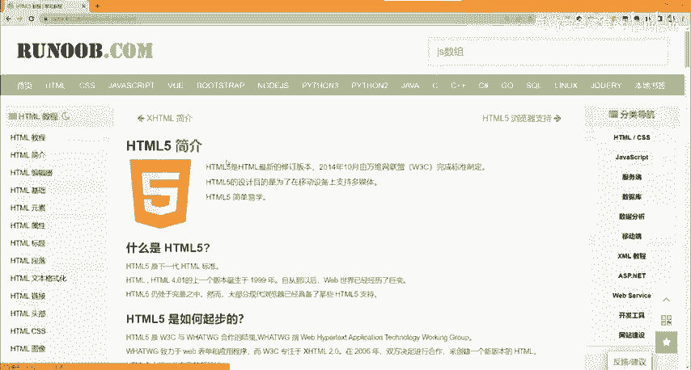

功能从安装到教程，到简介到功能。这样的一个比较简洁的教程。

为什么我没有给那些视频？造成呢。因为。我认为对于一个呃刚入门可能是一个大学生，大一的学生。刚刚入门CTF外班成这个方向的话，他需要的是。在快速打好快速巩固一下编程基础之后。

立马就能够加入投身到CTF外部安全的学习当中。给自己一个正反馈的一个效果，推动自己去学习新技术，而不是说花费大量的时间在前面的那个HTML这种在编程基础上PP啊这些编程基础上，就不要在这里花太多的时间。

毕竟我们不是搞软工的对吧？当然我不可否认就是安全阶段在你的更强，你要成为一个更强的高手，成为更厉害的人，你肯定是需要去深化自己的编程内功的编程是我们的内功，无论是任何学计算机的同学，都是需要去增强的。

但是这些不是你刚开始要做的事情。你以后后面后续阶段。

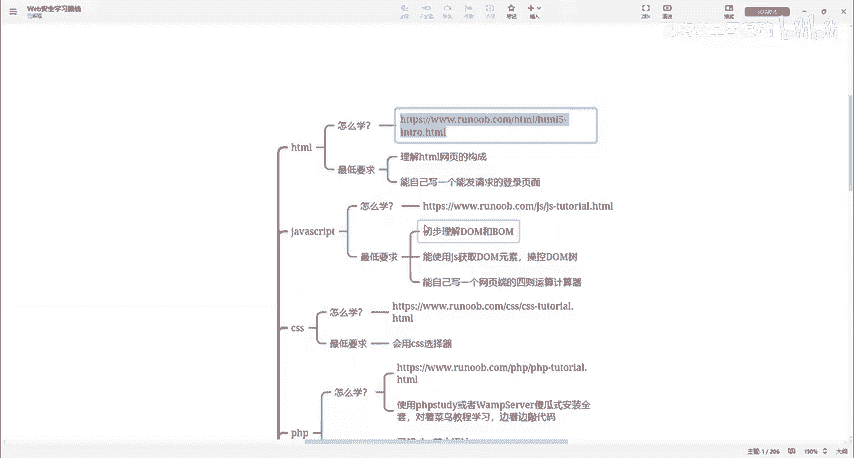

再去后续结换就是。就系。

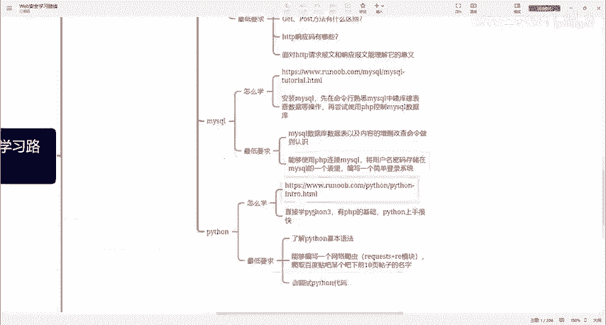

后面说到第三阶段的进阶学习中，你可以去继续去深化自己的内功，那些没关系，前期我们还是要。

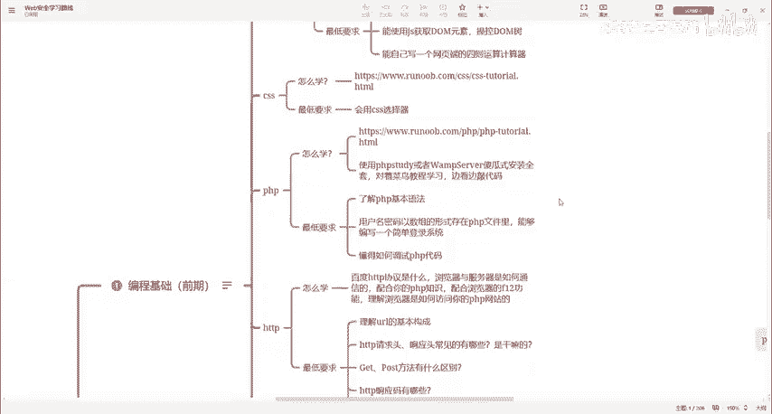

呃，目标要明确明确自己的学习内容。对于这个HTML就是你达到我的最低要求的这两点就OK了。没必要说把HTM要学的那什么标签，你都认得。像教程里面，视频教程里面可能会讲到一些比什么插视频的标签。

插音乐的标签，其实都没在前期都是没什么用的，至少。然后。一旦你达到我的最低要求之后，你觉得最低要求提到的这几个点你都能够理解了，你都会了，那你就可以进入到下一个阶段，下一个步骤的学习。

就就是javaqui。这这些知识点都是顺序学习顺序学习。Jaco同样也是嗯怎么学？我推荐是在菜鸟教程上边看边敲边看边敲，一定要动手。之前注意事项里面提高了，不要眼高手低。然后你达到我的最低要求。

这几个点，能够自己去写一个网页端的四则运算器，就这么一个水平比较低。我觉得如果是一个有C语言基础的大一学生的话，可能。呃，四五天就能够做到四五天就能够做到。然后就可以进入到下一步啊。

CSS这个东西其实在安全里面用处不大，用处不大。后期可能会有一些CS在的商漏洞。但是那个时候你。那个时候再说嘛。前期你CSN的要求什么？你就会用CS的选择器就够了。

CS的我们都知道它是用来优化网页的那个内容的，就装饰装饰网页的。网页的样式。各种各样的奇怪怪的样式的一个编辑，什么字体扩大缩小啊什么什么各种颜色。其实你用的时候自然会搜。

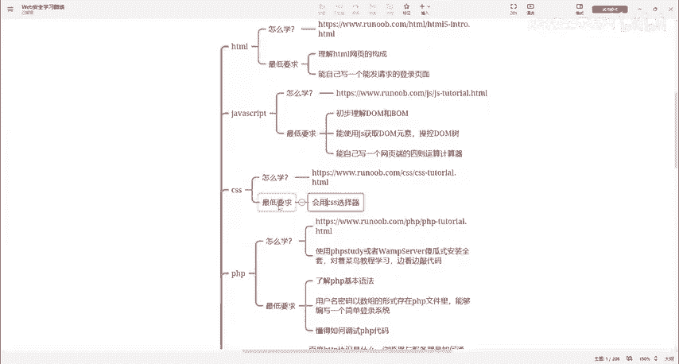

我这里的要求只要求你会用CS的选择器就够了。好，然后就到PHP前面是加网页的前端3000克嘛。PHP基本上可以说到了网页的后端了。后端这里除了菜展教程以外，我还给了一点建议。

就是说你一定要使用PHP study来进行安装，而不是自己去安PHP啊阿帕奇亚。那可能你作为一个新手的话，你会遇到很多的错误。你可能会搞这个搞一天就安装PHP安一天，然后遇到很多bug。

这对我们前期的学习的积极性是一个很大的打击。所以说就用PHP study不用担心你可能会错过一些东西。不会的，先我们先上手再说，好吧。而且还是边看边讲，然后你达到最低要求，了解语法。

并且能够写一个简单系统。这个简单系统是没有数据库的。就是我每次写到了最低要求里，一定是你在掌握了你这一点前面的知识点的基础上能够做出来的，绝对不会用到后面的知识点，好吧，绝对不会用到。

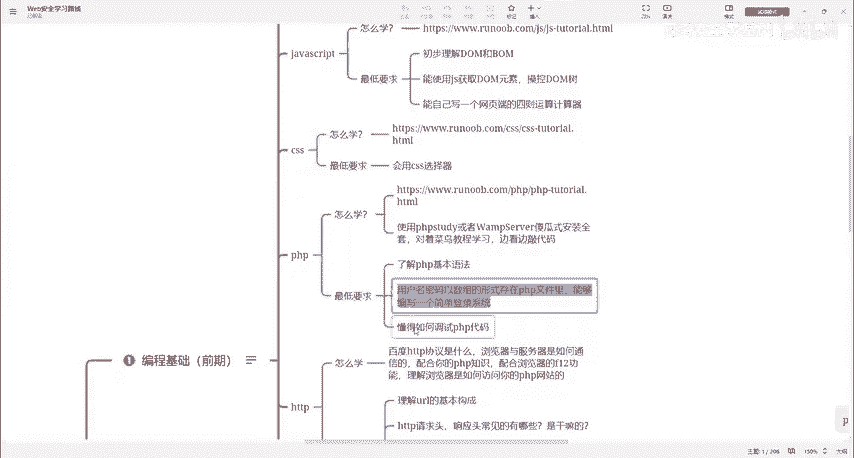

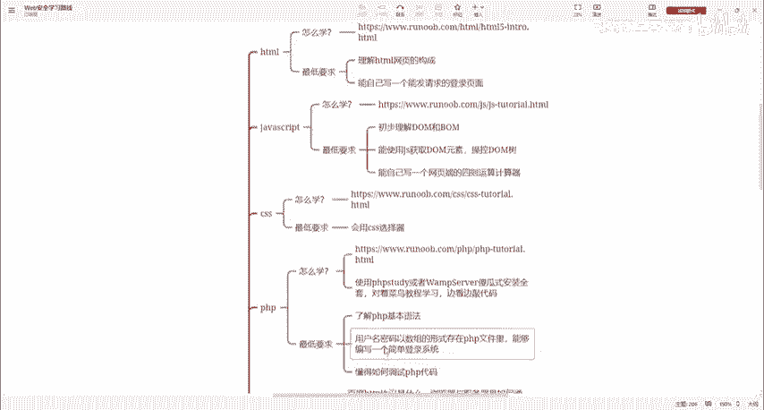

所以说这个最低要求你是一定能完成。你完成之后这里第三点还有个什么调试，也是注意是这样你说的。我希望一个新手能够在前期就养成一个调试代码的习惯，而不是去硬看错误。因为你在学PIP的过程中。

你肯定会遇到一些在菜鸟者身上。哎，我对着他敲了呀，但是最后的结果跟菜鸟身上的答案不一样，那你就一定要懂得调试，不要去死看。

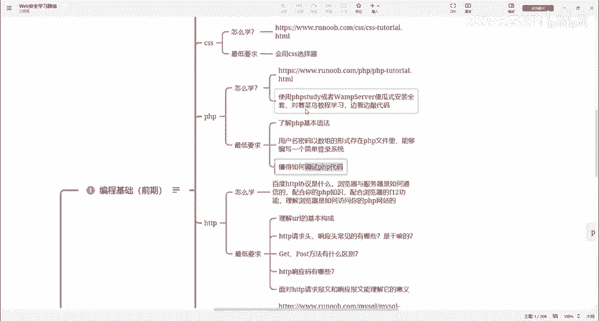

快速发现问题，好吧。

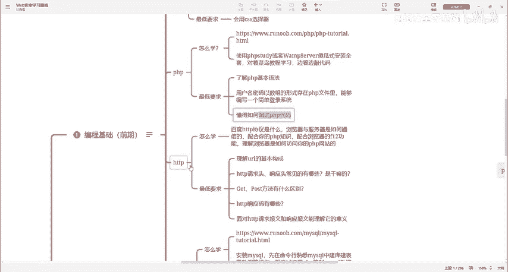

然后到了HTTP的结构，前面学了PIP这些东西，我们基本上可以说能够去写一个简单的网站了。但是我们这个时候就要深化一下自己的理论基础。也就是说学HTTP。

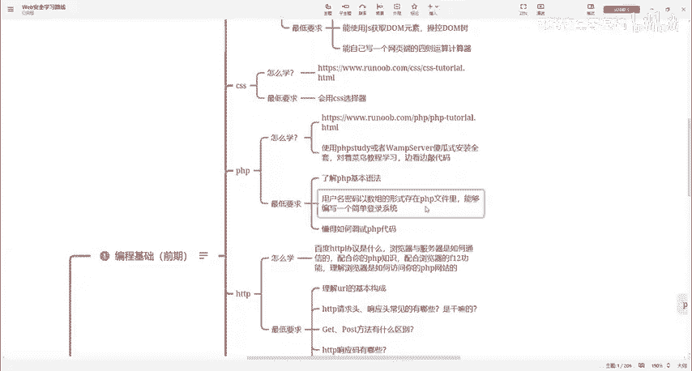

我们需要去知道哎浏览器是如何跟我们的后端服务器进体进行去进行信息交流的。我们需要知道这个东西，然后这个主要就是靠百度学，可看到靠百度学，然后还要配合浏览器的F12功能。

在这个阶段你也要去熟悉一下浏览器的F12，这也是你后期。

经常会用到的东工具。然后达到我最低要求的这几个点，也就是说这几个点你能够轻易的回答出来，回答出来没问题，那就OK。

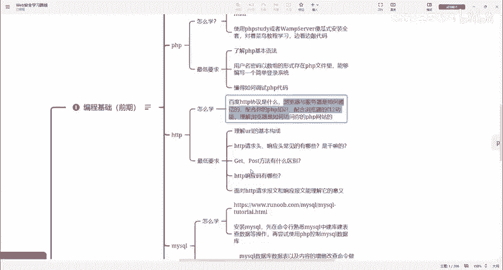

然后就到mysclemyscle就是数据库嘛，数据库这个东西后面的一些动态网站基本上是基本上都有的。很重要的东西，然后怎么学呢？还是一样安装mycycll安完之后，我们先在命令行里面熟悉。

就不要不要先进，不要直接就到PHP里面去调mysl了。先到命令行里面把mycycll完熟，circle一句敲懂，然后再去进入到PHP里面。我们多少编程语言这个东西是可以操控你电脑上的基本上是任何东西的。

所以说简单的说就这用PHP来操控myscle这个软件来去实现我们数据库的增强改查，做到这个就可以了。最低要求啊还是给人你一个实例，希望你能够编写一个这样简单的实例。这个简单实例其实也是。

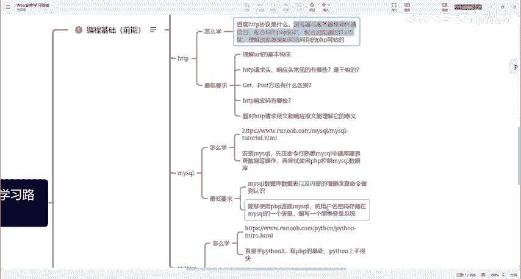

在之前的这个实力上的优化。之前用户名密码是放在PIP文件里面，以一个变量的形式存在。现在我们就要把它丢到数据库里。

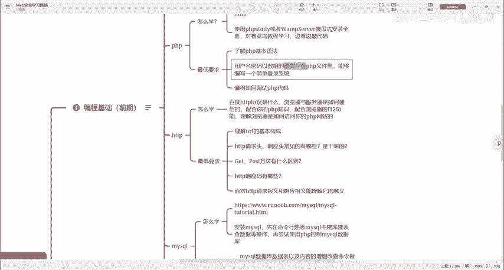

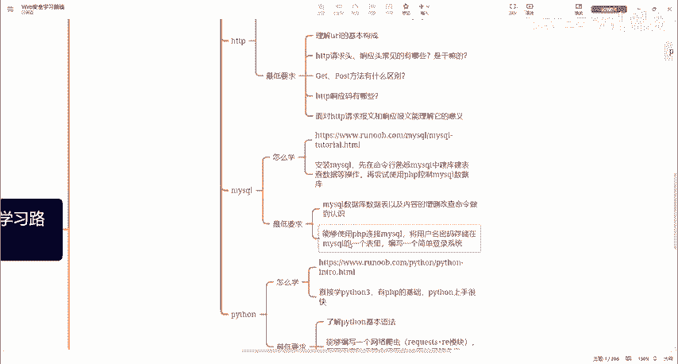

再去写一个实例去优化嘛，可以一直都是一个实例慢慢的改进。接持的是pyon，我们学这个东西干嘛？有了PHP为什么还要学它？因为我们经常爱写脚本嘛，特别是打CTF写脚本是常见的事情。所以我们。

学会基本的脚本的编写方法。你有之前PP的技础，学，这个肯定是飞快飞快，直接去python3就够了。python2，其实跟python三差不多。你真碰到你真碰到python2，你学了Pthon3。

你也看得懂好。然后了解最低要求，还是具本语法，会调试，这两个是学编程，你肯定都都都得会的。然后这是第二点，希望你能够做到这个实力。因为我们学python要有目的性的学python有1万。成千上万的模块。

成千上万的第三方库，你不可能全选，我们只学对我们有意义的。最重要的requests加RE正则模块。你会这两个，基本上大部分的那个CTF中需要编写的脚本你都会写。就这么容易就这么容易。

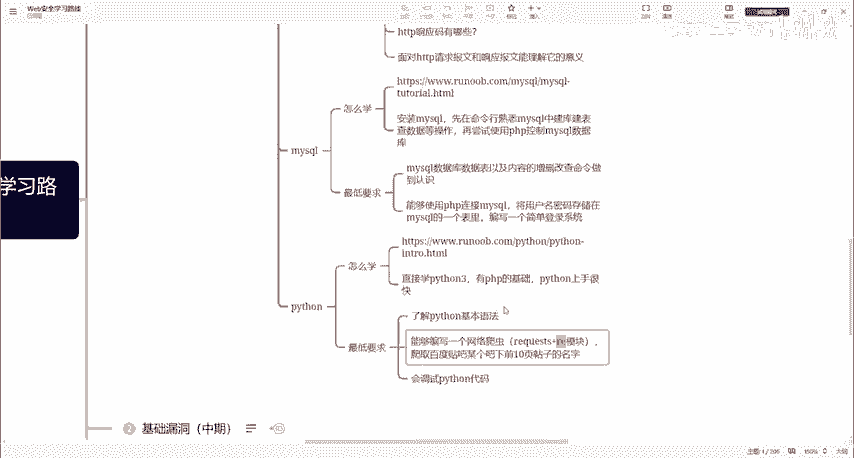

好，学了这些，我认为你的编程技术已经足够了。

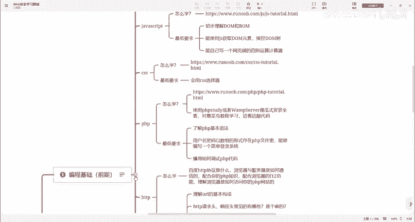

这整个学下来一个我认为一个呃大一的有C语言基础的学生，大概需要15到20年左右。

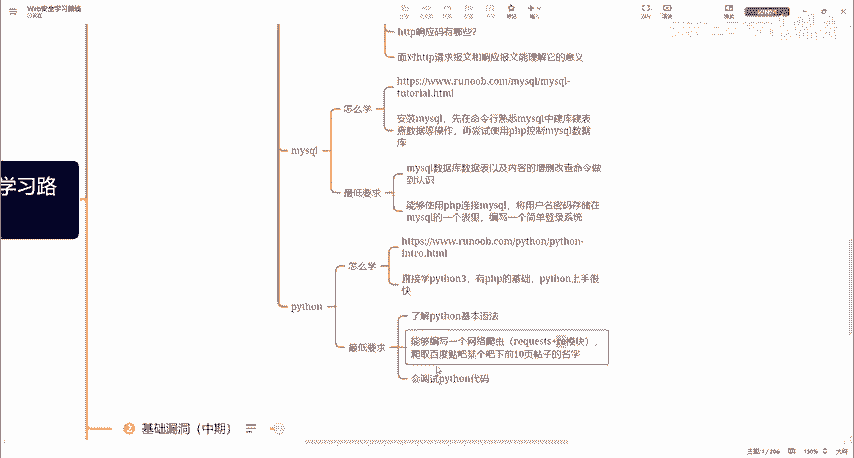

十五大锤字。这是快的啊，我前面说的是快的，15到20。

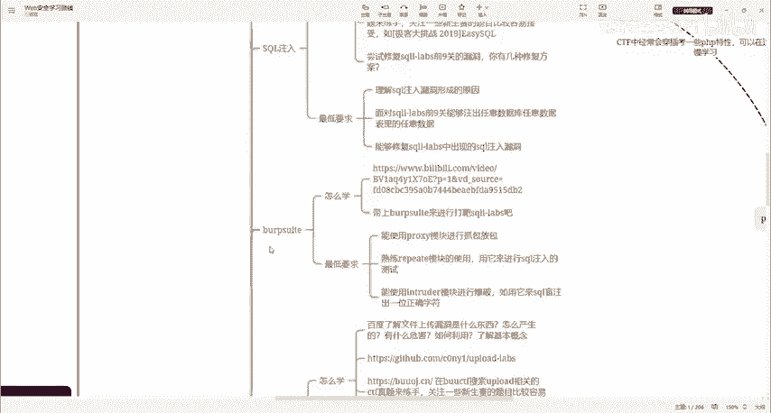

然后对于第二部分，这是我们的基础logo，这里就我们就要开始正式的进入呃安全方面的学习了。

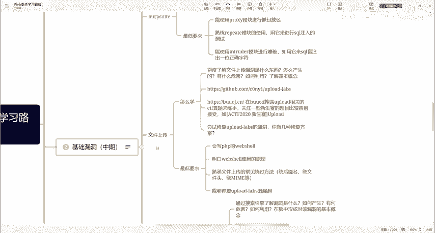

首先我们需要去了解一些常见的概念。因为如果说我们。直接就开始学安全的话，我们可能会在各种资料，各种教程上碰到一奇奇怪怪的名词，这种东西也可能会打断我们的学习。

最后我们提前了解一些安全方面的一些概念是有有益处的。就我提到了一些常见的一些名词，希望大家可以去搜索一下，然后去提前了解一下，然后再进入我们的信济收集。这里信息搜集我说的很浅。

只说了呃前端代码泄露和目录扫描这两个东西。其实你学起来应该很快。真实的信息搜集有很多搜很多东西。其实在渗透中的信息搜集很复杂，是一个很大的话题。但是如果把范围缩小到CTF这个层面的话。

那其实信息搜集其实就不是那么复杂。因为CTF并没有渗透那么复杂的环境，对不对？😊，在CTF中，我们信息收集一般只有两个点，一个是前端代码泄露。就前端我们从代码里面找到一些蛛丝马迹。第二点就是我们。

目录扫描这扫不录了。像有时候有些大佬做不出来一些简单题，有可能就是在他字典里面少了一个奇奇万万的备份文件。😊，嗯，这真的很惨。所以说要目录扫描我们要会这个学起来很简单。

你就把这个工具第R4试用这个工具去做。很好用。然后剩下的就是总结那些字典，你字典只要够多，你就能扫到啊。我们扫的目的一般就是两个，一个是源码，一个是敏感不录泄露。大部分的CTF题目，你相信它。

你要相信它，大部分的CTF题目都是白盒的，很少会有黑盒的给你走。因为CTF它是有时间限制的嘛，如果黑盒的话，可能会导致选手浪费一些不必要的时间。所以一般的题目都是白合的，所以你要想方设法去获取源码。哎。

很多源码就是在目录扫描截断货去，就源码泄露嘛。

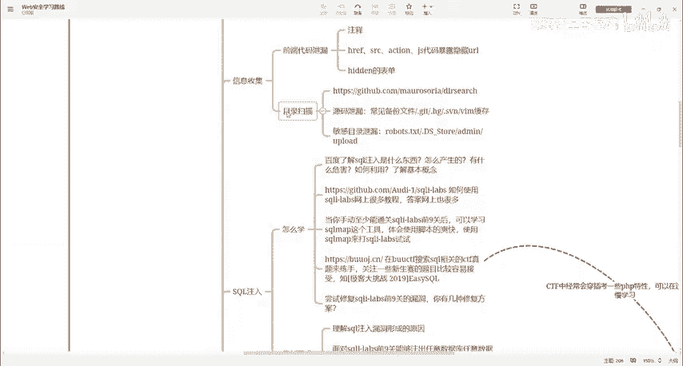

然后。

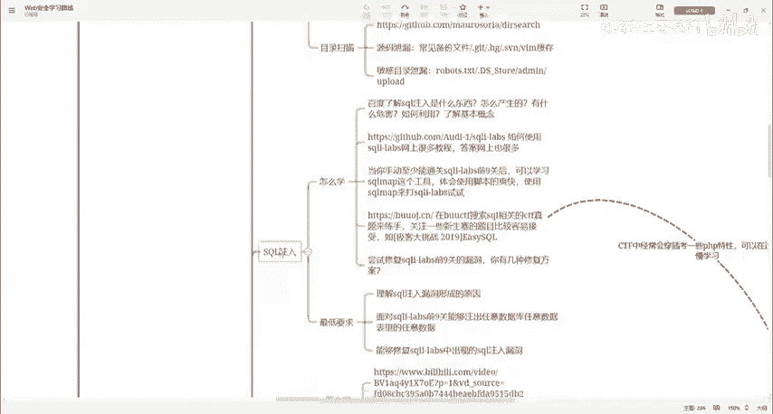

学了一些基本的信息收集之后，你就开始要进入第一个漏洞的学习。一般来说，我们外班安全人员，无论是你学生透的还是说CTF的选手。你第一个接触的都懂。这一定是蛇口猪入。蛇口注入这个时候就是。

灌输给我们安全人员一句话嘛，叫做不要去相信用户的任何输入。学这个漏洞，你大概就理解大多数漏洞到底是如何产生的，基本上都是不信任用户的输入，都是信任了用户的输入而产生。至于怎么学，我这里写的比较详细。

首先你要去了解四个珠这个名词，这个名词你首先得懂。你知道哈这个漏洞哎是怎么产生有什么危害，如何利用它就了解脑子里面有一个基本的概念就OK了。然后我们去下载一个靶场。也就是circle labs。

这是前人写的一个。很好用很好用的靶车。我觉得我当时学参考车的时候没有用这个东西，很后悔，走了很多弯路。我觉得用这个东西直接少走十年弯路，好吧。然后他的教程的话，网上很多，你可以在网上搜。

对着教程一步步的来。当你能通关前九关。前走官手工注入啊，前期你一定要手工注，不要去依赖任何工具，不要直接用scle map。你能通关前九关之后，基本上就是盲助啊什么的，基本上都是能手工能手工实现了。

你也会写脚本了。前面学python的目的就是在这里啊，你circle laps肯定那些盲助肯定是要写脚本的嘛，你的pyython技术不是用上了吗？然后这个时候你就可以去呃学习这购 map这个工作。

去体会一下，使用脚本来代替手工的这种快感。然后你把s个 map。能够去通关你之前手动通关的关卡就OK。这个时候你对搜go猪肯定是了解的已经很深了嘛，也不算很深吧，有初步的了解你已经。

有实力去做CTF真题来练手。就是说我推荐大家的。呃，CT平台就是BUU我觉得这里面的题目都是真题，然后。界面比较简洁，很舒服。我当时发题都是用这个。选CPF真题，你肯定要针对性的选。你如果随便选的话。

很可能就碰到一些很难的题，直接把你全退了。所以说我推荐大家去关注一些新胜赛的题目，可以去百度了解一下哪有哪些新胜赛常见的迪克大尔赞。ACTF的新春带，还有各种。大学还UNCTF这种各种大学的新征赛。

这些题目都是比较简单的，所以说容易接受。然后我这里有一个箭头。

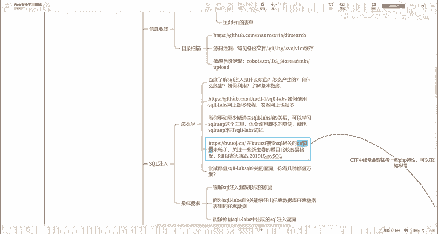

你在打新生赛的途中。可能会遇到的一些东西。

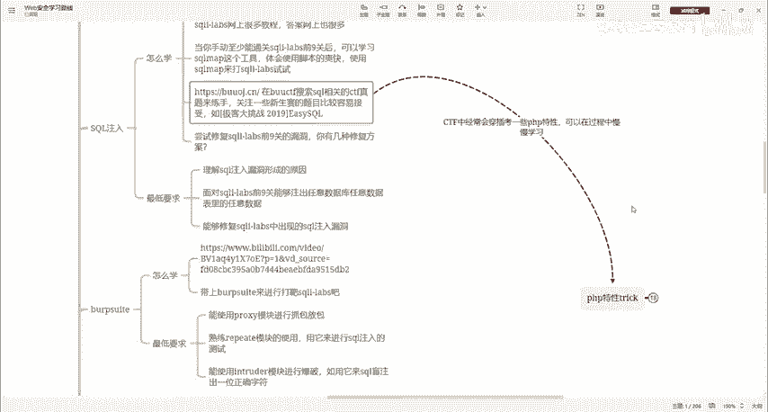

这些比如说简单的ED circle口，它经常会穿插一些PHP的一些考点，你偏一些特性，常见的有那些什么。

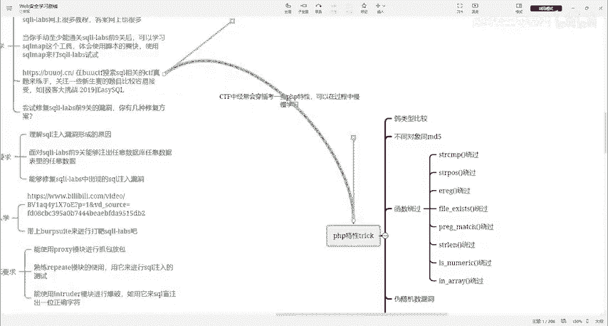

若类型k平音符的信息函数的各各种奇奇怪怪的函数的绕过，这些都是你在。刷CPL题目的过程中去总结了，慢慢的去总结。

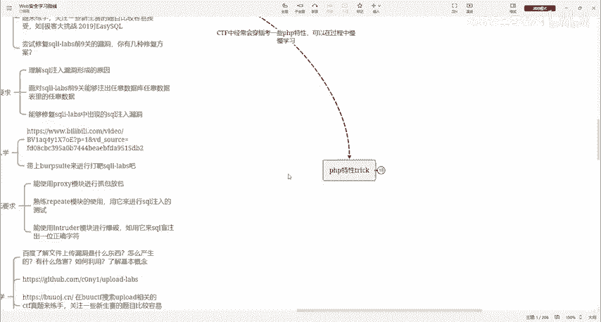

没必要去专门的去啊，我去学了一下PIP的漏洞啊什么的，这没必要没必要这没必要。

好。之后你在刷了一些CTF的真题之后。你就可以去开始去尝试的去学习呃漏洞的修复。你既然对漏洞的利用已经是比较了解了。就尝试去进行漏洞的修复，并且你要使用多种修复方法。只有一种是不够的。

你要考虑一下你有没有哎，这里能不能修，那里能不能修。一般来说我们的漏洞都是只要修了某一个口子，它后面的口子可能都利用不了了，是这个样子，那你能修几个口子，对吧？

好，然后这里也给出了最低的要求。理解漏洞形成原因能够修复，对吧？这是基础。然后还有一个就是面对scle labb的前轴观，你能够做出任意数据库，任意数据表里的任意数据。给出了三个正意。

这就是整个数据库基本上是能被你拖下来的这种程度就够了。

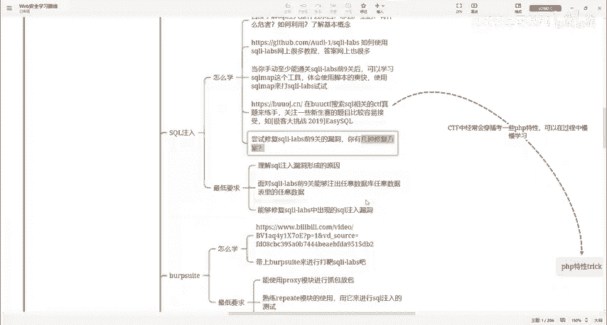

好。在过了这一个阶段之后，我认为你已经对srcle露住有了基本的了解，就是。懂它是什么，并且能够利用这个漏洞，并且会修复这个漏洞。这个漏洞你会这三点，我认为你就掌握了这个漏洞，你掌握了。

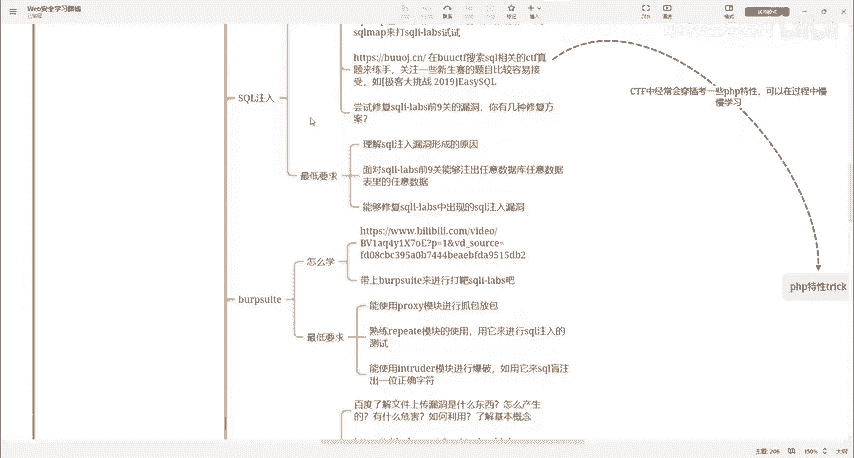

那你就可以进入下一步，我们就开始学习一个对于我们web手很重要的一个工具，就是bb suite。这东西怎么学？我推荐的一个B站视频。因为我是在看了一下各种资料，感觉没有什么好的，我感觉这个视频还不错。

看网上呢有有一些b的一些文字教学，我觉得太复杂，太长。就这个视频教程还不错。我们大概就学proces。repeater，然后instructer三个模块就够了。这三个模块基本上囊括了后续大部分的需求。

其他的模块你可以在打CPF的过程中再慢慢学习。然后你在看这个视频的过程中，你可以去拿着bo weight来去重新打靶之前的cir laps。

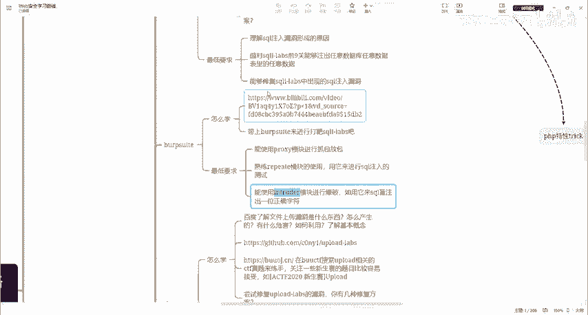

之前一直的因为是自的之前都是在浏览器里面打的嘛。😊，现在你来尝试一下，抓包去打。是怎样一种感受？然后你能够拿到我的最低要求，能够抓包，能够用repeater去测赔load。

还能够去用introder来进行爆破。比如说我用它来进行搜索帮助。

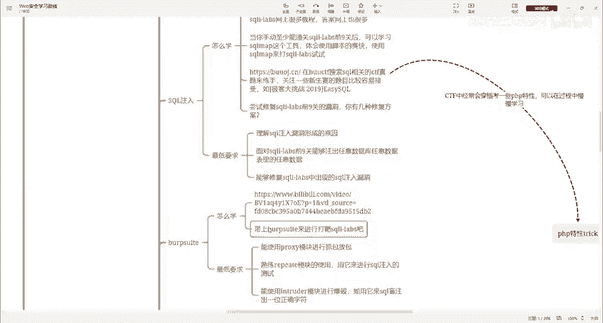

这个盲数 in差点，你只要能盲住出一位正确正确字符，就盲住出一个字符。

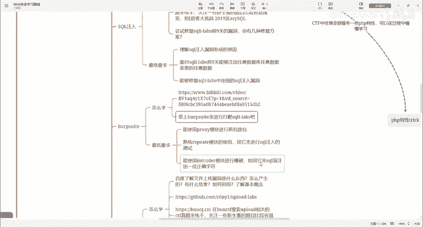

基本上说明你会用了就足够了。然后包所我认为你就已经掌握了。

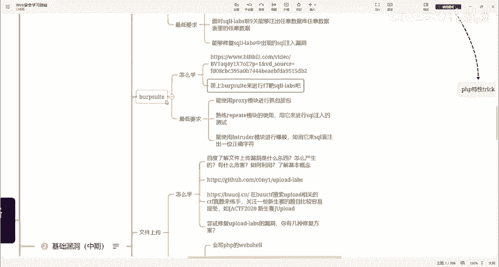

然后再到下一个，我们web手很重要的第二个漏洞。

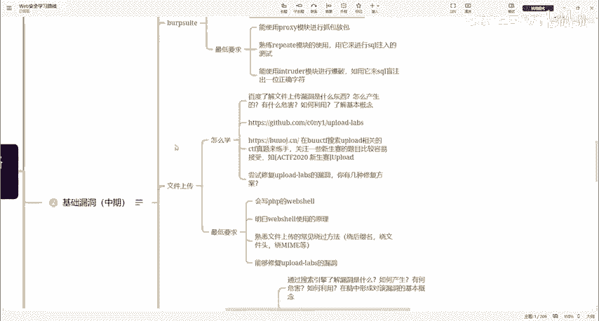

我觉得文件上传和搜购注入是我们外部手。最需要掌握的两个漏洞就是最重要的。它囊括了很多东西。

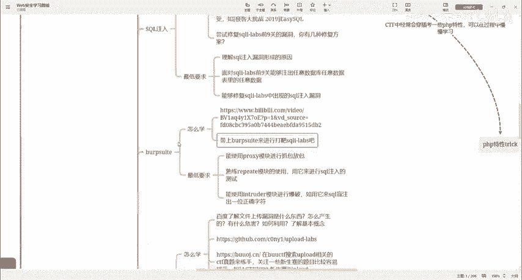

就比如说数据库和we shell，我觉得这两个是比较大的一个东西。前期你是首先需要掌握的。

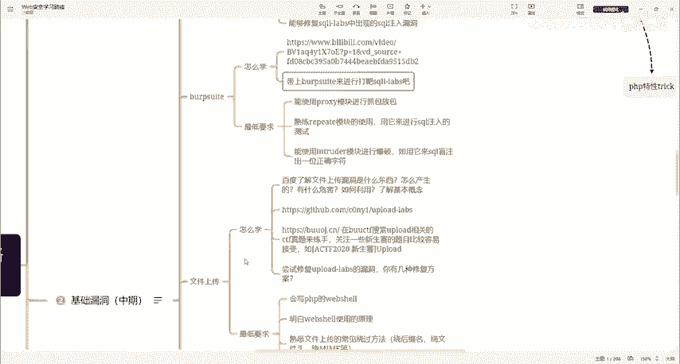

那么怎么学呢？其实跟前面的有点类似啊。首先我们还是一样的，了解文件生传漏洞是什么，有什么危害，如何利用，就了解基本概念，他脑子里面有东西。然后。他也有一个upload laps，也是前人总结的。

他囊括了很多常见的上传的上传漏洞的存在形式。把这个玩熟了之后，你就可以去BUUCTF里面搜索一些upload相关的题目来练手。就直接在网上搜BUUCI8的就能搜到一大堆。然后。还是一样的。

找新时赛的题目，给自己信心，给自己信心很重要，就这个这种反馈正反馈很重要。最后就是尝试修复，在网上去搜寻一些修复的方法。你尝试把这些靶厂的漏洞给修复了，让你原来的陪漏的。打不通，原来的赔洛打不通。

说明你修补成功。那么你有几中修补方案还是一样的。可以修复很多地方，并不是绝对不是只有一个地方可以修复。

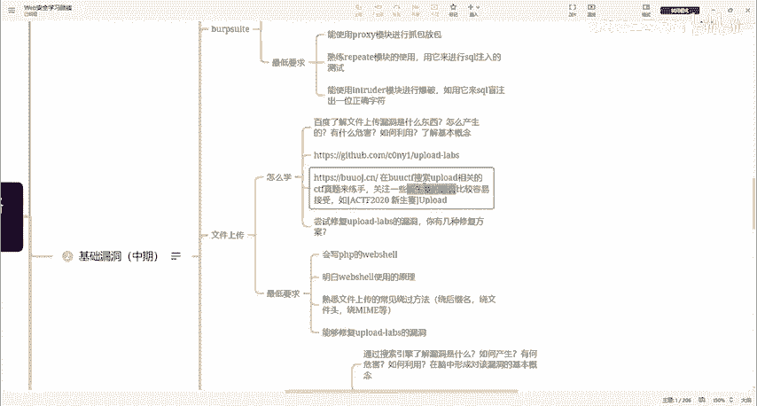

然后还是。要实现我们的最低要求，会写we。然后你要明白webs shell的使用原理，就是web shell它为什么能够达到控制？控制目标服务器的效果。你得知道这个东西。然后比较熟悉文上的常见绕过方法。

以及能够去正确的修复这里面的漏洞。

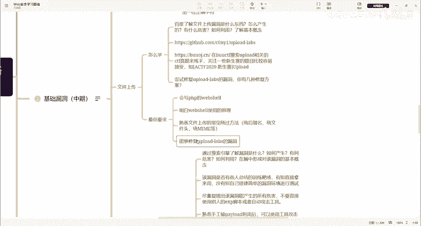

达到你之前的陪load的都达不了的效果就够了。到后面阶段，我认为你已经学会了文件商场、色合猪入这两个。我认为是在外部安全里面前期最重要的两个漏洞，你学会了。

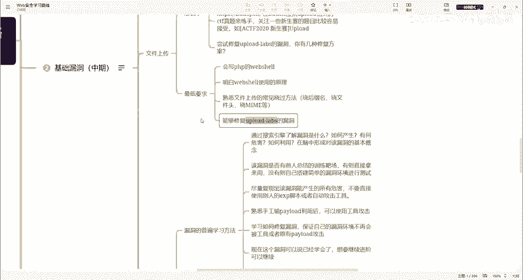

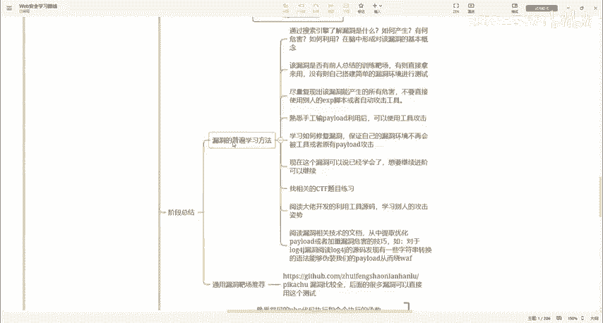

这个时候我们要做一个总结。就是学了这两个漏洞之后，哎，漏洞到底是怎么学习的？我们脑袋里面要总结出自己的学习方案。你不能说天下漏洞那么多，你不可能说每一个漏洞，你就去让别让有没有人给你总结一个靶场。

然后一个一步步的教你练是不可能的。天下漏洞太多了，各种各种漏洞每天都在铲出，对吧？就是我们总结一个学习方法。那么。

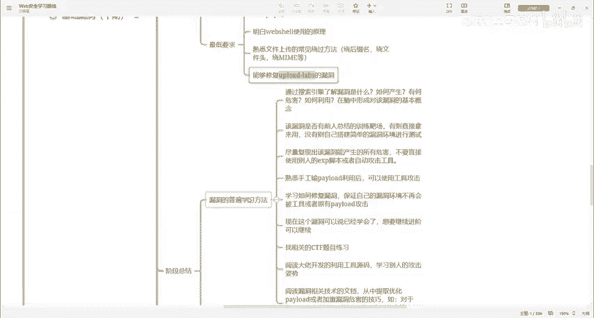

我这里给了一个方案，首先就是。通过搜索引擎去了解这个漏洞是什么，就是形成基本概念是吧？第一步形成基本概念。第二步就看一下这个lo洞有没有前人总结的训练靶场，有就拿来用。

就像circle加upload像叉SS好像也有叉SS lab。还有SF啊好好像也有挺多的。现在前任给我们总结了很多东西。😊，有没有靶场，有就直接拿来用，没有的话，我们就搭建一个简单的测漏洞环境。

这也可以训练到我们对漏洞的理解。就我们可以训练我们如何就是灯多冬是怎样形成的。第二步就是大环境。无论是用别人把伞还是自己搭都可以。第三步就是。复现我们要求能够复现出这个漏洞产生的所有危害。

并不是说就比如说呃一个srcle注入，它可以实现然后查数据库对吧？查数据表对吧？还有什么读文件之类的。它能产生很多危害，我们要把这些危害全部复现出来，而不是说哎呀scle注入哦，我可以。

我可以用一个万能密码绕过登录，我学了这一个肯定是远远不够的。我达成一个危害是远远不够的。我一定要把所有危害都实现一遍。并且不要用别人才一插屁后自动跟你脚本，这没没意义，除非是。有别的特殊情况，好吧。

这个不多说。です点。就是。在熟悉手工配load的利用之后，就手工输入。手工利用之后，你可以采用工具。因为很多漏洞可能是确实是有一些自动化的工具可以去攻击，但是一开始不要用，你一定要在理解原理的基础上。

然后再去用工具去优化自己的挖洞效率。这样才是一个正确的学习方式。然后就是学习如何修复。修复漏洞我们是一定要会的，特别是在CTFCTF虽然不会考修复，但是。你有充足的修复知识，有助于你去正确的去挖掘漏洞。

因为你修复知识如果足够的话，你看一眼你就知道哦，这个地方这个洞已经被修了，或者是或者是说。你能够立马发现哪个地方是呃可能存在漏洞的地方。并且GTF还有线下赛吗，是不是AWD你也是得会修的嘛。好。

然后后面就是你可以去找相关的CDF题目练习了。开始练练起来。

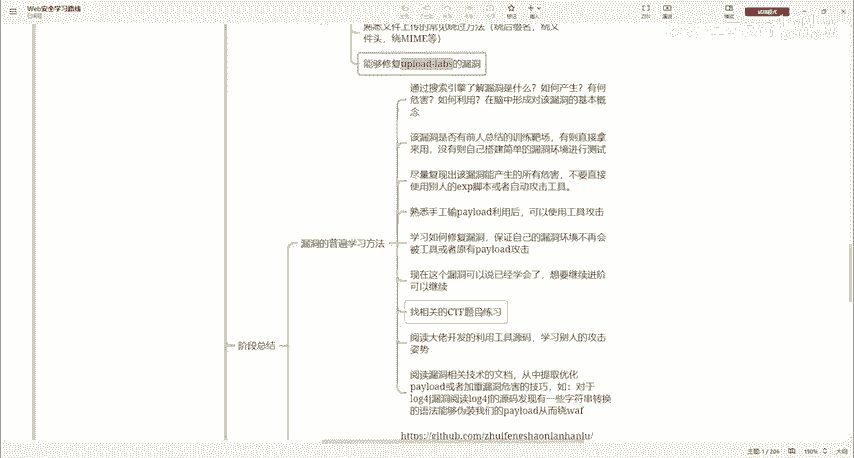

到这里其实已经后面就是一个自由学习的过程。然后还有其他的学习方式，比如说阅读大佬开发的利用工具代码。就比如说JNDI注入，你可以去找那个这些网上gitub有很多JNDI的自动利用。看他们的源码。

学习别人的利用知识，别人陪load的是怎么打的，还log个做的一些利用工具都可以去看。然后就是阅读漏洞相关的技术文档。我们学会一个漏洞之后，可能你会利用了。

但是在CTF中经常各种漏洞都是有wauff存在的。我们要学会如何去绕walf绕walf怎么学？除了去看别人总结出来的绕挖uff技巧之外。你如果想自主学习，你就应当去学习对应技术的源码。或者是文档。

来去发现一些有没有能够去优化培漏的一些技巧，是不温档，对吧？不温档，就比如loc克for这肉洞，我这里提到look克for这肉洞look克 for你。你去看罗果菲列特的源码，就能找到一些啊吸因技巧。

能够去伪装我们配load的。

或者是可以加重危害，提到加重危害，这是靠你自己的一些看文档。

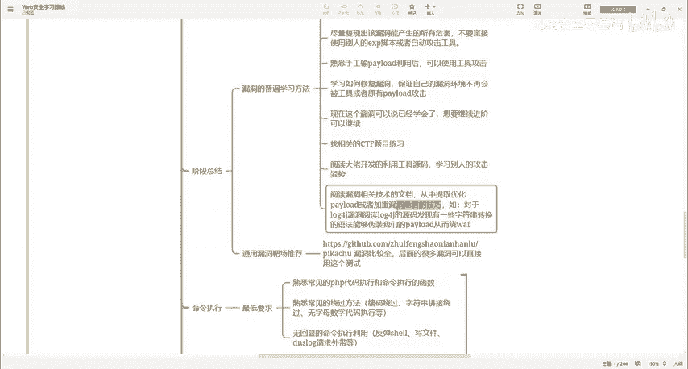

然后我这里还会推荐一个通用的漏斗保箱，因为。各种把各种漏洞测试，每个漏洞去下载一个保养，太麻烦了。我推荐的是皮卡丘这个靶上，这个靶上包含了很多常见的漏洞。

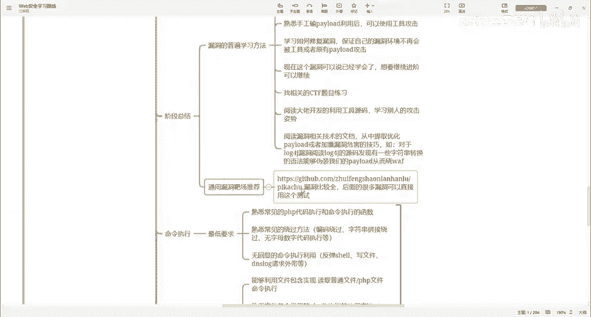

我们用它来测试会比较方便。

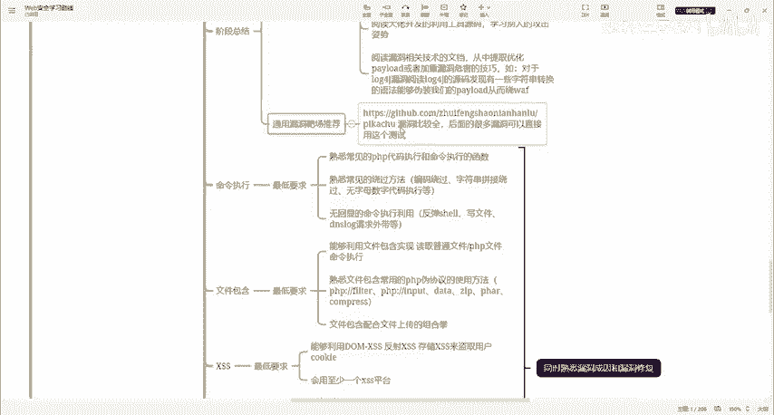

后面就到命令执行的张嘴。

命令执情也是给了一些最低要求，你达到就行。后面的文件包含也是如此。

这些顺序我是以一个优先级的方式。这是我认为的你学习漏洞的优先级。一定要按照这个顺序来。

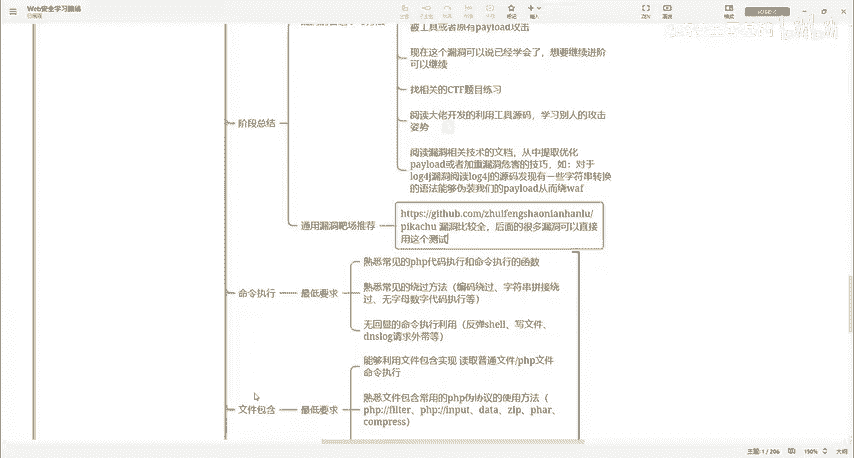

当然你不按这个顺序来也可以，只是说我个人建议啊，我个人建议就要按顺序来。

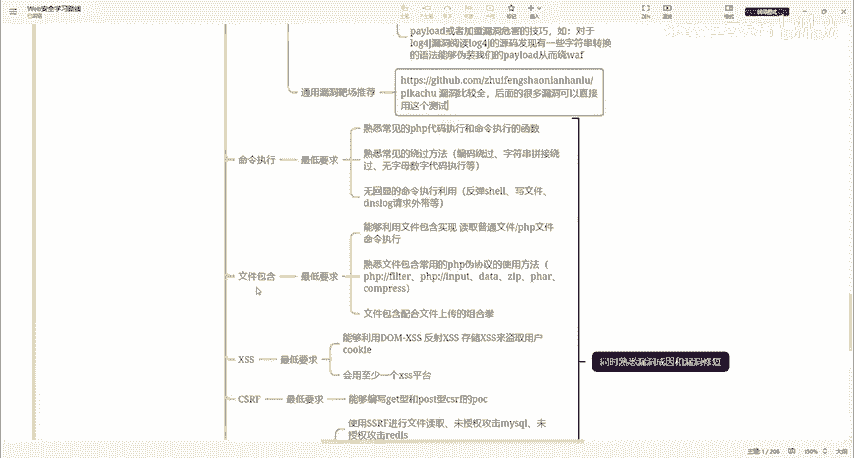

在CTF中。这些是前面的是比较重要的，越到后面越不重要。当然后面的。

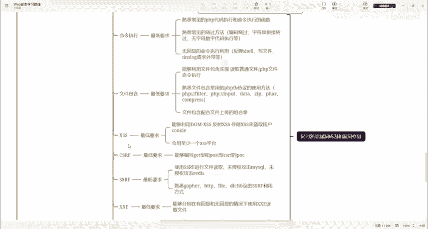

不可否认SSRF叉叉E反序列化。是比较重要的，肯定比叉SS和CS2F重要。但是我把它放在后面，是因为。前面这两个稍微简单一点，所以我认为先先学这两个没问题。后面这三个是比较复杂的漏洞。

所以说放在后面学习。在你有更多的经验之后，在学习会更加顺理成章。我是这么理解，然后每一个漏洞你都要达到我的最低要求。我就认为。你。对这个漏洞是掌握了的，就可以进入下一个阶段，一定要达到最低要求。

最低要求都已经是要最低的两个字，不能再菜了，只是说不能再菜了。

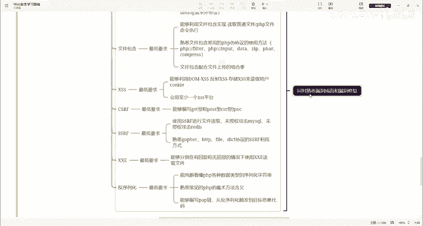

同时直接也打了个大括号，成因和漏洞修复是基础的，每个漏洞都还需要掌握这个。

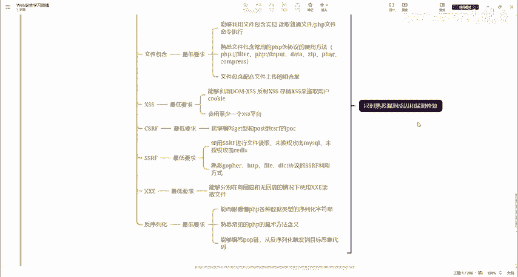

然后再来聊境阶学习。

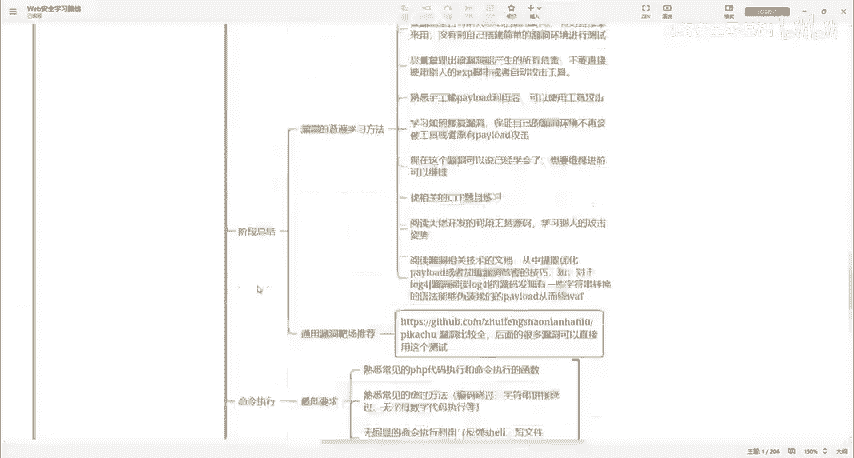

把这些掌握了，我认为你已经入本了。他这里你已经入门了，你已经是一个合格的we部手。

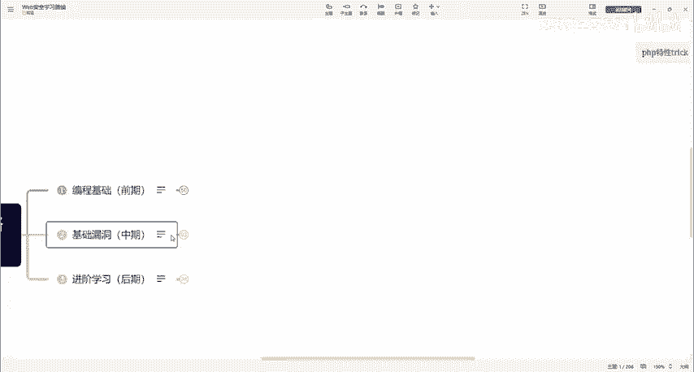

理论上理论上来说，我认为后续的学习，你可能自己应该也知道该怎么去搞。应该不需要人教，但是我这里还是给出进阶学习的一些建议，就如何去继续提升自己。

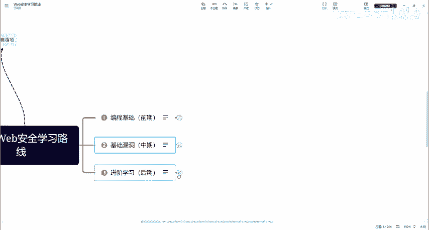

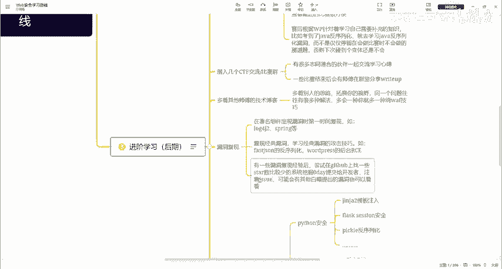

到这里之后，你肯定是有一个参加比赛的水平了了。

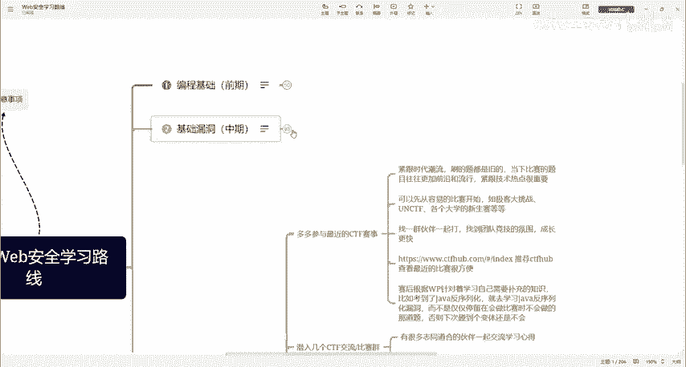

除非你们学道很卷，你可能勾不上啊，太卷了，没办法。好，到近去学习。我们首先一个就是多多参与CTF赛事。你前面在靶场上学习，刷老旧的CTL学习都可以，但是终究少了一点味儿。什么啊？时代的味竞技的味。

你需要去紧跟时代。

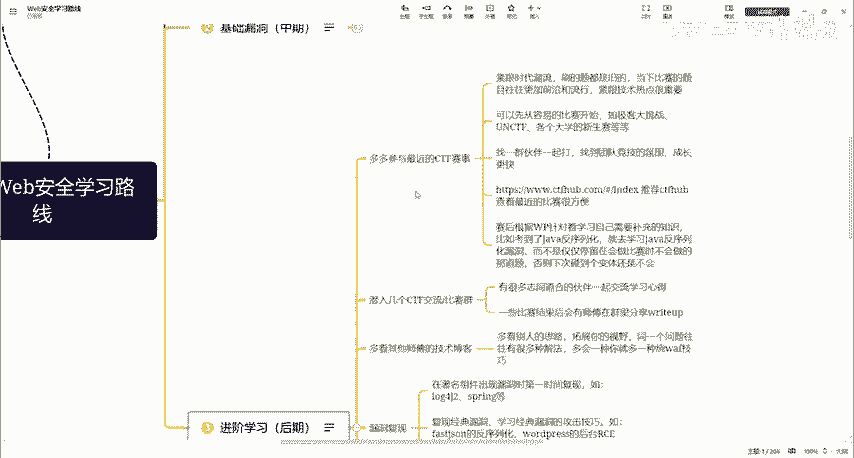

呢位。随时随地，就比如说啊在前几年的时候，可能go的题型就够语言不是那么火热。在GDF中见到的很少。但是近近些年最近这个够的题就特别的多。

就各种很多安全研究人员都挖了一些go的一些小trick小技巧都拿出来考了。所以说。你一定要紧跟时代潮流，才知道当下的比赛他会出一些怎样的一些。技术难点它会出一些怎样的技术问题。

你才能够去紧跟安全的一些热潮嘛，对不对？

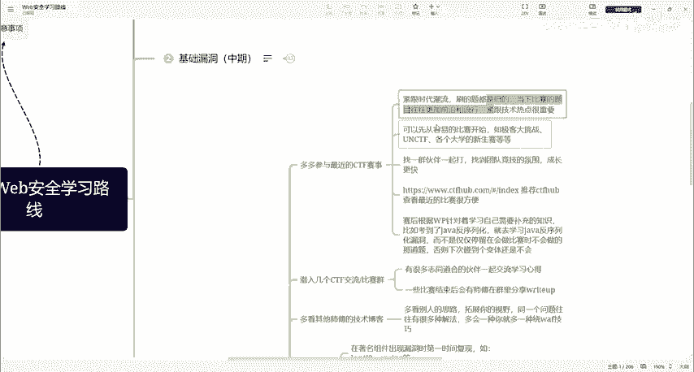

然后。对于一个刚学完这些编身基础技术劳洞的人来讲，能力肯定是不是很高的。所以说为了我们还是一样，为了我们积极的正反馈，我们最好先从荣易的比赛开始，先打一些新生赛。就比如说几个大战USDF新各大学新生赛。

现新生赛里面可能。那群人很厉害，就有些心生，他是个假心生运懂吧？他心声很强的，不要被别人打击到自己心。你要知道他们都很强。所以说。能有输出就是成功，没有输出就是成功。然后还有一个就第三点就是找一些。

但是新春赛已经虽然我说有一些青生他很强，但是新春赛已经是相对而言比较简单的了，所以最好还是先从新生赛开始。第三点就是找一群伙伴一起。一个人干也可以，但是最好找一群伙伴，这样的话相互之间有一个促进作用。

并且找到那种禁技的感觉，禁技的感觉，有禁忌，有压力它的动力嘛。

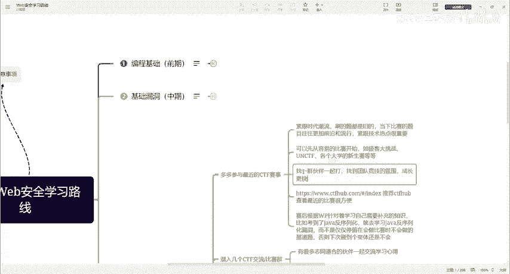

第四个就是推荐一个呃比赛的网址，从CTF hubb。里面去看一些最近的比赛很方便。第五点就是说我们在比赛后如何通过比赛成长，如何通过比赛成长，就是要赛后是积极的去找别人WP你要巩固学习。

你要每次打完比赛啊，打完就完了打完就完了，开板那白雪是不是白雪。所以我们要找WP发现自己哎，哪个地方是我之前不懂的。比如说自己说了，考造了java反区的话哦，我之前没了解过这个东西我不会。

所以说为了去系统的学一下java反区化的漏洞。这样的话呢下次碰到的时候，我就能够去有应对。如果说我这一次是。加反的话我已经就是之前就学过，但是这次我还是做不出来，那说明什么？说明你可能是在这个地方。

有一些小技巧你是不知道的。就比如说下傲粉去花绕过白名单，你可能不知道这个方法，让你通过别人的ra文你也能学习到一些技巧，能够优化你这个漏洞的一些功底，对吧？

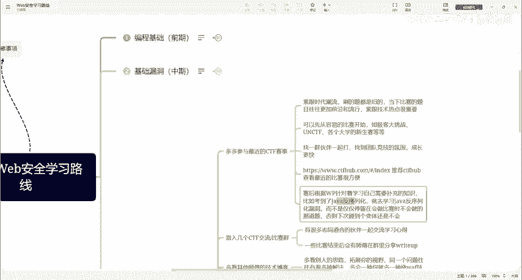

就针对的去补充你需要的知识，就没必要去。这个阶段你没必要已经我觉得是没必要去主动的去获取知识了。基本上是在比赛中被动的获取，就被动的发现自己的问题。

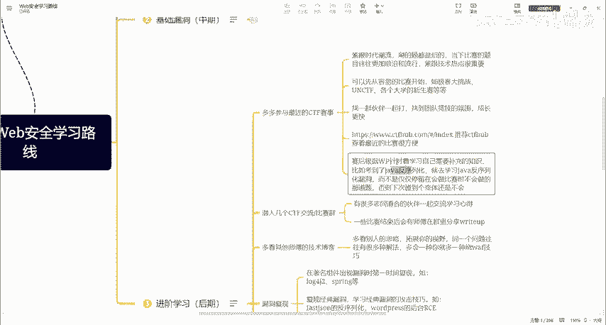

第二点，我认为你应该潜入几个CDF交易群，这肯定是你只要打比赛，你经常就会加到一大堆群嘛。这个时候里面有很多志同道合的伙伴一起交流。并且在这在这些各种各样的比赛群里。

你很容易去获得别人的right up。

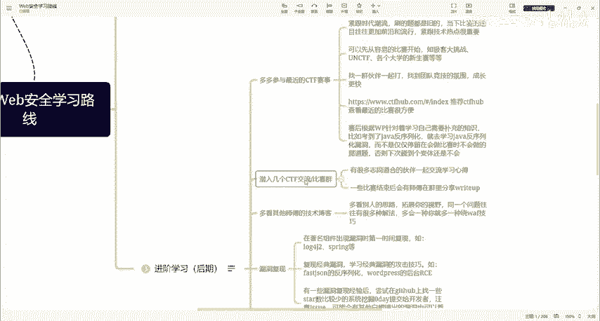

第三点，多看别的师傅的技术博客。在你学习的过程中，你肯定会遇到一次大牛，你把他们关注一波。关注一波，关注一下他们平常发什么技术技术难点，他们经常会发技术博客吗？看一看，对吧？

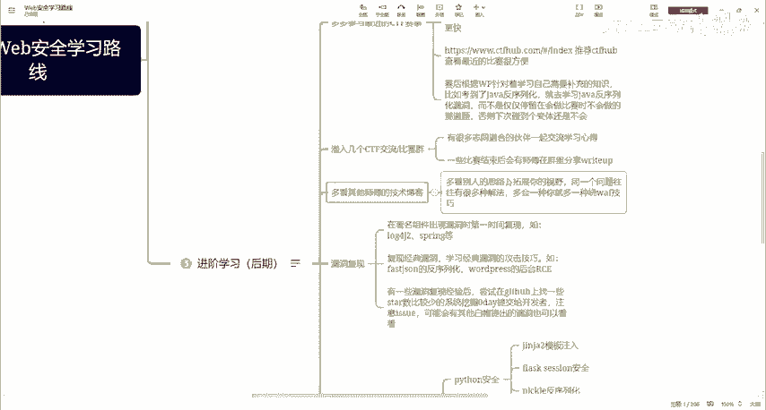

多一种思路，多一个技巧，看了别人的总结下来就是你的了。对不对？

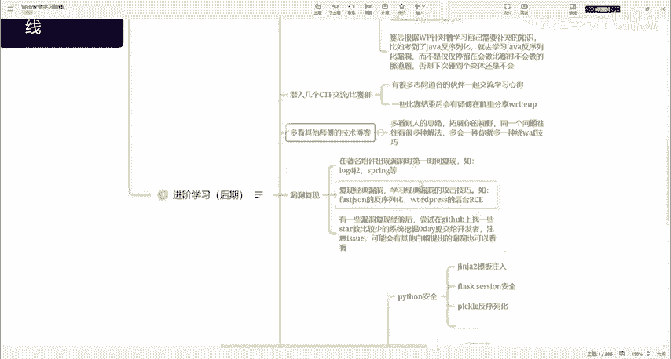

第三个，漏洞腹现，这是你后期提升自己一个很重要的一个。步骤。漏洞腹线你一定要掌握。在比如说第一点，在著名组建出现漏洞时，第一时间复建，你为了还是一样，你要紧跟安全时代的浪潮，一个漏洞，它越新越有价值。

对不对？所以说在著名组建出现漏洞的时候，你要第一时间去关注它。去寻找原因，去复现他。然后就是复现经典漏洞，除了著名组建最近出现的漏洞以外，还有一些老漏洞，它很经典。虽然说它很老了，但是它。

可能会有一些呃著名的攻击技巧在里面。所以说你需要去学习，就比如说fa jason反式的话，wordpress后台CS。耳熟能详耳熟能详的漏洞。需要你去附建。第三点就是。你在有一些复建经验之后。

你见过很多的。N对漏洞了，那你就可以去尝试自己去挖一些零对漏洞，找一些star数比较小的系统去挖掘，也是为了正反馈嘛。从低从容易到难，对吧？star少大概就是一两百左右吧，一两百左右的系统。

你可以去挖它的领队，一般来说都是挖得到的。现在很多安全系统做的不是很好，你找那种一两百star他们的。更新迭代的次数不并并不是很多啊，漏洞其实一整一挖一大堆。然后你注意看II里面可能会有其他的。

白猫他也会在里面挖漏洞，会发在哀树里面。你可以看到。看到别人写的漏洞分析报告。这也对自己是一种提升了。

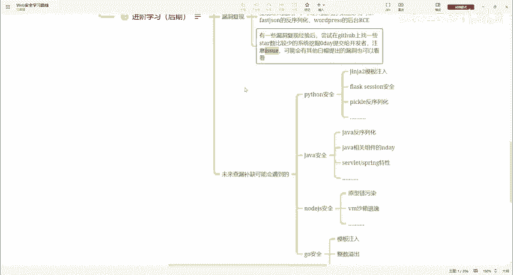

然后这里还写到了一些未来查漏补缺，可能会遇到的，说了，你后续应该是被动的学习，应该在比赛中逐渐的提升自己，你后续可能会遇到的一些。

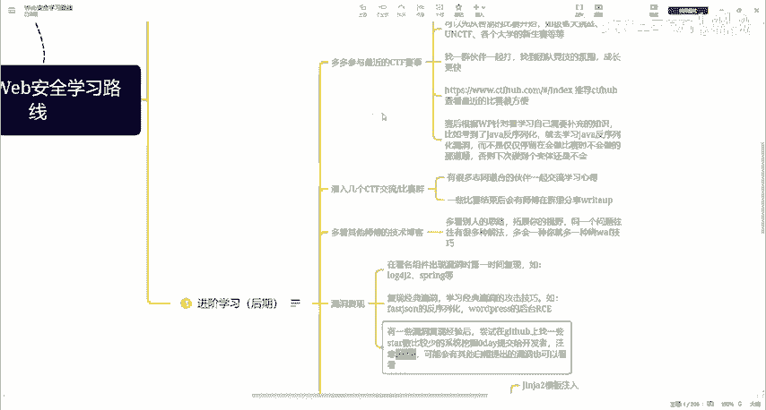

一些问题。派摄安全啊、加完安全啊一些东西。这些东西每一块都是一个很大的话题。肯定远远不止我写到这么几个，写到这么几个只是CDF里面常考的。对于这里面每一个领域，其实都是一个很细分的一个对象。而且如果你。

后续做研究的话，你可能就不再是像学CTF的时候呃，学的这么广，那里学一点，这里学一点javapyythonn JS go全都会你可能不是这样，你可能会深入到某一个领域去往里面深钻，你可能会这样。

那就是每个人后期走的路线不同。然后还有你可能会也是也可能会离开CTF领域呃，进入渗透红队的方向。那也是另说了。

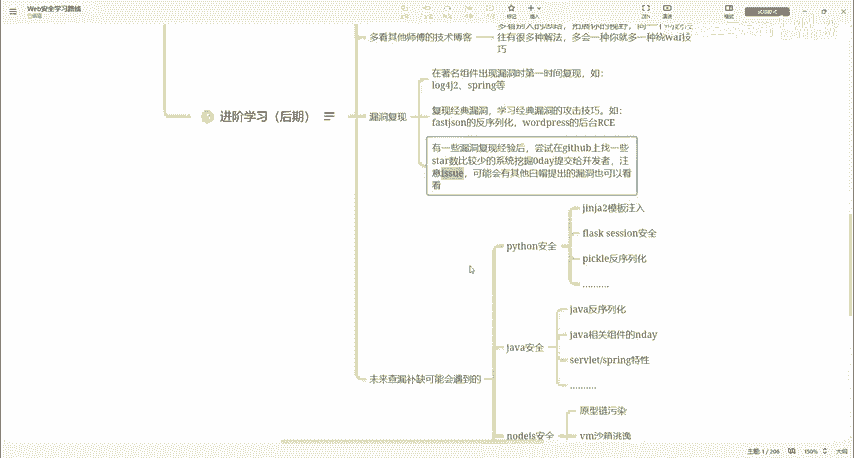

这里我只说到DKF的过程中该去做什么。

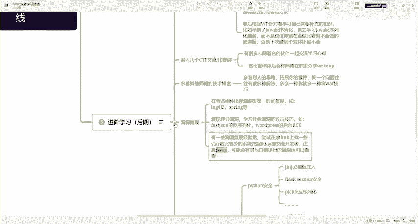

那么整个路线大概是这个样子。

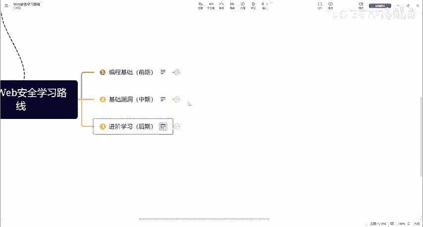