# 2024年网络安全CTF全套教程（CTF比赛必备常用工具，CTF零基础入门学习路线，CTF核心真题解析、CTF综合测试训练、项目实战解析） - P6：4.5.CTF夺旗-SSH服务测试（拿到root权限） - 网络安全零基础 - BV1SN4113784

呃，好，大家好，呃，我们继续呃来进行root服务器。上节课我们讲到哎已经使用martin用户登录哎这个服务器，并且查看了martin的对应的权限和它的用户组。使用到ID命令。

发现哎我们当前登录这个marin用户，并不是哎我们。想要的这个root权限的用户。所以说我们需要提升对应的权限。因为咱们一般情况下，这个flag是属于root用户和root用户对应的用户组。

在进行提全之前，我们可以哎使用以下几条命令，来，查看一下对应的配置信息。首先，cat杠ETC杠PASSWD查看所有用户的列表。

我们在哎主机里面实现一下。cat杠ETC然后PASSWD回撤查看哎所有的用户组，哎，所有的这个用户。

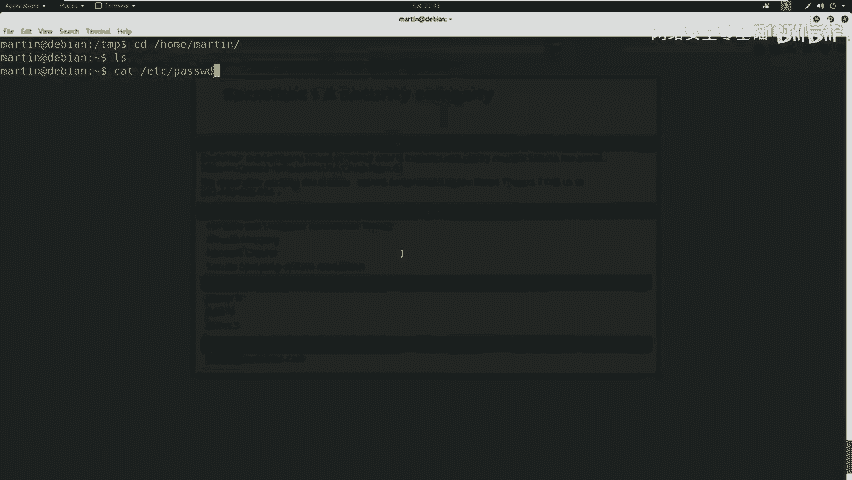

会发现哎，这里有jimmarin heading以及一些其他的啊系统用户，哎，以及这里有root用户。除此之外，我们还可以查看一下哎这个用户组使用cat ETC group。

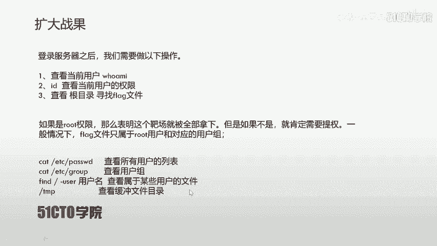

cat ETCGROUP回车哎，会发现有很多的用户组。这里有handingmartin j哎以及一些其他的系统用户组。

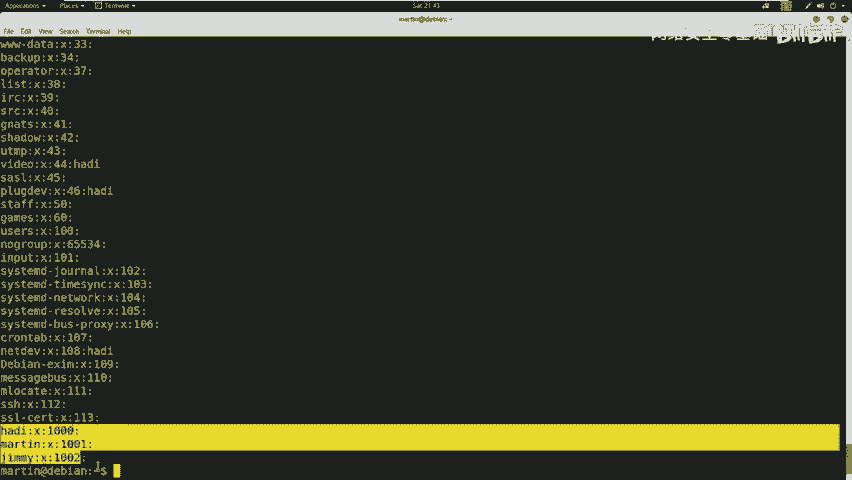

除此之外，我们还可以使用fide，然后再根目录像，哎，以及加上杠user这样一个参数，加上对应的用户名，查看哎，属于某些用户的文件。除此之外。

我们还可以查看一下哎这个敏感目录缓冲目录TMP查看是否哎具有一些临时性的文件在这里。这时候哎咱们就查看一下这个缓存哎文件目录。

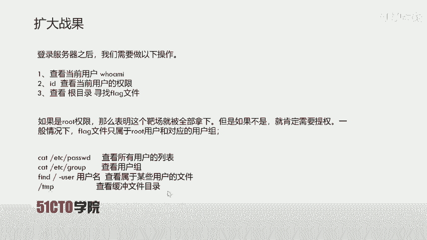

这里。CD且切换过去L在这里哎有1个1点PY哎，这个1点PY哎是我之前自己上传上去的。如果说哎没有这样。我自己上传这个文件，那么这里啊是不具有任何可见的文件。都是一些隐藏文将。

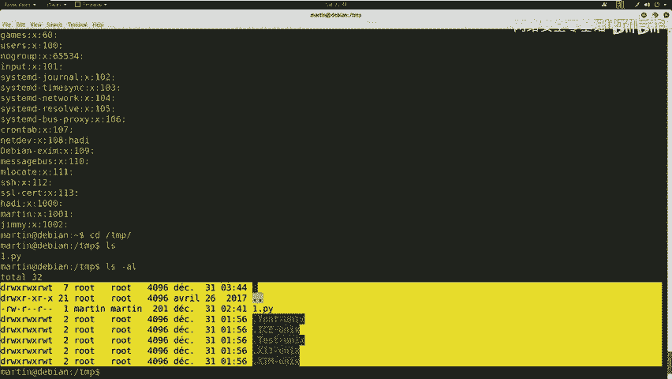

在看完这些信息之后，哎，我们发现也没有任何可利用的东西。接下来就给大家介绍一下，哎，我们这个深入挖掘的哎某个目录，哎，某个特别值得关注的位置，尤其是在CTF比赛当中。

这里哎首先给大家介绍一下这个ETC下的哎CRONTAB文件。这个文件哎是设定系统定期执行任务的这样一个文件。当然，哎，对于这样一个特殊文件是需要root权限来编辑的。通过这样一个文件，哎。

不同的用户哎可以设定在不同的时间执行不同的任务。那么咱们在CTF比赛当中，哎，需要大家哎经常来注意这样一个文件。通过来它来提升对应的权限。挖掘哎，在该文件中是否有用户设定了哎对应的这样一个任务。当然。

这个执行的任务肯定是咱们这个靶场机器上的某个文件。如果说在当前文件下，哎某个云用户有定时计划任务。但是哎在这个目录下面并没有这个定时执行的文件。这时候咱们就可以利用这样一个弱点。也就是。创建哎该文件哎。

并且编写对应的代码，让该靶厂执行，然后返回给咱们公积金。咱们公积机只使用哎netca进行监听，就可以获得该用户的权限了。如果说哎。该目录下是有这个文件的，哎，有这个执行文件的话。

那么咱们就可以切换到对应的目录，查看对应的权限。查看哎这个当前的这个用户是否具有读写的权限。如果有，哎，咱们就直接执行一下，看这个文件是否可以反弹回是。

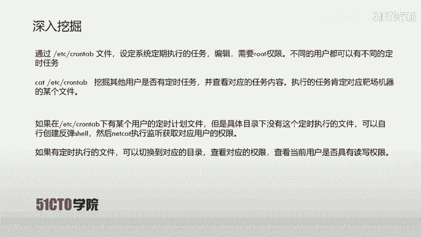

下面呢哎我们就来操作一下。首先哎天材下。CAT哎，因为咱们哎这个是具有一些延迟的。cat杠ETCCRONTAB回撤。

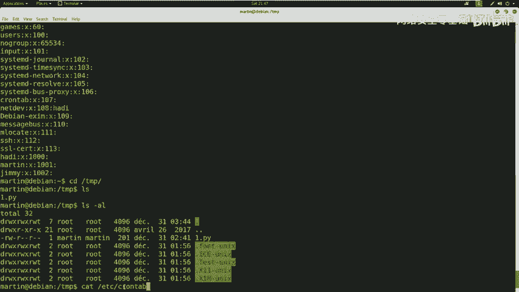

咱们看一下这个定时哎文件内容，这是它的注释，这是它的sell路径。哎，这是它的定时任务。这里我们可以看到，哎，这里有很多这个root用户的这个定时任务。哎，咱们也可以看到jim用户哎。

在这里有一个python类型的任务。在TMP哎，这个临时目录下有这样一个哎文件是每5分钟哎执行一次。但是哎咱们在。这个tamp目录下并没有发现这样1个SEKURITY点PY的文件。

这时候哎咱们自己编辑了1个哎1点PY哎来进行。复制哎来进行从命名成这样一个文件。通过定时来执行。下面咱们来看一下如何编写。哎，刚才咱们一个闪反弹效的代码。首先这是咱们要在哎那个。

反弹文件当中需要写入的代码。首先哎是一个环境变量的书写，接下来哎是导入OS和sub processcessockcket这样三个模块，接下来创建一个套阶字。然后使用哎套接字连接到，哎。

也就是反弹到哎咱们公积机的IP地址以及公积机监听的端口号。之后哎将标准输入输出以及错误输入输出。复制给哎这个套接字的文件标识符是套接字，哎，可以。进行标准输入输出和错误输入输出这样一个方式。

毕竟咱们执行对应的命令是可能出错的。然后哎使用紫禁程来调用哎这个杯子。sell啊也就是sell的交互模式。哎，咱们可以哎进行sell的哎这个交互执行。也就是咱们执行成功了啊，返回对应的结果，执行不成功。

返回对应的错误。啊，在咱们卡利当中，哎，咱们可以使用N catt命令。来监听对应的反弹效，直接输入NC杠L来表示监听模式P哎表示对应的端口V表示返回详细信息。

咱们这里未占用的端口号是和咱们在代码当中编写的这个公积机监听端口号是一一对应的。咱们在使用端口的时候，哎，需要注意一点，就是查看占用端口。如果说这个端口占用了，那么咱们就不能使用对应的端口。

下面哎咱们实践一下。第一步，哎，首先在这里攻击机当中打开一个。终端使用nettstate杠PANwo。咱们可以看到，哎，这里我有1个444端口已经被占用了，哎，并且已经建立连接。哎。

这时候哎咱们暂时不使用这样1个444端口。哎，咱们使用哎。另外一个端口，比如说4445这样一个端口。NC启用监听LVP。4445不撤。哎，这时候咱们启动一个哎监听的这样一个。模式哎。

以及在445哎端口进行监听。V爱。咱们下面哎来编辑一下1点PY。首先查看一下一点PY。回撤哎，这时候哎是咱们这个hell反弹 shell的代码，咱们仔细看，哎，看这里跟咱们之前代码一样。😊，大家会注意。

哎，在这里哎我省略了哎两个步骤。两个参数哎，我们来看。呃，socket点AF。innet以及scketSO呃 stream。呃，这两个参数什么意思呢？是使用哎这个以太网哎。

以及这个TCP哎这样一个套接字啊来。连接哎这个公积机这样一个端口号。而在默认情况下是直接使。不加任何参数，也是这样一个。形式哎，它默认就是使用以太网的TCP哎，这样一个套接字。所以说哎这里我为了方便。

哎，就没有添加。接下来我们把它从命名为哎我们这个SEKUITY。木。1点PY。呃，然后是SEKUITY点TY回撤LS杠AL查看一下是否命名成功。我们会发现哎这里它已经命名成功了。这时候哎我们。呃。

ch mod一下加S，看是否具有可执行权限。拉讲一回去。这时候我们把它设置为可执行权限。但是我们会发现，哎，这是我们marin用户创建的。哎，并不是我们team用户创建的，大家可以看。进入用户。

所以说啊我们要等待一个反弹效要。呃，这个过程是很快的。这45，这是之前哎我用444哎来反弹的一个Sll。我们来看一下哎，是谁登录的这个sell，who am I回车，哎是ji。jiam登录的这样一个。

呃，夫妻。咱们接下来哎就需要深入挖掘这样一个信息。哎，我们再回到这里，看是否445反弹回来。可能这个过程哎还是需要对应的哎定时执行了。那咱们下面哎先使用444进行对应的操作。

首先哎我可以查看一下哎当前用户或MI以及查看对应的权限。呃，ID回撤可以看到这里哎，jim啊也是没有对应的权限。呃，没有root权限，哎，它和我们之前的martin哎用户的权限差不多，哎。

都是一个普通用户，哎，类似于普通用户组。并且我们并没有他对应的用户的密码和账号，所以说不能进行。SUSUro的直接提升权限。所以说哎在这里咱们也会发现一个问题，哎。

就是咱们并不能使用jim和maring这两个用户来提升权限。那么咱们这时候哎就发现前两个用户名是不能提升权限的。当然，哎，咱们并不是没有办法做了。哎，也就是在万不得已情况下。

咱们只能对哎刚才这样1个SSH服务进行一个暴力破解，破解最后一个用户名。我们来看一下，哎，最后一个用户名，最后一个用户名是heyHADI咱们使用哎对应的暴力破解工具，如HYDRAA和曼度煞。

进行对应的破解。当然哎，咱们今天并没有哎使用到哎这两个工具，而使用mattterpo。当然，哎在破解之前，咱们需要哎创建。这个破解字典文件。这里咱们使用哎比较知名的CUPPY创建个性化字典。当然。

在卡利攻积机当中并没有给我们集成这样一个字典工具。哎，我们需要在git up当中。阿来。下载这样一个文件，然后哎对它进行复权限。然后哎以这个交互模式来创建字典。

下面哎我们来在机器当中尝试一下这样一个命令。

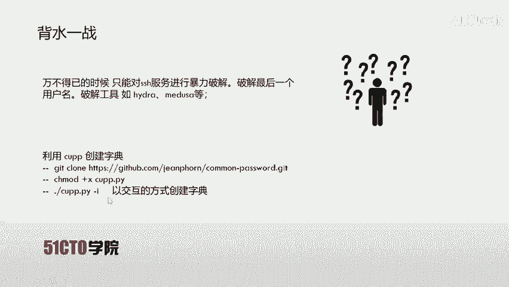

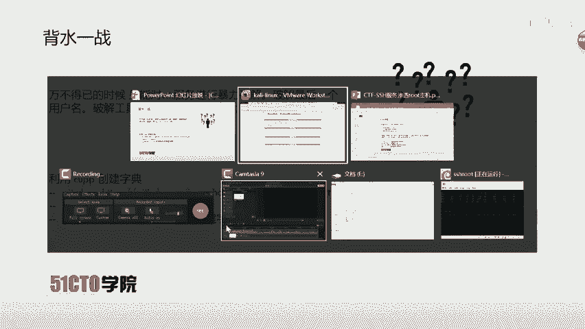

看这里。首先呢我再打开一个终端。CD。CD哎切换到哎桌面。D E S K top， al。接下来哎我们下载一下哎对应的这个字典文件。

Get clone H TPS Github点 c M Jane porn。Get clean。HTTPS。Get hub点 c M杠 G E A N P， HR Y N。然后是夸门。我车哎。

这时候哎咱们就开始克隆这样一个哎字典文件LS。我们可以发现，哎狂门pa已经在咱们桌面了，咱们切换到对应的目录。会发现有1个CUUPY降一文件。XCU哎，对他进行可执行权限的赋予维撤。之后哎。

咱们使用点杠表示执行，然后以交互模式来进行选择。这里。咱们因为最后一用户名是HADIheading，哎，咱们就加入heading火车。不撤不撤。一直回车。不撤。呃，and some keyword哎。

这里啊我不加入。呃，这里我也不加入。这里哎我加入。Yes。😊，呃，这里。呃，我选择no，哎，直接回撤。这时候啊我就创建了啊一个字典文件。创建完哎字典文件之后，我们就需要哎。使用对应的工具进行破解。

这里啊咱们介绍使用mattter spot哎破解SSH。首先呢哎咱们要在终端打开mettterpo。使用控制台模式，打开metalpotMSF controll，然后使用哎这个扫描模块。

然后设置对应的参数。

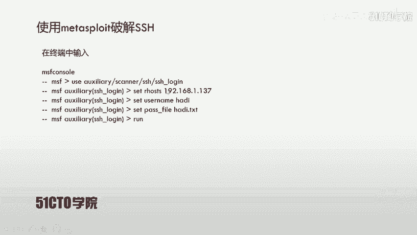

最后哎破解对应的密码。下面我们来尝试一下。

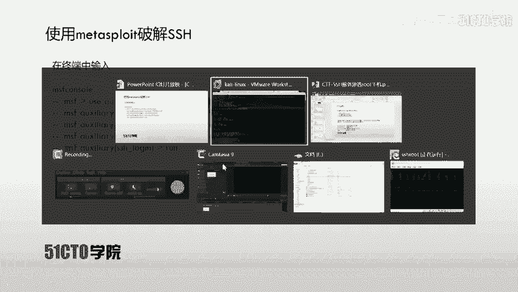

回车。呃，咱们这个maalpo哎是比较知名的安全工具，哎，它的功能是比较强大的，它其中集成了哎这个几乎所有啊的这样一个功能的安全框架。呃，接下来我们输入X音量scannerSSH。SSH。那姐。

我们这时候哎使用到这样一个模块。哎，接下来我们设置一下。它的参数。首先我们要设置一下。对应的远程主机的IP地址，192。168。1。106。回车set呃，然后是它的user。呃，Uer name。海底。

接下来哎咱们需要设置它的什么呀？设置他的这个。Password， file set。嗯。是。PASS。File。Desktop。然后是。开门。然后是hey带TST回车。呃，最后呢咱们设置一下它的线程。

这里设置为5。呃，最后哎咱们再查看一下是否参数设置完全。这时候哎咱们会。呃，发现哎这个yes的这样一些参数啊，咱们都已经设置完成。然后咱们把这个wall boss给它设置为t，哎，这样咱们就可以。呃。

返回可以哎每一条登录信息都会被查看到。之后使用run。这时候哎咱们这个暴力破解的模块哎就已经开始了。呃，咱们这个过程哎还是比较缓慢的，哎，咱们就耐心等待。最终呢哎咱们通过这样一个暴力破解，哎。

破解出它的密码是handy123。哎，咱们来登录一下这样一个handy。呃，这里呃咱们就不进行破解了，哎，直接给他进行关闭。直接set一个。P S S word。handy123回撤。呃。

Are you an brown。这时候哎咱们直接使用这个。handy123俺来远程登录。哎，这里还是进行尝试。我们把这个。back掉。use我们重新来操作一下use aux scanner。呃。

之后是SSHSS拉井。之后查看对应的参数set嗯PSS。嗯，怕是。Fll。回去。这时候我们先退出一下back。退出一下。MSF control。如果说咱们参数不能修改了，那怎么怎么办呢？哎。

就给它进行重新启动。哎，这是咱们比较按这个直接的一个方法。大家日常当中使用工具哎，不能重新初始化，那么就给它重启一下，不就解决了这样一个问题。Useザ a。Scanner， S， S H， S， S。

 H， logging。show option查看对应的参数se。远程主机。打机地址。Set user。Name。Hy that pass word。handy。123回去了。之后run。哎。

这时候哎咱们直接登录成功，哎，会给咱们返回哎一个sells，哎也就是绘画。Season。哎，回撤了，这时候哎咱们就打开了这样一个c。通过这个son，哎，咱们就需要哎进行进一步操作。

咱们这个son哎虽然说已经取得了sell，但是咱们来查看一下LS。哎，这个并没有哎出现像咱们真正终端那样的一个效果，并不能感知哎，它到底是什么一个情况。比如说像这里。

我们打开一个终端看一下咱们真实想要的效果。呃，咱们更多想要是。具有哎这个用户名和对应目录等这样一个效果。但咱们在新人打开的笑并没有这样一个效果。那么这时候哎咱们可以哎调用对应的pathon代码。

来执行对应的操作。进行一个绘画优化，使用pason杠CimportPTY哎，也就是把这个终端给它重新定向到哎咱们这个绘画当中所使用的一个模块。然后PTY点SPAAWA。WN哎这样一个方法。

然后然把base重新定向到这样一个绘画当中。下面咱们来执行一下操作。首先输入PYTHN杠C。引号import。Import PV。接下来输入分号IPTY点SPAAW。PAWN。呃，之后哎。

咱们输入哎引号杠。Bing杠被。呃，这时候哎咱们。这里哎应该输入单引号。哎，因为这里跟咱们之前的这个双引号冲突了。火车。哎，这时候哎它会返回一个heading类似于真正笑的啊这样一个命令行LS哎。

我们LS一下。哎，这时候哎他的反应还是比较慢的。呃，这时候哎出现了跟咱们呃真正命令行哎类似的这样一个命令行模式。我们想一想，哎，现在我们的目标是要提升权限，提升成root权限。

而且我们已经知道了用户名和对应的密码。哎，下面我们就来执行对应的提全操作SU。横杠，然后是root。

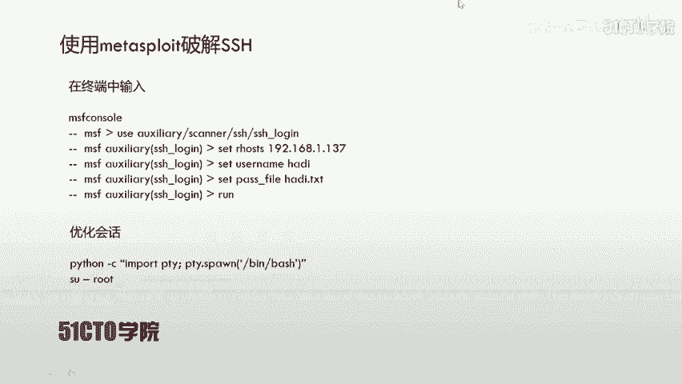

SU横杠root。来，让我们输入对应的密码，我们输入HADI123回撤。这时候我们会发现，哎，我们成为了肉的权限。我们长。

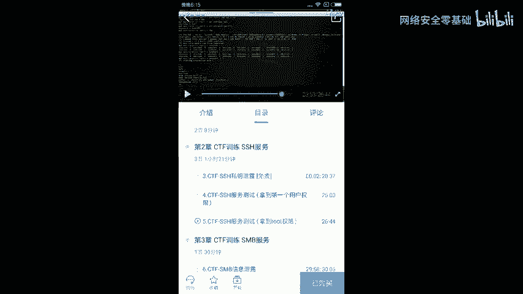

看一下who am Iroot权限，然后查看对应的权限，哎，是00号权限，哎，表示root权限。这时候哎我们有了root权限，我们就需要完成最后一步操作。就是获取flack。提升权限之后啊。

我们切换到目录寻找flash。当然，一般情况下，在CTF比赛当中，flag文件是存在root目录下，也就是根目录下。我们直接是用cat flag文件哎，就能获取到对应的flag值。当然。

大多数情况像这个flag是存储到flag点TST文件当中的。

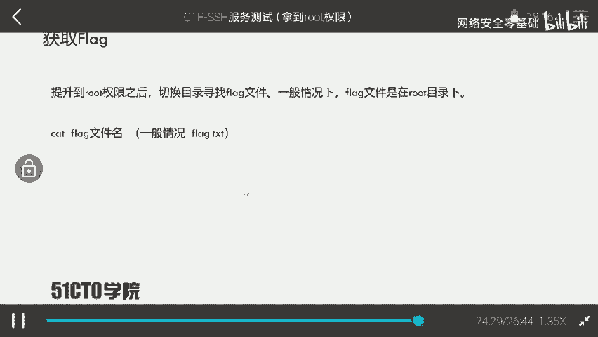

下面我们来查看假氟量het。首先LS。PWD回撤，我们会发现我们直接就在root根目录像，并且哎这根目录下有一个flag的文件。我们在这里哎看到了flag文件是用cat flagag。😡。

flag加T加器不撤。这时候哎我们这个flag文件已经被打开了。哎，我们可以看到flag文件，哎，我们这时候里边内容都可以看到。那么这时候哎咱们才真正意义向的哎拿到了主机的所有权限。

并且取得了对应flag。😊。

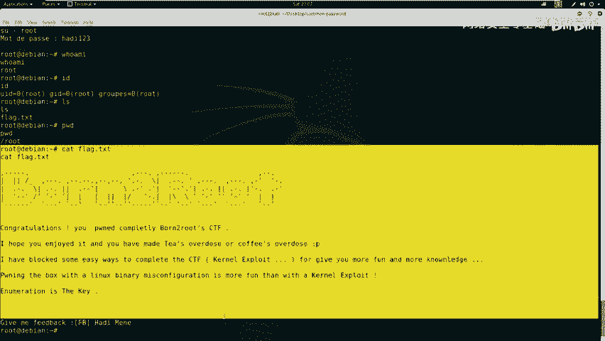

下面哎咱们就进行一个总结。在对SSH服务渗透中，大部分情况哎，咱们可以利用获取的私钥文件。哎，也就是IDRSA文件直接使用哎这个敏感信息当中的用户名和私el文件登录靶场机器。

但是也有个别情况是需要进行暴力破解改用户名密码的。通过对应的用户名和密码能够完成机器。😡，从这里咱们可以想象到，哎，通过暴力破解之后获得的用户名和密码是直接可以提升哎对应的root权限的。当然。

在CTF比赛当中要特别注意当TMP哎数据缓冲目录以及这个ETCc temp设置定时执行任务的文件。因为在这里tamp文tamp这个数据缓冲目录当中的文件在机器重启之后会消失。

而ETC cr temp经常哎是与tamp文件结合哎来考察选手哎的这个对应的能力的。所以说大家一定要注意哎这两个。😊。

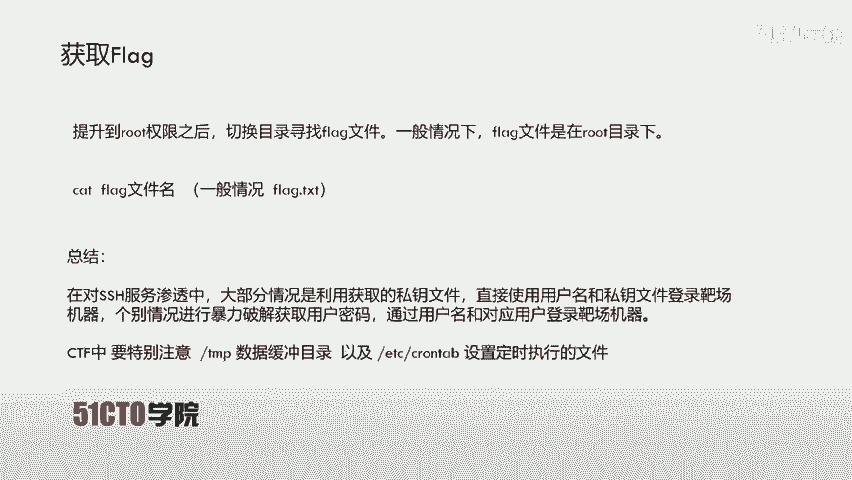

目录和文件。那咱们这节课就到这里哎这个。