# 2024最新pwn环境配置与基础讲解 - P1 - seyedog - BV1ssxgeoEmc

这个今天由我来这个为大家讲解这个呃二二进制安全哦碰方向。

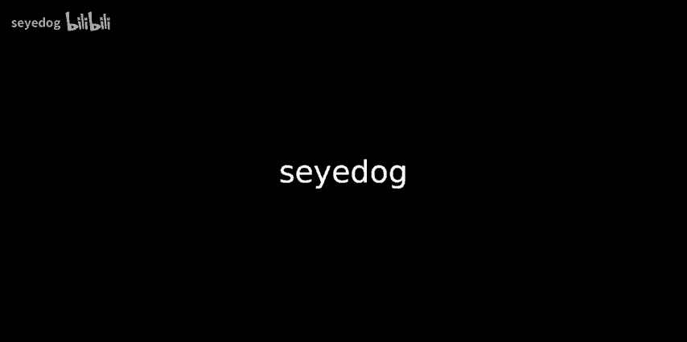

呃，然后这个。呃，然后就是我们。呃，就是从那个啥吧，从环境环境配置开始讲吧呃。

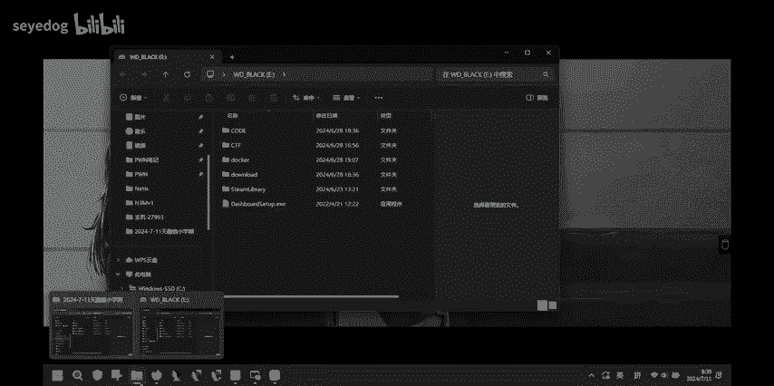

就是就大概今天讲内容就是一个胖的攻击展示，二进制，一个攻攻攻击展示哦，我就再讲一下这个胖的作题流程。然后还有就是linux的虚拟机介绍。然后这里就是我想大家应该都就是有装过这个linux虚拟机吧。

然后这个呃。呃，大家就是装是不是都是装的是这个卡里的，然后这个有有利用环境的这个大家要不在这个会议里扣个一。看看这个大家这个环境是不是都有。呃，然后最后的话就是讲一下这个胖常用工具介绍是。

这个做题过程中就常见的工具。然后后面的话就是这个呃linux可执行文件，就EF文件介绍。然后从这里开始就是主要就是操作系统组成原理啊，就计算机组员这部分知识。然后不知道这个后面如果要今天实验富裕的话。

就再给大家讲讲一个简单的这个就是战役出就是胖攻击手法啊，然后后面就是答疑环节，还有技术题目练习。然后今天看情况嘛，能讲多少，咱们讲多少。

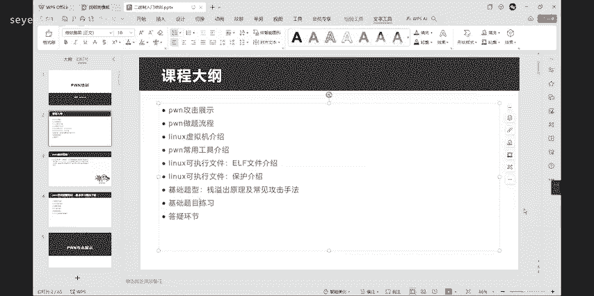

呃，然后就是看一下这个大家有没有。哎，卫衣去哪儿了？大家大家这个有没有在有没有有有有没有没有这个无光图的这个熏肌环境啊，就或者说大家有这个呃胖的环境吗？有哦有有无光图的这个环境。的等等呃，这个。

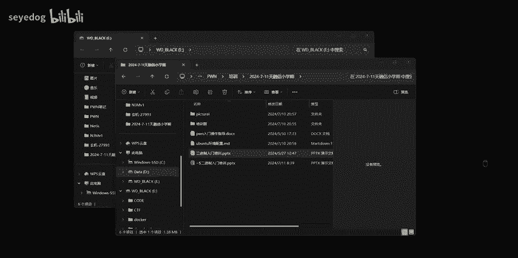

大家这个回复都不多啊，那这个我们今天就还是按原计划从这个环境配置讲起吧，给大家配一个这个干净的只有胖环境的这个呃这个污邦服吧。呃，这个我看这边咱们这边网挺快啊，然后我就从这个最基础的一个下载跟大家讲起。

就是就是呃就是胖就是在这个CTF如果要是有了解的话，都会说这个胖是CTF中比较难入门的一个方向。呃我好多人就说是这个。因为这个环境搭建呢，还有就是这个基础知识学前期知识学习，它这个比较难。

然后所以说这个环境搭建，我就想着从这这边开始讲，从们最基础的开始讲。然后就其实环境搭建还是挺好的吧，就。可以给大家看一下这个呃搭建好的一个这个环境。就是在搭建过程中，我也就是遇到一些问题啊。

所以说这个我觉得从环境搭建开始讲是有必要的。因为胖的有些环境也确实需要这个。

就需要有人带着你配一下，不然的话可能会遇到这种各种奇奇怪怪的报错。啊，当然如果要是你配过，那就这个呃可以这个可以跳转到这个一个小时后再听啊。这个现在这一个小时就是配环境时间。

我给大家展示一下这个一个就是完整的。

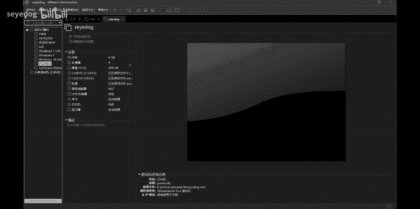

呃又环就是胖环境嘛。等一下，现在给大家看一下这个呃这个。

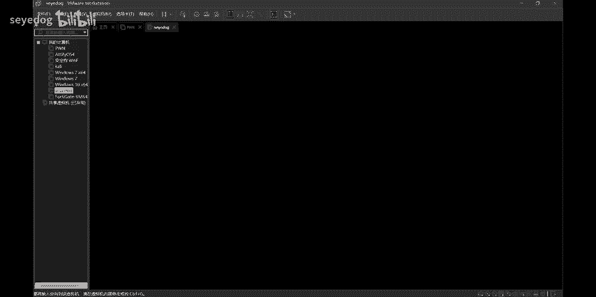

哦，对，这个时候大家可以登录一下这个这个平台，然后下载一下这个他这个ISO这个。吴帮图的镜像，我将发到群里。呃，这个咱们这边网速应该还挺快啊，就是大家下一下这个就这个ban乱的无网图destop。

然后这个ban乱的24。004这个全新版本的这个无网图啊，咱们就配一个最新的。呃，因为派旧的这个现在已经做题中不到了。然后不新不旧的呢，这个我觉得没必要啊，就不新不旧的网上有很多这个下载教程。

咱们要下去下一个最新的。哦后可能中间还有一些环境有些问题，咱们你们下载完以后，这个咱们接着说，就是我呃5分钟左右吧，5分钟左右这个应该就下完了。

我再给大家大家先展示一下这个我昨天装好的这个是新的这个无光的环境。

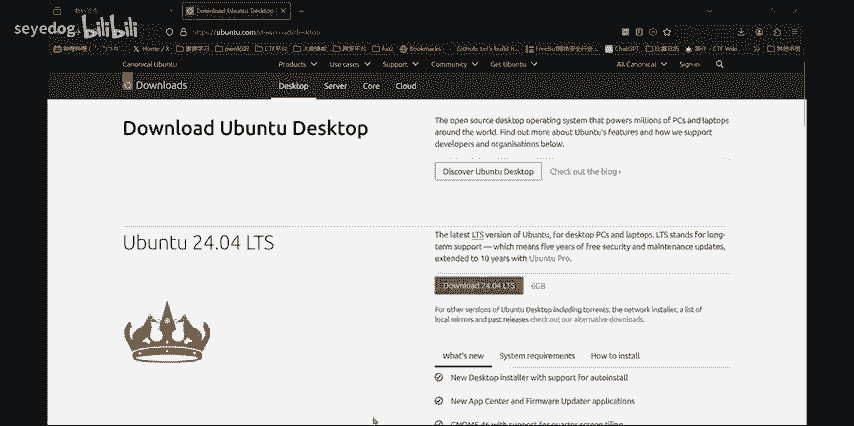

好，就是无邦图吧，就跟普通的这个卡利或者其他的这个业和虚拟机没啥区别。还有终端，我看这里我们装了一个这个。就好看一点的这个hell叫thethe shell。我这个呃看下我们可以。我们最开始的话。

光头应该是外水，就是长这样。这是应该是这个就是无王图的那个他他他位就启动的这个终端它叫gech。然后当然就是我们做胖题的一般的时候，就希望我们能远程在对面的机器上开启一个sell。这是其实是一样的。

就是他们都是一种这个终端就是执行语言吧。虽就是执行执行程序。我们看一下L看其实L大家应该知道什么意思吧。就是说在li姆这个终端上，然通过L展示当前路径下的这个呃文件。

就是有这几个这里我做了一个拍胖其他的这个应该就是大家装一个纯净的环境都是一样的。嗯，现在是43，咱们等到47。大家应该就下载好了，这个就55G啊，这边网应该会挺快的。不行的话。

大家就连一下这个无线有有有线网，这个有线网肯定比这无线网更快一点。然后5分钟5分钟肯定就下好了。就这个呃我链接发到这个群里了，大家下载一下。

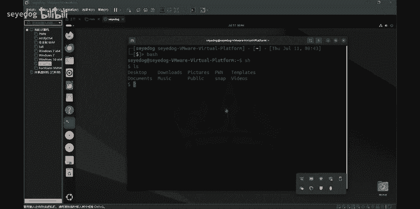

今はと。点进来是这个页面，然后点这个downlan呃，down录，然后这个。

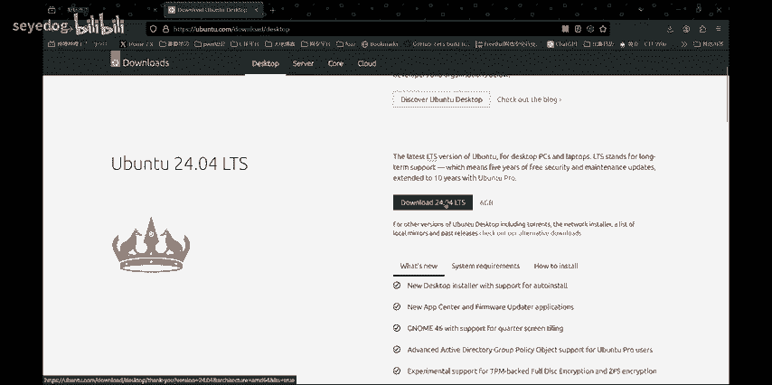

24。04这个LTS哦6G很快。好，我们接着说，这是这是一个这个 shellll，我们ctrol D，然后退出退回到这个上一上一层，上一层是这个dsh，干sh其实也是一个终端啊。

就是这应该是我们执行一个，比如说执行一个b shellll。呃C统名事可以这样执行呃。看也是这就是冰少，也是就是这个笑，他也会就是。通过这个呃，办事这个。命令它算是一个终端就是终端执行吧。

就是命令执行的一个这个程序。这个进程它调用了一个叫 shell的这个进程，然后就进进入了里，然后这个呢就也是一个这个就是可以进行在终端命令执行的一个这个就是程序吧进程退出退出然后退出就就退回到我们的 shell。

这是就是我们自己装的。一会我也可以装装一个这个后这个还是挺好用的，就是因为它进成一个很好用的功能。比如说我OS这这些文件，就是我邦普好像是不支持就是那个t键就是选择文件的这个我觉得就很方便。

比我们CD个P开头的一个程序，我们就可以这样选。

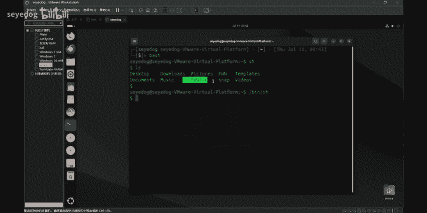

CD大家应该也知道什么意思吗？CD就是说呃进入进入目录的意思，进入这个文件夹的意思。刚才我们就是通过选择了一个文件夹，选择这个胖文件夹，然后就是CD，然后就跑到这个胖文件夹里，你看这是当前路径。呃。

然后还有的话就是说大家看一下这个，就比如说我们执行呃bing shell这个指令的过程中呃，在这个进程中到底发生了什么事情？我们用strastr指令，然后执行一个杠bing shell。呃，然后很。我。

最开始开始读，就是看这个这这个就这个叫什么？就是说呃我们在终端执行b shell，并且就查看终端，就是本生的系统调用。就是看我们执行这个str being shell的第一步，他就执行了这个。

CVE呃就是这个CVEXECVE然后冰 shell就是执行一个冰命令，然后传递参数是这个冰 shell哦，这里是一个。明时我字不错。然后之后之后就是产生一个这个系统中断，然后这是分配内存。

然后这是呃不用管。但是你看第一步其实就是执行一个这个系统调用。那我们往下看，这是打开文件打开文件打开文件，然后这是一个分配空间的操作gegeUID呃，这就是一个获得这个呃进程号的进程号的指令。

这是PID这是进程号。哎，好47了，那大家应该差不多就下载好了，我们把这个退出来。😊，嗯。好，这退出了。呃，他这里刚才我们一直输入，他没有这个反应，是因为啥？

他这个其实是那个后后台那个sha shell一直在执行啊，他就会一直read，一直想读我们这个输入。所以说我们广州C啥他退退不出去。州D直接退出那个这个那个票终端，然后他就。然后他他退出这个指令执行。

然后哎，他跳跳回来了就。好，就是如果把这个大家把这个下载好以后，然后这个VM木大家应该都装过吧。然后大家就点开VMM。然后点这里呃文件，然后点一个这个新建虚拟机。哦，之后的话就是。呃，经典就行。到。

下一步。然后之后的话就是安装一个这个光盘影像文件。然后这里文件我们就选刚才我们那个下载那个路径。然后我是在这个dockerSO里，然后这个24。04。

然后这个destop就选这个找到你们那个刚才下载那个SO的路径，最好这里我建议你们放到一个新的这个路径下，然后专门保存这些SO然后就是在你虚拟机迁移的时候，他可能就用不到这个SO了。

但是如果要你虚拟可能出现出现什么错误的时候，还要需要这个知道这个SO的位置啊，当然我也没遇到过这个还是建议大家保存一下。然之后的话下点下一步，然后就是选你这个Z全名。我们这里就选。那个叫什么胖吧。好的。

看了，然后之后。哦，感谢大家请。用我的其他名字宠，然后这个用户名我就也胖。哦密码的话。也是碰。嗯，然后密码框。哦，之后点下一步。哦，这个虚拟机瓶车也叫泡。哦，这里就是这里大家注意一下。

这里是选择你的这个安装路径这个。呃，建议也不要直接默认的，他默认可能直接C盘去了。因为你们VM威尔就是默认一般都是C盘，这个VM威尔可以默认入境，所以说就直接把你这个这就。问到C盘就不好了。

然之后我们选选择虚拟机的位置，然后点下一步。哦，这里最大磁盘大小，大家直接选个200G就行。这个他因为分配的是一个这个有虚拟空间，它是不占你真实真实磁盘大小的，它也没那么东西放200G。

所以说就是我们尽量选大。因为如果我们选小的话，在之后我们装大量程序，或者说我们搭建了在一个虚拟机里搭建了大量这个依赖，就是大量的工具的时候，哎，可能他这个磁盘空间不够了，那就难受了。

啊这个你给它扩容的话，还还得下点下点工具啥的。那你这还不如就刚开始在这直接选大。然后这个的话就是磁盘就是拆分多个文件就行。然后下一步。我斯钉硬件我看一下啊。呃，是。处理器的话，我们这里分配一下吧。

这里分配这个呃二盒2个，然后就是44呃，处理器4个四核吧，然后关闭，然后创帘开启去完成。然后把它创建下。

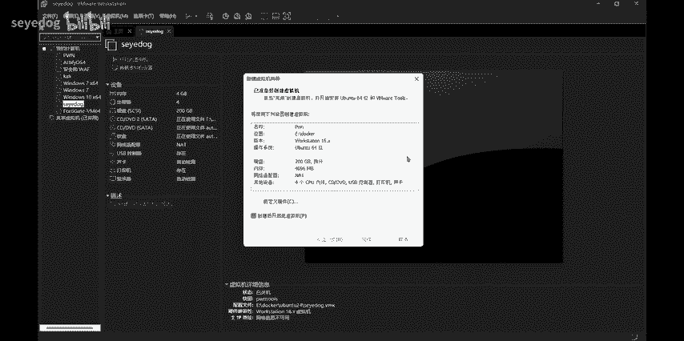

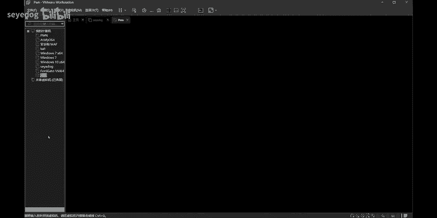

。呀我这个电脑复务有点慢。

我创创创创电影。嗯，这个就是在家创建过程中，我再给大家。

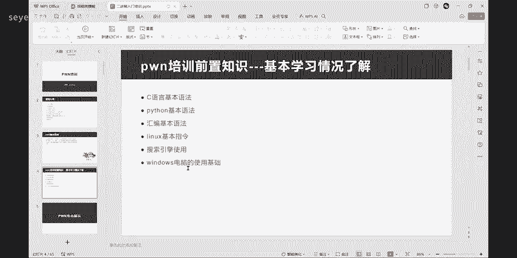

哎，手先好了。

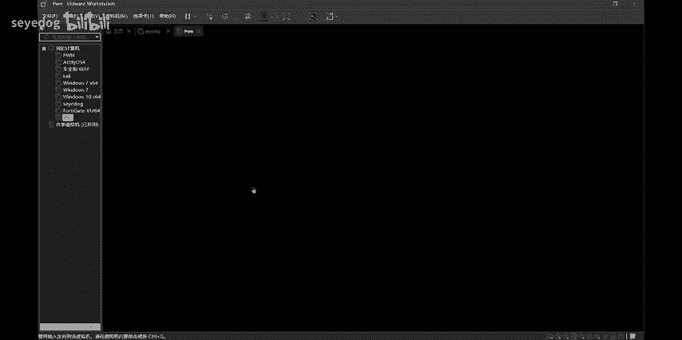

呃，就是给大家就是说一下这个胖就是前置知识吧，就是说这个二进制安全这个最基础的就是前置知识。首先就是我们一定要学过CC语言，就是大家应该应该这个都学过。然后之后的话需要有一定的python基础。

就是大家需要就掌握这基本的python语法吧。然后这两个是最基础，然后他就是说就是要有一定的这个汇编这个基本知识。可能这个汇编还要再加上一个这个。你呃操作系统吧。操作系统提出。

这就是需要有这两个基础啊啊，不过这个的话不要紧，到时候咱们这道题的话，我给你可以就是带大家分析一下。然后之后的话就是这个基本指令大家需要知道。然后就是操作系统的一些基本原理大家需要知道。

就比如说什么group啦，还有什么IOS啦CD啦，什么OMI啦PWD了啊，反正基本指令大家应该就是也需要知道。然后这个因为可能会用到。然后还就是操操搜索引擎的使用这个也很重要。在做题过程中。

我们基本遇到的都是新题然后新题的话就是。嗯，一般都是那种。可能会有你不会的知识点。然后这个时候呃怕CTF跟其他这个竞彩不一样啊，其他竞彩你有不会的知识点，那你完了，那你就肯定做不出来了。

但是CTF一般都是有不会的知识点，然后边学边做啊，这个是这个比较正常的现象。😊，所以说搜说引情也很重要啊。然后这个需要大家这个熟练掌握搜索引擎的使用啊，还有windows电脑这个使用基础。

这个其实呃跟大家说，应该这个是对大家来说应该没有什么难度啊。因为大家都是网人专业，这个肯定对这个电脑应该已经这个使用的非常熟练了。呃，我是这个比较这个。

震惊的是有一次我去那个就河南一个这个呃大专学校讲这个。胖胖基础，然后那边的话就是我给大家发了个压缩包，我就说这个里面是各种工具，大家这个解压一下，把这个工具下载下来。然后反正是就是半天没事。

然后下去一看，有一半同学这个不知道怎么解压，然后解压的话就是啊这个默认工具，然后点点点，然后点开以后，这个解压到了这种各个各种奇奇怪怪的路径啊，然后里面有这种各各种奇奇怪怪的这个反正这种各种文件。

然后妈呀就是不会用这个解压啊，这个也是我挺挺震惊的，可能这个确实这个这个使用者之间的参差吧。所以说呃其实windows量使用基础，这个后面刚开始我没解答。后来想到这个这种这种现象，我还是加上了。

就是说大家可千万别上学4年以后不会用电脑啊，至少这个。😊，是吧对玩游戏我觉得大家应该也把这个电脑给用输了。

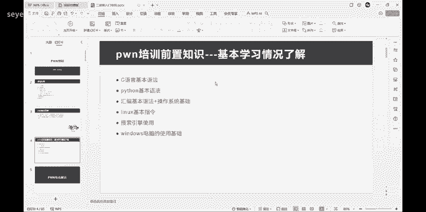

哎，好，他进去了。然后这里的话我们就接着配置这个呃雾光图，然后就是。呃，这里语言的话其实应该有中文啊，我找一下。呃，但是其实我是建议建议之力，大家都选英文。选中我还神秘吗？因为选。英闻的话。

它那个报错就是更好看啊，就是那报错就是纯纯原原生态的报错啊。你这个比如说你突然这个找不到他这个哪出问题了，这个把这个。无帮图的源码你下载下来，然后你直接去搜他这个报错比较好找。但中文也可以，大要不。

反正这个最后就是跟大家要用，就是大家大家要投票选择吧，投票这个在在这个叫什么？呃，在这个这个这个评论区，大家。那聊天区大家投票吧，选一就是英文，选二是中文。看看大家喜欢用中文还是用用英文选选选一个吧。

一一是英文，二是中文。英文OK你的你就英文。还有什么？一好好，就都是都英能用英文吗？就。呃，然后之后的话就是选择下一个哎。要签到。啊，他这个怎么找不到我的鼠标了？有。哎，怪哉那个怎么怎不能跳到下一步呢？

哦，好，n行。哦，之后这些的话。好，你调一下我手边。有鼠标还有点难受。我，这里X草好不见了。我们白看看看这有什么。也给给他都关掉啊，这些没有用的东西，咱们也不会在里面听歌啊。如果要装双系统。

你可能可能有些东西你要开一开，这就没用关了。这里的话就选择这个键盘键盘我们就选english啊，千万别选成什么UK或者选个什么中文。这样的话你这个输入S，它可能就可给来个无比，那可真是费死劲了。

广州下一步。05用联网。哦。这是要装一个这个新的版本，它是好像又有新的这个可支持版本了，挑过不装。我，这个。没意思，我网了不用管。这个的话。这叫啥，这是word着就。默认默认就行。我之后的话。

第三方哦这个要装一下，这个装一下。就这两个选项啊好下一步。哦。为什么。哎，这个我看一下。

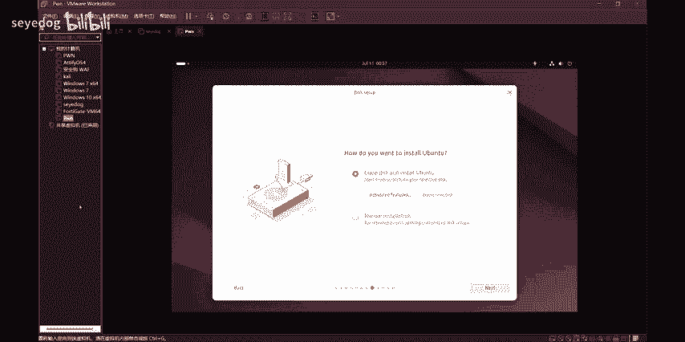

呃，但是确实啊这个英文就有一一点不好，就是说这个。呃，英文它可能会出现就是啊你这个你有点读不懂啊，读不懂他到底要干啥。这个啊我也这个懒得懒得去读了，就看一下他这个到底什么意思啊，这就是英文的不好这个。

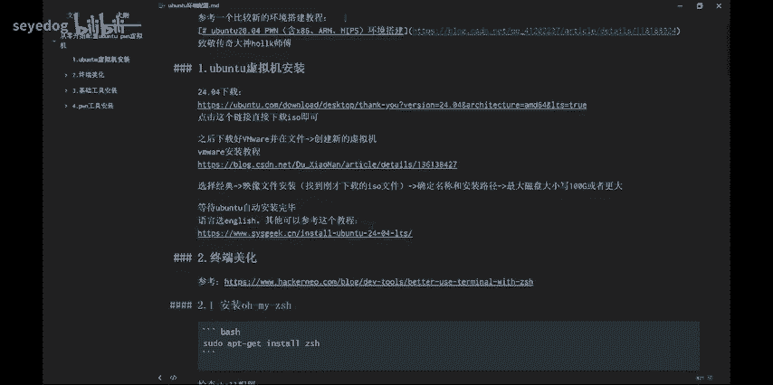

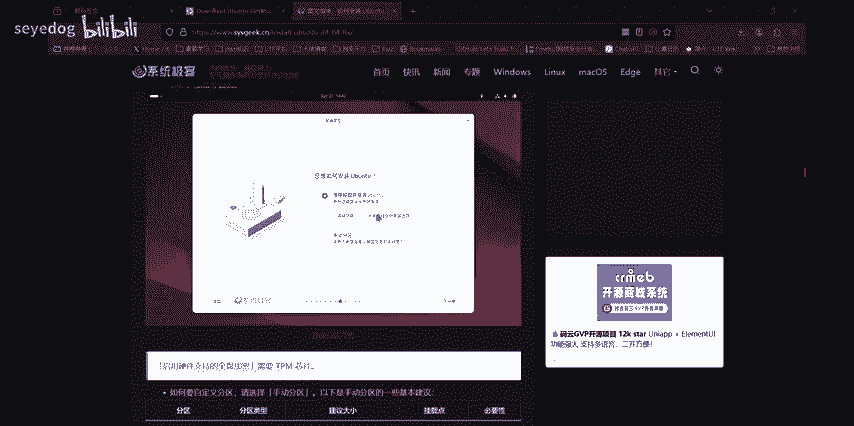

啊，你像这个擦除磁盘地安装无网图，手动分区啊，我们肯定不选手动分区，手动分区太累了。

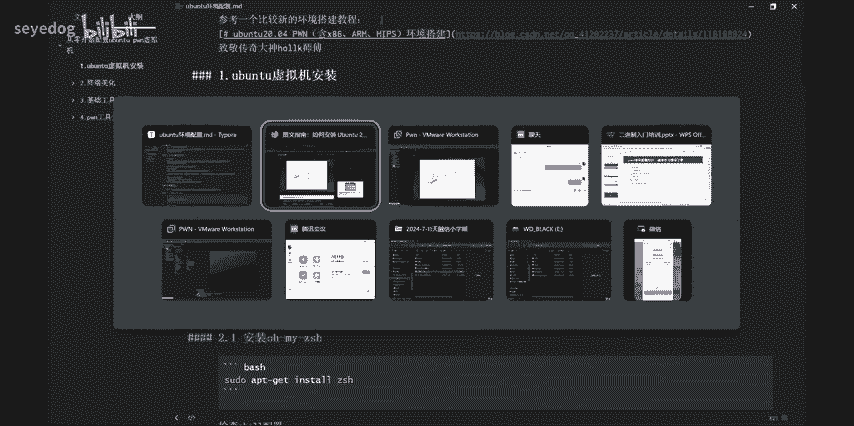

加油。然后之后的话。也。呃，就是创建你的这个。哎呀妈呀，他一直在闪。我们直接创建用户就叫放就行。然后这个他名字太长了，太长了不好，我们它删掉。OVM的了，就这是他的那个这个叫什么？

这个叫它viM virtual，这是一个它的这个磁盘的虚拟虚拟磁盘路径啊，这个虚拟虚拟磁盘的虚拟名字啊，我们不管他，我们把这个加个VM就行了，不然它那个太长。这样我上次主踩坑了，那个太长了。

路径啥也没有，就给他常常的这一串它名字了。有里pas word的话，我们就也是怕。哦，那什么没问题啊，下一步。哦，市区的话就选择中国上海就行。下一步的话，这里就是呃配置给你检查一下，不用管了。

我们直接下载。呃，这可能又要下载个5分钟，因为可能大家还再等一下。风享到哪了？

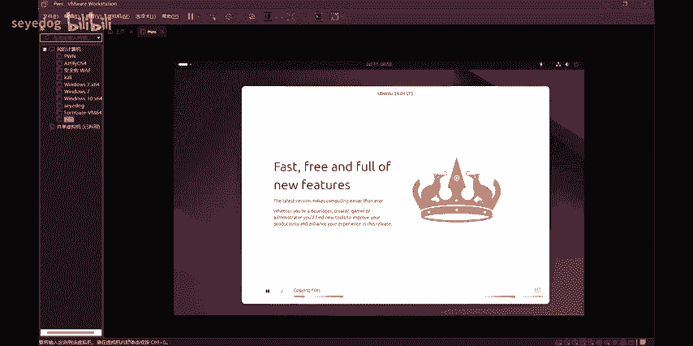

啊，刚才讲到这个胖子前身知识啊，就是给大家讲了一个这个不会用这个解压软件的小故事，这个真是令我震惊啊。这个有一半的人啊就感觉有一半的人就不会用这个解压软件啊，可能也没有一半那么多吧。

可能是有一部分这个玩手机也不搭理我。这个那个我倒是觉得很正常。但是。反正就是感觉还是很吃惊，很多人就不会就有几个这个在保好听的，他不会这个就是磁番，就是这个叫什么压缩包血压。

其实讲到当时我就已经有点这个就是心生退役啊，就因为你就。windows这个技术太差了，我我不知道该从从何讲起了。哦，这是个胖的攻击展展示的话，就这个一会儿带大家做，就是给大家展示一下这个胖到底是在干啥。

他到底能干什么。呃，就是这里其实也可以跟大家说一下这个胖到底能干什么。呃。开一个画图软件吧。就是大家知道这个进程的概念吗？就是在这个操作系统中会有进程。

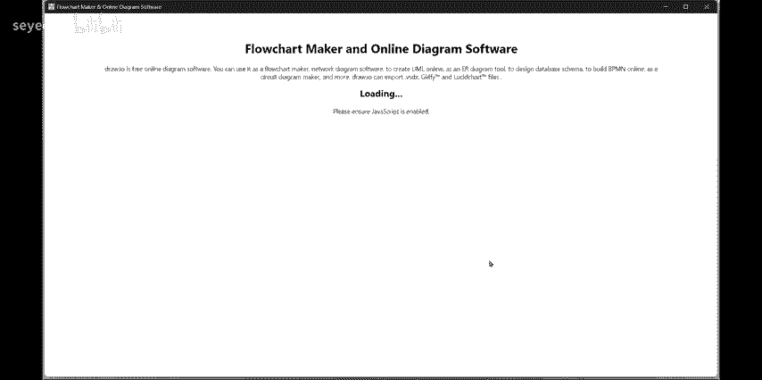

哦，进城是是干什么的吗？一般我们在进城上会搭载一些服务，就比如说我们。看一下我们的这个。系统windows的进程啊，你看这些其实都是进程。还有一个任务管理器的进程，有一个火龙软件的进程，还有一些病毒啊。

还有一些什么奇怪的东西的进程。啊，他其实基本程序都是在开一个进程，那他这个开了4个进程。就是说哎是四个进程，我要是啊这开的17个，这应该就是进程啊，就是说我们的所有服务到最后其实都是以进程的方式在运行。

嗯，那我们去操程序是如何找到这个进程的呢？它是有一个进程管理块这个。学习这个操作系统的同学们应该知道系统管理管是PCB吧，应该叫。嗯是。我们在这里选一个电脑，我们的比如说给他1个IP192。168点。

我1133点儿。第二个。01012。哦，这是一个电脑。在这个电脑上，我们运行的大量的程序。就假如有一天这个电脑能出网了，比如说它这是从内网IP变成一个公网IP。比如说10。101。101。

1好像就差不多这样点R2变成了一个这样的IP。然后也就是说在互联网上可以通过路由器之间跳转，然访问到这个。这个机器的这时候在这个机器的某一个端口下。我们搭建了一个服务，比如这个。我把。好的。

搭建搭建的这个服务。然后这个服务呢。呃，我们怎么访问他，就是通过。IP加端口号比2，可以访问到在这台机器下，某个进程下真的搭载的服务。那如果这个服务被我们黑客拿到了。我们这服务的源程序嘛。

就是比如说我们这个下载也是下载一个程序，可执行程序。这个程序被我们拿到了，我们通过印象分析发现了这个程序中存在一个漏洞。这个漏洞能导致这个程序越权执行。然后哎我们就想这个程序是搭载在一个远程机器上。

那我们黑客的电脑是我们这个另外一个在遥远的一个地方，比如它的IP是一个未知。哦。8通过访问这个公网IP下的这个可执行程序。呃，就是可执音服务。哦向你输入一段这个恶恶意代码哦这个。从而让这个程序崩溃。

或者说造成一些这个危害。然后最后控制了这台机器。这就是胖的一个过程。这个说起来是不是跟其他的这个攻击方向攻击方向就是其他这个方向也很像啊，外部可能也就有些这个做法。

比如说我们在这个呃这个这个22换成80。哦80端口下搭了一个还是8080来着？8080发了一个这个外部服务。然后这个外部服务里面也哎分析发现有一个这个呃ciirrcle注入漏洞。

我们就向它注入一段这个这个ciirrcle语句。哎，然后获得了这个机器，或者说获得这个数据库，这个机器中数据库的这个查询啊，或者说执行权限啥的，哎，没有执行权限的。

应该是呃执行那一段这个circle语句，哎，也就是得到了我们想要的东西，其实跟这个也很像。哎，但是一会儿大家分析可能就会发现这个其实也。还是有一定的区别。诶，没装好。我再装吧。

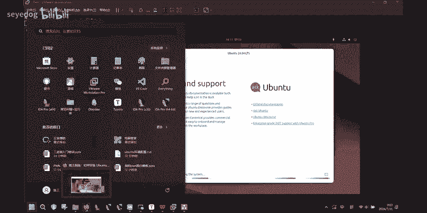

哦，就是。

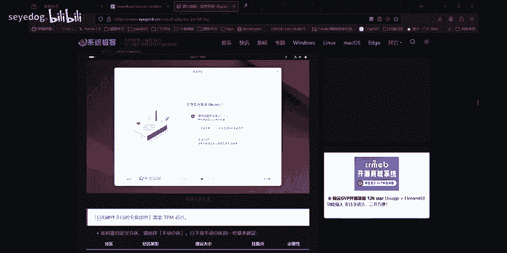

喂，你好。呃，这个也关掉了，然后。嗯。点慢呢，这个。

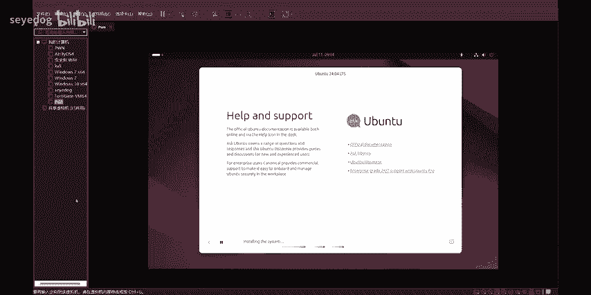

然后他先装着，我们看一下我们这个一会儿要要装的东西是什么。

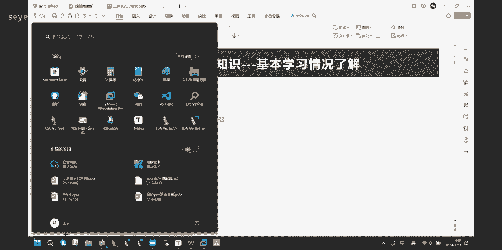

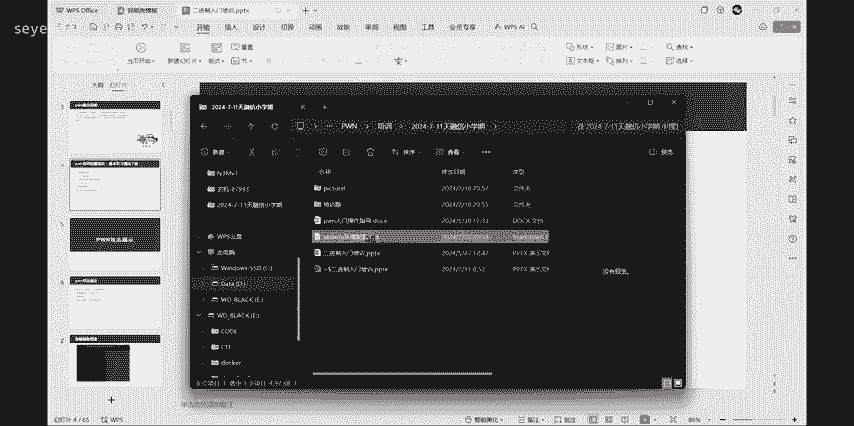

就是我们一会儿嗯怎么说先把这个虚拟机装好，装好以后，我们先做一个这个终端美化，就是装一个呃O shell。然后然后的话做一些基本工具的安装。

比如说我们装个GCCpaon3QumeGDB有远程这个GDB远程调试，然后之后再装一个这个。就是胖的这些工具，我们把胖兔子然胖debug，还就是。ro gadget，还有这个这个安全检查的这个工具。

还有这些pa的工具，然后armmiss这个叫什么动态编译的这个呃就是程序编译的这个链接库都给它装上。嗯，这个到时候给他边装边讲嘛，就是边装的，我们也可以运行一下那个指令。

然后带大家了解一下这这个我们要装的这些工具，它到底有什么功能，它到底就是在干什么。然后在我们胖题中它。

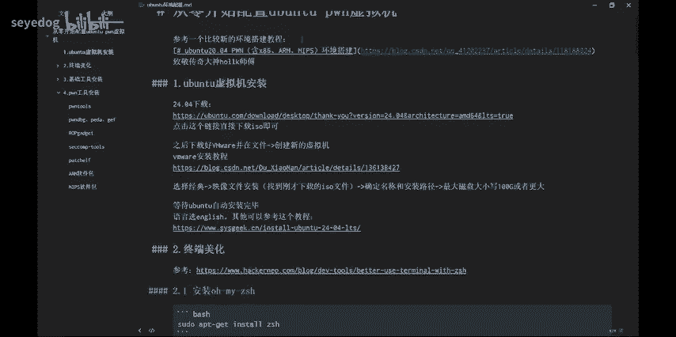

有什么用啊，我顺便给大家说一下这个呃就顺便大家在装。如果要是跟着做的话，就看看这个装的过程中是遇到的问题，可以直接直接在这个群里发出来。我们大家一起解决一下。但如果要是跟我按按步走的话，应该就是他报错。

也跟报的是一样的。

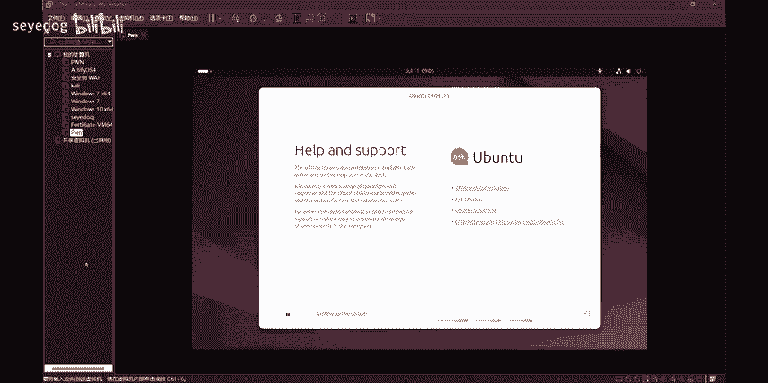

我我我怎么修复，你怎么修复，那应该也没啥问题。啊，当然就是我遇到一个问题是在这个it命令的时候吧。等我装勺的时候。啊，在这儿应该是我在这个就是装这个 pumppo的时候。

我把它的源码这个刻这个get下来了。呃，然后这个时候遇到一个问题是这个他报了一个什么错来着？呃，我想想好像是无法无法连接吧，还是怎么的？然后这个我网上查了一下，他说要解这个取消这个代理啊。

就是说个代理它关掉HTP和HTPS这个代理关掉，然后再再这个下载就行了。然后我还不行。然后我当时我当时是因为这个就是我及时把代理关了。但是那个代理程序就开始那个还在还在运行。

然后他可能是检测到代理虽然没没有没有没有这个进行搭载吧，但是他那个程序还开着，哎，就很奇怪，然后他就就还会报错，我把开始退出。然后我在这个取消代理，然后再执行，哎就行了。

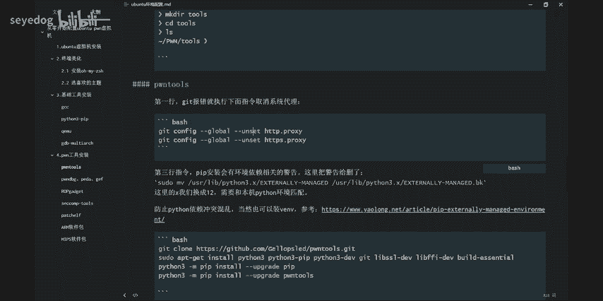

所以说如就这种。灵光一线的这种。嗯这个小错误就。你这个。这个可能会有不同啊，就根据在环境那个网络环境不太一样，哦可能会有这种奇奇怪怪的问题。这得开收。不是有点慢呢。

可能大家那边是不是电脑快的就已经装好了，大家等我一下吧，等我等我两分钟，看他这个。能让他装下。系统还没下好。嗯。反如果要是大家就是装过程中，就是可能有一步比我慢，或者说卡住了，没装完，那也不要不要紧啊。

我这个把这个环境装完以后，这我这个。也，也会发到那个就是我发一个百度，就是上传到这个百度百度网盘里，然后下午打包好这个。就是把链接发给大家大家如果要是需要这个环境的话，就是下午就可以直接去。

反正我们还要下载，哎，好，下载载好了。我这里需要重启一下。

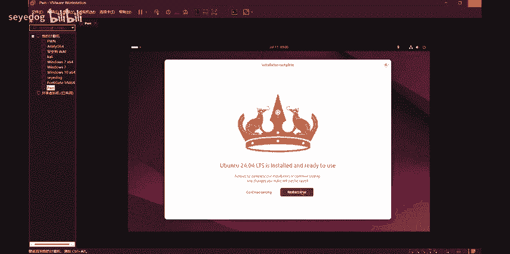

反正我还是就是更倾向于带着大家，就是把这个黄金装一遍，装一遍的话，他这个感受还是不一样的就是。呃，而且这个环境也是胖的这个第一步难关嘛。这个你要是嗯比如你是一个密码手，或者说你是一个这个音箱手。

可能在第一步只需要装一个C环节，装一个pyython环境，装一个这个。呃，装一个这什么反编译工具呃，呸啊，对，反编译工具，然后就可以开始做题了。啊，这个其他的就是用到时候再装就行。

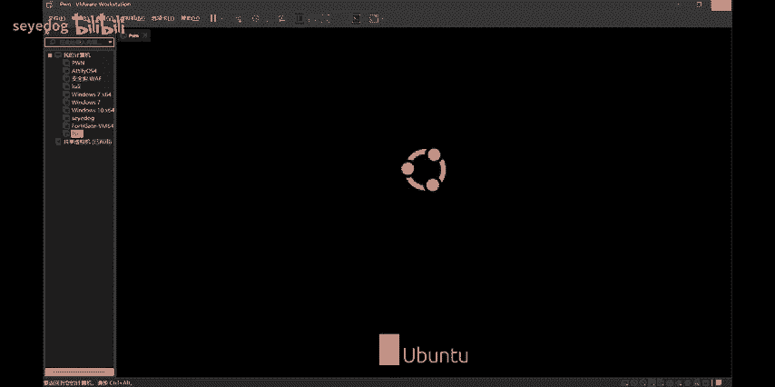

这个但是胖不一样啊，你要是想完整的把一道题做出来，就即使签到题，你想把它做出来，你可能也得从这个。啊，那个繁杂的这个环境中先装好，然后之后才能开始做题。这个就也是老说胖入门难难度高的一个原因之一吧。

啊说到这个难度高，哎，这个装装潢装装潢环境之前，我再吐槽一句，就是这个环胖的这个入门难度其实高是高，但他这个学习门槛也没那么大，大家像是什么呢？像这种。就是这是我们起点。哦，这是我们的终点。都没好。

换一个。可能学习难度平常的，比如说你是一个呃外部手，学习难度可能是这样。哎，这常到终点啊，胖的可能会稍微陡峭一点。啊，就成这样。那但是胖你如果要是成功入门以后，他的学习难度基本是平的。

就是你只需要掌握一些这种应应用技巧，就没有什么更多的学习难度，就是平的。那可能呃外部学到这个入门以后，他的学习难度会比胖稍微陡峭一点，他可能会还是这个比较比较陡陡的这个学习难度。

就是外部可能后后面这个学习也不是就是我听一些就是外部这个师傅们，他们也在这个就是捣论，也在说这个就是去打实战，或者说你这个到到后期他这个学习难度也也很高啊，就是没有想象中的，就是说入门以后就那么轻松。

然后啊就是那么容易啊。啊，但是胖还有一个不好的是什么呢？就是说他其实你入门了，后面学习难度是平的，但是你只是在你入门的这浅浅的这这么一点知识点，就你的入门可能只是这样。那就是。这么一点。就就这么一点。

剩下的时候。骗坦途，但你要接着入门，或者说你要进阶。就是学习下一个知识的时候，它难度又成这样啊，这有点太直了，太又成这样，你就又得爬过一个很陡峭的这个学习路线以后。然后你就把你这个新的知识点学会了。

就新的这个比如说你原本是学这个呃windows下的这个。PE文件的这是这个漏洞利用。当你这个把windows操作系统基本原理掌握了。然后还有就是这个知识点掌握了以后，你可能学的就是平的了，就是一片坦涂。

然后就是把这个windows的各种保护绕过呀，这个利用手法都学会了。这时候你想学linux的这个漏洞利用。然后程序EF文文件的这个。呃，漏洞挖掘，哎，他又是这么抖了，然后你好不容易上去以后又是平的啊。

你就可以一片坦涂。但是你想学下一个呃方向的这个利用的时候，就就是非常陡峭了。这就导致胖体在出题过程中也是这种情况，就是很坐牢，可能就是有一个师傅就有一个出题师傅，他现在的水平很高。啊比如说已经到到到到。

都到这里了。那就是邀请他去出，他给baby再出题，他可能出一个难度在这里的题。然后他会觉得这个题很简单的，这个我这个这本书太简单了，这个应该大家都能做出来。但是他没有考虑过的是。

可能有些师傅虽然就是说学了学学学学了吗？学了会不会会知道什么，知道，但他现在可能还没有爬爬过这个高高高的坡，他可能这个坡坡坡顶上已经快要上上坡了，但没上去之前，他看到这道题，就觉就很痛苦。

然后他会觉得很难。😊，但是如果要是有一个师傅，他已经这个上这个坡了，他比如说已经在这个坡上，就是绕过了这个一道坎。然后他可能这道题他就秒了。就1分间20分钟或者一个小时他秒了。

然后然后就是胖题胖胖胖胖手在做题过程中经常遇到的情况，就是一道题你会可能你比赛一一两个小时哎，出了哦剩下题不会就坐牢。就是。就是跟其他方向不一样，其他方向是不是你就是会有就是那种大家就是一直在做。

然后能做一天那种，但是胖基本就是。呃，偶尔在做，经常在做了啊嗯。然后这个环境目光和环境搭好了，我们进来以后。呃，密码是BWN，然后。点点点进去。好。

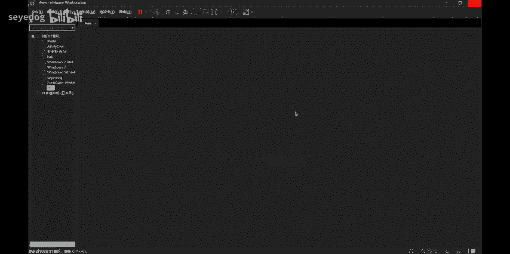

啊，一个这个。这个全新的环境就已经装好了，我们直接。然后之后的话他是要就是enable一个Ppro，这个好像是这个224。0还是223。000几来着提出了一个这个啊新的新的这个Ppro啊。

但是我们不用管它，先直接退出，用不到。然后这里是要发那个就是就是错误信息啥的，给他无帮助进行这个修复啊，我们不管。

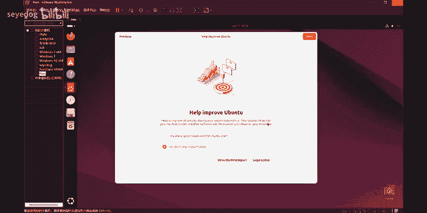

这就让你下一些什么steam了，什么PC啊，这个什么这这个忘了叫啥了，火狐了啥的，也不管finish。然后这是我们一个干净的环境装好了。然后现在我们步入正题，这个我们进行工具，就胖使用的一些工具介绍。

以及这个就胖一些工具安装。我们边角边角工具安装，然后边给大家讲安装过程中也边给大家讲解这个每个工具的作用，然后用法。我们cttrol加T打开一个终端。完之后。冇。这是他这个提醒啊。

就是我们如何执行这个速度。呃，这个应该没变吧。这个即使你望度变成224。0几，它也不应该变这个呀，我们不管它可以。喂。嗯，然后之后的话，我们这里我一我给他写写好了，已经我们一步一步来。

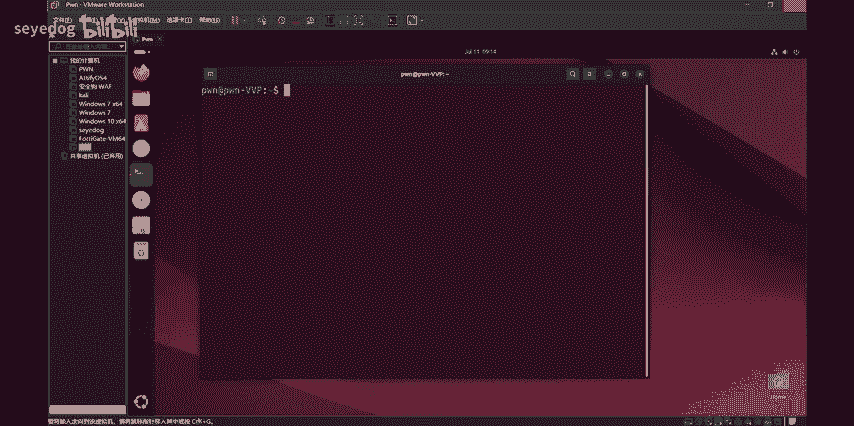

呃，我把这个也发给大家。

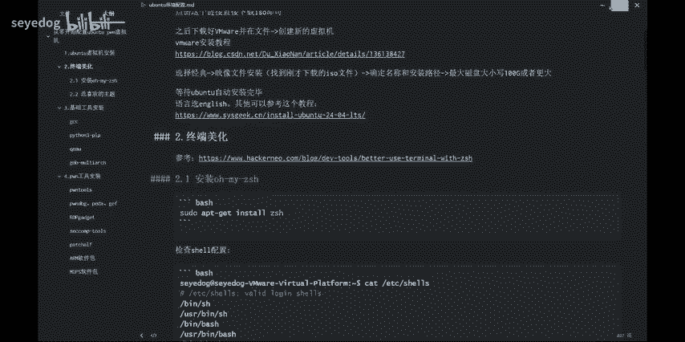

好，我发到聊天室里，然后哎关了。呃，然后之后的话我们就一步一步来。首先是这个这个这个这个音制就好了。对，我们先下载一个wi。

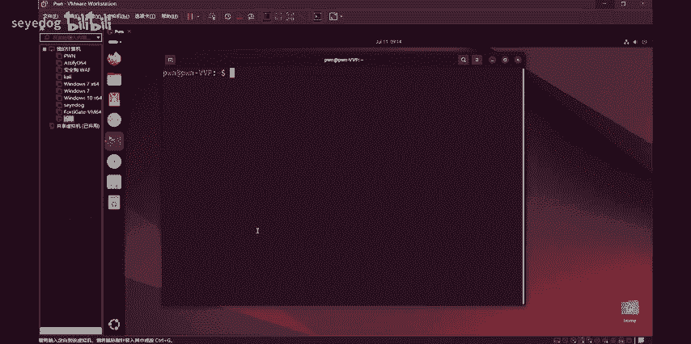

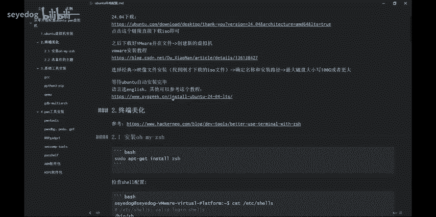

这个the是药。

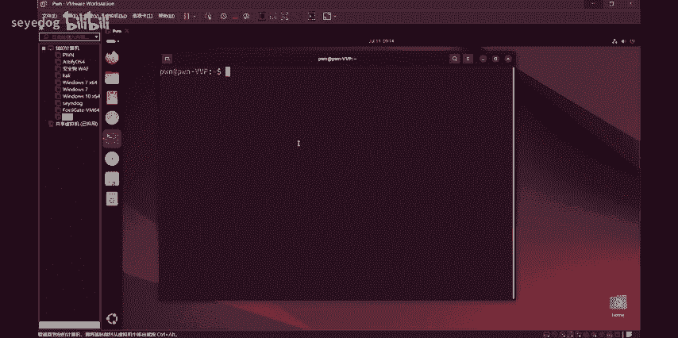

然后密码是胖PWN。然后这里下载减Y，然后回车。这里就是一个这个终端美化，这个我觉得是有必要装的，就是。哎，就是反正就是大家装到一个新环境以后，一般不都是换换壁纸这个。这个这个呃装修装修是吧。

给它改的好看一点。毕竟我们要如果要是你要是学这个二进制安全，或者说这个虚拟机，你不需要二进制安全，你要做程序开发啥的，你也可以经常用啊。就说我们刚开始就把这个环境都给它装好然后这个这部命令执行完以后。

然检查一下效配置，然后这里看一下。pad指令大家知道什么意思吗？好像外部还有其他方案是不是也有这种ca flag这种，就是说它会查看就是你后面这个选定目录下的内容。如果这个文件。

他把这个文件的内容就展示出来了。例我们展示这个配置文件下那个sell文件的这个内容回车。我看到他这个呃拍的是哪些啊，这里有一个这个user bin shell，这个就是我们刚才装的the shell。

这也是个hell。哎，你看这个Bb，如果大家是嗯有印象的话，我们在就是课程开始之前给大家就讲了一下这个b shell哦以及这个the shell的这个区别啊。

他们其实都是这种这个就是一个he可以这个就终端命令执行的那个叫什么程序。然后之后的话我们就更换这个。the呃 shell默认 shell这个换成in the shell就指行这个命令嗯，文件发给大家。

大家可以按照这个文件里操作。嗯，看一下这个里面有没有bin the shell。啊，有宾子 shell，所以说我们chanchansell shell shell是可以成功的。这然后输入密码PWN。

这里密码就跟你们那个设置的是一样。哦，你们设置啥就是啥，我这这是PW哦志豪已经换了，但是没有什么显示，我看是不是要重启？嗯啊。我们这个关掉好，再看一个啊聊天。好，这里需要重启一下。看一下是不是给没问题。

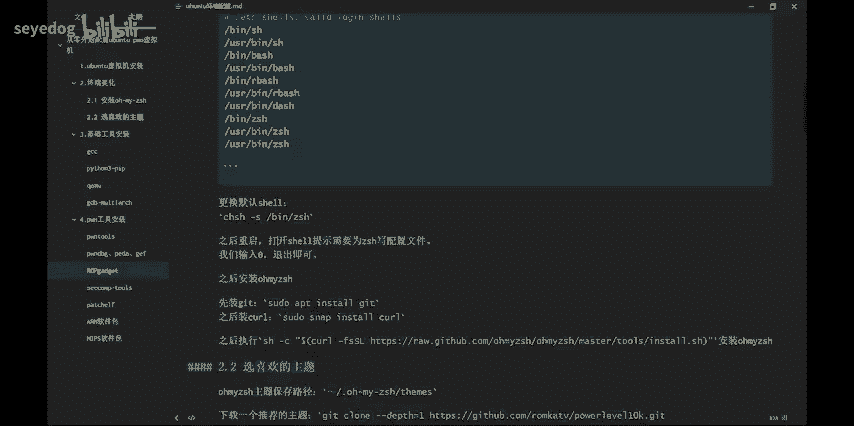

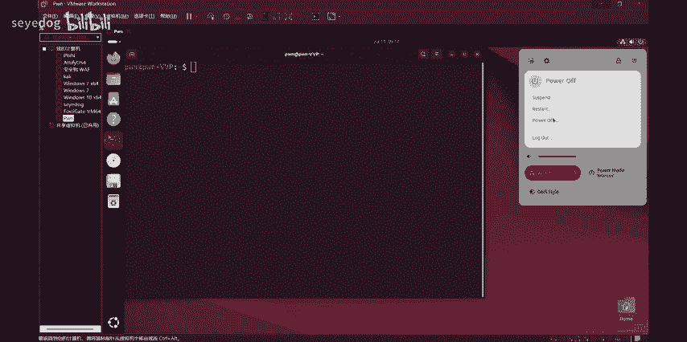

然后这里这个这个关机键，然后选择这个restore。二4那出去一下。

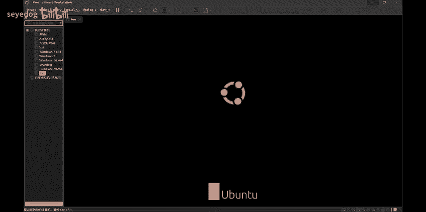

哎，你们在conl假体啊，或者就我们可以。右右右右键右键也可以打开。那个open in。哎，好。这个就是let shell。哎大家先别着急的这个选回车这个地方需要看一下。

就是说这个是他那个刚进来这个let shell他需要照这个东西。其实对这个的虚拟机就是影响很大。因为就是为什么会有这种终端的？为什么它就基于这种图形命命令命令行就是开发一个操作系统？

就是说在程序员编程的时候呃，它更倾向于就是输入一些指令，然后执行一些确定的东西，啊不是说在这个就是图形框里点点点点看，就是点点一点呃，就举个例子吧，就比如说我这个本机是一个windows。

我知道我这个windows下装了一个这个IDpro。但是我装的时候我图快，我直接就默认录径装了，装完以后，我不知道它在哪了。我如何打开这个ID呢。现在这个呃 windows好用一点，比如说我们搜索。

我们直接搜ID，它可以就是如果要是有这个路径，就是pas，它那个pas在系统系统系统路径下，或者系或者说你这个呃给他在他一个一个文件夹一创建这个快捷方式了。你在这搜，它是能搜到的。但是如果要是没有呢。

这个你可能这个。有一顿好找啊，就是你就点点这个框框，点点那个框框，然后点点这个呃文件路径，点点那个文件路径，你得找半天，嗯，然后感觉就很很很不优雅。

然后所以说linux它就希望就是说我们把所有的这个程序放在就是一个就。那就是想创建同样的索引，就索引都保存到这个同一个这个文件夹项。然后之后我们还这个。呃。

也做一个就是这个呃就是全部换成这个命令命令行的形式。然后这就是。呃，如果我们知道这个命令，那我们输入这个。并并且确定我们的系操操作系统安装了这个命令，那我们就可以直接这个在终端上执行。啊，然后题外话。

我们之后你输入零退出就行。550你如。好，这里就进入了这个我们在科页。这就我们进入了这个excel的这个终端。但是这个你看其实也很丑啊。

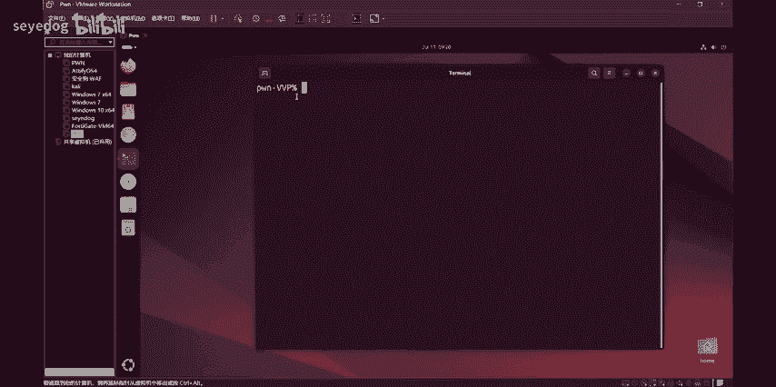

哦，所以说我们需要安装欧麦 shell，然后先安装这个it。

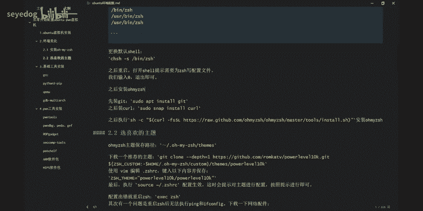

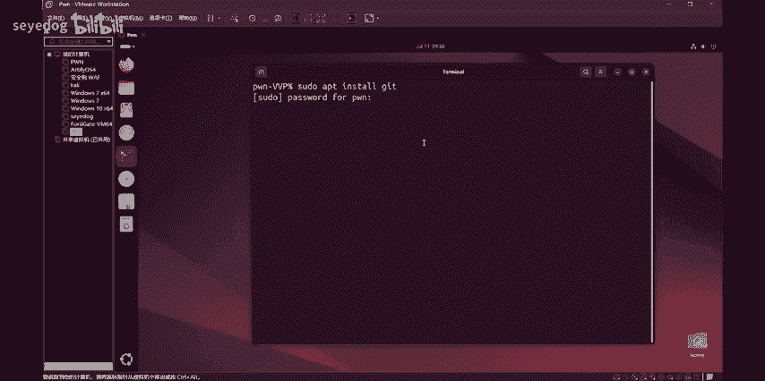

然后粘贴指令的话，在两外。没说。嗯，粘贴指令的话，在这个物光图里是这个conttrol shift加V。呃加对，就是粘贴呃，ctrlV你发现摁不了啊，就ctrl shift的加V就行。

他就能把这个东西复制到终端里。是因为那个以后没报错就直行下一行。这你安装一个。6玩又U玩R1。好，也没有告诉。然，之后我们执行这个。呃，然后这里注意就是在mark down语法中，这个用这个呃单引号啊。

这个是。框注的内容是这个指指令。大家在复制的时候，别把这个左边和右边这个单引号给复制进去啊。复制进去，你执行的话，他可能会报这个找不到命令啊。好，这个也没有报错。我们进接下一行。

就是把这个这事要什么意思？就是等于说我们把这个复制到的路径下载下来，然后下载下来以后直接就执行。

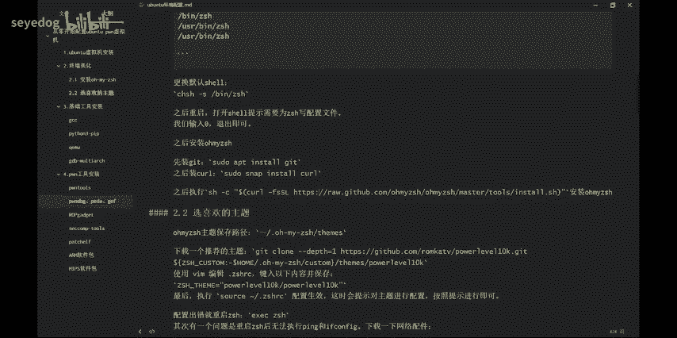

点问题，他怎么卡到？卡卡在卡在克隆这，哎呀，但是录中禁放了。我跟我唔事。我也可以。😔。

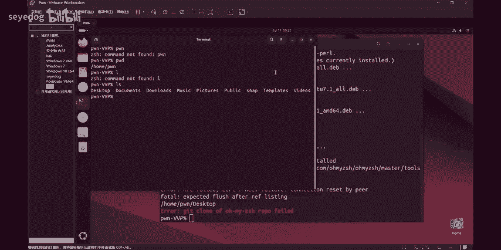

哇。你报了什么错？然后这里这里如果要是大家跟我一块装的话，说不定也会遇到这个错。你来看一下。有么问题？要再试一下，然后这个我搜一下。哎，刚才中还真没遇到这个问题。

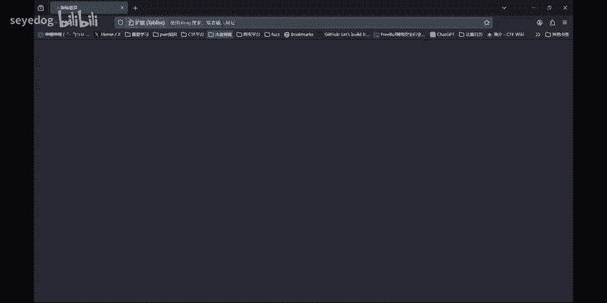

这步咱们做过了，然后就这步。诶。

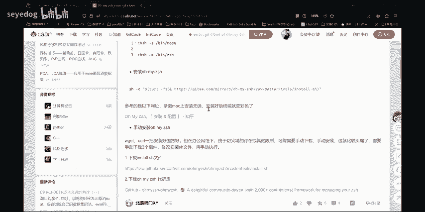

没问题。关记。

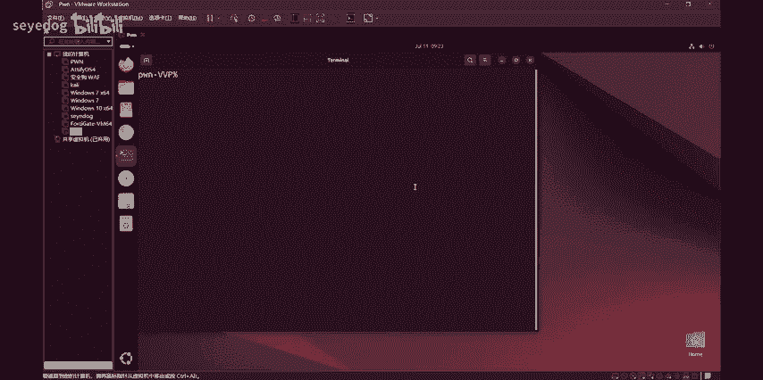

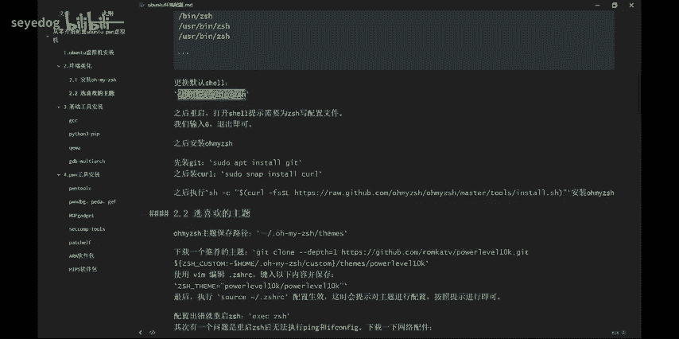


再重启一下。


是。哦，可能是嗯您这边的网是有这个。防火墙呢他这个。呃，杰克隆在执行的话，他会这个。


你难处不。


还，什么。我那应该解决这个问题的方法。


稍微等一下，我再拼一下，拼一下应该。嗯。被告。


不用百度我。试下we get看下we get行不行。呃，不行，可能是个这边防火墙确实拦住了，他不让这样执行。嗯，那这样的话，这个就。这个就中午下午下午再在家配吧，我先把这个就后面的胖的环境给大家装一下。

哦，那我们就先暂次听听了。这是这样刚S然后。换成一个。应该识。那到时候再重启一下。这个这个确实啊这个想到这个王红强会拦住啊，这个忘了忘了这个了。


OK那这接现在就换回这个原本的原本的sell，我们就直接执行这个。


工序安装，首先我们安装TCC。


ECCC是一个这个。


呃。什么叫这个C语言的一个BN译器。然后他用来把我们写的C语言，然后转换成这个一个可执行程序。当然也可以转移成中间语言。然后这个在学过。呃，编译原理的话就应该知道这个。呃，如要是有做实验。

老师可能会让你写一个这个简单的编译器，它这个功能就跟J是一样的。然后GCC是一个比较功能强大的编译器，然后。他是在这个当时美国提出了一个这个什么公开源这个程序计划。

在那个时候提出的那个时候就是出了一很多这个这个很很牛的这个。是工具啊。哦，之后我们装这个pythonP3。这个应该就不报错了。好。哦，这些直接执行，然后python就不用多说了。

这ep就是python的一个这个。呃，就是包管理器吧。之后我们再执行这个cme安装，然后Cme的话是比较Y然回撤。然后cme的话是一个这个就是呃。嗯，叫什么？那是叫固件模拟工具。

就是我们知道我们比如说我们联想我这联想电脑，它用的是这个英特尔的芯片，那它能执行的就是英特尔架构的这个汇编语言和程序。那如果要是我们换成一个嵌入式的这个程序。

比如说我们拿到一个ar架构的呃一个可执行程序，它是无法直接在我们的英特尔CPU下执行的。因为他们的指令集就不一样。然后我们在学汇编的时候，我们应该如果是有学要开汇编课，开的也是呃英特尔架构的汇编。

那这时候我们拿到一个arm架构的汇编可能我们都不太好读。那计算机也是不会读的。所以说我们需要qui。来仿真一个。呃，异架构的。这个。指定级，并且。就是他算是一个这个叫硬件层面的这个仿真。

哦用来这个执行这个。呃，其他架构的程序这个暂时用不到。但是我们既然配不话，你就把它先装了。


然后，之后我们装这个GDBmoT2手，这个是叫什么？是这个呃GDB的已经算是一个空调工具啊，就是说它可以调试这个不同架构的这个呃GDB它可以直接就比如说这个。一个进程断到这个cme里。

然之后就调这个我们仿真的这个程序。然后然后的话哦基本工具基本的这个工具已经安装好了之后我们就安装这个。呃，跟胖相关的工具。我看一下我们现在在哪，我现在这个目录是在这个就是这个。波浪线就是根目录像。

然后我们再根目录下就后创建一个文件嘛。比如说我们叫make direct，我们就要make一个胖文件LOS这里就多出了一个胖文件。哦，之后的话我们。我这得看不清，我再放大一点。没有。呃。

在我们碰见了一个胖文件。哦，之后。然后怎么说呢？我们先C入到这个炮文件里。诶。S然后之后我们再再make一个，再make第二个再make一个文件夹，然后叫t吧。

然后之后我们安装的跟胖相关的这些工具都放到这个tt文件夹下。奥，我们现在在这个胖这个兔子这个兔子公。呃，兔出文件夹项。


我看看啊，这个。呃，首先我们把P层的代理关掉。


你边边度好面啲。


然后。


哦，对，这还有一个问题是就是呃。我们都是很多工具是依赖这个pep，还有就是p股包，或者是这个python。然后我们现在就是出现一个问题，是，如果我们要是装多个版本的pyython。

然后在pep下载这个一些python包的时候，他就会报这个就是一就环境依赖这个警告啊。他这个说。


就是有这个下载的问题啊，比如说我们。啊，你好。我们先先把这个先完这个运行一下，it一行。


应该没问题吧。


啊，这没问题。然后。就是。他为了防止这些就是环境这个配乱掉，他就会这个防就是在24。04这个光图下，他不允许你这个就是直接就P复了。就如果有多个python，他不允许你直接P复了。啊，不能下载。

就就是很抽象。他让你下那个呃virttro environment，就这个这个工具，然后来管理这个。一个python吧。啊，当然这个也可以装啊，但但这里我就不装了，这里我直接就把这个警告给他删掉。

不让他警告了。啊，这个因为胖的话，就确实我现在做到现在没遇到这个环境冲突。可能这个呃如果里面东西装太多，他可能会遇到，直接给他解一下。哦，这里的话就是你看我这里写的是python杠。

那你先你们先别着急执执行，这里是pyython这个呃这里我们执行的这个叉，这个叉的话，就是你对应的python版本。哦，这个的话应该是都是12。就是如果要是你跟我这个装的环境是一样的话，就是。

那我就12，这行就对了。如果不是的话，大家可以看一下这个自己的pyython版本，python广告 version。哦，不对，派点三刚刚我是。You。就可以看到这个他的版本哦。之后的话就执行这个。

这个命令。下载就是一些一段上的，直接直接回收，直接决屏，直接过I我回收。朋友告诉。哦，执行完这个以后就下载一个这个叫。啊，这是更新一下P股不更新了，这个没啥用。直接就下这个胖兔子就行。

就这这好像就可以不执行了，抽时间。然后就是胖兔的这个包还是值得一说的，就是。可能我们在最初做胖或者做这个。呃，二进制工房的时候，大家都是用scket编成，然可能都要这个对数写数据包。

然后操作这个就是文件读写，然后就是远程的这个。交互啊，但是到后来以后这个。Yeah。就把这个工具给集成了，就是说我们在胖头子里就集成了一套这个就是就是。呃，文件包收发的这个操作。

然后还就是一些比较重要的工具。比如说这个一些字符串的这个转换，一些这个呃。诸葛链的生成哦以及这个。交互反弹票这个呃就是反弹效嘛，就这个票的交互它都写到了这个写到这个胖兔子里，就是导致我们现在就。在这个。

呃，进行这个攻击的时候就会方便很多。我们只需要呃照顾需要思考我们要发送什么数据，以及这个想要达到结果，然后以及这个攻击脚本的编写即可。我们不需要考虑就是如何跟这个远程的这个呃。

端口以及远程这个进程是如何交互的？我们要以什么样的数据帮我发送这个我们的攻击攻击数据，这些已经是我们不需要考虑的，只要考虑的就是这个对吧？E叉P的构造。好了好了，这里我已经装好了，我继续了。然后这个。


哦，对，这里我可以验证一下，就是我们比如说直接这个。没有现。我们直接进牌子，哎不拍子。然之后输入一个。AFrom。嗯。In音port到。里没有报错，就代表我们成功装好了框库子。

就是这个就是调用那个框兔的这个库，然后并调用里面的所有函数。截图一下。


对，然后之后的话我们再装一个这个pty bugg哦PD啊和这个这其实都是那个PD这都是那个。就是GDB的插件，就是我们在就是。


我们先退出就是退出的话是。exist然后之后会加这个又退出了。呃，就是我们在这个无邦图里应该是自带的GDB。


GDB是一个什么？GDB是一个这个就是。动态调试工具这个工具的目的最初是为了就是程序员在debug的时候，他可能会需要知道这个程序在哪里发生了错误。哦，他就需要这个一步步的运行程序。

我们在BScode里面也具有这个debug就是功能。就二是GDB功能。呃，这个的话就是一个命令框下的这个GDB。哦。当然这个工具其实就是呃因为它写的太早了，这个应该也是跟JCC这一个年代的。

就是这个GNU这个计划开源计划的时候，就是出现一大批这个非常牛牛的这个就是工具。然后GDB也是在那个时候诞生的。但是呃他可想而知，他那个时候上个世纪诞生的就是有点太早了。

所以说现在这个工具就也有一定的这个局限性吧，不是那么好用了。但是这。呃，按Q退出这个GDB，我们就可以给他装点插件。这里我推荐的话是呃大家装这个装这个胖ybug，这两行我就注释掉了。呃，因为这个这个。

拍d和这个if已经就是停止更新了，就是在19年还是一几年的时候，就已经这个停止更新了，就已经没有维护了。最早期的时候，pe了这个是非常适合做逆向，还有就是胖，也有一部分人在用。

但是现在的话大家就即使做逆向，也基本上都是胖debug转到这个里面。哦，现在我们先回到这个录像，回到我们的。就是我们之前创建的这个工具目录下，如果要是你们重新开了一个终端的话，你们要在CD一下。啊。

这个是为什么？这个是为了我们之后好管理我们的这个工具包，防止我们这个就是桌面过乱的。是我们。如果要是你们就已经在这个胖，这个兔子，我们下载这个或者你可以不叫胖了，想叫什么CTF也行。

就这个兔子目录下工工工工具下载。路径下，我们把这个框。之后我们在这个目录下执行这个bit，我们把它的包下载下来。咦，只能放一个小时了。我也快快装完了。嗯，当怎么卡住了？别瞪他一下。

看他到底又报了什么错误。


你等他那个。下载过程中，我们可以再给大家展示一下这个。呃。叫啥GCC的使用啊。这个这CC不知道大家用过没有，就是一个编译器。兵器大家应该听说过吧。我们比如说CD的这个泡梦响。然后里面只有一个兔子。

那这时候我们就创建一个这个文件。比如说我们。VIVI一个叫。Ast Percy。哦，VI的话，大给的介绍一下，就是说应该是雾光图24。04，它是取消了这个wim的支持，它直接就装了一个wim的wim2。

就是叫VI。呃，但其实我觉得VI没有为什么好用，就是还是技术指令吧，就是I是插入。哦，那摁下I以后，它就会进入插入模式。但是。就是backspace，比如删除键，它不能这个删除我们的这个。指定了。

它是又变成回撤了，我们需要按ESC就是计算机左上角的ESC。就是except，然后之后进入到这个。管管理模式，然IDD删除好，没有没有东西出现，我们再来进入。这个编辑模式。怎么回事？呃，从退路转下下好。

编辑。哦。inO了。最后的话就是如果要是我们想删除，就是我们比如写了一堆乱码，我们就先EESA然后IX或者按DD按DD就删除好。然之后再进行编辑模式，然后就和我们。可以录的。集体议。我表没去。我回说。

主印的一个。有错了。然后就是我们进入管理模式以后，上下左右是按这个呃A摄氏组。G是下这是上L是右。我よ。回到这个这里哎插入换行换行，然之后再退出，再上，然后再。

in插入在type这里我们就执行一个什么吗。执行一个。Pnt吧。Very南不。偶尔的。然后。再执行一个什么再执行一个。锐的一个。呃，我 get吧。试过。吧，这是水套嗯。ter0。哦，好，之后。呃。

配出键，然后就ex，然后之后shift加。冒号调出冒号，这里就进入这个管理模式下这个命令执行。我们W。WQ是保存加退出会撤啊。好，那我就。执行这个指令以后就保存这个文件。

然后我们再用catca大家刚才大家跟大家介绍过，就是说查看文件，我们cat这个t点C一下。然后里面就只有这个printF，然后之后就return了。然后这里的话我们就也来说一下GCC。

比如我们JCC1个这个文件。PC这个。S点点C，然后这个杠O代表直接输输出输成一个肯定文件，就是它编译加链接，就是编译汇编链接就完全就一步就完全。三三个其到一起都操作。然后之后我们把它命名叫探索。哎。

来s看一下，这里我们又多了一个叫test的文件之后，我们点到就是执行这个隔林程序，嗯，执行一下这个tsest的程序。我说哎，他就把hello word打出来了。但是这里我没有给大家换行。

所以说有点难难受。然后。呃，那我们再看下GDB吧，GDB怎怎么用呢？就是说假如我们这个可执行程序在编写过程中编译成可执性文件，但执接发现它没有打出hello word，它报错了。

那我们怎么看这个到底哪里报错的？我们就GDB，然后这个程序。


回 sure。哦，他跟你聊下一个。第二个吗哦，不管他，反正就。进来，然后之后我们看一下有没有幂函数吧。对它是可以就是避命，就是说在幂函数下段那里之后我们Ccontinue执行过去。啊，对，先上好吧。

你知道下载什么东西。冲。哎，怎么放在这里行。哦，我再把这个。他需要代理一下他。完成轻快的错误。好好，我们再再选择一下取消代理，然这个。呃，这个旁旁第bug就下好了。这是里第bug我先不演示了。

这个第bug个我也没怎么用过这个。我们先接着接着装这个胖的吧。好。😮，这个刚才刚才是没有下载好的话，就执行一下这个bit。呃，就把那个代理取消掉，就是。刚才这个上面有啊，是不是这里。

这两行执行一下执行一下，后再装一下，然后就好了。然，之后的话就。CD。CD到我们下载的这个文件里去。这是一个3 up吧，应该是对。这里就是刚才我们那个程序执还是执行一个这个。还是3W的 shell文件。

啊，一样就是一个可执行的程序啊，他这不过。不是一个程，不是不是一种类型的程序。咱们刚才编译的是E要附文件，它这是一个sell，是一个脚本文件，反正都都执行执行执行完以后。这个房第八个就装好了。

你等看一下，他这个好像还要装一个。又一串。好，那边。屌。去安装。对，如果要是安装过程中，就是我这边没啥问题，但是你们那边就是安装出问题，大家就可以在这个。嗯讨论区就直接说。

然后这个我可以这个帮大家远程解决一下。好，反正我这边是已经装好了。哦。之后的话需要安装一个这个插件机蛋，再接着执行。也没啥问题，就是这个他这个警告就不用管他了，可能是什么。


什么这个什么。啊这吧他是没有root啊啥的，不用管他。好之后我们在这里执行一下这个就是VI就是。速度维I到这个BDB引引it这个里面去看一下。那写的是啥？然我说。哦，发现。

这个我们就是已经执行的是这个ptybug了，所以说没有其他的，我们也不用管它直接就。这个输入啊，我再给大家演示一下，就是IESC左上角的ESC。然后之后shiftth加冒号，然后这里输入一个冒号。

然后按Q直接就不保存退出，然后回车，然后就退出来。


然后这里的话我们再试一下，就比如说刚才我们那个程序，我们直接执行GDB。啊，或者我们什么也我给他加程序，我们就单纯运行GDB。哦，发现我们刚才那个GDB长啥样，是不是那个白白的一片。

然后这有个GDB现在它变成。又红又紫的，这个变成胖GDB了，代表我们的安装是没有问题的。呃，这个在最初安装的时候，可能会有一些问题，就一些老版本，它那个。我把这个命令也截一下。

就呃无王普的老版本可能对这个就是兼容性不太好，啊，就会出现那个你装了一个多多装几个GDB以后，你进入即使就是在这个GB初始化文件中，就是选择了那个挂载了一个胖第bug。

但是呃我们进去以后还是那个白白的那个GDB。这个但是高版本，所以说这是为什么我不建议大家再用那个低版本了，就高版本这边就是会少很多这个奇奇怪怪的报错。因为GDB更新的太快了。

你在老版本的望图上装一个新版本的GDB就难免会出现一些奇奇怪怪的错误。这里我们看调用GDB挂载也成功了。所我们进入下一个装这个ro ga。比如MQ这我回到那个就是这个。

你看之现在我们在pdebug这个目录下，我们CD1个d就退回到上级这个兔子兔子目录下。我们在这个兔目录下再装一个这个入t。有，刚才我是不是哦，没有没问题。先我们Pep一下这个装修P股。哦。

这边已经装好了，那不关了。

在这个基D以后，这个就我们已经回到这个兔子目录下了，我在这个目录下再装一个这个就把这个包给它复制下来。不会又要报错吧。我也没开。没开到你，那你播送。备注。我们再把那个。代理那个指令执行一遍。

把那个代理关掉，我们再来再来执行这个下载，看它会不会快。啊，那个。就是访问gitub国内，你访问反正其实我关的这个代理也不是太也不是太行，啊，这个可能确实。我们不知到这个网站或者说不种问题。

下载就会很慢。当然我们也以另外一个方法，我们就。呃他不能不能打开这个我们再试一下。不行的话，我们就得去。给他加一个这个。也加一个这个这个hoshos文件夹上给再加一个这个。代理代理服务器的这个地址。

对你服务器的地址。还是不行。要不行，我们就。不知道你们那边行不行，反正我这边确实不行。行的话就。这个错误好像我还没保存到我的这个。眼睛到。收小这个。那比较好解决。哇，他让我取消代理。

吧他下载不下载，那我们就不解决这个问题了，直接。也这个访问一下，看我能不能访问这个。你直接把他那个包下载下来，就不通过key下载了。放过去。


好，我们到这个这个。嗯，Q台号不是可以访问这个网站的，我们这个网站给大家发一下。那其实他也可以用我刚才那个下载下载那个给大家那个。指导下载下来，就是把这个播到这个网站。你怎么不么说话来着？我聊钱。

就这个这个网址啊，这个大家。登录进来，那就是可登录点点击进来，然后之后。你把它这个直接下载压缩包。地我非常坏，大家本地应该可以各显神通吧，反正就gitub大家应该应该访问过吧，就是把这个包给他下载下来。

然后就。谁就在这儿截婚吧，量一下。备好之后，我直接把这个包复制一下。复制复制到我们的讯拟机。


就不get了，get半天，get不出来。我这个我存下。Okay。

考虑。啊，这又遇到另外一个问题，就是。这个光图他这个有的时候我这个电脑它那个复制。本机和这个讯机它又不互通。我需要再给它重启一下。这问题只能通过重启解决。


我们打开我们把它创建的这个p文件夹，然后之后。再把这个复制一下。毕经。诶。😮，你做。什么。


甭怪这个。肯定可以复制这个成序的包子复制不进去了。我是。今天遇到的问题有点多，这个我们再选择。回到之力。复制一下。直接利用它下载也可以。这里这也非常好的打开。可以我们直接就从这下载也可以。呃。

哪是呃到那里。我评到这里。对，这就这就成哦，我们在这里打开终端。选择这个打开终端就右键，然后open in terminal，然后就打开了。那终端以后，我们来OS看一下。


哦，这里的话可能需要解剖一下这个 zipip包，看一下啊。


用光图如何解包这个zip包？


你好像直接就有on秘密是吗？


嘿，他这个已经也包出来了，嗯就CD的这个录像。之后的话就执行set up点开始。我没记错的话。啊，等下速度嗯。好的，这个工具已经下载好了，直接入盖给他看一下。我不是识。好，这个工具已经装好了。

虽然过程很。曲折，但是结果是好的。好。哦，这个工具的话暂时也用不到这个我可能如如果要是用到话差不多是明天吧，明天我给大家介绍这个工具的使用，这里就先不讲了。然后之后的话安装这个。这个是一个这个呃。

发箱检检测的工具。这个暂时用不到，但是先给大家装好。这个可能也是今天下午或者明天我会讲到这个砂箱检测。但安检测其实实际应用也挺广泛的，在密罐技术，然后在这个虚拟机技术，然后以及这个各种权限保护的这个。

程去。运行过程中它都会涉及到发香。其实也就是进入一部分程序权限。哦，防止你这个进行一些，就比如说一个只是一个呃。用户操作者啊，结果你有了管理员的一些指定执定权限，这也是很危险的。哦。

就是你些限制一些指令执行吧。然后他还有其他的功能，比如说限制读写之类的。然后这两个也没有报错，我们就安装好了。如果有报错的话，大家可以在这个讨论区就在这这个这个叫聊天里说一下，给大家解决。好。

这个工具安装好以后就安装paashEF这一个paash工具，主要用途是就是更改动态链接库。


这个一般是什么时候用？就比如说我们。再运行一个对就运行1个EF文件。刚才我大家刚才应该是给大家编过1个EF文件，就是我们通过GCC编辑的这个testtest里面只有一个print函数。开一个终端AS。

这个点杠pas。这里我们看我们非常成功的运行的这个hello world。但是如果这时候我把这个文件下载给你或你用你的这个比较老的，比如说16。04的钨邦图运行这个程序，那它一定是会报错的。因为16。

04是不支持这个无邦图2。35以上的这个lib C的，就是它不支不支持一个高版本的是连接库吧。什么链接库呢？比如说这里我们看大家就先这样理解，就是说看我们在in库的1个SDDIO，那我们这里就其实就。

给他链接了1个SDIO的这个程序。这个程序不是我们程序写的，不是不是我们自己写的，但是它系统会。就自会自带的这个把这个库给它链接到这个程序里。那就是。对其他一些文件。

如果要是我们就是出现这个程序版本版本之间不兼容，或者说就为了防止是版本不兼容带来的就是程序偏移不一样，导致我们的攻击失败。我们从需要通过这个派chDF先把它的链接库改成和题目一样的。

就可改成跟出期人一样。

这个也暂时用不到，但是还是要下载下来。之后的话就是ar的这个。连一起呃，arm这个叫应该是一个呃。有什么？编译工具我们把它也下载下来，这样的话我们就可以在。英特尔的这个架构架来编译。

把这个C语言编译成ar架构的。从Y啊回车，然后下载好就行。这个也不会有什么报错。好，这两个下好了。然后我们再下载m它的这个。编辑包mix有点多啊，它mix用32位、64位。

所以说好多编辑器我们都给它下载去。哦，对，就想到一点，如果要是就是大家之前那两个只有两个包没装好吗？大家想装的话，可以就换退的校园网，换一个这个比如说自己的这个。呃这点应该就没什么问题，就能装好。

你的话这个。装好以后，大家就休息呃，1分钟是。休息大家休息20分钟吧，就是最后这个包也是一样，把这个指令就行，放上你提示你需要装不装，然后你就按外按回车。


哦，装好以后，大家休息20分钟。我们。呃，休息13分钟吧，10点半接着就接着介绍。诶。

喂，大家好，那个我们接着接着讲课吧，然后这个。呃，刚才的话我又调了一下那个就是theel。现在它这个已经成这样，但这个已经下载下载成功。然后这个的话这个咱们就。在这个多说一嘴。

把这个theelll装好吧。哎，是不是刚才除了这个事，还有一个没装好，先先说这个就是。呃，就是找到了一个这个。


比较好的这个教程。它这个确实是因为防火墙吧，可能不允许你国外这个。呃，这个镜像随便往里。就随便执行，然后可以换到那个国内的哦。就是呃先执行这个操。这么是点。哦，执行完这个以后。

会下载一个这个inststore的这个shall呃，需像需要脚本。然后就是表到这部分。我把这部分换成这部，就是变换一下。换切换成这个内容。


就是我给大家演示一下。呃，就应该是这样。第一步是执行那个。Yeah。执行这个操作。And you we get。就我发在群里聊天框里那个。哦执行这个以后。那就下载好哦。

我在这个toth这个文件夹下呃下载的，它就在这里出了一个 shell，这个instore the shell，我们点开这个he。不用为m编辑了为m其实我觉得呃不装点插件也不太好用啊。然后之后这里以后。

点开啊，当然我们可以先不点开，我们用这个s默77ins到点。呃， shall要给他复权。好，我给大家发一下。1聊天过去到了。就是执行就是去这个inst点。你刚才下载这个inststore点。

是要这个不下执行这个复权，给它一个可执行权限。然后之后。我们找到这个文件。这样啦。找到这个文件，双击它点开点开，我们往下滑，发到一个。搞下。第个。😔，这个位置这个位置那个default city。呃。

这个位置下它原本是这两行，我把这两行注释掉，我把我刚才发到这个聊天框里的这个。那两行复制下来，其实就是把这个它原本那个下载部径换成一个mis，换成这个镜像的下载固径。我之后。top换成Pt。

然后之后再下载。之后改完以后就把这个原本两行注释掉，在这加两行哦摁ctl S保存我退出。


之后再执行这个点儿，知道就是执行这个事脚本。直正上脚呗，然后很快。就显示内容大概就这样，大家执行了吗？然后执行以后他就到这儿了。啊，他就自动也把我们换到这个theel了。

我现在就是看我们就是在这个theel角。没。好，我们现在执行那个脚本以后，等大家一分钟吧，大家2分钟吧，等到38再把那个脚本执行一下，执行完以后就成这样了。好，然后在如果要是到这步以后。

就是进入这个就是基本的这个the shell已可以运行了。然后这其实也就是ex个cel，然后它有一点好处就是它的这个界面比较美观。然后我们这个先退回到这个根部录像。

我们来给他展展示一下它的一个我比较喜欢的功能。比如我们输入炮，哎，直接就是typetype就可以进行这个目录切换。然后我们CD要C到这个目录下，我们要回车，再回车，它就直接进像这个目录了，然CD1个。

这个就这个就没有什么，因为它只有这么一个目录啊，直接t就补全了。但是如果要是它有多个目录的话，它是可以就是就是这个按t，然后来这个选择目录的。这个功能实在是呃非常喜欢啊。然后之后的话我们。


进行这个主机切换。然后我们去这个。保存主题的这个路径下，这个我们在环境配置的这个给大家发的那个文件里有，就是执行这个命令，就是CD到这里。呃，这里是一个主题下载，我们就不下主题了。

因为我们后面又找到了一个比较喜欢的主题，然后。啊，然后就是。对，这个应该是。对我们要用win编辑这个文件。啊。别你病桶。等这多加一口。你好。VIO点。这里其实是。还是两大嗯。我们去编辑根录下的这个。


需要的配置文件。啊，再开一个中端吧。唉，就说还是这样，那可能还得重启一下啊，现在就先不重启啊，先重启。先给它重启一下，把那个。


需要重启吗？啊，暂时不重新啊，或者是。就编辑一下这个。哦。在这个文件的前几行这里。这里它默认主题是这个。应该。啊，反正是ru比什么嗯 shellll，那我把这个换一下，就是他在默认的配置里有一个叫这个。

这样的题你能矫正。


这个主题非常不错。哦。我们。进入编辑模式，然后加一个这个先把它不复制掉。哦，是。对编辑模式。没充。哦。编辑模式和我们输入的时道。哦。有一个。我的复制过了。我们退出。到之后。进入这个命令之前。

然后我们去建1个WQ。我回车好，听人没。这个已经换了，就是主题他那个配置文件里的主题已经换了之后的话，我们需要。

嗯。就是执行一下这个配置文件，让配置生效。


哦，他需要。那我先换成belash是吗？啊，那我可能需要这个改一下配置，他这个改了，但是嗯他这个这个好像是。下载的时候就给我改了，就是我下载的那个窗口，他改，但是他的这个默认窗口是没改。那我们就先退出。

我在这里执行一下这个change fill on，然后完成一个。不认识么。林子笑。测的手候给辑应生成都没问题。然后再重启一下。


怎么办？好。😮，大家是不是发现这里我们就已经完完成了这个终端的这个修改了，它样式已经变成这样。


然后。这里就。基本都完成了吧，看还有没有什么没做的。彭后村庄。装一装。哎，对这个这个好啊对，这个也装了，这个我们复杂了一点但也装完了。OK你这样的话，所有的环境都已你配好了。最后一步就是。


我们再把这个终端框框改一改。你我们改一下这个颜色。


我用这个用吧。我用透明的把它透明度调调低一点吧。差唔多。然我这个换一下。一。你改一下。就比较喜欢这个绿色的这个主题。你其他的没有。大家这个哦，我告诉大家如何这个调终端这个主题，就是先先把这个后面这个改。

嗯是先点这个。搞告我喜欢。看着白合洞摆成黑色。哦，这这里。没这吧。这样的话我的背景框和这个。是。然后改成黑色。然之后。点这个就是在终端里点这个三三杠，然后点这个。Reference。

I觉个 onname。哦，这有 part。哦，我比较喜欢的是这个。革命航豆哦，改成这个样子。哦，其他的话就不用动了，这个就用这个就行。这个。等下啊。啊，就这个也行就行。然后透明度的话可以稍微就是。

一大概长这样。


把这默认配置截一下。


嗯。


好，然后我们的环境配置就已经就完成了。然后这个的话我。


呃，今天做一下那个把它上传到呃百度云吧。然后大家如果要是嗯中间有哪部没做，或者说还需要这个。环境的话，这个可以在那个百度云上下载。


这个文件的话，我再验成PDF发给大家吧。


那谁放了。那个简直发的话，它那个不变为。


会保存。


嗯。诶，错了。


说共享有问题，需要重新开一下共享吗？


O。


哦。我们的这个网图就已经配好了。那就这样吧哦。哎。没问题。然后。


我们好好，我们把这个关了吧，关键已经配好了，这个暂时也用不到它。


是的对。


哦，然后之后我给大家做一个这个呃胖的弓箭是吧？这个还可以打开虚拟，我我打开我们原本的那个。


啊，是因为重名了吗？啊。打开这个虚拟机会打开到这里。呃，不是因为重名的问题吗。我就先把这个删掉。这又是什么问题？


就这里。但不太能给大家演示这个演示的话，我就下午再给大家演示，我来介绍，先给大家介绍一下这个抗题的做题流程。然后胖题的话就是第一步，就是下载题目给出的EF可执行文件。然后通过text指令打开文件保护。

并通过这个IDA逆向查看程序功能，找出漏洞，然后利用漏洞编写python脚本。且这个。嗯，就是。脚本编写成功之后，我攻击目标IP的对应端口，然后来获得这个对应的 shellll。哦。

最后介绍一下这个利用运虚拟机。这个。就是我们VM威尔安装利用和虚拟机，这个已经给大家介绍过了。所以说这里就不再过多介绍。哦，lining咨讯以及基本指令，我相信大家也都有一定的了解。

像LCDcawim这些指令，今天也不不用过多介绍了。哦，这里要提一嘴的是一个这个s mode指令。这支末的指令是利用户的指令哎。是6分中一个这个呃复权指令。物权治令。呃，他这个作用是像。呃。

用户提供就是。用用户权限、主权限和系统权限。然后。比如说常用操作是CH。啊，可以说我们有什么决历？以及。😊，有CH mode。哦，777，哦一个。为什么说。比什没什么用叫什么重序名字吧，两而不内。

像这个功能是像EFname程序。无语。嗯。嗯。做。系统的。可读可写。呃，执行权限。


这个刚才装了个虚拟机，把我这个原本的虚拟机弄我没法执行了，这很调。


再试一下看行不行哦，现在行。呃这个就是可能是他重名的，很奇怪。我这个对大小写还没有这个很好的支持。我刚才。创建那个虚拟机还专门注意了一下，我让第一个是大写，后面两个是小写。结果刚才跑完那个虚拟机。

搞得我这个最初这个虚拟机没法执行了。现在哎现在又行了。现在我把那个刚才我装的那个虚拟机给删除，现在我这个。


我自己这个虚拟机又能执行吗？很奇怪。


既然他能执行了，那我就。再按照刚才上课的这个。就是流程再给他操作一下吧，就是。呃，先不说其他的，先给大家看一下这个。就嗯。程序权限吧，就是s mode这里。就是我们通过L可以看到文件。

我们加一个杠二参数，可以看到文件的具体信息。


这里我们来找一些。先给大家看一下啊，就比如说这个定文件，定文件是一个什么文件。我也不知道这个是啥，这个可能是下载的时候。呃，我们复制复制复制的时候，路径复制的就是要从哪个路径上复制来的B文件。

这里我们来看这个B文件。就是read是什么，而是什么？而是read啊W是right，然后X是执行，然后就是这三个代表它的就是用户权限，后三个代表它的呃主权限，最后三个代表它的系统系统权限。

然后那这个B文件，就是在甚至是B文件在用户权限下有可读可写可执行主权限下有可读可写可执行。然后在这个系统系统下有可读可执行的权限。那我们如果给他赋予777会怎么样。

那他就会具有在操作系统下也会具有可读权限，说它就具有了完全权限。哦我们拿到一道题的时候，呃，比如说我们从。嗯。从哪里也是一道题，比如说我们。听一下这个找一下你那个目录。是。哦，比如说我们从这里吧，这里。

哦，我们这里拿到一道题，就是我们把它。比如说我们从那个做题网站上拿到一道题，它叫这个test。哦，我们刚拿到的test，我们放宝贝到虚拟机里，其实是不具有可执行权限的。啊，这里他已经具有可执行权限了。

但是其实他最初拿到的情况是这样，然后呢。还是1个200，然后一个pas。你看这个t的，现在它就只具有这个可读权限，其他的权限是不具有的那我们拿到这个程序，我们知道它是个EF文件，我们发一下。喂我小太。

啊，他只有可读，但现在我就没法看到他的这个哎只有可写，没有可读权限。我想一想那个应该是。你嗰个。哦哦W吧，我应个开始。之后我们再看一下。我我一下中个太s。没有可能吗？啊。

就是它显示这个文件是没有这个可读权限的。然那这样的话，我们甚至都没法执行它没有。我报这个权限错误。权限不允许。然后这时候我们把它CH mode7息7，就是我们赋予它完全权限再执行一下。

之后我们再执行这个程序哦，他就他就会弹出一段话。那个时候他就具有了可执行权限。那我们拿到这道题，呃，首先就是给他复权，需要让他具有这个可执行权限。我们放一下，这个看一下。

这是我们也能看到它的这个文件结构了，它是1个EF文件。EF文件是linux下的可执行程序。呃，这个可以就是大家类比一下在windows上的EXE程序。然后他就它是64位的，然后这是小端序。

然后开启了PIE我们这是一个它的架构是叉8664，也就是在英特尔下的这个会面。哦。他的。告诉他这是一个动态链链接程序，这是在动态链接库，这是它的这个就是哈信值。就是以及这个编译器的这个版本是GGU利3。

2。然后大概信息是这样。好，我们现在演示一下，就是一道胖题的这个完整流程吧。现在心机又好了。哦，我看这是体在哪啊。大家门在哪儿？还是在这里。预测这个。嗯，也是比B这我们来看一下就是。嗯有哪些都？

没有baby return这个docker，那我们就启动这个docker得了。看一下清松指令。


呃，之后的话，这个就是说。我们用docker启动一下这个镜像，然后杠D是开一个守护进程，就是说它在后台运行。然后杠P的话就是说我们要指定端口，然后这是我们本地的这个端口。

我们要把本地的888端口映射到虚拟机里的，就是我们这个。docker虚拟机里的这个10717端口，这个10717有什么讲究？这个就是因为我们在写这个搭建docker镜像的时候。

我们把这个题启动到了这个镜像里的这个10717端口。所以说我们需要让镜像里的这个10717端口映射到我们本机的这个8888。这就是我们本机的8888，可以直接访问这个docker里的10717端口。

也就可以访问到我们这个在docker里搭建这道题了。这道题其实是一个这个就是在docker里达启动的一个进程，这个进程里有一个漏洞，我们要攻击这个进程漏洞，然后来就是达到这个get shell的目的。

就是说最后我们要获得一个这个就是类似我们这个sha脚本，就是sh执行权限。然后之后我们把这个镜像名字启动成t star啊，启动的是这个baby我们回车。高他已经开始执行了。他之后我们都会儿。呃。

叫什么dockerPS一下，但我们确实启动了一个这个docker，但这个docker好像它没有任何这个回显的。然后现在这个题已经启动哦，我们可以这个NC进去看一下。我们再开一个开一个小。

我们NC一下这个0。0。0。0，然后这个啊。哦，好了，进去去了，但是他没有任何回险，我们输点东西进去灰壳。再出加音好，退出了。哦，就是一个简单的这个连接输入。

然后这就是这个我们在8888进程里开启的一个服务。那乍样一看，这个服务其实也不知道他有啥漏洞呀。那这就是胖的一个局限了，就是一般的胖都需要有到这个程序的原文件。就比如说现在我们是一个服务厂厂商。

我们在测试一个程序，然后我们就用docker启动了一个这个程序。哎，这就不得不说这个docker是有一定的好处的。呃，docker是一个进程级的这个呃虚拟机，它可以就是屏蔽下层的这个差异。

然后把这个我们的操作系统进行一导包。然后在。是对于开发者来说，do客是非常受欢迎的。呃，当然do客也是不安全的。因为我们是把这个一些基础指令进行也非基础的这些平台进行打包打包。然后之后只只显就是。对。

这个就等于是屏蔽了这个下层的差异。后我们就是。只只就是运行的话，就是运行这个我们希望运行的这个进程。我们如果要是在下层里装一些这个呃不好的程序，比如说我们再装个木马，那这个可能在刀会运行的时候。

它这个木马也会同时运行。所以说现在国家也好像把这个倒口镜哦，就是反正也开放了，就是些就是国内的这个倒口镜项目。哦。写这个闲话少说好，我们继接着看，就是启动这个就比如说我们是一个公司。

我们要测试一个程序然后我们用docker在我们这个IP上。呃，8888端口启动就是模拟出了一个这样的服务。那这个服务长什么样呢？这就是胖攻击的第一步，我们需要通过各种办法。得到这个程序的文件。

当然我们也可以不得到文件，但是不得到文件的话，攻击起来的难度和得到文件，得到这个程序的文件难度就呃就不是一个量级的就是。在一些这个就是。网络攻防的这个过程中，就是呃一些比赛中。

他也会就是有一些这个就是渗透体，也会有这个胖胖的过程。这个就是有些胖渗透体里面也会有胖体。这个一般是什么情况呢？就是说呃就是我们的外b时，或者说我们这个就是智能测试的人员，他会这个呃攻击一个网站。

然后在攻击网站的过程中，他会发现这个IP的下面的某一个端口，就比如说我们现在IP是0000。0。0。0，就是本地的这个回还回还地址。然后这个8888的。并程下搭载的一个服务。

那我们这个渗渗能测试的工程师，比如我们在扫描这个端口的时候，比如说扫描资产的时候，发现这个IP下载叭叭叭8端口下搭载的一个服务。呃，这个我不太清楚，但是他们似乎是有某种方法就可以把这个。

叭叭叭叭下面这个进程就是搭载那个服务下载下来。我下载下来以后就会交给这个二进制这个工程师然二进制这个测试人员，然后就是交给他们说来看看这个端口里他的是一个什么样的服务，我去这个碰掉它。

然后所以我们我们就模拟这样的环境，我们就已经得得到这个就我们通过各种方法吧，已经获得到这个程序。那重新还这个。嗯。那这个搞一下改恩。把它复制出来。知到我们的本机上。嗯。哇。

熏机他又又不能跟本机进行这个复制了。很奇怪，我们去看一下，之像我应该下载过这道题。这ba鄙人的这个。你从本题就分之一道题。好，然后拿到这道题以后，那不会拿到是吧，拿到这个程序以后。

我们就个希望找到这个程序中的漏洞。之后。分析这个程序中的漏洞，我们构造一些我们的输入，再回到这个程序，回到这个访问再访问这个进程，就是访问这个程序，然后向它输入一些位意数语，然后最后就能获得这个。

进程的这个是要权限。那怎么做到呢？我们来看一下。有个程序有一个。2进表率，然后这里的话就要介绍另外一个工具，叫IDA的。


然后IDA就是一个。就是反编译工具啊用这款。嗯。就是这个网上也有很多下载资料啊，我给大家发一个这个下载链接啊。


呃下载链接好像。


这个下载很快啊，我们点开以后点就然后新建一个这个。


工具工程哎。我在这。


我比较习惯的是把它拖进来，就是。


我们刚才那个下载的一个程序，我就要把它拖进来。


哎直接就默认配置就行。哎，然后我们就进入这个程序了。我们看在ID里呃。给大家简单介绍一下你的操作吧。就是你看左边这个是程序的汇编吧，也就是说我们一个可执行程序。啊，他会被反汇编程。哎，返汇编啊，对。

返汇编成一个汇编吧。把编译成为汇编嘛，就是他其实。就是一个程序在机器里都是二进制嘛，就是说长这样个。呃，这些十六进制的二进制嘛。哦之后我们的IDA通过分析这些二进制码，分析它的文件头。

分析它的文件这个主体，然后把它恢复成了一个汇编码。哦，大家学汇编的时候是什么呢？我们写一个C语言哦C语言通过汇编，然后编译生成汇编语言。然后汇编语言又通过这个编辑生成中间语言。

然后中间语言在这个转换成机器语言。机器语言最后转换成的就是这些二进制码，转换成二进制码以后。对啊，当然就转成转换成对应CPU架构的二进制嘛，哦CPU就可以识别，并且执行这个程序了哎呀。把它拖出来啊。

关了哦，但是这个肯定是这个呀。叫他好他我那个。呃，窗口被弹出来了，我把它再恢复过。哎，又点错了。啊怎么能把他。啊，好吧，现在汇编码被弹出来了。然后那我们就是ID操作是什么呢？

ID操作是我们拿到一个机器嘛，就是可执行程序的机器嘛。就是计算机可以识别，但是我们不能识别呀。就是如果我们拿到这个呃，比如说我们拿到二进级编辑软件，看到的是这样的嘛，就是我们很难很难阅读。

它通过IID反编译就会把它反变成这个反反编译的反编译出来的是一个呃。就是贵宾语言。表一下这个中华路。反说在这里，然后但是其实反边反边形的汇编对我们来说也不太好看。那我们。IDA里支持一个插件叫F5。

通过F5就可以把它反编译成C语言。这就是我们拿到的这个C元代表，这里就会相对好看很多。然后我们来看一下这个C语言，就是ID反变术C语言实现什么功能，在密函数，它通过这个boss call调哦。

要用了于这个这是它的一种规定。这种规定代表是应该是在呃函数内平衡站。然后。这个幂函数就是C元嘛，这个大家很好看，就是它这里有一个叫什么modable的 function。

这个function传了一个三个参数是，它这个幂函数参数不用管它。哦，我们看一下这个函数实现了什么功能。这个函数定义了一个叉型的一个呃数组，后有128字节。就每个唱始一字节大家应该知道。

然后一字节是巴比特。印译着128字己。然后之后呢，他就又无了这个像这个。那个数组中读了0差100的数据。哦。之后就没了，再退出，退出以后又退出成序主函，它的密函数就结束了，就是这么简单的功能。

那这么这么看的话，很符合，就是刚才我们在这个NC的过程看我们NC进来以后进入了这个。程序进程这个程序就这个进就这这888这个进程进程号下运行的就是我们这刚才分析的这ID反编译出来这个程序。

它就是呃进来以后没有什么任何输出，就直接让你输入那是不是就等于就是进入了这个函函让你输入一个0差100数据，然后我们都输入AA然后退出，然后程序就退出了，然就结束了。那就这么这么看的话。

我们如何通过这么样的这样的一个程序找到就是控制这个机器呢，是可以的。就是我们。就是IDA右边这个是它的这个程序框，然后就是它的一些系统函数，就是系系统libbC函就是。他的那个呃不是我们编写的函数。

看我们编写就有命mon和拍克托。然如果be careful，这个不用管它。然后哎但是其实我们可以简输出一下，be careful来看一下这个程序功能就是。我们。这里。就中午放我重拍那个。


可以。嗯。


我们看在我们编写的函数中，有一个函数没有被引用，叫backt函数，后面的函数我们去把。嗯。😊，汇编代码你看一下这个。


根均的代码就是我们的这个白le透函数。哦，我们可以先。


给大家展示一下，通过白输入白分多函数来控制后门。然后。大概的话是。反直就是这个好像还有一点。有点有点保护，就是说它back克多函数，我要返回编出来，只有一个输出是裤s beautiful。

但是我们回到这个程序中再看。它这里其实是有一段后门被隐藏掉的，这里有一个执行seaem函数，并且执行的这个团业的参数是B shell。

哦，我们来。给大家展示一下这个就是。攻击脚本吧，然后唉。哦，这已经控制了他的程序。那行，再试一下。嗯，对，这是一个包括脚本。在通国可能二0公司爆货以后。就获得了exel。哇塞，你看我这里就是。嗯。

直接运行这个脚本，然后这个脚本的功内容是什么呢？这个是bary，我们来看一下。就是一个看我们调用的这个胖头子库。这个刚才我在下载的时候，应该给大家介绍过了。

里面集成了一些这个就是交互以些数据转换的这些功能。然后我们定义一个变量叫配load里面传递的136个。字符A，然后又传递了一个嗯不太清不太清楚的一个数据吧。

然后把它又进行的P1右编了之后我们就进行一个循环。然后每次就连接到这是本地的大家。可你。给你改一下，就是我们。先就是远程连接一下这个。0000是。就远程连接一下，这是个。

0600IP下的8888这个进程。我们把我们构造的这串数据发送发送出去。然后如果要是他没有报错，我们就输出yes，并且进入这个。退出进入这个交互模式。我们把这个配一下，然后重新然后就我们运行这个脚本。

然后连接上等于刚才那个功能跟才说过了，就是连接这个呃。8888端口就是这个IP下的8888端口，然后并且发送数据。


哦，好，他已经连接上了。他经过几次爆货，就几次几次尝试以后，成功连接上我们输入L发现哎，这里是什么？这里是一个。奇奇怪怪的路径，我看一下户外Y。哦，它不支持YYMY指令。

我们可以去CD到并幕录下看一下这是什么。他只是支持caS和 shell。这个是其实是做了个什么？这个做了一个就是。也是一个沙箱吧，就是它限制着你的。指令执行。

它只支持你执行patLS和 shellll指令，这个有什么好处呢？就是说。在做一个胖题的时候，其实都是像刚才我那样呃就是。搭建一个docker哦，docker里启动一个服务，我。

并且要把这个服务搭在一个linux的真实机器上，或者说一个服务器上。然后之后我们通过启动docker，又启动了一个这个服务。这里我输入的是0000的888端口，但是在一个真实的题中。

它可能启动的是一个公网IP的一个端口。然后我们所有的这个选手就可以通过这个访问公网IP的这个端口，然后来达到来就是访问到这个题目。呃，但是其实这是一个多。

就是它是在一个真实机器服务器上搭建的多个这个服务啊。如果要是你说我们。通过就是获得了这个docker的权限，就是docker里搭建的这个虚拟的机器的权限。然后有无限的这个就是所有指定的执行权限。

如果要是我们通过呃一就是docker这个版本不高，我们通过这个docker的漏洞，然后成功这个阅权到虚拟机里，就是从虚拟机地穿越到主机里。那我们是不是就能拿到了所有的这个题目的这个fag。

也就是说我们通过做一道题获得了所有的题目的flag，这明显是不可能的。就就是。啊，就是这又说多了，就是总之通过刚才的演示，我们成功。输构造了一串数据输入。

然后获得了这个我们在0000的B个端口上启动了一个程序的这个。使用使用者 shell权限。当然这个少能执行的命密有点少啊，然后我们通过执行一般的胖体的话就是。就直接直接直接看fllog。不分哦。

进土我去。呃，胖体一般就到这儿就结束了，就是。看了一下这个flag，然后把这个flag移交到那个啊他的。做题的那个服务器里，然后就是落网站上，然后你就结束了。但是对于渗能测试或者说其他的工作来说。

不能不是这样，它只是拿到视要值第一步之后的话会进行提全。就是从这个就是用户的视权限变成root的权限，然后以及就是更高级一点。它如果是启动在一个docker里的话，我们要想办法进行这个虚拟机穿越，就是。

啊，运即逃逸吧，然后回到真机就主真实主机里。就是从比如说现在我们获得的是这个docker权限。那我们通过什么办法能进入这个控制到我们这个linux系linux这个操作系统呢？这凡正这不是我们要考虑的了。

现在我们成功获得fl远远程这个。


呃，机器的flag了。那我们把我们刚才的这个操作过程进行这个抽象。胖胖在做题的过程中到底是在干什么呢？


不体流程就是之前跟大家说过的那几步。首先我们如果在CTF中的话，就只需要下载题目给出就是下载我们这个比赛题目给出的这个EF可执行文件。

所以呢我们刚才那道题就是说我们要下载这个baby return这道题。哦，之后呢之后就是checkse查看文件保护。哦，这里好像我没有做这一步这一步。


呃，应该是需要做的。就是说我们拿到一道题呃。


对吧。白色。其我把这个题拷贝到我们的这个做题环境里。刚才上午用一个多一个半小时的时间给大家展示了一下如何下载一个这个就是配合配置一个linux环境。其中我们就已经配置好了一个叫ches的工具。

我们把那个题目放到我们的这个做题环境，就我们那个虚拟机环境中。把，我们拿到那道题，听行一下看看。为什。它就可以显示出这个程序开启的保护。没看到这个程序是1个64位的。就是小短序，然后他写的。啊。

只除了但没有开启保护外，其他保护全开，这就是那道题的一个这个保护。这个保护的话，我在后面做题再给大家介绍，这里就是演示一下。哦，检查保护以后就是保护检查是很重要的一步。它一它关系到我们之后。

如何来就是利用这道题。它如果保护啥也没开的话，我们的利用思路就很广。但如果只开启了就是。呃，但是如果开机宝护比较多的话，嗯，我们可能就需要精心的去构造一个输入数据，然后以及去想办法先绕过了它的保护。

或者说获取到一定我们需要的信息。我看完保护以后，我们再把这个刚才拿到的那个可执行程序。放到我们的这个主机，或者说哪里有ID，我们把它放到哪，用ID打开这个程序。


这里就是我们刚才演示这一步，拿到程序以后，我们拿到可以就可以看到那个程序的汇编代码。通过阅读它的汇编代码，我们可以知道程序的基本逻辑。当然，阅读会编代码可能会比较晦涩，所以说我们一般会通过。点击。

F5键就是我们计算机上F5按键。哦获得这个程序的。编译出来CC代码，阅读C代码获得程序逻辑。哦，并且寻找程序的漏洞，就可能存在的漏洞。


之后通过阅读可能是存在的漏洞，编写python脚本。这里编写python脚本的步骤，我也给他展示，就是这样这个脚本。


哦之后运行这个pyython脚本，远程就是连接这道题，然发送我们精行构造的数据。最后通过。计算机成行这段术语就能获得计算机的视要权限。呃，就sha保执行哦，这就是一道完整的CTM。呃。

可能展示感觉就简简单单。但其实呃。


大头就关键是在这个这部。拿到程序以后，我们如何这个获得它的权限？啊，这不是这个。浪费时间了，就是不是很浪费时间，就很很比较占用时间，主要是如何分析程序，并且找到它的漏洞，关键是在这步真正就是。

就是打打那道题目的这个就是python脚本跑一下，然后来进行攻击的时间是非常短，可能就写完脚本运行一下pa flag没了。就是主要还是在漏洞分析这这一块利用。然后之前就是参加比赛的时候，就是呃在线下。

然后那边就有一些志愿者，然后听说这个是什么网络安全比赛，然后觉得黑客应该很酷。然后他们就喜欢去围观我们这个他们就志愿者们。但是这个当地举办比赛院校的这个同学们就就会去这个比赛这个场旁边围观啊。

但其实这个。就是如果要是大家去学的话，就会发现这个围攻观其实没什么意义啊，就是说并不存在就是他们想象中的那种大家狂敲键盘，然后就。啊，这个屏幕上弹出的这种各个花花绿绿的框。

然后我们就成黑 hack客进行这个计算机了。然后黑客其实就是比较枯燥是吧？就是我们是大部分时间都在坐在这里，然后点两下动能鼠标，然后看看看看程序，然后。

就是他们想象中的那种惊心动魄的那种啊这个交互是不存在的。

然后刚才我们就已经演示过一个基本的这个攻击方式啊，就是就是漏洞攻击的。然之后我们就开始这个正式的学习。哦，刚才IDA已经给大家介绍过，所以我再详细的给大家介绍一下IDA有有的一些指令。

然后学习逆向对逆向感兴趣的同学，对IDA应该并不陌生。在就是游戏逆向哦。就是什么还有就是什么商业商业机密进行这个。不解了，就是一些还有就是。呃，进行这个呃病毒这个溯源了，就是恶意代码溯源了。

都需要就是很多地时都会用到IDA。当然IDA只是一款就是程序逆向工具，就是反编译工具。就是反正也也不光是只有IDA呀，还有很多其他的开源的或者说不开源的工具。这这里就因为ID功能强大，然后就是。

比较这个对星球比较友好啊。啊所以说呃IDA之后用的情况比较多，但用IDA用的比较多。


然后常用指令的话有F5，这里我已经给大家介绍过了，就是可以把我们的。编译出的后编代码，编译成C语言。


然后还有就是shift加F12，就是打开字符串查找界面。这你。给大家解释下shiftF12，这能看到我们存在的就是这个。EFF文件中存在的字符串有哪些？这个有什么功能？这个可能在现在程序比较小的时候。

它没有什么用。因为字符串一共就几个函数的逻辑很好分析。

因像这里只我们看到可以只有me函数，wallable和dockerdo函数。其他函数的话就是大家通过做做题就可以有有有这个经验，都是这个呃程序在编译过程中为我们的程序添加的函数，这里可以给大家介绍一下。

就是说frameam down啊，这这几个函数，反正就是看到这些其实都是这个。呃，程序这个编译器为我们增加的函数，我们这里就可以不用管它。

就三个函数，你要是呃从怎么使用字符上查找，其实是没有什么这个呃没有什么就是。没有没没法显现出这个功能的好处的。但如果要是你有一个就是三个G或者说300兆的一个程序，那里面可能有成千上万个函数。

你想获得这个程序的功能。


通过单纯的逆向分析是很难的。我们需要快速定位到程序的关键代码关键程序。


这里我们通过。呃，在字符串中查找用考生F附件。还如这个小框框，比如说我们输入一个什么，输入一个be careful或者输入一个pasword。比如说我们印向的是一个路由器吧。

那我们路由器进入那个BZ box的时候，就它一定是会有一个登录的那我们通过在这查询password，可以查询到就是程序中所有跟password字符串相关的这个就所有引用到password这个字符串的就是字符串啊。

就如这里就个k，我们可以先。


就是这个。比如说这里不是1个BKF，这是查到这个字符串，我们想看这个字符串是干什么的，我们就双击从别双击点到这个这个字符串的这个就是在从序中保存的位置。然后我们按X可以查看它的交叉引用。嗯，没有函数一。

这显然很显很显然是有的，但这里没有显示。嗯但这里显示出了在back door的第13号。F多函数第十3行像引用的这个BQF函数。点击这里可以看到BKF在这里被引用。那如果要是发型程序，比如说一个这个。


真的嘛就是。因为这个路由器的一个in box。那我们查看的话，就可能通过这种方式来查找我们希望找到字符串，然后定位到这个程序的位置，然后并直接找到这个程序的这个字符串的位置，然后以及引用它函数的位置。

来快速分析我们想要分析的一些程序功能。而不是说我们从命函数开始找。


哦一个一个函数调用一个找找到我们那个比如输入用户名密码登录的地方。那这样的话就。特别费事啊，因为十几万个呃几万个主你一个一个找，而且名字都不像现在这么好认，都是这种sub，就只给一个偏移的这种。

那就很很费劲了。哦，然后现在已经11点27了，然后再讲的话可能没法连贯。我今天就讲到这里然后。然后其他内容的话，就下午再讲。哦，大家再见。


